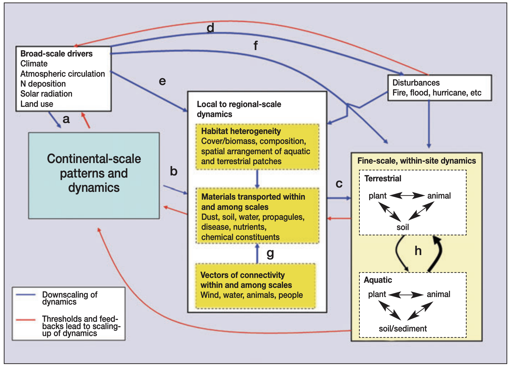
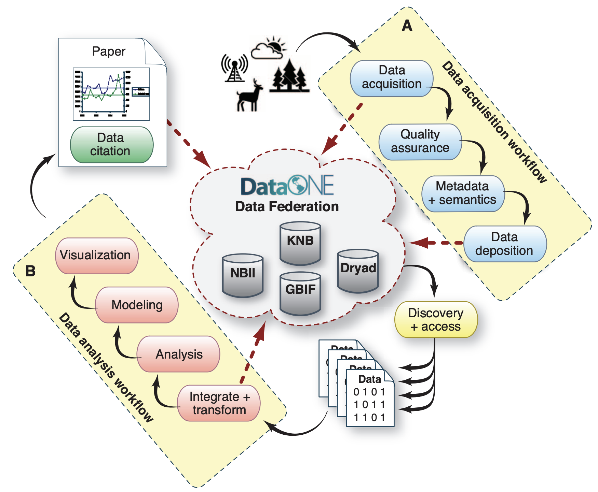
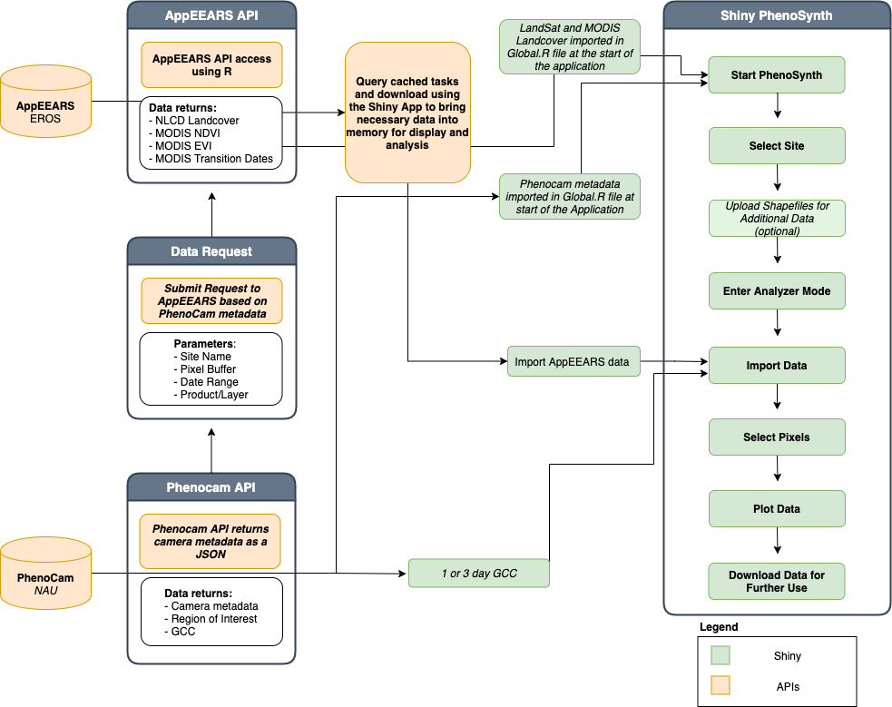

---
editor_options:
  markdown:
    wrap: 72
output: pdf_document
---

# Pre-Course Setup: EcoInformatics Tools {.unnumbered}

The purpose of this course is to train you in key ecoinformatics
practices.

Therefore, as an Ecoinformatician you *need* to be able to:

1.  Pull data from Application Programming Interfaces (APIs)

    -   More on this in Chapter 2

2.  Organize and document your code and data

3.  Version control your code to avoid disaster and make it reproducible

    -   For you, your collaborators, and/or the wider community

4.  Push your code up to public-facing repositories

5.  Pull others code from public repositories.

More thoughts on the benefits and power of reproducibility [can be found
here](https://github.com/katharynduffy/ECOSS_reproducible_science)

To be successful, both in this course and in your careers you will need
these skills. This is why **they are a requirement** for this course. If
you are already using these skills on a daily basis, fantastic! If you
don't feel that you have mastery in the workflows listed above we have
placed lesson links throughout this chapter so that you can build these
skills and be successful in this course.

## Pre-Course Skills & Setup

For the purpose of this course we will largely be using the following
tools to access, pull, and explore data:

1.  R & Rstudio
2.  Git, GitHub, & Atom.io
3.  Markdown & Rmarkdown

As such we will need to install and/or update these tools on your
personal computer *before* our first day of class. While we chose R for
this course, nearly all of the packages and data are fully available and
transferable to Python or other languages. If you'd like to brush up on
your R skills I highly recommend Data Carpentry Boot camp's free [R for
Reproducible Scientific
Analysis](http://swcarpentry.github.io/r-novice-gapminder) course.

### Installing or Updating R

Please check your version of R. You will need R 3.6.0+

How to check your version in R or RStudio if you already have it:

    > version
                   _                           
    platform       x86_64-apple-darwin15.6.0   
    arch           x86_64                      
    os             darwin15.6.0                
    system         x86_64, darwin15.6.0        
    status                                     
    major          3                           
    minor          5.1                         
    year           2018                        
    month          07                          
    day            02                          
    svn rev        74947                       
    language       R                           
    version.string R version 3.5.1 (2018-07-02)
    nickname       Feather Spray  

If you don't already have R or need to update it [do so
here.](https://cran.rstudio.com/)

### Windows R/RStudio Setup

After you have downloaded R, run the .exe file that was just downloaded
Go to the [RStudio Download
page](https://www.rstudio.com/products/rstudio/download/#download) Under
Installers select RStudio X.XX.XXX - e.g. Windows Vista/7/8/10 Double
click the file to install it Once R and RStudio are installed, click to
open RStudio. If you don't get any error messages you are set. If there
is an error message, you will need to re-install the program.

### Mac R/RStudio Setup

After you have downloaded R, double click on the file that was
downloaded and R will install Go to the [RStudio Download
page](https://www.rstudio.com/products/rstudio/download/#download) Under
Installers select RStudio 1.2.1135 - Mac OS X XX.X (64-bit) to download
it. Once it's downloaded, double click the file to install it. Once R
and RStudio are installed, click to open RStudio. If you don't get any
error messages you are set. If there is an error message, you will need
to re-install the program.

## Linux R/RStudio Setup

R is available through most Linux package managers. You can download the
binary files for your distribution from CRAN. Or you can use your
package manager. e.g. for Debian/Ubuntu

      run sudo apt-get install r-base

and for Fedora

      run sudo yum install R

To install RStudio, go to the [RStudio Download
page](https://www.rstudio.com/products/rstudio/download/#download) Under
Installers select the version for your distribution. Once it's
downloaded, double click the file to install it Once R and RStudio are
installed, click to open RStudio. If you don't get any error messages
you are set. If there is an error message, you will need to re-install
the program.

### Install basic packages for this course

You can run the following script to make sure all the required packages
are properly installed on your computer.

```{r required libs, eval = FALSE}

# list of required packages
list.of.packages <- c(
  'data.table',
  'tidyverse',
  'jsonlite',
  'jpeg',
  'png',
  'raster',
  'rgdal',
  'rmarkdown', 
  'knitr'
)

# identify new (not installed) packages
new.packages <- list.of.packages[!(list.of.packages %in% installed.packages()[,"Package"])]

# install new (not installed) packages
if(length(new.packages)) 
  install.packages(new.packages, 
                   repos='http://cran.rstudio.com/')

# load all of the required libraries
sapply(list.of.packages, library, character.only = T)
```

**Note**: On some operating systems, you may need to install the
Geospatial Data Abstraction Library (GDAL). More information about GDAL
can be found from
[here](https://trac.osgeo.org/gdal/wiki/DownloadingGdalBinaries).

## Installing and Setting up Git & Github on Your Machine

For this course you will need: 1. Git installed on your local machine 2.
Very basic bash scripting 3. A linked GitHub account 4. To link RStudio
to git via RStudio or Atom.io

As we will be using these skills constantly, they are a *pre-requisite*
for this course. If you don't yet have these skills it's okay! You can
learn everything that you need to know via the following freely
available resources:

-   [The Unix Shell](http://swcarpentry.github.io/shell-novice)

-   [Version Control with Git](http://swcarpentry.github.io/git-novice)

-   [Happy Git with R](https://happygitwithr.com/)

If you are learning these skills from scratch I estimate that you will
need to devote \~4-6 hours to get set up and comfortable with the
various workflows. Also remember that I have code office hours every
week and that Stack Exchange is your friend.

## Installing Atom

[Atom.io](https://atom.io/) is a powerful and useful text editor for the
following reasons:

1.  It is language agnostic

2.  It fully integrates with git and github + You can use it to
    push/pull/resolve conflicts and write code all in one space.

## Linking RStudio to Git

[Happy Git with R](https://happygitwithr.com/rstudio-git-github.html)
has a fantastic tutorial to help you link Rstudio-Git-Github on your
local machine and push/pull from or to public repositories.

## How we will be Conducting this Course

If you find a **broken link or error** in this course text [submit an
issue on the course github
repository](https://github.com/katharynduffy/katharynduffy.github.io/issues).

At the end of each chapter you will find a set of **Exercises**. At the
end of the assigned chapter you will be expected to submit two files to
the course webdrive:

1.  An [RMarkdown
    file](https://rstudio.com/wp-content/uploads/2015/02/rmarkdown-cheatsheet.pdf)
    with the naming convention: LASTNAME_COURSECODE_Section#.Rmd, and

2.  A knitted .PDF with the same naming convention:
    LASTNAME_COURSECODE_Section#.pdf

To generate these files you have two options:

1.  Click on the pencil and pad logo in the top of this text, copy the
    exercise section code, and drop it into your own .Rmd.

2.  Git clone our [course Github
    Repository](https://github.com/katharynduffy/katharynduffy.github.io),
    navigate to the '\_Exercises' folder, and use that .Rmd as a
    template.

*Note: Exercises submitted in any other format, or those missing
questions will not be graded*

To generate your .PDF to upload, in your RMarkdown file simply push the
'Knit' button at the top of your document.

## Exercises:

### Exercise 0.1: A git introduction

1.  Navigate to our [course
    github](https://github.com/katharynduffy/Environmental-Informatics-Using-Research-Infrastructures-and-their-Data)
2.  `git fork` our repo onto your own personal github account.
3.  `git clone` the repo onto your own personal machine in a place that
    is functional and not temporary *(e.g. not your downloads folder)*.

<!-- -->

    #hints
    cd `Your/Path/Here'
    git clone 'repo HTTPS'

4.  Add 2-3 sentences introducing yourself in the `_Course-participants`
    folder. For example:

<!-- -->

    ***
    Hi, I'm Dr. Katharyn Duffy.  I have a Ph.D in Earth Science from Northern Arizona University.  Over the past two years I've worked as an open-source software engineer in the PhenoCam lab, and now I'm the coding and lab support for your course.  I really look forward to working with all of you!
    ***

5.  Submit a `pull request` to add your introduction to our course
    participants folder.

<!-- -->

    #hints
    git add ...
    git commit ...
    git status....
    git push --set-upstream
    git remote -v
    git remote add upstream...

**Note:** *You may complete these either on the command line or via a
program like Atom.io. If you haven't yet made commits to a remote
repository or submitted pull requests please reference the resources
listed above.*

# Why 'EcoInformatics'?

*Portions of the following introduction were adapted from [Michener &
Jones 2012, Trends in Ecology & Evolution 'Ecoinformatics: supporting
ecology as a data-intensive
science](https://www.cell.com/trends/ecology-evolution/fulltext/S0169-5347(11)00339-9)*

Ecology is increasingly becoming a data-intensive science, relying on
massive amounts of data collected by both remote-sensing platforms and
sensor networks embedded in the environment. New observatory networks,
such as the US National Ecological Observatory Network (NEON), provide
research platforms that enable scientists to examine phenomena across
diverse ecosystem types through access to thousands of sensors
collecting diverse environmental observations. These networks spatially
and temporaly overlap with a number of other networks and
infrastructures ranging from remote sensing, to citizen science, and so
on.

It has been argued that **data-intensive science represents the fourth
scientific paradigm** following the empirical *(i.e. description of
natural phenomena)*, theoretical *(e.g. modeling and generalization)*
and computational *(e.g. simulation)* scientific approaches, and
comprises an approach for unifying theory, experimentation and
simulation.

Ecologists increasingly address questions at broader scales that have
both scientific and societal relevance. For example, the [40 top
priorities for science that can inform conservation and management
policy in the
USA](https://academic.oup.com/bioscience/article/61/4/290/324883) rely
principally on a sound foundation of ecological research, and the
ability to scale knowledge and inter-connect data.

```{r, echo=FALSE}

```

> Continental-scale patterns and dynamics result from climate and people
> as broad-scale drivers interacting with finer-scale vectors that
> redistribute materials within and among linked terrestrial and aquatic
> systems. Climate and land-use change interact with patterns and
> processes at multiple, finer scales (blue arrows). (a) These drivers
> can influence broad-scale patterns directly, and these constraints may
> act to overwhelm heterogeneity and processes at (b) mesoscales and at
> (c) the finer scale of local sites. Broad-scale drivers can also exert
> an indirect impact on broad-scale patterns through their interactions
> with disturbances, including (d) the spread of invasive species, (e)
> pattern--process relationships at meso-scales, or (f) at finer scales
> within a site. Connectivity imparted by the transfer of materials
> occurs both at (g) the meso-scale and at (h) finer scales within sites
> where terrestrial and aquatic systems are connected. These dynamics at
> fine scales can propagate to influence larger spatial extents (red
> arrows). Feedbacks occur throughout the system. The term "drivers"
> refers to both forcing functions that are part of the system and to
> external drivers. [Peters et al.,
> 2008](https://esajournals.onlinelibrary.wiley.com/doi/pdf/10.1890/070098)

**Ecology is also affected by changes that are occurring throughout
science as a whole.**

In particular, scientists, professional societies and research sponsors
are recognizing the value of data as a product of the scientific
enterprise and placing increased emphasis on data stewardship, data
sharing, openness and supporting study repeatability.

```{r, echo=FALSE}

```

> Data on ecological and environmental systems are (A) acquired, checked
> for quality, documented using an acquisition workflow, and then both
> the raw and derived data products are versioned and deposited in the
> DataONE federated data archive (red dashed arrows). Researchers
> discover and access data from the federation and then (B) integrate
> and process the data in an analysis workflow, resulting in derived
> data products, visualizations, and scholarly papers that are in turn
> archived in the data federation (red dashed arrows). Other researchers
> directly cite any of the versioned data, workflows, and visualizations
> that are archived in the DataONE federation. [Richman et al.,
> 2011](https://science.sciencemag.org/content/sci/331/6018/703.full.pdf?casa_token=dDumP2G8NpEAAAAA:8Zrx01SOGOQK79my5SKJdsy5buDQAOd_wVclvlq2eFJZ0MWpeUlHQ7zx3ygkfoQOXSyRLhgx0FDO9V4)

**The changes that are occurring in ecology create challenges with
respect to acquiring, managing and analyzing the large volumes of data
that are collected by scientists worldwide.**

One challenge that is particularly daunting lies in dealing with the
scope of ecology and the enormous variability in scales that is
encountered, spanning microbial community dynamics, communities of
organisms inhabiting a single plant or square meter, and ecological
processes occurring at the scale of the continent and biosphere. The
diversity in scales studied and the ways in which studies are carried
out results in large numbers of [small, idiosyncratic data
sets](https://muse.jhu.edu/article/262029/pdf?casa_token=8ysDn-0aPmAAAAAA:kqtGap8fEbZOvCZE_tcp4sjof-RwcLsiNvk0kk4fpx90jv4npnStRQAPQOb4jb9UC-JINBLlCEw)
that accumulate from the thousands of scientists that collect relevant
biological, ecological and environmental data.

```{r, echo=FALSE}
knitr::include_graphics('./images/data-ontology.png')
```

> A proposed high-level architecture for ecological and environmental
> data management is shown consisting of three primary levels. Data
> stored within distributed data repositories (a) is mediated by
> standard metadata and ontologies (b) to power software tools used by
> scientists and data managers (c). Software applications use
> community-endorsed ontologies and metadata standards from the middle
> level to provide tools that are more effective for publishing,
> querying, integrating and analyzing data. Ontologies are separated
> into framework ontologies and domain-specific extensions, enabling
> contributions from multiple research groups, disciplines and
> individuals. Cross-disciplinary data are maintained in local
> repositories, but made accessible to the broader research community
> through distributed systems based on shared, open protocols (such as
> Metacat). Example repositories include the LTER network, National
> Ecological Observatory Network, United States Geographical Survey and
> SEEK's EarthGrid. [Madin et al.
> 2008,](https://www.sciencedirect.com/science/article/pii/S0169534708000384?casa_token=b8GX-9jkuLwAAAAA:nQtJlhAUGyZdcokpQLEtho3OfVeDUKhENueO0k8H7dWPmPmXOUFYhGR6sKNtT04rEgJNR_HNlqg)

**Ecoinformatics is a framework** that enables scientists to generate
new knowledge through innovative tools and approaches for:

-   discovering,
-   managing,
-   integrating,
-   analyzing,
-   visualizing,
-   and preserving

relevant biological, environmental, and socioeconomic data and
information. Many ecoinformatics solutions have been developed *over the
past decade*, increasing scientists' efficiency and supporting faster
and easier data discovery, integration and analysis; however, many
challenges remain, especially in relation to installing ecoinformatics
practices into mainstream research and education.

And that, course participants, is why we are here.

## The Framework of this Course

Over the duration of this course we will survey a wide array of
observation platforms and networks and build hands-on experience with
the framework of Ecoinformatics. For coherance we will cover the
following overarching themes:

> 1.  Each network's **mission and design**
> 2.  Each network's **spatial design**
>
> -   e.g. opprtunistic vs. planned, citizen science vs. orbital sensors
>
> 3.  The **types of data** that stream from each network
>
> -   e.g. sensors, derived products, metadata
>
> 4.  **How to access that data**
>
> -   e.g. APIs, landing pages, r packages etc.
>
> 5.  Opportunities to interact with or contribute to each network
>
> -   e.g. RFP's coming down the pipeline, internships, and
>     post-doctoral scholar programs.

At the conclusion of each network's section you will be asked to write a
1-page summary reviewing the above framework for each network, and
highlight how it potentially aligns with your own research. These series
of 1-page summaries will then culminate into a final presentation where
you propose to derive your own data product for your own research
*touching upon multiple networks* and *accounting for differences in
spatial footprints, frequency of observations, and important data
cross-walks*.

## Final Course Project: Proposed Derived Data Product

For your final project, you will present a **4-6 minute IGNITE-style
derived data product pitch**, followed by *2-3 minutes of questions from
your audience* (which will include members from the infrastrures we've
covered). Think of this project as your *'sales pitch'* to the research
infrastructure whose data you are using, and/or the scientific community
as a whole. In the IGNITE theme of *'Enlighten us but make it quick'*,
you will construct a series of slides that auto-advance every 30
seconds. Specific instructions for the content of each slide are below.

Ideally, this final presentation will feed upon a number of the
'culmination write-ups' you have conducted over the course of the
semester. Ideally, this derived data product will utilize data from a
number of sources, either covered within this course or external to it.
Ideally, it will also convince your audience that your idea is **novel,
useful,** *and* **possible**.

In order to complete this presentation, you will need to have worked
with the various data products you propose, have an in-depth
understanding of them, and their challenges, along with original, clean,
high-level summary graphics. Further, giving an IGNITE-style
presentation takes practice. IGNITE-style presentations are powerful, as
they keep *you* moving forward, and give your audience a *high-level
understanding* of your topic. We fully recommend rehearsing your
presentation **many times** before giving it live and recording yourself
to learn how you can improve.

Here's an example (of an even faster) ignite talk from one of your
book's authors:

<iframe width="560" height="315" src="https://www.youtube.com/embed/JOlVcHrtl8M" frameborder="0" allow="accelerometer; autoplay; encrypted-media; gyroscope; picture-in-picture" allowfullscreen>

</iframe>

**In your derived data product pitch you will cover these themes:**

1.  The need for the derived data that you are proposing to produce.

2.  What data you will use to derive this product, including the
    justification for this exact data.

3.  The processing pipeline for this product, along with estimates for a
    timeline.

4.  Potential hurdles you will have to overcome.

5.  How this product will serve the infrastructure and/or the scientific
    community.

**Specific slide criteria are as follows:**

**Slide 1:** Title, authors (including contacts at infrastructures
covered if applicable)

**Slide 2:** Justification for the derived data product; the gap or need
that it fills

**Slides 3-x:**

1 slide per data product used including:

-   The exact data product (e.g. NEON data product id and full title)

-   A 1 sentence summary of the data product and its justification for
    this purpose

-   An original, clean, polished high-level plot, gif or .mp4 of the
    data

**Slide x + 1:** A high-level workflow diagram of the processing
pipeline *E.g.: Original data and how you pull it in (API, r-package
etc)*

-   Filtering process using QA/QC or metadata

-   Orthorectification in time or space

Example generated using [draw.io](https://app.diagrams.net/):

```{r, echo=FALSE}

```

**Slide x + 2:** A clean plot of all of the data you mentioned together,
and/or the derived data product itself with a 1 sentence summary

Example:

```{r, echo=FALSE}
knitr::include_graphics('./images/mased_APIS_2.png')
```

**Slide x+3:** Summary: Circle back on how this derived data product
serves your research, the infrastructure, and the wider science
community (no more than 10 words, suggestion: graphics or bullet points)

**Slide x + 4:** Data citations for all data used in proposed derived
data product

**An example slide deck with specific ideas** [**can be found
here**](https://docs.google.com/presentation/d/16vRomNXmdyGrKQ_bdsGaOfbbU-CW_ZGi5-MPhzDBclY/edit?usp=sharing)

**The rubric for your final presentation grade is as follows:**

Presentation meets all requirements and criteria: 60%

Aesthetics and craft of presentation: 10%

Live presentation of materials: 30%
