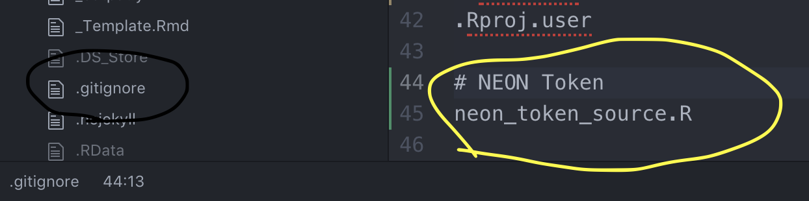
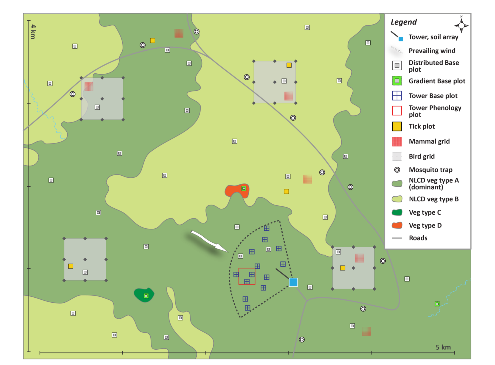
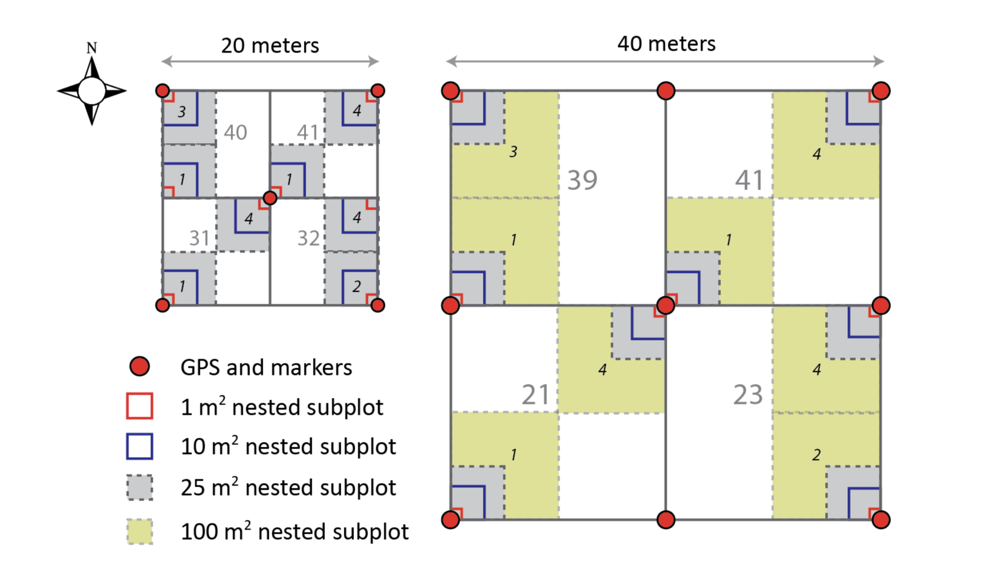
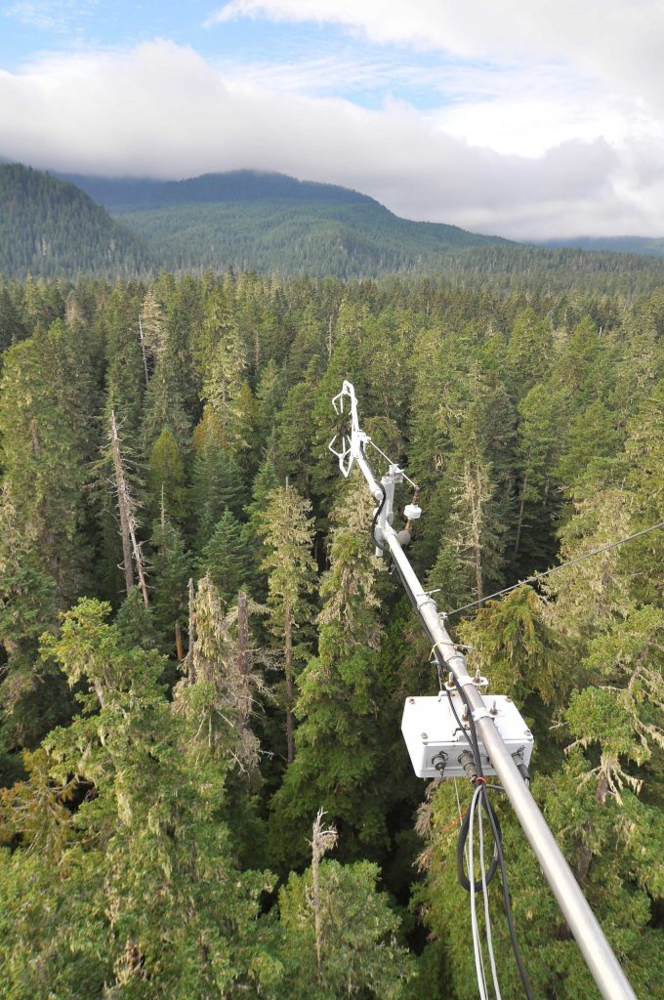

# Introduction to NEON & its Data

> Estimated Time: 2 hours

**Course participants**: As you review this information, please consider
the final course project that you will work on the over this semester.
At the end of this section you will document an initial research
question, or idea and associated data needed to address that question,
that you may want to explore while pursuing this course.

## Learning Objectives

At the end of this activity, you will be able to:

-   Explain the mission of the National Ecological Observatory Network
    (NEON).
-   Explain the how sites are located within the NEON project design.
-   Determine how the different types of data that are collected and
    provided by NEON, and how they align with your own research.
-   Pull NEON data from the API and `neonUtilities` package
    [@R-neonUtilites]

## The NEON Project Mission & Design

To capture ecological heterogeneity across the United States, [NEON's
design](https://www.neonscience.org/neon-project-science-brochure)
divides the continent into 20 statistically different eco-climatic
domains. Each NEON field site is located within an eco-climatic domain.

## The Science and Design of NEON

To gain a better understanding of the broad scope of NEON watch this
4:08 minute long video.

<iframe width="560" height="315" src="https://www.youtube.com/embed/39YrzpxVRF8" frameborder="0" allow="autoplay; encrypted-media" allowfullscreen>

</iframe>

## NEON's Spatial Design

Watch this 4:22 minute video exploring the spatial design of NEON field
sites.

<iframe width="640" height="360" src="https://www.youtube.com/embed/zYr9vII-iu4" frameborder="0" allowfullscreen>

</iframe>

Please read the following page about NEON's Spatial Design:

-   <a href="https://www.neonscience.org/observatory/observatory-blog/primer-neon-sampling-design" target="_blank">
    Read this primer on NEON's Sampling Design</a>

-   <a href="https://www.neonscience.org/field-sites/spatiotemporal-design" target="_blank">
    Read about the different types of field sites - core and
    relocatable</a>

### NEON Samples All 20 Eco-Regions

Explore the NEON Field Site map taking note of the locations of:

1.  Aquatic & terrestrial field sites.
2.  Core & relocatable field sites.

<a class="link--button link--arrow" href="https://www.neonscience.org/field-sites/field-sites-map" target="_blank">
Click here to view the NEON Field Site Map</a>

Explore the NEON field site map. Do the following:

-   Zoom in on a study area of interest to see if there are any NEON
    field sites that are nearby.
-   Click the "More" button in the **upper right hand** corner of the
    map to filter sites by name, site host, domain or state.
-   Select one field site of interest.
    -   Click on the marker in the map.
    -   Then click on the name of the field site to jump to the field
        site landing page.

::: {#ds-dataTip markdown="1"}
<i class="fa fa-star"></i> **Data Tip:** You can download
<a href="https://www.neonscience.org/data/maps-spatial-data" target="_blank">maps,
kmz, or shapefiles of the field sites here</a>.
:::

## How NEON Collects Data

Watch this 3:06 minute video exploring the data that NEON collects.
<iframe width="640" height="360" src="https://www.youtube.com/embed/9IbbdQC1N3A" frameborder="0" allowfullscreen></iframe>

Read the
<a href="https://www.neonscience.org/data-collection" target="_blank">
Data Collection Methods</a> page to learn more about the different types
of data that NEON collects and provides. Then, follow the links below to
learn more about each collection method:

-   <a href="https://www.neonscience.org/data-collection/aquatic-observations" target="_blank">Aquatic
    Observation System (AOS) </a>
-   <a href="https://www.neonscience.org/data-collection/aquatic-sensor-measurements" target="_blank">Aquatic
    Instrument System (AIS) </a>
-   <a href="https://www.neonscience.org/data-collection/flux-tower-measurements" target="_blank">
    Terrestrial Instrument System (TIS) -- Flux Tower </a>
-   <a href="https://www.neonscience.org/data-collection/soil-sensors-measurements" target="_blank">
    Terrestrial Instrument System (TIS) -- Soil Sensors and Measurements
    </a>
-   <a href="https://www.neonscience.org/data-collection/terrestrial-organismal-sampling" target="_blank">
    Terrestrial Organismal System (TOS) </a>
-   <a href="https://www.neonscience.org/data-collection/airborne-remote-sensing" target="_blank">
    Airborne Observation Platform (AOP) </a>

All data collection protocols and processing documents are publicly
available. Read more about
<a href="https://www.neonscience.org/data-collection/protocols-standardized-methods" target="_blank">the
standardized protocols and how to access these documents</a>.

### Specimens & Samples

NEON also collects samples and specimens from which the other data
products are based. These samples are also available for research and
education purposes. Learn more:
<a href="https://www.neonscience.org/data/archival-samples/archival-samples-catalog" target="_blank">
NEON Biorepository</a>.

### Airborne Remote Sensing

Watch this 4:02 minute video to better understand the NEON Airborne
Observation Platform (AOP).

<iframe width="560" height="315" src="https://www.youtube.com/watch?v=etnU4xFMTQo" frameborder="0" allow="autoplay; encrypted-media" allowfullscreen>

</iframe>

::: {markdown="1"}
<i class="fa fa-star"></i> **Data Tip:** NEON also provides support to
your own research including proposals to fly the AOP over other study
sites, a mobile tower/instrumentation setup and others. Learn more here
the
<a href="https://www.neonscience.org/opportunities/assignable-assets" target="_blank">Assignable
Assets programs </a>.
:::

## Accessing NEON Data

NEON data are processed and go through quality assurance quality control
checks at NEON headquarters in Boulder, CO. NEON carefully documents
every aspect of sampling design, data collection, processing and
delivery. This documentation is freely available through the NEON data
portal.

-   Visit the
    <a href="http://data.neonscience.org/home" target="_blank">NEON Data
    Portal - data.neonscience.org </a>
-   Read more about the
    <a href="https://www.neonscience.org/data/data-processing" target="_blank">quality
    assurance and quality control processes for NEON data</a> and how
    the data are processed from raw data to higher level data products.
-   <a href="http://data.neonscience.org/data-products/explore" target="_blank">Explore
    NEON Data Products</a>. On the page for each data product in the
    catalog you can find the basic information about the product, find
    the data collection and processing protocols, and link directly to
    downloading the data.
-   Additionally, some types of NEON data are also available through the
    data portals of other organizations. For example,
    <a href="http://www.ibol.org/dna-barcodes-for-neons-terrestrial-insects/" target="_blank">
    NEON Terrestrial Insect DNA Barcoding Data</a> is available through
    the
    <a href="http://www.boldsystems.org/index.php/databases" target="_blank">
    Barcode of Life Datasystem (BOLD)</a>. Or NEON phenocam images are
    available from the
    <a href="https://phenocam.sr.unh.edu/webcam/network/search/?sitename=neon&type=&primary_vegtype=&dominant_species=&active=1&fluxdata=1" target="_blank">Phenocam
    network site</a>. More details on where else the data are available
    from can be found in the Availability and Download section on the
    Product Details page for each data product (visit
    <a href="http://data.neonscience.org/data-products/explore" target="_blank">Explore
    Data Products</a> to access individual Product Details pages).

### Pathways to access NEON Data

There are several ways to access data from NEON:

1.  Via the
    <a href="http://data.neonscience.org/home" target="_blank">NEON data
    portal</a>. Explore and download data. Note that much of the tabular
    data is available in zipped .csv files for each month and site of
    interest. To combine these files, use the neonUtilities package
    (<a href="https://www.neonscience.org/neonDataStackR" target="_blank">R
    tutorial</a>,
    <a href="https://www.neonscience.org/neon-utilities-python" target="_blank">Python
    tutorial</a>).\
2.  Use R or Python to programmatically access the data. NEON and
    community members have created code packages to directly access the
    data through an API. Learn more about the available resources by
    reading the
    <a href="https://www.neonscience.org/data/code-resources" target="_blank">Code
    Resources page</a> or visiting the
    <a href="https://github.com/NEONScience" target="_blank">NEONScience
    GitHub repo</a>.\
3.  Using the
    <a href="http://data.neonscience.org/data-api" target="_blank">NEON
    API</a>. Access NEON data directly using a custom API call.
4.  Access NEON data through partner's portals. Where NEON data directly
    overlap with other community resources, NEON data can be accessed
    through the portals. Examples include Phenocam, BOLD, Ameriflux, and
    others. You can learn more in the documentation for individual data
    products.

## Hands on: Accessing NEON Data & User Tokens

### Via the NEON API, with your User Token

NEON data can be downloaded from either the NEON Data Portal or the NEON
API. When downloading from the Data Portal, you can create a user
account. Read about the benefits of an account on the
<a href="https://www.neonscience.org/data/about-data/data-portal-user-accounts" target="_blank">User
Account page</a>. You can also use your account to create a token for
using the API. Your token is unique to your account, so don't share it.

While using a token is optional in general, it is required for this
course. Using a token when downloading data via the API, including when
using the neonUtilities package, links your downloads to your user
account, as well as enabling faster download speeds. For more
information about token usage and benefits, see the
<a href="https://data.neonscience.org/data-api" target="_blank">NEON API
documentation</a> page.

For now, in addition to faster downloads, using a token helps NEON to
track data downloads. Using **anonymized** user information, they can
then calculate data access statistics, such as which data products are
downloaded most frequently, which data products are downloaded in groups
by the same users, and how many users in total are downloading data.
This information helps NEON to evaluate the growth and reach of the
observatory, and to advocate for training activities, workshops, and
software development.

Tokens can (and should) be used whenever you use the NEON API. In this
tutorial, we'll focus on using tokens with the neonUtilities R package.

::: {#ds-objectives markdown="1"}
### Objectives

After completing this section, you will be able to:

-   Create a NEON API token
-   Use your token when downloading data with neonUtilities

### Things You'll Need To Complete This Tutorial

You will need a version of R (3.4.1 or higher) and `RStudio` loaded on
your computer.

### Install R Packages

1.  **neonUtilities:** `install.packages("neonUtilities")`

## Additional Resources

2.  NEON <a href="http://data.neonscience.org" target="_blank"> Data
    Portal </a>
3.  <a href="https://github.com/NEONScience" target="_blank">NEONScience
    GitHub Organization</a>
4.  <a href="https://www.neonscience.org/neonDataStackR" target="_blank">neonUtilities
    tutorial</a>
:::

If you've never downloaded NEON data using the neonUtilities package
before, we recommend starting with the
<a href="https://www.neonscience.org/download-explore-neon-data" target="_blank">Download
and Explore tutorial</a> before proceeding with this tutorial.

In the next sections, we'll get an API token from the NEON Data Portal,
and then use it in neonUtilities when downloading data.

### Get a NEON API Token

The first step is create a NEON user account, if you don't have one.
Follow the instructions on the
<a href="https://www.neonscience.org/data/about-data/data-portal-user-accounts" target="_blank">Data
Portal User Accounts</a> page. If you do already have an account, go to
<a href="https://data.neonscience.org/home" target="_blank">the NEON
Data Portal</a>, sign in, and go to your My Account profile page.

Once you have an account, you can create an API token for yourself. At
the bottom of the My Account page, you should see this bar:

```{r,echo=FALSE}
knitr::include_graphics('./images/get-api-token-button.png')
```

Click the 'GET API TOKEN' button. After a moment, you should see this:

```{r,echo=FALSE}
knitr::include_graphics('./images/account-page-token-view.png')
```

Click on the Copy button to copy your API token to the clipboard.

### Use the API token in neonUtilities

In the next section, we'll walk through saving your token somewhere
secure but accessible to your code. But first let's try out using the
token the easy way.

First, we need to load the `neonUtilities` package and set the working
directory:

```{r loadStuff, eval=FALSE, comment=NA}
# install neonUtilities - can skip if already installed, but
# API tokens are only enabled in neonUtilities v1.3.4 and higher
# if your version number is lower, re-install
install.packages("neonUtilities")
# load neonUtilities
library(neonUtilities)
# set working directory
wd <- "~/data" # this will depend on your local machine
setwd(wd)
```

NEON API tokens are very long, so it would be annoying to keep pasting
the entire text string into functions. Assign your token an object name:

```{r nameToken, eval=FALSE, comment=NA}
NEON_TOKEN <- "PASTE YOUR TOKEN HERE"
```

Now we'll use the `loadByProduct()` function to download data. Your API
token is entered as the optional `token` input parameter. For this
example, we'll download Plant foliar traits (DP1.10026.001).

```{r getCFC, eval=FALSE, comment=NA, cache=TRUE}
foliar <- loadByProduct(dpID="DP1.10026.001", site="all", 
                        package="expanded", check.size=F,
                        token=NEON_TOKEN)
```

You should now have data saved in the `foliar` object; the API silently
used your token. If you've downloaded data without a token before, you
may notice this is faster!

This format applies to all `neonUtilities` functions that involve
downloading data or otherwise accessing the API; you can use the `token`
input with all of them. For example, when downloading remote sensing
data:

```{r getAOP, eval=FALSE, comment=NA}
chm <- byTileAOP(dpID="DP3.30015.001", site="WREF", 
                 year=2017, check.size=F,
                 easting=c(571000,578000), 
                 northing=c(5079000,5080000), 
                 savepath=wd,
                 token=NEON_TOKEN)
```

### Token management for open code

Your API token is unique to your account, so don't share it!

If you're writing code that will be shared with colleagues or available
publicly, such as in a GitHub repository or supplemental materials of a
published paper, you can't include the line of code above where we
assigned your token to `NEON_TOKEN`, since your token is fully visible
in the code there. Instead, you'll need to save your token locally on
your computer, and pull it into your code without displaying it. There
are a few ways to do this, we'll show two options here.

-   Option 1: Save the token in a local file, and `source()` that file
    at the start of every script. This is fairly simple but requires a
    line of code in every script.

-   Option 2: Add the token to a `.Renviron` file to create an
    environment variable that gets loaded when you open R. This is a
    little harder to set up initially, but once it's done, it's done
    globally, and it will work in every script you run.

#### Option 1: Save token in a local file

Open a new, empty R script (.R). Put a single line of code in the
script:

```{r scriptToSource, eval=FALSE, comment=NA}
NEON_TOKEN <- "PASTE YOUR TOKEN HERE"
```

Save this file within your current R project and call the file
`neon_token_source.R`. So that you don't accidently push your token up
to GitHub, move over to the command line or Atom.io and add it to your
`.gitignore` file:

```{r}

```

Now, whenever you want to pull NEON data via the API, at the start of
any analysis you would place this line of code:

```{r source, eval=FALSE, comment=NA}
source('neon_token_source.R')
```

Then you'll be able to use `token=NEON_TOKEN` when you run
`neonUtilities` functions, and you can share your code without
accidentally sharing your token.

#### Option 2: Save your toekn to your R environment

Instructions for finding and editing your .Renviron can be found in this
tutorial in [NEON's Data Tutorials
section.](https://www.neonscience.org/neon-api-tokens-tutorial)

## Hands on: NEON TOS Data

### Pull in Tree Data from NEON's TOS and investigate relationships

> Adapted from [Claire Lunch's 'Compare tree height measured from the
> ground to a Lidar-based Canopy Height
> Model'](https://www.neonscience.org/tree-heights-veg-structure-chm)
> tutorial

Later in this course we will be working with NEON's LiDAR-based Canopy
Height Model (CHM) data from their extensive Airborne Observation
Platform (AOP). In this section we will pull in **DP1.10098.001, Woody
plant vegetation structure** from NEON's Terrestrial Observation
Sampling (TOS) data and explore the data, from requesting it to plotting
it.

```{r, echo=FALSE}

```

> Generalized TOS sampling schematic, showing the placement of
> Distributed, Tower, and Gradient Plots from the [NEON GUIDE TO WOODY
> PLANT VEGETATION STRUCTURE,
> 2018](https://www.google.com/url?sa=i&url=http%3A%2F%2Fdata.neonscience.org%2Fapi%2Fv0%2Fdocuments%2FNEON_vegStructure_userGuide_vA&psig=AOvVaw32PujoEegMkzIWVuL_Scwn&ust=1597765301177000&source=images&cd=vfe&ved=0CA0QjhxqFwoTCOjFiN_JousCFQAAAAAdAAAAABAU)

The [vegetation structure
data](https://data.neonscience.org/data-products/DP1.10098.001) are
collected by by field staff on the ground. This data product contains
the quality-controlled, native sampling resolution data from in-situ
measurements of live and standing dead woody individuals and shrub
groups, from all terrestrial NEON sites with qualifying woody
vegetation. The exact measurements collected per individual depend on
growth form, and these measurements are focused on enabling biomass and
productivity estimation, estimation of shrub volume and biomass, and
calibration / validation of multiple NEON airborne remote-sensing data
products. In general, comparatively large individuals that are visible
to remote-sensing instruments are mapped, tagged and measured, and other
smaller individuals are tagged and measured but not mapped. Smaller
individuals may be subsampled according to a nested subplot approach in
order to standardize the per plot sampling effort. Structure and mapping
data are reported per individual per plot; sampling metadata, such as
per growth form sampling area, are reported per plot.

```{r, echo=FALSE}

```

> Illustration of a 20 m x 20 m Distributed/Gradient/Tower base plot
> (left), a 40 m x 40 m Tower base plot (right), and associated nested
> subplots used for measuring woody stem vegetation. Locations of
> subplots are denoted with plain text numbers, and locations of nested
> subplots are denoted with italic numbers from the [NEON GUIDE TO WOODY
> PLANT VEGETATION STRUCTURE,
> 2018](https://www.google.com/url?sa=i&url=http%3A%2F%2Fdata.neonscience.org%2Fapi%2Fv0%2Fdocuments%2FNEON_vegStructure_userGuide_vA&psig=AOvVaw32PujoEegMkzIWVuL_Scwn&ust=1597765301177000&source=images&cd=vfe&ved=0CA0QjhxqFwoTCOjFiN_JousCFQAAAAAdAAAAABAU)

For the purpose of this hands-on activity we will be using data from the
Wind River Experimental Forest NEON field site located in Washington
state. The predominant vegetation at that site is tall evergreen
conifers.

*Note: this is also a core site for many other networks such as
[AmeriFlux and
FLUXNET](https://ameriflux.lbl.gov/sites/siteinfo/US-Wrc), which we will
cover later*.

```{r, echo=FALSE}

```

> Image of the Wind River Crane Flux Tower from
> [Ameriflux](https://ameriflux.lbl.gov/sites/siteinfo/US-Wrc)

Let's begin by:

1.  Installing the `geoNEON` package
2.  Making sure that the packages that we need are loaded, and
3.  Supressing 'strings as factors' in R, as factors make all sorts of
    functions in R 'cranky'.

```{r}
options(stringsAsFactors=F)

#install.packages("devtools") #uncomment if you don't yet have devtools
#devtools::install_github("NEONScience/NEON-geolocation/geoNEON")

library(neonUtilities)
library(geoNEON)
library(sp)
```

Now lets begin by pulling in the **vegetation structure data** using the
`loadByProduct()` function in the `neonUtilities` package. Inputs needed
to the function are:

-   dpID: data product ID; (woody vegetation structure = DP1.10098.001

-   site: 4-letter site code; Wind River = WREF

-   package: basic or expanded; we'll begin with a `basic` here

```{r, echo=FALSE}
source('/Users/kdw223/Research/Environmental-Informatics-Using-Research-Infrastructures-and-their-Data/neon_token_source.R')
```

```{r, cache=TRUE}
veglist <- loadByProduct(dpID="DP1.10098.001", site="WREF", package="basic", check.size=FALSE, token = NEON_TOKEN)

```

Now, use the `getLocTOS()` function in the `geoNEON` package to get
precise locations for the tagged plants. You can refer to the package
documentation for more details.

```{r, cache=TRUE}
vegmap <- getLocTOS(veglist$vst_mappingandtagging, 
                          "vst_mappingandtagging")
```

Now we need to merge the mapped locations of individuals (the
`vst_mappingandtagging table`) with the annual measurements of height,
diameter, etc (the `vst_apparentindividual table`). The two tables join
based on *individualID*, the identifier for each tagged plant, but we'll
include namedLocation, domainID, siteID, and plotID in the list of
variables to merge on, to avoid ending up with duplicates of each of
those columns. Refer to the variables table and to the Data Product User
Guide for Woody plant vegetation structure for more information about
the contents of each data table.

```{r}
veg <- merge(veglist$vst_apparentindividual, vegmap, 
             by=c("individualID","namedLocation",
                  "domainID","siteID","plotID"))
```

What did you just pull in? Are you sure you know what you're working
with? A **best practice** is to *always* do a quick visualization to
make sure that you have the right data and that you understand its
spread:

```{r}
symbols(veg$adjEasting[which(veg$plotID=="WREF_075")], 
        veg$adjNorthing[which(veg$plotID=="WREF_075")], 
        circles=veg$stemDiameter[which(veg$plotID=="WREF_075")]/100/2, 
        inches=F, xlab="Easting", ylab="Northing")
```

A key component of any measurement, and therefore a reoccuring theme in
this course, is an **estimate of uncertainty**. Let's overlay estimates
of uncertainty for the location of each stem in blue:

```{r}
symbols(veg$adjEasting[which(veg$plotID=="WREF_075")], 
        veg$adjNorthing[which(veg$plotID=="WREF_075")], 
        circles=veg$stemDiameter[which(veg$plotID=="WREF_075")]/100/2, 
        inches=F, xlab="Easting", ylab="Northing")
symbols(veg$adjEasting[which(veg$plotID=="WREF_075")], 
        veg$adjNorthing[which(veg$plotID=="WREF_075")], 
        circles=veg$adjCoordinateUncertainty[which(veg$plotID=="WREF_075")], 
        inches=F, add=T, fg="lightblue")
```

## Intro to NEON Exercises Part 1

### Exercise 2.1: NEON TOS Vegetation Coding Lab

#### Part 1: Sign up for and Use an NEON API Token:

1.  Submit via .Rmd and .pdf a simple script that uses a *HIDDEN* token
    to access NEON data.

Example:

```{r, cache=TRUE}
source('neon_token_source.R')
veglist <- loadByProduct(dpID="DP1.10098.001", site="WREF", package="basic", check.size=FALSE, token = NEON_TOKEN)
summary(veglist)
```

#### Part 2: Further Investigation of NEON TOS Vegetation Structure Data

**Suggested Timing: Complete this exercise before our next class
session**

*In the following section all demonstration code uses the `iris` dataset
for R as examples. In this exercise the `iris` data is merely used for
example code to get your started, you will complete all plots and models
using the NEON TOS vegetation structure data*

1.  Convert the above diameter plot into a ggplot: If you need some
    refreshers on ggplot [Derek Sonderegger's Introductory Data Science
    using R: Graphing Part
    II](https://dereksonderegger.github.io/444/14-graphing-part-ii.html)
    is a wonderful resource. I've pulled some of his plotting examples
    here.

```{r}
library(ggplot2)
print ('your code here')
```

2.  Set the color your circles to be a function of each species:

```{r}
#hints:
data("iris")
ggplot(iris, aes(x=Sepal.Length, y=Petal.Length, color=Species)) +
  geom_point() 
```

3.  Generate a histogram of tree heights for each plot. Color your
    stacked bar as a function of each species:

```{r}
#hints for faceting: 
ggplot(iris, aes(x=Sepal.Length, y=Petal.Length)) +
  geom_point() +
  facet_grid( . ~ Species )
```

4.  Use `dplyr` to remove dead trees:

```{r}
library(dplyr)
#hints:
#veg=veg%>%
#filter(..... !=....)

```

5.  Create a simple linear model that uses Diameter at Breast Height
    (DBH) and height to predict allometries. Print the summary
    information of your model:

```{r, eval=FALSE}
#hints
mdl=lm(Some_diameter + Some_height, data=something) #Question: looking at the metadata which 'height' and 'diameter' variables should you use?
print(mdl)
```

6.  Plot your linear model:

```{r}
# hints:
mdl <- lm( Petal.Length ~ Sepal.Length * Species, data = iris ) 
iris <- iris %>%
  select( -matches('fit'), -matches('lwr'), -matches('upr') ) %>%
  cbind( predict(mdl, newdata=., interval='confidence') )       

head(iris, n=3)
ggplot(iris, aes(x=Sepal.Length, y=Petal.Length, color=Species)) +
  geom_point() +
  geom_line( aes(y=fit) ) +
  geom_ribbon( aes( ymin=lwr, ymax=upr, fill=Species), alpha=.3 )   # alpha is the ribbon transparency
```

7.  Answer the following questions:

-   What do you think about your simile linear model? What are its
    limitations?
-   How many `unique` species are present at `WREF`?
-   What are the `top_5` trees based on height? Diameter?
-   What proportion of sampled trees are dead?

## Hands on: Pulling NEON Data via the API

This section covers pulling data from the NEON API or Application
Programming Interface using R and the R package httr, but the core
information about the API is applicable to other languages and
approaches.

**As a reminder, there are 3 basic categories of NEON data:**

1.  Observational - Data collected by a human in the field, or in an
    analytical laboratory, e.g. beetle identification, foliar isotopes
2.  Instrumentation - Data collected by an automated, streaming sensor,
    e.g. net radiation, soil carbon dioxide
3.  Remote sensing - Data collected by the airborne observation
    platform, e.g. LIDAR, surface reflectance

This lab covers all three types of data, it is required to complete
these sections in order and not skip ahead, since the query principles
are explained in the first section, on observational data.

::: {markdown="1"}
### Objectives

After completing this activity, you will be able to:

-   Pull observational, instrumentation, and geolocation data from the
    NEON API.
-   Transform API-accessed data from JSON to tabular format for
    analyses.

### Things You'll Need To Complete This Section

To complete this tutorial you will need the most current version of R
and, preferably, RStudio loaded on your computer.

#### Install R Packages

-   **httr:** `install.packages("httr")`
-   **jsonlite:** `install.packages("jsonlite")`
-   **dplyr:** `install.packages("dplyr")`
-   **devtools:** `install.packages("devtools")`
-   **downloader:** `install.packages("downloader")`
-   **geoNEON:**
    `devtools::install_github("NEONScience/NEON-geolocation/geoNEON")`
-   **neonUtilities:**
    `devtools::install_github("NEONScience/NEON-utilities/neonUtilities")`

Note, you must have devtools installed & loaded, prior to loading
geoNEON or neonUtilities.

#### Additional Resources

-   <a href="http://data.neonscience.org/data-api" target="_blank">Webpage
    for the NEON API</a>
-   <a href="https://github.com/NEONScience/neon-data-api" target="_blank">GitHub
    repository for the NEON API</a>
-   <a href="https://github.com/ropenscilabs/nneo" target="_blank">
    ROpenSci wrapper for the NEON API</a> (not covered in this tutorial)
:::

## What is an API?

<iframe width="560" height="315" src="https://www.youtube.com/embed/s7wmiS2mSXY" frameborder="0" allow="accelerometer; autoplay; encrypted-media; gyroscope; picture-in-picture" allowfullscreen>

</iframe>

> The following material was adapted from: "Using the NEON API in R"
> description: "Tutorial for getting data from the NEON API, using R and
> the R package httr" dateCreated: 2017-07-07 authors: [Claire K. Lunch]
> contributors: [Christine Laney, Megan A. Jones]

If you are unfamiliar with the concept of an API, think of an API as a
'middle person' that provides a communication path for a software
application to obtain information from a digital data source. APIs are
becoming a very common means of sharing digital information. Many of the
apps that you use on your computer or mobile device to produce maps,
charts, reports, and other useful forms of information pull data from
multiple sources using APIs. In the ecological and environmental
sciences, many researchers use APIs to programmatically pull data into
their analyses. (Quoted from the NEON Observatory Blog story:
<a href="https://www.neonscience.org/observatory/observatory-blog/api-data-availability-viewer-now-live-neon-data-portal" target ="_blank">
API and data availability viewer now live on the NEON data portal</a>.)

There are actually many types or constructions of APIs. If you're
interested you can [read a little more about them
here](https://stoplight.io/api-types/)

### Anatomy of an API call

An example API call:
<http://data.neonscience.org/api/v0/data/DP1.10003.001/WOOD/2015-07>

This includes the base URL, endpoint, and target.

#### Base URL:

[<http://data.neonscience.org/api/v0>]{style="color:#A00606;font-weight:bold"}[/data/DP1.10003.001/WOOD/2015-07]{style="color:#A2A4A3"}

Specifics are appended to this in order to get the data or metadata
you're looking for, but all calls to this API will include the base URL.
For the NEON API, this is <http://data.neonscience.org/api/v0> -- not
clickable, because the base URL by itself will take you nowhere!

#### Endpoints:

[<http://data.neonscience.org/api/v0>]{style="color:#A2A4A3"}[/data]{style="color:#A00606;font-weight:bold"}[/DP1.10003.001/WOOD/2015-07]{style="color:#A2A4A3"}

What type of data or metadata are you looking for?

-   **\~/products** Information about one or all of NEON's data products

-   **\~/sites** Information about data availability at the site
    specified in the call

-   **\~/locations** Spatial data for the NEON locations specified in
    the call

-   **\~/data** Data! By product, site, and date (in monthly chunks).

### Targets:

[<http://data.neonscience.org/api/v0/data>]{style="color:#A2A4A3"}[/DP1.10003.001/WOOD/2015-07]{style="color:#A00606;font-weight:bold"}

The specific data product, site, or location you want to get data for.

### Observational data (OS)

Which product do you want to get data for? Consult the
<a href="http://data.neonscience.org/data-products/explore" target="_blank">Explore
Data Products page</a>.

We'll pick Breeding landbird point counts, DP1.10003.001

First query the products endpoint of the API to find out which sites and
dates have data available. In the products endpoint, the target is the
numbered identifier for the data product:

```{r os-avail-query}

# Load the necessary libraries
library(httr)
library(jsonlite)
library(dplyr, quietly=T)
library(downloader)

# Request data using the GET function & the API call
req <- GET("http://data.neonscience.org/api/v0/products/DP1.10003.001")
req
```

The object returned from `GET()` has many layers of information.
Entering the name of the object gives you some basic information about
what you downloaded.

The `content()` function returns the contents in the form of a highly
nested list. This is typical of JSON-formatted data returned by APIs. We
can use the `names()` function to view the different types of
information within this list.

```{r os-query-contents}

# View requested data
req.content <- content(req, as="parsed")
names(req.content$data)

```

You can see all of the information by running the line
`print(req.content)`, but this will result in a very long printout in
your console. Instead, you can view list items individually. Here, we
highlight a couple of interesting examples:

```{r os-query-contents-examples}

# View Abstract
req.content$data$productAbstract

# View Available months and associated URLs for Onaqui, Utah - ONAQ
req.content$data$siteCodes[[27]]

```

To get a more accessible view of which sites have data for which months,
you'll need to extract data from the nested list. There are a variety of
ways to do this, in this tutorial we'll explore a couple of them. Here
we'll use `fromJSON()`, in the jsonlite package, which doesn't fully
flatten the nested list, but gets us the part we need. To use it, we
need a text version of the content. The text version is not as human
readable but is readable by the `fromJSON()` function.

```{r os-query-fromJSON}
# make this JSON readable -> "text"
req.text <- content(req, as="text")

# Flatten data frame to see available data. 
avail <- jsonlite::fromJSON(req.text, simplifyDataFrame=T, flatten=T)
avail

```

The object contains a lot of information about the data product,
including:

-   keywords under `$data$keywords`,
-   references for documentation under `$data$specs`,
-   data availability by site and month under `$data$siteCodes`, and
-   specific URLs for the API calls for each site and month under
    `$data$siteCodes$availableDataUrls`.

We need `$data$siteCodes` to tell us what we can download.
`$data$siteCodes$availableDataUrls` allows us to avoid writing the API
calls ourselves in the next steps.

```{r os-query-avail-data}

# get data availability list for the product
bird.urls <- unlist(avail$data$siteCodes$availableDataUrls)
length(bird.urls) #total number of URLs
bird.urls[1:10] #show first 10 URLs available

```

These are the URLs showing us what files are available for each month
where there are data.

Let's look at the bird data from Woodworth (WOOD) site from July 2015.
We can do this by using the above code but now specifying which
site/date we want using the `grep()` function.

Note that if there were only one month of data from a site, you could
leave off the date in the function. If you want data from more than one
site/month you need to iterate this code, GET fails if you give it more
than one URL.

```{r os-query-bird-data-urls, cache=TRUE}
# get data availability for WOOD July 2015
brd <- GET(bird.urls[grep("WOOD/2015-07", bird.urls)])
brd.files <- jsonlite::fromJSON(content(brd, as="text"))

# view just the available data files 
brd.files$data$files

```

In this output, `name` and `url` are key fields. It provides us with the
names of the files available for this site and month, and URLs where we
can get the files. We'll use the file names to pick which ones we want.

The available files include both **data** and **metadata**, and both the
**basic** and **expanded** data packages. Typically the expanded package
includes additional quality or uncertainty data, either in additional
files or additional fields than in the basic files. Basic and expanded
data packages are available for most NEON data products (some only have
basic). Metadata are described by file name below.

The format for most of the file names is:

**NEON.[domain number].[site code].[data product ID].[file-specific
name]. [date of file creation]**

Some files omit the domain and site, since they're not specific to a
location, like the data product readme. The date of file creation uses
the ISO6801 format, in this case 20170720T182547Z, and can be used to
determine whether data have been updated since the last time you
downloaded.

Available files in our query for July 2015 at Woodworth are all of the
following (leaving off the initial NEON.D09.WOOD.10003.001):

-   **\~.2015-07.expanded.20170720T182547Z.zip:** zip of all files in
    the expanded package

-   **\~.brd_countdata.2015-07.expanded.20170720T182547Z.csv:** count
    data table, expanded package version: counts of birds at each point

-   **\~.brd_perpoint.2015-07.expanded.20170720T182547Z.csv:** point
    data table, expanded package version: metadata at each observation
    point

-   **NEON.Bird Conservancy of the Rockies.brd_personnel.csv:**
    personnel data table, accuracy scores for bird observers

-   **\~.2015-07.basic.20170720T182547Z.zip:** zip of all files in the
    basic package

-   **\~.brd_countdata.2015-07.basic.20170720T182547Z.csv:** count data
    table, basic package version: counts of birds at each point

-   **\~.brd_perpoint.2015-07.basic.20170720T182547Z.csv:** point data
    table, basic package version: metadata at each observation point

-   **NEON.DP1.10003.001_readme.txt:** readme for the data product (not
    specific to dates or location). Appears twice in the list, since
    it's in both the basic and expanded package

-   **\~.20150101-20160613.xml:** Ecological Metadata Language (EML)
    file. Appears twice in the list, since it's in both the basic and
    expanded package

-   **\~.validation.20170720T182547Z.csv:** validation file for the data
    product, lists input data and data entry rules. Appears twice in the
    list, since it's in both the basic and expanded package

-   **\~.variables.20170720T182547Z.csv:** variables file for the data
    product, lists data fields in downloaded tables. Appears twice in
    the list, since it's in both the basic and expanded package

We'll get the data tables for the point data and count data in the basic
package. The list of files doesn't return in the same order every time,
so we won't use position in the list to select. Plus, we want code we
can re-use when getting data from other sites and other months. So we
select files based on the data table name and the package name.

```{r os-get-bird-data, cache=TRUE}

# Get both files
brd.count <- read.delim(brd.files$data$files$url
                        [intersect(grep("countdata", 
                                        brd.files$data$files$name),
                                    grep("basic", 
                                         brd.files$data$files$name))], 
                        sep=",")

brd.point <- read.delim(brd.files$data$files$url
                        [intersect(grep("perpoint", 
                                        brd.files$data$files$name),
                                    grep("basic", 
                                         brd.files$data$files$name))], 
                        sep=",")

```

Now we have the data and can access it in R. Just to show that the files
we pulled have actual data in them, let's make a quick graphic:

```{r os-plot-bird-data, cache=TRUE}
# Cluster by species 
clusterBySp <- brd.count %>%
  dplyr::group_by(scientificName) %>%
  dplyr::summarise(total=sum(clusterSize, na.rm=T))

# Reorder so list is ordered most to least abundance
clusterBySp <- clusterBySp[order(clusterBySp$total, decreasing=T),]

# Plot
barplot(clusterBySp$total, names.arg=clusterBySp$scientificName, 
        ylab="Total", cex.names=0.5, las=2)

```

Wow! There are lots of *Agelaius phoeniceus* (Red-winged Blackbirds) at
WOOD in July.

### Instrumentation data (IS)

The process is essentially the same for sensor data. We'll do the same
series of queries for Soil Temperature, DP1.00041.001. Let's use data
from Moab in June 2017 this time.

```{r soil-data, cache=TRUE}
# Request soil temperature data availability info
req.soil <- GET("http://data.neonscience.org/api/v0/products/DP1.00041.001")

# make this JSON readable
# Note how we've change this from two commands into one here
avail.soil <- jsonlite::fromJSON(content(req.soil, as="text"), simplifyDataFrame=T, flatten=T)

# get data availability list for the product
temp.urls <- unlist(avail.soil$data$siteCodes$availableDataUrls)

# get data availability from location/date of interest
tmp <- GET(temp.urls[grep("MOAB/2017-06", temp.urls)])
tmp.files <- jsonlite::fromJSON(content(tmp, as="text"))
length(tmp.files$data$files$name) # There are a lot of available files
tmp.files$data$files$name[1:10]   # Let's print the first 10

```

These file names start and end the same way as the observational files,
but the middle is a little more cryptic. The structure from beginning to
end is:

**NEON.[domain number].[site code].[data product ID].00000. [soil plot
number].[depth].[averaging interval].[data table name].
[year]-[month].[data package].[date of file creation]**

So
**"NEON.D13.MOAB.DP1.00041.001.003.507.030.ST_30_minute.2017-06.expanded.20200620T070859Z.csv"**
is the:

-   NEON (`NEON.`)
-   Domain 13 (`.D13.`)
-   Moab field site (`.MOAB.`)
-   soil temperature data (`.DP1.00041.001.`)
-   collected in Soil Plot 2, (`.002.`)
-   at the 7th depth below the surface (`.507.`)
-   and reported as a 30-minute mean of (`.030.` and `.ST_30_minute.`)
-   only for the period of June 2017 (`.2017-06.`)
-   and provided in a expanded data package (`.basic.`)
-   published on June 20th, 2020 (`.0200620T070859Z.`).

More information about interpreting file names can be found in the
readme that accompanies each download.

Let's get data (and the URL) for only the 2nd depth described above by
selecting `002.502.030` and the word `basic` in the file name.

Go get it:

```{r os-get-soil-data, cache=TRUE}

soil.temp <- read.delim(tmp.files$data$files$url
                        [intersect(grep("002.502.030", 
                                        tmp.files$data$files$name),
                                   grep("basic", 
                                        tmp.files$data$files$name))], 
                        sep=",")

```

Now we have the data and can use it to conduct our analyses. To take a
quick look at it, let's plot the mean soil temperature by date.

```{r os-plot-soil-data}
# plot temp ~ date
plot(soil.temp$soilTempMean~as.POSIXct(soil.temp$startDateTime, 
                                       format="%Y-%m-%d T %H:%M:%S Z"), 
     pch=".", xlab="Date", ylab="T")

```

As we'd expect we see daily fluctuation in soil temperature.

### Remote sensing data (AOP)

Again, the process of determining which sites and time periods have
data, and finding the URLs for those data, is the same as for the other
data types. We'll go looking for High resolution orthorectified camera
imagery, DP1.30010.001, and we'll look at the flight over San Joaquin
Experimental Range (SJER) in March 2017.

```{r aop-data, cache=TRUE}
# Request camera data availability info
req.aop <- GET("http://data.neonscience.org/api/v0/products/DP1.30010.001")

# make this JSON readable
# Note how we've changed this from two commands into one here
avail.aop <- jsonlite::fromJSON(content(req.aop, as="text"), 
                      simplifyDataFrame=T, flatten=T)

# get data availability list for the product
cam.urls <- unlist(avail.aop$data$siteCodes$availableDataUrls)

# get data availability from location/date of interest
cam <- GET(cam.urls[intersect(grep("SJER", cam.urls),
                              grep("2017", cam.urls))])
cam.files <- jsonlite::fromJSON(content(cam, as="text"))

# this list of files is very long, so we'll just look at the first ten
head(cam.files$data$files$name, 10)

```

File names for AOP data are more variable than for IS or OS data;
different AOP data products use different naming conventions. File
formats differ by product as well.

This particular product, camera imagery, is stored in TIFF files.

Instead of reading a TIFF into R, we'll download it to the working
directory. This is one option for getting AOP files from the API.

To download the TIFF file, we use the `downloader` package, and we'll
select a file based on the time stamp in the file name: `20170328192931`

```{r download-aop-data, eval=FALSE}

download(cam.files$data$files$url[grep("20170328192931", 
                                       cam.files$data$files$name)],
         paste(getwd(), "/SJER_image.tif", sep=""), mode="wb")

```

The image, below, of the San Joaquin Experimental Range should now be in
your working directory.

```{r, echo=FALSE}
knitr::include_graphics('./images/SJER_tile_20170328192931.png')
```

> An example of camera data (DP1.30010.001) from the San Joaquin
> Experimental Range. Source: National Ecological Observatory Network
> (NEON)

### Geolocation data

You may have noticed some of the spatial data referenced above are a bit
vague, e.g. "soil plot 2, 4th depth below the surface."

This section describes how to get spatial data and what to do with it
depends on which type of data you're working with.

#### Instrumentation data (both aquatic and terrestrial)

Downloads of instrument system (IS) data include a file called
sensor_positions.csv. The sensor positions file contains information
about the coordinates of each sensor, relative to a reference location.

While the specifics vary, techniques are generalizable for working with
sensor data and the sensor_positions.csv file. Let's look at the sensor
locations for photosynthetically active radiation (PAR; DP1.00024.001)
at the NEON Treehaven site (TREE) in July 2018. To reduce our file size,
we'll use the 30 minute averaging interval. Our final product from this
section is to create a spatially explicit picture of light attenuation
through the canopy.

```{r, cache=TRUE}
# load PAR data of interest 
par <- loadByProduct(dpID="DP1.00024.001", site="TREE",
                    startdate="2018-07", enddate="2018-07",
                    avg=30, check.size=F, token=NEON_TOKEN)
```

**Now we can specifically look at the sensor positions file:**

```{r}
# create object for sens. pos. file
pos <- par$sensor_positions_00024

# view names
names(pos)

```

The sensor locations are indexed by the [HOR.VER
variable](https://data.neonscience.org/file-naming-conventions) - see
the file naming conventions page for more details.

Using unique() we can view all the locations indexes in this file.

```{r}
# view names
unique(pos$HOR.VER)
```

PAR data are collected at multiple levels of the NEON tower but along a
single vertical plane. We see this reflected in the data where HOR=000
(all data collected) at the tower location. The VER index varies (VER =
010 to 060) showing that the vertical position is changing and that PAR
is measured at six different levels.

The x, y, and z offsets in the sensor positions file are the relative
distance, in meters, to the reference latitude, longitude, and elevation
in the file.

The HOR and VER indices in the sensor positions file correspond to the
verticalPosition and horizontalPosition fields in par\$PARPAR_30min.

Say we wanted to plot a profile of the PAR through the canopy, we would
need to start by using the aggregate() function to calculate mean PAR at
each vertical position on the tower over the month:

```{r}
# calc mean PAR at each level
parMean <- aggregate(par$PARPAR_30min$PARMean, 
                   by=list(par$PARPAR_30min$verticalPosition),
                   FUN=mean, na.rm=T)
```

Now we can plot mean PAR relative to height on the tower (or the
zOffset):

```{r}
# plot PAR
plot(parMean$x, parMean$Group.1, type="b", pch=20,
     xlab="Photosynthetically active radiation",
     ylab="Height above tower base (m)")
```

#### Observational data - Terrestrial

Latitude, longitude, elevation, and associated uncertainties are
included in data downloads *(Remember NEON COding Lab part 1?)*. These
are the coordinates and uncertainty of the sampling plot; for many
protocols it is possible to calculate a more precise location.
Instructions for doing this are in the respective data product user
guides, and code is in the `geoNEON` package on GitHub.

### Querying a single named location

Let's look at the named locations in the bird data we downloaded above.
To do this, look for the field called `namedLocation`, which is present
in all observational data products, both aquatic and terrestrial.

```{r get-bird-NLs}
# view named location
head(brd.point$namedLocation)

```

Here we see the first six entries in the `namedLocation` column which
tells us the names of the Terrestrial Observation plots where the bird
surveys were conducted.

We can query the locations endpoint of the API for the first named
location, `WOOD_013.birdGrid.brd`.

```{r brd-ex-NL, cache=TRUE}
# location data 
req.loc <- GET("http://data.neonscience.org/api/v0/locations/WOOD_013.birdGrid.brd")

# make this JSON readable
brd.WOOD_013 <- jsonlite::fromJSON(content(req.loc, as="text"))
brd.WOOD_013

```

Note spatial information under `$data$[nameOfCoordinate]` and under
`$data$locationProperties`. Also note `$data$locationChildren`: these
are the finer scale locations that can be used to calculate precise
spatial data for bird observations.

For convenience, we'll use the `geoNEON` package to make the
calculations. First we'll use `getLocByName()` to get the additional
spatial information available through the API, and look at the spatial
resolution available in the initial download:

```{r brd-extr-NL}

# load the geoNEON package
library(geoNEON)

# extract the spatial data
brd.point.loc <- getLocByName(brd.point)

# plot bird point locations 
# note that decimal degrees is also an option in the data
symbols(brd.point.loc$easting, brd.point.loc$northing, 
        circles=brd.point.loc$coordinateUncertainty, 
        xlab="Easting", ylab="Northing", tck=0.01, inches=F)

```

And use `getLocTOS()` to calculate the point locations of observations.

```{r brd-calc-NL, cache=TRUE}

brd.point.pt <- getLocTOS(brd.point, "brd_perpoint")


# plot bird point locations 
# note that decimal degrees is also an option in the data
symbols(brd.point.pt$adjEasting, brd.point.pt$adjNorthing,
        circles=brd.point.pt$adjCoordinateUncertainty,
        xlab="Easting", ylab="Northing", tck=0.01, inches=F)

```

Now you can see the individual points where the respective point counts
were located.

### Taxonomy

NEON maintains accepted taxonomies for many of the taxonomic
identification data we collect. NEON taxonomies are available for query
via the API; they are also provided via an interactive user interface,
the [Taxon Viewer](http://data.neonscience.org/static/taxon.html).

NEON taxonomy data provides the reference information for how NEON
validates taxa; an identification must appear in the taxonomy lists in
order to be accepted into the NEON database. Additions to the lists are
reviewed regularly. The taxonomy lists also provide the author of the
scientific name, and the reference text used.

The taxonomy endpoint of the API works a little bit differently from the
other endpoints. In the "Anatomy of an API Call" section above, each
endpoint has a single type of target - a data product number, a named
location name, etc. For taxonomic data, there are multiple query
options, and some of them can be used in combination. For example, a
query for taxa in the Pinaceae family:

[<http://data.neonscience.org/api/v0/taxonomy>]{style="color:#A2A4A3"}[/?family=Pinaceae]{style="color:#A00606;font-weight:bold"}

The available types of queries are listed in the
<a href="http://data.neonscience.org/data-api#!/taxonomy/Get_taxonomy" target="_blank">taxonomy
section</a> of the API web page. Briefly, they are:

-   `taxonTypeCode`: Which of the taxonomies maintained by NEON are you
    looking for? BIRD, FISH, PLANT, etc. Cannot be used in combination
    with the taxonomic rank queries.
-   each of the major taxonomic ranks from genus through kingdom
-   `scientificname`: Genus + specific epithet (+ authority). Search is
    by exact match only, see final example below.
-   `verbose`: Do you want the short (`false`) or long (`true`) response
-   `offset`: Skip this number of items in the list. Defaults to 50.
-   `limit`: Result set will be truncated at this length. Defaults to
    50. 

Staff on the NEON project have plans to modify the settings for `offset`
and `limit`, such that `offset` will default to 0 and `limit` will
default to ∞, but in the meantime users will want to set these manually.
They are set to non-default values in the examples below.

For the first example, let's query for the loon family, Gaviidae, in the
bird taxonomy. Note that query parameters are case-sensitive.

```{r get-loons}
loon.req <- GET("http://data.neonscience.org/api/v0/taxonomy/?family=Gaviidae&offset=0&limit=500")
```

Parse the results into a list using `fromJSON()`:

```{r parse-loons}
loon.list <- jsonlite::fromJSON(content(loon.req, as="text"))
```

And look at the `$data` element of the results, which contains:

-   The full taxonomy of each taxon
-   The short taxon code used by NEON (taxonID/acceptedTaxonID)
-   The author of the scientific name (scientificNameAuthorship)
-   The vernacular name, if applicable
-   The reference text used (nameAccordingToID)

The terms used for each field are matched to Darwin Core (dwc) and the
Global Biodiversity Information Facility (gbif) terms, where possible,
and the matches are indicated in the column headers.

```{r display-loons}
loon.list$data
```

To get the entire list for a particular taxonomic type, use the
`taxonTypeCode` query. Be cautious with this query, the PLANT taxonomic
list has several hundred thousand entries.

For an example, let's look up the small mammal taxonomic list, which is
one of the shorter ones, and use the `verbose=true` option to see a more
extensive list of taxon data, including many taxon ranks that aren't
populated for these taxa. For space here, we display only the first 10
taxa:

```{r get-mammals, cache=TRUE}
mam.req <- GET("http://data.neonscience.org/api/v0/taxonomy/?taxonTypeCode=SMALL_MAMMAL&offset=0&limit=500&verbose=true")
mam.list <- jsonlite::fromJSON(content(mam.req, as="text"))
mam.list$data[1:10,]
```

To get information about a single taxon, use the `scientificname` query.
This query will not do a 'fuzzy match', so you need to query the exact
name of the taxon in the NEON taxonomy. Because of this, the query will
be most useful when you already have NEON data in hand and are looking
for more information about a specific taxon. Querying on
`scientificname` is unlikely to be an efficient way to figure out if
NEON recognizes a particular taxon.

In addition, scientific names contain spaces, which are not allowed in a
URL. The spaces need to be replaced with the URL encoding replacement,
%20.

For an example, let's look up the little sand verbena, *Abronia minor
Standl.* Searching for *Abronia minor* will fail, because the NEON
taxonomy for this species includes the authority. The search will also
fail with spaces. Search for `Abronia%20minor%20Standl.`, and in this
case we can omit `offset` and `limit` because we know there can only be
a single result:

```{r get-verbena, cache=TRUE}
am.req <- GET("http://data.neonscience.org/api/v0/taxonomy/?scientificname=Abronia%20minor%20Standl.")
am.list <- jsonlite::fromJSON(content(am.req, as="text"))
am.list$data
```

## Stacking NEON data

At the top of this tutorial, we installed the `neonUtilities` package.
This is a custom R package that stacks the monthly files provided by the
NEON data portal into a single continuous file for each type of data
table in the download. It currently handles files downloaded from the
data portal, but not files pulled from the API.

For a guide to using `neonUtilities` on data downloaded from the portal,
look
<a href="https://www.neonscience.org/neonDataStackR" target="_blank">here</a>.

## Intro to NEON Exercises Part 2

### Exercise 2.2: Written questions

**Suggested Timing: Complete this exercise before our next class
meeting**

**Question 1:** How does NEON address 'dark data' (Chapter 1)?

**Question 2:** How might or does the NEON project intersect with your
current research or future career goals? *(1 paragraph)*

</div>

::: {#ds-challenge markdown="1"}
**Question 3:** Use the map in **Chapter 2:Intro to NEON** to answer the
following questions. Consider the research question that you may explore
as your final semester project or a current project that you are working
on and answer each of the following questions:

-   Are there NEON field sites that are in study regions of interest to
    you?\
-   What domains are the sites located in?\
-   What NEON field sites do your current research or Capstone Project
    ideas coincide with?\
-   Is the site or sites core or relocatable?\
-   Are they terrestrial or aquatic?\
-   Are there data available for the NEON field site(s) that you are
    most interested in? What kind of data are available?
:::

::: {markdown="1"}
**Question 4:** Consider either your current or future research, or a
question you'd like to address durring this course and answer *each* of
the following questions:

-   Which types of NEON data may be more useful to address these
    questions?
-   What non-NEON data resources could be combined with NEON data to
    help address your question?
-   What challenges, if any, could you foresee when beginning to work
    with these data?
:::

::: {markdown="1"}
**Question 5:** Use the Data Portal tools to investigate the data
availability for the field sites you've already identified in the
previous sections and answer *each* of the following questions:

-   What types of aquatic or terrestrial data are currently available?
    Remote sensing data?\
-   Of these, what type of data are you most interested in working with
    for your project during this course?\
-   For what time period does the data cover?\
-   What format is the downloadable file available in?\
-   Where is the metadata to support this data?\
:::

<div id="ds-challenge" markdown="1">

### Exercise 2.3: NEON Coding Lab

**Suggested Timing: Complete this exercise a few days before your NEON
clumination write up**

1.  Use the answers that you've provided above in Exercise 2.2 to select
    a *single* NEON site.

e.g. `ONAQ`

2.  Use the answers that you've provided above to select **3 NEON data
    products** from either the TOS, TIS or ARS (AOP) collection methods.
    Sumarize each product with its NEON identifier, along with a
    sumarry.

e.g.:

\<\<\<\<\<\<\< HEAD
`**DP1.10055.001**: Plant phenology observations: phenophase status and insensity of tagged plants.  This data product contains the quality-controlled, native sampling resolution data from in-situ observations of plant leaf development and reproductive phenophases, at **D15.ONAQ**.`

3.  Using the NEON Ulitites package or the API pull in those data along
    with metadata.

4.  Organize your data into `data.frames` and produce summaries for each
    of your data:

5.  Filter your data based on metadata and quality flags:

> **DP1.10055.001**: Plant phenology observations: phenophase status and
> intensity of tagged plants. This data product contains the
> quality-controlled, native sampling resolution data from in-situ
> observations of plant leaf development and reproductive phenophases,
> at **D15.ONAQ**. Here I will focus on the phenophase intensity data,
> which is a measure of how prevalent that particular phenophase is in
> the sampled plants.

3.  Using the NEON Ulitites package or the API pull in those data along
    with metadata.

```{r, eval=FALSE}
sitesOfInterest <- c("ONAQ")

dpid <- as.character('DP1.10055.001') #phe data
 
pheDat <- loadByProduct(dpID="DP1.10055.001",
                     site = sitesOfInterest,
                     package = "basic",
                     check.size = FALSE, 
                     token=NEON_TOKEN)
```

4.  Organize your data into `data.frames` and produce summaries for each
    of your data:

```{r, eval=FALSE}
#NEON sends the data as a nested list, so I need to undo that
# unlist all data frames
list2env(pheDat ,.GlobalEnv)
summary(phe_perindividualperyear)
summary(phe_statusintensity)
```

5.  Filter and format your data based on metadata and quality flags:

```{r, eval=FALSE}
#remove duplicate records
phe_statusintensity <- select(phe_statusintensity, -uid)
phe_statusintensity <- distinct(phe_statusintensity)
#Format dates (native format is 'factor' silly R)
phe_statusintensity$date <- as.Date(phe_statusintensity$date, "%Y-%m-%d")
phe_statusintensity$editedDate <- as.Date(phe_statusintensity$editedDate, "%Y-%m-%d")
phe_statusintensity$year <- substr(phe_statusintensity$date, 1, 4)
phe_statusintensity$monthDay <- format(phe_statusintensity$date, format="%m-%d")
```

Now I want to remove NA values so I can see what's really going on:

```{r, eval=FALSE}
phe_statusintensity=phe_statusintensity%>%
  filter(!is.na(phe_statusintensity$phenophaseIntensity))
```

6.  Create minimum of 1 plot per data type (minimum of 3 plots total).
    These will vary based on that data that you've chosen.

A non-exhastive list of ideas: 1. Your data as a function of height on
the tower (FPAR example) 2. A map of the locations where your data is
sampled (TOS tree example, bird example) 3. A model based on the data
you're interested in working work (Coding lab 1 example) 4. A timeseries
of your data (example below)

7.  What is the temporal frequency of observations in the data you
    decided was of interest? How do the data align to answer a central
    question? What challenges did you run into when investigating these
    data? How will you address these challenges and document your code?
    *One to two paragraphs*

### Exercise 2.4: Intro to NEON Culmination Activity

**Due before we start Chapter 3: USA-NPN**

Write up a 1-page summary of **a project that you might want to explore
using NEON** data over the duration of this course. Include:

1.  the types of NEON (and other data) that you will need to implement
    this project, including data product id numbers.
2.  If in your NEON coding lab part 2 you highlighted challenges to
    using these data, discuss methods to address those challenges.
    \*e.g. If your site doesn't yet have a long data recocrd, is it
    located close to a longer lived site from another network? (LTER,
    Ameriflux, LTAR etc)
3.  One high-level summary graphic including all of your data from the
    NEON Coding Lab Part 2

Save this summary as you will be refining and adding to your ideas over
the course of the semester.
