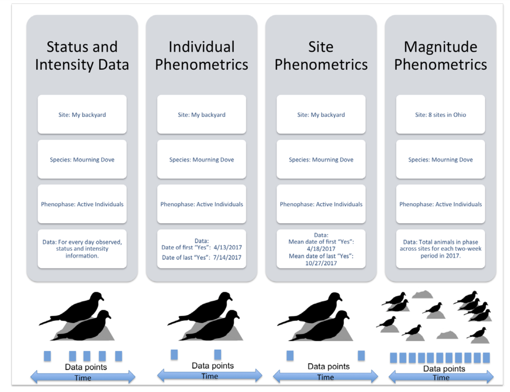
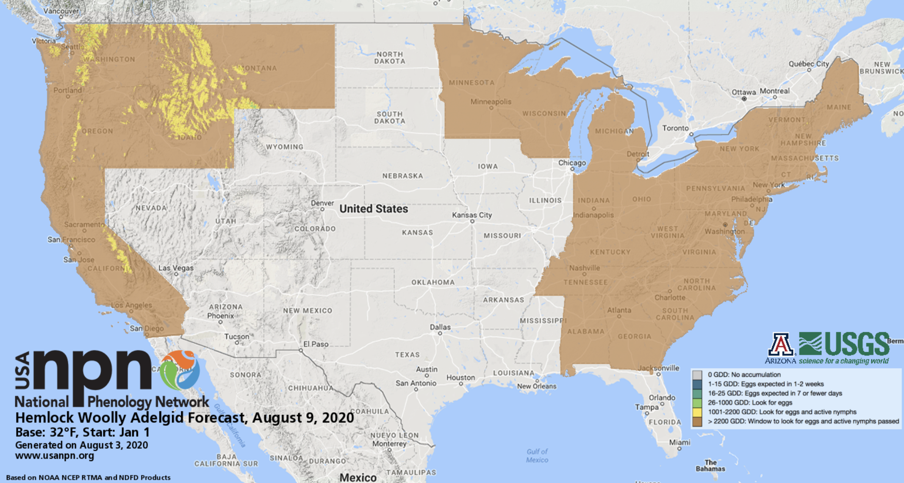
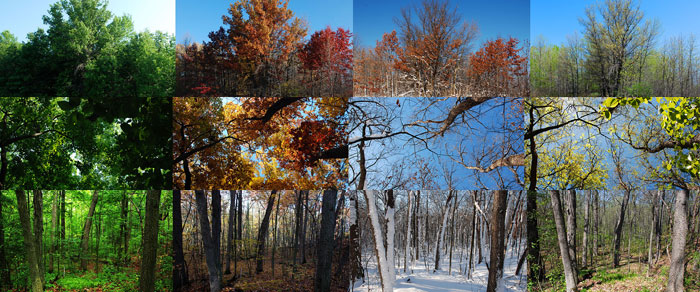
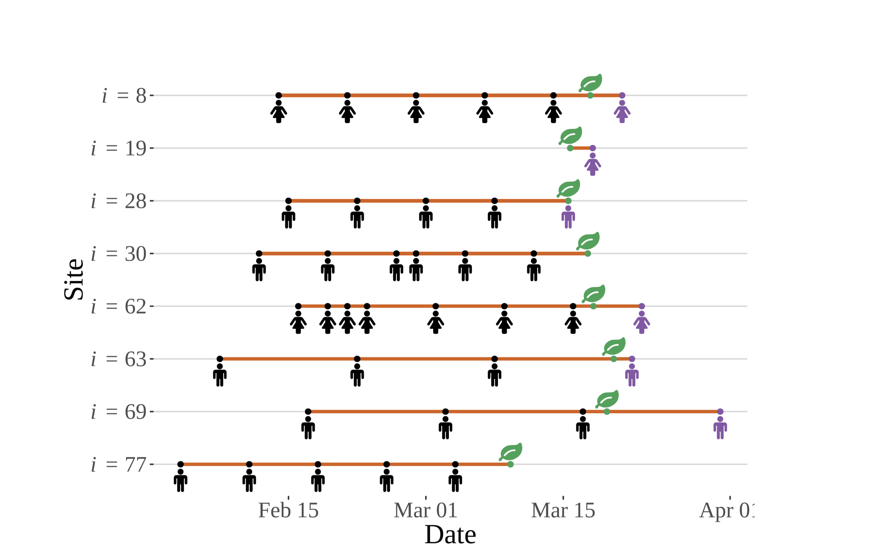

# Introduction to USA-NPN & its Data

> Estimated Time: 2 hours


<div id="ds-challenge" markdown="1">


**Course participants**: As you review this information, please
consider the final course project
that you will  build upon over this semester. At the end of this section, you will
document an initial research question or idea and associated data needed to
address that question, that you may want to explore while pursuing this course.


## USA-NPN Learning Objectives

At the end of this activity, you will be able to:

  * Understand the mission and purpose of the USA-National Phenology Network (USA-NPN) and the nature of the citizen science program from which the data is derived
  
  * Access all of the various tools & resources that are available to pull USA-NPN geospatial and observational data
  
  * Effectively use the rNPN package to integrate and analyze NPN data with other similar datasets


## USA-NPN Project Mission & Design:

<iframe width="560" height="315" src="https://www.youtube.com/embed/i_l3miEF7Dk" frameborder="0" allow="accelerometer; autoplay; encrypted-media; gyroscope; picture-in-picture" allowfullscreen></iframe>

The [USA National Phenology Network (USA-NPN)](www.usanpn.org) collects, organizes, and shares phenological data and information to aid decision-making, scientific discovery, and a broader understanding of phenology from a diversity of perspectives. The USA National Phenology Network consists of a National Coordinating Office (NCO), thousands of volunteer observers and many partners, including research scientists, resource managers, educators, and policy-makers.  Anyone who participates in Nature’s Notebook or collaborates with NCO staff to advance the science of phenology or to inform decisions is part of the USA-NPN.

## Vision & Mission
USA-NPN's vision is to provide data and information on the timing of seasonal events in plants and animals to ensure the well-being of humans, ecosystems, and natural resources.  To support this and its mission the USA-NPN collects, organizes, and shares phenological data and information to aid decision-making, scientific discovery, and a broader understanding of phenology from a diversity of perspectives.

### Relevant documents & background information:

1. [USA-NPN Strategic Plan](https://usanpn.org/files/npn/reports/USA-NPN_StrategicPlan_2019-2024.pdf)

2. [USA-NPN Information Sheet: Tracking seasonal changes to support science, natural resource management, and society](https://usanpn.org/files/npn/reports/USA-NPN_InfoSheet_2020.pdf)

3. [2019 USA-NPN Annual Report](https://www.usanpn.org/files/npn/reports/USA-NPN_AnnualReport2019.pdf)


## USA-NPN’s Spatial design:

<iframe width="560" height="315" src="https://www.youtube.com/embed/VqyCUlXxFQo" frameborder="0" allow="accelerometer; autoplay; encrypted-media; gyroscope; picture-in-picture" allowfullscreen></iframe>

Phenology datasets that are best suited for supporting scientific discovery and decision making are those that consist of observations of multiple life-cycle stages collected at regular intervals at the same locations over multiple years. The USA-NPN collects, stores, and shares high-quality observations of plant and animal phenology at a national scale by engaging observers in Nature’s Notebook, a national-scale, multi-taxon phenology observing program appropriate for both professional and volunteer participants. Because observations are entirely voluntary, the sampling design for observations is opportunistic.
The Nature’s Notebook program has been adopted widely; data are collected at over 100 academic institutions, 78 National Ecological Observatory Network (NEON) sites, and by hundreds of researchers to contribute observations to support scientific discovery. The program is also used by tens of thousands of individual observers and members of federal, state, NGO, and private sector organizations as well as K-12 and higher-ed institutions.

A unique aspect of Nature’s Notebook is that monitoring can be undertaken by individuals as well as by community or regionally-organized groups referred to as Local Phenology Programs (LPP). Organizations such as nature centers, arboreta, land conservancies, and National Wildlife Refuges use Nature’s Notebook to meet a diversity of outcomes, including asking and answering scientific questions about the impact of environmental change, informing natural resource management and decision-making, and educating and engaging the public.


## Types of USA-NPN Data:
```{r, echo=FALSE}
knitr::include_graphics('./docs/images/USA_NPN_data_types.png')
```

### Observational

Observational phenology data, consisting of observations made of phenological status on individual organisms, are collected and submitted by professional and citizen scientists, primarily through the USA-NPN plant and animal phenology observing program, [Nature’s Notebook](http://www.naturesnotebook.org/). These data are submitted to the USA-NPN and serve as the backbone of all USA-NPN observational data products.

Observation protocols consist of status monitoring, in which observers visit a site at regular intervals to evaluate the phenological status of marked individual plants (or patches of plants) and animal species The protocols are described fully in [Denny et al. (2014)](https://link.springer.com/article/10.1007/s00484-014-0789-5). 

In this system, phenological status is reported by yes or no answers to a series of questions, for example, “Do you see leaves?” or “Do you see active individuals?”. In addition to “Yes” or “No,” observers may also report “?”, indicating that they are uncertain of the phenophase status. Observers are also invited to document the degree to which the phenophase is expressed on an individual plant, or for animals, at a site. This intensity or abundance question takes the form of a count or percentage - for example, “95–100 percent” of a beech tree’s canopy is full with “Leaves,” or 12 “Active individual” robins are seen. 


USA-NPN observational data and derivative products are described in USA National Phenology Network Observational Data Documentation [(Rosemartin et al. 2018)](https://pubs.usgs.gov/of/2018/1060/ofr20181060.pdf). The three formats in which the USA-NPN observational data are made available include: *status and intensity data*, *individual phenometrics*, and *site-level phenometrics*.

```{r, echo=FALSE}
knitr::include_graphics('./docs/images/npn_data_exampe.png')
```

>Visual comparison of data collected by monitoring phenological events, phenophase status, and phenophase status plus intensity. Event monitoring captures onset of a given phenophase, whereas status monitoring captures onset and duration. Status monitoring with intensity (or abundance) captures onset, duration, and magnitude of a phenophase. Examples are derived from 2012 data submitted in Nature’s Notebook for (a) sugar maple (Acer saccharum) leafing for one individual plant in Maine, and (b) forsythia flowering (Forsythia sp.) for one individual plant in Massachusetts. Each point represents one observation; black points indicate presence of the phenophase while white points indicate absence. (a) illustrates the date on which the first leaf appears (event), the period during which leaves are present (status), and the period and rate at which the canopy fills from 0 to 100 % capacity and then, empties back to 0 with leaf fall (status + intensity, circles and solid line) using estimates of canopy fullness. Also illustrated is the period and rate at which the canopy fills and empties of autumn colored leaves (status + intensity, triangles and dashed line). (b) illustrates the date on which the first open flower appears (event), the periods during which open flowers are present on the plant (status), and an estimate of the number of open flowers on the plant over the periods in which they are present (status + intensity). In both examples, the event point is calculated as the first date of the year where the phenophase was reported as present. Note that in (b) there are two distinct periods of flowering, the second of which would not have been captured using event monitoring alone. (Denny et al., 2014) 


### Status & Intensity Data

Status and intensity data consist of presence/absence records for individual phenophases on individual plants or species of animals at a site on a single visit. These records also include intensity and abundance measures. Individual Phenometrics and Site Phenometrics, which are synthesized sequentially from Status and Intensity data, provide estimated phenophase onset and end dates. Individual Phenometrics are derived estimates of phenophase onset and end dates for organisms within a given period of interest. Site Phenometrics are summary metrics of the onset and end date of phenophase activity across multiple individuals of the same species at a site within a given period of interest. Magnitude Phenometrics provide measures of the extent to which a phenophase is expressed across multiple individuals or sites, for a given time interval. 

These metrics include several approaches for capturing the shape of seasonal activity curves. In Nature’s Notebook, plants are marked and tracked through time, while animals are not, resulting in several key differences between the phenometric data types for plants and for animals. Individual Phenometrics and Site Phenometrics are nearly identical for animals, while for plants the former provide data for individual plants and the latter aggregate data across plants of the same species at a site. Magnitude Phenometrics provide additional information on animals, including correcting abundance values by search time and search area, which is not relevant for plants. As additional observational phenology data types are created by the USA-NPN, they are described at www.usanpn.org/data/new_data_products.


```{r,echo=FALSE}

```

>USA-NPN Animal Phenological Data by Type from Rosemartin et al.,2018

### Gridded Raster Data

The USA-NPN offers a growing suite of gridded (raster) maps of phenological events, patterns, and trends. These products include historical, real-time, and short-term forecasts and anomalies in the timing of events such as the [start of the spring season](https://www.usanpn.org/data/spring_indices), and [growing degree days](https://www.usanpn.org/data/agdd_maps). These products are described in the USA National Phenology Network gridded products documentation [(Crimmins et al. 2017)](https://pubs.usgs.gov/of/2017/1003/ofr20171003.pdf)


### Pheno-Forecasts

[**USA-NPN Pheno-Forecasts**](https://www.usanpn.org/data/forecasts) include real-time maps and short-term forecasts of insect pest activity at management-relevant spatial and temporal resolutions and are based on accumulated temperature thresholds associated with critical life-cycle stages of econmically important pests. Pheno Forecasts indicate, for a specified day, the status of the insect’s target life-cycle stage in real time across the contiguous United States. The maps are available for 12 insect pest species including the invasive emerald ash borer, hemlock woolly adelgid, and gypsy moth. These products are described in “Short-term forecasts of insect phenology inform pest management” [(Crimmins et al. 2020)](https://academic.oup.com/aesa/article/113/2/139/5727873)


```{r,echo=FALSE}

```
> Example of USA-NPN's Hemlock Wolly Adelgid Pheno-Forecast for August, 2020.

Pheno-Forecasts are also available for an invasive grasses, such as buffelgrass. The [buffelgrass Pheno-Forecast](https://usanpn.org/data/forecasts/Buffelgrass)  is based on known precipitation thresholds for triggering green-up to a level where management actions are most effective. These maps are updated daily and predict green-up one to two weeks in the future.


Land Surface Phenology products

The USA-NPN offers [maps derived from MODIS 6 land surface phenology data](https://www.usanpn.org/data/land_surface_phenology). Satellite observations can be linked to in-situ observations to help understand vegetation dynamics across large spatial scales.

The MODIS Land Cover Dynamics Product (MLCD) provides global land surface phenology (LSP) data from 2001-present. MLCD serves a wide variety of applications and is currently the only source of operationally produced global LSP data. MLCD data have enabled important discoveries about the role of climate in driving seasonal vegetation changes, helped to create improved maps of land cover, and support ecosystem modeling efforts, among many other important applications.

The LSP Climate Indicators (LSP-CI) dataset is a curated collection of the most relevant phenological indicators: a measure of spring and autumn timing and a measure of seasonal productivity. Statistically robust estimates of long-term normals (median and median absolute deviation, MAD), significance-screened trends (Theil-Sen slope magnitude where p<=0.05), and interannual anomalies (in days as well as multiples of MAD) have been computed for these three phenological indicators. The data have been mosaiced across CONUS, reprojected and resampled to a more familiar spatial reference system that matches complementary datasets and delivered in the universally accessible GeoTIFF format. 


## How to Access USA-NPN Data:

The USA-NPN makes the data they produce available through a number of different channels and tools. This is partly driven by the format of the data; GIS data, in many ways, can and should be managed differently than observational records, which can more easily be managed in a relational database. However, the need for these different venues is also driven by end-user need. The different tiers of tools makes the data accessible to anyone regardless of their level of technical experience. This is true from the casual observer that would like to use the visualization tool to see how their contributions to citizen science relate to the broader world, all the way to the data scientist that needs simple and standard APIs to integrate USA-NPN data into larger applications and analyses.

### The USA-NPN Landing page
A concise list of all available NPN data sets, tools, products.

### APIs
This is a set of standard web service calls that allows for programmatic access to NPN data independent of any particular programming language.

  *[USA-NPN Web Service API Documentation](https://docs.google.com/document/d/1yNjupricKOAXn6tY1sI7-EwkcfwdGUZ7lxYv7fcPjO8/edit?hl=en_US)
  
  *[USA-NPN Geoserver Documentation](https://docs.google.com/document/d/1n409GY931Pf14vNqCaeQx-Ck_5VVLH5-dVUKZ5ylVpQ/edit?usp=sharing)
  
  *[USA-NPN GeoServer API](http://geoserver.usanpn.org/geoserver/)

### Rnpn package
This suite of R functions allows for programmatic access to both gridded and in-situ NPN data sets in an R environment. Full documentation available here: https://usa-npn.github.io/rnpn/

### Phenology Observation Portal (for observational data)
[This tool](https://www.usanpn.org/data/observational) allows users to download customized datasets of observational data from the National Phenology Database, which includes phenology data collected via the Nature's Notebook phenology program (2009-present for the United States), and additional integrated datasets, such as historical lilac and honeysuckle data (1955-present).  Filters are available to specify dates, regions, species and phenophases of interest. This provides access to all phenometrics, which represents varying degrees of data aggregation.


### Geospatial Request Builder (for raster data and image files)

[This tool](https://www.usanpn.org/geoserver-request-builder) simplifies the process of accessing NPN gridded data through standard WMS and WCS services. WMS services provide the data as basic graphic images, such as PNGs or TIFFs, whereas WCS services provide the same data in formats accessible to GIS applications.

### Visualization Tool
[The Visualization Tool](https://data.usanpn.org/vis-tool/#/) provides an easier way to explore phenology data and maps. The user-friendly interface is intended to allow for searching for comparing general trends and quick-and-easy access to map data/products.

## USA-NPN Written Questions

**Suggested timing: Complete before lecture 2 of USA-NPN Hands on Coding Exercises**

**Question 1:** How might or does USA-NPN
intersect with your current research or future career goals? *(1 paragraph)*
</div>


<div id="ds-challenge" markdown="1">

**Question 2:**  Use the USA-NPN visualization tool (www.usanpn.org/data/visualizations) to answer the following questions. Consider the research question that you may explore as your final semester project or a current project that you are working on and answer each of the following questions:

·      Are there species, regions, or phenophases of interest to you?

·      Is there geospatial phenology data that is useful for your work (e.g. Spring Indices or Growing Degree Days)?

·      What is the timeframe of data you will need to address your research interests?

·      What is the spatial extent of data you will need?


**Question 3:** Consider either your current or future research, or a question you’d like to address during this course:

·       What climate data or additional phenological datasets would be valuable to address your research interests?

·       What challenges, if any, could you foresee when beginning to work with these data?


<div id="ds-challenge" markdown="1">

## Hands on: Accessing USA-NPN Data via rNPN

### Introduction

The USA National Phenology Network (USA-NPN) is a USGS funded organization that collects phenological observation records from volunteer and professional scientists to better understand the impact of changes in the environment on the timing of species' life cycles. The USA-NPN also provides a number of raster-based climatological data sets and phenological models. These in-situ observation and geospatial, modeled datasets are available through a number of tools and data services.

The USA-NPN R library, "rnpn", is primarily a data access service for USA-NPN data products, serving as a wrapper to the [USA-NPN REST based web services](). This guide details how to use the library to access and work with all USA-NPN data types.

```{r, eval=FALSE}
install.packages("devtools")
library('devtools')
devtools::install_github("usa-npn/rnpn")

```
```{r}
library('rnpn')
```
### Accessing USA-NPN Observational Data

USA-NPN Observational data are collected on the ground by citizen and professional observers following standardized protocols, using the Nature's Notebook platform. The data are available 2009 to present, and come in four formats or data types: Status & Intensity, Individual Phenometrics, Site Phenometrics and Magnitude Phenometrics. An overview of the differences is provided in the figure below, and each type is detailed in the following sections. For a complete description of the USA-NPN approach and notes for working with each data type see the [Open File Report on USA-NPN Observational Data](https://pubs.usgs.gov/of/2018/1060/ofr20181060.pdf).


In Nature's Notebook, observers register a location, and then at each location they register any number of individual plants or animal species. The expectation is that the user then takes regular observations on each individual/species at a regular interval. Phenological status is reported by yes or no answers to a series of questions, for example, "Do you see leaves?" or "Do you see active individuals?". In contrast to traditional monitoring of annual "first" events (for example, date of first leaf or first robin), this approach captures absence data when the phenophase is not occurring and repeat events. Each observation is comprised of a series of 1, 0 and -1 values, representing yes/no/uncertain for each possible phenophase for the plant on that date. To explore data in this native "Status and Intensity" format, see the vignette by the same name.

A few considerations and functions apply across all USA-NPN Observational data types. 

#### Basic format for for Observational data calls

The basic format for an observational data call in the rnpn library is:


```{r eval=FALSE}
npn_download_[NAME OF DATA TYPE] (
  request_source = [NULL]
  year =  [NULL]
  species_ID = [NULL]
)                  
```

'Request source' should usually be populated with your full name or the name of the organization you represent. Species_ID is the unique identifier for all the available plants and animals in the USA-NPN database.
You can create a table of all available species and their ID numbers:

```{r}
species <- npn_species()
```

Search for a species by common name from the full list:
```{r}
species[species$common_name=="red maple",]
```


There are many parameters which can be set beyond these basic ones, depending on the data type, and further detailed in the other vignettes featured in this package.


#### Required Parameters

Note that specifying the year(s) of interest is a required parameter.

There's also another required field, "request_source", which is a user-provided, self-identifying string. This allows the client to provide some information about who is accessing the data. Knowing who is using the data is very helpful for our staff to report the impact of the USA-NPN to the scientific community. The input provided here is entirely honor-based.


#### Find stations at which a species has been observed

You can also now look up which stations have a registered plant for a particular species. In the example below, we use the species ID for red maple, which we were able to find through the npn_species() function, to find all stations with that species.


```{r eval=FALSE}
npn_stations_with_spp (3)
```

### Status and Intensity Data

The Status and Intensity data type is the most direct presentation of the phenology data stored in the NPDb. Each row is comprised of a single record of the status (1/present/"Yes", 0/absent/"No" or -1/uncertain/"?") of a single phenophase on an individual plant or species of animal at a site on a single site visit, as well as the estimated intensity or abundance e.g., percent canopy fullness or number of individual robins observed respectively.

Retrieving this kind of data using this package is easy, and heavily parameterized. It's possible to filter data using a number of including year, geographic extent and species. In this example we get all records of bird observations in the New England states from 2018.

```{r eval=FALSE}
npn_download_status_data(
  request_source = 'Your Name Here',
  years = c('2018'),
  states = c("NY","PA","VT","MA"),
  functional_types = 'Bird'
)
```

'states' is an example of an optional parameter that allows you to filter data based on geographic location. Another example is 'functional_types' which allows you to get all available data for a group of similar species (e.g., all birds, shrubs or invasive species).
The best place to review **all** available optional filters is the autogenerated package description.

Another important optional parameter is called 'download_path'. By default requests for data from the services are returned as a data frame that gets stored in memory as a variable. In some cases, it makes more sense to save the data to file for easy and fast retrieval later. The download_path parameter allows you to specify a file path to redirect the output from the service, without having to fuss with pesky I/O operations. Additionally, requests made this way streams the data returned, so if the dataset you're working with is particularly large, it's possible to redirect the stream of data to file instead of loading it all into memory which can be useful if your environment doesn't have enough RAM to store the entire data set at once.


```{r eval=FALSE}
npn_download_status_data(
  request_source = 'Your Name Here', 
  years = c('2018'), 
  functional_types = 'Bird', 
  additional_fields = 'Site_Name', 
  download_path ='Bird_data_2018_SiteName.csv'
)
```


Using this function to get observational records is the most basic presentation of the data, and is the most robust for doing analysis, but there are a number of other products offered through the data service which provide additional value to data end users, outlined in the next vignettes.

### Individual Phenometrics


While Status and Intensity data provide a direct and complete look at the observational data, some analyses rely on more synthesized output. Individual Phenometrics are derived from phenophase status data and provide estimates of phenophase onset and end dates based on the first and last "Yes" status values for organisms within a specified season of interest. Each row in this data type is comprised of values that are derived from a string of consecutive "Yes" status reports without an intervening "No" status report for a single phenophase for an individual plant or animal species at a site, called a "series". For plants, this data type provides information on the onset and end of a phenophase on an individual plant. For animals, it provides information on the onset and end of the presence of an animal species at a site. As animal presence at a site is much more likely to be interrupted by absence than the presence of a phenophase on a plant, Status and Intensity data or Site Phenometrics may be more appropriate for investigating animal phenology. However, we provide animal phenology in the same format as individual plants in this data type to allow users to readily compare individual plant phenology with animal activity.


Note that more than one series may exist for a given phenophase in an individual plant or animal species within a single growing season or year, this might occur in the case of leaf bud break followed by a killing frost and second round of breaking leaf buds. It could also occur at group sites where two or more observers are reporting on the same plant on sequential days but are not in agreement on phenophase status.


Any call for individual phenometrics requires chronological bounds, usually a calendar year, as determining onset and end depend on knowing what the time frame of interest is. If you query the services directly (without the benefit of this library) it's possible to specify arbitrary dates, in contrast this library allows you to specify a series of calendar years as input.


Here's an example of how to query the services for individual phenometrics data. Note that the overall structure and parameters are very similar to the call for status data. The biggest difference in this case is that start and end date parameters are now replaced with a 'years' array, which predictably takes a set of year values with which to query the service. 


```{r}
npn_download_individual_phenometrics(
  request_source='Your Name Here', 
  years=c(2013,2014,2015,2016), 
  species_id=c(210), 
  download_path="saguaro_data_2013_2016.csv"
)
```


In this example, we're able to see individual saguaro phenology for 2013 through 2016. The results returned from the service is a tabular set of records, giving start and end date by individual saguaro plant. By default, each record contains information about the location, species, phenophase, and start and end dates.


Climate data from DayMet can also be acquired with Status & Intensity, Individual Phenometrics and Site Phenometric data types, by setting the climate_data parameter to true. In this example, we are getting colored leaves (phenophase ID is 498) data for birches, using the four birch species IDs, for 2015: 


```{r}
npn_download_individual_phenometrics(
  request_source = 'Your Name Here', 
  years = c('2015'), 
  species_ids = c(97, 98, 99, 430), 
  phenophase_ids = c(498), 
  climate_data = TRUE,
  download_path = 'Betula_data_2015.csv'
)
```


To show what this looks like, we can plot the day of year of the first observation of colored leaves in birches (genus Betula) against summer Tmax.


```{r, eval=FALSE}
BetulaLeaf <-read.csv(
  'Betula_data_2015.csv', 
  header = TRUE, 
  na=-9999, 
  stringsAsFactors = FALSE
)
plot(
  first_yes_doy~tmax_summer, 
  data=BetulaLeaf, 
  ylab=c("Day of Year"), 
  xlab=c("Tmax Summer"),
  cex=2, 
  cex.axis=1.5, 
  cex.lab=1.5, 
  pch=21
)
```

### Site Phenometrics


Site Phenometrics, derived from Individual Phenometrics, provide summary metrics of the onset and end date of phenophase activity for a species at a site. Observers are directed to create sites that represent uniform habitat and are no larger than 15 acres. For plants, this metric is calculated as an average for all individuals of a species at the site. For animals, where individuals are not tracked, this metric represents the first and last recorded appearance of the species during the season of interest. For instance, if you asked for red maple leafing data, and there was a site with three red maple trees being observed, then the data would be the average onset date for all three of those red maple trees at that site.


Here's an example of how to query the services for site phenometrics data, for cloned lilacs, breaking leaf buds, 2013. The call is very similar to the call for individual phenometrics data, however, in addition you can supply the quality control filter for the number of days between a yes record and preceding no record (also applies to the last yes and following no), for the observation to be included in the calculations. Typically this is set to 7, 14 or 30, as when downloading data using the USA-NPN Phenology Observation Portal. If you do not set this parameter, it defaults to 30 days. Note that in this example the results are stored in memory,  rather than output as a file.


```{r, eval=FALSE}
LilacLeafPoints2013<-npn_download_site_phenometrics(
  request_source = 'Your Name Here', 
  years = c('2013'),
  num_days_quality_filter = '30',
  species_ids = '35',
  phenophase_ids = '373'
)
```


In this example we're able to see the date of the first observation of breaking leaf buds for cloned lilacs, averaged across individuals within sites. If any observation did not have a preceding no record within 30 days it was excluded from the calculations.


We can now plot our cloned lilac site phenometric onset data by latitude.


```{r, eval=FALSE}
plot(
  mean_first_yes_doy~latitude, 
  data=LilacLeafPoints2013, 
  ylab=c("Day of Year"), 
  xlab=c("Latitude"),
  cex=2, 
  cex.axis=1.5, 
  cex.lab=1.5, 
  pch=21, 
  xlim=c(30,55), 
  ylim=c(0,200)
)
```

### Magnitude Phenometrics


Magnitude Phenometrics are a suite of eight metrics derived from Status and Intensity data. This data type provides information on the extent to which a phenophase is expressed across multiple individuals or sites, for a given set of sequential time intervals. The data user may select a weekly, bi-weekly, monthly, or custom time interval to summarize the metrics. Two metrics are available for both plants and animals, one metric is available for plants alone and five metrics are available for animals alone (table 1). Three of the five animal metrics correct animal abundance values for observer effort in time and space.


Here's an example of how to query for Magnitude Phenometrics, for the active individuals phenophase for black-capped chickadee data, in 2018. Requirements are similar to other data types. You must additionally specify the time interval by which the data should be summarized. Typically this is weekly, biweekly or monthly, as in the POP and Visualization Tool. The interval chosen in this example is 7 days.


```{r, eval=FALSE}
npn_download_magnitude_phenometrics(
  request_source = 'Your Name Here', 
  years = '2018',
  period_frequency = "7",
  species_ids = '245', 
  phenophase_ids = '292', 
  download_path = 'MPM_BCC_ActInd_2018.csv'
)
```


In this example we're able to see all of the magnitude phenometric fields, including proportion_yes_records, and mean_num_animals_in-phase. See the [https://pubs.usgs.gov/of/2018/1060/ofr20181060.pdf](Open File Report on USA-NPN Observational Data) for full field descriptions.


From this dataset we can view the Proportion_Yes_Records (of all the records submitted on this species, what proportion are positive/yes records) by weekly interval:

```{r, eval=FALSE}
BCC_AI<-read.csv(
  'MPM_BCC_ActInd_2018.csv', 
  header = TRUE, 
  na=-9999, 
  stringsAsFactors = FALSE
)
plot(
  BCC_AI$proportion_yes_record~as.Date(BCC_AI$start_date,"%Y-%m-%d"), 
  ylab=c("Proportion Yes Records"), 
  xlab=c("Date"),
  cex=2, 
  cex.axis=1.5, 
  cex.lab=1.5, 
  pch=21,
  xlim=as.Date(c("2018-01-01", "2018-08-01")),
  ylim=c(0,1)
)
```

### USA-NPN Geospatial Data

USA-NPN provides phenology-relevant climate data in raster format. There are two main suites of products in this category: Accumulated Growing Degree Days and Extended Spring Indices. Accumulated Growing Degree Days and the Extended Spring Indices are both representations of accumulated temperature. As accumulated winter and spring heat drives many spring season phenological events in much of the country, these products can be used to better understand patterns in the current and historical timing of these events across the landscape. For a complete description of the USA-NPN approach and notes for working with each data type see the [Open File Report](https://pubs.usgs.gov/of/2017/1003/ofr20171003.pdf) on USA-NPN Gridded Data.

Both suites are available as:

* Current year value, with a 6-day forecast
* Current year anomaly, with a 6-day forecast
* Long-term (30 year) average
* Historical years
    + AGDD - 2016-Prior Year
    + Extended Spring Index - 1880-Prior Year
 
All of these products can be downloaded using the npn_download_geospatial call. There is a number of other products and permutations of the above listed AGDD and Spring Index products, so you can get a complete list of available layers and additional details about them including resolution, extent and the abstract/layer description. 

```{r}
layers <- npn_get_layer_details()
```

The following sections describe how to parameterize calls for both AGDD and Spring Index layers. These calls result in raster data sets for the contiguous United States. 

If you are interested in how many GDDs had accumulated when the red maple in your backyard leafed out, or what day the Spring Index requirements for leaf out were met for your location, you may wish to query the layers for these values, based on location and date. There are two ways to accomplish this, using the npn_get_point_data function which works for all layers and the npn_get_AGDD_point_data function, which only works for AGDD layers and provides a more precise result.

```{r, eval=FALSE}
npn_get_agdd_point_data(
 'gdd:agdd_50f', 
 '38', 
 '-90', 
 '2019-02-25'
)
```

This returns a value of 7.64098 GDD, base 50F, for the coordinates 38 north, -90 west on February 25th, 2019.


```{r}
npn_get_point_data(
 'si-x:lilac_bloom_ncep', 
 '30', 
 '-90', 
 '2019-02-25'
)
```

This returns a value for lilac bloom of day 48, for the coordinates 30 north, -90 west, as of February 25th, 2019.

The above mentioned AGDD products use base temperatures of 32F or 50F and are managed through WCS services. There is also a function to get dynamic AGDD calculations based on a user defined base temperature and a number of other parameters.


```{r, eval=FALSE}
custom_agdd_raster <- npn_get_custom_agdd_raster(
 method = 'double-sine',
 climate_data_source = 'NCEP',
 temp_unit = 'fahrenheit',
 start_date = '2019-01-01',
 end_date = '2019-05-10',
 base_temp = 20,
 upper_threshold = 90
)
```


## Accumulated Growing Degree Day Products

Heat accumulation is commonly used as a way of predicting the timing of phenological transitions in plants and animals, including when plants exhibit leaf out, flowering, or fruit ripening, or when insects emerge from dormancy. This is typically expressed as accumulated heat units, either Growing Degree Hours or Growing Degree Days. Growing degree day thresholds have been established for many species, and are commonly used in agriculture, horticulture, and pest management to schedule activities such as harvesting, pesticide treatment, and flower collection. The USA-NPN is currently generating Accumulated Growing Degree Days (AGDD) rasters using a January 1 start date, calculated using simple averaging. These are available calculated using two base temperatures, 32 degrees Fahrenheit (F) and 50 F. 


When querying certain layers, the underlying data is agnostic about the specific year, and in these cases it makes sense to use the day of year to request data, since that will provide a standardized result, (i.e., April 1st is day 91 in some years and day 92 in others). 

```{r, eval=FALSE}
npn_download_geospatial(
 'gdd:30yr_avg_agdd_50f', 
 95
)
```

But if you're looking at a specific year, such as a current year layer, it makes sense to use a specific calendar date (formatted YYYY-MM-DD). It's also possible to save the raster directly to file instead of loading it into memory.

```{r, eval=FALSE}
npn_download_geospatial(
 'gdd:agdd', 
 '2018-05-05',
 output_path='20180505-agdd-value.tiff'
)
```

In the case of the historic Spring Index layers, however, the product represents the overall outcome for the entire year, so while the year component of the date matters, the month and day do not. In this case, specify January 1 as the month and date.

```{r, eval=FALSE}
npn_download_geospatial(
 "si-x:average_bloom_prism",
 "1995-01-01"
)
```

The dimension.range value, returned in the npn_get_layer_details() function, clarifies the full set of applicable dates for each layer.

Of course, it's also easy to grab raster data and load it into a visual plot as in this example, showing a map of AGDD base 50 on 2019-06-25:

```{r, warning = FALSE, message=FALSE}
AGDDJun2019<-npn_download_geospatial(
 'gdd:agdd_50f', 
 '2019-06-25'
)
```

```{r, eval=FALSE}
plot(
 AGDDJun2019, 
 main = "AGDD base 50 on June 25th, 2019"
)
```

An important layer to know of is the 30 year average for AGDD products. This is useful for many comparative analyses. This layer takes DOY as the date input, since it's the average AGDD value for each day of year for 1981 - 2010.

```{r, eval=FALSE}
average_30yr <- npn_download_geospatial(
 "gdd:30yr_avg_agdd",
 45
)
```


## Extended Spring Indices


The Extended Spring Indices are mathematical models that predict the "start of spring" (timing of first leaf or first bloom) at a particular location. These models were constructed using historical observations of the timing of first leaf and first bloom in a cloned lilac cultivar (Syringa X chinensis 'Red Rothomagensis') and two cloned honeysuckle cultivars (Lonicera tatarica L. 'Arnold Red' and Lonicera korolkowii Stapf, also known as 'Zabelii'), which were selected based on the availability of historical observations from across a wide geographic area. Primary inputs to the model are temperature and weather events, beginning January 1 of each year. The model outputs are first leaf and first bloom date for a given location. 

Data for the Spring Index is available through an enumeration of layers that represents each of the three sub-models as well as an 'average' model which represents the aggregation of the three sub-models. These layers are further enumerated by both of the represented phenophases, leaf and bloom. In the example below, first the layer representing only the Arnold Red model for 1987 is retrieved, while the second function call gets the model averaging all three of the models for the same year.

```{r eval=FALSE}
npn_download_geospatial(
 "si-x:arnoldred_bloom_prism",
 "1987-01-01"
)
average_model <- npn_download_geospatial(
 "si-x:average_bloom_prism",
 "1987-01-01"
)
```


The Spring Indices are also unique in that the algorithm has been run against the BEST climate data set, so historic data going back to 1880 is available.

```{r, warning = FALSE, eval=FALSE}
BESTSIxData1905 <- npn_download_geospatial(
 'si-x:average_bloom_best', 
 '1905-01-01'
)
NAvalue(BESTSIxData1905) <- -9999
```

```{r, eval=FALSE}
plot(
 BESTSIxData1905, 
 main = "Spring Index, 1905"
)
```


### Other Layers

Besides the AGDD and Spring Index layers there are a number of other useful layers available through these services, including daily temperature minimum and maximums and aggregated MODISv6 phenometrics.

The daily temperature minimum and maximum values are the underlying climate data used to generate current year AGDD and Spring Index maps. These data are generated by NOAA's National Centers for Environmental Prediction (NCEP) and are reserved through NPN's geospatial services.

```{r, eval=FALSE}
daily_max_20190505 <- npn_download_geospatial(
 'climate:tmax', 
 '2019-05-05'
)
plot(
 daily_max_20190505, 
 main = "Daily Temperature Max (C), May 5th, 2019"
)
```


The MODISv6 layers are aggregate values for remote sensing values from the MODISv6 data set, representing a subset of the following phenometrics, aggregated across 2001 - 2017: EVI Area, Mid-Greenup, Mid-Greendown. The available aggregate values for each layer are: median, TSslope, and mean absolute deviation.
This example shows the median green up value, as DOY. Note that because this layer has a fixed date, the date parameter is input as a blank string.

```{r, eval=FALSE}
median_greenup <- npn_download_geospatial(
 'inca:midgup_median_nad83_02deg',
 ''
)
plot(
 median_greenup, 
 main = "MODIS Median Mid-Greenup, 2001 - 2017"
)
```


## Putting it all together:


## Combine Point and Raster Data

Observational and gridded data can be visualized or analyzed together for a variety of purposes. Users may want to identify spatial patterns in the alignment of dogwood bloom and the Spring Index bloom model. The current year's lilac leaf out observations may be compared to the 30 year average lilac sub-model of the spring index to see how well the model predicts the observations.

This example shows several data access calls to assemble observational and gridded data.


Option 1: You can add a parameter to an observational data call to additionally get a gridded layer value for each observation location/date. Note that if you don't specify which sub model of the Spring Index you want,  you will get the SI-x Average layers.

```{r, eval=FALSE}
npn_download_site_phenometrics(
  request_source = 'Your Name Here', 
  years = '2013',
  num_days_quality_filter = '30', 
  species_ids = '35',
  phenophase_ids = '373', 
  download_path = 'cl_lilac_data_2013_SIxLeaf.csv',
  six_leaf_layer = TRUE,
  six_sub_model = 'lilac'
)
```

If you want to append raster data other than Spring Index, Leaf values, there's alternative boolean flags that can be set, including six_bloom_layer for Spring Index, Bloom data, and agdd_layer. Instead of TRUE or FALSE agdd_layer takes 32 or 50 and will correlate each data point with the corresponding AGDD value for the given date using either 32 or 50 base temperature.


Option 2: You can create a combined plot of observational data with modeled/raster data.

Building on the approach for accessing point data from earlier vignettes describing Individual Phenometrics and getting raster data, we can access and plot these products together. In this example, we will look at how well cloned lilac leaf out observations in 2018 are predicted by the lilac leaf sub model of the Spring Index.

### Step 1: Get the data
```{r, eval=FALSE}
LilacLeaf2018<-npn_download_geospatial(
  'si-x:lilac_leaf_ncep', 
  '2018-12-31', 
)
LilacLeaf2018Obs <-npn_download_individual_phenometrics(
  request_source = 'Your Name Here', 
  years = '2018',
  species_ids = '35',
  phenophase_ids = '373' 
)
```


### Step 2: Preparing the data
```{r, eval=FALSE}
coords <- LilacLeaf2018Obs[ , c("longitude", "latitude")]
data <- as.data.frame(LilacLeaf2018Obs$first_yes_doy)
crs <- CRS("+proj=utm +zone=18 +datum=WGS84 +units=m +no_defs 
                 +ellps=WGS84 +towgs84=0,0,0")
LL_spdf <- SpatialPointsDataFrame(
  coords = coords,
  data = data, 
  proj4string = crs
)
```


### Step 3: Define style options and create graph
```{r, eval=FALSE}
my.palette <- brewer.pal(n=9,name="OrRd")
plot(
  LilacLeaf2018, 
  col = my.palette,
  main="2018 Observed and Predicted Lilac Leaf Out"
)
plot(
  LL_spdf,
  main="Lilac Obs",
  pch = 21,
  bg = my.palette,
  col = 'black',
  xlim=c(-125.0208,-66.47917),
  ylim=c(24.0625 ,49.9375),
  add = TRUE
)
legend(
  "bottomright", 
  legend=c("Cloned Lilac Leaf Out Observations"),
  pch = 21,
  bg = 'white',
  col = 'black',
  bty="n", 
  cex=.8
)
```

## Live Demo Code with Lee Marsh of USA-NPN


### Basic Utility Functions
```{r, eval=FALSE}
species <- npn_species()
phenophases <- npn_phenophases()

layer_details <- npn_get_layer_details()
```

```{r, eval=FALSE}
quick_get_phenophase <- function(species_id, date,phenophase_name){
  phenophases<-npn_phenophases_by_species(c(species_id),date=date)
  phenophases_species <- phenophases[phenophases$species_id==species_id]$phenophases[[1]]
  phenophases_species[phenophases_species$phenophase_name==phenophase_name,]$phenophase_id
}

quick_get_species <- function(species_name){
  species[species$common_name==species_name,]$species_id
}
```

### Download Observational Data

```{r, eval=FALSE}
white_oak_id <- quick_get_species("white oak")
fruits_id<- quick_get_phenophase(white_oak_id,"2017-05-15","Fruits")

# Raw data download
s2017_white_oak_raw <- npn_download_status_data(
  request_source = "R Demo",
  years = c(2017),
  species_ids = c(white_oak_id),
  phenophase_ids = c(fruits_id)
)
```

### Magnitude Data
```{r, eval=FALSE}
m2017_white_oak_magnitude <- npn_download_magnitude_phenometrics(
  request_source = "INF550",
  years = c(2017),
  species_ids = c(white_oak_id),
  phenophase_ids = c(fruits_id),
  period_frequency = "14"
)

datasets <- npn_datasets()

# NEON data, file download, additional fields
npn_download_status_data(
  request_source = "R Demo",
  years = c(2018:2020),
  states = c("CO"),
  dataset_ids = c(16),
  additional_fields = c("Site_Name"),
  download_path = "NEON_CO_Data_2018-2010.csv"
)

```

### Downloading Geospatial Data
```{r, eval=FALSE}
SIXBloom2018 <- npn_download_geospatial(
  'si-x:average_bloom_ncep', 
  '2018-12-31'
)


npn_download_geospatial(
  'gdd:agdd', 
  '2018-04-15',
  output_path = "20180415-32-agdd.tiff"
)


my_point <- npn_get_point_data("gdd:agdd_50f", 33.649, -111.861, "2017-05-15")

```

### Putting it together
```{r, eval=FALSE}

dogwood_id <- quick_get_species("flowering dogwood")
dogwood_flowering_id <-
  quick_get_phenophase(dogwood_id,"2018-05-05","Flowers or flower buds")

dogwood_data <- npn_download_site_phenometrics(
  request_source = 'Demo', 
  years = '2018',
  species_ids = dogwood_id,
  phenophase_ids = dogwood_flowering_id, 
  six_leaf_layer = TRUE,
  agdd=32
)
```

### Other Data Sources, e.g. Daymet, MODIS

```{r, eval=FALSE}

add_fields <- npn_download_status_data(
  request_source = "INF550",
  years = c(2014),
  species_id = c(4),
  additional_fields = c("tmaxf","Greenup_0","MidGreenup_0")
)

```

## USA-NPN Coding Lab


```{r, quiet=TRUE, warnings=FALSE, results=FALSE}
library(rnpn)
library(ggplot2)
library(neonUtilities)
library(dplyr)
source('/Users/kdw223/Research/Environmental-Informatics-Using-Research-Infrastructures-and-their-Data/neon_token_source.R')

```
1. For the purposes of this exercise we will be focusing on two NEON sites: `HARV` and `CPER`.  Save these two sites into your workplace so that you can feed them into functions and packages.

2.  Define AGGD and write the equation using LaTeX.  What is an appropriate time interval over which we should calculate AGGD? *This will be relevant for following questions*

3. Use the `neonUtilities` package to pull plant phenology observations (DP1.10055.001).  We will work with the `statusintensity` data:

Hints:
```{r, quiet=TRUE, results=FALSE}
#TOS Phenology Data
sitesOfInterest <- c("HARV")

dpid <- as.character('DP1.10055.001') #phe data
 
pheDat <- loadByProduct(dpID="DP1.10055.001",
                     site = sitesOfInterest,
                     package = "basic",
                     check.size = FALSE, 
                     token=NEON_TOKEN)

#NEON sends the data as a nested list, so I need to undo that
# unlist all data frames
list2env(pheDat ,.GlobalEnv)
summary(phe_perindividualperyear)
summary(phe_statusintensity)

#remove duplicate records
phe_statusintensity <- select(phe_statusintensity, -uid)
phe_statusintensity <- distinct(phe_statusintensity)
```

```{r}
library(lubridate)
#Format dates
phe_statusintensity$date <- as.Date(phe_statusintensity$date, "%Y-%m-%d")
phe_statusintensity$editedDate <- as.Date(phe_statusintensity$editedDate, "%Y-%m-%d")
phe_statusintensity$year <- as.numeric(substr(phe_statusintensity$date, 1, 4))
phe_statusintensity$month <- as.numeric(format(phe_statusintensity$date, format="%m"))
```


In your `phe_statusintensity` data.frame pick a phenophase name of interest:

```{r}
unique(phe_statusintensity$phenophaseName)
```
And select a single taxon:
```{r}
unique(phe_perindividual$taxonID)
```

Now create a new, filtered `dataframe` only including those observations and print a summary.  You'll also want to filter for typical things like `NA` values, and think about how you'll work with data that comes in factors or strings.  Are there ways you could extract numerical values for plotting?  Could you `count` data? Summarize your strategy.

4.  Using dpid **DP1.00002.001** Single Aspirated Air Temperature calculate AGGD based on NEON tower data over the time period you decidided upon in question 1.  To save you time and frustration I've placed some **mostly complete** example code for *one* height on the tower *just for Harvard*.  **You will need to determine which height you think it best and conmplete these calculations for both sites.**  You will also need to consder things like filtering your temperature data for quality flags, and converting from GMT (Greenwich Mean Time) to [your location's time](https://stackoverflow.com/questions/1395117/how-do-you-convert-dates-times-from-one-time-zone-to-another-in-r):

```{r libraries, eval=FALSE}

##load libraries
#library(tidyverse)
library(neonUtilities)
#install.packages('mgcv')
library(mgcv)

```


```{r, eval=FALSE}

dpid <- as.character('DP1.00002.001')  ##single aspirated air temperature

tempDat <- loadByProduct(dpID=dpid,
                        site = "HARV", 
                        startdate = "2017-01",
                        enddate="2017-12",
                        avg=30,
                        package = "basic",
                        check.size = FALSE)

df <- tempDat$SAAT_30min

```

```{r, eval=FALSE}
# GDD typically reported in F
# convert df temps
df$meanTempF=df$tempSingleMean*1.8+32

#pull date value from dateTime
df$date <- substr(df$endDateTime, 1, 10)
```

**Group data and summarize values**

Here, I will group the 30-minute temperature averages by data (to get daily values)

**You will want to consider which vertical position is most appropriate to use for your analysis.**
  
You can view the sensor position data in the sensor_positions table downloaded above, where HOR.VER are the horizontal and vertical position indices (separated by a period),and zOffset is in meters above the ground:

```{r, eval=FALSE}
  select(tempDat$sensor_positions_00002, c(HOR.VER, zOffset))
``` 

you can also view all of the sensor position info with the following line:

```{r, eval=FALSE}
head(tempDat$sensor_positions_00002)
``` 
For example, the lowest position sensor (verticalPosition == 010) may be most appropriate for comparison with the phenological state of very short plants, while the highest verticalPosition may be better for comparison with canopy trees. 

Here I'll select level 1 for demonstration
```{r, eval=FALSE}
day_temp <- df%>%
  filter(verticalPosition=="010")%>%
  group_by(siteID, date)%>%
  mutate(dayMaxTemp=max(meanTempF), dayMinTemp=min(meanTempF),
         dayMeanTemp=mean(meanTempF))%>%
  select(siteID, date, dayMaxTemp, dayMinTemp, dayMeanTemp)%>%
  distinct()

##alternative, simplified mean, consistent with many GDD calculations 
### does accumulation differ for true mean vs. simplified mean?
day_temp$mean2 <- (day_temp$dayMinTemp + day_temp$dayMaxTemp)/2
```

**Caluculate daily GDD for a true mean**

*50 degrees F is a common base temperature used to calculate plant specific GDD. When might you select a different base temp?*

*How might you want to deal with different 'means' of temperature?  A couple of options below:*
```{r, eval=FALSE}
day_temp$GDD1 <- ifelse(day_temp$dayMeanTemp-50 < 0, 0, round(day_temp$dayMeanTemp-50, 0))
day_temp$GDD2 <- ifelse(day_temp$mean2-50 < 0, 0, round(day_temp$mean2-50, 0))
day_temp$GDD3 <- ifelse(day_temp$dayMeanTemp-50 < 0, 0, round(day_temp$mean2-50, 0))

```

```{r, eval=FALSE}
# define year
day_temp$year <- substr(day_temp$date, 1, 4)

#function to add daily GDD values
sumr.2 <- function(x) {
	sapply(1:length(x), function(i) sum(x[1:i]))
}

#calculate Accumlated GDD
day_temp$AGDD3 <- sumr.2(x=day_temp$GDD3)
day_temp$AGDD2 <- sumr.2(x=day_temp$GDD2)
day_temp$AGDD1 <- sumr.2(x=day_temp$GDD1)
day_temp <- ungroup(day_temp)

```


```{r, eval=FALSE}
library(plotly)


p = plot_ly() %>%
    add_trace(
      x= ~day_temp$date,
      y = ~ day_temp$AGDD1,
      type= 'scatter',
      mode = "lines",
      line = list(width = 1, color = "rgb(120,120,120)"),
      name = "Calculated Mean Temp",
      showlegend = TRUE, 
      opacity=.5
    )%>%
  add_trace(
      data = day_temp,
    x = ~ date,
    y = ~ AGDD2,
    name= 'Simplified Mean Temp',
    showlegend = TRUE,
    type = 'scatter',
    mode = 'lines',
    line = list(width = 1),
    opacity=.5)%>%
  add_trace(
      data = day_temp,
    x = ~ date,
    y = ~ AGDD3,
    name= 'Filtered Using Both',
    showlegend = TRUE,
    type = 'scatter',
    mode = 'lines',
    line = list(width = 1),
    opacity=.2)
p
```

5.  Plot your calculated AGGD and comment on your calculations.  Do you need to revise your time horizon or sensor height?


6. Now we're going to build a model to see how AGGD impacts phenological status.  But Wait.  Is phenology **all** driven by temperature?  Should you consider any other variables?  What about AGGD **and** just plain temperature?   Also, we have one very temperate site, and another that is a semi-arid grassland.  Should water availability of any sort be considered?  Any other variables or data?

Create a [GAM (Generalized Additive Model)](https://dereksonderegger.github.io/578/7-beyond-linearity.html#gams) for your phenological data including any variables you think might be relevant.  

One of the bonuses of a GAM is that it will tell you which variables are relevant and which aren't so you can iterate a bit on your model and revise it.  You might want to test a few positions on your asipirated air temperature, or a few other additional variables.  Your selection is up to you, but you must document and justify your decision.

Hints:
```
library(mgcv)
model <- mgcv::gam(phenological_status_you_picked ~ AGGD + s(temp or maybe precip) + s(doy), data=your_data)
mgcv::summary.gam(model) 
```

and plot your models for each site:
Hint:
```
mgcv::plot.gam(model, pages=1 )
```
7.  Now that we have a model for NEON data, let's use the rnpn package to see how adding additional data could improve our fit. Use the `taxonID` that you selected at each NEON tower, and feed that to the `rnpn` package to grab observational data and increase your number of observations.  

Hints:

* Feeding a state or other region will make the data more congruent
* You'll likely need to either request the phenophase that you selected from NEON, or filter again.
* It might make your life easier to request the NEON data from `rnpn` as they host it as well.

8. Pull AGGD from USA-NPN based on the observations you just pulled.

9. Combine your NEON and USA-NPN data into the same data.frame and re-fit your GAM.  

* Summarize your new model
* Plot your new model
* Comment on your new model: was it improved?  If so how?


<div id="ds-challenge" markdown="1">

## NEON TOS Phenology Data Lecture

<iframe width="560" height="315" src="https://www.youtube.com/embed/aSapVSBoUA8" frameborder="0" allow="accelerometer; autoplay; encrypted-media; gyroscope; picture-in-picture" allowfullscreen></iframe>

> Please watch the recorded lecture with Dr. Katie Jones, lead plant ecologist with NEON Battelle

## Understanding Observation Biases and Censoring in Citizen Science Data

> The following information was adapted from Zachmann et al. (in prep) and is not to be distributed or used beyond this course.

One significant barrier to advancing our understanding and utilization of phenology information is wrapped up in the ability of existing models to represent drivers of phenology and phenological shifts appropriately. 

```{r, echo=FALSE}

```

The specific timing of phenological events, such as first leaf or first flower in plants, is affected by multiple, potentially interacting climatic and geophysical factors. For example, soil moisture supply, atmospheric demand for water, frost events, day length, and terrain have all been shown to influence species’ phenology. **Many of these factors vary over time as well as space.** Additionally, some of their *effects may themselves* vary over time as a result of interactions among controls on phenology. 

**For instance:**

* Precipitation and temperature likely interact to initiate phenological events; 

* Precipitation triggers a state change only after enough heat has accumulated at a given site over the course of the growing season.

Phenological predictions, specifically, consist of estimates of the anticipated onset dates of key events: *bud break and the arrival of spring, for example,  or plant senescence in the fall*. 

In order to track anomalies in real-time, we need forecasts of phenology.  Further, we need forecasts of long-term shifts in phenology as a result of climate change. However, making any such predictions requires both **reasonable** *and* **skillful** models of phenology. 

>By “reasonable” we refer to models that are appropriate for the data – including any “nonignorable” aspects of the sampling design, Gelman et al. (2013) – and the underlying ecological process, while by “skillful” we mean that the model has adequate predictive performance. 

### Many existing modeling approaches fail in one (or both) regards.

Much of the existing work relies on models that implicitly or explicitly ignore key characteristics of phenological data and the ecological process of phenology. For example, many studies ignore censoring and other aspects of the sampling design underlying observations, including the location and nestedness of sampling units, or incompletely account for the dynamic nature of phenological drivers. Efforts that fail to account for these features of the data are liable to misrepresent the ecological process, thereby making predictions that are demonstrably wrong and potentially biased. Though it can be argued that some information is better than no information, scientific understanding and consequential management actions require the right information. In other words, **it is better to be ignorant than misled.**

### Censoring

Time-to-event data are rarely recorded accurately, in which case observations are said to be censored. There are several types of censoring we must consider. In the context of plant phenology, perhaps the most common is **interval censoring**, which occurs when a **phenological event transpires between visits to a site**. 

```{r, echo=FALSE}
knitr::include_graphics('./docs/images/cens1.png')
```

> Illustration of the types of censoring that are relevant to analyses of phenological data. Although shown extending from zero to positive infinity, the x-axis for most phenological events spans the length of a growing season and starts on Jan. 1. The timing, ti, of the event (e.g., first leaf), in relation to interval boundaries li and ri, is indicated by the position of the leaf along the x- axis, while actual site visits are represented by the presence of the person. Note that - in the case of right-censoring – the event need not occur, hence the question mark. Phenological observations are almost never observed exactly, as depicted on the bottom-most timeline for uncensored observations. (Zachmann et al, in prep)

Taking first leaf as an example, a deciduous shrub at site i might be completely leafless at the time of the first visit, li, but could have several emerging leaves at time of the second visit ri. The size of the interval depends on how frequently the site is visited, and may span days or weeks. All that is known is that the event of interest happened in (li,ri), rather than an exact time. 

Censoring is often ignored in analysis, or it is addressed, potentially inappropriately, using imputation techniques. When the intervals are small relative to the full timespan of interest, the bias introduced by interval censored observations may be small enough to be safely ignored. Either such assumptions must be tested or statistical methods that account for this feature of the sampling design must be used.

## So then how can we model censored data?

```{r, echo=FALSE}

```

>An extension of the ontology developed above, this figure shows a simulated set of observations for eight sites chosen at random from the N = 100 sites used to develop the concept figures. Three types of censoring can be seen in this figure. Not all phenological observations are created equally, nor systematically! (Zachmann et al, in prep)


For logistical or other reasons, record-keeping at some sites starts earlier than others. Additionally, some of the observers make visits to sites more frequently than others. Analyses that do not account for this sampling process explicitly are somewhat impaired — they must filter the observations for known events (times represented by visits shown in purple) and must discard others (e.g., the data for sites 30 and 77), or must impute times using single-point imputation techniques, which have been shown to lead to invalid inference.

```{r, echo=FALSE}
knitr::include_graphics('./docs/images/cens3.png')
```

>The histogram seen in the upper panel is constructed on the basis of the true, unobserved leaf out dates. Metaphorically speaking, it is the pile of leaves that would be formed if each leaf (in addition to the other 92 sites not shown) were to fall straight to the bottom of the plot. The histogram on the bottom (in purple) is created using actual first leaf observations (the event dates corresponding to the purple “botanists” above). (Zachmann et al, in prep)


Here the authors seek to model the latent distribution of event times (the green line overlaying the histogram in the upper panel) that gives rise to the observations seen in the lower panel. As they begin to introduce both greater complexity, realism, and utility, they can model the moments (or parameters) of the latent distribution using well-established deterministic models involving climatic and other phenological forcings.

## Intro to USA-NPN Culmination Activity

**Note: I fully realize that phenology data may not be relevant to all of you.**  

*Two suggestions:*

1. Be creative, example: Say you work with ground water hydrology, how could leaves on trees perhaps be relevant to groundwater recharge rate?  Might there be a lag?  Etc etc.

2. I will fully accept alternate citizen-science-based datasets and project proposals based on those.  The challenge of taking this option is that we have not covered that data.

Write up a 1-page **derived data product or research pipeline proposal** summary of a project that you might want to explore using USA-NPN data. Include the types of USA-NPN (and other data) that you will need to implement this project. Save this summary as you will be refining and adding to your ideas over the course of the semester.  

Sugestions: 

1. Tables or bullet lists of **specific** data products

2. An **overarching high-quality figure** to show how these data align

3. One paragaph summarizing *how* this data or analysis is useful to **you and/or the infrastructure**.
