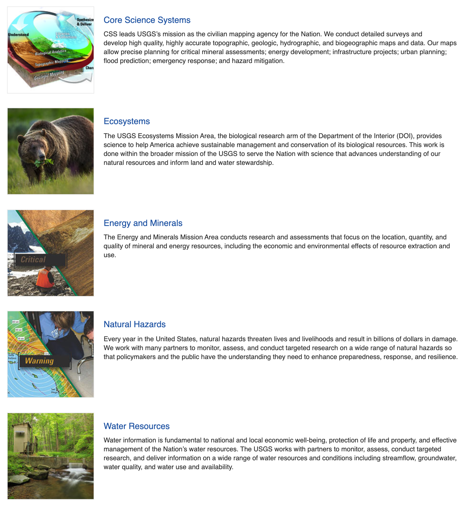
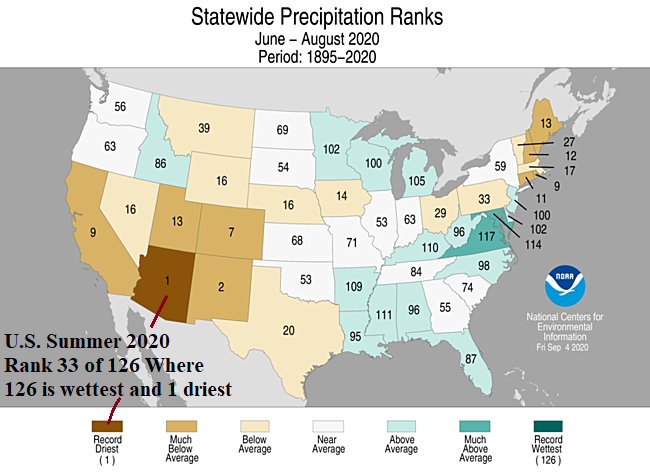

# USGS National Water Information System (NWIS)


**United States Geological Survey's National Water Information System (NWIS)**


## USGS Mission:

> Changes to the natural world combined with growing human demands put our health and safety, national security, and economy at risk. We are focused on some of the most significant issues society faces, and our science is making a substantial contribution to the well-being of the Nation and the world. 

You can explore [USGS Missions and programs here.](https://www.usgs.gov/science/mission-areas)

```{r, echo=FALSE}

```

## USGS Water Resources Mission:

>Water information is fundamental to national and local economic well-being, protection of life and property, and effective management of the Nation’s water resources. The USGS works with partners to monitor, assess, conduct targeted research, and deliver information on a wide range of water resources and conditions including streamflow, groundwater, water quality, and water use and availability.


The United States Geological Survey (USGS) has collected water-resources data at approximately 1.5 million sites in **all 50 States, the District of Columbia, Puerto Rico, the Virgin Islands, Guam, American Samoa and the Commonwealth of the Northern Mariana Islands**.

```{r, echo=FALSE}
knitr::include_graphics('./images/NWIS_sites.png')
```

A map of collection sites [can be found here](https://maps.waterdata.usgs.gov/mapper/index.html)

## Types of USGS NWIS Data

The types of data collected are varied, but generally fit into the broad categories of surface water and groundwater. 

**Surface-water data**, such as gage height (stage) and streamflow (discharge), are collected at major rivers, lakes, and reservoirs. 

**Groundwater data**, such as water level, are collected at wells and springs.

**Water-quality data** are available for both surface water and groundwater. Examples of water-quality data collected are temperature, specific conductance, pH, nutrients, pesticides, and volatile organic compounds.

The [NWIS web site](https://waterdata.usgs.gov/nwis) serves current and historical data. Data are retrieved by category of data, such as surface water, groundwater, or water quality, and by geographic area. 


<iframe width="560" height="315" src="https://www.youtube.com/embed/Tv3tzbv5OBs" frameborder="0" allow="accelerometer; autoplay; clipboard-write; encrypted-media; gyroscope; picture-in-picture" allowfullscreen></iframe>


## USGS R Packages: Collaborative and reproducible data analysis using R

> Contributors: Jordan Read, Lindsay Carr
> Adapted from USGS ['Getting Started with USGS R Packages' course materials](https://owi.usgs.gov/R/training-curriculum/usgs-packages/GettingStartedUSGS/)

Recently, the USGS has built a suite of software packages and tutorials for R users to to interact with their data and streamline workflows.  Here we have adapted course materials from thier USGS R packages course materials written and developed by Lindsay R. Carr.  


The common workflow for completing the data processing pipeline is subject to human error at every step: accessing data, analyzing data, and producing final figures. Multi-site analyses are especially error-prone because the same workflow needs to be repeated many times. This course teaches a modular approach to the common data analysis workflow by building on basic R data analysis skills and leveraging existing USGS R packages that can create advanced, reproducible workflows, such as for accessing gridded climate data, analyzing high frequency water observations, and for taking full advantage of the USGS ScienceBase repository. The USGS packages covered in this course span a variety of applications: accessing web data, accessing personally stored data, and releasing data for publication. 

The modular workflows taught in this section will prepare researchers to create automated, robust data processing workflows through more efficient code development. Following the course, students will be capable of integrating these packages into their own scientific workflows. 

### Suggested prerequisite knowledge

This course assumes a moderate to advanced knowledge of the statistical programming language R. If you're interested in using USGS packages for data analysis but have no R experience, please visit the [Introduction to R curriculum](/intro-curriculum) available at this site.

1. Experience using R to import, view, and summarize data
2. Recommended: experience creating simple plots in R
3. Recommended: familiarity with RStudio

### Course outline

```{r eval=TRUE, echo=FALSE, message=FALSE, warnings=FALSE}
Module <- c("dataRetrieval", "geoknife",  "Application")
Description <- c(
  "Accessing time series data.",
  "Accessing gridded data.",
  "Use the packages introduced in previous modules to create and use a robust modular workflow."
)
Duration <- c("2 hours", "1 hour",  "1.5 hour")

library(htmlTable)
htmlTable(data.frame(Module, Description, Duration),
          rnames=FALSE, align=c("l","l"), col.rgroup = c("none", "#F7F7F7"), 
          css.cell="padding-bottom: 0.5em; padding-right: 0.5em; padding-top: 0.5em;",
          caption = "<caption>Summary of Modules</caption>")
```

### Software requirements

See the [R installation instructions page](/installr) for how to install/upgrade R and RStudio, add GRAN to your settings, and install some basic packages. Then, execute these lines so that you have the most up-to-date version of the packages used in this course.

```{r eval=FALSE}
install.packages(c('dataRetrieval', 'geoknife'))
```


### Lesson Summary

This lesson will focus on finding and retrieving hydrologic time series data using the USGS R package, `dataRetrieval`. The package was created to make querying and downloading hydrologic data from the web easier, less error-prone, and reproducible. The package allows users to easily access data stored in the USGS National Water Information System (NWIS) and the multi-agency database, Water Quality Portal (WQP). NWIS only contains data collected by or for the USGS. Conversely, WQP is a database that aggregates water quality data from multiple agencies, including USGS, Environmental Protection Agency (EPA), US Department of Agriculture (USDA), and many state, tribal, and local agencies.

`dataRetrieval` functions take user-defined arguments and construct web service calls. The web service returns the data as XML (a standard data structure), and `dataRetrieval` takes care of parsing that into a useable R data.frame, complete with metadata. When web services change, `dataRetrieval` users aren't affected because the package maintainers will update the functions to handle these modifications. This is what makes `dataRetrieval` so user-friendly. 

Neither NWIS nor WQP are static databases. Users should be aware that data is constantly being added, so a query one week might return differing amounts of data from the next. For more information about NWIS, please visit [waterdata.usgs.gov/nwis](waterdata.usgs.gov/nwis). For more information about WQP, visit their site www.waterqualitydata.us or read about WQP for aquatic research applications in the publication, *[Water quality data for national-scale aquatic research: The Water Quality Portal](http://onlinelibrary.wiley.com/doi/10.1002/2016WR019993/abstract)*. 

### Lesson Objectives

Learn about data available in the National Water Information System (NWIS) and Water Quality Portal (WQP). Discover how to construct your retrieval calls to get exactly what you are looking for, and access information stored as metadata in the R object.

By the end of this lesson, the learner will be able to:

1. Investigate what data are available in National Water Information System (NWIS) and Water Quality Portal (WQP) through package functions.
2. Construct function calls to pull a variety of NWIS and WQP data.
3. Access metadata information from retrieval call output.

### Lesson Resources

- USGS publication: [The dataRetrieval R package](https://pubs.usgs.gov/tm/04/a10/pdf/tm4A10_appendix_1.pdf)
- Source code: [dataRetrieval on GitHub](https://github.com/USGS-R/dataRetrieval)
- Report a bug or suggest a feature: [dataRetrieval issues on GitHub](https://github.com/USGS-R/dataRetrieval/issues)
- USGS Presentation: [dataRetrieval Tutorial](https://owi.usgs.gov/R/dataRetrieval.html#1)


### Lesson Slide Deck


## Introduction to USGS R Packages


Before continuing with this lesson, you should make sure that the `dataRetrieval` package is installed and loaded. If you haven't recently updated, you could reinstall the package by running `install.packages('dataRetrieval')` or go to the "Update" button in the "Packages" tab in RStudio.

```{r load-dataRetrieval, warning=FALSE}
# load the dataRetrival package
library(dataRetrieval)
```

There is an overwhelming amount of data and information stored in the National Water Information System (NWIS). This lesson will attempt to give an overview of what you can access. If you need more detail on a subject or have a question that is not answered here, please visit the [NWIS help system](https://help.waterdata.usgs.gov/). 

## Data available

**Data types:** NWIS and WQP store a lot of water information. NWIS contains streamflow, peak flow, rating curves, groundwater, and water quality data. As can be assumed from the name, WQP only contains water quality data. 

**Time series types:** the databases store water data at various reporting frequencies, and have different language to describe these. There are 3 main types: unit value, daily value, and discrete. WQP only contains discrete data.

1. _instantaneous value_ (sometimes called _unit value_) data is reported at the frequency in which it was collected, and includes real-time data. It is generally available from 2007-present. 
2. _daily value_ data aggregated to a daily statistic (e.g. mean daily, minimum daily, or maximum daily).
This is available for streamflow, groundwater levels, and water quality sensors.
3. _discrete_ data collected at a specific point in time, and is not a continuous time series. This includes most water quality data, groundwater levels, rating curves, surface water measurements, and peak flow.

**Metadata types:** both NWIS and WQP contain metadata describing the site at which the data was collected (e.g. latitude, longitude, elevation, etc), and include information about the type of data being used (e.g. units, dissolved or not, collection method, etc). 

## Common NWIS function arguments

*_`siteNumber`_* All NWIS data are stored based on the geographic location of the equipment used to collected the data. These are known as streamgages and they take continuous timeseries measurements for a number of water quality and quantity parameters. Streamgages are identified based on an 8-digit (surface water) or 15-digit (groundwater) code. In `dataRetrieval`, we refer to this as the `siteNumber`. Any time you use a `siteNumber` in `dataRetrieval`, make sure it is a string and not numeric. Oftentimes, NWIS sites have leading zeroes which are dropped when treated as a numeric value. 

*_`parameterCd`_* NWIS uses 5-digit codes to refer to specific data of interest called parameter codes, `parameterCd` in `dataRetrieval`. For example, you use the code '00060' to specify discharge data. If you'd like to explore the full list, see the [Parameter Groups Table](https://help.waterdata.usgs.gov/code/parameter_cd_query?fmt=rdb&inline=true&group_cd=%). The package also has a built in parameter code table that you can use by executing `parameterCdFile` in your console.

*_`service`_* Identifier referring to the time series frequencies explained above, or the type of data that should be returned. For more information, visit the [Water Services website](https://waterservices.usgs.gov/rest/Site-Service.html#outputDataTypeCd).

  - instaneous = "iv"
  - daily values = "dv"
  - groundwater levels = "gwlevels"
  - water quality = "qw"
  - statistics = "stat"
  - site = "site"

*_`startDate`_* and *_`endDate`_* Strings in the format "YYYY-MM-DDTHH:SS:MM", either as a date or character class. The start and end date-times are inclusive.

*_`stateCd`_* Two character abbreviation for a US state or territory. Execute `state.abb` in the console to get a vector of US state abbreviations. Territories include: 

- AS  (American Samoa)
- GU  (Guam)
- MP  (Northern Mariana Islands)
- PR  (Puerto Rico)
- VI  (U.S. Virgin Islands)

For more query parameters, visit [NWIS service documentation](https://waterservices.usgs.gov/rest/Site-Service.html#Service).

## Discovering NWIS data

In some cases, users might have specific sites and data that they are pulling with `dataRetrieval` but what if you wanted to know what data exists in the database before trying to download it? You can use the function `whatNWISdata`, described below. Another option is to download the data using `readNWISdata`, and see the first and last available dates of that data with the arguments `seriesCatalogOutput=TRUE` and `service="site"`. Downloading data will be covered in the next section, [readNWIS](/usgs-packages/dataRetrieval-readNWIS).

### whatNWISdata

`whatNWISdata` will return a data.frame specifying the types of data available for a specified major filter that fits your querying criteria. You can add queries by the data service, USGS parameter code, or statistics code. You need at least one "major filter" in order for the query to work. "Major filters" include `siteNumber`, `stateCd`, `huc`, `bBox`, or `countyCd`.

In this example, let's find South Carolina stream temperature data. We specify the state, South Carolina, using the `stateCd` argument and South Carolina's two letter abbreviation, SC.

```{r data_sc, message=FALSE, warning=FALSE, cache=TRUE}
data_sc <- whatNWISdata(stateCd="SC")
nrow(data_sc)
```

Let's look at the dataframe returned from `whatNWISdata`:

```{r data_sc_explore, message=FALSE, warning=FALSE}
head(data_sc)
```

The data returned from this query can give you information about the data available for each site including, date of first and last record (`begin_date`, `end_date`), number of records (`count_nu`), site altitude (`alt_va`), corresponding hydrologic unit code (`huc_cd`), and parameter units (`parameter_units`). These columns allow even more specification of data requirements before actually downloading the data. This function returns one row per unique combination of site number, dates, parameter, etc. In order to just get the sites, use `unique`:

```{r data_sc_unique, message=FALSE, warning=FALSE}
sites_sc <- unique(data_sc$site_no)
length(sites_sc)
```

To be more specific, let's say we only want stream sites. This requires the `siteType` argument and the abbreviation "ST" for stream. See other siteTypes [here](https://help.waterdata.usgs.gov/code/site_tp_query?fmt=html). We also only want to use sites that have temperature data (USGS parameter code is 00010). Use the argument `parameterCd` and enter the code as a character string, otherwise leading zeroes will be dropped. Recall that you can see a table of all parameter codes by executing `parameterCdFile` in your console.

```{r data_sc_stream_temp, message=FALSE, warning=FALSE, cache=TRUE}
data_sc_stream_temp <- whatNWISdata(stateCd="SC", siteType="ST", parameterCd="00010")
nrow(data_sc_stream_temp)
```

We are now down to just `r prettyNum(nrow(data_sc_stream_temp), big.mark=",")` rows of data, much less than our original `r prettyNum(nrow(data_sc), big.mark=",")` rows. Downloading NWIS data will be covered in the next section, [readNWIS](/usgs-packages/dataRetrieval-readNWIS).

The `whatNWISdata` function can also be very useful for making quick maps with site locations, see the columns `dec_lat_va` and `dec_long_va` (decimal latitude and longitude value). For instance,

```{r sc_streamtemp_data_map, message=FALSE, warning=FALSE, fig.cap="Geographic locations of NWIS South Carolina stream sites with temperature data", fig.scap="Map of South Carolina stream temp sites"}
# SC stream temperature sites
library(maps)
map('state', regions='south carolina')
title(main="South Carolina Stream Temp Sites")
points(x=data_sc_stream_temp$dec_long_va, 
       y=data_sc_stream_temp$dec_lat_va)
```


Continuing with the South Carolina temperature data example, let's look for the mean daily stream temperature.  

```{r data_sc_stream_temp_avg, message=FALSE, warning=FALSE, cache=TRUE}
# Average daily SC stream temperature data
data_sc_stream_temp_avg <- whatNWISdata(
  stateCd="SC", 
  siteType="ST",
  parameterCd="00010",
  service="dv",
  statCd="00003")
nrow(data_sc_stream_temp_avg)
```

Let's apply an additional filter to these data using the `filter` function from `dplyr`. Imagine that the trend analysis you are conducting requires a minimum of 300 records and the most recent data needs to be no earlier than 1975.

```{r data_sc_stream_temp_avg_applicable, message=FALSE, warning=FALSE}
# Useable average daily SC stream temperature data
library(dplyr)
data_sc_stream_temp_avg_applicable <- data_sc_stream_temp_avg %>% 
  filter(count_nu >= 300, end_date >= "1975-01-01")
nrow(data_sc_stream_temp_avg_applicable)
```

This means you would have `r prettyNum(nrow(data_sc_stream_temp_avg_applicable), big.mark=",")` sites to work with for your study.

## Common WQP function arguments

*_`countrycode`_*, *_`statecode`_*, and *_`countycode`_* These geopolitical filters can be specified by a two letter abbreviation, state name, or Federal Information Processing Standard (FIPS) code. If you are using the FIPS code for a state or county, it must be preceded by the FIPS code of the larger geopolitical filter. For example, the FIPS code for the United States is `US`, and the FIPS code for South Carolina is `45`. When querying with the statecode, you can enter `statecode="US:45"`. The same rule extends to county FIPS; for example, you can use `countycode="45:001"` to query Abbeville County, South Carolina. You can find all state and county codes and abbreviations by executing `stateCd` or `countyCd` in your console.

*_`siteType`_* Specify the hydrologic location the sample was taken, e.g. streams, lakes, groundwater sources. These should be listed as a string. Available types can be found [here](https://www.waterqualitydata.us/Codes/Sitetype?mimeType=xml).

*_`organization`_* The ID of the reporting organization. All USGS science centers are written "USGS-" and then the two-letter state abbrevation. For example, the Wisconsin Water Science Center would be written "USGS-WI". For all available organization IDs, please see [this list of org ids](https://www.waterqualitydata.us/Codes/Organization?mimeType=xml). The id is listed in the "value" field, but they are accompanied by the organization name in the "desc" (description) field. 
*_`siteid`_* This is the unique identification number associated with a data collection station. Site IDs for the same location may differ depending on the reporting organization. The site ID string is written as the agency code then the site number separated by a hyphen. For example, the USGS site 01594440 would be written as "USGS-01594440".

*_`characteristicName`_* and *_`characteristicType`_* Unlike NWIS, WQP does not have codes for each parameter. Instead, you need to search based on the name of the water quality constituent (referred to as `characteristicName` in `dataRetrieval`) or a group of parameters (`characteristicType` in `dataRetrieval`). For example, "Nitrate" is a `characteristicName` and "Nutrient" is the `characteristicType` that it fits into. For a complete list of water quality types and names, see [characteristicType list](https://www.waterqualitydata.us/Codes/Characteristictype?mimeType=xml) and [characteristicName list](https://www.waterqualitydata.us/Codes/Characteristicname?mimeType=xml). 

*_`startDate`_* and *_`endDate`_* Arguments specifying the beginning and ending of the period of record you are interested in. For the `dataRetrieval` functions, these can be a date or character class in the form YYYY-MM-DD. For example, `startDate = as.Date("2010-01-01")` or `startDate = "2010-01-01"` could both be your input arguments.

## Discovering WQP data

WQP has millions of records, and if you aren't careful, your query could take hours because of the amount of data that met your criteria. To avoid this, you can query just for the number of records and number of sites that meet your criteria using the argument `querySummary=TRUE` in the function, `readWQPdata`. See the [lesson on downloading WQP data](/usgs-packages/readWQP) to learn more about getting data. You can also use `whatWQPsites` to get the site information that matches your criteria.

Let's follow a similar pattern to NWIS data discovery sections and explore available stream temperature data in South Carolina.

### readWQPdata + querySummary

`readWQPdata` is the function used to actually download WQP data. In this application, we are just querying for a count of sites and results that match our criteria. Since WQP expect state and county codes as their FIPS code, you will need to use the string "US:45" for South Carolina. 

```{r wqpcounts_sc, message=FALSE, warning=FALSE}
wqpcounts_sc <- readWQPdata(statecode="US:45", querySummary = TRUE)
names(wqpcounts_sc)
```

This returns a list with `r length(wqpcounts_sc)` different items, including total number of sites, breakdown of the number of sites by source (BioData, NWIS, STORET), total number of records, and breakdown of records count by source. Let's just look at total number of sites and total number of records.

```{r wqpcounts_sc_justcounts, message=FALSE, warning=FALSE}
wqpcounts_sc[['total-site-count']]
wqpcounts_sc[['total-result-count']]
```

This doesn't provide any information about the sites, just the total number. I know that with `r prettyNum(wqpcounts_sc[['total-result-count']], big.mark=",")` results, I will want to add more criteria before trying to download. Let's continue to add query parameters before moving to `whatWQPsites`.

```{r wqpcounts_sc_stream, message=FALSE, warning=FALSE}
# specify that you only want data from streams
wqpcounts_sc_stream <- readWQPdata(statecode="US:45", siteType="Stream",
                                  querySummary = TRUE)
wqpcounts_sc_stream[['total-site-count']]
wqpcounts_sc_stream[['total-result-count']]
```

`r prettyNum(wqpcounts_sc_stream[['total-result-count']], big.mark=",")` results are still a lot to download. Let's add more levels of criteria:

```{r wqpcounts_sc_stream_temp, message=FALSE, warning=FALSE}
# specify that you want water temperature data and it should be from 1975 or later
wqpcounts_sc_stream_temp <- readWQPdata(statecode="US:45", siteType="Stream",
                                       characteristicName="Temperature, water",
                                       startDate="1975-01-01",
                                       querySummary = TRUE)
wqpcounts_sc_stream_temp[['total-site-count']]
wqpcounts_sc_stream_temp[['total-result-count']]
```

`r prettyNum(wqpcounts_sc_stream_temp[['total-result-count']], big.mark=",")` is little more manageble. We can also easily compare avilable stream temperature and lake temperature data.

```{r wqpcounts_sc_streamVSlake, message=FALSE, warning=FALSE}
wqpcounts_sc_lake_temp <- readWQPdata(statecode="US:45", 
                                      siteType="Lake, Reservoir, Impoundment",
                                      characteristicName="Temperature, water",
                                      startDate="1975-01-01",
                                      querySummary = TRUE)
# comparing site counts
wqpcounts_sc_stream_temp[['total-site-count']]
wqpcounts_sc_lake_temp[['total-site-count']]

# comparing result counts
wqpcounts_sc_stream_temp[['total-result-count']]
wqpcounts_sc_lake_temp[['total-result-count']]
```

From these query results, it looks like South Carolina has much more stream data than it does lake data.

Now, let's try our South Carolina stream temperature query with `whatWQPsites` and see if we can narrow the results at all.

### whatWQPsites

`whatWQPsites` gives back site information that matches your search criteria. You can use any of the regular WQP web service arguments here. We are going to use `whatWQPsites` with the final criteria of the last query summary call - state, site type, parameter, and the earliest start date. This should return the same amount of sites as the last `readWQPdata` query did, `r prettyNum(wqpcounts_sc_stream_temp[['total-site-count']], big.mark=",")`.

```{r wqpsites_sc_stream_temp, message=FALSE, warning=FALSE}
# Getting the number of sites and results for stream 
# temperature measurements in South Carolina after 1975.
wqpsites_sc_stream_temp <- whatWQPsites(statecode="US:45", siteType="Stream",
                                       characteristicName="Temperature, water",
                                       startDate="1975-01-01")
# number of sites
nrow(wqpsites_sc_stream_temp)

# names of available columns
names(wqpsites_sc_stream_temp)
```

Similar to what we did with the NWIS functions, we can filter the sites further using the available metadata in `wqpsites_sc_stream_temp`. We are going to imagine that for our study the sites must have an associated drainage area and cannot be below sea level. Using `dplyr::filter`:

```{r wqpsites_sc_stream_temp_applicable, message=FALSE, warning=FALSE}
# Filtering the number of sites and results for stream temperature 
# measurements in South Carolina after 1975 to also have an
# associated drainage area and collected above sea level.
wqpsites_sc_stream_temp_applicable <- wqpsites_sc_stream_temp %>% 
  filter(!is.na(DrainageAreaMeasure.MeasureValue),
         VerticalMeasure.MeasureValue > 0)

nrow(wqpsites_sc_stream_temp_applicable)
```

This brings the count down to a much more manageable `r prettyNum(nrow(wqpsites_sc_stream_temp_applicable), big.mark=",")` sites. Now we are ready to download this data.

## readNWIS functions

We have learned how to discover data available in NWIS, but now we will look at how to retrieve data. There are many functions to do this, see the table below for a description of each. Each variation of `readNWIS` is accessing a different web service. For a definition and more information on each of these services, please see https://waterservices.usgs.gov/rest/. Also, refer to the previous lesson for a description of the major arguments to `readNWIS` functions.

```{r eval=TRUE, echo=FALSE, message=FALSE}
library(dataRetrieval)
Function <- c("readNWISdata", 'readNWISdv', "readNWISgwl", "readNWISmeas", "readNWISpCode", "readNWISpeak",
              "readNWISqw", "readNWISrating", "readNWISsite", "readNWISstat", "readNWISuse", "readNWISuv")
Description <- c(
  "Most general NWIS data import function. User must explicitly define the service parameter. More flexible than the other functions.",
  "Returns time-series data summarized to a day. Default is mean daily.",
  "Groundwater levels.",
  "Surface water measurements.",
  "Metadata information for one or many parameter codes.",
  "Annual maximum instantaneous streamflows and gage heights.",
  "Discrete water quality data.",
  "Rating table information for active stream gages",
  "Site metadata information",
  "Daily, monthly, or annual statistics for time-series data. Default is mean daily.",
  "Data from the USGS National Water Use Program.",
  "Returns time-series data reported from the USGS Instantaneous Values Web Service."
)
Arguments <- unlist(lapply(Function, function(f) { paste(names(formals(f)), collapse = ", ") }))

Function_fancy <- c('<a href="#readnwisdata">readNWISdata</a>', 
                    '<a href="#readnwisdv">readNWISdv</a>', 
                    '<a href="#readnwisgwl">readNWISgwl</a>', 
                    '<a href="#readnwismeas">readNWISmeas</a>',
                    '<a href="#readnwispcode">readNWISpCode</a>',
                    '<a href="#readnwispeak">readNWISpeak</a>',
                    '<a href="#readnwisqw">readNWISqw</a>',
                    '<a href="#readnwisrating">readNWISrating</a>',
                    '<a href="#readnwissite">readNWISsite</a>',
                    '<a href="#readnwisstat">readNWISstat</a>',
                    '<a href="#readnwisuse">readNWISuse</a>',
                    '<a href="#readnwisuv">readNWISuv</a>')

library(htmlTable)
htmlTable(data.frame(Function = Function_fancy, 
                     Description = Description, 
                     Arguments = Arguments), caption="<caption>Table 1. readNWIS function definitions</caption>",
          rnames=FALSE, align=c("l","l","l"), col.rgroup = c("none", "#F7F7F7"), 
          css.cell="padding-bottom: 0.5em; padding-right: 0.5em; padding-top: 0.5em;")

source("arg_table_functions.R")
```

\html{<br>}

Each service-specific function is a wrapper for the more flexible `readNWISdata`. They set a default for the service argument and have limited user defined arguments. All `readNWIS` functions require a "major filter" as an argument, but `readNWISdata` can accept any major filter while others are limited to site numbers or state/county codes (see Table 1 for more info). 

Other major filters that can be used in `readNWISdata` include hydrologic unit codes (`huc`) and bounding boxes (`bBox`). More information about major filters can be found in the [NWIS web services documentation](https://waterservices.usgs.gov/rest/Site-Service.html#Major_Filters).

The following are examples of how to use each of the readNWIS family of functions. Don't forget to load the `dataRetrieval` library if you are in a new session.

1. [readNWISdata, county major filter](#readnwisdata-county)
2. [readNWISdata, huc major filter](#readnwisdata-huc)
3. [readNWISdata, bbox major filter](#readnwisdata-bbox)
4. [readNWISdv](#readnwisdv)
5. [readNWISgwl](#readnwisgwl)
6. [readNWISmeas](#readnwismeas)
7. [readNWISpCode](#readnwispcode)
8. [readNWISpeak](#readnwispeak)
9. [readNWISqw, multiple sites](#readnwisqw-multsite)
10. [readNWISqw, multiple parameters](#readnwisqw-multparm)
11. [readNWISrating, using base table](#readnwisrating)
12. [readNWISrating, corrected table](#readnwisrating)
13. [readNWISrating, shift table](#readnwisrating)
14. [readNWISsite](#readnwissite)
15. [readNWISstat](#readnwisstat)
16. [readNWISuse](#readnwisuse)
17. [readNWISuv](#readnwisuv)


### readNWISdata

This function is the generic, catch-all for pulling down NWIS data. It can accept a number of arguments, but the argument name must be included. To use this function, you need to specify at list one major filter (state, county, site number, huc, or bounding box) and the NWIS service (daily value, instantaneous, groundwater, etc). The rest are optional query parameters. Follow along with the three examples below or see `?readNWISdata` for more information.

<a name="readnwisdata-county"></a>

**Historic mean daily streamflow for sites in Maui County, Hawaii.**

```{r readnwisdata-county, message=FALSE, warning=FALSE}
# Major filter: Maui County 
## need to also include the state when using counties as the major filter
# Service: daily value, dv
# Parameter code: streamflow in cfs, 00060

MauiCo_avgdailyQ <- readNWISdata(stateCd="Hawaii", countyCd="Maui", service="dv", parameterCd="00060")
head(MauiCo_avgdailyQ)

# How many sites are returned?
length(unique(MauiCo_avgdailyQ$site_no))
```

<a name="readnwisdata-huc"></a>

**Historic minimum water temperatures for the HUC8 corresponding to the island of Maui, Hawaii.**

To see all HUCs available, visit https://water.usgs.gov/GIS/huc_name.html. The default statistic for daily values in `readNWISdata` is to return the max (00001), min (00002), and mean (00003). We will specify the minimum only for this example. You will need to use the statistic code, not the name. For all the available statistic codes, see the [statType web service documentation](https://waterservices.usgs.gov/rest/Statistics-Service.html#statType) and [NWIS table mapping statistic names to codes](https://help.waterdata.usgs.gov/stat_code). Caution! In `readNWISdata` and `readNWISdv` the argument is called `statCd`, but in `readNWISstat` the argument is `statType`.

```{r readnwisdata-huc, message=FALSE, warning=FALSE}
# Major filter: HUC 8 for Maui, 20020000
# Service: daily value, dv
# Statistic: minimum, 00002
# Parameter code: water temperature in deg C, 00010

MauiHUC8_mindailyT <- readNWISdata(huc="20020000", service="dv", statCd="00002", parameterCd="00010")
head(MauiHUC8_mindailyT)

# How many sites are returned?
length(unique(MauiHUC8_mindailyT$site_no))
```

<a name="readnwisdata-bbox"></a>

**Total nitrogen in mg/L for last 30 days around Great Salt Lake in Utah.**

This example uses `Sys.Date` to get the most recent date, so your dates will differ. To get any data around Great Salt Lake, we will use a bounding box as the major filter. The bounding box must be a vector of decimal numbers indicating the western longitude, southern latitude, eastern longitude, and northern latitude. The vector must be in that order.

```{r readnwisdata-bbox, message=FALSE, warning=FALSE}
# Major filter: bounding box around Great Salt Lake 
# Service: water quality, qw
# Parameter code: total nitrogen in mg/L, 00600
# Beginning: this past 30 days, use Sys.Date()

prev30days <- Sys.Date() - 30
SaltLake_totalN <- readNWISdata(bBox=c(-113.0428, 40.6474, -112.0265, 41.7018), service="qw", 
                           parameterCd="00600", startDate=prev30days)
# This service returns a lot of columns:
names(SaltLake_totalN)

# How many sites are returned?
length(unique(SaltLake_totalN$site_no))
```

### readNWISdv

This function is the daily value service function. It has a limited number of arguments and requires a site number and parameter code. Follow along with the example below or see `?readNWISdv` for more information.

<a name="readnwisdv"></a>

**Minimum and maximum pH daily data for a site on the Missouri River near Townsend, MT.**

```{r readnwisdv, message=FALSE, warning=FALSE}
# Remember, you can always use whatNWISdata to see what is available at the site before querying
mt_available <- whatNWISdata(siteNumber="462107111312301", service="dv", parameterCd="00400")
head(mt_available)

# Major filter: site number, 462107111312301
# Statistic: minimum and maximum, 00001 and 00002
# Parameter: pH, 00400
mt_site_pH <- readNWISdv(siteNumber="462107111312301", parameterCd="00400", 
                         statCd=c("00001", "00002"))
head(mt_site_pH)
```

### readNWISgwl

This function is the groundwater level service function. It has a limited number of arguments and requires a site number. Follow along with the example below or see `?readNWISgwl` for more information.

<a name="readnwisgwl"></a>

**Historic groundwater levels for a site near Portland, Oregon.**

```{r readnwisgwl, message=FALSE, warning=FALSE}
# Major filter: site number, 452840122302202
or_site_gwl <- readNWISgwl(siteNumbers="452840122302202")
head(or_site_gwl)
```

### readNWISmeas

This function is the field measurement service function which pulls manual measurements for streamflow and gage height. It has a limited number of arguments and requires a site number. Follow along with the example below or see `?readNWISmeas` for more information.

<a name="readnwismeas"></a>

**Historic surface water measurements for a site near Dade City, Florida.**

```{r readnwismeas, message=FALSE, warning=FALSE}
# Major filter: site number, 02311500
fl_site_meas <- readNWISmeas(siteNumbers="02311500")
# Names of columns returned:
names(fl_site_meas)
```

### readNWISpCode

This function returns the parameter information associated with a parameter code. It only has one argument - the parameter code. See the example below or `?readNWISpCode` for more information.

<a name="readnwispcode"></a>

**Get information about the parameters gage height, specific conductance, and total phosphorus.**

This function only has one argument, the parameter code. You can supply one or multiple and you will get a dataframe with information about each parameter.

```{r readnwispcode, message=FALSE, warning=FALSE}
# gage height, 00065
readNWISpCode("00065")

# specific conductance and total phosphorus, 00095 and 00665
readNWISpCode(c("00095", "00665"))
```

### readNWISpeak

This function is the peak flow service function. It has a limited number of arguments and requires a site number. Follow along with the example below or see `?readNWISpeak` for more information.

The default settings will return data where the date of the peak flow is known. To see peak flows with incomplete dates, change `convertType` to `FALSE`. This allows the date column to come through as character, keeping any incomplete or incorrect dates.

<a name="readnwispeak"></a>

**Peak flow values for a site near Cassia, Florida.**

```{r readnwispeak, message=FALSE, warning=FALSE}
# Major filter: site number, 02235200
fl_site_peak <- readNWISpeak(siteNumbers="02235200")
fl_site_peak$peak_dt

# Compare complete with incomplete/incorrect dates
fl_site_peak_incomp <- readNWISpeak(siteNumbers="02235200", convertType = FALSE)
fl_site_peak_incomp$peak_dt[is.na(fl_site_peak$peak_dt)]
```

### readNWISqw

This function is the water quality service function. It has a limited number of arguments and requires a site number and a parameter code. Follow along with the two examples below or see `?readNWISqw` for more information.

<a name="readnwisqw-multsite"></a>

**Dissolved oxygen for two sites near the Columbia River in Oregon for water year 2016**

```{r readnwisqw-multsite, message=FALSE, warning=FALSE}
# Major filter: site numbers, 455415119314601 and 454554119121801
# Parameter: dissolved oxygen in mg/L, 00300
# Begin date: October 1, 2015
# End date: September 30, 2016

or_site_do <- readNWISqw(siteNumbers=c("455415119314601", "454554119121801"), parameterCd="00300",
                        startDate="2015-10-01", endDate="2016-09-30")
ncol(or_site_do)
head(or_site_do[,c("site_no","sample_dt","result_va")])
```

<a name="readnwisqw-multparm"></a>

**Post Clean Water Act lead and mercury levels in McGaw, Ohio.**

```{r readnwisqw-multparm, message=FALSE, warning=FALSE}
# Major filter: site number, 03237280
# Parameter: mercury and lead in micrograms/liter, 71890 and 01049
# Begin date: January 1, 1972

oh_site_cwa <- readNWISqw(siteNumbers="03237280", 
                          parameterCd=c("71890", "01049"),
                          startDate="1972-01-01")
nrow(oh_site_cwa)
ncol(oh_site_cwa)
head(oh_site_cwa[,c("parm_cd","sample_dt","result_va")])
```

### readNWISrating

This function is the rating curve service function. It has a limited number of arguments and requires a site number. Follow along with the three examples below or see `?readNWISrating` for more information.

There are three different types of rating tables that can be accessed using the argument `type`. They are `base`, `corr` (corrected), and `exsa` (shifts). For `type=="base"` (the default), the result is a data frame with 3 columns: `INDEP`, `DEP`, and `STOR`. For `type=="corr"`, the resulting data frame will have 3 columns: `INDEP`, `CORR`, and `CORRINDEP`. For `type=="exsa"`, the data frame will have 4 columns: `INDEP`, `DEP`, `STOR`, and `SHIFT`. See below for definitions of each column.

- `INDEP` is the gage height in feet
- `DEP` is the streamflow in cubic feet per second
- `STOR` "*" indicates a fixed point of the rating curve, `NA` for non-fixed points
- `SHIFT` indicates shifting in rating for the corresponding `INDEP` value
- `CORR` are the corrected values of `INDEP`
- `CORRINDEP` are the corrected values of `CORR`

There are also a number of attributes associated with the data.frame returned - `url`, `queryTime`, `comment`, `siteInfo`, and `RATING`. `RATING` will only be included when `type` is `base`. See [this section](#accessing-attributes) for how to access attributes of `dataRetrieval` data frames.

<a name="readnwisrating"></a>

**Rating tables for Mississippi River at St. Louis, MO**

```{r readnwisrating-base, message=FALSE, warning=FALSE}
# Major filter: site number, 07010000
# Type: default, base 

miss_rating_base <- readNWISrating(siteNumber="07010000")
head(miss_rating_base)
```


```{r readnwisrating-corr, message=FALSE, warning=FALSE}
# Major filter: site number, 07010000
# Type: corr 

miss_rating_corr <- readNWISrating(siteNumber="07010000", type="corr")
head(miss_rating_corr)
```


```{r readnwisrating-exsa, message=FALSE, warning=FALSE}
# Major filter: site number, 07010000
# Type: exsa 

miss_rating_exsa <- readNWISrating(siteNumber="07010000", type="exsa")
head(miss_rating_exsa)
```

### readNWISsite

This function is pulls data from a USGS site file. It only has one argument - the site number. Follow along with the example below or see `?readNWISsite` for more information.

<a name="readnwissite"></a>

**Get metadata information for a site in Bronx, NY**

```{r readnwissite, message=FALSE, warning=FALSE}
# site number, 01302020

readNWISsite(siteNumbers="01302020")
```

### readNWISstat

This function is the statistics service function. It has a limited number of arguments and requires a site number and parameter code. Follow along with the example below or see `?readNWISstat` for more information.

The [NWIS Statistics web service](https://waterservices.usgs.gov/rest/Statistics-Service.html) is currently in Beta mode, so use at your own discretion. Additionally, "mean" is the only `statType` that can be used for annual or monthly report types at this time.

<a name="readnwisstat"></a>

**Historic annual average discharge near Mississippi River outlet**

```{r readnwisstat, message=FALSE, warning=FALSE}
# Major filter: site number, 07374525
# Parameter: discharge in cfs, 00060
# Time division: annual
# Statistic: average, "mean"

mississippi_avgQ <- readNWISstat(siteNumbers="07374525", parameterCd="00060", 
                                 statReportType="annual", statType="mean")
head(mississippi_avgQ)
```

### readNWISuse

This function is the water use service function. The water use data web service requires a state and/or county as the major filter. The default will return all years and all categories available. The following table shows the water-use categories and their corresponding abbreviation for county and state data. Note that categories have changed over time, and vary by data sets requested. National and site-specific data sets exist, but only county/state data are available through this service. Please visit the [USGS National Water Use Information Program website](https://water.usgs.gov/watuse/) for more information.

```{r eval=TRUE, echo=FALSE, message=FALSE}
Name <- c('Aquaculture', 'Commercial', 'Domestic', 'Hydroelectric Power', 
          'Irrigation, Crop', 'Irrigation, Golf Courses', 'Industrial', 
          'Total Irrigation', 'Livestock (Animal Specialties)', 'Livestock', 
          'Livestock (Stock)', 'Mining', 'Other Industrial', 
          'Thermoelectric Power (Closed-loop cooling)', 
          'Fossil-fuel Thermoelectric Power', 'Geothermal Thermoelectric Power', 
          'Nuclear Thermoelectric Power', 'Thermoelectric Power (Once-through cooling)', 
          'Public Supply', 'Total Power', 'Total Thermoelectric Power', 
          'Reservoir Evaporation', 'Total Population', 'Wastewater Treatment'
)
Abbreviation <- c('AQ', 'CO', 'DO', 'HY', 'IC', 'IG', 'IN', 'IT', 'LA', 'LI', 'LS', 'MI', 
                  'OI', 'PC', 'PF', 'PG', 'PN', 'PO', 'PS', 'PT', 'PT', 'RE', 'TP', 'WW')

library(htmlTable)
htmlTable(data.frame(Name, Abbreviation), caption="<caption>Table 2. Water-use category names and abbreviations.</caption>",
          rnames=FALSE, align=c("l","l"), col.rgroup = c("none", "#F7F7F7"), 
          css.cell="padding-bottom: 0.5em; padding-right: 0.5em; padding-top: 0.5em;")
```

Follow along with the example below or see `?readNWISuse` for more information.

<a name="readnwisuse"></a>

**Las Vegas historic water use**

```{r readnwisuse, message=FALSE, warning=FALSE}
# Major filter: Clark County, NV
# Water-use category: public supply, PS
vegas_wu <- readNWISuse(stateCd="NV", countyCd="Clark", categories="PS")
ncol(vegas_wu)
names(vegas_wu)
head(vegas_wu[,1:7])
```

### readNWISuv

This function is the unit value (or instantaneous) service function. It has a limited number of arguments and requires a site number and parameter code. Follow along with the example below or see `?readNWISuv` for more information.

<a name="readnwisuv"></a>

**Turbidity and discharge for April 2016 near Lake Tahoe in California.**

```{r readnwisuv, message=FALSE, warning=FALSE}
# Major filter: site number, 10336676
# Parameter: discharge in cfs and turbidity in FNU, 00060 and 63680
# Begin date: April 1, 2016
# End date: April 30, 2016

ca_site_do <- readNWISuv(siteNumbers="10336676", parameterCd=c("00060", "63680"),
                         startDate="2016-04-01", endDate="2016-04-30")
nrow(ca_site_do)
head(ca_site_do)
```

## Additional Features

### Accessing attributes

`dataRetrieval` returns a lot of useful information as "attributes" to the data returned. This includes site metadata information, the NWIS url used, date and time the query was performed, and more. First, you want to use `attributes()` to see what information is available. It returns a list of all the metadata information. Then you can use `attr()` to actually get that information. Let's use the base rating table example from before to illustrate this. It has a special attribute called "RATING".

```{r readnwis-attributes, message=FALSE, warning=FALSE}
# Major filter: site number, 07010000
# Type: default, base 
miss_rating_base <- readNWISrating(siteNumber="07010000")

# how many attributes are there and what are they?
length(attributes(miss_rating_base))
names(attributes(miss_rating_base))

# look at the site info
attr(miss_rating_base, "siteInfo")

# now look at the special RATING attribute
attr(miss_rating_base, "RATING")
```

All attributes are an R object once you extract them. They can be lists, data.frames, vectors, etc. If we want to use information from one of the attributes, index it just like you would any other object of that type. For example, we want the drainage area for this Mississippi site:

```{r readnwis-attributes2, message=FALSE, warning=FALSE}
# save site info metadata as its own object
miss_site_info <- attr(miss_rating_base, "siteInfo")
class(miss_site_info)

# extract the drainage area
miss_site_info$drain_area_va
```

### Using lists as input

`readNWISdata` allows users to give a list of named arguments as the input to the call. This is especially handy if you would like to build up a list of arguments and use it in multiple calls. This only works in `readNWISdata`, none of the other `readNWIS...` functions have this ability.

```{r readnwisdata-lists, message=FALSE, warning=FALSE}
chicago_q_args <- list(siteNumbers=c("05537500", "05536358", "05531045"),
                       startDate="2015-10-01",
                       endDate="2015-12-31",
                       parameterCd="00060")

# query for unit value data with those arguments
chicago_q_uv <- readNWISdata(chicago_q_args, service="uv")
nrow(chicago_q_uv)

# same query but for daily values
chicago_q_dv <- readNWISdata(chicago_q_args, service="dv")
nrow(chicago_q_dv)
```

### Helper functions

There are currently 3 helper functions: renameNWIScolumns, addWaterYear, and zeroPad. `renameNWIScolumns` takes some of the default column names and makes them more human-readable (e.g. "X_00060_00000" becomes "Flow_Inst"). `addWaterYear` adds an additional column of integers indicating the water year. `zeroPad` is used to add leading zeros to any string that is missing them, and is not restricted to `dataRetrieval` output.

**renameNWIScolumns**

`renameNWIScolumns` can be used in two ways: it can be a standalone function following the `dataRetrieval` call or it can be piped (as long as `magrittr` or `dplyr` are loaded). Both examples are shown below. Note that `renameNWIScolumns` is intended for use with columns named using pcodes. It does not work with all possible data returned.

```{r renameNWIScolumns, message=FALSE, warning=FALSE}
# get discharge and temperature data for July 2016 in Ft Worth, TX
ftworth_qt_july <- readNWISuv(siteNumbers="08048000", parameterCd=c("00060", "00010"), 
                              startDate="2016-07-01", endDate="2016-07-31")
names(ftworth_qt_july)

# now rename columns
ftworth_qt_july_renamed <- renameNWISColumns(ftworth_qt_july)
names(ftworth_qt_july_renamed)
```

Now try with a pipe. Remember to load a packge that uses `%>%`.

```{r renameNWIScolumns-pipe, message=FALSE, warning=FALSE}
library(magrittr)

# get discharge and temperature data for July 2016 in Ft Worth, TX
# pipe straight into rename function
ftworth_qt_july_pipe <- readNWISuv(siteNumbers="08048000", parameterCd=c("00060", "00010"), 
                                   startDate="2016-07-01", endDate="2016-07-31") %>% 
  renameNWISColumns()

names(ftworth_qt_july_pipe)
```

**addWaterYear**

Similar to `renameNWIScolumns`, `addWaterYear` can be used as a standalone function or with a pipe. This function defines a water year as October 1 of the previous year to September 30 of the current year. Additionally, `addWaterYear` is limited to data.frames with date columns titled "dateTime", "Date", "ActivityStartDate", and "ActivityEndDate".

```{r addWaterYear, message=FALSE, warning=FALSE}
# mean daily discharge on the Colorado River in Grand Canyon National Park for fall of 2014
# The dates in Sept should be water year 2014, but the dates in Oct and Nov are water year 2015
co_river_q_fall <- readNWISdv(siteNumber="09403850", parameterCd="00060", 
                              startDate="2014-09-28", endDate="2014-11-30")
head(co_river_q_fall)

# now add the water year column
co_river_q_fall_wy <- addWaterYear(co_river_q_fall)
head(co_river_q_fall_wy)
unique(co_river_q_fall_wy$waterYear)
```

Now try with a pipe. 

```{r addWaterYear-pipe, message=FALSE, warning=FALSE}
# mean daily discharge on the Colorado River in Grand Canyon National Park for fall of 2014
# pipe straight into rename function
co_river_q_fall_pipe <- readNWISdv(siteNumber="09403850", parameterCd="00060", 
                              startDate="2014-09-01", endDate="2014-11-30") %>% 
  addWaterYear()

names(co_river_q_fall_pipe)
head(co_river_q_fall_pipe)
```

**zeroPad**

`zeroPad` is designed to work on any string, so it is not specific to `dataRetrieval` data.frame output like the previous helper functions. Oftentimes, when reading in Excel or other local data, leading zeros are dropped from site numbers. This function allows you to put them back in. `x` is the string you would like to pad, and `padTo` is the total number of characters the string should have. For instance if an 8-digit site number was read in as numeric, we could pad that by:

```{r zeroPad, message=FALSE, warning=FALSE}
siteNum <- 02121500
class(siteNum)
siteNum

siteNum_fix <- zeroPad(siteNum, 8)
class(siteNum_fix)
siteNum_fix
```

The next lesson looks at how to use `dataRetrieval` functions for Water Quality Portal retrievals.

## readWQP functions

After discovering Water Quality Portal (WQP) data in the [data discovery section](/dataRetrieval-discovery), we can now read it in using the desired parameters. There are two functions to do this in `dataRetrieval`. Table 1 describes them below. 

```{r eval=TRUE, echo=FALSE, message=FALSE}
library(dataRetrieval)
Function <- c("readWQPdata", 'readWQPqw')
Description <- c(
  "Most general WQP data import function. Users must define each parameter.",
  "Used for querying by site numbers and parameter codes only.")
Arguments <- unlist(lapply(Function, function(f) { paste(names(formals(f)), collapse = ", ") }))

Function_fancy <- c('<a href="#readwqpdata">readWQPdata</a>', 
                    '<a href="#readwqpqw">readWQPqw</a>')

library(htmlTable)
htmlTable(data.frame(Function = Function_fancy, 
                     Description = Description, 
                     Arguments = Arguments), caption="<caption>Table 1. readWQP function definitions</caption>",
          rnames=FALSE, align=c("l","l","l"), col.rgroup = c("none", "#F7F7F7"), 
          css.cell="padding-bottom: 0.5em; padding-right: 0.5em; padding-top: 0.5em;")

source("arg_table_functions.R")
```

\html{<br>}

The main difference between these two functions is that `readWQPdata` is general and accepts any of the paremeters described in the [WQP Web Services Guide](https://www.waterqualitydata.us/webservices_documentation/#WQPWebServicesGuide-Submitting). In contrast, `readWQPqw` has five arguments and users can only use this if they know the site number(s) and parameter code(s) for which they want data.

The following are examples of how to use each of the readWQP family of functions. Don't forget to load the `dataRetrieval` library if you are in a new session.

1. [readWQPdata, state, site type, and characteristic name](#readwqpdata-state)
2. [readWQPdata, county and characteristic group](#readwqpdata-county)
3. [readWQPdata, bbox, characteristic name, and start date](#readwqpdata-bbox)
4. [readWQPqw](#readwqpqw)

### readWQPdata

The generic function used to pull Water Quality Portal data. This function is very flexible. You can specify any of the parameters from the [WQP Web Service Guide](https://www.waterqualitydata.us/webservices_documentation/#WQPWebServicesGuide-Submitting). To learn what the possible values for each, see the [table of domain values](https://www.waterqualitydata.us/webservices_documentation/#WQPWebServicesGuide-Domain). Follow along with the three examples below or see `?readWQPdata` for more information.

<a name="readwqpdata-state"></a>

**Phosphorus data in Wisconsin lakes for water year 2010**

```{r readwqpdata-state, message=FALSE, warning=FALSE, cache=TRUE}
# This takes about 3 minutes to complete.
WI_lake_phosphorus_2010 <- readWQPdata(statecode="WI", 
                                       siteType="Lake, Reservoir, Impoundment", 
                                       characteristicName="Phosphorus", 
                                       startDate="2009-10-01", endDate="2010-09-30")

# What columns are available?
names(WI_lake_phosphorus_2010)

#How much data is returned?
nrow(WI_lake_phosphorus_2010)
```

<a name="readwqpdata-county"></a>

**All nutrient data in Napa County, California**

```{r readwqpdata-county, message=FALSE, warning=FALSE, cache=TRUE}
# Use empty character strings to specify that you want the historic record.
# This takes about 3 minutes to run.
Napa_lake_nutrients_Aug2010 <- readWQPdata(statecode="CA", countycode="055", 
                                           characteristicType="Nutrient")

#How much data is returned?
nrow(Napa_lake_nutrients_Aug2010)
```

<a name="readwqpdata-bbox"></a>

**Everglades water temperature data since 2016**

```{r readwqpdata-bbox, message=FALSE, warning=FALSE, cache=TRUE}
# Bounding box defined by a vector of Western-most longitude, Southern-most latitude, 
# Eastern-most longitude, and Northern-most longitude.
# This takes about 3 minutes to run.
Everglades_temp_2016_present <- readWQPdata(bBox=c(-81.70, 25.08, -80.30, 26.51),  
                                            characteristicName="Temperature, water",
                                            startDate="2016-01-01")

#How much data is returned?
nrow(Everglades_temp_2016_present)
```

### readWQPqw

This function has a limited number of arguments - it can only be used for pulling WQP data by site number and parameter code. By default, dates are set to pull the entire record available. When specifying USGS sites as `siteNumbers` to `readWQP` functions, precede the number with "USGS-". See the example below or `?readWQPqw` for more information.

<a name="readwqpqw"></a>

**Dissolved oxygen data since 2010 for 2 South Carolina USGS sites**

```{r readwqpqw, message=FALSE, warning=FALSE, cache=TRUE}
# Using a few USGS sites, get dissolved oxygen data
# This takes ~ 30 seconds to complete.
SC_do_data_since2010 <- readWQPqw(siteNumbers = c("USGS-02146110", "USGS-325427080014600"),
                                  parameterCd = "00300", startDate = "2010-01-01")

# How much data was returned?
nrow(SC_do_data_since2010)

# What are the DO values and the dates the sample was collected?
head(SC_do_data_since2010[, c("ResultMeasureValue", "ActivityStartDate")])
```

## Attributes and metadata

Similar to the data frames returned from `readNWIS` functions, there are attributes (aka metadata) attached to the data. Use `attributes` to see all of them and `attr` to extract a particular attribute.

```{r readwqp-attributes, message=FALSE, warning=FALSE}
# What are the attributes available?
wqp_attributes <- attributes(Everglades_temp_2016_present)
names(wqp_attributes)

# Look at the variableInfo attribute
head(attr(Everglades_temp_2016_present, "variableInfo"))
```

Let's make a quick map to look at the stations that collected the Everglades data:

```{r, fig.cap = "A map of NWIS site locations in the Everglades", fig.scap = "Map of NWIS Everglade sites"}
siteInfo <- attr(Everglades_temp_2016_present, "siteInfo")

library(maps)
map('state', regions='florida')
title(main="Everglade Sites")
points(x=siteInfo$dec_lon_va, 
       y=siteInfo$dec_lat_va)
# Add a rectangle to see where your original query bounding box in relation to sites
rect(-81.70, 25.08, -80.30, 26.51, col = NA, border = 'red')
```

You can now find and download Water Quality Portal data from R! 

## USGS Coding Lab Exercises

### Just how dry was the 2020 monsoon?
```{r, echo=FALSE}

```


Recently NOAA published a press release demonstrating that 2020 was *both* the hottest *and* driest summer on record for Arizona.  In this lab we will look at USGS NWIS stream gauge and preciptitation data to investigate just how anomalous 2020 data are. 

**1:** Use the `readNWISstat` function to retrieve the following statewide data for 2015-2020:
1. Precipitation total (inches/week)
2. Streamflow (ft^3/s)

**2:** Create two timeseries plots (one for preciptitation, one for streamflow), where color is a function of year (e.g. the x axis is month, the y axis is precipitation, legend shows color by year).

**3.** Calculate the monthly mean precipitation and streamflow from 2015-2019, and use that mean to calculate a 2020 anomaly timeseries.  Create two new plots (like #2 above) with the 2015-2019 mean as a thick black line, and 2020 anomaly as a thin red line.


## geoKnife - Introduction

## Lesson Summary

This lesson will explore how to find and download large gridded datasets via the R package `geoknife`. The package was created to allow easy access to data stored in the [Geo Data Portal (GDP)](https://cida.usgs.gov/gdp/), or any gridded dataset available through the [OPeNDAP](https://www.opendap.org/) protocol DAP2 that meets some basic metadata requirements. `geoknife` refers to the gridded dataset as the `fabric`, the spatial feature of interest as the `stencil`, and the subset algorithm parameters as the `knife` (see below).


## Lesson Objectives

Explore and query large gridded datasets for efficient and reproducible large-scale analyses.

By the end of this lesson, the learner will be able to:

1. Explain the differences between remote and local processing.
2. Differentiate the three main concepts of this package: fabric, stencil, and knife.
3. Use this package to retrieve pre-processed data from the Geo Data Portal (GDP) via geoknife.

## Lesson Resources

- Publication: [geoknife: reproducible web-processing of large gridded datasets](http://onlinelibrary.wiley.com/doi/10.1111/ecog.01880/abstract)
- Tutorial (vignette): [geoknife vignette](https://cran.r-project.org/web/packages/geoknife/vignettes/geoknife.html)
- An overview of [remote processing basics](https://cida.usgs.gov/gdp/how-to-gdp/) with the Geo Data Portal
- A blog post on [visualizing Tropical Storm Colin rainfall](https://waterdata.usgs.gov/blog/ts-colin-precip/) with geoknife
- Source code: [geoknife on GitHub](https://github.com/USGS-R/geoknife)
- Report a bug or suggest a feature: [geoknife issues on GitHub](https://github.com/USGS-R/geoknife/issues)

## Remote processing

The USGS Geo Data Portal is designed to perform web-service processing on large gridded datasets. `geoknife` allows R users to take advantage of these services by processing large data, such as data available in the GDP catalog or a user-defined dataset, on the web. This type of workflow has three main advantages: 

1. it allows the user to avoid downloading large datasets, 
2. it avoids reinventing the wheel for the creation and optimization of complex geoprocessing algorithms, and 
3. computing resources are dedicated elsewhere, so geoknife operations do not have much of an impact on a local computer.

## geoknife components: fabric, stencil, knife

The main components of a geoknife workflow are the "fabric", "stencil", and "knife". These three components go into the final element, the geoknife "job" (geojob), which defines what the user needs from the processing, allows tracking of the processing status, and methods to dowload the results. The fabric is the gridded web dataset to be processed, the stencil is the feature of interest, and the knife is the processing algorithm parameters. Each of the `geoknife` components is created using a corresponding function: fabrics are created using `webdata()`, stencils are created using `webgeom()` or `simplegeom()`, and knives are created using `webprocess()`. 

This lesson will focus on discovering what options exist for each of those components. The next lesson will teach you how to construct each component and put it together to get the processed data. Before continuing this lesson, load the geoknife library (install if necessary).

```{r}
# load the geoknife package
library(geoknife)
```

## Available webdata

### GDP datasets

To learn what data is available through GDP, you can explore the [online catalog](https://cida.usgs.gov/gdp/) or use the function `query`. Note that the access pattern for determining available fabrics differs slightly from stencils and knives. Running `query("webdata")` will return every dataset available through GDP:

```{r load-webdata, message=FALSE, warning=FALSE}
all_webdata <- query("webdata")
head(all_webdata)
length(all_webdata)
```

Notice that the object returned is a special `geoknife` class of `datagroup`. There are specific `geoknife` functions that only operate on an object of this class, see `?title` and `?abstract`. These two functions are used to extract metadata information about each of the available GDP datasets. With `r length(all_webdata)` datasets available, it is likely that reading through each to find ones that are of interest to you would be time consuming. You can use `grep` along with the functions `title` and `abstract` to figure out which datasets you would like to use for processing. 

Let's say that we were interested in evapotranspiration data. To search for which GDP datasets might contain evapotranspiration data, you can use the titles and abstracts.

```{r grep-webdata, message=FALSE, warning=FALSE}
# notice that you cannot perform a grep on all_webdata - it is because it is a special class
# `grep("evapotranspiration", all_webdata)` will fail
# you need to perform pattern matching on vectors

all_titles <- title(all_webdata)
which_titles <- grep("evapotranspiration", all_titles)
evap_titles <- all_titles[which_titles]
head(evap_titles)

all_abstracts <- abstract(all_webdata)
which_abstracts <- grep("evapotranspiration", all_abstracts)
evap_abstracts <- all_abstracts[which_abstracts]
evap_abstracts[1]
```

`r length(unique(c(which_titles, which_abstracts)))` possible datasets to look through is a lot more manageable than `r length(all_webdata)`. Let's say the dataset titled "Yearly Conterminous U.S. actual evapotranspiration data" interested us enough to explore more. We have now identified a fabric of interest.

We might want to know more about the dataset, such as what variables and time periods are available. To actually create the fabric, you will need to use `webdata` and supply the appropriate datagroup object as the input. This should result in an object with a class of `webdata`. The following functions will operate only on an object of class `webdata`.

```{r create-fabric, message=FALSE, warning=FALSE}
evap_fabric <- webdata(all_webdata["Yearly Conterminous U.S. actual evapotranspiration data"])
class(evap_fabric)
```

Now that we have a defined fabric, we can explore what variables and time period are within that data. First, we use `query` to determine what variables exist. You'll notice that the function `variable` returns NA. This is fine when you are just exploring available data; however, exploring available times requires that the variable be defined because sometimes individual variables within a dataset can have different time ranges. Thus, we need to set which variable from the dataset will be used. Then, we can explore times that are available in the data. Using `query()` is helpful when exploring datasets, but is unecessary if you already know what times and variables you'd like to access. 

```{r explore-fabric, message=FALSE, warning=FALSE}
# no variables defined yet
variables(evap_fabric)

# find what variables are available
query(evap_fabric, "variables")

# trying to find available times before setting the variable results in an error
# `query(evap_fabric, "times")` will fail

# only one variable, "et"
variables(evap_fabric) <- "et"
variables(evap_fabric)

# now that the variable is set, we can explore available times
query(evap_fabric, "times")
```

### Datasets not in GDP

Any gridded dataset available online that follows OPeNDAP protocol and some additional conventions can be used with `geoknife`. These datasets can be found through web searches or other catalogs and require finding out the OPeNDAP endpoint (URL) for the dataset. This url is used as the input to the argument `url` in `webdata`. Please email the GDP development team (gdp@usgs.gov) with questions abvout these specifics. 

There are hundreds (or potentially thousands) of additional OPeNDAP datasets that will work with geoknife, but need to be found through web searches or catalogs (e.g., [www.esrl.noaa.gov/psd/thredds/dodsC/Datasets](www.esrl.noaa.gov/psd/thredds/dodsC/Datasets) and [apdrc.soest.hawaii.edu/data/data.php](http://apdrc.soest.hawaii.edu/data/data.php) ). 

We searched NOAA’s OPenDAP data catalog and found data from the [Center for Operational Oceanographic Products and Services THREDDS server](https://opendap.co-ops.nos.noaa.gov/thredds/catalog.html). It includes forecasts for water levels, water currents, water temperatures, and salinity levels for Delaware Bay. Since it is forecasted data, the times associated with the data will change. To create a webdata object from this dataset, just use the OPeNDAP url. Then query variables and time as we did before.

```{r create-fabric-NOAA, message=FALSE, warning=FALSE}
DelBay_fabric <- webdata(url="https://opendap.co-ops.nos.noaa.gov/thredds/dodsC/DBOFS/fmrc/Aggregated_7_day_DBOFS_Fields_Forecast_best.ncd")
query(DelBay_fabric, "variables")
# need to set the variable(s) in order to query the times
variables(DelBay_fabric) <- "temp"
query(DelBay_fabric, "times")
```

The first example we've included here uses aggregated data, meaning there is a single URL for all the data of this type on the server. Some data that you encounter might be non-aggregated, meaning there are multiple URLs to access the same data. In these cases, you will need to create more than one geojob and join data at the end.

Here is a second example of using a non-GDP dataset which is not aggregated in times or variables. This data was found under the [data section on Unidata's THREDDS server](https://thredds.ucar.edu/thredds). This example includes water vapor at 8km resolution at national extent from [here](https://thredds.ucar.edu/thredds/catalog/satellite/WV/catalog.html). 

```{r create-fabric-UNIWISC, message=FALSE, warning=FALSE}
wv_fabric <- webdata(url="https://thredds.ucar.edu/thredds/dodsC/satellite/WV/SUPER-NATIONAL_8km/current/SUPER-NATIONAL_8km_WV_20200904_1330.gini")
query(wv_fabric, "variables")

# need to set the variable(s) in order to query the times
variables(wv_fabric) <- "IR_WV"
query(wv_fabric, "times") # Note the times of this dataset include only a single timestep, since the data collection has a file for each time
```
The url used here for `webdata()` contains the date and the time, so we would need to construct a loop through multiple timesteps in order to assemble a time series from this data source. 

## Available webgeoms
Now that we have explored options for our webdata, let's look at what options exist for geospatial features.

The next component to `geoknife` jobs is the spatial extent of the data, a.k.a. the stencil. The stencil is defined by using either of the functions `simplegeom` or `webgeom`. `simplegeom` is used to explicitly define an area by the user, but `webgeom` is used to specify an existing web feature service (WFS) as the geospatial extent. Defining your stencil using `simplegeom` will be covered in the next lesson. This lesson will just show you how to learn what available webgeoms exist. Users can use any WFS url to create their stencil, but there are a number of features that exist through GDP already. To determine what features exist, you can create a default webgeom object and then query its geom name, attributes, and values. This will return all available GDP default features. 

```{r create-stencil, message=FALSE, warning=FALSE}
# setup a default stencil by using webgeom and not supplying any arguments
default_stencil <- webgeom()

# now determine what geoms are available with the default
default_geoms <- query(default_stencil, "geoms")
length(default_geoms)
head(default_geoms)
```

You will notice a pattern with the names of the geoms: a category followed by `:`, and then a specific name. These category-name combinations are the strings you would use to define your geom. Additionally, `webgeom` can accept a URL that points directly to a WFS. The categories you should be familiar with are `sample` and `upload`. `sample` geoms are any that are available through `geoknife` by default. `upload` geoms are custom shapefiles that someone uploaded through GDP. If you would like to upload a specific shapefile to GDP, go to the [advanced spatial section in GDP](https://cida.usgs.gov/gdp/client/#!advanced/spatial). **Be aware that uploaded shapefiles are wiped from the server at regular intervals (could be as often as weekly)**. To use your own shapefile: upload it as a zip shapefile, execute your job and then save the output; re-upload your shapefile the next time you need it on GDP if it has expired.

Similar to fabrics where you could not query times without setting the variables, you cannot query attributes of stencils before defining the geoms. Likewise, you cannot query for values of a stencil until you have set the attributes. Attributes give the metadata associated with the stencil and it's geom. Values tell you the individual spatial features available in that attribute of the geom. 

```{r explore-stencil, message=FALSE, warning=FALSE}
# add a geom to see what values are available
geom(default_stencil)
geom(default_stencil) <- "sample:CONUS_states"

# now that geom is set, you can query for available attributes
query(default_stencil, "attributes")
attribute(default_stencil) <- "STATE"

# now that attribute is set, you can query for available values
STATE_values <- query(default_stencil, "values")
head(STATE_values)

# switch the stencil to see the differences
ecoreg_stencil <- default_stencil
geom(ecoreg_stencil) <- "sample:Ecoregions_Level_III"
query(ecoreg_stencil, "attributes")
attribute(ecoreg_stencil) <- "LEVEL3_NAM"
ecoreg_values <- query(ecoreg_stencil, "values")
head(ecoreg_values)

# now set the values to the Driftless Area and Blue Ridge ecoregions
values(ecoreg_stencil) <- ecoreg_values[c(12, 33)]
values(ecoreg_stencil)
```

There are some built-in templates that allow stencils to be defined more specifically. Currently, the package only supports US States, Level III Ecoregions, or HUC8s. Below are shortcuts to setting the geom, attribute, and values. 

```{r template-stencils, message=FALSE, warning=FALSE}
# creating geoms from the available templates
webgeom('state::Wisconsin')
webgeom('state::Wisconsin,Maine') # multiple states separated by comma
webgeom('HUC8::09020306,14060009') # multiple HUCs separated by comma
webgeom('ecoregion::Colorado Plateaus,Driftless Area') # multiple ecoregions separated by comma
```

## Available webprocesses

The final component to a geojob is the process algorithm used to aggregate the data across the defined stencil. Web process algorithms can be defined by the user, but let's explore the defaults available through GDP.

```{r create-knife, message=FALSE, warning=FALSE}
# setup a default knife by using webprocess and not supplying any arguments
default_knife <- webprocess()

# now determine what web processing algorithms are available with the default
default_algorithms <- query(default_knife, 'algorithms')
length(default_algorithms)
head(default_algorithms)
```

From this list, you can define which algorithm you would like the webprocess component to use. Definitions of each of the default algorithms can be found in the Geo Data Portal Algorithm Summaries section of the [GDP process documentation](https://cida.usgs.gov/gdp/client/#!advanced/process). For example, we want to use the OPeNDAP subsetting algorithm, "OPeNDAP Subset", which downloads a spatiotemporal chunk of data without any spatial processing. 

```{r add-algorithm, message=FALSE, warning=FALSE}
# algorithm actually has a default of the weighted average
algorithm(default_knife)

# change the algorithm to OPeNDAP's subset
algorithm(default_knife) <- default_algorithms['OPeNDAP Subset']
algorithm(default_knife)
```

Now that we can explore all of our options, we will learn how to construct each component and execute a geojob in the next lesson.

## Setting up a geojob

A `geojob` is the object that contains all of the necessary processing information to execute a data request to GDP. The `geojob` is made up of the `stencil`, `fabric`, and `knife`.

To create a `geojob`, use the function `geoknife` and give the three components as arguments. `stencil` and `fabric` must be indicated, but `knife` has a default. Any additional arguments are specifications for the webprocessing step. See `?'webprocess-class'` for options. This portion of the lesson will not discuss all of the options. 

```{r load-geoknife}
# load the geoknife package
library(geoknife)
```

Let's setup a `geojob` to find the unweighted annual evapotranspiration rates for the state of Indiana using the annual evapotranspiration data we saw in the previous section. Since we have seen the URL and know the available variables and times, we can set all of that directly in the `webdata` function. Note: the times field must be a vector of start then end date, and be class `POSIXct` or character.

```{r create-geojob, message=FALSE, warning=FALSE}
# create fabric
evap_fabric <- webdata(times = c("2005-01-01", "2015-01-01"),
                         variables = "et",
                         url = 'https://cida.usgs.gov/thredds/dodsC/ssebopeta/yearly')

# create stencil
evap_stencil <- webgeom('state::Indiana')

# create knife (which defaults to weighted)
evap_knife <- webprocess()
# find unweighted algorithm
all_algorithms <- query(evap_knife, 'algorithms')
unw_algorithm <- all_algorithms[grep('unweighted', names(all_algorithms))]
# set knife algorithm to unweighted
algorithm(evap_knife) <- unw_algorithm

# create the geojob
evap_geojob <- geoknife(evap_stencil, evap_fabric, evap_knife)
```

```{r wait-until-finished, echo=FALSE}
# need this in order to knit without an error when using result()
wait(evap_geojob, sleep.time = 10)
```

## Checking the geojob status

The geojob has been created and started on the server. Now, you can check to see if the processing is complete by using `check`.

```{r check-geojob, message=FALSE, warning=FALSE}
check(evap_geojob)
```

Other helpful functions to get status information about the job are `running` (returns `TRUE`/`FALSE` to say if the job is still processing), `error` (returns `TRUE`/`FALSE` to say if there was an error during the processing), and `successful` (returns `TRUE`/`FALSE` indicating whether the job process was able to complete without any issues). Only one of these can return `TRUE` at a time.

```{r other-checks-geojob, message=FALSE, warning=FALSE}
running(evap_geojob)
error(evap_geojob)
successful(evap_geojob)
```

The results of all the status checks say that our job was successful. These status checks are useful if you put a geojob in a script and want to fail gracefully when there is an error in the job.

## Getting geojob data

Since this job has finished processing and was successful, you can now get the data. You'll notice that `evap_geojob` does not actually contain any data. It only contains information about the job that you submitted. To get the data, you need to use `result` or `download`. The feature summary algorithms will return simple tabular data, so you can use `result` to automatically take the output and parse it into an R `data.frame`. We used a feature summary algorithm in the evapotranspiration example, which returned tabular data. So, let's use `result` to get the `geojob` output.

```{r get-geojob, message=FALSE, warning=FALSE}
evap_data <- result(evap_geojob)
nrow(evap_data)
head(evap_data)
```

There are additional algorithms that return subsets of the raw data as netcdf or geotiff formats. These formats will require you to handle the output manually using `download`. Use this function to download the output to a file and then read it using your preferred data parsing method. `download` can also be used for tabular data if you have a parsing method that differs from what is used in `result`. See `?download` for more information.

## `wait` and `email`

This was not a computationally or spatially intensive request, so the job finished almost immediately. However, if we had setup a more complex job, it could still be running. Even though the processing of these large gridded datasets uses resources on a remote server, your workflow needs to account for processing time before using the results. There are a few scenarios to consider:

1. You are manually executing a job and manually checking it.
2. You are running a script that kicks off a `geoknife` process followed by lines of code that use the returned data. 
3. You are running a long `geoknife` process and want to be able to close R/RStudio and come back to a completed job later. 

For the first scenario, the workflow from above was fine. If you are manually checking that the job has completed before trying to extract results, then nothing should fail.

For the second scenario, your code will fail because it will continue to execute the code line by line after starting the job. So, your code will fail at the code that gets the data (`result`/`download`) since the job is still running. You can prevent scripts from continuing until the job is complete by using the function `wait`. This function makes a call to GDP at specified intervals to see if the job is complete, and allows the code to continue once the job is complete. This function has two arguments: the `geojob` object and `sleep.time`. `sleep.time` defines the interval at which to check the status of the job in seconds (the default for `sleep.time` is 5 seconds). Please try to adjust `sleep.time` to limit the number of calls to GDP, e.g. if you know the job will take about an hour, set `sleep.time=120` (2 min) because every 5 seconds would be excessive. 

```{r wait-workflow, message=FALSE, warning=FALSE, cache=TRUE}
# typical wait workflow
evap_geojob <- geoknife(evap_stencil, evap_fabric, evap_knife)
wait(evap_geojob, sleep.time = 20)
evap_data <- result(evap_geojob)
```

If you know ahead of time that your process will be long, you can tell the job to wait when defining your knife (the default is to not wait). `sleep.time` can be specified as an argument to `webprocess`. The following is functionally the same as the use of `wait()` from above.

```{r wait-shortcut, message=FALSE, warning=FALSE, cache=TRUE}
# create knife with the args wait and sleep.time
evap_knife <- webprocess(wait=TRUE, sleep.time=20)

# follow the same code from before to get the unweighted algorithm
all_algorithms <- query(evap_knife, 'algorithms')
unw_algorithm <- all_algorithms[grep('unweighted', names(all_algorithms))]
algorithm(evap_knife) <- unw_algorithm

# create geojob using knife w/ wait
evap_geojob <- geoknife(evap_stencil, evap_fabric, evap_knife)

# get result
evap_data <- result(evap_geojob)
```

As for the third scenario, if you have a job that will take a long time and plan to close R in the interim, you can specify the argument `email` when creating the knife. Then when you use your new knife in the `geoknife` call, it will send an email with appropriate information upon job completion (you will see `gdp_data@usgs.gov` as the sender). 

```{r email-example, message=FALSE, warning=FALSE}
# example of how to specify an email address to get a job completion alert
knife_willemail <- webprocess(email='fake.email@gmail.com')
knife_willemail
```

The email alert will contain the completed job URL. Since this process requires you to leave R and get information from an email, it is often only recommended if you don't plan to do further analysis in R, or you use `saveRDS` to save the `geojob` object so you can load it in a later session. Otherwise, we recommend using the `wait()` function in a script. Use the URL as a string in this workflow to get your results:

```{r email-example-results, message=FALSE, warning=FALSE, eval=FALSE}
geojob <- geojob("my url as a string")
check(geojob)
mydata <- result(geojob)
```

## USGS NWIS Culmination Write Up

Write up a 1-page **derived data product or research pipeline proposal** summary of a project that you might want to explore using USGS NWIS and USGS GDP data. Include the types of data that you would need to implement this project and how you would retrieve them. Save this summary as you will be refining and adding to your ideas over the course of the semester.  

Suggestions: 

1. Tables or bullet lists of **specific** data products

2. An **overarching high-quality figure** to show how these data align

3. One paragraph summarizing *how* this data or analysis is useful to **you and/or the infrastructure**.
