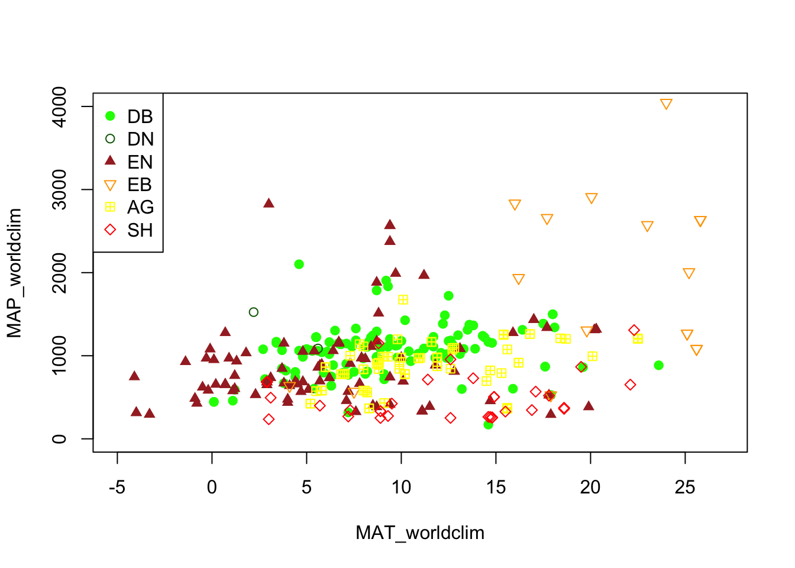
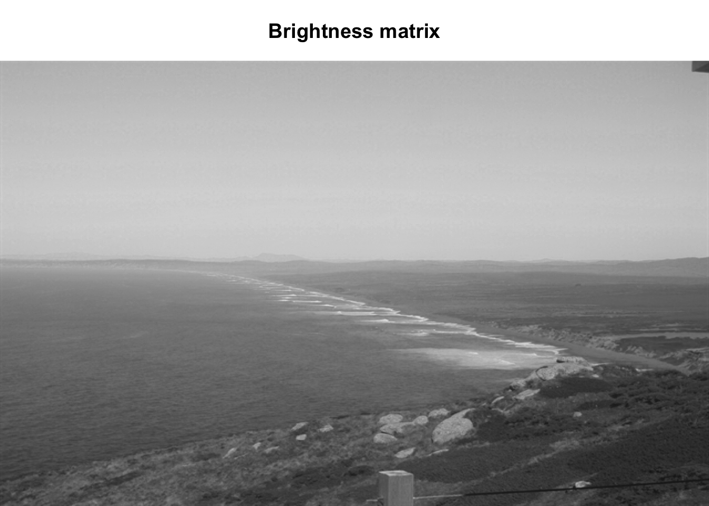
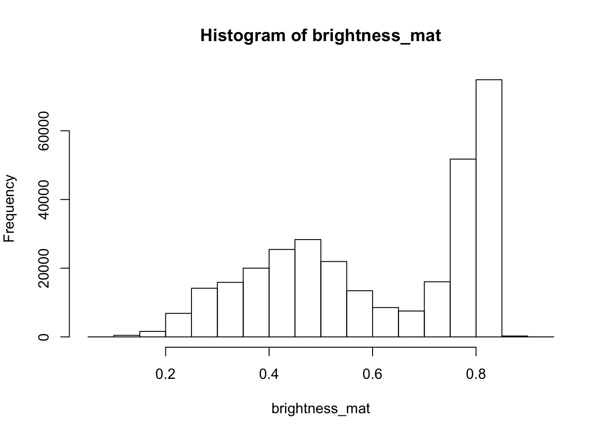
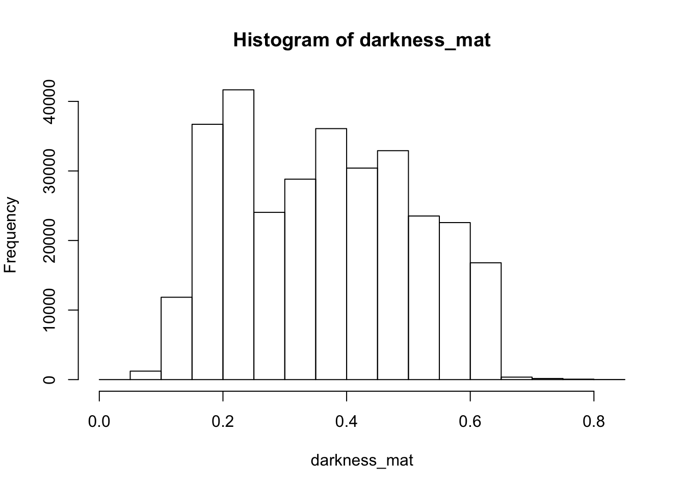
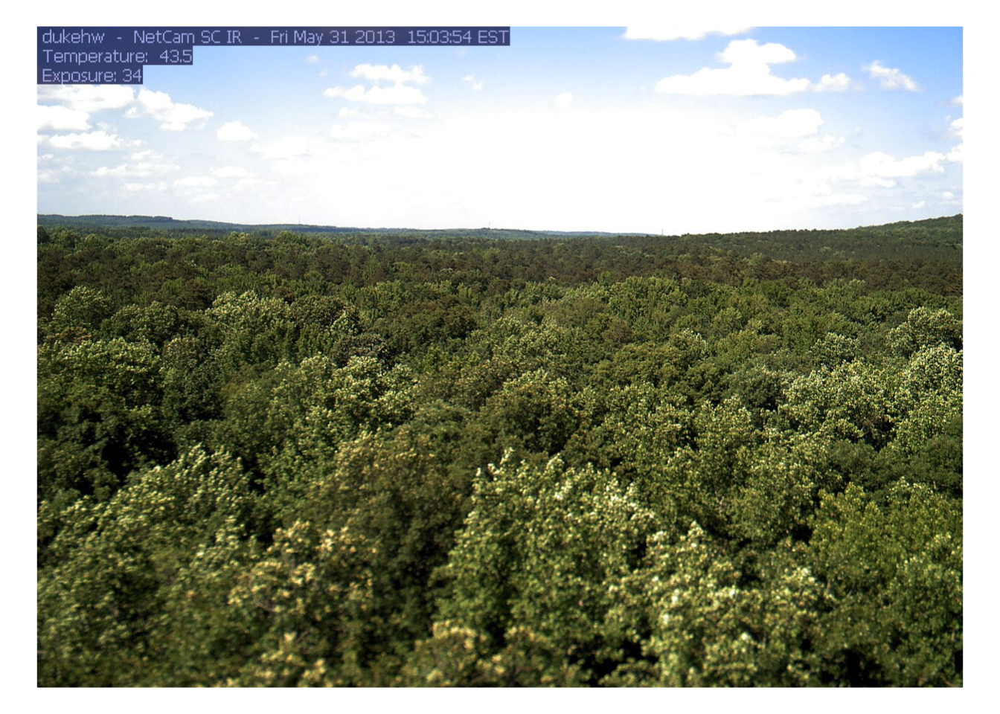
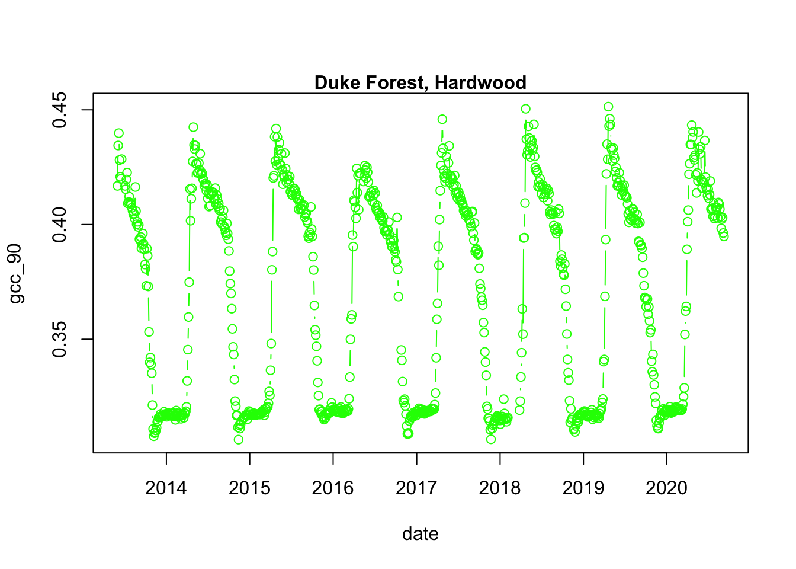

# Digital Repeat Photography Networks & Methods


> Estimated Time: 4 hours


**Course participants**: As you review this information, please
consider the final course project
that you will work on at the over this semester. At the end of this section, you will
document an initial research question or idea and associated data needed to
address that question, that you may want to explore while pursuing this course.


## Digital Repeat Photography Networks Learning Objectives

At the end of this activity, you will be able to:

  1. perform basic image processing.

  2. estimate image haziness as an indication of fog, cloud or other natural or artificial factors using the `hazer`R package.

  3. Define and use a Region of Interest, or ROI, for digitial repeat photography methods.

  4. Handle Field-of-View (FOV) shifts in digital repeat photography.

  5. Extract timeseries data from a stack of images using color-based metrics.


## Introduction to Digital Repeat Photography Methods

The concept of repeat photography for studying environmental has been
introduced to scientists long time ago (See Stephens et al., 1987).
But in the past decade the idea has gained much popularity for monitoring
environmental change (e.g., Sonnentag et al., 2012).
One of the main applications of digital repeat photography is studying vegetation
phenology for a diverse range of ecosystems and biomes (Richardson et al., 2019).
The methods has also shown great applicability in other fields such as:

1. assessing the seasonality of gross primary production,

2. salt marsh restoration,

3. monitoring tidal wetlands,

4. investigating growth in croplands, and

5. evaluating phenological data products derived from satellite remote sensing.

Obtaining quantitative data from digital repeat photography images is usually
performed by defining appropriate region of interest, also know as ROI's,
and for the red (R), green (G) and blue (B) color channels, calculating
pixel value (intensity) statistics across the pixels within each ROI.
ROI boundaries are delineated by mask files which define which pixels
are included and which are excluded from these calculations.

The masks are then used to extract color-based time series from a stack of images.
Following the time-series, statistical metrics are used to obtain
1-day and 3-day summary time series.
From the summary product time series, phenological transition dates
corresponding to the start and the end of green-up and green-down
phenological phases are calculated.
In this chapter we explain this process by starting from general
image processing tools and then to phenocam-based software applications.

For more details about digital repeat photogrpahy you can check out the following publications:
- <a href="https://bnasr.github.io/papers/Seyednasrollah_et_al_2019_SciData.pdf">Seyednarollah, et al. 2019, "Tracking vegetation phenology across diverse biomes using Version 2.0 of the PhenoCam Dataset "</a>.
- <a href="https://bnasr.github.io/papers/Seyednasrollah_et_al_2019_PRS.pdf">Seyednarollah, et al. 2019, "Data extraction from digital repeat photography using xROI: An interactive framework to facilitate the process"</a>.


>1929 - 2016: Alpine Mountains near East Fork Toklat River, Alaska.  Credit: Denali National Park (NPS)


## Detecting Foggy Images using the 'hazer' R Package

#### Read & Plot an Image

We will use several packages in this tutorial. All are available from CRAN.


```r
# load packages
library(hazer)
library(jpeg)
library(data.table)
library(dplyr)
```

```
## Warning: package 'dplyr' was built under R version 3.6.2
```

```
## 
## Attaching package: 'dplyr'
```

```
## The following objects are masked from 'package:data.table':
## 
##     between, first, last
```

```
## The following objects are masked from 'package:stats':
## 
##     filter, lag
```

```
## The following objects are masked from 'package:base':
## 
##     intersect, setdiff, setequal, union
```


Before we start the image processing steps, let's read in and plot an image. This
image is an example image that comes with the *hazer* package.


```r
# read the path to the example image
jpeg_file <- system.file(package = 'hazer', 'pointreyes.jpg')

# read the image as an array
rgb_array <- jpeg::readJPEG(jpeg_file)

# plot the RGB array on the active device panel


# first set the margin in this order:(bottom, left, top, right)
par(mar=c(0,0,3,0))  
plotRGBArray(rgb_array, bty = 'n', main = 'Point Reyes National Seashore')
```




When we work with images, all data we work with is generally on the scale of each
individual pixel in the image. Therefore, for large images we will be working with
large matrices that hold the value for each pixel. Keep this in mind before opening
some of the matrices we'll be creating this tutorial as it can take a while for
them to load.

#### Histogram of RGB channels

A histogram of the colors can be useful to understanding what our image is made
up of. Using the `density()` function from the base *stats* package, we can extract
density distribution of each color channel.


```r
# color channels can be extracted from the matrix
red_vector <- rgb_array[,,1]
green_vector <- rgb_array[,,2]
blue_vector <- rgb_array[,,3]

# plotting
par(mar=c(5,4,4,2))
plot(density(red_vector), col = 'red', lwd = 2,
     main = 'Density function of the RGB channels', ylim = c(0,5))
lines(density(green_vector), col = 'green', lwd = 2)
lines(density(blue_vector), col = 'blue', lwd = 2)
```




In *hazer* we can also extract three basic elements of an RGB image :

1. Brightness
2. Darkness
3. Contrast

#### Brightness

The brightness matrix comes from the maximum value of the R, G, or B channel. We
can extract and show the brightness matrix using the `getBrightness()` function.


```r
# extracting the brightness matrix
brightness_mat <- getBrightness(rgb_array)

# unlike the RGB array which has 3 dimensions, the brightness matrix has only two
# dimensions and can be shown as a grayscale image,
# we can do this using the same plotRGBArray function
par(mar=c(0,0,3,0))
plotRGBArray(brightness_mat, bty = 'n', main = 'Brightness matrix')
```


Here the grayscale is used to show the value of each pixel's maximum brightness
of the R, G or B color channel.

To extract a single brightness value for the image, depending on our needs we can
perform some statistics or we can just use the mean of this matrix.


```r
# the main quantiles
quantile(brightness_mat)
```

```
##         0%        25%        50%        75%       100% 
## 0.09019608 0.43529412 0.62745098 0.80000000 0.91764706
```


```r
# create histogram
par(mar=c(5,4,4,2))
hist(brightness_mat)
```




**Question for the class:** Why are we getting so many images up in the high range of the brightness? Where
does this correlate to on the RGB image?

#### Darkness

Darkness is determined by the minimum of the R, G or B color channel. In the
Similarly, we can extract and show the darkness matrix using the `getDarkness()` function.


```r
# extracting the darkness matrix
darkness_mat <- getDarkness(rgb_array)

# the darkness matrix has also two dimensions and can be shown as a grayscale image
par(mar=c(0,0,3,0))
plotRGBArray(darkness_mat, bty = 'n', main = 'Darkness matrix')
```



```r
# main quantiles
quantile(darkness_mat)
```

```
##         0%        25%        50%        75%       100% 
## 0.03529412 0.23137255 0.36470588 0.47843137 0.83529412
```


```r
# histogram
par(mar=c(5,4,4,2))
hist(darkness_mat)
```


#### Contrast

The contrast of an image is the difference between the darkness and brightness
of the image. The contrast matrix is calculated by difference between the
darkness and brightness matrices.

The contrast of the image can quickly be extracted using the `getContrast()` function.


```r
# extracting the contrast matrix
contrast_mat <- getContrast(rgb_array)

# the contrast matrix has also 2D and can be shown as a grayscale image
par(mar=c(0,0,3,0))
plotRGBArray(contrast_mat, bty = 'n', main = 'Contrast matrix')
```


```r
# main quantiles
quantile(contrast_mat)
```

```
##        0%       25%       50%       75%      100% 
## 0.0000000 0.1450980 0.2470588 0.3333333 0.4509804
```


```r
# histogram
par(mar=c(5,4,4,2))
hist(contrast_mat)
```


#### Image fogginess & haziness

Haziness of an image can be estimated using the `getHazeFactor()` function. This
function is based on the method described in
<a href="https://www.omicsonline.org/open-access/detecting-foggy-images-and-estimating-the-haze-degree-factor-jcsb.1000226.pdf">Mao et al. (2014)</a>.
The technique was originally developed to for *"detecting foggy images and
estimating the haze degree factor"* for a wide range of outdoor conditions.

The function returns a vector of two numeric values:

1.  **haze** as the haze degree and
2.  **A0** as the global atmospheric light, as it is explained in the original paper.

The PhenoCam standards classify any image with the haze degree greater
than 0.4 as a significantly foggy image.


```r
# extracting the haze matrix
haze_degree <- getHazeFactor(rgb_array)

print(haze_degree)
```

```
## $haze
## [1] 0.2251633
## 
## $A0
## [1] 0.7105258
```


Here we have the haze values for our image. Note that the values might be
slightly different due to rounding errors on different platforms.

#### Process sets of images

We can use `for` loops or the `lapply` functions to extract the haze values for
a stack of images.

You can download the related datasets from
<a href="http://bit.ly/2F8w2Ia">here (direct download)</a>.
Download and extract the zip file to be used as input data for the following step.


```r
#pointreyes_url <- 'http://bit.ly/2F8w2Ia'

# set up the input image directory
data_dir <- 'data/'
#dir.create(data_dir, showWarnings = F)

#pointreyes_zip <- paste0(data_dir, 'pointreyes.zip')
pointreyes_dir <- paste0(data_dir, 'pointreyes')

#download zip file
#download.file(pointreyes_url, destfile = pointreyes_zip)
#unzip(pointreyes_zip, exdir = data_dir)

# get a list of all .jpg files in the directory
pointreyes_images <- dir(path = 'data/pointreyes',
                         pattern = '*.jpg',
                         ignore.case = TRUE,
                         full.names = TRUE)
```


Now we can use a for loop to process all of the images to get the haze and A0
values.


```r
# number of images
n <- length(pointreyes_images)

# create an empty matrix to fill with haze and A0 values
haze_mat <- data.frame()

# the process takes a bit, a progress bar lets us know it is working.
pb <- txtProgressBar(0, n, style = 3)
```

```
## 
  |                                                                            
  |                                                                      |   0%
```


```r
for(i in 1:n) {
  image_path <- pointreyes_images[i]
  img <- jpeg::readJPEG(image_path)
  hz <- getHazeFactor(img)

  haze_mat <- rbind(haze_mat,
                    data.frame(file = as.character(image_path),
                               haze = hz[1],
                               A0 = hz[2]))

  setTxtProgressBar(pb, i)
}
```

```
## 
  |                                                                            
  |=                                                                     |   1%
  |                                                                            
  |==                                                                    |   3%
  |                                                                            
  |===                                                                   |   4%
  |                                                                            
  |====                                                                  |   6%
  |                                                                            
  |=====                                                                 |   7%
  |                                                                            
  |======                                                                |   8%
  |                                                                            
  |=======                                                               |  10%
  |                                                                            
  |========                                                              |  11%
  |                                                                            
  |=========                                                             |  13%
  |                                                                            
  |==========                                                            |  14%
  |                                                                            
  |===========                                                           |  15%
  |                                                                            
  |============                                                          |  17%
  |                                                                            
  |=============                                                         |  18%
  |                                                                            
  |==============                                                        |  20%
  |                                                                            
  |===============                                                       |  21%
  |                                                                            
  |================                                                      |  23%
  |                                                                            
  |=================                                                     |  24%
  |                                                                            
  |==================                                                    |  25%
  |                                                                            
  |===================                                                   |  27%
  |                                                                            
  |====================                                                  |  28%
  |                                                                            
  |=====================                                                 |  30%
  |                                                                            
  |======================                                                |  31%
  |                                                                            
  |=======================                                               |  32%
  |                                                                            
  |========================                                              |  34%
  |                                                                            
  |=========================                                             |  35%
  |                                                                            
  |==========================                                            |  37%
  |                                                                            
  |===========================                                           |  38%
  |                                                                            
  |============================                                          |  39%
  |                                                                            
  |=============================                                         |  41%
  |                                                                            
  |==============================                                        |  42%
  |                                                                            
  |===============================                                       |  44%
  |                                                                            
  |================================                                      |  45%
  |                                                                            
  |=================================                                     |  46%
  |                                                                            
  |==================================                                    |  48%
  |                                                                            
  |===================================                                   |  49%
  |                                                                            
  |===================================                                   |  51%
  |                                                                            
  |====================================                                  |  52%
  |                                                                            
  |=====================================                                 |  54%
  |                                                                            
  |======================================                                |  55%
  |                                                                            
  |=======================================                               |  56%
  |                                                                            
  |========================================                              |  58%
  |                                                                            
  |=========================================                             |  59%
  |                                                                            
  |==========================================                            |  61%
  |                                                                            
  |===========================================                           |  62%
  |                                                                            
  |============================================                          |  63%
  |                                                                            
  |=============================================                         |  65%
  |                                                                            
  |==============================================                        |  66%
  |                                                                            
  |===============================================                       |  68%
  |                                                                            
  |================================================                      |  69%
  |                                                                            
  |=================================================                     |  70%
  |                                                                            
  |==================================================                    |  72%
  |                                                                            
  |===================================================                   |  73%
  |                                                                            
  |====================================================                  |  75%
  |                                                                            
  |=====================================================                 |  76%
  |                                                                            
  |======================================================                |  77%
  |                                                                            
  |=======================================================               |  79%
  |                                                                            
  |========================================================              |  80%
  |                                                                            
  |=========================================================             |  82%
  |                                                                            
  |==========================================================            |  83%
  |                                                                            
  |===========================================================           |  85%
  |                                                                            
  |============================================================          |  86%
  |                                                                            
  |=============================================================         |  87%
  |                                                                            
  |==============================================================        |  89%
  |                                                                            
  |===============================================================       |  90%
  |                                                                            
  |================================================================      |  92%
  |                                                                            
  |=================================================================     |  93%
  |                                                                            
  |==================================================================    |  94%
  |                                                                            
  |===================================================================   |  96%
  |                                                                            
  |====================================================================  |  97%
  |                                                                            
  |===================================================================== |  99%
  |                                                                            
  |======================================================================| 100%
```


Now we have a matrix with haze and A0 values for all our images. Let's
compare top three images with low and high haze values.


```r
top10_high_haze <- haze_mat %>%
  dplyr::arrange(desc(haze)) %>%
  slice(1:3)
top10_low_haze <-  haze_mat %>%
  arrange(haze)%>%
  slice(1:3)


par(mar= c(0,0,0,0), mfrow=c(3,2), oma=c(0,0,3,0))

for(i in 1:3){
  img <- readJPEG(as.character(top10_low_haze$file[i]))
  plot.new()
  rasterImage(img, par()$usr[1], par()$usr[3], par()$usr[2], par()$usr[4])

  img <- readJPEG(as.character(top10_high_haze$file[i]))
  plot.new()
  rasterImage(img, par()$usr[1], par()$usr[3], par()$usr[2], par()$usr[4])

}
mtext('Top images with low (left) and high (right) haze values at Point Reyes', font = 2, outer = TRUE)
```




Let's classify those into hazy and non-hazy as per the PhenoCam standard of 0.4.


```r
# classify image as hazy: T/F
haze_mat=haze_mat%>%
  mutate(haze_mat, foggy=ifelse(haze>.4, TRUE, FALSE))

head(haze_mat)
```

```
##                                               file      haze        A0 foggy
## 1 data/pointreyes/pointreyes_2017_01_01_120056.jpg 0.2249810 0.6970257 FALSE
## 2 data/pointreyes/pointreyes_2017_01_06_120210.jpg 0.2339372 0.6826148 FALSE
## 3 data/pointreyes/pointreyes_2017_01_16_120105.jpg 0.2312940 0.7009978 FALSE
## 4 data/pointreyes/pointreyes_2017_01_21_120105.jpg 0.4536108 0.6209055  TRUE
## 5 data/pointreyes/pointreyes_2017_01_26_120106.jpg 0.2297961 0.6813884 FALSE
## 6 data/pointreyes/pointreyes_2017_01_31_120125.jpg 0.4206842 0.6315728  TRUE
```


Now we can save all the foggy images to a new folder that will retain the
foggy images but keep them separate from the non-foggy ones that we want to
analyze.


```r
# identify directory to move the foggy images to
foggy_dir <- paste0(pointreyes_dir, 'foggy')
clear_dir <- paste0(pointreyes_dir, 'clear')

# if a new directory, create new directory at this file path
dir.create(foggy_dir,  showWarnings = FALSE)
dir.create(clear_dir,  showWarnings = FALSE)

# copy the files to the new directories
#file.copy(haze_mat[foggy==TRUE,file], to = foggy_dir)

#file.copy(haze_mat[foggy==FALSE,file], to = clear_dir)
```

Now that we have our images separated, we can get the full list of haze
values only for those images that are not classified as "foggy".  


```r
# this is an alternative approach instead of a for loop

# loading all the images as a list of arrays
pointreyes_clear_images <- dir(path = clear_dir,
                               pattern = '*.jpg',
                               ignore.case = TRUE,
                               full.names = TRUE)

img_list <- lapply(pointreyes_clear_images, FUN = jpeg::readJPEG)

# getting the haze value for the list
# patience - this takes a bit of time
haze_list <- t(sapply(img_list, FUN = getHazeFactor))

# view first few entries
head(haze_list)
```

```
##      haze      A0       
## [1,] 0.224981  0.6970257
## [2,] 0.2339372 0.6826148
## [3,] 0.231294  0.7009978
## [4,] 0.2297961 0.6813884
## [5,] 0.2152078 0.6949932
## [6,] 0.345584  0.6789334
```


We can then use these values for further analyses and data correction.


***

The *hazer* R package is developed and maintained by
<a href="https://bnasr.github.io/">Bijan Seyednarollah</a>.
The most recent release is available from
<a href="https://github.com/bnasr/hazer" target="_blank">https://github.com/bnasr/hazer</a>.


## Extracting Timeseries from Images using the xROI R Package

In this section, we'll learn how to use an interactive open-source toolkit, the
<a href="https://cran.r-project.org/web/packages/xROI/index.html" target="_blank">xROI R package</a>
that facilitates the process of time series extraction and improves the quality
of the final data. The xROI package provides a responsive environment for
scientists to interactively:

a) delineate regions of interest (ROIs),
b) handle field of view (FOV) shifts, and
c) extract and export time series data characterizing color-based metrics.

Using the *xROI* R package, the user can detect FOV shifts with minimal difficulty.
The software gives user the opportunity to re-adjust mask files or redraw new
ones every time an FOV shift occurs.


### xROI Design


The R language and Shiny package were used as the main development tool for xROI,
while Markdown, HTML, CSS and JavaScript languages were used to improve the
interactivity. While Shiny apps are primarily used for web-based applications to
be used online, the package authors used Shiny for its graphical user interface
capabilities. In other words, both the User Interface (UI) and server modules are run
locally from the same machine and hence no internet connection is required (after
installation). The xROI's UI element presents a side-panel for data entry and
three main tab-pages, each responsible for a specific task. The server-side
element consists of R and bash scripts. Image processing and geospatial features
were performed using the `Geospatial Data Abstraction Library (GDAL)` and the
`rgdal` and `raster` R packages.

### Install xROI

The xROI R package has been published on The Comprehensive R Archive Network (CRAN).
The latest tested xROI package can be installed from the
<a href="https://cran.r-project.org/package=xROI" target="_blank">CRAN packages repository</a> by running the following command in an R environment.


```r
utils::install.packages('xROI', repos = "http://cran.us.r-project.org" )
```

Alternatively, the latest beta release of xROI can be directly downloaded and
installed from the development GitHub repository.


```r
# install devtools first
utils::install.packages('devtools', repos = "http://cran.us.r-project.org" )

# use devtools to install from GitHub
devtools::install_github("bnasr/xROI")
```

xROI depends on many R packages including: `raster`, `rgdal`, `sp`, `jpeg`,
`tiff`, `shiny`, `shinyjs`, `shinyBS`, `shinyAce`, `shinyTime`, `shinyFiles`,
`shinydashboard`, `shinythemes`, `colourpicker`, `rjson`, `stringr`, `data.table`,
`lubridate`, `plotly`, `moments`, and `RCurl`. All the required libraries and
packages will be automatically installed with installation of *xROI*. The package
offers a fully interactive high-level interface as well as a set of low-level
functions for ROI processing.

### Launch xROI

A comprehensive user manual for low-level image processing using *xROI* is available from
<a href="https://cran.r-project.org/package=xROI/xROI.pdf" target="_blank">CRAN xROI.pdf</a>.
While the user manual includes a set of examples for each function; here we
will learn to use the graphical interactive mode.

Calling the `Launch()` function, as we'll do below, opens up the interactive
mode in your operating system’s default web browser. The landing page offers an
example dataset to explore different modules or upload a new dataset of images.

You can launch the interactive mode can be launched from an interactive R environment.


```r
# load xROI
library(xROI)

# launch xROI
Launch()
```

Or from the command line (e.g. bash in Linux, Terminal in macOS and Command
Prompt in Windows machines) where an R engine is already installed.


```bash

Rscript -e “xROI::Launch(Interactive = TRUE)”

```


### End xROI

When you are done with the xROI interface you can close the tab in your browser
and end the session in R by using one of the following options

**In RStudio:** Press the <Esc> key on your keyboard.
**In R Terminal:** Press <Ctrl + C> on your keyboard.

### Use xROI

To get some hands-on experience with `xROI`, we can analyze images from the
<a href="https://phenocam.sr.unh.edu/webcam/sites/dukehw/">dukehw</a>
of the PhenoCam network.

You can download the data set from
<a href="http://bit.ly/2PzZ2fL">this link (direct download)</a>.

Follow the steps below:

First,save and extract (unzip) the file on your computer.

Second, open the data set in `xROI` by setting the file path to your data


```r
# launch data in ROI
# first edit the path below to the dowloaded directory you just extracted
xROI::Launch('/path/to/extracted/directory')

# alternatively, you can run without specifying a path and use the interface to browse
```

Now, draw an ROI and the metadata.

Then, save the metadata and explore its content.

Now we can explore if there is any FOV shift in the dataset using the `CLI processer` tab.

Finally, we can go to the `Time series extraction` tab. Extract the time-series. Save the output and explore the dataset in R.


## Documentation and Citation

More documentation about **xROI** can be found from: <a href="https://bnasr.github.io/papers/Seyednasrollah_et_al_2019_PRS.pdf">Seyednarollah, et al. 2019</a>.


```r
knitr::include_graphics('docs/images/xROI-ms2019.png')
```


>xROI published in ISPRS Journal of Photogrammetry and Remote Sensing, 2019

## Challenge: Use xROI

Let's use xROI on a little more challenging site with field of view shifts.

Download and extract the data set from
<a href="http://bit.ly/2DrZgA1">this link (direct download, 218 MB)</a>
and follow the above steps to extract the time-series.
</div>


***

The *xROI* R package is developed and maintained by
<a href="https://bnasr.github.io/">Bijan Seyednarollah</a>.
The most recent release is available from <a href="https://github.com/bnasr/xROI" target="_blank">https://github.com/bnasr/xROI</a>.


## The PhenoCam Network Mission & Design

<iframe width="560" height="315" src="https://www.youtube.com/embed/_4uHLXL1yZA" frameborder="0" allow="accelerometer; autoplay; encrypted-media; gyroscope; picture-in-picture" allowfullscreen></iframe>


## Pulling Data via the *phenocamapi* Package


The <a href="https://cran.r-project.org/web/packages/phenocamapi/index.html" target="_blank"> *phenocamapi* R package</a>
is developed to simplify interacting with the
<a href="https://phenocam.sr.unh.edu" target="_blank">PhenoCam network</a>
dataset and perform data wrangling steps on PhenoCam sites' data and metadata.

This tutorial will show you the basic commands for accessing PhenoCam data
through the PhenoCam API. The *phenocampapi* R package is developed and maintained by
<a href="https://bnasr.github.io/" target="_blank">Bijan Seyednarollah</a>.
The most recent release is available on GitHub (<a href="https://github.com/bnasr/phenocamapi" target="_blank">PhenocamAPI</a>).
<a href="https://github.com/bnasr/phenocamapi/tree/master/vignettes" target ="_blank">Additional vignettes</a>
can be found on how to merge external time-series (e.g. Flux data) with the
PhenoCam time-series.

We begin with several useful skills and tools for extracting PhenoCam data
directly from the server:

- Exploring the PhenoCam metadata
- Filtering the dataset by site attributes
- Downloading PhenoCam time-series data
- Extracting the list of midday images
- Downloading midday images for a given time range

## Exploring PhenoCam metadata

Each PhenoCam site has specific metadata including but not limited to how a site
is set up and where it is located, what vegetation type is visible from the
camera, and its climate regime. Each PhenoCam may have zero to several Regions
of Interest (ROIs) per vegetation type. The *phenocamapi* package is an
interface to interact with the PhenoCam server to extract those data and
process them in an R environment.

To explore the PhenoCam data, we'll use several packages for this tutorial.


```r
library(data.table)
library(phenocamapi)
```

```
## Loading required package: rjson
```

```
## Loading required package: RCurl
```

```
## Warning: package 'RCurl' was built under R version 3.6.2
```

```r
library(lubridate)
```

```
## Warning: package 'lubridate' was built under R version 3.6.2
```

```
## 
## Attaching package: 'lubridate'
```

```
## The following objects are masked from 'package:data.table':
## 
##     hour, isoweek, mday, minute, month, quarter, second, wday, week,
##     yday, year
```

```
## The following objects are masked from 'package:base':
## 
##     date, intersect, setdiff, union
```

```r
library(jpeg)
```


We can obtain an up-to-date `data.frame` of the metadata of the entire PhenoCam
network using the `get_phenos()` function. The returning value would be a
`data.table` in order to simplify further data exploration.


```r
# obtaining the phenocam site metadata from the server as data.table
phenos <- get_phenos()

# checking out the first few sites
head(phenos$site)
```

```
## [1] "aafcottawacfiaf14e" "aafcottawacfiaf14w" "acadia"            
## [4] "aguatibiaeast"      "aguatibianorth"     "ahwahnee"
```

```r
# checking out the columns
colnames(phenos)
```

```
##  [1] "site"                      "lat"                      
##  [3] "lon"                       "elev"                     
##  [5] "active"                    "utc_offset"               
##  [7] "date_first"                "date_last"                
##  [9] "infrared"                  "contact1"                 
## [11] "contact2"                  "site_description"         
## [13] "site_type"                 "group"                    
## [15] "camera_description"        "camera_orientation"       
## [17] "flux_data"                 "flux_networks"            
## [19] "flux_sitenames"            "dominant_species"         
## [21] "primary_veg_type"          "secondary_veg_type"       
## [23] "site_meteorology"          "MAT_site"                 
## [25] "MAP_site"                  "MAT_daymet"               
## [27] "MAP_daymet"                "MAT_worldclim"            
## [29] "MAP_worldclim"             "koeppen_geiger"           
## [31] "ecoregion"                 "landcover_igbp"           
## [33] "dataset_version1"          "site_acknowledgements"    
## [35] "modified"                  "flux_networks_name"       
## [37] "flux_networks_url"         "flux_networks_description"
```

Now we have a better idea of the types of metadata that are available for the
Phenocams.

### Remove null values

We may want to explore some of the patterns in the metadata before we jump into
specific locations.

Let's look at Mean Annual Precipitation (MAP) and Mean Annual
Temperature (MAT) across the different field site and classify those by the
primary vegetation type (`primary_veg_type`) for each site. We can find out what
the abbreviations for the vegetation types mean from the following table:


|Abbreviation|Description|
|-|-|
| AG |	agriculture |
| DB |	deciduous broadleaf |
| DN |	deciduous needleleaf |
| EB |	evergreen broadleaf |
| EN |	evergreen needleleaf |
| GR |	grassland |
| MX |	mixed vegetation (generally EN/DN, DB/EN, or DB/EB) |
| SH |	shrubs |
| TN |	tundra (includes sedges, lichens, mosses, etc.) |
| WT |	wetland |
| NV |	non-vegetated |
| RF |	reference panel | 	 
| XX |	unspecified |


To do this we'd first want to remove the sites where there is not data and then
plot the data.


```r
# removing the sites with unkown MAT and MAP values
phenos <- phenos[!((MAT_worldclim == -9999)|(MAP_worldclim == -9999))]

# extracting the PhenoCam climate space based on the WorldClim dataset
# and plotting the sites across the climate space different vegetation type as different symbols and colors
phenos[primary_veg_type=='DB', plot(MAT_worldclim, MAP_worldclim, pch = 19, col = 'green', xlim = c(-5, 27), ylim = c(0, 4000))]
```

```
## NULL
```

```r
phenos[primary_veg_type=='DN', points(MAT_worldclim, MAP_worldclim, pch = 1, col = 'darkgreen')]
```

```
## NULL
```

```r
phenos[primary_veg_type=='EN', points(MAT_worldclim, MAP_worldclim, pch = 17, col = 'brown')]
```

```
## NULL
```

```r
phenos[primary_veg_type=='EB', points(MAT_worldclim, MAP_worldclim, pch = 25, col = 'orange')]
```

```
## NULL
```

```r
phenos[primary_veg_type=='AG', points(MAT_worldclim, MAP_worldclim, pch = 12, col = 'yellow')]
```

```
## NULL
```

```r
phenos[primary_veg_type=='SH', points(MAT_worldclim, MAP_worldclim, pch = 23, col = 'red')]
```

```
## NULL
```

```r
legend('topleft', legend = c('DB','DN', 'EN','EB','AG', 'SH'),
       pch = c(19, 1, 17, 25, 12, 23),
       col =  c('green', 'darkgreen', 'brown',  'orange',  'yellow',  'red' ))
```


### Filtering using attributes

Alternatively, we may want to only include Phenocams with certain attributes in
our datasets. For example, we may be interested only in sites with a co-located
flux tower. For this, we'd want to filter for those with a flux tower using the
`flux_sitenames` attribute in the metadata.


```r
# store sites with flux_data available and the FLUX site name is specified
phenofluxsites <- phenos[flux_data==TRUE&!is.na(flux_sitenames)&flux_sitenames!='',
                         .(PhenoCam=site, Flux=flux_sitenames)] # return as table
#and specify which variables to retain

phenofluxsites <- phenofluxsites[Flux!='']

# see the first few rows
head(phenofluxsites)
```

```
##                PhenoCam                               Flux
## 1:       alligatorriver                             US-NC4
## 2:          arsbrooks10 US-Br1: Brooks Field Site 10- Ames
## 3:          arsbrooks11 US-Br3: Brooks Field Site 11- Ames
## 4:        arscolesnorth                               LTAR
## 5:        arscolessouth                               LTAR
## 6: arsgreatbasinltar098                             US-Rws
```

We could further identify which of those Phenocams with a flux tower and in
deciduous broadleaf forests (`primary_veg_type=='DB'`).


```r
#list deciduous broadleaf sites with flux tower
DB.flux <- phenos[flux_data==TRUE&primary_veg_type=='DB',
                  site]  # return just the site names as a list

# see the first few rows
head(DB.flux)
```

```
## [1] "alligatorriver" "bartlett"       "bartlettir"     "bbc1"          
## [5] "bbc2"           "bbc3"
```


## PhenoCam time series

PhenoCam time series are extracted time series data obtained from ROI's for a
given site.

### Obtain ROIs
To download the phenological time series from the PhenoCam, we need to know the
site name, vegetation type and ROI ID. This information can be obtained from each
specific PhenoCam page on the
<a href="https://phenocam.sr.unh.edu/webcam/gallery/" target="_blank">PhenoCam website</a>
or by using the `get_rois()` function.


```r
# obtaining the list of all the available ROI's on the PhenoCam server
rois <- get_rois()

# view what information is returned
colnames(rois)
```

```
##  [1] "roi_name"          "site"              "lat"              
##  [4] "lon"               "roitype"           "active"           
##  [7] "show_link"         "show_data_link"    "sequence_number"  
## [10] "description"       "first_date"        "last_date"        
## [13] "site_years"        "missing_data_pct"  "roi_page"         
## [16] "roi_stats_file"    "one_day_summary"   "three_day_summary"
## [19] "data_release"
```

```r
# view first few locations
head(rois$roi_name)
```

```
## [1] "alligatorriver_DB_1000"   "arbutuslake_DB_1000"     
## [3] "arbutuslakeinlet_DB_1000" "arbutuslakeinlet_EN_1000"
## [5] "arbutuslakeinlet_EN_2000" "archboldavir_AG_1000"
```

### Download time series

The `get_pheno_ts()` function can download a time series and return the result
as a `data.table`.
Let's work with the
<a href="https://phenocam.sr.unh.edu/data/archive/dukehw/ROI/dukehw_DB_1000.html">Duke Forest Hardwood Stand (`dukehw`) PhenoCam</a>
and specifically the ROI
<a href="https://phenocam.sr.unh.edu/data/archive/dukehw/ROI/dukehw_DB_1000.html">`DB_1000`</a>
we can run the following code.


```r
# list ROIs for dukehw
rois[site=='dukehw',]
```

```
##          roi_name   site      lat       lon roitype active show_link
## 1: dukehw_DB_1000 dukehw 35.97358 -79.10037      DB   TRUE      TRUE
##    show_data_link sequence_number                                   description
## 1:           TRUE            1000 canopy level DB forest at awesome Duke forest
##    first_date  last_date site_years missing_data_pct
## 1: 2013-06-01 2020-09-07        7.1              3.0
##                                                  roi_page
## 1: https://phenocam.sr.unh.edu/webcam/roi/dukehw/DB_1000/
##                                                                     roi_stats_file
## 1: https://phenocam.sr.unh.edu/data/archive/dukehw/ROI/dukehw_DB_1000_roistats.csv
##                                                                one_day_summary
## 1: https://phenocam.sr.unh.edu/data/archive/dukehw/ROI/dukehw_DB_1000_1day.csv
##                                                              three_day_summary
## 1: https://phenocam.sr.unh.edu/data/archive/dukehw/ROI/dukehw_DB_1000_3day.csv
##    data_release
## 1:           NA
```

```r
# to obtain the DB 1000 from dukehw
dukehw_DB_1000 <- get_pheno_ts(site = 'dukehw', vegType = 'DB', roiID = 1000, type = '3day')

# what data are available
str(dukehw_DB_1000)
```

```
## Classes 'data.table' and 'data.frame':	888 obs. of  35 variables:
##  $ date                : Factor w/ 888 levels "2013-06-01","2013-06-04",..: 1 2 3 4 5 6 7 8 9 10 ...
##  $ year                : int  2013 2013 2013 2013 2013 2013 2013 2013 2013 2013 ...
##  $ doy                 : int  152 155 158 161 164 167 170 173 176 179 ...
##  $ image_count         : int  57 76 77 77 77 78 21 0 0 0 ...
##  $ midday_filename     : Factor w/ 859 levels "dukehw_2013_06_01_120111.jpg",..: 1 2 3 4 5 6 7 859 859 859 ...
##  $ midday_r            : num  91.3 76.4 60.6 76.5 88.9 ...
##  $ midday_g            : num  97.9 85 73.2 82.2 95.7 ...
##  $ midday_b            : num  47.4 33.6 35.6 37.1 51.4 ...
##  $ midday_gcc          : num  0.414 0.436 0.432 0.42 0.406 ...
##  $ midday_rcc          : num  0.386 0.392 0.358 0.391 0.377 ...
##  $ r_mean              : num  87.6 79.9 72.7 80.9 83.8 ...
##  $ r_std               : num  5.9 6 9.5 8.23 5.89 ...
##  $ g_mean              : num  92.1 86.9 84 88 89.7 ...
##  $ g_std               : num  6.34 5.26 7.71 7.77 6.47 ...
##  $ b_mean              : num  46.1 38 39.6 43.1 46.7 ...
##  $ b_std               : num  4.48 3.42 5.29 4.73 4.01 ...
##  $ gcc_mean            : num  0.408 0.425 0.429 0.415 0.407 ...
##  $ gcc_std             : num  0.00859 0.0089 0.01318 0.01243 0.01072 ...
##  $ gcc_50              : num  0.408 0.427 0.431 0.416 0.407 ...
##  $ gcc_75              : num  0.414 0.431 0.435 0.424 0.415 ...
##  $ gcc_90              : num  0.417 0.434 0.44 0.428 0.421 ...
##  $ rcc_mean            : num  0.388 0.39 0.37 0.381 0.38 ...
##  $ rcc_std             : num  0.01176 0.01032 0.01326 0.00881 0.00995 ...
##  $ rcc_50              : num  0.387 0.391 0.373 0.383 0.382 ...
##  $ rcc_75              : num  0.391 0.396 0.378 0.388 0.385 ...
##  $ rcc_90              : num  0.397 0.399 0.382 0.391 0.389 ...
##  $ max_solar_elev      : num  76 76.3 76.6 76.8 76.9 ...
##  $ snow_flag           : logi  NA NA NA NA NA NA ...
##  $ outlierflag_gcc_mean: logi  NA NA NA NA NA NA ...
##  $ outlierflag_gcc_50  : logi  NA NA NA NA NA NA ...
##  $ outlierflag_gcc_75  : logi  NA NA NA NA NA NA ...
##  $ outlierflag_gcc_90  : logi  NA NA NA NA NA NA ...
##  $ YEAR                : int  2013 2013 2013 2013 2013 2013 2013 2013 2013 2013 ...
##  $ DOY                 : int  152 155 158 161 164 167 170 173 176 179 ...
##  $ YYYYMMDD            : chr  "2013-06-01" "2013-06-04" "2013-06-07" "2013-06-10" ...
##  - attr(*, ".internal.selfref")=<externalptr>
```

We now have a variety of data related to this ROI from the Hardwood Stand at Duke
Forest.

Green Chromatic Coordinate (GCC) is a measure of "greenness" of an area and is
widely used in Phenocam images as an indicator of the green pigment in vegetation.
Let's use this measure to look at changes in GCC over time at this site. Looking
back at the available data, we have several options for GCC. `gcc90` is the 90th
quantile of GCC in the pixels across the ROI (for more details,
<a href="https://daac.ornl.gov/VEGETATION/guides/PhenoCam_V1.html" target="_blank"> PhenoCam v1 description</a>).
We'll use this as it tracks the upper greenness values while not including many
outliners.  

Before we can plot `gcc-90` we do need to fix our dates and convert them from
Factors to Date to correctly plot.


```r
# date variable into date format
dukehw_DB_1000[,date:=as.Date(date)]

# plot gcc_90
dukehw_DB_1000[,plot(date, gcc_90, col = 'green', type = 'b')]
```

```
## NULL
```

```r
mtext('Duke Forest, Hardwood', font = 2)
```




## Download midday images

While PhenoCam sites may have many images in a given day, many simple analyses
can use just the midday image when the sun is most directly overhead the canopy.
Therefore, extracting a list of midday images (only one image a day) can be useful.


```r
# obtaining midday_images for dukehw
duke_middays <- get_midday_list('dukehw')

# see the first few rows
head(duke_middays)
```

```
## [1] "http://phenocam.sr.unh.edu/data/archive/dukehw/2013/05/dukehw_2013_05_31_150331.jpg"
## [2] "http://phenocam.sr.unh.edu/data/archive/dukehw/2013/06/dukehw_2013_06_01_120111.jpg"
## [3] "http://phenocam.sr.unh.edu/data/archive/dukehw/2013/06/dukehw_2013_06_02_120109.jpg"
## [4] "http://phenocam.sr.unh.edu/data/archive/dukehw/2013/06/dukehw_2013_06_03_120110.jpg"
## [5] "http://phenocam.sr.unh.edu/data/archive/dukehw/2013/06/dukehw_2013_06_04_120119.jpg"
## [6] "http://phenocam.sr.unh.edu/data/archive/dukehw/2013/06/dukehw_2013_06_05_120110.jpg"
```

Now we have a list of all the midday images from this Phenocam. Let's download
them and plot


```r
# download a file
destfile <- tempfile(fileext = '.jpg')

# download only the first available file
# modify the `[1]` to download other images
download.file(duke_middays[1], destfile = destfile, mode = 'wb')

# plot the image
img <- try(readJPEG(destfile))
if(class(img)!='try-error'){
  par(mar= c(0,0,0,0))
  plot(0:1,0:1, type='n', axes= FALSE, xlab= '', ylab = '')
  rasterImage(img, 0, 0, 1, 1)
}
```


### Download midday images for a given time range

Now we can access all the midday images and download them one at a time. However,
we frequently want all the images within a specific time range of interest. We'll
learn how to do that next.


```r
# open a temporary directory
tmp_dir <- tempdir()

# download a subset. Example dukehw 2017
download_midday_images(site = 'dukehw', # which site
                       y = 2017, # which year(s)
                       months = 1:12, # which month(s)
                       days = 15, # which days on month(s)
                       download_dir = tmp_dir) # where on your computer
```

```
## 
  |                                                                            
  |                                                                      |   0%
  |                                                                            
  |======                                                                |   8%
  |                                                                            
  |============                                                          |  17%
  |                                                                            
  |==================                                                    |  25%
  |                                                                            
  |=======================                                               |  33%
  |                                                                            
  |=============================                                         |  42%
  |                                                                            
  |===================================                                   |  50%
  |                                                                            
  |=========================================                             |  58%
  |                                                                            
  |===============================================                       |  67%
  |                                                                            
  |====================================================                  |  75%
  |                                                                            
  |==========================================================            |  83%
  |                                                                            
  |================================================================      |  92%
  |                                                                            
  |======================================================================| 100%
```

```
## [1] "/var/folders/5n/vxrdb72140b43_jhsmhfy514pqgq1n/T//RtmpMdhmtV"
```

```r
# list of downloaded files
duke_middays_path <- dir(tmp_dir, pattern = 'dukehw*', full.names = TRUE)

head(duke_middays_path)
```

```
## [1] "/var/folders/5n/vxrdb72140b43_jhsmhfy514pqgq1n/T//RtmpMdhmtV/dukehw_2017_01_15_120109.jpg"
## [2] "/var/folders/5n/vxrdb72140b43_jhsmhfy514pqgq1n/T//RtmpMdhmtV/dukehw_2017_02_15_120108.jpg"
## [3] "/var/folders/5n/vxrdb72140b43_jhsmhfy514pqgq1n/T//RtmpMdhmtV/dukehw_2017_03_15_120151.jpg"
## [4] "/var/folders/5n/vxrdb72140b43_jhsmhfy514pqgq1n/T//RtmpMdhmtV/dukehw_2017_04_15_120110.jpg"
## [5] "/var/folders/5n/vxrdb72140b43_jhsmhfy514pqgq1n/T//RtmpMdhmtV/dukehw_2017_05_15_120108.jpg"
## [6] "/var/folders/5n/vxrdb72140b43_jhsmhfy514pqgq1n/T//RtmpMdhmtV/dukehw_2017_06_15_120120.jpg"
```

We can demonstrate the seasonality of Duke forest observed from the camera. (Note
this code may take a while to run through the loop).


```r
n <- length(duke_middays_path)
par(mar= c(0,0,0,0), mfrow=c(4,3), oma=c(0,0,3,0))

for(i in 1:n){
  img <- readJPEG(duke_middays_path[i])
  plot(0:1,0:1, type='n', axes= FALSE, xlab= '', ylab = '')
  rasterImage(img, 0, 0, 1, 1)
  mtext(month.name[i], line = -2)
}
mtext('Seasonal variation of forest at Duke Hardwood Forest', font = 2, outer = TRUE)
```


The goal of this section was to show how to download a limited number of midday images from the PhenoCam server. However, more extensive datasets should be downloaded from the <a href="https://phenocam.sr.unh.edu/webcam/network/download/"> PhenoCam </a>.


***

The *phenocamapi* R package is developed and maintained by
<a href="https://bnasr.github.io/">Bijan Seyednarollah</a>.
The most recent release is available from
<a href="https://github.com/bnasr/phenocamapi" target="_blank">https://github.com/bnasr/phenocamapi</a>.


## Digital Repeat Photography Exercises

### Digital Repeat Photography Computational
First let's load some packages:


```r
library(jsonlite)
```

```
## Warning: package 'jsonlite' was built under R version 3.6.2
```

```
## 
## Attaching package: 'jsonlite'
```

```
## The following objects are masked from 'package:rjson':
## 
##     fromJSON, toJSON
```

```r
library(phenocamapi)
library(plotly)
```

```
## Warning: package 'plotly' was built under R version 3.6.2
```

```
## Loading required package: ggplot2
```

```
## Warning: package 'ggplot2' was built under R version 3.6.2
```

```
## 
## Attaching package: 'plotly'
```

```
## The following object is masked from 'package:ggplot2':
## 
##     last_plot
```

```
## The following object is masked from 'package:stats':
## 
##     filter
```

```
## The following object is masked from 'package:graphics':
## 
##     layout
```

```r
library(phenocamr)
library(dplyr)
```

As a refresher, there are two main ways to pull in PhenoCam data.  First, directly via the API:


```r
c      = jsonlite::fromJSON('https://phenocam.sr.unh.edu/api/cameras/?format=json&limit=2000')
c = c$results
c_m=c$sitemetadata
c$sitemetadata=NULL
cams_=cbind(c, c_m)
cams_[is.na(cams_)] = 'N'
cams_[, 2:4] <- sapply(cams_[, 2:4], as.numeric) #changing lat/lon/elev from string values into numeric
```

```
## Warning in lapply(X = X, FUN = FUN, ...): NAs introduced by coercion

## Warning in lapply(X = X, FUN = FUN, ...): NAs introduced by coercion

## Warning in lapply(X = X, FUN = FUN, ...): NAs introduced by coercion
```

```r
head(cams_)
```

```
##             Sitename      Lat        Lon Elev active utc_offset date_first
## 1 aafcottawacfiaf14e 45.29210  -75.76640   90   TRUE         -5 2020-04-27
## 2 aafcottawacfiaf14w 45.29210  -75.76640   90   TRUE         -5 2020-05-01
## 3             acadia 44.37694  -68.26083  158   TRUE         -5 2007-03-15
## 4      aguatibiaeast 33.62200 -116.86700 1086  FALSE         -8 2007-08-16
## 5     aguatibianorth 33.60222 -117.34368 1090  FALSE         -8 2003-10-01
## 6           ahwahnee 37.74670 -119.58160 1199   TRUE         -8 2008-08-28
##    date_last infrared                                                 contact1
## 1 2020-08-31        N Elizabeth Pattey <elizabeth DOT pattey AT canada DOT ca>
## 2 2020-08-31        N Elizabeth Pattey <elizabeth DOT pattey AT canada DOT ca>
## 3 2020-09-09        N                     Dee Morse <dee_morse AT nps DOT gov>
## 4 2019-01-25        N              Ann E Mebane <amebane AT fs DOT fed DOT us>
## 5 2006-10-25        N                                                         
## 6 2020-09-09        N                     Dee Morse <dee_morse AT nps DOT gov>
##                                              contact2
## 1 Luc Pelletier <luc DOT pelletier3 AT canada DOT ca>
## 2 Luc Pelletier <luc DOT pelletier3 AT canada DOT ca>
## 3              John Gross <John_Gross AT nps DOT gov>
## 4       Kristi Savig <KSavig AT air-resource DOT com>
## 5                                                    
## 6              John Gross <John_Gross AT nps DOT gov>
##                                               site_description site_type
## 1  AAFC Site - Ottawa (On) - CFIA - Field F14 -East Flux Tower        II
## 2  AAFC Site - Ottawa (On) - CFIA - Field F14 -West Flux Tower        II
## 3 Acadia National Park, McFarland Hill, near Bar Harbor, Maine       III
## 4                            Agua Tibia Wilderness, California       III
## 5                            Agua Tibia Wilderness, California       III
## 6          Ahwahnee Meadow, Yosemite National Park, California       III
##                   group       camera_description camera_orientation flux_data
## 1                     N Campbell Scientific CCFC                 NE      TRUE
## 2                     N Campbell Scientific CCFC                WNW      TRUE
## 3 National Park Service                  unknown                 NE     FALSE
## 4                  USFS                  unknown                 SW     FALSE
## 5                  USFS                  unknown                 NE     FALSE
## 6 National Park Service                  unknown                  E     FALSE
##                 flux_networks flux_sitenames
## 1                        NULL              N
## 2 OTHER, , Other/Unaffiliated              N
## 3                        NULL               
## 4                        NULL               
## 5                        NULL               
## 6                        NULL               
##                                           dominant_species primary_veg_type
## 1 Zea mays, Triticum aestivum, Brassica napus, Glycine max               AG
## 2 Zea mays, Triticum aestivum, Brassica napus, Glycine max               AG
## 3                                                                        DB
## 4                                                                        SH
## 5                                                                        SH
## 6                                                                        EN
##   secondary_veg_type site_meteorology MAT_site MAP_site MAT_daymet MAP_daymet
## 1                 AG             TRUE      6.4      943        6.3        952
## 2                 AG             TRUE      6.4      943        6.3        952
## 3                 EN            FALSE        N        N       7.05       1439
## 4                               FALSE        N        N      15.75        483
## 5                               FALSE        N        N         16        489
## 6                 GR            FALSE        N        N      12.25        871
##   MAT_worldclim MAP_worldclim koeppen_geiger ecoregion landcover_igbp
## 1             6           863            Dfb         8             12
## 2             6           863            Dfb         8             12
## 3           6.5          1303            Dfb         8              5
## 4          14.9           504            Csa        11              7
## 5          13.8           729            Csa        11              7
## 6          11.8           886            Csb         6              8
##                                                                                                                                                                                                                                                                                                                         site_acknowledgements
## 1  Camera funded by Agriculture and Agri-Food Canada (AAFC) Project J-001735 - Commercial inhibitors’ impact on crop productivity and emissions of nitrous oxide led by Dr. Elizabeth Pattey; Support provided by Drs, Luc Pelletier and Elizabeth  Pattey, Micrometeorologiccal Laboratory of AAFC - Ottawa Research and Development Centre.
## 2 Cameras funded by Agriculture and Agri-Food Canada (AAFC) Project J-001735 - Commercial inhibitors’ impact on crop productivity and emissions of nitrous oxide led by Dr. Elizabeth Pattey; Support provided by Drs, Luc Pelletier and Elizabeth  Pattey, Micrometeorologiccal Laboratory of AAFC - Ottawa Research and Development Centre.
## 3                                                                                                                                                                                                                           Camera images from Acadia National Park are provided courtesy of the National Park Service Air Resources Program.
## 4                                                                                                                                                                                                                 Camera images from Agua Tibia Wilderness are provided courtesy of the USDA Forest Service Air Resources Management Program.
## 5                                                                                                                                                                                                                 Camera images from Agua Tibia Wilderness are provided courtesy of the USDA Forest Service Air Resources Management Program.
## 6                                                                                                                                                                                                                         Camera images from Yosemite National Park are provided courtesy of the National Park Service Air Resources Program.
##                           modified
## 1 2020-05-04T10:46:30.065790-04:00
## 2 2020-05-04T10:46:32.523976-04:00
## 3 2016-11-01T15:42:15.016778-04:00
## 4 2016-11-01T15:42:15.086984-04:00
## 5 2016-11-01T15:42:15.095277-04:00
## 6 2016-11-01T15:42:15.111916-04:00
```

And second, via the phenocamapi package:


```r
phenos=get_phenos()
head(phenos)
```

```
##                  site      lat        lon elev active utc_offset date_first
## 1: aafcottawacfiaf14e 45.29210  -75.76640   90   TRUE         -5 2020-04-27
## 2: aafcottawacfiaf14w 45.29210  -75.76640   90   TRUE         -5 2020-05-01
## 3:             acadia 44.37694  -68.26083  158   TRUE         -5 2007-03-15
## 4:      aguatibiaeast 33.62200 -116.86700 1086  FALSE         -8 2007-08-16
## 5:     aguatibianorth 33.60222 -117.34368 1090  FALSE         -8 2003-10-01
## 6:           ahwahnee 37.74670 -119.58160 1199   TRUE         -8 2008-08-28
##     date_last infrared                                      contact1
## 1: 2020-08-31        N Elizabeth Pattey <elizabeth.pattey@canada.ca>
## 2: 2020-08-31        N Elizabeth Pattey <elizabeth.pattey@canada.ca>
## 3: 2020-09-09        N                 Dee Morse <dee_morse@nps.gov>
## 4: 2019-01-25        N              Ann E Mebane <amebane@fs.fed.us>
## 5: 2006-10-25        N                                              
## 6: 2020-09-09        N                 Dee Morse <dee_morse@nps.gov>
##                                    contact2
## 1: Luc Pelletier <luc.pelletier3@canada.ca>
## 2: Luc Pelletier <luc.pelletier3@canada.ca>
## 3:          John Gross <John_Gross@nps.gov>
## 4:   Kristi Savig <KSavig@air-resource.com>
## 5:                                         
## 6:          John Gross <John_Gross@nps.gov>
##                                                site_description site_type
## 1:  AAFC Site - Ottawa (On) - CFIA - Field F14 -East Flux Tower        II
## 2:  AAFC Site - Ottawa (On) - CFIA - Field F14 -West Flux Tower        II
## 3: Acadia National Park, McFarland Hill, near Bar Harbor, Maine       III
## 4:                            Agua Tibia Wilderness, California       III
## 5:                            Agua Tibia Wilderness, California       III
## 6:          Ahwahnee Meadow, Yosemite National Park, California       III
##                    group       camera_description camera_orientation flux_data
## 1:                  <NA> Campbell Scientific CCFC                 NE      TRUE
## 2:                  <NA> Campbell Scientific CCFC                WNW      TRUE
## 3: National Park Service                  unknown                 NE     FALSE
## 4:                  USFS                  unknown                 SW     FALSE
## 5:                  USFS                  unknown                 NE     FALSE
## 6: National Park Service                  unknown                  E     FALSE
##    flux_networks flux_sitenames
## 1:     <list[0]>           <NA>
## 2:     <list[1]>           <NA>
## 3:     <list[0]>               
## 4:     <list[0]>               
## 5:     <list[0]>               
## 6:     <list[0]>               
##                                            dominant_species primary_veg_type
## 1: Zea mays, Triticum aestivum, Brassica napus, Glycine max               AG
## 2: Zea mays, Triticum aestivum, Brassica napus, Glycine max               AG
## 3:                                                                        DB
## 4:                                                                        SH
## 5:                                                                        SH
## 6:                                                                        EN
##    secondary_veg_type site_meteorology MAT_site MAP_site MAT_daymet MAP_daymet
## 1:                 AG             TRUE      6.4      943       6.30        952
## 2:                 AG             TRUE      6.4      943       6.30        952
## 3:                 EN            FALSE       NA       NA       7.05       1439
## 4:                               FALSE       NA       NA      15.75        483
## 5:                               FALSE       NA       NA      16.00        489
## 6:                 GR            FALSE       NA       NA      12.25        871
##    MAT_worldclim MAP_worldclim koeppen_geiger ecoregion landcover_igbp
## 1:           6.0           863            Dfb         8             12
## 2:           6.0           863            Dfb         8             12
## 3:           6.5          1303            Dfb         8              5
## 4:          14.9           504            Csa        11              7
## 5:          13.8           729            Csa        11              7
## 6:          11.8           886            Csb         6              8
##    dataset_version1
## 1:               NA
## 2:               NA
## 3:               NA
## 4:               NA
## 5:               NA
## 6:               NA
##                                                                                                                                                                                                                                                                                                                          site_acknowledgements
## 1:  Camera funded by Agriculture and Agri-Food Canada (AAFC) Project J-001735 - Commercial inhibitors’ impact on crop productivity and emissions of nitrous oxide led by Dr. Elizabeth Pattey; Support provided by Drs, Luc Pelletier and Elizabeth  Pattey, Micrometeorologiccal Laboratory of AAFC - Ottawa Research and Development Centre.
## 2: Cameras funded by Agriculture and Agri-Food Canada (AAFC) Project J-001735 - Commercial inhibitors’ impact on crop productivity and emissions of nitrous oxide led by Dr. Elizabeth Pattey; Support provided by Drs, Luc Pelletier and Elizabeth  Pattey, Micrometeorologiccal Laboratory of AAFC - Ottawa Research and Development Centre.
## 3:                                                                                                                                                                                                                           Camera images from Acadia National Park are provided courtesy of the National Park Service Air Resources Program.
## 4:                                                                                                                                                                                                                 Camera images from Agua Tibia Wilderness are provided courtesy of the USDA Forest Service Air Resources Management Program.
## 5:                                                                                                                                                                                                                 Camera images from Agua Tibia Wilderness are provided courtesy of the USDA Forest Service Air Resources Management Program.
## 6:                                                                                                                                                                                                                         Camera images from Yosemite National Park are provided courtesy of the National Park Service Air Resources Program.
##                            modified flux_networks_name flux_networks_url
## 1: 2020-05-04T10:46:30.065790-04:00               <NA>              <NA>
## 2: 2020-05-04T10:46:32.523976-04:00              OTHER                  
## 3: 2016-11-01T15:42:15.016778-04:00               <NA>              <NA>
## 4: 2016-11-01T15:42:15.086984-04:00               <NA>              <NA>
## 5: 2016-11-01T15:42:15.095277-04:00               <NA>              <NA>
## 6: 2016-11-01T15:42:15.111916-04:00               <NA>              <NA>
##    flux_networks_description
## 1:                      <NA>
## 2:        Other/Unaffiliated
## 3:                      <NA>
## 4:                      <NA>
## 5:                      <NA>
## 6:                      <NA>
```

To familiarize yourself with the phenocam API, let's explore the structure:
[https://phenocam.sr.unh.edu/api/](https://phenocam.sr.unh.edu/api/)

Explore the options for filtering, file type and so forth.

***

Now, based on either direct API access or via the phenocamapi package, generate a dataframe of phenocam sites.  Select two phenocam sites from *different* plant functional types to explore (e.g. one grassland site and one evergreen needleleaf site)


```r
#example
GrassSites=cams_%>%
  filter(cams_$primary_veg_type=='GR')
head(GrassSites)
```

```
##        Sitename      Lat        Lon Elev active utc_offset date_first
## 1 archboldbahia 27.16560  -81.21611    8   TRUE         -5 2017-03-21
## 2  arizonagrass 31.59070 -110.50920 1469  FALSE         -7 2008-01-01
## 3      arsgacp2 31.43950  -83.59146  101  FALSE          2 2016-04-27
## 4       bozeman 45.78306 -110.77778 2332  FALSE         -7 2015-08-16
## 5         butte 45.95304 -112.47964 1682   TRUE         -7 2008-04-01
## 6  coaloilpoint 34.41369 -119.88023    6  FALSE         -8 2008-05-11
##    date_last infrared                                              contact1
## 1 2020-09-08        Y      Amartya Saha <asaha AT archbold-station DOT org>
## 2 2010-04-25        N           Mark Heuer <Mark DOT Heuer AT noaa DOT gov>
## 3 2018-01-23        Y David Bosch <David DOT Bosch AT ars DOT usda DOT gov>
## 4 2019-12-18        Y            Paul Stoy <paul DOT stoy AT gmail DOT com>
## 5 2020-09-08        N       James Gallagher <jgallagher AT opendap DOT org>
## 6 2012-12-05        N                Roberts <dar AT geog DOT ucsb DOT edu>
##                                                     contact2
## 1 Elizabeth Boughton <eboughton AT archbold-station DOT org>
## 2          Tilden Meyers <tilden DOT meyers AT noaa DOT gov>
## 3                                                           
## 4                                                           
## 5                     Martha Apple <MApple AT mtech DOT edu>
## 6                                                           
##                                              site_description site_type
## 1                   Archbold Biological Station, Florida, USA         I
## 2                                       Sierra Vista, Arizona       III
## 3 Southeast Watershed Research Laboratory EC2 Tifton, Georgia         I
## 4      Bangtail Study Area, Montana State University, Montana         I
## 5                          Continental Divide, Butte, Montana         I
## 6   Coal Oil Point Natural Reserve, Santa Barbara, California        II
##                   group camera_description camera_orientation flux_data
## 1                  LTAR  StarDot NetCam SC                  N     FALSE
## 2                 GEWEX     Olympus D-360L                  N     FALSE
## 3                  LTAR                  N                  N     FALSE
## 4 AmericaView AMERIFLUX  StarDot NetCam SC                  N      TRUE
## 5              PhenoCam  StarDot NetCam SC                  E     FALSE
## 6                                  unknown                        FALSE
##                                            flux_networks       flux_sitenames
## 1                                                   NULL                    N
## 2                                                   NULL                    N
## 3                                                   NULL                    N
## 4 AMERIFLUX, http://ameriflux.lbl.gov, AmeriFlux Network US-MTB (forthcoming)
## 5                                                   NULL                     
## 6                                                   NULL                     
##                                                                                                                                                                                                                                                                dominant_species
## 1                                                                                                                                                                                                                                                                              
## 2                                                                                                                                                                                                                                                                              
## 3                                                                                                                                                                                                                                                                              
## 4                                                                                                                                                                                                                                                            Festuca idahoensis
## 5 Agropyron cristatum, Poa pratensis, Phalaris arundinaceae, Carex. sp., Geum triflorum, Ericameria nauseousa, Centaurea macula, Achillea millefolium, Senecio sp., Lupinus sp., Penstemon sp., Linaria vulgaris, Cirsium arvense; Alnus incana, Salix sp., Populus tremuloides
## 6                                                                                                                                                                                 Lolium multiflorum, Bromus horadaceous, Avena fatua, Plantago lanceolata, Sisyrinchium bellum
##   primary_veg_type secondary_veg_type site_meteorology MAT_site MAP_site
## 1               GR                  N            FALSE        N        N
## 2               GR                  N            FALSE        N        N
## 3               GR                  N            FALSE        N        N
## 4               GR                 EN            FALSE        5      850
## 5               GR                 SH            FALSE        N        N
## 6               GR                 SH            FALSE     14.4      424
##   MAT_daymet MAP_daymet MAT_worldclim MAP_worldclim koeppen_geiger ecoregion
## 1      22.85       1302          22.5          1208            Cfa         8
## 2      16.25        468          15.3           446            BSk        12
## 3         19       1251          18.7          1213            Cfa         8
## 4        2.3        981           0.9           728            Dfb         6
## 5       5.05        365           4.3           311            BSk         6
## 6      16.15        623          15.4           405            Csb        11
##   landcover_igbp
## 1             14
## 2              7
## 3             14
## 4             10
## 5             10
## 6              7
##                                                                                                                                                                                                                                                 site_acknowledgements
## 1                                                                                                                                                                                                                                                                    
## 2                                                                                                                                                                                                                                                                    
## 3                                                                                                                                                                                                                                                                    
## 4 Research at the Bozeman site is supported by Colorado State University and the AmericaView program (grants G13AC00393, G11AC20461, G15AC00056) with phenocam equipment and deployment sponsored by the Department of Interior North Central Climate Science Center.
## 5                                                         Research at the Continental Divide PhenoCam Site in Butte, Montana is supported by the National Science Foundation-EPSCoR (grant NSF-0701906), OpenDap, Inc., and Montana Tech of the University of Montana
## 6                                                                                                                                                                                                                                                                    
##                           modified
## 1 2019-01-07T18:36:07.631244-05:00
## 2 2018-04-13T10:46:23.462958-04:00
## 3 2018-06-18T20:27:17.280524-04:00
## 4 2016-11-01T15:42:19.771057-04:00
## 5 2016-11-01T15:42:19.846100-04:00
## 6 2016-11-01T15:42:19.929455-04:00
```


```r
FirstSite=GrassSites[5, ] #randomly chose the fifth site in the table
FirstSite
```

```
##   Sitename      Lat       Lon Elev active utc_offset date_first  date_last
## 5    butte 45.95304 -112.4796 1682   TRUE         -7 2008-04-01 2020-09-08
##   infrared                                        contact1
## 5        N James Gallagher <jgallagher AT opendap DOT org>
##                                 contact2                   site_description
## 5 Martha Apple <MApple AT mtech DOT edu> Continental Divide, Butte, Montana
##   site_type    group camera_description camera_orientation flux_data
## 5         I PhenoCam  StarDot NetCam SC                  E     FALSE
##   flux_networks flux_sitenames
## 5          NULL               
##                                                                                                                                                                                                                                                                dominant_species
## 5 Agropyron cristatum, Poa pratensis, Phalaris arundinaceae, Carex. sp., Geum triflorum, Ericameria nauseousa, Centaurea macula, Achillea millefolium, Senecio sp., Lupinus sp., Penstemon sp., Linaria vulgaris, Cirsium arvense; Alnus incana, Salix sp., Populus tremuloides
##   primary_veg_type secondary_veg_type site_meteorology MAT_site MAP_site
## 5               GR                 SH            FALSE        N        N
##   MAT_daymet MAP_daymet MAT_worldclim MAP_worldclim koeppen_geiger ecoregion
## 5       5.05        365           4.3           311            BSk         6
##   landcover_igbp
## 5             10
##                                                                                                                                                                                         site_acknowledgements
## 5 Research at the Continental Divide PhenoCam Site in Butte, Montana is supported by the National Science Foundation-EPSCoR (grant NSF-0701906), OpenDap, Inc., and Montana Tech of the University of Montana
##                           modified
## 5 2016-11-01T15:42:19.846100-04:00
```

Chose your own sites and build out your code chunk here:


```r
print('build your code here')
```

```
## [1] "build your code here"
```

[Koen Huffkens](https://khufkens.com/) developed the [phenocamr package](https://cran.r-project.org/web/packages/phenocamr/index.html), which streamlines access to quality controlled data.  We will now use this package to download and process site based data according to a standardized methodology.

A full description of the methodology is provided in [Scientific Data: Tracking vegetation phenology across diverse North American biomes using PhenoCam imagery (Richardson et al. 2018)](https://www.nature.com/articles/sdata201828).


```r
#uncomment if you need to install via devtools
#if(!require(devtools)){install.package(devtools)}
#devtools::install_github("khufkens/phenocamr")
library(phenocamr)
```


Use the dataframe of sites that you want to analyze to feed the phenocamr package.
Note: you can choose either a daily or 3 day product


```r
dir.create('data/', showWarnings = F)

phenocamr::download_phenocam(
  frequency = 3,
  veg_type = 'DB',
  roi_id = 1000,
  site = 'harvard$',
  phenophase = TRUE,
  out_dir = "data/"
)
```

```
## Downloading: harvard_DB_1000_3day.csv
```

```
## -- Flagging outliers!
```

```
## -- Smoothing time series!
```

```
## -- Estimating transition dates!
```

```r
#> Downloading: harvard_DB_1000_3day.csv
#> -- Flagging outliers!
#> -- Smoothing time series!
#> -- Estimating transition dates!
```

Now look in your working directory.  You have data!  Read it in:


```r
# load the time series data but replace the csv filename with whatever you downloaded
df <- read.table("data/harvard_DB_1000_3day.csv", header = TRUE, sep = ",")

# read in the transidation date file
td <- read.table("data/harvard_DB_1000_3day_transition_dates.csv",
                header = TRUE,
                sep = ",")
```

Let's take a look at the data:


```r
p = plot_ly() %>%
  add_trace(
    data = df,
    x = ~ as.Date(date),
    y = ~ smooth_gcc_90,
    name = 'Smoothed GCC',
    showlegend = TRUE,
    type = 'scatter',
    mode = 'line'
  ) %>% add_markers(
    data=df,
    x ~ as.Date(date),
    y = ~gcc_90,
    name = 'GCC',
    type = 'scatter',
    color ='#07A4B5',
    opacity=.5
  )
p
```

```
## Warning: `arrange_()` is deprecated as of dplyr 0.7.0.
## Please use `arrange()` instead.
## See vignette('programming') for more help
## This warning is displayed once every 8 hours.
## Call `lifecycle::last_warnings()` to see where this warning was generated.
```

```
## Warning: Ignoring 3215 observations
```

```
## Warning in RColorBrewer::brewer.pal(N, "Set2"): minimal value for n is 3, returning requested palette with 3 different levels

## Warning in RColorBrewer::brewer.pal(N, "Set2"): minimal value for n is 3, returning requested palette with 3 different levels
```

<!--html_preserve--><div id="htmlwidget-a419e528cbae821b6fff" style="width:672px;height:480px;" class="plotly html-widget"></div>
<script type="application/json" data-for="htmlwidget-a419e528cbae821b6fff">{"x":{"visdat":{"6e59698671ce":["function () ","plotlyVisDat"],"6e597999c181":["function () ","data"],"6e595d6f3a85":["function () ","data"]},"cur_data":"6e595d6f3a85","attrs":{"6e597999c181":{"alpha_stroke":1,"sizes":[10,100],"spans":[1,20],"x":{},"y":{},"name":"Smoothed GCC","showlegend":true,"type":"scatter","mode":"line","inherit":true},"6e595d6f3a85":{"alpha_stroke":1,"sizes":[10,100],"spans":[1,20],"x":{},"y":{},"type":"scatter","mode":"markers","name":"GCC","color":"#07A4B5","opacity":0.5,"inherit":true}},"layout":{"margin":{"b":40,"l":60,"t":25,"r":10},"xaxis":{"domain":[0,1],"automargin":true,"title":"as.Date(date)"},"yaxis":{"domain":[0,1],"automargin":true,"title":"smooth_gcc_90"},"hovermode":"closest","showlegend":true},"source":"A","config":{"showSendToCloud":false},"data":[{"x":["2008-01-05","2008-01-06","2008-01-07","2008-01-08","2008-01-09","2008-01-10","2008-01-11","2008-01-12","2008-01-13","2008-01-14","2008-01-15","2008-01-16","2008-01-17","2008-01-18","2008-01-19","2008-01-20","2008-01-21","2008-01-22","2008-01-23","2008-01-24","2008-01-25","2008-01-26","2008-01-27","2008-01-28","2008-01-29","2008-01-30","2008-01-31","2008-02-01","2008-02-02","2008-02-03","2008-02-04","2008-02-05","2008-02-06","2008-02-07","2008-02-08","2008-02-09","2008-02-10","2008-02-11","2008-02-12","2008-02-13","2008-02-14","2008-02-15","2008-02-16","2008-02-17","2008-02-18","2008-02-19","2008-02-20","2008-02-21","2008-02-22","2008-02-23","2008-02-24","2008-02-25","2008-02-26","2008-02-27","2008-02-28","2008-02-29","2008-03-01","2008-03-02","2008-03-03","2008-03-04","2008-03-05","2008-03-06","2008-03-07","2008-03-08","2008-03-09","2008-03-10","2008-03-11","2008-03-12","2008-03-13","2008-03-14","2008-03-15","2008-03-16","2008-03-17","2008-03-18","2008-03-19","2008-03-20","2008-03-21","2008-03-22","2008-03-23","2008-03-24","2008-03-25","2008-03-26","2008-03-27","2008-03-28","2008-03-29","2008-03-30","2008-03-31","2008-04-01","2008-04-02","2008-04-03","2008-04-04","2008-04-05","2008-04-06","2008-04-07","2008-04-08","2008-04-09","2008-04-10","2008-04-11","2008-04-12","2008-04-13","2008-04-14","2008-04-15","2008-04-16","2008-04-17","2008-04-18","2008-04-19","2008-04-20","2008-04-21","2008-04-22","2008-04-23","2008-04-24","2008-04-25","2008-04-26","2008-04-27","2008-04-28","2008-04-29","2008-04-30","2008-05-01","2008-05-02","2008-05-03","2008-05-04","2008-05-05","2008-05-06","2008-05-07","2008-05-08","2008-05-09","2008-05-10","2008-05-11","2008-05-12","2008-05-13","2008-05-14","2008-05-15","2008-05-16","2008-05-17","2008-05-18","2008-05-19","2008-05-20","2008-05-21","2008-05-22","2008-05-23","2008-05-24","2008-05-25","2008-05-26","2008-05-27","2008-05-28","2008-05-29","2008-05-30","2008-05-31","2008-06-01","2008-06-02","2008-06-03","2008-06-04","2008-06-05","2008-06-06","2008-06-07","2008-06-08","2008-06-09","2008-06-10","2008-06-11","2008-06-12","2008-06-13","2008-06-14","2008-06-15","2008-06-16","2008-06-17","2008-06-18","2008-06-19","2008-06-20","2008-06-21","2008-06-22","2008-06-23","2008-06-24","2008-06-25","2008-06-26","2008-06-27","2008-06-28","2008-06-29","2008-06-30","2008-07-01","2008-07-02","2008-07-03","2008-07-04","2008-07-05","2008-07-06","2008-07-07","2008-07-08","2008-07-09","2008-07-10","2008-07-11","2008-07-12","2008-07-13","2008-07-14","2008-07-15","2008-07-16","2008-07-17","2008-07-18","2008-07-19","2008-07-20","2008-07-21","2008-07-22","2008-07-23","2008-07-24","2008-07-25","2008-07-26","2008-07-27","2008-07-28","2008-07-29","2008-07-30","2008-07-31","2008-08-01","2008-08-02","2008-08-03","2008-08-04","2008-08-05","2008-08-06","2008-08-07","2008-08-08","2008-08-09","2008-08-10","2008-08-11","2008-08-12","2008-08-13","2008-08-14","2008-08-15","2008-08-16","2008-08-17","2008-08-18","2008-08-19","2008-08-20","2008-08-21","2008-08-22","2008-08-23","2008-08-24","2008-08-25","2008-08-26","2008-08-27","2008-08-28","2008-08-29","2008-08-30","2008-08-31","2008-09-01","2008-09-02","2008-09-03","2008-09-04","2008-09-05","2008-09-06","2008-09-07","2008-09-08","2008-09-09","2008-09-10","2008-09-11","2008-09-12","2008-09-13","2008-09-14","2008-09-15","2008-09-16","2008-09-17","2008-09-18","2008-09-19","2008-09-20","2008-09-21","2008-09-22","2008-09-23","2008-09-24","2008-09-25","2008-09-26","2008-09-27","2008-09-28","2008-09-29","2008-09-30","2008-10-01","2008-10-02","2008-10-03","2008-10-04","2008-10-05","2008-10-06","2008-10-07","2008-10-08","2008-10-09","2008-10-10","2008-10-11","2008-10-12","2008-10-13","2008-10-14","2008-10-15","2008-10-16","2008-10-17","2008-10-18","2008-10-19","2008-10-20","2008-10-21","2008-10-22","2008-10-23","2008-10-24","2008-10-25","2008-10-26","2008-10-27","2008-10-28","2008-10-29","2008-10-30","2008-10-31","2008-11-01","2008-11-02","2008-11-03","2008-11-04","2008-11-05","2008-11-06","2008-11-07","2008-11-08","2008-11-09","2008-11-10","2008-11-11","2008-11-12","2008-11-13","2008-11-14","2008-11-15","2008-11-16","2008-11-17","2008-11-18","2008-11-19","2008-11-20","2008-11-21","2008-11-22","2008-11-23","2008-11-24","2008-11-25","2008-11-26","2008-11-27","2008-11-28","2008-11-29","2008-11-30","2008-12-01","2008-12-02","2008-12-03","2008-12-04","2008-12-05","2008-12-06","2008-12-07","2008-12-08","2008-12-09","2008-12-10","2008-12-11","2008-12-12","2008-12-13","2008-12-14","2008-12-15","2008-12-16","2008-12-17","2008-12-18","2008-12-19","2008-12-20","2008-12-21","2008-12-22","2008-12-23","2008-12-24","2008-12-25","2008-12-26","2008-12-27","2008-12-28","2008-12-29","2008-12-30","2008-12-31","2009-01-01","2009-01-02","2009-01-03","2009-01-04","2009-01-05","2009-01-06","2009-01-07","2009-01-08","2009-01-09","2009-01-10","2009-01-11","2009-01-12","2009-01-13","2009-01-14","2009-01-15","2009-01-16","2009-01-17","2009-01-18","2009-01-19","2009-01-20","2009-01-21","2009-01-22","2009-01-23","2009-01-24","2009-01-25","2009-01-26","2009-01-27","2009-01-28","2009-01-29","2009-01-30","2009-01-31","2009-02-01","2009-02-02","2009-02-03","2009-02-04","2009-02-05","2009-02-06","2009-02-07","2009-02-08","2009-02-09","2009-02-10","2009-02-11","2009-02-12","2009-02-13","2009-02-14","2009-02-15","2009-02-16","2009-02-17","2009-02-18","2009-02-19","2009-02-20","2009-02-21","2009-02-22","2009-02-23","2009-02-24","2009-02-25","2009-02-26","2009-02-27","2009-02-28","2009-03-01","2009-03-02","2009-03-03","2009-03-04","2009-03-05","2009-03-06","2009-03-07","2009-03-08","2009-03-09","2009-03-10","2009-03-11","2009-03-12","2009-03-13","2009-03-14","2009-03-15","2009-03-16","2009-03-17","2009-03-18","2009-03-19","2009-03-20","2009-03-21","2009-03-22","2009-03-23","2009-03-24","2009-03-25","2009-03-26","2009-03-27","2009-03-28","2009-03-29","2009-03-30","2009-03-31","2009-04-01","2009-04-02","2009-04-03","2009-04-04","2009-04-05","2009-04-06","2009-04-07","2009-04-08","2009-04-09","2009-04-10","2009-04-11","2009-04-12","2009-04-13","2009-04-14","2009-04-15","2009-04-16","2009-04-17","2009-04-18","2009-04-19","2009-04-20","2009-04-21","2009-04-22","2009-04-23","2009-04-24","2009-04-25","2009-04-26","2009-04-27","2009-04-28","2009-04-29","2009-04-30","2009-05-01","2009-05-02","2009-05-03","2009-05-04","2009-05-05","2009-05-06","2009-05-07","2009-05-08","2009-05-09","2009-05-10","2009-05-11","2009-05-12","2009-05-13","2009-05-14","2009-05-15","2009-05-16","2009-05-17","2009-05-18","2009-05-19","2009-05-20","2009-05-21","2009-05-22","2009-05-23","2009-05-24","2009-05-25","2009-05-26","2009-05-27","2009-05-28","2009-05-29","2009-05-30","2009-05-31","2009-06-01","2009-06-02","2009-06-03","2009-06-04","2009-06-05","2009-06-06","2009-06-07","2009-06-08","2009-06-09","2009-06-10","2009-06-11","2009-06-12","2009-06-13","2009-06-14","2009-06-15","2009-06-16","2009-06-17","2009-06-18","2009-06-19","2009-06-20","2009-06-21","2009-06-22","2009-06-23","2009-06-24","2009-06-25","2009-06-26","2009-06-27","2009-06-28","2009-06-29","2009-06-30","2009-07-01","2009-07-02","2009-07-03","2009-07-04","2009-07-05","2009-07-06","2009-07-07","2009-07-08","2009-07-09","2009-07-10","2009-07-11","2009-07-12","2009-07-13","2009-07-14","2009-07-15","2009-07-16","2009-07-17","2009-07-18","2009-07-19","2009-07-20","2009-07-21","2009-07-22","2009-07-23","2009-07-24","2009-07-25","2009-07-26","2009-07-27","2009-07-28","2009-07-29","2009-07-30","2009-07-31","2009-08-01","2009-08-02","2009-08-03","2009-08-04","2009-08-05","2009-08-06","2009-08-07","2009-08-08","2009-08-09","2009-08-10","2009-08-11","2009-08-12","2009-08-13","2009-08-14","2009-08-15","2009-08-16","2009-08-17","2009-08-18","2009-08-19","2009-08-20","2009-08-21","2009-08-22","2009-08-23","2009-08-24","2009-08-25","2009-08-26","2009-08-27","2009-08-28","2009-08-29","2009-08-30","2009-08-31","2009-09-01","2009-09-02","2009-09-03","2009-09-04","2009-09-05","2009-09-06","2009-09-07","2009-09-08","2009-09-09","2009-09-10","2009-09-11","2009-09-12","2009-09-13","2009-09-14","2009-09-15","2009-09-16","2009-09-17","2009-09-18","2009-09-19","2009-09-20","2009-09-21","2009-09-22","2009-09-23","2009-09-24","2009-09-25","2009-09-26","2009-09-27","2009-09-28","2009-09-29","2009-09-30","2009-10-01","2009-10-02","2009-10-03","2009-10-04","2009-10-05","2009-10-06","2009-10-07","2009-10-08","2009-10-09","2009-10-10","2009-10-11","2009-10-12","2009-10-13","2009-10-14","2009-10-15","2009-10-16","2009-10-17","2009-10-18","2009-10-19","2009-10-20","2009-10-21","2009-10-22","2009-10-23","2009-10-24","2009-10-25","2009-10-26","2009-10-27","2009-10-28","2009-10-29","2009-10-30","2009-10-31","2009-11-01","2009-11-02","2009-11-03","2009-11-04","2009-11-05","2009-11-06","2009-11-07","2009-11-08","2009-11-09","2009-11-10","2009-11-11","2009-11-12","2009-11-13","2009-11-14","2009-11-15","2009-11-16","2009-11-17","2009-11-18","2009-11-19","2009-11-20","2009-11-21","2009-11-22","2009-11-23","2009-11-24","2009-11-25","2009-11-26","2009-11-27","2009-11-28","2009-11-29","2009-11-30","2009-12-01","2009-12-02","2009-12-03","2009-12-04","2009-12-05","2009-12-06","2009-12-07","2009-12-08","2009-12-09","2009-12-10","2009-12-11","2009-12-12","2009-12-13","2009-12-14","2009-12-15","2009-12-16","2009-12-17","2009-12-18","2009-12-19","2009-12-20","2009-12-21","2009-12-22","2009-12-23","2009-12-24","2009-12-25","2009-12-26","2009-12-27","2009-12-28","2009-12-29","2009-12-30","2009-12-31","2010-01-01","2010-01-02","2010-01-03","2010-01-04","2010-01-05","2010-01-06","2010-01-07","2010-01-08","2010-01-09","2010-01-10","2010-01-11","2010-01-12","2010-01-13","2010-01-14","2010-01-15","2010-01-16","2010-01-17","2010-01-18","2010-01-19","2010-01-20","2010-01-21","2010-01-22","2010-01-23","2010-01-24","2010-01-25","2010-01-26","2010-01-27","2010-01-28","2010-01-29","2010-01-30","2010-01-31","2010-02-01","2010-02-02","2010-02-03","2010-02-04","2010-02-05","2010-02-06","2010-02-07","2010-02-08","2010-02-09","2010-02-10","2010-02-11","2010-02-12","2010-02-13","2010-02-14","2010-02-15","2010-02-16","2010-02-17","2010-02-18","2010-02-19","2010-02-20","2010-02-21","2010-02-22","2010-02-23","2010-02-24","2010-02-25","2010-02-26","2010-02-27","2010-02-28","2010-03-01","2010-03-02","2010-03-03","2010-03-04","2010-03-05","2010-03-06","2010-03-07","2010-03-08","2010-03-09","2010-03-10","2010-03-11","2010-03-12","2010-03-13","2010-03-14","2010-03-15","2010-03-16","2010-03-17","2010-03-18","2010-03-19","2010-03-20","2010-03-21","2010-03-22","2010-03-23","2010-03-24","2010-03-25","2010-03-26","2010-03-27","2010-03-28","2010-03-29","2010-03-30","2010-03-31","2010-04-01","2010-04-02","2010-04-03","2010-04-04","2010-04-05","2010-04-06","2010-04-07","2010-04-08","2010-04-09","2010-04-10","2010-04-11","2010-04-12","2010-04-13","2010-04-14","2010-04-15","2010-04-16","2010-04-17","2010-04-18","2010-04-19","2010-04-20","2010-04-21","2010-04-22","2010-04-23","2010-04-24","2010-04-25","2010-04-26","2010-04-27","2010-04-28","2010-04-29","2010-04-30","2010-05-01","2010-05-02","2010-05-03","2010-05-04","2010-05-05","2010-05-06","2010-05-07","2010-05-08","2010-05-09","2010-05-10","2010-05-11","2010-05-12","2010-05-13","2010-05-14","2010-05-15","2010-05-16","2010-05-17","2010-05-18","2010-05-19","2010-05-20","2010-05-21","2010-05-22","2010-05-23","2010-05-24","2010-05-25","2010-05-26","2010-05-27","2010-05-28","2010-05-29","2010-05-30","2010-05-31","2010-06-01","2010-06-02","2010-06-03","2010-06-04","2010-06-05","2010-06-06","2010-06-07","2010-06-08","2010-06-09","2010-06-10","2010-06-11","2010-06-12","2010-06-13","2010-06-14","2010-06-15","2010-06-16","2010-06-17","2010-06-18","2010-06-19","2010-06-20","2010-06-21","2010-06-22","2010-06-23","2010-06-24","2010-06-25","2010-06-26","2010-06-27","2010-06-28","2010-06-29","2010-06-30","2010-07-01","2010-07-02","2010-07-03","2010-07-04","2010-07-05","2010-07-06","2010-07-07","2010-07-08","2010-07-09","2010-07-10","2010-07-11","2010-07-12","2010-07-13","2010-07-14","2010-07-15","2010-07-16","2010-07-17","2010-07-18","2010-07-19","2010-07-20","2010-07-21","2010-07-22","2010-07-23","2010-07-24","2010-07-25","2010-07-26","2010-07-27","2010-07-28","2010-07-29","2010-07-30","2010-07-31","2010-08-01","2010-08-02","2010-08-03","2010-08-04","2010-08-05","2010-08-06","2010-08-07","2010-08-08","2010-08-09","2010-08-10","2010-08-11","2010-08-12","2010-08-13","2010-08-14","2010-08-15","2010-08-16","2010-08-17","2010-08-18","2010-08-19","2010-08-20","2010-08-21","2010-08-22","2010-08-23","2010-08-24","2010-08-25","2010-08-26","2010-08-27","2010-08-28","2010-08-29","2010-08-30","2010-08-31","2010-09-01","2010-09-02","2010-09-03","2010-09-04","2010-09-05","2010-09-06","2010-09-07","2010-09-08","2010-09-09","2010-09-10","2010-09-11","2010-09-12","2010-09-13","2010-09-14","2010-09-15","2010-09-16","2010-09-17","2010-09-18","2010-09-19","2010-09-20","2010-09-21","2010-09-22","2010-09-23","2010-09-24","2010-09-25","2010-09-26","2010-09-27","2010-09-28","2010-09-29","2010-09-30","2010-10-01","2010-10-02","2010-10-03","2010-10-04","2010-10-05","2010-10-06","2010-10-07","2010-10-08","2010-10-09","2010-10-10","2010-10-11","2010-10-12","2010-10-13","2010-10-14","2010-10-15","2010-10-16","2010-10-17","2010-10-18","2010-10-19","2010-10-20","2010-10-21","2010-10-22","2010-10-23","2010-10-24","2010-10-25","2010-10-26","2010-10-27","2010-10-28","2010-10-29","2010-10-30","2010-10-31","2010-11-01","2010-11-02","2010-11-03","2010-11-04","2010-11-05","2010-11-06","2010-11-07","2010-11-08","2010-11-09","2010-11-10","2010-11-11","2010-11-12","2010-11-13","2010-11-14","2010-11-15","2010-11-16","2010-11-17","2010-11-18","2010-11-19","2010-11-20","2010-11-21","2010-11-22","2010-11-23","2010-11-24","2010-11-25","2010-11-26","2010-11-27","2010-11-28","2010-11-29","2010-11-30","2010-12-01","2010-12-02","2010-12-03","2010-12-04","2010-12-05","2010-12-06","2010-12-07","2010-12-08","2010-12-09","2010-12-10","2010-12-11","2010-12-12","2010-12-13","2010-12-14","2010-12-15","2010-12-16","2010-12-17","2010-12-18","2010-12-19","2010-12-20","2010-12-21","2010-12-22","2010-12-23","2010-12-24","2010-12-25","2010-12-26","2010-12-27","2010-12-28","2010-12-29","2010-12-30","2010-12-31","2011-01-01","2011-01-02","2011-01-03","2011-01-04","2011-01-05","2011-01-06","2011-01-07","2011-01-08","2011-01-09","2011-01-10","2011-01-11","2011-01-12","2011-01-13","2011-01-14","2011-01-15","2011-01-16","2011-01-17","2011-01-18","2011-01-19","2011-01-20","2011-01-21","2011-01-22","2011-01-23","2011-01-24","2011-01-25","2011-01-26","2011-01-27","2011-01-28","2011-01-29","2011-01-30","2011-01-31","2011-02-01","2011-02-02","2011-02-03","2011-02-04","2011-02-05","2011-02-06","2011-02-07","2011-02-08","2011-02-09","2011-02-10","2011-02-11","2011-02-12","2011-02-13","2011-02-14","2011-02-15","2011-02-16","2011-02-17","2011-02-18","2011-02-19","2011-02-20","2011-02-21","2011-02-22","2011-02-23","2011-02-24","2011-02-25","2011-02-26","2011-02-27","2011-02-28","2011-03-01","2011-03-02","2011-03-03","2011-03-04","2011-03-05","2011-03-06","2011-03-07","2011-03-08","2011-03-09","2011-03-10","2011-03-11","2011-03-12","2011-03-13","2011-03-14","2011-03-15","2011-03-16","2011-03-17","2011-03-18","2011-03-19","2011-03-20","2011-03-21","2011-03-22","2011-03-23","2011-03-24","2011-03-25","2011-03-26","2011-03-27","2011-03-28","2011-03-29","2011-03-30","2011-03-31","2011-04-01","2011-04-02","2011-04-03","2011-04-04","2011-04-05","2011-04-06","2011-04-07","2011-04-08","2011-04-09","2011-04-10","2011-04-11","2011-04-12","2011-04-13","2011-04-14","2011-04-15","2011-04-16","2011-04-17","2011-04-18","2011-04-19","2011-04-20","2011-04-21","2011-04-22","2011-04-23","2011-04-24","2011-04-25","2011-04-26","2011-04-27","2011-04-28","2011-04-29","2011-04-30","2011-05-01","2011-05-02","2011-05-03","2011-05-04","2011-05-05","2011-05-06","2011-05-07","2011-05-08","2011-05-09","2011-05-10","2011-05-11","2011-05-12","2011-05-13","2011-05-14","2011-05-15","2011-05-16","2011-05-17","2011-05-18","2011-05-19","2011-05-20","2011-05-21","2011-05-22","2011-05-23","2011-05-24","2011-05-25","2011-05-26","2011-05-27","2011-05-28","2011-05-29","2011-05-30","2011-05-31","2011-06-01","2011-06-02","2011-06-03","2011-06-04","2011-06-05","2011-06-06","2011-06-07","2011-06-08","2011-06-09","2011-06-10","2011-06-11","2011-06-12","2011-06-13","2011-06-14","2011-06-15","2011-06-16","2011-06-17","2011-06-18","2011-06-19","2011-06-20","2011-06-21","2011-06-22","2011-06-23","2011-06-24","2011-06-25","2011-06-26","2011-06-27","2011-06-28","2011-06-29","2011-06-30","2011-07-01","2011-07-02","2011-07-03","2011-07-04","2011-07-05","2011-07-06","2011-07-07","2011-07-08","2011-07-09","2011-07-10","2011-07-11","2011-07-12","2011-07-13","2011-07-14","2011-07-15","2011-07-16","2011-07-17","2011-07-18","2011-07-19","2011-07-20","2011-07-21","2011-07-22","2011-07-23","2011-07-24","2011-07-25","2011-07-26","2011-07-27","2011-07-28","2011-07-29","2011-07-30","2011-07-31","2011-08-01","2011-08-02","2011-08-03","2011-08-04","2011-08-05","2011-08-06","2011-08-07","2011-08-08","2011-08-09","2011-08-10","2011-08-11","2011-08-12","2011-08-13","2011-08-14","2011-08-15","2011-08-16","2011-08-17","2011-08-18","2011-08-19","2011-08-20","2011-08-21","2011-08-22","2011-08-23","2011-08-24","2011-08-25","2011-08-26","2011-08-27","2011-08-28","2011-08-29","2011-08-30","2011-08-31","2011-09-01","2011-09-02","2011-09-03","2011-09-04","2011-09-05","2011-09-06","2011-09-07","2011-09-08","2011-09-09","2011-09-10","2011-09-11","2011-09-12","2011-09-13","2011-09-14","2011-09-15","2011-09-16","2011-09-17","2011-09-18","2011-09-19","2011-09-20","2011-09-21","2011-09-22","2011-09-23","2011-09-24","2011-09-25","2011-09-26","2011-09-27","2011-09-28","2011-09-29","2011-09-30","2011-10-01","2011-10-02","2011-10-03","2011-10-04","2011-10-05","2011-10-06","2011-10-07","2011-10-08","2011-10-09","2011-10-10","2011-10-11","2011-10-12","2011-10-13","2011-10-14","2011-10-15","2011-10-16","2011-10-17","2011-10-18","2011-10-19","2011-10-20","2011-10-21","2011-10-22","2011-10-23","2011-10-24","2011-10-25","2011-10-26","2011-10-27","2011-10-28","2011-10-29","2011-10-30","2011-10-31","2011-11-01","2011-11-02","2011-11-03","2011-11-04","2011-11-05","2011-11-06","2011-11-07","2011-11-08","2011-11-09","2011-11-10","2011-11-11","2011-11-12","2011-11-13","2011-11-14","2011-11-15","2011-11-16","2011-11-17","2011-11-18","2011-11-19","2011-11-20","2011-11-21","2011-11-22","2011-11-23","2011-11-24","2011-11-25","2011-11-26","2011-11-27","2011-11-28","2011-11-29","2011-11-30","2011-12-01","2011-12-02","2011-12-03","2011-12-04","2011-12-05","2011-12-06","2011-12-07","2011-12-08","2011-12-09","2011-12-10","2011-12-11","2011-12-12","2011-12-13","2011-12-14","2011-12-15","2011-12-16","2011-12-17","2011-12-18","2011-12-19","2011-12-20","2011-12-21","2011-12-22","2011-12-23","2011-12-24","2011-12-25","2011-12-26","2011-12-27","2011-12-28","2011-12-29","2011-12-30","2011-12-31","2012-01-01","2012-01-02","2012-01-03","2012-01-04","2012-01-05","2012-01-06","2012-01-07","2012-01-08","2012-01-09","2012-01-10","2012-01-11","2012-01-12","2012-01-13","2012-01-14","2012-01-15","2012-01-16","2012-01-17","2012-01-18","2012-01-19","2012-01-20","2012-01-21","2012-01-22","2012-01-23","2012-01-24","2012-01-25","2012-01-26","2012-01-27","2012-01-28","2012-01-29","2012-01-30","2012-01-31","2012-02-01","2012-02-02","2012-02-03","2012-02-04","2012-02-05","2012-02-06","2012-02-07","2012-02-08","2012-02-09","2012-02-10","2012-02-11","2012-02-12","2012-02-13","2012-02-14","2012-02-15","2012-02-16","2012-02-17","2012-02-18","2012-02-19","2012-02-20","2012-02-21","2012-02-22","2012-02-23","2012-02-24","2012-02-25","2012-02-26","2012-02-27","2012-02-28","2012-02-29","2012-03-01","2012-03-02","2012-03-03","2012-03-04","2012-03-05","2012-03-06","2012-03-07","2012-03-08","2012-03-09","2012-03-10","2012-03-11","2012-03-12","2012-03-13","2012-03-14","2012-03-15","2012-03-16","2012-03-17","2012-03-18","2012-03-19","2012-03-20","2012-03-21","2012-03-22","2012-03-23","2012-03-24","2012-03-25","2012-03-26","2012-03-27","2012-03-28","2012-03-29","2012-03-30","2012-03-31","2012-04-01","2012-04-02","2012-04-03","2012-04-04","2012-04-05","2012-04-06","2012-04-07","2012-04-08","2012-04-09","2012-04-10","2012-04-11","2012-04-12","2012-04-13","2012-04-14","2012-04-15","2012-04-16","2012-04-17","2012-04-18","2012-04-19","2012-04-20","2012-04-21","2012-04-22","2012-04-23","2012-04-24","2012-04-25","2012-04-26","2012-04-27","2012-04-28","2012-04-29","2012-04-30","2012-05-01","2012-05-02","2012-05-03","2012-05-04","2012-05-05","2012-05-06","2012-05-07","2012-05-08","2012-05-09","2012-05-10","2012-05-11","2012-05-12","2012-05-13","2012-05-14","2012-05-15","2012-05-16","2012-05-17","2012-05-18","2012-05-19","2012-05-20","2012-05-21","2012-05-22","2012-05-23","2012-05-24","2012-05-25","2012-05-26","2012-05-27","2012-05-28","2012-05-29","2012-05-30","2012-05-31","2012-06-01","2012-06-02","2012-06-03","2012-06-04","2012-06-05","2012-06-06","2012-06-07","2012-06-08","2012-06-09","2012-06-10","2012-06-11","2012-06-12","2012-06-13","2012-06-14","2012-06-15","2012-06-16","2012-06-17","2012-06-18","2012-06-19","2012-06-20","2012-06-21","2012-06-22","2012-06-23","2012-06-24","2012-06-25","2012-06-26","2012-06-27","2012-06-28","2012-06-29","2012-06-30","2012-07-01","2012-07-02","2012-07-03","2012-07-04","2012-07-05","2012-07-06","2012-07-07","2012-07-08","2012-07-09","2012-07-10","2012-07-11","2012-07-12","2012-07-13","2012-07-14","2012-07-15","2012-07-16","2012-07-17","2012-07-18","2012-07-19","2012-07-20","2012-07-21","2012-07-22","2012-07-23","2012-07-24","2012-07-25","2012-07-26","2012-07-27","2012-07-28","2012-07-29","2012-07-30","2012-07-31","2012-08-01","2012-08-02","2012-08-03","2012-08-04","2012-08-05","2012-08-06","2012-08-07","2012-08-08","2012-08-09","2012-08-10","2012-08-11","2012-08-12","2012-08-13","2012-08-14","2012-08-15","2012-08-16","2012-08-17","2012-08-18","2012-08-19","2012-08-20","2012-08-21","2012-08-22","2012-08-23","2012-08-24","2012-08-25","2012-08-26","2012-08-27","2012-08-28","2012-08-29","2012-08-30","2012-08-31","2012-09-01","2012-09-02","2012-09-03","2012-09-04","2012-09-05","2012-09-06","2012-09-07","2012-09-08","2012-09-09","2012-09-10","2012-09-11","2012-09-12","2012-09-13","2012-09-14","2012-09-15","2012-09-16","2012-09-17","2012-09-18","2012-09-19","2012-09-20","2012-09-21","2012-09-22","2012-09-23","2012-09-24","2012-09-25","2012-09-26","2012-09-27","2012-09-28","2012-09-29","2012-09-30","2012-10-01","2012-10-02","2012-10-03","2012-10-04","2012-10-05","2012-10-06","2012-10-07","2012-10-08","2012-10-09","2012-10-10","2012-10-11","2012-10-12","2012-10-13","2012-10-14","2012-10-15","2012-10-16","2012-10-17","2012-10-18","2012-10-19","2012-10-20","2012-10-21","2012-10-22","2012-10-23","2012-10-24","2012-10-25","2012-10-26","2012-10-27","2012-10-28","2012-10-29","2012-10-30","2012-10-31","2012-11-01","2012-11-02","2012-11-03","2012-11-04","2012-11-05","2012-11-06","2012-11-07","2012-11-08","2012-11-09","2012-11-10","2012-11-11","2012-11-12","2012-11-13","2012-11-14","2012-11-15","2012-11-16","2012-11-17","2012-11-18","2012-11-19","2012-11-20","2012-11-21","2012-11-22","2012-11-23","2012-11-24","2012-11-25","2012-11-26","2012-11-27","2012-11-28","2012-11-29","2012-11-30","2012-12-01","2012-12-02","2012-12-03","2012-12-04","2012-12-05","2012-12-06","2012-12-07","2012-12-08","2012-12-09","2012-12-10","2012-12-11","2012-12-12","2012-12-13","2012-12-14","2012-12-15","2012-12-16","2012-12-17","2012-12-18","2012-12-19","2012-12-20","2012-12-21","2012-12-22","2012-12-23","2012-12-24","2012-12-25","2012-12-26","2012-12-27","2012-12-28","2012-12-29","2012-12-30","2012-12-31","2013-01-01","2013-01-02","2013-01-03","2013-01-04","2013-01-05","2013-01-06","2013-01-07","2013-01-08","2013-01-09","2013-01-10","2013-01-11","2013-01-12","2013-01-13","2013-01-14","2013-01-15","2013-01-16","2013-01-17","2013-01-18","2013-01-19","2013-01-20","2013-01-21","2013-01-22","2013-01-23","2013-01-24","2013-01-25","2013-01-26","2013-01-27","2013-01-28","2013-01-29","2013-01-30","2013-01-31","2013-02-01","2013-02-02","2013-02-03","2013-02-04","2013-02-05","2013-02-06","2013-02-07","2013-02-08","2013-02-09","2013-02-10","2013-02-11","2013-02-12","2013-02-13","2013-02-14","2013-02-15","2013-02-16","2013-02-17","2013-02-18","2013-02-19","2013-02-20","2013-02-21","2013-02-22","2013-02-23","2013-02-24","2013-02-25","2013-02-26","2013-02-27","2013-02-28","2013-03-01","2013-03-02","2013-03-03","2013-03-04","2013-03-05","2013-03-06","2013-03-07","2013-03-08","2013-03-09","2013-03-10","2013-03-11","2013-03-12","2013-03-13","2013-03-14","2013-03-15","2013-03-16","2013-03-17","2013-03-18","2013-03-19","2013-03-20","2013-03-21","2013-03-22","2013-03-23","2013-03-24","2013-03-25","2013-03-26","2013-03-27","2013-03-28","2013-03-29","2013-03-30","2013-03-31","2013-04-01","2013-04-02","2013-04-03","2013-04-04","2013-04-05","2013-04-06","2013-04-07","2013-04-08","2013-04-09","2013-04-10","2013-04-11","2013-04-12","2013-04-13","2013-04-14","2013-04-15","2013-04-16","2013-04-17","2013-04-18","2013-04-19","2013-04-20","2013-04-21","2013-04-22","2013-04-23","2013-04-24","2013-04-25","2013-04-26","2013-04-27","2013-04-28","2013-04-29","2013-04-30","2013-05-01","2013-05-02","2013-05-03","2013-05-04","2013-05-05","2013-05-06","2013-05-07","2013-05-08","2013-05-09","2013-05-10","2013-05-11","2013-05-12","2013-05-13","2013-05-14","2013-05-15","2013-05-16","2013-05-17","2013-05-18","2013-05-19","2013-05-20","2013-05-21","2013-05-22","2013-05-23","2013-05-24","2013-05-25","2013-05-26","2013-05-27","2013-05-28","2013-05-29","2013-05-30","2013-05-31","2013-06-01","2013-06-02","2013-06-03","2013-06-04","2013-06-05","2013-06-06","2013-06-07","2013-06-08","2013-06-09","2013-06-10","2013-06-11","2013-06-12","2013-06-13","2013-06-14","2013-06-15","2013-06-16","2013-06-17","2013-06-18","2013-06-19","2013-06-20","2013-06-21","2013-06-22","2013-06-23","2013-06-24","2013-06-25","2013-06-26","2013-06-27","2013-06-28","2013-06-29","2013-06-30","2013-07-01","2013-07-02","2013-07-03","2013-07-04","2013-07-05","2013-07-06","2013-07-07","2013-07-08","2013-07-09","2013-07-10","2013-07-11","2013-07-12","2013-07-13","2013-07-14","2013-07-15","2013-07-16","2013-07-17","2013-07-18","2013-07-19","2013-07-20","2013-07-21","2013-07-22","2013-07-23","2013-07-24","2013-07-25","2013-07-26","2013-07-27","2013-07-28","2013-07-29","2013-07-30","2013-07-31","2013-08-01","2013-08-02","2013-08-03","2013-08-04","2013-08-05","2013-08-06","2013-08-07","2013-08-08","2013-08-09","2013-08-10","2013-08-11","2013-08-12","2013-08-13","2013-08-14","2013-08-15","2013-08-16","2013-08-17","2013-08-18","2013-08-19","2013-08-20","2013-08-21","2013-08-22","2013-08-23","2013-08-24","2013-08-25","2013-08-26","2013-08-27","2013-08-28","2013-08-29","2013-08-30","2013-08-31","2013-09-01","2013-09-02","2013-09-03","2013-09-04","2013-09-05","2013-09-06","2013-09-07","2013-09-08","2013-09-09","2013-09-10","2013-09-11","2013-09-12","2013-09-13","2013-09-14","2013-09-15","2013-09-16","2013-09-17","2013-09-18","2013-09-19","2013-09-20","2013-09-21","2013-09-22","2013-09-23","2013-09-24","2013-09-25","2013-09-26","2013-09-27","2013-09-28","2013-09-29","2013-09-30","2013-10-01","2013-10-02","2013-10-03","2013-10-04","2013-10-05","2013-10-06","2013-10-07","2013-10-08","2013-10-09","2013-10-10","2013-10-11","2013-10-12","2013-10-13","2013-10-14","2013-10-15","2013-10-16","2013-10-17","2013-10-18","2013-10-19","2013-10-20","2013-10-21","2013-10-22","2013-10-23","2013-10-24","2013-10-25","2013-10-26","2013-10-27","2013-10-28","2013-10-29","2013-10-30","2013-10-31","2013-11-01","2013-11-02","2013-11-03","2013-11-04","2013-11-05","2013-11-06","2013-11-07","2013-11-08","2013-11-09","2013-11-10","2013-11-11","2013-11-12","2013-11-13","2013-11-14","2013-11-15","2013-11-16","2013-11-17","2013-11-18","2013-11-19","2013-11-20","2013-11-21","2013-11-22","2013-11-23","2013-11-24","2013-11-25","2013-11-26","2013-11-27","2013-11-28","2013-11-29","2013-11-30","2013-12-01","2013-12-02","2013-12-03","2013-12-04","2013-12-05","2013-12-06","2013-12-07","2013-12-08","2013-12-09","2013-12-10","2013-12-11","2013-12-12","2013-12-13","2013-12-14","2013-12-15","2013-12-16","2013-12-17","2013-12-18","2013-12-19","2013-12-20","2013-12-21","2013-12-22","2013-12-23","2013-12-24","2013-12-25","2013-12-26","2013-12-27","2013-12-28","2013-12-29","2013-12-30","2013-12-31","2014-01-01","2014-01-02","2014-01-03","2014-01-04","2014-01-05","2014-01-06","2014-01-07","2014-01-08","2014-01-09","2014-01-10","2014-01-11","2014-01-12","2014-01-13","2014-01-14","2014-01-15","2014-01-16","2014-01-17","2014-01-18","2014-01-19","2014-01-20","2014-01-21","2014-01-22","2014-01-23","2014-01-24","2014-01-25","2014-01-26","2014-01-27","2014-01-28","2014-01-29","2014-01-30","2014-01-31","2014-02-01","2014-02-02","2014-02-03","2014-02-04","2014-02-05","2014-02-06","2014-02-07","2014-02-08","2014-02-09","2014-02-10","2014-02-11","2014-02-12","2014-02-13","2014-02-14","2014-02-15","2014-02-16","2014-02-17","2014-02-18","2014-02-19","2014-02-20","2014-02-21","2014-02-22","2014-02-23","2014-02-24","2014-02-25","2014-02-26","2014-02-27","2014-02-28","2014-03-01","2014-03-02","2014-03-03","2014-03-04","2014-03-05","2014-03-06","2014-03-07","2014-03-08","2014-03-09","2014-03-10","2014-03-11","2014-03-12","2014-03-13","2014-03-14","2014-03-15","2014-03-16","2014-03-17","2014-03-18","2014-03-19","2014-03-20","2014-03-21","2014-03-22","2014-03-23","2014-03-24","2014-03-25","2014-03-26","2014-03-27","2014-03-28","2014-03-29","2014-03-30","2014-03-31","2014-04-01","2014-04-02","2014-04-03","2014-04-04","2014-04-05","2014-04-06","2014-04-07","2014-04-08","2014-04-09","2014-04-10","2014-04-11","2014-04-12","2014-04-13","2014-04-14","2014-04-15","2014-04-16","2014-04-17","2014-04-18","2014-04-19","2014-04-20","2014-04-21","2014-04-22","2014-04-23","2014-04-24","2014-04-25","2014-04-26","2014-04-27","2014-04-28","2014-04-29","2014-04-30","2014-05-01","2014-05-02","2014-05-03","2014-05-04","2014-05-05","2014-05-06","2014-05-07","2014-05-08","2014-05-09","2014-05-10","2014-05-11","2014-05-12","2014-05-13","2014-05-14","2014-05-15","2014-05-16","2014-05-17","2014-05-18","2014-05-19","2014-05-20","2014-05-21","2014-05-22","2014-05-23","2014-05-24","2014-05-25","2014-05-26","2014-05-27","2014-05-28","2014-05-29","2014-05-30","2014-05-31","2014-06-01","2014-06-02","2014-06-03","2014-06-04","2014-06-05","2014-06-06","2014-06-07","2014-06-08","2014-06-09","2014-06-10","2014-06-11","2014-06-12","2014-06-13","2014-06-14","2014-06-15","2014-06-16","2014-06-17","2014-06-18","2014-06-19","2014-06-20","2014-06-21","2014-06-22","2014-06-23","2014-06-24","2014-06-25","2014-06-26","2014-06-27","2014-06-28","2014-06-29","2014-06-30","2014-07-01","2014-07-02","2014-07-03","2014-07-04","2014-07-05","2014-07-06","2014-07-07","2014-07-08","2014-07-09","2014-07-10","2014-07-11","2014-07-12","2014-07-13","2014-07-14","2014-07-15","2014-07-16","2014-07-17","2014-07-18","2014-07-19","2014-07-20","2014-07-21","2014-07-22","2014-07-23","2014-07-24","2014-07-25","2014-07-26","2014-07-27","2014-07-28","2014-07-29","2014-07-30","2014-07-31","2014-08-01","2014-08-02","2014-08-03","2014-08-04","2014-08-05","2014-08-06","2014-08-07","2014-08-08","2014-08-09","2014-08-10","2014-08-11","2014-08-12","2014-08-13","2014-08-14","2014-08-15","2014-08-16","2014-08-17","2014-08-18","2014-08-19","2014-08-20","2014-08-21","2014-08-22","2014-08-23","2014-08-24","2014-08-25","2014-08-26","2014-08-27","2014-08-28","2014-08-29","2014-08-30","2014-08-31","2014-09-01","2014-09-02","2014-09-03","2014-09-04","2014-09-05","2014-09-06","2014-09-07","2014-09-08","2014-09-09","2014-09-10","2014-09-11","2014-09-12","2014-09-13","2014-09-14","2014-09-15","2014-09-16","2014-09-17","2014-09-18","2014-09-19","2014-09-20","2014-09-21","2014-09-22","2014-09-23","2014-09-24","2014-09-25","2014-09-26","2014-09-27","2014-09-28","2014-09-29","2014-09-30","2014-10-01","2014-10-02","2014-10-03","2014-10-04","2014-10-05","2014-10-06","2014-10-07","2014-10-08","2014-10-09","2014-10-10","2014-10-11","2014-10-12","2014-10-13","2014-10-14","2014-10-15","2014-10-16","2014-10-17","2014-10-18","2014-10-19","2014-10-20","2014-10-21","2014-10-22","2014-10-23","2014-10-24","2014-10-25","2014-10-26","2014-10-27","2014-10-28","2014-10-29","2014-10-30","2014-10-31","2014-11-01","2014-11-02","2014-11-03","2014-11-04","2014-11-05","2014-11-06","2014-11-07","2014-11-08","2014-11-09","2014-11-10","2014-11-11","2014-11-12","2014-11-13","2014-11-14","2014-11-15","2014-11-16","2014-11-17","2014-11-18","2014-11-19","2014-11-20","2014-11-21","2014-11-22","2014-11-23","2014-11-24","2014-11-25","2014-11-26","2014-11-27","2014-11-28","2014-11-29","2014-11-30","2014-12-01","2014-12-02","2014-12-03","2014-12-04","2014-12-05","2014-12-06","2014-12-07","2014-12-08","2014-12-09","2014-12-10","2014-12-11","2014-12-12","2014-12-13","2014-12-14","2014-12-15","2014-12-16","2014-12-17","2014-12-18","2014-12-19","2014-12-20","2014-12-21","2014-12-22","2014-12-23","2014-12-24","2014-12-25","2014-12-26","2014-12-27","2014-12-28","2014-12-29","2014-12-30","2014-12-31","2015-01-01","2015-01-02","2015-01-03","2015-01-04","2015-01-05","2015-01-06","2015-01-07","2015-01-08","2015-01-09","2015-01-10","2015-01-11","2015-01-12","2015-01-13","2015-01-14","2015-01-15","2015-01-16","2015-01-17","2015-01-18","2015-01-19","2015-01-20","2015-01-21","2015-01-22","2015-01-23","2015-01-24","2015-01-25","2015-01-26","2015-01-27","2015-01-28","2015-01-29","2015-01-30","2015-01-31","2015-02-01","2015-02-02","2015-02-03","2015-02-04","2015-02-05","2015-02-06","2015-02-07","2015-02-08","2015-02-09","2015-02-10","2015-02-11","2015-02-12","2015-02-13","2015-02-14","2015-02-15","2015-02-16","2015-02-17","2015-02-18","2015-02-19","2015-02-20","2015-02-21","2015-02-22","2015-02-23","2015-02-24","2015-02-25","2015-02-26","2015-02-27","2015-02-28","2015-03-01","2015-03-02","2015-03-03","2015-03-04","2015-03-05","2015-03-06","2015-03-07","2015-03-08","2015-03-09","2015-03-10","2015-03-11","2015-03-12","2015-03-13","2015-03-14","2015-03-15","2015-03-16","2015-03-17","2015-03-18","2015-03-19","2015-03-20","2015-03-21","2015-03-22","2015-03-23","2015-03-24","2015-03-25","2015-03-26","2015-03-27","2015-03-28","2015-03-29","2015-03-30","2015-03-31","2015-04-01","2015-04-02","2015-04-03","2015-04-04","2015-04-05","2015-04-06","2015-04-07","2015-04-08","2015-04-09","2015-04-10","2015-04-11","2015-04-12","2015-04-13","2015-04-14","2015-04-15","2015-04-16","2015-04-17","2015-04-18","2015-04-19","2015-04-20","2015-04-21","2015-04-22","2015-04-23","2015-04-24","2015-04-25","2015-04-26","2015-04-27","2015-04-28","2015-04-29","2015-04-30","2015-05-01","2015-05-02","2015-05-03","2015-05-04","2015-05-05","2015-05-06","2015-05-07","2015-05-08","2015-05-09","2015-05-10","2015-05-11","2015-05-12","2015-05-13","2015-05-14","2015-05-15","2015-05-16","2015-05-17","2015-05-18","2015-05-19","2015-05-20","2015-05-21","2015-05-22","2015-05-23","2015-05-24","2015-05-25","2015-05-26","2015-05-27","2015-05-28","2015-05-29","2015-05-30","2015-05-31","2015-06-01","2015-06-02","2015-06-03","2015-06-04","2015-06-05","2015-06-06","2015-06-07","2015-06-08","2015-06-09","2015-06-10","2015-06-11","2015-06-12","2015-06-13","2015-06-14","2015-06-15","2015-06-16","2015-06-17","2015-06-18","2015-06-19","2015-06-20","2015-06-21","2015-06-22","2015-06-23","2015-06-24","2015-06-25","2015-06-26","2015-06-27","2015-06-28","2015-06-29","2015-06-30","2015-07-01","2015-07-02","2015-07-03","2015-07-04","2015-07-05","2015-07-06","2015-07-07","2015-07-08","2015-07-09","2015-07-10","2015-07-11","2015-07-12","2015-07-13","2015-07-14","2015-07-15","2015-07-16","2015-07-17","2015-07-18","2015-07-19","2015-07-20","2015-07-21","2015-07-22","2015-07-23","2015-07-24","2015-07-25","2015-07-26","2015-07-27","2015-07-28","2015-07-29","2015-07-30","2015-07-31","2015-08-01","2015-08-02","2015-08-03","2015-08-04","2015-08-05","2015-08-06","2015-08-07","2015-08-08","2015-08-09","2015-08-10","2015-08-11","2015-08-12","2015-08-13","2015-08-14","2015-08-15","2015-08-16","2015-08-17","2015-08-18","2015-08-19","2015-08-20","2015-08-21","2015-08-22","2015-08-23","2015-08-24","2015-08-25","2015-08-26","2015-08-27","2015-08-28","2015-08-29","2015-08-30","2015-08-31","2015-09-01","2015-09-02","2015-09-03","2015-09-04","2015-09-05","2015-09-06","2015-09-07","2015-09-08","2015-09-09","2015-09-10","2015-09-11","2015-09-12","2015-09-13","2015-09-14","2015-09-15","2015-09-16","2015-09-17","2015-09-18","2015-09-19","2015-09-20","2015-09-21","2015-09-22","2015-09-23","2015-09-24","2015-09-25","2015-09-26","2015-09-27","2015-09-28","2015-09-29","2015-09-30","2015-10-01","2015-10-02","2015-10-03","2015-10-04","2015-10-05","2015-10-06","2015-10-07","2015-10-08","2015-10-09","2015-10-10","2015-10-11","2015-10-12","2015-10-13","2015-10-14","2015-10-15","2015-10-16","2015-10-17","2015-10-18","2015-10-19","2015-10-20","2015-10-21","2015-10-22","2015-10-23","2015-10-24","2015-10-25","2015-10-26","2015-10-27","2015-10-28","2015-10-29","2015-10-30","2015-10-31","2015-11-01","2015-11-02","2015-11-03","2015-11-04","2015-11-05","2015-11-06","2015-11-07","2015-11-08","2015-11-09","2015-11-10","2015-11-11","2015-11-12","2015-11-13","2015-11-14","2015-11-15","2015-11-16","2015-11-17","2015-11-18","2015-11-19","2015-11-20","2015-11-21","2015-11-22","2015-11-23","2015-11-24","2015-11-25","2015-11-26","2015-11-27","2015-11-28","2015-11-29","2015-11-30","2015-12-01","2015-12-02","2015-12-03","2015-12-04","2015-12-05","2015-12-06","2015-12-07","2015-12-08","2015-12-09","2015-12-10","2015-12-11","2015-12-12","2015-12-13","2015-12-14","2015-12-15","2015-12-16","2015-12-17","2015-12-18","2015-12-19","2015-12-20","2015-12-21","2015-12-22","2015-12-23","2015-12-24","2015-12-25","2015-12-26","2015-12-27","2015-12-28","2015-12-29","2015-12-30","2015-12-31","2016-01-01","2016-01-02","2016-01-03","2016-01-04","2016-01-05","2016-01-06","2016-01-07","2016-01-08","2016-01-09","2016-01-10","2016-01-11","2016-01-12","2016-01-13","2016-01-14","2016-01-15","2016-01-16","2016-01-17","2016-01-18","2016-01-19","2016-01-20","2016-01-21","2016-01-22","2016-01-23","2016-01-24","2016-01-25","2016-01-26","2016-01-27","2016-01-28","2016-01-29","2016-01-30","2016-01-31","2016-02-01","2016-02-02","2016-02-03","2016-02-04","2016-02-05","2016-02-06","2016-02-07","2016-02-08","2016-02-09","2016-02-10","2016-02-11","2016-02-12","2016-02-13","2016-02-14","2016-02-15","2016-02-16","2016-02-17","2016-02-18","2016-02-19","2016-02-20","2016-02-21","2016-02-22","2016-02-23","2016-02-24","2016-02-25","2016-02-26","2016-02-27","2016-02-28","2016-02-29","2016-03-01","2016-03-02","2016-03-03","2016-03-04","2016-03-05","2016-03-06","2016-03-07","2016-03-08","2016-03-09","2016-03-10","2016-03-11","2016-03-12","2016-03-13","2016-03-14","2016-03-15","2016-03-16","2016-03-17","2016-03-18","2016-03-19","2016-03-20","2016-03-21","2016-03-22","2016-03-23","2016-03-24","2016-03-25","2016-03-26","2016-03-27","2016-03-28","2016-03-29","2016-03-30","2016-03-31","2016-04-01","2016-04-02","2016-04-03","2016-04-04","2016-04-05","2016-04-06","2016-04-07","2016-04-08","2016-04-09","2016-04-10","2016-04-11","2016-04-12","2016-04-13","2016-04-14","2016-04-15","2016-04-16","2016-04-17","2016-04-18","2016-04-19","2016-04-20","2016-04-21","2016-04-22","2016-04-23","2016-04-24","2016-04-25","2016-04-26","2016-04-27","2016-04-28","2016-04-29","2016-04-30","2016-05-01","2016-05-02","2016-05-03","2016-05-04","2016-05-05","2016-05-06","2016-05-07","2016-05-08","2016-05-09","2016-05-10","2016-05-11","2016-05-12","2016-05-13","2016-05-14","2016-05-15","2016-05-16","2016-05-17","2016-05-18","2016-05-19","2016-05-20","2016-05-21","2016-05-22","2016-05-23","2016-05-24","2016-05-25","2016-05-26","2016-05-27","2016-05-28","2016-05-29","2016-05-30","2016-05-31","2016-06-01","2016-06-02","2016-06-03","2016-06-04","2016-06-05","2016-06-06","2016-06-07","2016-06-08","2016-06-09","2016-06-10","2016-06-11","2016-06-12","2016-06-13","2016-06-14","2016-06-15","2016-06-16","2016-06-17","2016-06-18","2016-06-19","2016-06-20","2016-06-21","2016-06-22","2016-06-23","2016-06-24","2016-06-25","2016-06-26","2016-06-27","2016-06-28","2016-06-29","2016-06-30","2016-07-01","2016-07-02","2016-07-03","2016-07-04","2016-07-05","2016-07-06","2016-07-07","2016-07-08","2016-07-09","2016-07-10","2016-07-11","2016-07-12","2016-07-13","2016-07-14","2016-07-15","2016-07-16","2016-07-17","2016-07-18","2016-07-19","2016-07-20","2016-07-21","2016-07-22","2016-07-23","2016-07-24","2016-07-25","2016-07-26","2016-07-27","2016-07-28","2016-07-29","2016-07-30","2016-07-31","2016-08-01","2016-08-02","2016-08-03","2016-08-04","2016-08-05","2016-08-06","2016-08-07","2016-08-08","2016-08-09","2016-08-10","2016-08-11","2016-08-12","2016-08-13","2016-08-14","2016-08-15","2016-08-16","2016-08-17","2016-08-18","2016-08-19","2016-08-20","2016-08-21","2016-08-22","2016-08-23","2016-08-24","2016-08-25","2016-08-26","2016-08-27","2016-08-28","2016-08-29","2016-08-30","2016-08-31","2016-09-01","2016-09-02","2016-09-03","2016-09-04","2016-09-05","2016-09-06","2016-09-07","2016-09-08","2016-09-09","2016-09-10","2016-09-11","2016-09-12","2016-09-13","2016-09-14","2016-09-15","2016-09-16","2016-09-17","2016-09-18","2016-09-19","2016-09-20","2016-09-21","2016-09-22","2016-09-23","2016-09-24","2016-09-25","2016-09-26","2016-09-27","2016-09-28","2016-09-29","2016-09-30","2016-10-01","2016-10-02","2016-10-03","2016-10-04","2016-10-05","2016-10-06","2016-10-07","2016-10-08","2016-10-09","2016-10-10","2016-10-11","2016-10-12","2016-10-13","2016-10-14","2016-10-15","2016-10-16","2016-10-17","2016-10-18","2016-10-19","2016-10-20","2016-10-21","2016-10-22","2016-10-23","2016-10-24","2016-10-25","2016-10-26","2016-10-27","2016-10-28","2016-10-29","2016-10-30","2016-10-31","2016-11-01","2016-11-02","2016-11-03","2016-11-04","2016-11-05","2016-11-06","2016-11-07","2016-11-08","2016-11-09","2016-11-10","2016-11-11","2016-11-12","2016-11-13","2016-11-14","2016-11-15","2016-11-16","2016-11-17","2016-11-18","2016-11-19","2016-11-20","2016-11-21","2016-11-22","2016-11-23","2016-11-24","2016-11-25","2016-11-26","2016-11-27","2016-11-28","2016-11-29","2016-11-30","2016-12-01","2016-12-02","2016-12-03","2016-12-04","2016-12-05","2016-12-06","2016-12-07","2016-12-08","2016-12-09","2016-12-10","2016-12-11","2016-12-12","2016-12-13","2016-12-14","2016-12-15","2016-12-16","2016-12-17","2016-12-18","2016-12-19","2016-12-20","2016-12-21","2016-12-22","2016-12-23","2016-12-24","2016-12-25","2016-12-26","2016-12-27","2016-12-28","2016-12-29","2016-12-30","2016-12-31","2017-01-01","2017-01-02","2017-01-03","2017-01-04","2017-01-05","2017-01-06","2017-01-07","2017-01-08","2017-01-09","2017-01-10","2017-01-11","2017-01-12","2017-01-13","2017-01-14","2017-01-15","2017-01-16","2017-01-17","2017-01-18","2017-01-19","2017-01-20","2017-01-21","2017-01-22","2017-01-23","2017-01-24","2017-01-25","2017-01-26","2017-01-27","2017-01-28","2017-01-29","2017-01-30","2017-01-31","2017-02-01","2017-02-02","2017-02-03","2017-02-04","2017-02-05","2017-02-06","2017-02-07","2017-02-08","2017-02-09","2017-02-10","2017-02-11","2017-02-12","2017-02-13","2017-02-14","2017-02-15","2017-02-16","2017-02-17","2017-02-18","2017-02-19","2017-02-20","2017-02-21","2017-02-22","2017-02-23","2017-02-24","2017-02-25","2017-02-26","2017-02-27","2017-02-28","2017-03-01","2017-03-02","2017-03-03","2017-03-04","2017-03-05","2017-03-06","2017-03-07","2017-03-08","2017-03-09","2017-03-10","2017-03-11","2017-03-12","2017-03-13","2017-03-14","2017-03-15","2017-03-16","2017-03-17","2017-03-18","2017-03-19","2017-03-20","2017-03-21","2017-03-22","2017-03-23","2017-03-24","2017-03-25","2017-03-26","2017-03-27","2017-03-28","2017-03-29","2017-03-30","2017-03-31","2017-04-01","2017-04-02","2017-04-03","2017-04-04","2017-04-05","2017-04-06","2017-04-07","2017-04-08","2017-04-09","2017-04-10","2017-04-11","2017-04-12","2017-04-13","2017-04-14","2017-04-15","2017-04-16","2017-04-17","2017-04-18","2017-04-19","2017-04-20","2017-04-21","2017-04-22","2017-04-23","2017-04-24","2017-04-25","2017-04-26","2017-04-27","2017-04-28","2017-04-29","2017-04-30","2017-05-01","2017-05-02","2017-05-03","2017-05-04","2017-05-05","2017-05-06","2017-05-07","2017-05-08","2017-05-09","2017-05-10","2017-05-11","2017-05-12","2017-05-13","2017-05-14","2017-05-15","2017-05-16","2017-05-17","2017-05-18","2017-05-19","2017-05-20","2017-05-21","2017-05-22","2017-05-23","2017-05-24","2017-05-25","2017-05-26","2017-05-27","2017-05-28","2017-05-29","2017-05-30","2017-05-31","2017-06-01","2017-06-02","2017-06-03","2017-06-04","2017-06-05","2017-06-06","2017-06-07","2017-06-08","2017-06-09","2017-06-10","2017-06-11","2017-06-12","2017-06-13","2017-06-14","2017-06-15","2017-06-16","2017-06-17","2017-06-18","2017-06-19","2017-06-20","2017-06-21","2017-06-22","2017-06-23","2017-06-24","2017-06-25","2017-06-26","2017-06-27","2017-06-28","2017-06-29","2017-06-30","2017-07-01","2017-07-02","2017-07-03","2017-07-04","2017-07-05","2017-07-06","2017-07-07","2017-07-08","2017-07-09","2017-07-10","2017-07-11","2017-07-12","2017-07-13","2017-07-14","2017-07-15","2017-07-16","2017-07-17","2017-07-18","2017-07-19","2017-07-20","2017-07-21","2017-07-22","2017-07-23","2017-07-24","2017-07-25","2017-07-26","2017-07-27","2017-07-28","2017-07-29","2017-07-30","2017-07-31","2017-08-01","2017-08-02","2017-08-03","2017-08-04","2017-08-05","2017-08-06","2017-08-07","2017-08-08","2017-08-09","2017-08-10","2017-08-11","2017-08-12","2017-08-13","2017-08-14","2017-08-15","2017-08-16","2017-08-17","2017-08-18","2017-08-19","2017-08-20","2017-08-21","2017-08-22","2017-08-23","2017-08-24","2017-08-25","2017-08-26","2017-08-27","2017-08-28","2017-08-29","2017-08-30","2017-08-31","2017-09-01","2017-09-02","2017-09-03","2017-09-04","2017-09-05","2017-09-06","2017-09-07","2017-09-08","2017-09-09","2017-09-10","2017-09-11","2017-09-12","2017-09-13","2017-09-14","2017-09-15","2017-09-16","2017-09-17","2017-09-18","2017-09-19","2017-09-20","2017-09-21","2017-09-22","2017-09-23","2017-09-24","2017-09-25","2017-09-26","2017-09-27","2017-09-28","2017-09-29","2017-09-30","2017-10-01","2017-10-02","2017-10-03","2017-10-04","2017-10-05","2017-10-06","2017-10-07","2017-10-08","2017-10-09","2017-10-10","2017-10-11","2017-10-12","2017-10-13","2017-10-14","2017-10-15","2017-10-16","2017-10-17","2017-10-18","2017-10-19","2017-10-20","2017-10-21","2017-10-22","2017-10-23","2017-10-24","2017-10-25","2017-10-26","2017-10-27","2017-10-28","2017-10-29","2017-10-30","2017-10-31","2017-11-01","2017-11-02","2017-11-03","2017-11-04","2017-11-05","2017-11-06","2017-11-07","2017-11-08","2017-11-09","2017-11-10","2017-11-11","2017-11-12","2017-11-13","2017-11-14","2017-11-15","2017-11-16","2017-11-17","2017-11-18","2017-11-19","2017-11-20","2017-11-21","2017-11-22","2017-11-23","2017-11-24","2017-11-25","2017-11-26","2017-11-27","2017-11-28","2017-11-29","2017-11-30","2017-12-01","2017-12-02","2017-12-03","2017-12-04","2017-12-05","2017-12-06","2017-12-07","2017-12-08","2017-12-09","2017-12-10","2017-12-11","2017-12-12","2017-12-13","2017-12-14","2017-12-15","2017-12-16","2017-12-17","2017-12-18","2017-12-19","2017-12-20","2017-12-21","2017-12-22","2017-12-23","2017-12-24","2017-12-25","2017-12-26","2017-12-27","2017-12-28","2017-12-29","2017-12-30","2017-12-31","2018-01-01","2018-01-02","2018-01-03","2018-01-04","2018-01-05","2018-01-06","2018-01-07","2018-01-08","2018-01-09","2018-01-10","2018-01-11","2018-01-12","2018-01-13","2018-01-14","2018-01-15","2018-01-16","2018-01-17","2018-01-18","2018-01-19","2018-01-20","2018-01-21","2018-01-22","2018-01-23","2018-01-24","2018-01-25","2018-01-26","2018-01-27","2018-01-28","2018-01-29","2018-01-30","2018-01-31","2018-02-01","2018-02-02","2018-02-03","2018-02-04","2018-02-05","2018-02-06","2018-02-07","2018-02-08","2018-02-09","2018-02-10","2018-02-11","2018-02-12","2018-02-13","2018-02-14","2018-02-15","2018-02-16","2018-02-17","2018-02-18","2018-02-19","2018-02-20","2018-02-21","2018-02-22","2018-02-23","2018-02-24","2018-02-25","2018-02-26","2018-02-27","2018-02-28","2018-03-01","2018-03-02","2018-03-03","2018-03-04","2018-03-05","2018-03-06","2018-03-07","2018-03-08","2018-03-09","2018-03-10","2018-03-11","2018-03-12","2018-03-13","2018-03-14","2018-03-15","2018-03-16","2018-03-17","2018-03-18","2018-03-19","2018-03-20","2018-03-21","2018-03-22","2018-03-23","2018-03-24","2018-03-25","2018-03-26","2018-03-27","2018-03-28","2018-03-29","2018-03-30","2018-03-31","2018-04-01","2018-04-02","2018-04-03","2018-04-04","2018-04-05","2018-04-06","2018-04-07","2018-04-08","2018-04-09","2018-04-10","2018-04-11","2018-04-12","2018-04-13","2018-04-14","2018-04-15","2018-04-16","2018-04-17","2018-04-18","2018-04-19","2018-04-20","2018-04-21","2018-04-22","2018-04-23","2018-04-24","2018-04-25","2018-04-26","2018-04-27","2018-04-28","2018-04-29","2018-04-30","2018-05-01","2018-05-02","2018-05-03","2018-05-04","2018-05-05","2018-05-06","2018-05-07","2018-05-08","2018-05-09","2018-05-10","2018-05-11","2018-05-12","2018-05-13","2018-05-14","2018-05-15","2018-05-16","2018-05-17","2018-05-18","2018-05-19","2018-05-20","2018-05-21","2018-05-22","2018-05-23","2018-05-24","2018-05-25","2018-05-26","2018-05-27","2018-05-28","2018-05-29","2018-05-30","2018-05-31","2018-06-01","2018-06-02","2018-06-03","2018-06-04","2018-06-05","2018-06-06","2018-06-07","2018-06-08","2018-06-09","2018-06-10","2018-06-11","2018-06-12","2018-06-13","2018-06-14","2018-06-15","2018-06-16","2018-06-17","2018-06-18","2018-06-19","2018-06-20","2018-06-21","2018-06-22","2018-06-23","2018-06-24","2018-06-25","2018-06-26","2018-06-27","2018-06-28","2018-06-29","2018-06-30","2018-07-01","2018-07-02","2018-07-03","2018-07-04","2018-07-05","2018-07-06","2018-07-07","2018-07-08","2018-07-09","2018-07-10","2018-07-11","2018-07-12","2018-07-13","2018-07-14","2018-07-15","2018-07-16","2018-07-17","2018-07-18","2018-07-19","2018-07-20","2018-07-21","2018-07-22","2018-07-23","2018-07-24","2018-07-25","2018-07-26","2018-07-27","2018-07-28","2018-07-29","2018-07-30","2018-07-31","2018-08-01","2018-08-02","2018-08-03","2018-08-04","2018-08-05","2018-08-06","2018-08-07","2018-08-08","2018-08-09","2018-08-10","2018-08-11","2018-08-12","2018-08-13","2018-08-14","2018-08-15","2018-08-16","2018-08-17","2018-08-18","2018-08-19","2018-08-20","2018-08-21","2018-08-22","2018-08-23","2018-08-24","2018-08-25","2018-08-26","2018-08-27","2018-08-28","2018-08-29","2018-08-30","2018-08-31","2018-09-01","2018-09-02","2018-09-03","2018-09-04","2018-09-05","2018-09-06","2018-09-07","2018-09-08","2018-09-09","2018-09-10","2018-09-11","2018-09-12","2018-09-13","2018-09-14","2018-09-15","2018-09-16","2018-09-17","2018-09-18","2018-09-19","2018-09-20","2018-09-21","2018-09-22","2018-09-23","2018-09-24","2018-09-25","2018-09-26","2018-09-27","2018-09-28","2018-09-29","2018-09-30","2018-10-01","2018-10-02","2018-10-03","2018-10-04","2018-10-05","2018-10-06","2018-10-07","2018-10-08","2018-10-09","2018-10-10","2018-10-11","2018-10-12","2018-10-13","2018-10-14","2018-10-15","2018-10-16","2018-10-17","2018-10-18","2018-10-19","2018-10-20","2018-10-21","2018-10-22","2018-10-23","2018-10-24","2018-10-25","2018-10-26","2018-10-27","2018-10-28","2018-10-29","2018-10-30","2018-10-31","2018-11-01","2018-11-02","2018-11-03","2018-11-04","2018-11-05","2018-11-06","2018-11-07","2018-11-08","2018-11-09","2018-11-10","2018-11-11","2018-11-12","2018-11-13","2018-11-14","2018-11-15","2018-11-16","2018-11-17","2018-11-18","2018-11-19","2018-11-20","2018-11-21","2018-11-22","2018-11-23","2018-11-24","2018-11-25","2018-11-26","2018-11-27","2018-11-28","2018-11-29","2018-11-30","2018-12-01","2018-12-02","2018-12-03","2018-12-04","2018-12-05","2018-12-06","2018-12-07","2018-12-08","2018-12-09","2018-12-10","2018-12-11","2018-12-12","2018-12-13","2018-12-14","2018-12-15","2018-12-16","2018-12-17","2018-12-18","2018-12-19","2018-12-20","2018-12-21","2018-12-22","2018-12-23","2018-12-24","2018-12-25","2018-12-26","2018-12-27","2018-12-28","2018-12-29","2018-12-30","2018-12-31","2019-01-01","2019-01-02","2019-01-03","2019-01-04","2019-01-05","2019-01-06","2019-01-07","2019-01-08","2019-01-09","2019-01-10","2019-01-11","2019-01-12","2019-01-13","2019-01-14","2019-01-15","2019-01-16","2019-01-17","2019-01-18","2019-01-19","2019-01-20","2019-01-21","2019-01-22","2019-01-23","2019-01-24","2019-01-25","2019-01-26","2019-01-27","2019-01-28","2019-01-29","2019-01-30","2019-01-31","2019-02-01","2019-02-02","2019-02-03","2019-02-04","2019-02-05","2019-02-06","2019-02-07","2019-02-08","2019-02-09","2019-02-10","2019-02-11","2019-02-12","2019-02-13","2019-02-14","2019-02-15","2019-02-16","2019-02-17","2019-02-18","2019-02-19","2019-02-20","2019-02-21","2019-02-22","2019-02-23","2019-02-24","2019-02-25","2019-02-26","2019-02-27","2019-02-28","2019-03-01","2019-03-02","2019-03-03","2019-03-04","2019-03-05","2019-03-06","2019-03-07","2019-03-08","2019-03-09","2019-03-10","2019-03-11","2019-03-12","2019-03-13","2019-03-14","2019-03-15","2019-03-16","2019-03-17","2019-03-18","2019-03-19","2019-03-20","2019-03-21","2019-03-22","2019-03-23","2019-03-24","2019-03-25","2019-03-26","2019-03-27","2019-03-28","2019-03-29","2019-03-30","2019-03-31","2019-04-01","2019-04-02","2019-04-03","2019-04-04","2019-04-05","2019-04-06","2019-04-07","2019-04-08","2019-04-09","2019-04-10","2019-04-11","2019-04-12","2019-04-13","2019-04-14","2019-04-15","2019-04-16","2019-04-17","2019-04-18","2019-04-19","2019-04-20","2019-04-21","2019-04-22","2019-04-23","2019-04-24","2019-04-25","2019-04-26","2019-04-27","2019-04-28","2019-04-29","2019-04-30","2019-05-01","2019-05-02","2019-05-03","2019-05-04","2019-05-05","2019-05-06","2019-05-07","2019-05-08","2019-05-09","2019-05-10","2019-05-11","2019-05-12","2019-05-13","2019-05-14","2019-05-15","2019-05-16","2019-05-17","2019-05-18","2019-05-19","2019-05-20","2019-05-21","2019-05-22","2019-05-23","2019-05-24","2019-05-25","2019-05-26","2019-05-27","2019-05-28","2019-05-29","2019-05-30","2019-05-31","2019-06-01","2019-06-02","2019-06-03","2019-06-04","2019-06-05","2019-06-06","2019-06-07","2019-06-08","2019-06-09","2019-06-10","2019-06-11","2019-06-12","2019-06-13","2019-06-14","2019-06-15","2019-06-16","2019-06-17","2019-06-18","2019-06-19","2019-06-20","2019-06-21","2019-06-22","2019-06-23","2019-06-24","2019-06-25","2019-06-26","2019-06-27","2019-06-28","2019-06-29","2019-06-30","2019-07-01","2019-07-02","2019-07-03","2019-07-04","2019-07-05","2019-07-06","2019-07-07","2019-07-08","2019-07-09","2019-07-10","2019-07-11","2019-07-12","2019-07-13","2019-07-14","2019-07-15","2019-07-16","2019-07-17","2019-07-18","2019-07-19","2019-07-20","2019-07-21","2019-07-22","2019-07-23","2019-07-24","2019-07-25","2019-07-26","2019-07-27","2019-07-28","2019-07-29","2019-07-30","2019-07-31","2019-08-01","2019-08-02","2019-08-03","2019-08-04","2019-08-05","2019-08-06","2019-08-07","2019-08-08","2019-08-09","2019-08-10","2019-08-11","2019-08-12","2019-08-13","2019-08-14","2019-08-15","2019-08-16","2019-08-17","2019-08-18","2019-08-19","2019-08-20","2019-08-21","2019-08-22","2019-08-23","2019-08-24","2019-08-25","2019-08-26","2019-08-27","2019-08-28","2019-08-29","2019-08-30","2019-08-31","2019-09-01","2019-09-02","2019-09-03","2019-09-04","2019-09-05","2019-09-06","2019-09-07","2019-09-08","2019-09-09","2019-09-10","2019-09-11","2019-09-12","2019-09-13","2019-09-14","2019-09-15","2019-09-16","2019-09-17","2019-09-18","2019-09-19","2019-09-20","2019-09-21","2019-09-22","2019-09-23","2019-09-24","2019-09-25","2019-09-26","2019-09-27","2019-09-28","2019-09-29","2019-09-30","2019-10-01","2019-10-02","2019-10-03","2019-10-04","2019-10-05","2019-10-06","2019-10-07","2019-10-08","2019-10-09","2019-10-10","2019-10-11","2019-10-12","2019-10-13","2019-10-14","2019-10-15","2019-10-16","2019-10-17","2019-10-18","2019-10-19","2019-10-20","2019-10-21","2019-10-22","2019-10-23","2019-10-24","2019-10-25","2019-10-26","2019-10-27","2019-10-28","2019-10-29","2019-10-30","2019-10-31","2019-11-01","2019-11-02","2019-11-03","2019-11-04","2019-11-05","2019-11-06","2019-11-07","2019-11-08","2019-11-09","2019-11-10","2019-11-11","2019-11-12","2019-11-13","2019-11-14","2019-11-15","2019-11-16","2019-11-17","2019-11-18","2019-11-19","2019-11-20","2019-11-21","2019-11-22","2019-11-23","2019-11-24","2019-11-25","2019-11-26","2019-11-27","2019-11-28","2019-11-29","2019-11-30","2019-12-01","2019-12-02","2019-12-03","2019-12-04","2019-12-05","2019-12-06","2019-12-07","2019-12-08","2019-12-09","2019-12-10","2019-12-11","2019-12-12","2019-12-13","2019-12-14","2019-12-15","2019-12-16","2019-12-17","2019-12-18","2019-12-19","2019-12-20","2019-12-21","2019-12-22","2019-12-23","2019-12-24","2019-12-25","2019-12-26","2019-12-27","2019-12-28","2019-12-29","2019-12-30","2019-12-31","2020-01-01","2020-01-02","2020-01-03","2020-01-04","2020-01-05","2020-01-06","2020-01-07","2020-01-08","2020-01-09","2020-01-10","2020-01-11","2020-01-12","2020-01-13","2020-01-14","2020-01-15","2020-01-16","2020-01-17","2020-01-18","2020-01-19","2020-01-20","2020-01-21","2020-01-22","2020-01-23","2020-01-24","2020-01-25","2020-01-26","2020-01-27","2020-01-28","2020-01-29","2020-01-30","2020-01-31","2020-02-01","2020-02-02","2020-02-03","2020-02-04","2020-02-05","2020-02-06","2020-02-07","2020-02-08","2020-02-09","2020-02-10","2020-02-11","2020-02-12","2020-02-13","2020-02-14","2020-02-15","2020-02-16","2020-02-17","2020-02-18","2020-02-19","2020-02-20","2020-02-21","2020-02-22","2020-02-23","2020-02-24","2020-02-25","2020-02-26","2020-02-27","2020-02-28","2020-02-29","2020-03-01","2020-03-02","2020-03-03","2020-03-04","2020-03-05","2020-03-06","2020-03-07","2020-03-08","2020-03-09","2020-03-10","2020-03-11","2020-03-12","2020-03-13","2020-03-14","2020-03-15","2020-03-16","2020-03-17","2020-03-18","2020-03-19","2020-03-20","2020-03-21","2020-03-22","2020-03-23","2020-03-24","2020-03-25","2020-03-26","2020-03-27","2020-03-28","2020-03-29","2020-03-30","2020-03-31","2020-04-01","2020-04-02","2020-04-03","2020-04-04","2020-04-05","2020-04-06","2020-04-07","2020-04-08","2020-04-09","2020-04-10","2020-04-11","2020-04-12","2020-04-13","2020-04-14","2020-04-15","2020-04-16","2020-04-17","2020-04-18","2020-04-19","2020-04-20","2020-04-21","2020-04-22","2020-04-23","2020-04-24","2020-04-25","2020-04-26","2020-04-27","2020-04-28","2020-04-29","2020-04-30","2020-05-01","2020-05-02","2020-05-03","2020-05-04","2020-05-05","2020-05-06","2020-05-07","2020-05-08","2020-05-09","2020-05-10","2020-05-11","2020-05-12","2020-05-13","2020-05-14","2020-05-15","2020-05-16","2020-05-17","2020-05-18","2020-05-19","2020-05-20","2020-05-21","2020-05-22","2020-05-23","2020-05-24","2020-05-25","2020-05-26","2020-05-27","2020-05-28","2020-05-29","2020-05-30","2020-05-31","2020-06-01","2020-06-02","2020-06-03","2020-06-04","2020-06-05","2020-06-06","2020-06-07","2020-06-08","2020-06-09","2020-06-10","2020-06-11","2020-06-12","2020-06-13","2020-06-14","2020-06-15","2020-06-16","2020-06-17","2020-06-18","2020-06-19","2020-06-20","2020-06-21","2020-06-22","2020-06-23","2020-06-24","2020-06-25","2020-06-26","2020-06-27","2020-06-28","2020-06-29","2020-06-30","2020-07-01","2020-07-02","2020-07-03","2020-07-04","2020-07-05","2020-07-06","2020-07-07","2020-07-08","2020-07-09","2020-07-10","2020-07-11","2020-07-12","2020-07-13","2020-07-14","2020-07-15","2020-07-16","2020-07-17","2020-07-18","2020-07-19","2020-07-20","2020-07-21","2020-07-22","2020-07-23","2020-07-24","2020-07-25","2020-07-26","2020-07-27","2020-07-28","2020-07-29","2020-07-30","2020-07-31","2020-08-01","2020-08-02","2020-08-03","2020-08-04","2020-08-05","2020-08-06","2020-08-07","2020-08-08","2020-08-09","2020-08-10","2020-08-11","2020-08-12","2020-08-13","2020-08-14","2020-08-15","2020-08-16","2020-08-17","2020-08-18","2020-08-19","2020-08-20","2020-08-21","2020-08-22","2020-08-23","2020-08-24","2020-08-25","2020-08-26","2020-08-27","2020-08-28","2020-08-29","2020-08-30","2020-08-31","2020-09-01","2020-09-02","2020-09-03","2020-09-04","2020-09-05","2020-09-06","2020-09-07","2020-09-08","2020-09-09","2020-09-10","2020-09-11","2020-09-12","2020-09-13","2020-09-14","2020-09-15","2020-09-16","2020-09-17","2020-09-18","2020-09-19","2020-09-20","2020-09-21","2020-09-22","2020-09-23","2020-09-24","2020-09-25","2020-09-26","2020-09-27","2020-09-28","2020-09-29","2020-09-30","2020-10-01","2020-10-02","2020-10-03","2020-10-04","2020-10-05","2020-10-06","2020-10-07","2020-10-08","2020-10-09","2020-10-10","2020-10-11","2020-10-12","2020-10-13","2020-10-14","2020-10-15","2020-10-16","2020-10-17","2020-10-18","2020-10-19","2020-10-20","2020-10-21","2020-10-22","2020-10-23","2020-10-24","2020-10-25","2020-10-26","2020-10-27","2020-10-28","2020-10-29","2020-10-30","2020-10-31","2020-11-01","2020-11-02","2020-11-03","2020-11-04","2020-11-05","2020-11-06","2020-11-07","2020-11-08","2020-11-09","2020-11-10","2020-11-11","2020-11-12","2020-11-13","2020-11-14","2020-11-15","2020-11-16","2020-11-17","2020-11-18","2020-11-19","2020-11-20","2020-11-21","2020-11-22","2020-11-23","2020-11-24","2020-11-25","2020-11-26","2020-11-27","2020-11-28","2020-11-29","2020-11-30","2020-12-01","2020-12-02","2020-12-03","2020-12-04","2020-12-05","2020-12-06"],"y":[0.37257,0.3725,0.37243,0.37236,0.3723,0.37224,0.37218,0.37213,0.37208,0.37204,0.372,0.37197,0.37194,0.37192,0.3719,0.37188,0.37186,0.37185,0.37184,0.37184,0.37185,0.37187,0.3719,0.37193,0.37196,0.37198,0.37199,0.37199,0.37198,0.37194,0.37189,0.37183,0.37177,0.37172,0.37168,0.37166,0.37165,0.37168,0.37172,0.37178,0.37185,0.37192,0.37199,0.37206,0.37212,0.37216,0.37219,0.37221,0.37222,0.37222,0.37223,0.37224,0.37225,0.37227,0.37231,0.37235,0.37241,0.37247,0.37253,0.3726,0.37267,0.37274,0.37282,0.3729,0.37306,0.37336,0.37376,0.3742,0.37464,0.37504,0.37534,0.3755,0.37547,0.37439,0.37187,0.36856,0.36514,0.36225,0.36056,0.35958,0.3585,0.35751,0.3568,0.35653,0.35691,0.35765,0.35837,0.35907,0.35976,0.36045,0.36112,0.3618,0.36249,0.36318,0.36388,0.36458,0.36527,0.36594,0.36659,0.36721,0.36778,0.36831,0.36879,0.36909,0.36916,0.36907,0.3689,0.36873,0.36862,0.36865,0.3689,0.36944,0.37013,0.37079,0.3715,0.3723,0.37325,0.3744,0.37582,0.37756,0.37966,0.38227,0.38537,0.38888,0.39266,0.39661,0.40063,0.40459,0.40838,0.4119,0.41534,0.41893,0.4226,0.4263,0.42996,0.43353,0.43694,0.44014,0.44306,0.44588,0.44873,0.45155,0.45427,0.45681,0.4591,0.46106,0.46261,0.4637,0.46422,0.46424,0.46391,0.46337,0.46277,0.46226,0.46133,0.45963,0.45751,0.45533,0.45345,0.45222,0.45148,0.45086,0.45032,0.44986,0.44948,0.44916,0.44889,0.44866,0.44846,0.44837,0.44843,0.4486,0.44882,0.44905,0.44923,0.44932,0.44927,0.44903,0.44855,0.44786,0.44703,0.44611,0.44516,0.44423,0.44338,0.44267,0.44216,0.44183,0.44162,0.44151,0.44147,0.44146,0.44147,0.44145,0.44139,0.44125,0.44107,0.44091,0.44077,0.44064,0.44052,0.44039,0.44025,0.44009,0.43991,0.4397,0.43945,0.43919,0.4389,0.4386,0.43829,0.43799,0.43769,0.4374,0.43712,0.43684,0.43655,0.43626,0.43598,0.4357,0.43543,0.43518,0.43493,0.43468,0.4344,0.43411,0.43383,0.43356,0.43332,0.43312,0.43298,0.43291,0.43294,0.43307,0.43327,0.43353,0.43383,0.43415,0.43446,0.43475,0.43499,0.43519,0.43539,0.43556,0.43571,0.43583,0.4359,0.43594,0.43592,0.43585,0.43572,0.43555,0.43535,0.43514,0.43492,0.43472,0.43455,0.43442,0.43434,0.43438,0.43459,0.43489,0.43524,0.43557,0.43583,0.43597,0.43593,0.43566,0.43524,0.4348,0.43429,0.43367,0.4329,0.43193,0.43072,0.42923,0.42741,0.42527,0.42287,0.42023,0.41741,0.41442,0.41132,0.40813,0.40489,0.40164,0.39807,0.39395,0.38944,0.38472,0.37997,0.37535,0.37103,0.36718,0.36398,0.36105,0.35803,0.35512,0.35249,0.35034,0.34886,0.34817,0.34814,0.34857,0.34926,0.35001,0.35064,0.35152,0.35306,0.35507,0.35739,0.35984,0.36225,0.36444,0.36624,0.36748,0.36824,0.36875,0.36905,0.3692,0.36923,0.36919,0.36912,0.36907,0.36909,0.3691,0.36904,0.36892,0.36875,0.36855,0.36833,0.36809,0.36787,0.36766,0.36741,0.36708,0.3667,0.36628,0.36586,0.36547,0.36514,0.36489,0.36475,0.36474,0.36484,0.36502,0.36526,0.36554,0.36583,0.36612,0.36637,0.36657,0.36674,0.36694,0.36714,0.36734,0.36751,0.36765,0.36774,0.36777,0.36772,0.36758,0.36733,0.36702,0.36666,0.36629,0.36592,0.36559,0.36533,0.36516,0.36505,0.36498,0.36492,0.36489,0.36488,0.36489,0.36496,0.3651,0.3653,0.36551,0.3657,0.36584,0.36594,0.36603,0.36611,0.3662,0.36629,0.36639,0.3665,0.36661,0.36675,0.36691,0.3671,0.36731,0.36753,0.36774,0.36795,0.36814,0.3683,0.36842,0.36851,0.36859,0.36866,0.36871,0.36874,0.36876,0.36877,0.36875,0.36871,0.36863,0.3685,0.36832,0.36813,0.36794,0.36775,0.3676,0.36749,0.36745,0.36746,0.36751,0.36759,0.3677,0.36782,0.36795,0.36808,0.36822,0.36834,0.36848,0.36866,0.36887,0.36909,0.36931,0.36951,0.3697,0.36984,0.36994,0.36998,0.36997,0.36994,0.36987,0.3698,0.36971,0.36963,0.36955,0.3695,0.36942,0.36928,0.36912,0.36898,0.36887,0.36885,0.36889,0.36897,0.36908,0.3692,0.36933,0.36947,0.3696,0.36974,0.36989,0.37005,0.37023,0.37043,0.37064,0.37088,0.37114,0.37133,0.37137,0.37133,0.37128,0.37128,0.37139,0.37168,0.37221,0.37305,0.37411,0.37526,0.37654,0.37797,0.37958,0.38138,0.38341,0.38568,0.38823,0.39121,0.39467,0.39851,0.40261,0.40686,0.41114,0.41533,0.41933,0.42302,0.42667,0.43054,0.43454,0.43855,0.44247,0.44618,0.44957,0.45254,0.45498,0.45689,0.4584,0.45957,0.46046,0.46111,0.4616,0.46197,0.46229,0.4626,0.46275,0.46257,0.46215,0.46155,0.46085,0.46011,0.4594,0.45881,0.45839,0.45815,0.45802,0.45795,0.45793,0.4579,0.45785,0.45772,0.4575,0.45714,0.45667,0.45613,0.45552,0.45483,0.45408,0.45325,0.45235,0.45137,0.45032,0.44906,0.44751,0.44577,0.44391,0.44202,0.44019,0.43851,0.43704,0.43589,0.43499,0.43423,0.4336,0.4331,0.43272,0.43246,0.43232,0.43228,0.43235,0.43265,0.43324,0.43406,0.435,0.436,0.43698,0.43785,0.43854,0.43896,0.43916,0.43928,0.43932,0.43928,0.43918,0.43902,0.43883,0.43859,0.43833,0.43797,0.43747,0.43685,0.43618,0.43548,0.43481,0.43421,0.43371,0.43337,0.43319,0.43313,0.43317,0.43326,0.43339,0.43352,0.43363,0.43369,0.43366,0.43362,0.43361,0.43361,0.43357,0.43346,0.43325,0.43285,0.43228,0.43163,0.43097,0.4304,0.43,0.42975,0.42951,0.42931,0.42911,0.42893,0.42875,0.42856,0.42836,0.42815,0.42795,0.4278,0.4277,0.42762,0.42756,0.42751,0.42744,0.42735,0.42723,0.42707,0.42685,0.4266,0.42632,0.42601,0.4257,0.42538,0.42508,0.42478,0.4246,0.42456,0.42461,0.42468,0.42471,0.42462,0.42437,0.42388,0.42309,0.42215,0.42119,0.42017,0.41904,0.41774,0.41621,0.41442,0.4123,0.4098,0.40663,0.40265,0.3981,0.3932,0.38818,0.38325,0.37865,0.37459,0.37131,0.36852,0.36583,0.3633,0.36096,0.35888,0.35711,0.35571,0.35472,0.3542,0.35462,0.35613,0.35827,0.3606,0.36268,0.36405,0.36519,0.36671,0.3684,0.37004,0.37142,0.37232,0.37276,0.37293,0.37289,0.3727,0.37241,0.37208,0.37176,0.3715,0.37138,0.37132,0.37123,0.37113,0.37102,0.3709,0.37078,0.37068,0.37058,0.37051,0.37046,0.37043,0.3704,0.37038,0.37035,0.37031,0.37026,0.37018,0.37008,0.36995,0.36982,0.36968,0.36953,0.36936,0.36919,0.36901,0.36881,0.3686,0.36834,0.36801,0.36764,0.36726,0.36687,0.3665,0.36618,0.36592,0.36575,0.36566,0.36559,0.36556,0.36556,0.36558,0.36563,0.3657,0.36579,0.36595,0.3662,0.36654,0.36691,0.36731,0.36769,0.36803,0.36831,0.36849,0.36857,0.36858,0.36855,0.3685,0.36844,0.36841,0.36836,0.36823,0.36808,0.36791,0.36778,0.3677,0.36768,0.36768,0.3677,0.36774,0.36777,0.36781,0.36783,0.36783,0.36782,0.36778,0.36774,0.3677,0.36765,0.36759,0.36753,0.36747,0.36739,0.36731,0.36719,0.36701,0.3668,0.36657,0.36635,0.36615,0.36601,0.36594,0.36597,0.36608,0.36626,0.36649,0.36676,0.36706,0.36738,0.3677,0.36801,0.36831,0.36863,0.36902,0.36947,0.36994,0.37041,0.37088,0.37131,0.37168,0.37197,0.37218,0.3723,0.37236,0.37238,0.37237,0.37235,0.37235,0.37239,0.37247,0.37259,0.3727,0.37282,0.37295,0.37309,0.37323,0.37339,0.37356,0.37375,0.37396,0.37419,0.37443,0.37468,0.37494,0.37519,0.37545,0.37569,0.37591,0.37595,0.37568,0.37523,0.37471,0.37421,0.37387,0.37378,0.37405,0.3748,0.37594,0.3773,0.3789,0.38074,0.38285,0.38523,0.38788,0.39083,0.39408,0.3979,0.40241,0.40742,0.41274,0.41817,0.42354,0.42865,0.4333,0.43731,0.44095,0.44457,0.4481,0.45148,0.45465,0.45753,0.46006,0.46217,0.46379,0.4649,0.46554,0.46579,0.46572,0.46542,0.46494,0.46438,0.46379,0.46325,0.46258,0.46159,0.46037,0.459,0.45756,0.45613,0.45481,0.45368,0.45281,0.45217,0.45165,0.45121,0.45084,0.4505,0.45017,0.44982,0.44943,0.44897,0.44853,0.44818,0.44786,0.44754,0.44716,0.44668,0.44599,0.44509,0.44409,0.44307,0.44213,0.44139,0.44078,0.4402,0.43967,0.4392,0.43878,0.43845,0.4382,0.43805,0.438,0.4381,0.43835,0.43872,0.43915,0.43961,0.44005,0.44043,0.4407,0.44083,0.44083,0.44077,0.44066,0.44049,0.44027,0.43999,0.43966,0.43928,0.43884,0.43832,0.43768,0.43696,0.43621,0.43545,0.43473,0.43409,0.43355,0.43315,0.43286,0.4326,0.43237,0.43217,0.432,0.43187,0.43177,0.43171,0.43169,0.43176,0.43198,0.4323,0.43267,0.43307,0.43345,0.43376,0.43398,0.43406,0.43403,0.43396,0.43386,0.43372,0.43354,0.43334,0.43311,0.43285,0.43257,0.43221,0.43171,0.43113,0.43049,0.42984,0.42921,0.42864,0.42817,0.42785,0.42768,0.42765,0.42772,0.42786,0.42803,0.4282,0.42834,0.42841,0.42838,0.42826,0.4281,0.4279,0.42769,0.42747,0.42726,0.42708,0.42692,0.42682,0.4269,0.42722,0.42769,0.4282,0.42867,0.429,0.42909,0.42885,0.42818,0.42712,0.42579,0.42422,0.42243,0.42045,0.41831,0.41602,0.41362,0.41113,0.40833,0.40507,0.40148,0.39769,0.39381,0.38999,0.38634,0.38298,0.38006,0.37737,0.37468,0.37203,0.36948,0.36709,0.36491,0.363,0.36141,0.3602,0.3594,0.35899,0.35889,0.35905,0.35942,0.35994,0.36054,0.36118,0.36179,0.36271,0.36415,0.36587,0.36762,0.36917,0.37028,0.37114,0.37207,0.373,0.37385,0.37455,0.37505,0.37529,0.37532,0.37518,0.37491,0.37456,0.37417,0.37379,0.37345,0.37319,0.37296,0.37266,0.37231,0.37194,0.37156,0.37119,0.37084,0.37054,0.3703,0.37012,0.36997,0.36985,0.36976,0.36969,0.36965,0.36962,0.36961,0.36962,0.36965,0.36973,0.36985,0.36999,0.37015,0.37031,0.37045,0.37058,0.37067,0.37075,0.37083,0.37091,0.37098,0.37103,0.37106,0.37106,0.37103,0.37096,0.37085,0.37072,0.37056,0.37039,0.3702,0.37,0.3698,0.3696,0.36936,0.36907,0.36875,0.3684,0.36806,0.36773,0.36744,0.36721,0.36705,0.36695,0.36689,0.36687,0.36687,0.36689,0.36694,0.367,0.36707,0.36715,0.36726,0.3674,0.36757,0.36776,0.36797,0.36819,0.36841,0.36863,0.36884,0.36905,0.3693,0.36956,0.36983,0.3701,0.37035,0.37058,0.37078,0.37093,0.37105,0.37117,0.37128,0.37137,0.37145,0.37149,0.37151,0.37149,0.37144,0.37131,0.37109,0.3708,0.37047,0.37013,0.36981,0.36952,0.3693,0.36917,0.36912,0.36912,0.36916,0.36923,0.36932,0.36942,0.36953,0.36964,0.36973,0.36983,0.36996,0.37012,0.37029,0.37046,0.37062,0.37077,0.37089,0.37097,0.37101,0.37099,0.37094,0.37087,0.3708,0.37073,0.3707,0.3707,0.37076,0.37089,0.37107,0.37128,0.3715,0.37171,0.37189,0.37206,0.37225,0.37245,0.37265,0.37285,0.37304,0.37319,0.3733,0.37338,0.37345,0.37353,0.37364,0.37379,0.37399,0.37428,0.37447,0.37446,0.37434,0.3742,0.37412,0.3742,0.37453,0.37521,0.37632,0.3778,0.37954,0.38152,0.38375,0.3862,0.38888,0.39178,0.39489,0.39819,0.402,0.40647,0.41144,0.41671,0.42211,0.42747,0.43259,0.4373,0.44141,0.44515,0.44881,0.45234,0.45568,0.45878,0.46158,0.46402,0.46606,0.46762,0.46867,0.46923,0.4694,0.46927,0.46893,0.46845,0.46794,0.46747,0.46714,0.4668,0.46627,0.4656,0.46482,0.46398,0.46313,0.4623,0.46155,0.4609,0.46038,0.45993,0.4595,0.45904,0.45852,0.45788,0.45702,0.45594,0.45474,0.45354,0.45243,0.45152,0.45075,0.44999,0.44925,0.44853,0.44783,0.44716,0.44653,0.44594,0.44539,0.4449,0.44445,0.44405,0.44371,0.44341,0.44317,0.44297,0.44283,0.44273,0.44273,0.44283,0.44301,0.44324,0.44349,0.44373,0.44393,0.44407,0.44411,0.44406,0.44395,0.4438,0.44361,0.4434,0.44319,0.44297,0.44277,0.44259,0.44243,0.44226,0.44209,0.44192,0.44175,0.44159,0.44144,0.44131,0.44119,0.44112,0.44111,0.44113,0.44117,0.44119,0.44118,0.44112,0.44099,0.44075,0.44038,0.43989,0.4393,0.43866,0.43801,0.43738,0.43683,0.43639,0.43609,0.43599,0.43608,0.43626,0.43645,0.43658,0.43656,0.43646,0.43638,0.43631,0.43624,0.43615,0.43603,0.43583,0.43554,0.43519,0.4348,0.43439,0.434,0.43364,0.43333,0.43312,0.43307,0.43322,0.43351,0.43388,0.43427,0.43461,0.43486,0.43495,0.43481,0.43449,0.43406,0.43353,0.43291,0.4322,0.43142,0.43056,0.42965,0.42867,0.42763,0.42649,0.42527,0.42397,0.42259,0.42114,0.41962,0.41805,0.41642,0.41473,0.41299,0.41119,0.40935,0.40747,0.40556,0.40361,0.40164,0.39965,0.39749,0.39504,0.39242,0.38969,0.38694,0.38428,0.38177,0.37952,0.3776,0.37593,0.37437,0.37293,0.37163,0.37047,0.36948,0.36865,0.368,0.36755,0.36739,0.36759,0.36805,0.36871,0.36949,0.37032,0.37112,0.37183,0.37235,0.3728,0.37328,0.37379,0.37429,0.37476,0.37517,0.37551,0.37574,0.37584,0.37581,0.37568,0.37547,0.3752,0.3749,0.37459,0.3743,0.37406,0.37388,0.37374,0.3736,0.37347,0.37333,0.3732,0.37307,0.37294,0.37282,0.37271,0.37259,0.37246,0.37231,0.37217,0.37203,0.37191,0.3718,0.37172,0.37167,0.37167,0.37171,0.37178,0.37187,0.37196,0.37206,0.37213,0.37218,0.37222,0.37227,0.37232,0.37238,0.37243,0.37247,0.37249,0.3725,0.37247,0.3724,0.37228,0.37214,0.37198,0.37181,0.37166,0.37153,0.37143,0.37139,0.37142,0.3715,0.37161,0.37172,0.37182,0.37188,0.37195,0.37206,0.3722,0.37232,0.37241,0.37244,0.3724,0.37231,0.37218,0.37203,0.37186,0.37169,0.37153,0.37138,0.37126,0.37117,0.37109,0.37102,0.37095,0.37089,0.37082,0.37075,0.37067,0.37059,0.37047,0.37031,0.37014,0.36996,0.3698,0.36967,0.36958,0.36957,0.36964,0.36978,0.36997,0.3702,0.37046,0.37075,0.37106,0.37139,0.37172,0.37206,0.37246,0.37297,0.37355,0.37416,0.37478,0.37536,0.37589,0.37632,0.37661,0.37678,0.37686,0.37687,0.37682,0.37673,0.37663,0.37653,0.37645,0.3764,0.37634,0.37619,0.37598,0.37575,0.37552,0.37532,0.37518,0.37512,0.37518,0.37535,0.37559,0.37589,0.37626,0.37668,0.37713,0.37762,0.37812,0.37864,0.37908,0.37939,0.37963,0.37986,0.38014,0.38053,0.38109,0.38187,0.38294,0.38416,0.38538,0.38667,0.38809,0.3897,0.39157,0.39375,0.39632,0.39933,0.40303,0.4075,0.41254,0.41797,0.42358,0.42919,0.43461,0.43963,0.44407,0.44829,0.4527,0.45715,0.46152,0.46567,0.46946,0.47276,0.47542,0.47732,0.47835,0.4786,0.47822,0.47736,0.47617,0.4748,0.47341,0.47214,0.47114,0.47016,0.46888,0.46739,0.46578,0.46412,0.46249,0.46099,0.45969,0.45867,0.45792,0.45734,0.4569,0.45656,0.45628,0.45603,0.45576,0.45544,0.45502,0.45454,0.45405,0.45355,0.45305,0.45256,0.4521,0.45162,0.4511,0.45058,0.45007,0.4496,0.4492,0.44883,0.44847,0.44811,0.44777,0.44746,0.44718,0.44693,0.44674,0.44661,0.44656,0.44659,0.44668,0.44683,0.44702,0.44722,0.44743,0.44763,0.44779,0.44798,0.44822,0.4485,0.4488,0.44909,0.44937,0.44962,0.4498,0.44992,0.44997,0.45,0.44999,0.44995,0.44989,0.4498,0.44969,0.44955,0.44939,0.4492,0.44898,0.44873,0.44844,0.44813,0.44778,0.4474,0.44699,0.44656,0.44602,0.44534,0.44457,0.44374,0.4429,0.44209,0.44136,0.44074,0.44029,0.44002,0.43991,0.43992,0.44002,0.44018,0.44035,0.4405,0.4406,0.4406,0.44056,0.44056,0.44056,0.44056,0.44053,0.44047,0.44035,0.44016,0.43988,0.43945,0.43883,0.43808,0.43725,0.43639,0.43554,0.43476,0.4341,0.43361,0.43338,0.43344,0.43369,0.43405,0.43443,0.43475,0.43492,0.43486,0.43448,0.43388,0.43321,0.43245,0.43158,0.4306,0.42948,0.42823,0.42681,0.42522,0.42333,0.42107,0.41851,0.41572,0.41278,0.40975,0.40672,0.40374,0.40089,0.39795,0.39473,0.39136,0.38794,0.38461,0.38149,0.3787,0.37635,0.37458,0.3734,0.37267,0.37233,0.37229,0.37248,0.37281,0.3732,0.37358,0.37386,0.37421,0.37479,0.37554,0.37637,0.37722,0.37801,0.37867,0.37913,0.37931,0.3792,0.3789,0.37849,0.37804,0.37763,0.37735,0.37715,0.37692,0.37669,0.37646,0.37623,0.37601,0.3758,0.37557,0.37534,0.3751,0.37487,0.37463,0.37441,0.37421,0.37402,0.37384,0.37366,0.37348,0.37331,0.37314,0.37298,0.37282,0.37268,0.37256,0.37245,0.37236,0.37228,0.37221,0.37215,0.3721,0.37205,0.372,0.37196,0.37192,0.37188,0.37185,0.37182,0.37181,0.3718,0.3718,0.37182,0.37184,0.37189,0.37196,0.37204,0.37212,0.37221,0.3723,0.37237,0.37243,0.37247,0.37251,0.37257,0.37264,0.37272,0.37278,0.37283,0.37285,0.37283,0.37277,0.37265,0.37246,0.37223,0.37197,0.3717,0.37145,0.37122,0.37103,0.37091,0.37081,0.37071,0.37061,0.37053,0.37047,0.37046,0.37049,0.37056,0.37066,0.37078,0.37091,0.37104,0.37122,0.37146,0.37174,0.37205,0.37236,0.37264,0.37287,0.37304,0.3731,0.37307,0.37297,0.37282,0.37263,0.37242,0.3722,0.372,0.37182,0.37169,0.37156,0.37141,0.37124,0.37107,0.37091,0.37077,0.37067,0.37062,0.37063,0.37072,0.37089,0.37111,0.37137,0.37164,0.37191,0.37215,0.37235,0.37248,0.37254,0.37256,0.37255,0.37252,0.37248,0.37245,0.37243,0.37244,0.37248,0.37255,0.37263,0.37272,0.37282,0.37293,0.37305,0.37317,0.3733,0.37343,0.37356,0.3737,0.37384,0.37399,0.37414,0.3743,0.37445,0.37461,0.37476,0.37491,0.37505,0.37519,0.37533,0.37548,0.37566,0.37578,0.3758,0.37579,0.37581,0.37592,0.37618,0.37638,0.37632,0.37615,0.37599,0.37597,0.37623,0.37689,0.37808,0.37994,0.38251,0.38569,0.38936,0.39338,0.39765,0.40204,0.40644,0.41071,0.41475,0.41893,0.42361,0.42863,0.4338,0.43896,0.44393,0.44855,0.45263,0.45601,0.45875,0.46106,0.463,0.46462,0.46597,0.46713,0.46813,0.46904,0.46991,0.47062,0.47103,0.4712,0.47116,0.47097,0.47065,0.47027,0.46986,0.46947,0.46903,0.46845,0.46776,0.46699,0.46617,0.46534,0.46452,0.46374,0.46304,0.46234,0.46159,0.4608,0.45999,0.45918,0.45839,0.45764,0.45694,0.45633,0.45581,0.4554,0.45506,0.45477,0.45451,0.45425,0.45395,0.45361,0.4532,0.45268,0.45208,0.45141,0.45071,0.44998,0.44927,0.4486,0.44798,0.44745,0.44701,0.44663,0.44631,0.44602,0.44577,0.44552,0.44528,0.44504,0.44477,0.44446,0.44413,0.44378,0.44344,0.44311,0.44282,0.44258,0.4424,0.4423,0.44229,0.44236,0.44248,0.44264,0.44282,0.44298,0.44311,0.44319,0.44319,0.44311,0.44299,0.44283,0.44265,0.44247,0.44228,0.44212,0.44199,0.4419,0.44187,0.44186,0.44189,0.44194,0.442,0.44207,0.44214,0.44219,0.44223,0.44232,0.44251,0.44275,0.44302,0.44328,0.44348,0.44359,0.44358,0.44341,0.44306,0.44256,0.44196,0.44128,0.44059,0.4399,0.43911,0.43813,0.43705,0.43595,0.43491,0.43403,0.43324,0.43247,0.43169,0.43092,0.43017,0.42943,0.42871,0.42801,0.42734,0.42681,0.42648,0.42629,0.42616,0.42603,0.42582,0.42548,0.42492,0.42408,0.42302,0.42183,0.42052,0.41907,0.41748,0.41573,0.41382,0.41174,0.40948,0.40681,0.40361,0.40005,0.39627,0.39243,0.3887,0.38522,0.38215,0.37965,0.37758,0.37571,0.37404,0.37255,0.37126,0.37015,0.36924,0.36851,0.36796,0.36772,0.36787,0.36832,0.36897,0.36976,0.3706,0.3714,0.37207,0.37254,0.37292,0.37336,0.37383,0.37432,0.3748,0.37525,0.37563,0.37594,0.37614,0.37623,0.37626,0.37622,0.37614,0.37603,0.37588,0.37573,0.37557,0.37543,0.37525,0.37499,0.37469,0.37437,0.37403,0.3737,0.37341,0.37317,0.373,0.3729,0.37283,0.3728,0.37279,0.37281,0.37284,0.37289,0.37295,0.37301,0.37311,0.37328,0.3735,0.37374,0.37398,0.3742,0.37439,0.37451,0.37455,0.37448,0.37433,0.3741,0.37384,0.37355,0.37326,0.37299,0.37277,0.37262,0.37254,0.3725,0.37249,0.3725,0.37252,0.37255,0.37258,0.37259,0.3726,0.37261,0.37263,0.37265,0.37267,0.37269,0.3727,0.37271,0.37271,0.37269,0.37267,0.37265,0.37262,0.37259,0.37257,0.37255,0.37254,0.37254,0.37259,0.37269,0.37283,0.37296,0.37305,0.37308,0.37304,0.37296,0.37286,0.37275,0.37264,0.37255,0.37246,0.37232,0.37216,0.37199,0.37182,0.37166,0.37154,0.37145,0.37142,0.37144,0.37151,0.37161,0.37173,0.37186,0.372,0.37213,0.37225,0.37235,0.37245,0.37254,0.37264,0.37274,0.37283,0.37292,0.373,0.37306,0.37311,0.37315,0.3732,0.37325,0.37329,0.37333,0.37337,0.37339,0.3734,0.37339,0.37335,0.37326,0.37314,0.37299,0.37285,0.37271,0.37259,0.37251,0.37247,0.37249,0.37253,0.3726,0.37269,0.3728,0.37293,0.37307,0.37322,0.37338,0.37356,0.37376,0.37399,0.37422,0.37446,0.37471,0.37495,0.37518,0.37539,0.3756,0.37582,0.37604,0.37625,0.37647,0.37667,0.37686,0.37704,0.37719,0.3772,0.377,0.37666,0.37627,0.37589,0.37561,0.3755,0.37564,0.3761,0.37665,0.3771,0.37755,0.37811,0.37889,0.37999,0.38154,0.38363,0.38638,0.39002,0.39458,0.39984,0.40559,0.41161,0.41769,0.42362,0.42918,0.43417,0.43899,0.44412,0.4494,0.45467,0.45978,0.46457,0.46888,0.47256,0.47544,0.47753,0.479,0.47993,0.48043,0.48059,0.48052,0.4803,0.48004,0.47984,0.47947,0.47872,0.47768,0.47641,0.47502,0.47358,0.47216,0.47087,0.46977,0.4687,0.46748,0.46616,0.4648,0.46347,0.46222,0.46112,0.46023,0.4596,0.45931,0.45931,0.45949,0.45973,0.45991,0.45993,0.45997,0.46023,0.4606,0.46097,0.46124,0.46131,0.46117,0.46091,0.46056,0.46015,0.4597,0.45925,0.4588,0.4584,0.45807,0.4578,0.45755,0.45733,0.45714,0.45697,0.45683,0.4567,0.45661,0.45653,0.45648,0.45646,0.45646,0.45647,0.45648,0.45647,0.45644,0.45637,0.45625,0.45608,0.45586,0.4556,0.45531,0.45501,0.45471,0.45442,0.45415,0.45392,0.4537,0.45349,0.45329,0.45309,0.4529,0.45272,0.45256,0.45242,0.4523,0.45219,0.45209,0.452,0.45192,0.45184,0.45176,0.45169,0.45163,0.45157,0.45155,0.4516,0.45171,0.45183,0.45196,0.45207,0.45213,0.45213,0.45204,0.45189,0.45172,0.45152,0.45129,0.45102,0.4507,0.4502,0.44948,0.44866,0.44785,0.44718,0.44676,0.44661,0.44662,0.44676,0.44697,0.44719,0.4474,0.44752,0.44753,0.44736,0.44725,0.44739,0.44766,0.44794,0.44811,0.44804,0.44761,0.44671,0.4452,0.443,0.44017,0.43684,0.43313,0.42918,0.42509,0.42101,0.41705,0.41335,0.40956,0.40538,0.40094,0.3964,0.3919,0.38759,0.38361,0.38011,0.37725,0.37494,0.373,0.37138,0.37006,0.369,0.36817,0.36754,0.36707,0.36673,0.36669,0.36705,0.36773,0.36863,0.36967,0.37076,0.3718,0.37271,0.37339,0.37397,0.37459,0.37525,0.37592,0.37656,0.37716,0.3777,0.37815,0.37849,0.37877,0.37906,0.37931,0.37951,0.37962,0.37962,0.37945,0.37913,0.37871,0.37824,0.3778,0.37744,0.37706,0.37656,0.37598,0.37535,0.37472,0.37413,0.3736,0.37317,0.3729,0.37277,0.37278,0.37288,0.37305,0.37327,0.37351,0.37374,0.37393,0.37407,0.37418,0.37432,0.37446,0.37461,0.37473,0.37483,0.37487,0.37486,0.37476,0.37457,0.37428,0.37393,0.37355,0.37316,0.37279,0.37248,0.37225,0.37208,0.37191,0.37176,0.37162,0.37151,0.37142,0.37136,0.37133,0.37134,0.37141,0.37158,0.37181,0.37207,0.37234,0.3726,0.37282,0.37297,0.37303,0.37301,0.37293,0.37281,0.37266,0.37248,0.37229,0.37209,0.37189,0.3717,0.3715,0.37124,0.37095,0.37065,0.37035,0.37006,0.36982,0.36963,0.36951,0.36946,0.36945,0.36949,0.36955,0.36964,0.36975,0.36986,0.36997,0.37008,0.3702,0.37036,0.37054,0.37074,0.37095,0.37116,0.37137,0.37156,0.37173,0.3719,0.37207,0.37224,0.3724,0.37255,0.37268,0.37279,0.37288,0.37292,0.37293,0.37288,0.3728,0.3727,0.37258,0.37246,0.37235,0.37225,0.37219,0.37214,0.37209,0.37204,0.37199,0.37196,0.37193,0.37193,0.37195,0.372,0.37208,0.37217,0.37227,0.37239,0.37252,0.37267,0.37284,0.37302,0.37322,0.37345,0.37374,0.37407,0.37442,0.37477,0.37511,0.37543,0.3757,0.37592,0.37603,0.37605,0.37602,0.376,0.37604,0.37618,0.37607,0.37551,0.37479,0.37419,0.37399,0.3745,0.37556,0.37685,0.37838,0.38014,0.38214,0.38439,0.38689,0.38965,0.39265,0.3962,0.40042,0.40514,0.41016,0.41531,0.4204,0.42524,0.42965,0.43344,0.43679,0.44,0.44306,0.44596,0.44868,0.45122,0.45355,0.45568,0.45759,0.45924,0.46064,0.46183,0.46282,0.46366,0.46438,0.465,0.46556,0.4661,0.46651,0.46673,0.46677,0.46668,0.46649,0.46624,0.46595,0.46566,0.4654,0.46514,0.46482,0.46446,0.46405,0.46361,0.46315,0.46267,0.46219,0.46172,0.4612,0.4606,0.45994,0.45925,0.45855,0.45785,0.4572,0.4566,0.45609,0.45564,0.45521,0.45479,0.45441,0.45404,0.45371,0.45341,0.45314,0.4529,0.45271,0.45257,0.45246,0.45238,0.45231,0.45224,0.45216,0.45206,0.45193,0.45179,0.45168,0.45158,0.4515,0.45142,0.45134,0.45125,0.45114,0.45102,0.45084,0.4506,0.45032,0.45003,0.44974,0.44949,0.44929,0.44917,0.44915,0.44927,0.44952,0.44986,0.45026,0.45069,0.45111,0.45148,0.45177,0.45196,0.45207,0.45218,0.45228,0.45236,0.45239,0.45238,0.45231,0.45217,0.45194,0.45154,0.45095,0.45021,0.44939,0.44856,0.44778,0.44711,0.44661,0.44635,0.44636,0.4466,0.447,0.4475,0.44804,0.44857,0.44902,0.44933,0.44945,0.44941,0.4493,0.44915,0.44896,0.44874,0.44851,0.44814,0.44756,0.44688,0.44619,0.4456,0.44521,0.44502,0.44495,0.44496,0.44501,0.44508,0.44512,0.44511,0.445,0.44477,0.4445,0.44428,0.44407,0.44382,0.44349,0.44303,0.44241,0.44158,0.44049,0.43918,0.43771,0.4361,0.43434,0.43245,0.43045,0.42833,0.42611,0.42379,0.42123,0.41832,0.41515,0.4118,0.40838,0.40496,0.40164,0.3985,0.39564,0.39282,0.38981,0.38672,0.38365,0.3807,0.37797,0.37557,0.37361,0.37217,0.37135,0.37109,0.37127,0.37179,0.37251,0.37335,0.37417,0.37488,0.37535,0.37568,0.37603,0.37638,0.37672,0.37702,0.37727,0.37746,0.37755,0.37755,0.37745,0.3773,0.3771,0.37687,0.37663,0.3764,0.3762,0.37603,0.37591,0.37582,0.37573,0.37564,0.37555,0.37547,0.3754,0.37534,0.3753,0.37529,0.37532,0.37541,0.37553,0.37568,0.37583,0.37597,0.3761,0.37618,0.37622,0.37621,0.37617,0.37612,0.37605,0.37596,0.37587,0.37578,0.37568,0.37559,0.37551,0.37541,0.37531,0.37519,0.37507,0.37494,0.37479,0.37463,0.37445,0.37422,0.37397,0.37371,0.37345,0.37321,0.37299,0.37281,0.37269,0.37262,0.37257,0.37255,0.37256,0.37258,0.37262,0.37268,0.37276,0.37285,0.37298,0.37319,0.37343,0.3737,0.37397,0.37421,0.3744,0.37453,0.37456,0.37447,0.37425,0.37396,0.37367,0.37342,0.37327,0.37317,0.37303,0.37287,0.37272,0.37261,0.37255,0.37257,0.37264,0.37276,0.3729,0.37306,0.37323,0.37339,0.37352,0.37363,0.37369,0.37374,0.37376,0.37378,0.3738,0.37382,0.37386,0.37392,0.37401,0.37415,0.37433,0.37456,0.3748,0.37505,0.37528,0.37549,0.37566,0.37577,0.37582,0.37583,0.37581,0.37577,0.37571,0.37565,0.37559,0.37554,0.37551,0.37548,0.37543,0.37538,0.37532,0.37527,0.37522,0.37519,0.37518,0.37519,0.37522,0.37524,0.37527,0.3753,0.37535,0.37542,0.37551,0.37563,0.37579,0.37601,0.37628,0.37659,0.37693,0.37729,0.37764,0.37798,0.3783,0.37856,0.37881,0.37906,0.37931,0.37956,0.37979,0.37999,0.37999,0.3797,0.37929,0.37893,0.37879,0.37903,0.37945,0.37977,0.38009,0.38048,0.38101,0.38179,0.38288,0.38436,0.38633,0.38883,0.39183,0.39525,0.399,0.40302,0.40721,0.41151,0.41584,0.42011,0.42473,0.43,0.4357,0.4416,0.44748,0.45313,0.45832,0.46283,0.46644,0.46931,0.47178,0.47386,0.47557,0.47695,0.478,0.47876,0.47925,0.47948,0.47917,0.47813,0.47654,0.47459,0.47244,0.47028,0.46829,0.46665,0.46554,0.46481,0.46419,0.46367,0.46323,0.46287,0.46257,0.46231,0.46208,0.46188,0.46173,0.4617,0.46175,0.46188,0.46205,0.46226,0.46248,0.46269,0.46289,0.46316,0.46359,0.46407,0.46453,0.46487,0.46501,0.46504,0.46506,0.46505,0.46501,0.4649,0.46472,0.46438,0.46388,0.46324,0.46253,0.46179,0.46106,0.4604,0.45984,0.45945,0.45922,0.45909,0.45904,0.45905,0.45909,0.45914,0.45917,0.45916,0.45907,0.45897,0.45889,0.45883,0.45877,0.45869,0.45858,0.45843,0.4582,0.4579,0.45749,0.45697,0.45637,0.45572,0.45505,0.45441,0.4538,0.45328,0.45287,0.4525,0.45212,0.45173,0.45135,0.451,0.45069,0.45045,0.45028,0.45021,0.45027,0.45049,0.45081,0.4512,0.45161,0.45202,0.45236,0.45261,0.45272,0.45271,0.45265,0.45255,0.45241,0.45224,0.45206,0.45187,0.45169,0.45152,0.45136,0.45119,0.45103,0.45087,0.45073,0.45061,0.45051,0.45045,0.45042,0.45051,0.45075,0.45108,0.45144,0.45177,0.45201,0.4521,0.45199,0.45161,0.4511,0.45058,0.45002,0.44937,0.44858,0.44759,0.44637,0.44485,0.443,0.44073,0.43803,0.435,0.43173,0.42832,0.42487,0.42146,0.41818,0.41514,0.41216,0.40904,0.4058,0.40251,0.3992,0.39592,0.39271,0.38962,0.38669,0.38374,0.38063,0.37745,0.37431,0.37132,0.36857,0.36616,0.36419,0.36278,0.36194,0.36161,0.36169,0.3621,0.36274,0.36355,0.36442,0.36528,0.36603,0.36692,0.36816,0.36965,0.37128,0.37294,0.37452,0.37592,0.37703,0.37774,0.37802,0.37797,0.37773,0.3774,0.37712,0.37699,0.37693,0.37677,0.37657,0.37634,0.37613,0.37598,0.37585,0.3757,0.37554,0.37537,0.3752,0.37503,0.37488,0.37476,0.37466,0.3746,0.37456,0.37454,0.37452,0.37451,0.37449,0.37445,0.37439,0.3743,0.37416,0.37397,0.37376,0.37353,0.3733,0.37309,0.37292,0.37279,0.37273,0.37274,0.37281,0.37293,0.37308,0.37325,0.37342,0.37358,0.37372,0.37381,0.37388,0.37394,0.37399,0.37403,0.37406,0.37409,0.3741,0.3741,0.37409,0.37408,0.37405,0.37402,0.37399,0.37394,0.37389,0.37383,0.37377,0.37369,0.37357,0.37341,0.37321,0.373,0.37278,0.37258,0.3724,0.37227,0.37221,0.3722,0.37222,0.37228,0.37237,0.37248,0.37262,0.37278,0.37296,0.37315,0.37341,0.37376,0.37418,0.37464,0.3751,0.37553,0.37591,0.3762,0.37637,0.37641,0.37634,0.37618,0.37595,0.37569,0.37541,0.37514,0.37489,0.3747,0.37454,0.37436,0.37418,0.37401,0.37385,0.37371,0.3736,0.37353,0.37351,0.37355,0.37363,0.37376,0.37391,0.37408,0.37425,0.37441,0.37454,0.37465,0.37471,0.37473,0.37474,0.37474,0.37474,0.37475,0.37479,0.37486,0.37498,0.37515,0.37537,0.37562,0.3759,0.37619,0.37649,0.37677,0.37704,0.37727,0.37744,0.37753,0.37756,0.37758,0.3776,0.37767,0.37781,0.37806,0.37844,0.37888,0.37933,0.37981,0.38034,0.38097,0.38171,0.38241,0.38297,0.38353,0.38421,0.38516,0.38649,0.38807,0.3897,0.39142,0.39332,0.39546,0.39791,0.40072,0.40397,0.40772,0.41231,0.41785,0.4241,0.43079,0.43767,0.44447,0.45093,0.4568,0.46183,0.46643,0.47112,0.47578,0.48025,0.48441,0.48811,0.49123,0.49362,0.49515,0.49563,0.4951,0.49377,0.49185,0.48957,0.48713,0.48475,0.48264,0.48101,0.47958,0.47794,0.47616,0.47429,0.47238,0.47052,0.46874,0.46711,0.4657,0.46444,0.46327,0.46217,0.46115,0.46021,0.45936,0.45858,0.45789,0.45729,0.45681,0.45646,0.45622,0.45606,0.45596,0.45589,0.45582,0.45574,0.45562,0.4555,0.45542,0.45537,0.45534,0.4553,0.45524,0.45514,0.455,0.45478,0.45448,0.4541,0.45365,0.45317,0.45267,0.45217,0.45169,0.45126,0.4509,0.45062,0.45039,0.45021,0.45006,0.44994,0.44981,0.44968,0.44952,0.44933,0.4491,0.44886,0.44861,0.44835,0.4481,0.44784,0.4476,0.44737,0.44715,0.44695,0.44676,0.44657,0.44638,0.44618,0.44597,0.44574,0.44549,0.44522,0.44492,0.44459,0.44424,0.44389,0.44354,0.44321,0.44291,0.44264,0.44241,0.44223,0.44206,0.44191,0.44179,0.4417,0.44164,0.44161,0.44163,0.44168,0.44178,0.44194,0.44213,0.44235,0.44259,0.44282,0.44303,0.44322,0.44336,0.44353,0.44378,0.44407,0.44433,0.44451,0.44457,0.44449,0.44431,0.44407,0.44383,0.44362,0.44349,0.44345,0.44345,0.44349,0.44352,0.44353,0.44349,0.44339,0.44319,0.44287,0.44251,0.44216,0.44181,0.44142,0.44097,0.44043,0.43976,0.43895,0.43797,0.43683,0.43559,0.43424,0.43277,0.43118,0.42947,0.42764,0.42568,0.42359,0.42125,0.41862,0.41575,0.41272,0.40958,0.40642,0.40328,0.40025,0.39738,0.39443,0.39121,0.38782,0.38441,0.38109,0.37799,0.37524,0.37296,0.37128,0.37025,0.36977,0.36973,0.37004,0.37058,0.37125,0.37195,0.37257,0.373,0.37343,0.37408,0.37487,0.37574,0.37663,0.37745,0.37815,0.37866,0.37891,0.37886,0.37859,0.37819,0.37775,0.37734,0.37707,0.37683,0.37649,0.37611,0.37573,0.37539,0.37516,0.37502,0.3749,0.37481,0.37473,0.37466,0.3746,0.37454,0.37447,0.37439,0.37429,0.37419,0.37409,0.37399,0.3739,0.37382,0.37376,0.37373,0.37373,0.37377,0.37383,0.37392,0.37402,0.37413,0.37424,0.37435,0.37444,0.37455,0.37469,0.37486,0.37503,0.37521,0.37538,0.37553,0.37564,0.37571,0.37574,0.37574,0.37571,0.37566,0.37559,0.37552,0.37544,0.37536,0.37528,0.3752,0.37508,0.37495,0.37481,0.37466,0.37451,0.37437,0.37425,0.37416,0.37407,0.37396,0.37386,0.37376,0.37368,0.37362,0.37361,0.37364,0.37373,0.37394,0.37428,0.37469,0.37511,0.37548,0.37574,0.37599,0.37634,0.37673,0.37708,0.37734,0.37744,0.37737,0.37718,0.3769,0.37654,0.37615,0.37574,0.37535,0.375,0.37471,0.37444,0.37411,0.37376,0.37339,0.37304,0.37273,0.37247,0.3723,0.37222,0.37228,0.37245,0.37272,0.37305,0.37341,0.37377,0.37411,0.3744,0.3746,0.37473,0.37483,0.37491,0.37497,0.37501,0.37504,0.37507,0.37509,0.37511,0.37512,0.37508,0.37502,0.37495,0.37488,0.37481,0.37477,0.37476,0.37479,0.37486,0.37493,0.37501,0.37512,0.37524,0.37539,0.37557,0.37578,0.37603,0.3762,0.37624,0.3762,0.37614,0.37612,0.3762,0.37645,0.37692,0.37769,0.37857,0.37941,0.38029,0.38129,0.38247,0.38393,0.38573,0.38795,0.39067,0.39409,0.39827,0.40303,0.40821,0.41362,0.41911,0.4245,0.42962,0.43431,0.43897,0.44401,0.44924,0.45451,0.45964,0.46445,0.46878,0.47245,0.47528,0.47726,0.47856,0.47927,0.47952,0.47941,0.47904,0.47853,0.47798,0.47749,0.47684,0.47576,0.47438,0.4728,0.47113,0.46947,0.46793,0.46663,0.46566,0.46492,0.46423,0.4636,0.46303,0.46252,0.46207,0.4617,0.4614,0.46119,0.4611,0.46118,0.46136,0.46162,0.46189,0.46215,0.46233,0.4624,0.4623,0.46206,0.46172,0.46131,0.46084,0.46035,0.45984,0.45935,0.4589,0.45849,0.45804,0.45748,0.45687,0.4563,0.45584,0.45557,0.45553,0.45568,0.45593,0.45621,0.45645,0.45658,0.45667,0.45682,0.45703,0.45726,0.45749,0.4577,0.45786,0.45795,0.45796,0.45789,0.45778,0.45763,0.45744,0.45722,0.45696,0.45666,0.45633,0.45596,0.45554,0.45505,0.45451,0.45392,0.45331,0.45268,0.45205,0.45143,0.45084,0.45021,0.44949,0.44871,0.44792,0.44714,0.44641,0.44577,0.44525,0.44488,0.44467,0.44459,0.44462,0.44473,0.44491,0.44514,0.4454,0.44567,0.44593,0.44624,0.44665,0.44714,0.44766,0.44818,0.44867,0.4491,0.44943,0.44964,0.44972,0.44972,0.44966,0.44955,0.4494,0.44924,0.44908,0.44894,0.44882,0.44875,0.44873,0.44874,0.44875,0.44877,0.44876,0.44871,0.44862,0.44845,0.44827,0.44812,0.44797,0.44779,0.44755,0.4472,0.44674,0.44611,0.4453,0.44428,0.44306,0.44168,0.44018,0.4386,0.43698,0.43535,0.43375,0.43221,0.43076,0.42938,0.42803,0.42666,0.42525,0.42376,0.42215,0.42038,0.41842,0.41628,0.414,0.41159,0.40906,0.40644,0.40373,0.40094,0.3981,0.39521,0.39213,0.38881,0.38536,0.38191,0.3786,0.37554,0.37285,0.37068,0.36914,0.36847,0.36868,0.36956,0.37092,0.37256,0.37427,0.37585,0.3771,0.37782,0.37816,0.3784,0.37858,0.37869,0.37875,0.37878,0.37879,0.3788,0.37881,0.37881,0.37878,0.37871,0.37863,0.37855,0.37848,0.37842,0.37837,0.37833,0.37829,0.37824,0.37818,0.37811,0.37803,0.37796,0.37789,0.37783,0.37776,0.37771,0.37766,0.37762,0.3776,0.37759,0.37759,0.3776,0.3776,0.37759,0.37758,0.37754,0.37747,0.37739,0.3773,0.3772,0.37709,0.37697,0.37683,0.37668,0.37652,0.37632,0.37608,0.3758,0.37551,0.37521,0.37492,0.37466,0.37443,0.37426,0.37413,0.37403,0.37395,0.37389,0.37387,0.37387,0.37389,0.37394,0.37402,0.37416,0.37436,0.37461,0.37488,0.37516,0.37543,0.37567,0.37585,0.37595,0.376,0.37602,0.37601,0.37598,0.37593,0.37587,0.3758,0.37572,0.37565,0.37556,0.37544,0.3753,0.37514,0.37499,0.37484,0.3747,0.37459,0.37451,0.37445,0.37439,0.37434,0.37429,0.37426,0.37424,0.37424,0.37426,0.3743,0.37438,0.37449,0.37463,0.37478,0.37495,0.37511,0.37528,0.37543,0.37556,0.37569,0.37583,0.37598,0.37614,0.3763,0.37645,0.37659,0.37671,0.37681,0.37688,0.37691,0.37691,0.37689,0.37687,0.37686,0.37686,0.3769,0.37698,0.37709,0.37721,0.37734,0.37749,0.37765,0.37782,0.37801,0.37821,0.37843,0.37868,0.37898,0.3793,0.37963,0.37998,0.38033,0.38067,0.38098,0.38126,0.38146,0.38153,0.38153,0.3815,0.38147,0.38148,0.38158,0.38181,0.38221,0.38261,0.38292,0.38322,0.38362,0.38425,0.38519,0.38626,0.3873,0.38841,0.38971,0.39131,0.39332,0.39579,0.39864,0.40181,0.40526,0.40892,0.41275,0.41669,0.42068,0.42468,0.42907,0.43412,0.4396,0.4453,0.45098,0.45641,0.46138,0.46565,0.469,0.47156,0.47361,0.47523,0.47645,0.47733,0.47793,0.47829,0.47846,0.4785,0.47815,0.47722,0.47583,0.47414,0.47229,0.47043,0.46869,0.46723,0.46617,0.46546,0.46489,0.46442,0.46404,0.46369,0.46334,0.46297,0.46253,0.46199,0.46135,0.46065,0.4599,0.45912,0.45834,0.45758,0.45686,0.45621,0.45564,0.45512,0.45463,0.45417,0.45374,0.45336,0.45303,0.45277,0.45257,0.45246,0.45251,0.45274,0.45308,0.45343,0.4537,0.45381,0.45382,0.45386,0.4539,0.45393,0.45392,0.45384,0.45369,0.45348,0.45323,0.45294,0.45262,0.45228,0.45194,0.4516,0.45128,0.45097,0.45065,0.45033,0.45002,0.44971,0.44943,0.44916,0.44892,0.4487,0.4485,0.44829,0.44808,0.44786,0.44764,0.44741,0.44719,0.44696,0.44674,0.4465,0.44622,0.44593,0.44565,0.44537,0.44513,0.44493,0.44479,0.44473,0.44479,0.44498,0.44528,0.44564,0.44602,0.4464,0.44673,0.44698,0.44712,0.44716,0.44717,0.44714,0.44707,0.44696,0.4468,0.44659,0.44633,0.44603,0.44561,0.44507,0.44443,0.44374,0.44304,0.44236,0.44175,0.44124,0.44087,0.44078,0.44097,0.44129,0.4416,0.44176,0.44163,0.44153,0.44176,0.44208,0.44228,0.44211,0.44136,0.44011,0.43859,0.4368,0.43476,0.43247,0.42993,0.42716,0.42415,0.42093,0.417,0.41208,0.40648,0.40051,0.39446,0.38864,0.38336,0.37892,0.37562,0.37327,0.37144,0.37006,0.36908,0.36844,0.36808,0.36795,0.36797,0.36811,0.36861,0.36971,0.37123,0.37303,0.37495,0.37683,0.37853,0.37989,0.38074,0.38118,0.38142,0.38148,0.38141,0.38125,0.38104,0.38082,0.38063,0.3805,0.38042,0.38035,0.38026,0.38016,0.38003,0.37986,0.37964,0.37936,0.37902,0.37854,0.37791,0.37716,0.37634,0.37552,0.37473,0.37402,0.37345,0.37306,0.37285,0.37276,0.37276,0.37285,0.37299,0.37318,0.37338,0.37359,0.37378,0.37401,0.37433,0.37472,0.37514,0.37558,0.37598,0.37633,0.3766,0.37675,0.37677,0.37667,0.37649,0.37626,0.37602,0.3758,0.37564,0.37558,0.37561,0.37568,0.37578,0.37591,0.37606,0.37621,0.37636,0.3765,0.37662,0.37672,0.3768,0.37687,0.37693,0.37698,0.37701,0.37702,0.37701,0.37699,0.37696,0.37695,0.37695,0.37693,0.37691,0.37687,0.37681,0.3767,0.37656,0.37633,0.37599,0.37558,0.37512,0.37466,0.37423,0.37385,0.37357,0.37341,0.37337,0.37341,0.37351,0.37367,0.37386,0.37408,0.37432,0.37455,0.37477,0.37506,0.37544,0.37589,0.37633,0.37673,0.37703,0.37724,0.3774,0.37752,0.37764,0.37775,0.37788,0.37803,0.37819,0.37835,0.3785,0.37864,0.37876,0.37885,0.37892,0.37895,0.37894,0.37888,0.37878,0.37866,0.37852,0.37839,0.37827,0.37817,0.37811,0.37806,0.37799,0.3779,0.37782,0.37775,0.3777,0.37768,0.37771,0.37779,0.37794,0.37818,0.37847,0.37881,0.37916,0.37951,0.37983,0.3801,0.38031,0.38049,0.38069,0.38089,0.38108,0.38125,0.38137,0.38144,0.38143,0.38135,0.38119,0.38101,0.3808,0.38059,0.38038,0.38018,0.38001,0.37988,0.37979,0.37967,0.37945,0.37916,0.37885,0.37856,0.37831,0.37814,0.3781,0.37822,0.3783,0.37818,0.37793,0.37763,0.37736,0.3772,0.37723,0.37753,0.37817,0.37958,0.382,0.38525,0.38913,0.39348,0.3981,0.40281,0.40743,0.41176,0.41634,0.42165,0.42745,0.43349,0.43955,0.44538,0.45074,0.45539,0.45909,0.46196,0.46432,0.46621,0.46769,0.46882,0.46965,0.47023,0.47062,0.47087,0.47073,0.47004,0.46891,0.46748,0.4659,0.4643,0.46281,0.46158,0.46073,0.46015,0.45961,0.4591,0.45863,0.45819,0.45778,0.45739,0.45703,0.4567,0.45642,0.45624,0.45612,0.45604,0.45599,0.45592,0.45583,0.45569,0.45547,0.45517,0.4548,0.45439,0.45395,0.45349,0.45304,0.45261,0.45222,0.45187,0.4516,0.45139,0.45122,0.45107,0.45092,0.45073,0.45052,0.45032,0.45013,0.44992,0.44972,0.4495,0.44925,0.44896,0.44864,0.44832,0.448,0.4477,0.44744,0.44723,0.44708,0.44699,0.44693,0.44688,0.44686,0.44686,0.44688,0.4469,0.44694,0.44699,0.44709,0.44726,0.44751,0.44779,0.44811,0.44844,0.44876,0.44906,0.44932,0.44961,0.44998,0.4504,0.45082,0.45121,0.45152,0.45171,0.45174,0.45157,0.45126,0.45088,0.45039,0.44975,0.44891,0.44785,0.44652,0.44488,0.44289,0.44102,0.4397,0.43884,0.43835,0.43812,0.43808,0.43812,0.43815,0.43808,0.43798,0.43795,0.43797,0.43801,0.43804,0.43802,0.43794,0.43777,0.43747,0.43722,0.43716,0.43721,0.43729,0.43732,0.43722,0.43691,0.4363,0.43532,0.43398,0.43238,0.43055,0.42852,0.42634,0.42404,0.42166,0.41922,0.41678,0.41416,0.41123,0.40807,0.40478,0.40146,0.39818,0.39505,0.39216,0.38959,0.38722,0.38485,0.38253,0.3803,0.3782,0.37626,0.37452,0.37303,0.37182,0.37093,0.37035,0.37002,0.36989,0.36992,0.37005,0.37022,0.37039,0.3705,0.37067,0.37101,0.37149,0.37204,0.37264,0.37323,0.37376,0.37419,0.37448,0.37467,0.37484,0.375,0.37514,0.37526,0.37534,0.37539,0.37541,0.37538,0.37531,0.37521,0.37508,0.37491,0.37472,0.37449,0.37423,0.37393,0.37361],"name":"Smoothed GCC","showlegend":true,"type":"scatter","mode":"line","marker":{"color":"rgba(31,119,180,1)","line":{"color":"rgba(31,119,180,1)"}},"error_y":{"color":"rgba(31,119,180,1)"},"error_x":{"color":"rgba(31,119,180,1)"},"line":{"color":"rgba(31,119,180,1)"},"xaxis":"x","yaxis":"y","frame":null},{"x":["2008-04-04","2008-04-07","2008-04-10","2008-04-13","2008-04-16","2008-04-19","2008-04-22","2008-04-25","2008-04-28","2008-05-01","2008-05-04","2008-05-07","2008-05-10","2008-05-13","2008-05-16","2008-05-19","2008-05-22","2008-05-25","2008-05-28","2008-05-31","2008-06-03","2008-06-06","2008-06-09","2008-06-12","2008-06-15","2008-06-18","2008-06-21","2008-06-24","2008-06-27","2008-06-30","2008-07-03","2008-07-06","2008-07-09","2008-07-12","2008-07-15","2008-07-18","2008-07-21","2008-07-24","2008-07-27","2008-07-30","2008-08-02","2008-08-05","2008-08-08","2008-08-11","2008-08-14","2008-08-17","2008-08-20","2008-08-23","2008-08-26","2008-08-29","2008-09-01","2008-09-04","2008-09-07","2008-09-10","2008-09-13","2008-09-16","2008-09-19","2008-09-22","2008-09-25","2008-09-28","2008-10-01","2008-10-04","2008-10-07","2008-10-10","2008-10-13","2008-10-16","2008-10-19","2008-10-22","2008-10-25","2008-10-28","2008-10-31","2008-11-03","2008-11-06","2008-11-09","2008-11-12","2008-11-15","2008-11-18","2008-11-21","2008-11-24","2008-11-27","2008-11-30","2008-12-03","2008-12-06","2008-12-09","2008-12-12","2008-12-15","2008-12-18","2008-12-21","2008-12-24","2008-12-27","2008-12-30","2009-01-02","2009-01-05","2009-01-08","2009-01-11","2009-01-14","2009-01-17","2009-01-20","2009-01-23","2009-01-26","2009-01-29","2009-02-01","2009-02-04","2009-02-07","2009-02-10","2009-02-13","2009-02-16","2009-02-19","2009-02-22","2009-02-25","2009-02-28","2009-03-03","2009-03-06","2009-03-09","2009-03-12","2009-03-15","2009-03-18","2009-03-21","2009-03-24","2009-03-27","2009-03-30","2009-04-02","2009-04-05","2009-04-08","2009-04-11","2009-04-14","2009-04-17","2009-04-20","2009-04-23","2009-04-26","2009-04-29","2009-05-02","2009-05-05","2009-05-08","2009-05-11","2009-05-14","2009-05-17","2009-05-20","2009-05-23","2009-05-26","2009-05-29","2009-06-01","2009-06-04","2009-06-07","2009-06-10","2009-06-13","2009-06-16","2009-06-19","2009-06-22","2009-06-25","2009-06-28","2009-07-01","2009-07-04","2009-07-07","2009-07-10","2009-07-13","2009-07-16","2009-07-19","2009-07-22","2009-07-25","2009-07-28","2009-07-31","2009-08-03","2009-08-06","2009-08-09","2009-08-12","2009-08-15","2009-08-18","2009-08-21","2009-08-24","2009-08-27","2009-08-30","2009-09-02","2009-09-05","2009-09-08","2009-09-11","2009-09-14","2009-09-17","2009-09-20","2009-09-23","2009-09-26","2009-09-29","2009-10-02","2009-10-05","2009-10-08","2009-10-11","2009-10-14","2009-10-17","2009-10-20","2009-10-23","2009-10-26","2009-10-29","2009-11-01","2009-11-04","2009-11-07","2009-11-10","2009-11-13","2009-11-16","2009-11-19","2009-11-22","2009-11-25","2009-11-28","2009-12-01","2009-12-04","2009-12-07","2009-12-10","2009-12-13","2009-12-16","2009-12-19","2009-12-22","2009-12-25","2009-12-28","2009-12-31","2010-01-02","2010-01-05","2010-01-08","2010-01-11","2010-01-14","2010-01-17","2010-01-20","2010-01-23","2010-01-26","2010-01-29","2010-02-01","2010-02-04","2010-02-07","2010-02-10","2010-02-13","2010-02-16","2010-02-19","2010-02-22","2010-02-25","2010-02-28","2010-03-03","2010-03-06","2010-03-09","2010-03-12","2010-03-15","2010-03-18","2010-03-21","2010-03-24","2010-03-27","2010-03-30","2010-04-02","2010-04-05","2010-04-08","2010-04-11","2010-04-14","2010-04-17","2010-04-20","2010-04-23","2010-04-26","2010-04-29","2010-05-02","2010-05-05","2010-05-11","2010-05-14","2010-05-17","2010-05-20","2010-05-23","2010-05-26","2010-05-29","2010-06-01","2010-06-04","2010-06-07","2010-06-10","2010-06-13","2010-06-16","2010-06-19","2010-06-22","2010-06-25","2010-06-28","2010-07-01","2010-07-04","2010-07-07","2010-07-10","2010-07-13","2010-07-16","2010-07-19","2010-07-22","2010-07-25","2010-07-28","2010-07-31","2010-08-03","2010-08-06","2010-08-09","2010-08-12","2010-08-15","2010-08-18","2010-08-21","2010-08-24","2010-08-27","2010-08-30","2010-09-02","2010-09-05","2010-09-08","2010-09-11","2010-09-14","2010-09-17","2010-09-20","2010-09-23","2010-09-26","2010-09-29","2010-10-02","2010-10-05","2010-10-08","2010-10-11","2010-10-14","2010-10-17","2010-10-20","2010-10-23","2010-10-26","2010-10-29","2010-11-01","2010-11-04","2010-11-07","2010-11-10","2010-11-13","2010-11-16","2010-11-19","2010-11-22","2010-11-25","2010-11-28","2010-12-01","2010-12-04","2010-12-07","2010-12-10","2010-12-13","2010-12-16","2010-12-19","2010-12-22","2010-12-25","2010-12-28","2010-12-31","2011-01-02","2011-01-05","2011-01-08","2011-01-11","2011-01-14","2011-01-17","2011-01-20","2011-01-23","2011-01-26","2011-01-29","2011-02-01","2011-02-04","2011-02-07","2011-02-10","2011-02-13","2011-02-16","2011-02-19","2011-02-22","2011-02-25","2011-02-28","2011-03-03","2011-03-06","2011-03-09","2011-03-12","2011-03-15","2011-03-18","2011-03-21","2011-03-24","2011-03-27","2011-03-30","2011-04-02","2011-04-05","2011-04-08","2011-04-11","2011-04-14","2011-04-17","2011-04-20","2011-04-23","2011-04-26","2011-04-29","2011-05-02","2011-05-05","2011-05-08","2011-05-11","2011-05-14","2011-05-17","2011-05-20","2011-05-23","2011-05-26","2011-05-29","2011-06-01","2011-06-04","2011-06-07","2011-06-10","2011-06-13","2011-06-16","2011-06-19","2011-06-22","2011-06-25","2011-06-28","2011-07-01","2011-07-04","2011-07-07","2011-07-10","2011-07-13","2011-07-16","2011-07-19","2011-07-22","2011-07-25","2011-07-28","2011-07-31","2011-08-03","2011-08-06","2011-08-09","2011-08-12","2011-08-15","2011-08-18","2011-08-21","2011-08-24","2011-08-27","2011-08-30","2011-09-02","2011-09-05","2011-09-08","2011-09-11","2011-09-14","2011-09-17","2011-09-20","2011-09-23","2011-09-26","2011-09-29","2011-10-02","2011-10-05","2011-10-08","2011-10-11","2011-10-14","2011-10-17","2011-10-20","2011-10-23","2011-10-26","2011-10-29","2011-11-01","2011-11-04","2011-11-07","2011-11-10","2011-11-13","2011-11-16","2011-11-19","2011-11-22","2011-11-25","2011-11-28","2011-12-01","2011-12-04","2011-12-07","2011-12-10","2011-12-13","2011-12-16","2011-12-19","2011-12-22","2011-12-25","2011-12-28","2011-12-31","2012-01-02","2012-01-05","2012-01-08","2012-01-11","2012-01-14","2012-01-17","2012-01-20","2012-01-23","2012-01-26","2012-01-29","2012-02-01","2012-02-04","2012-02-07","2012-02-10","2012-02-13","2012-02-16","2012-02-19","2012-02-22","2012-02-25","2012-02-28","2012-03-02","2012-03-05","2012-03-08","2012-03-11","2012-03-14","2012-03-17","2012-03-20","2012-03-23","2012-03-26","2012-03-29","2012-04-01","2012-04-04","2012-04-07","2012-04-10","2012-04-13","2012-04-16","2012-04-19","2012-04-22","2012-04-25","2012-04-28","2012-05-01","2012-05-04","2012-05-07","2012-05-10","2012-05-13","2012-05-16","2012-05-19","2012-05-22","2012-05-25","2012-05-28","2012-05-31","2012-06-03","2012-06-06","2012-06-09","2012-06-12","2012-06-15","2012-06-18","2012-06-21","2012-06-24","2012-06-27","2012-06-30","2012-07-03","2012-07-06","2012-07-09","2012-07-12","2012-07-15","2012-07-18","2012-07-21","2012-07-24","2012-07-27","2012-07-30","2012-08-02","2012-08-05","2012-08-08","2012-08-11","2012-08-14","2012-08-17","2012-08-20","2012-08-23","2012-08-26","2012-08-29","2012-09-01","2012-09-04","2012-09-07","2012-09-10","2012-09-13","2012-09-16","2012-09-19","2012-09-22","2012-09-25","2012-09-28","2012-10-01","2012-10-04","2012-10-07","2012-10-10","2012-10-13","2012-10-16","2012-10-19","2012-10-22","2012-10-25","2012-10-28","2012-10-31","2012-11-03","2012-11-06","2012-11-09","2012-11-12","2012-11-15","2012-11-18","2012-11-21","2012-11-24","2012-11-27","2012-11-30","2012-12-03","2012-12-06","2012-12-09","2012-12-12","2012-12-15","2012-12-18","2012-12-21","2012-12-24","2012-12-27","2012-12-30","2013-01-02","2013-01-05","2013-01-08","2013-01-11","2013-01-14","2013-01-17","2013-01-20","2013-01-23","2013-01-26","2013-01-29","2013-02-01","2013-02-04","2013-02-07","2013-02-10","2013-02-13","2013-02-16","2013-02-19","2013-02-22","2013-02-25","2013-02-28","2013-03-03","2013-03-06","2013-03-09","2013-03-12","2013-03-15","2013-03-18","2013-03-21","2013-03-24","2013-03-27","2013-03-30","2013-04-02","2013-04-05","2013-04-08","2013-04-11","2013-04-14","2013-04-17","2013-04-20","2013-04-23","2013-04-26","2013-04-29","2013-05-02","2013-05-05","2013-05-08","2013-05-11","2013-05-14","2013-05-17","2013-05-20","2013-05-23","2013-05-26","2013-05-29","2013-06-01","2013-06-04","2013-06-07","2013-06-10","2013-06-13","2013-06-16","2013-06-19","2013-06-22","2013-06-25","2013-06-28","2013-07-01","2013-07-04","2013-07-07","2013-07-10","2013-07-13","2013-07-16","2013-07-19","2013-07-22","2013-07-25","2013-07-28","2013-07-31","2013-08-03","2013-08-06","2013-08-09","2013-08-12","2013-08-15","2013-08-18","2013-08-21","2013-08-24","2013-08-27","2013-08-30","2013-09-02","2013-09-05","2013-09-08","2013-09-11","2013-09-14","2013-09-17","2013-09-20","2013-09-23","2013-09-26","2013-09-29","2013-10-02","2013-10-05","2013-10-08","2013-10-11","2013-10-14","2013-10-17","2013-10-20","2013-10-23","2013-10-26","2013-10-29","2013-11-01","2013-11-04","2013-11-07","2013-11-10","2013-11-13","2013-11-16","2013-11-19","2013-11-22","2013-11-25","2013-11-28","2013-12-01","2013-12-04","2013-12-07","2013-12-10","2013-12-13","2013-12-16","2013-12-19","2013-12-22","2013-12-25","2013-12-28","2013-12-31","2014-01-02","2014-01-05","2014-01-08","2014-01-11","2014-01-14","2014-01-17","2014-01-20","2014-01-23","2014-01-26","2014-01-29","2014-02-01","2014-02-04","2014-02-07","2014-02-10","2014-02-13","2014-02-16","2014-02-19","2014-02-22","2014-02-25","2014-02-28","2014-03-03","2014-03-06","2014-03-09","2014-03-12","2014-03-15","2014-03-18","2014-03-21","2014-03-24","2014-03-27","2014-03-30","2014-04-02","2014-04-05","2014-04-08","2014-04-11","2014-04-14","2014-04-17","2014-04-20","2014-04-23","2014-04-26","2014-04-29","2014-05-02","2014-05-05","2014-05-08","2014-05-11","2014-05-14","2014-05-17","2014-05-20","2014-05-23","2014-05-26","2014-05-29","2014-06-01","2014-06-04","2014-06-07","2014-06-10","2014-06-13","2014-06-16","2014-06-19","2014-06-22","2014-06-25","2014-06-28","2014-07-01","2014-07-04","2014-07-07","2014-07-10","2014-07-13","2014-07-16","2014-07-19","2014-07-22","2014-07-25","2014-07-28","2014-07-31","2014-08-03","2014-08-06","2014-08-09","2014-08-12","2014-08-15","2014-08-18","2014-08-21","2014-08-24","2014-08-27","2014-08-30","2014-09-02","2014-09-05","2014-09-08","2014-09-11","2014-09-14","2014-09-17","2014-09-20","2014-09-23","2014-09-26","2014-09-29","2014-10-02","2014-10-05","2014-10-08","2014-10-11","2014-10-14","2014-10-17","2014-10-20","2014-10-23","2014-10-26","2014-10-29","2014-11-01","2014-11-04","2014-11-07","2014-11-10","2014-11-13","2014-11-16","2014-11-19","2014-11-22","2014-11-25","2014-12-01","2014-12-04","2014-12-07","2014-12-10","2014-12-13","2014-12-16","2014-12-19","2014-12-22","2014-12-25","2014-12-28","2014-12-31","2015-01-02","2015-01-05","2015-01-08","2015-01-11","2015-01-14","2015-01-17","2015-01-20","2015-01-23","2015-01-26","2015-01-29","2015-02-01","2015-02-04","2015-02-07","2015-02-10","2015-02-13","2015-02-16","2015-02-19","2015-02-22","2015-02-25","2015-02-28","2015-03-03","2015-03-06","2015-03-09","2015-03-12","2015-03-15","2015-03-18","2015-03-21","2015-03-24","2015-03-27","2015-03-30","2015-04-02","2015-04-05","2015-04-08","2015-04-11","2015-04-14","2015-04-17","2015-04-20","2015-04-23","2015-04-26","2015-04-29","2015-05-02","2015-05-05","2015-05-08","2015-05-11","2015-05-14","2015-05-17","2015-05-20","2015-05-23","2015-05-26","2015-05-29","2015-06-01","2015-06-04","2015-06-07","2015-06-10","2015-06-13","2015-06-16","2015-06-19","2015-06-22","2015-06-25","2015-06-28","2015-07-01","2015-07-04","2015-07-07","2015-07-10","2015-07-13","2015-07-16","2015-07-19","2015-07-22","2015-07-25","2015-07-28","2015-07-31","2015-08-03","2015-08-06","2015-08-09","2015-08-12","2015-08-15","2015-08-18","2015-08-21","2015-08-24","2015-08-27","2015-08-30","2015-09-02","2015-09-05","2015-09-08","2015-09-11","2015-09-14","2015-09-17","2015-09-20","2015-09-23","2015-09-26","2015-09-29","2015-10-02","2015-10-05","2015-10-08","2015-10-11","2015-10-14","2015-10-17","2015-10-20","2015-10-23","2015-10-26","2015-10-29","2015-11-01","2015-11-04","2015-11-07","2015-11-10","2015-11-13","2015-11-16","2015-11-19","2015-11-22","2015-11-25","2015-11-28","2015-12-01","2015-12-04","2015-12-07","2015-12-10","2015-12-13","2015-12-16","2015-12-19","2015-12-22","2015-12-25","2015-12-28","2015-12-31","2016-01-02","2016-01-05","2016-01-08","2016-01-11","2016-01-14","2016-01-17","2016-01-20","2016-01-23","2016-01-26","2016-01-29","2016-02-01","2016-02-04","2016-02-07","2016-02-10","2016-02-13","2016-02-16","2016-02-19","2016-02-22","2016-02-25","2016-02-28","2016-03-02","2016-03-05","2016-03-08","2016-03-11","2016-03-14","2016-03-17","2016-03-20","2016-03-23","2016-03-26","2016-03-29","2016-04-01","2016-04-04","2016-04-07","2016-04-10","2016-04-13","2016-04-16","2016-04-19","2016-04-22","2016-04-25","2016-04-28","2016-05-01","2016-05-04","2016-05-07","2016-05-10","2016-05-13","2016-05-16","2016-05-19","2016-05-22","2016-05-25","2016-05-28","2016-05-31","2016-06-03","2016-06-06","2016-06-09","2016-06-12","2016-06-15","2016-06-18","2016-06-21","2016-06-24","2016-06-27","2016-06-30","2016-07-03","2016-07-06","2016-07-09","2016-07-12","2016-07-15","2016-07-18","2016-07-21","2016-07-24","2016-07-27","2016-07-30","2016-08-02","2016-08-05","2016-08-08","2016-08-11","2016-08-14","2016-08-17","2016-08-20","2016-08-23","2016-08-26","2016-08-29","2016-09-01","2016-09-04","2016-09-07","2016-09-10","2016-09-13","2016-09-16","2016-09-19","2016-09-22","2016-09-25","2016-09-28","2016-10-01","2016-10-04","2016-10-07","2016-10-10","2016-10-13","2016-10-16","2016-10-19","2016-10-22","2016-10-25","2016-10-28","2016-10-31","2016-11-03","2016-11-06","2016-11-09","2016-11-12","2016-11-15","2016-11-18","2016-11-21","2016-11-24","2016-11-27","2016-11-30","2016-12-03","2016-12-06","2016-12-09","2016-12-12","2016-12-15","2016-12-18","2016-12-21","2016-12-24","2016-12-27","2016-12-30","2017-01-02","2017-01-05","2017-01-08","2017-01-11","2017-01-14","2017-01-17","2017-01-20","2017-01-23","2017-01-26","2017-01-29","2017-02-01","2017-02-04","2017-02-07","2017-02-10","2017-02-13","2017-02-16","2017-02-19","2017-02-22","2017-02-25","2017-02-28","2017-03-03","2017-03-06","2017-03-09","2017-03-12","2017-03-15","2017-03-18","2017-03-21","2017-03-24","2017-03-27","2017-03-30","2017-04-02","2017-04-05","2017-04-08","2017-04-11","2017-04-14","2017-04-17","2017-04-20","2017-04-23","2017-04-26","2017-04-29","2017-05-02","2017-05-05","2017-05-08","2017-05-11","2017-05-14","2017-05-17","2017-05-20","2017-05-23","2017-05-26","2017-05-29","2017-06-01","2017-06-04","2017-06-07","2017-06-10","2017-06-13","2017-06-16","2017-06-19","2017-06-22","2017-06-25","2017-06-28","2017-07-01","2017-07-04","2017-07-07","2017-07-10","2017-07-13","2017-07-16","2017-07-19","2017-07-22","2017-07-25","2017-07-28","2017-07-31","2017-08-03","2017-08-06","2017-08-09","2017-08-12","2017-08-15","2017-08-18","2017-08-21","2017-08-24","2017-08-27","2017-08-30","2017-09-02","2017-09-05","2017-09-08","2017-09-11","2017-09-14","2017-09-17","2017-09-20","2017-09-23","2017-09-26","2017-09-29","2017-10-02","2017-10-05","2017-10-08","2017-10-11","2017-10-14","2017-10-17","2017-10-20","2017-10-23","2017-10-26","2017-10-29","2017-11-01","2017-11-04","2017-11-07","2017-11-10","2017-11-13","2017-11-16","2017-11-19","2017-11-22","2017-11-25","2017-11-28","2017-12-01","2017-12-04","2017-12-07","2017-12-10","2017-12-13","2017-12-16","2017-12-19","2017-12-22","2017-12-25","2017-12-28","2017-12-31","2018-01-02","2018-01-05","2018-01-08","2018-01-11","2018-01-14","2018-01-17","2018-01-20","2018-01-23","2018-01-26","2018-01-29","2018-02-01","2018-02-04","2018-02-07","2018-02-10","2018-02-13","2018-02-16","2018-02-19","2018-02-22","2018-02-25","2018-02-28","2018-03-03","2018-03-06","2018-03-09","2018-03-12","2018-03-15","2018-03-18","2018-03-21","2018-03-24","2018-03-27","2018-03-30","2018-04-02","2018-04-05","2018-04-08","2018-04-11","2018-04-14","2018-04-17","2018-04-20","2018-04-23","2018-04-26","2018-04-29","2018-05-02","2018-05-05","2018-05-08","2018-05-11","2018-05-14","2018-05-17","2018-05-20","2018-05-23","2018-05-26","2018-05-29","2018-06-01","2018-06-04","2018-06-07","2018-06-10","2018-06-13","2018-06-16","2018-06-19","2018-06-22","2018-06-25","2018-06-28","2018-07-01","2018-07-04","2018-07-07","2018-07-10","2018-07-13","2018-07-16","2018-07-19","2018-07-22","2018-07-25","2018-07-28","2018-07-31","2018-08-03","2018-08-06","2018-08-09","2018-08-12","2018-08-15","2018-08-18","2018-08-21","2018-08-24","2018-08-27","2018-08-30","2018-09-02","2018-09-05","2018-09-08","2018-09-11","2018-09-14","2018-09-17","2018-09-20","2018-09-23","2018-09-26","2018-09-29","2018-10-02","2018-10-05","2018-10-08","2018-10-11","2018-10-14","2018-10-17","2018-10-20","2018-10-23","2018-10-26","2018-10-29","2018-11-01","2018-11-04","2018-11-07","2018-11-10","2018-11-13","2018-11-28","2018-12-01","2018-12-04","2018-12-07","2018-12-10","2018-12-13","2018-12-16","2018-12-19","2018-12-22","2018-12-25","2018-12-28","2018-12-31","2019-01-02","2019-01-05","2019-01-08","2019-01-11","2019-01-14","2019-01-17","2019-01-20","2019-01-23","2019-01-29","2019-02-01","2019-02-04","2019-02-07","2019-02-10","2019-02-13","2019-02-16","2019-02-19","2019-02-22","2019-02-25","2019-02-28","2019-03-03","2019-03-06","2019-03-09","2019-03-12","2019-03-15","2019-03-18","2019-03-21","2019-03-24","2019-03-27","2019-03-30","2019-04-02","2019-04-05","2019-04-08","2019-04-11","2019-04-14","2019-04-17","2019-04-20","2019-04-23","2019-04-26","2019-04-29","2019-05-02","2019-05-05","2019-05-08","2019-05-11","2019-05-14","2019-05-17","2019-05-20","2019-05-23","2019-05-26","2019-05-29","2019-06-01","2019-06-04","2019-06-07","2019-06-10","2019-06-13","2019-06-16","2019-06-19","2019-06-22","2019-06-25","2019-06-28","2019-07-01","2019-07-04","2019-07-07","2019-07-10","2019-07-13","2019-07-16","2019-07-19","2019-07-22","2019-07-25","2019-07-28","2019-07-31","2019-08-03","2019-08-06","2019-08-09","2019-08-12","2019-08-15","2019-08-18","2019-08-21","2019-08-24","2019-08-27","2019-08-30","2019-09-02","2019-09-05","2019-09-08","2019-09-11","2019-09-14","2019-09-17","2019-09-20","2019-09-23","2019-09-26","2019-09-29","2019-10-02","2019-10-05","2019-10-08","2019-10-11","2019-10-14","2019-10-17","2019-10-23","2019-10-26","2019-10-29","2019-11-01","2019-11-04","2019-11-07","2019-11-10","2019-11-13","2019-11-16","2019-11-19","2019-11-22","2019-11-25","2019-11-28","2019-12-01","2019-12-04","2019-12-07","2019-12-10","2019-12-13","2019-12-16","2019-12-19","2019-12-22","2019-12-25","2019-12-28","2019-12-31","2020-01-02","2020-01-05","2020-01-08","2020-01-11","2020-01-14","2020-01-17","2020-01-20","2020-01-23","2020-01-26","2020-01-29","2020-02-01","2020-02-04","2020-02-07","2020-02-10","2020-02-13","2020-02-16","2020-02-19","2020-02-22","2020-02-25","2020-02-28","2020-03-02","2020-03-05","2020-03-08","2020-03-11","2020-03-14","2020-03-17","2020-03-20","2020-03-23","2020-03-26","2020-03-29","2020-04-01","2020-04-04","2020-04-07","2020-04-10","2020-04-13","2020-04-16","2020-04-19","2020-05-04","2020-05-07","2020-05-10","2020-05-13","2020-05-16","2020-05-19","2020-05-22","2020-05-25","2020-05-28","2020-05-31","2020-06-03","2020-06-06","2020-06-09","2020-06-12","2020-06-15","2020-06-18","2020-06-21","2020-06-24","2020-06-27","2020-06-30","2020-07-03","2020-07-06","2020-07-09","2020-07-12","2020-07-15","2020-07-18","2020-07-21","2020-07-24","2020-07-27","2020-07-30","2020-08-02","2020-08-05","2020-08-08","2020-08-11","2020-08-14","2020-08-17","2020-08-20","2020-08-23","2020-08-26","2020-08-29","2020-09-01","2020-09-04","2020-09-07"],"y":[0.35984,0.36498,0.36585,0.36444,0.3695,0.37085,0.37058,0.37202,0.37094,0.3701,0.37184,0.3918,0.40053,0.41295,0.42654,0.43533,0.43906,0.44747,0.45929,0.47019,0.46656,0.4701,0.45298,0.44312,0.4517,0.44446,0.44607,0.45675,0.45304,0.44473,0.44664,0.44764,0.44066,0.43927,0.44171,0.43808,0.44344,0.44779,0.43544,0.43618,0.4379,0.43805,0.43836,0.43773,0.43416,0.43421,0.43052,0.43196,0.43385,0.43712,0.43357,0.43327,0.43645,0.43704,0.44339,0.43304,0.42445,0.42994,0.44157,0.44025,0.43357,0.43311,0.42399,0.42557,0.41178,0.4002,0.38461,0.38144,0.3746,0.34993,0.33894,0.33921,0.35228,0.36353,0.36671,0.3687,0.36909,0.36801,0.36652,0.36891,0.3704,0.36811,0.36822,0.36574,0.35907,0.36689,0.36579,0.36571,0.36895,0.36858,0.36771,0.36775,0.36717,0.362,0.3646,0.36541,0.36633,0.36376,0.36857,0.3678,0.36303,0.36879,0.36663,0.3687,0.37149,0.36784,0.36824,0.36847,0.36733,0.36794,0.36765,0.36589,0.36989,0.36858,0.3692,0.37091,0.36995,0.36967,0.36965,0.36969,0.36808,0.36905,0.36832,0.37036,0.37154,0.37201,0.37253,0.37193,0.37194,0.37621,0.37972,0.38657,0.39548,0.41295,0.42068,0.43611,0.45175,0.45122,0.4621,0.46594,0.46323,0.45875,0.45856,0.45421,0.46746,0.45164,0.45324,0.45647,0.4589,0.45214,0.44671,0.43979,0.43278,0.43063,0.43311,0.43079,0.43591,0.43437,0.43986,0.44472,0.4365,0.44193,0.4355,0.43226,0.43063,0.43671,0.43154,0.43124,0.43991,0.42993,0.43001,0.43826,0.42453,0.42291,0.42609,0.43693,0.42706,0.42737,0.41752,0.42822,0.42986,0.42403,0.42051,0.42298,0.42217,0.4194,0.40535,0.40433,0.39109,0.37848,0.34386,0.34686,0.35532,0.3594,0.36859,0.37405,0.37087,0.37257,0.37242,0.37173,0.36775,0.37138,0.37102,0.37108,0.36957,0.37115,0.36955,0.36928,0.36627,0.36847,0.36895,0.36636,0.36596,0.35991,0.36677,0.36739,0.36814,0.3701,0.36918,0.36606,0.36869,0.36848,0.36622,0.36834,0.36811,0.36714,0.36836,0.36875,0.36285,0.36876,0.3687,0.36151,0.36682,0.36933,0.371,0.37152,0.37032,0.37163,0.37366,0.3738,0.37363,0.37086,0.37102,0.37594,0.37694,0.3774,0.37663,0.37704,0.37297,0.37808,0.38202,0.3896,0.39112,0.442,0.44022,0.46093,0.4598,0.46432,0.46923,0.46479,0.45823,0.45668,0.45179,0.44669,0.44758,0.45052,0.45844,0.44225,0.44074,0.43983,0.4436,0.43971,0.43143,0.43533,0.44001,0.44877,0.44318,0.43617,0.43862,0.43934,0.43419,0.43006,0.42961,0.43633,0.43142,0.43366,0.43133,0.43133,0.43158,0.43989,0.43956,0.4248,0.42361,0.43224,0.4246,0.42807,0.43173,0.42956,0.4271,0.42286,0.42309,0.42792,0.43107,0.43015,0.42282,0.41221,0.39698,0.38751,0.38075,0.37059,0.37073,0.35614,0.35503,0.3577,0.35984,0.36799,0.37307,0.37562,0.37443,0.37374,0.37479,0.37427,0.3711,0.3709,0.37008,0.37034,0.3712,0.36564,0.36977,0.37216,0.37228,0.36887,0.37029,0.37369,0.37013,0.36997,0.36969,0.36791,0.36857,0.36744,0.36522,0.36641,0.36803,0.36729,0.36813,0.3704,0.36859,0.36809,0.3719,0.37345,0.3712,0.37021,0.37262,0.36839,0.3713,0.36539,0.37048,0.36954,0.36938,0.37311,0.3714,0.37008,0.37015,0.37056,0.37131,0.37099,0.37332,0.37392,0.37389,0.37333,0.3736,0.37493,0.37651,0.37969,0.37983,0.38372,0.39108,0.40215,0.44258,0.44499,0.44671,0.46647,0.46473,0.48271,0.46654,0.45778,0.45708,0.47214,0.46109,0.4609,0.45011,0.4628,0.45156,0.44611,0.44308,0.45127,0.44322,0.44295,0.44234,0.44018,0.44405,0.44175,0.45194,0.44306,0.44014,0.44067,0.44084,0.44109,0.43629,0.45202,0.43788,0.43926,0.43626,0.43765,0.42937,0.43753,0.4386,0.44245,0.43199,0.43571,0.42547,0.43492,0.43814,0.43074,0.43215,0.43762,0.43565,0.41709,0.41432,0.42346,0.40858,0.41259,0.39794,0.38847,0.38547,0.37853,0.37551,0.36757,0.3584,0.37039,0.37064,0.37617,0.37399,0.37473,0.37746,0.3762,0.37434,0.37133,0.37378,0.37283,0.37375,0.37252,0.37303,0.37049,0.37065,0.37127,0.37319,0.37254,0.37374,0.37351,0.37028,0.37196,0.37104,0.36995,0.37316,0.37236,0.37388,0.37079,0.3717,0.3727,0.37058,0.36918,0.37074,0.37129,0.37019,0.3722,0.36394,0.37108,0.37372,0.37548,0.37495,0.37462,0.37781,0.37849,0.3767,0.37494,0.37397,0.37665,0.37547,0.37577,0.37835,0.38116,0.3809,0.38927,0.38589,0.38476,0.39771,0.40386,0.43327,0.4417,0.46189,0.47864,0.47118,0.48555,0.47945,0.46678,0.46122,0.46242,0.45853,0.45318,0.465,0.44951,0.45343,0.453,0.45266,0.44802,0.4476,0.4454,0.45014,0.44486,0.44682,0.4484,0.44555,0.45413,0.4455,0.45493,0.44807,0.44594,0.45423,0.44172,0.45127,0.44512,0.44415,0.43719,0.4394,0.43956,0.4349,0.44086,0.44908,0.44531,0.43391,0.43016,0.43027,0.44154,0.42929,0.43251,0.43358,0.43816,0.42322,0.41221,0.41165,0.40702,0.40102,0.38018,0.35538,0.36623,0.37612,0.38188,0.37899,0.37728,0.37821,0.37974,0.37677,0.3759,0.3771,0.37513,0.37332,0.37438,0.37499,0.37248,0.37079,0.3743,0.37244,0.36899,0.37328,0.37251,0.37355,0.36855,0.37279,0.3736,0.37312,0.37244,0.37358,0.37004,0.37488,0.36907,0.37019,0.36897,0.37258,0.37099,0.37146,0.37124,0.37395,0.37406,0.37402,0.37261,0.36628,0.37177,0.37086,0.37017,0.3734,0.37312,0.3726,0.37305,0.37051,0.37263,0.37271,0.37523,0.37284,0.37467,0.37499,0.37428,0.3758,0.37689,0.37748,0.37676,0.37804,0.37997,0.38203,0.38663,0.41862,0.44951,0.44286,0.44608,0.45814,0.48115,0.46895,0.47135,0.46783,0.46445,0.47403,0.46115,0.47119,0.45494,0.45766,0.4528,0.4574,0.45343,0.45875,0.44898,0.44638,0.45164,0.44385,0.4442,0.44465,0.44395,0.44666,0.44133,0.44082,0.4399,0.4389,0.45509,0.44223,0.43831,0.44233,0.43865,0.43794,0.44334,0.45118,0.44862,0.43502,0.43483,0.44165,0.43641,0.43068,0.42875,0.42593,0.42592,0.4244,0.41921,0.42901,0.41643,0.411,0.4064,0.38609,0.37442,0.36909,0.3694,0.36817,0.37252,0.36966,0.37201,0.37393,0.37489,0.37854,0.37699,0.37601,0.37376,0.3741,0.37363,0.3754,0.37287,0.37129,0.37053,0.37314,0.37638,0.37714,0.37273,0.37467,0.37269,0.36825,0.37401,0.3726,0.37245,0.37466,0.3733,0.37268,0.36996,0.37174,0.37239,0.37693,0.37209,0.37199,0.37257,0.37087,0.36949,0.37157,0.37389,0.37316,0.37306,0.37076,0.37267,0.37419,0.37435,0.37343,0.37329,0.37236,0.3717,0.37244,0.37346,0.37329,0.37329,0.37467,0.37611,0.37754,0.37408,0.37821,0.37786,0.37858,0.37702,0.37798,0.37848,0.38105,0.39413,0.40944,0.44142,0.4482,0.47905,0.47517,0.48113,0.47216,0.48751,0.46835,0.47755,0.47797,0.46107,0.45808,0.45637,0.46064,0.45864,0.46109,0.47005,0.45814,0.45431,0.45958,0.45857,0.45612,0.45557,0.45373,0.46041,0.45318,0.46196,0.45219,0.44952,0.4589,0.44965,0.44883,0.45923,0.44914,0.45076,0.45214,0.45219,0.451,0.4468,0.45869,0.45302,0.44141,0.44528,0.4401,0.44585,0.45154,0.4533,0.44739,0.43601,0.42572,0.41962,0.40043,0.3783,0.37956,0.36964,0.36552,0.36392,0.37003,0.37129,0.37561,0.3776,0.37564,0.37745,0.37887,0.38111,0.37838,0.3781,0.37367,0.36656,0.37336,0.37562,0.37379,0.37537,0.37507,0.37564,0.37332,0.37521,0.37059,0.37055,0.37213,0.36958,0.37235,0.37329,0.3739,0.37146,0.37415,0.37248,0.36921,0.36954,0.37063,0.36862,0.36858,0.37167,0.37003,0.37185,0.37083,0.37135,0.37311,0.37419,0.37411,0.37195,0.37099,0.37077,0.374,0.37122,0.37136,0.37435,0.37301,0.3724,0.37478,0.37676,0.37783,0.37681,0.37713,0.37501,0.3763,0.37916,0.38375,0.40109,0.43205,0.43528,0.44798,0.45237,0.4506,0.46135,0.46138,0.47971,0.45992,0.4676,0.46182,0.46099,0.47106,0.4552,0.46705,0.45417,0.45476,0.45368,0.45108,0.46025,0.45134,0.44977,0.44846,0.45817,0.45001,0.44824,0.45189,0.45073,0.44936,0.44639,0.4465,0.45989,0.44995,0.4516,0.45815,0.4486,0.44479,0.44561,0.4486,0.44304,0.44628,0.45689,0.45538,0.44367,0.4417,0.44071,0.43903,0.45021,0.45109,0.43997,0.44401,0.43046,0.43283,0.41929,0.41977,0.40928,0.39857,0.38536,0.33899,0.35048,0.37836,0.37854,0.37806,0.37805,0.37701,0.37602,0.37726,0.37786,0.37518,0.37568,0.37431,0.37558,0.3754,0.37748,0.37411,0.37658,0.37856,0.37367,0.37509,0.37493,0.37413,0.37547,0.37363,0.37359,0.36992,0.37199,0.37227,0.37455,0.37403,0.37677,0.37456,0.37373,0.3705,0.37021,0.37428,0.37454,0.3744,0.37292,0.3752,0.37159,0.37332,0.37698,0.37621,0.3767,0.37639,0.37375,0.37543,0.37396,0.37556,0.37906,0.3716,0.37749,0.3754,0.3764,0.37882,0.38087,0.38137,0.38018,0.37889,0.38065,0.38195,0.38132,0.3892,0.41293,0.41712,0.42994,0.45271,0.47169,0.4839,0.4802,0.47789,0.47994,0.46052,0.46816,0.46091,0.46135,0.46234,0.46053,0.46887,0.46152,0.45649,0.46066,0.48013,0.45833,0.46869,0.45851,0.45547,0.45843,0.45626,0.46306,0.46613,0.45571,0.44908,0.46146,0.4555,0.45559,0.45159,0.44541,0.45177,0.44806,0.4568,0.45001,0.45834,0.45531,0.44433,0.43978,0.46774,0.44954,0.43847,0.45622,0.45377,0.45437,0.43995,0.45234,0.43193,0.43168,0.40648,0.40544,0.38956,0.39765,0.37909,0.3762,0.34971,0.3515,0.36062,0.37263,0.37755,0.37593,0.37616,0.37624,0.37704,0.37743,0.37636,0.37413,0.37557,0.37433,0.37229,0.37574,0.37598,0.37615,0.3709,0.3704,0.37389,0.37068,0.37705,0.37475,0.37416,0.3747,0.37033,0.37537,0.37423,0.3735,0.37369,0.37328,0.36994,0.37114,0.37178,0.37545,0.37644,0.37761,0.377,0.37375,0.37545,0.37554,0.3719,0.37141,0.37393,0.37531,0.37659,0.37433,0.37397,0.37604,0.37264,0.37622,0.37979,0.37844,0.3791,0.3772,0.37934,0.3793,0.38417,0.38946,0.39763,0.39381,0.39857,0.41317,0.44274,0.4664,0.49167,0.48662,0.50251,0.48394,0.49246,0.48601,0.46645,0.46266,0.47007,0.47098,0.45595,0.45466,0.45214,0.45719,0.45145,0.46426,0.45227,0.4603,0.45035,0.44954,0.44725,0.45729,0.45092,0.44555,0.44647,0.45309,0.44406,0.44363,0.44917,0.44896,0.44372,0.44102,0.43965,0.44273,0.44135,0.44671,0.43994,0.43949,0.44295,0.44444,0.44896,0.44305,0.44304,0.44639,0.43474,0.43829,0.45531,0.43884,0.43739,0.43072,0.42829,0.42447,0.4182,0.40921,0.40462,0.3853,0.37268,0.36396,0.36929,0.36976,0.37681,0.37709,0.37948,0.3784,0.37696,0.37833,0.37833,0.37324,0.37107,0.3746,0.37803,0.37464,0.37395,0.37327,0.37118,0.37466,0.37285,0.37851,0.37693,0.37414,0.37259,0.37843,0.3735,0.3772,0.37433,0.37403,0.37472,0.37149,0.37299,0.37531,0.37555,0.37637,0.37827,0.37772,0.37823,0.37301,0.37409,0.3692,0.37357,0.37242,0.37415,0.37422,0.37557,0.37589,0.37575,0.37496,0.37392,0.37351,0.37528,0.37775,0.37536,0.37544,0.37885,0.37867,0.38062,0.38405,0.38709,0.39504,0.42206,0.42691,0.44884,0.47607,0.48267,0.48007,0.47307,0.47852,0.47904,0.46485,0.46133,0.46621,0.45857,0.46147,0.46263,0.45863,0.46925,0.46117,0.45965,0.45814,0.45426,0.45759,0.45706,0.45048,0.45806,0.46482,0.45582,0.45461,0.45825,0.45736,0.45179,0.45492,0.45292,0.45078,0.44235,0.44204,0.44573,0.44617,0.4453,0.44566,0.44959,0.4519,0.44831,0.4512,0.4517,0.44156,0.45141,0.44395,0.45047,0.44851,0.44796,0.44621,0.43285,0.42662,0.42728,0.42631,0.41905,0.41587,0.40176,0.35074,0.35199,0.36979,0.37226,0.37894,0.37996,0.37876,0.37766,0.37717,0.37847,0.37999,0.37803,0.37634,0.37609,0.37816,0.37807,0.37707,0.3788,0.37624,0.37448,0.37489,0.37488,0.37273,0.37522,0.37204,0.37435,0.37904,0.37754,0.37581,0.37317,0.37701,0.37233,0.37626,0.37384,0.37524,0.37472,0.3721,0.37521,0.37596,0.37815,0.37538,0.37696,0.37604,0.37678,0.37834,0.37716,0.37682,0.37859,0.37817,0.38238,0.37897,0.38509,0.38166,0.38284,0.38314,0.38543,0.38563,0.39056,0.41052,0.40505,0.41808,0.43917,0.4581,0.46838,0.486,0.49063,0.47335,0.46676,0.46808,0.46735,0.46193,0.46837,0.45937,0.46444,0.45456,0.45435,0.45337,0.45371,0.45408,0.45074,0.45149,0.45295,0.46365,0.4484,0.4523,0.45027,0.44919,0.45044,0.4499,0.44614,0.44637,0.44924,0.44809,0.44276,0.44534,0.44113,0.44738,0.44884,0.44164,0.45407,0.45097,0.44041,0.43785,0.44111,0.44078,0.43703,0.44789,0.44078,0.43771,0.43471,0.42094,0.41275,0.36922,0.36306,0.35647,0.37066,0.3815,0.3808,0.38026,0.38002,0.38096,0.37961,0.38023,0.38023,0.38031,0.37612,0.37767,0.37522,0.36532,0.37201,0.37365,0.37493,0.37945,0.38007,0.3789,0.36713,0.37637,0.37408,0.37768,0.38083,0.37764,0.37326,0.37546,0.37886,0.378,0.37606,0.37712,0.3755,0.37136,0.3692,0.37616,0.37574,0.37589,0.37716,0.37871,0.37658,0.37838,0.37748,0.38008,0.3803,0.37821,0.37804,0.37708,0.37662,0.3778,0.3803,0.37802,0.37996,0.38025,0.38312,0.38219,0.37975,0.37963,0.37987,0.3818,0.38019,0.38165,0.38782,0.40787,0.43116,0.44975,0.46664,0.47044,0.46843,0.46972,0.46472,0.47326,0.45451,0.45643,0.45628,0.4549,0.45691,0.4642,0.45445,0.44897,0.45419,0.45169,0.4486,0.4564,0.44967,0.44722,0.44759,0.44776,0.45082,0.44528,0.44558,0.44613,0.45047,0.44872,0.44409,0.45084,0.45046,0.4566,0.45238,0.44583,0.44382],"type":"scatter","mode":"markers","name":"GCC","opacity":0.5,"marker":{"color":"rgba(252,141,98,1)","line":{"color":"rgba(252,141,98,1)"}},"textfont":{"color":"rgba(252,141,98,1)"},"error_y":{"color":"rgba(252,141,98,1)"},"error_x":{"color":"rgba(252,141,98,1)"},"line":{"color":"rgba(252,141,98,1)"},"xaxis":"x","yaxis":"y","frame":null}],"highlight":{"on":"plotly_click","persistent":false,"dynamic":false,"selectize":false,"opacityDim":0.2,"selected":{"opacity":1},"debounce":0},"shinyEvents":["plotly_hover","plotly_click","plotly_selected","plotly_relayout","plotly_brushed","plotly_brushing","plotly_clickannotation","plotly_doubleclick","plotly_deselect","plotly_afterplot","plotly_sunburstclick"],"base_url":"https://plot.ly"},"evals":[],"jsHooks":[]}</script><!--/html_preserve-->


What patterns do you notice?  How would we go about determining say the start of spring? (SOS)

### Threshold values

Let's subset the transition date (td) for each year when 25% of the greenness amplitude (of the 90^th) percentile is reached (threshold_25).


```r
# select the rising (spring dates) for 25% threshold of Gcc 90
spring <- td[td$direction == "rising" & td$gcc_value == "gcc_90",]
```

Let's create a simple plot_ly line graph of the smooth Green Chromatic Coordinate (Gcc) and add points for transition dates:


```r
p = plot_ly() %>%
  add_trace(
    data = df,
    x = ~ as.Date(date),
    y = ~ smooth_gcc_90,
    name = 'PhenoCam GCC',
    showlegend = TRUE,
    type = 'scatter',
    mode = 'line'
  ) %>% add_markers(
    data= spring,
    x = ~ as.Date(spring$transition_25, origin = "1970-01-01"),
    y = ~ spring$threshold_25,
    type = 'scatter',
    mode = 'marker',
    name = 'Spring Dates')

p
```

<!--html_preserve--><div id="htmlwidget-b4bad1056461452525f0" style="width:672px;height:480px;" class="plotly html-widget"></div>
<script type="application/json" data-for="htmlwidget-b4bad1056461452525f0">{"x":{"visdat":{"6e596a4675d2":["function () ","plotlyVisDat"],"6e5937e16480":["function () ","data"],"6e592e8d2c29":["function () ","data"]},"cur_data":"6e592e8d2c29","attrs":{"6e5937e16480":{"alpha_stroke":1,"sizes":[10,100],"spans":[1,20],"x":{},"y":{},"name":"PhenoCam GCC","showlegend":true,"type":"scatter","mode":"line","inherit":true},"6e592e8d2c29":{"alpha_stroke":1,"sizes":[10,100],"spans":[1,20],"x":{},"y":{},"type":"scatter","mode":"markers","name":"Spring Dates","inherit":true}},"layout":{"margin":{"b":40,"l":60,"t":25,"r":10},"xaxis":{"domain":[0,1],"automargin":true,"title":"as.Date(date)"},"yaxis":{"domain":[0,1],"automargin":true,"title":"smooth_gcc_90"},"hovermode":"closest","showlegend":true},"source":"A","config":{"showSendToCloud":false},"data":[{"x":["2008-01-05","2008-01-06","2008-01-07","2008-01-08","2008-01-09","2008-01-10","2008-01-11","2008-01-12","2008-01-13","2008-01-14","2008-01-15","2008-01-16","2008-01-17","2008-01-18","2008-01-19","2008-01-20","2008-01-21","2008-01-22","2008-01-23","2008-01-24","2008-01-25","2008-01-26","2008-01-27","2008-01-28","2008-01-29","2008-01-30","2008-01-31","2008-02-01","2008-02-02","2008-02-03","2008-02-04","2008-02-05","2008-02-06","2008-02-07","2008-02-08","2008-02-09","2008-02-10","2008-02-11","2008-02-12","2008-02-13","2008-02-14","2008-02-15","2008-02-16","2008-02-17","2008-02-18","2008-02-19","2008-02-20","2008-02-21","2008-02-22","2008-02-23","2008-02-24","2008-02-25","2008-02-26","2008-02-27","2008-02-28","2008-02-29","2008-03-01","2008-03-02","2008-03-03","2008-03-04","2008-03-05","2008-03-06","2008-03-07","2008-03-08","2008-03-09","2008-03-10","2008-03-11","2008-03-12","2008-03-13","2008-03-14","2008-03-15","2008-03-16","2008-03-17","2008-03-18","2008-03-19","2008-03-20","2008-03-21","2008-03-22","2008-03-23","2008-03-24","2008-03-25","2008-03-26","2008-03-27","2008-03-28","2008-03-29","2008-03-30","2008-03-31","2008-04-01","2008-04-02","2008-04-03","2008-04-04","2008-04-05","2008-04-06","2008-04-07","2008-04-08","2008-04-09","2008-04-10","2008-04-11","2008-04-12","2008-04-13","2008-04-14","2008-04-15","2008-04-16","2008-04-17","2008-04-18","2008-04-19","2008-04-20","2008-04-21","2008-04-22","2008-04-23","2008-04-24","2008-04-25","2008-04-26","2008-04-27","2008-04-28","2008-04-29","2008-04-30","2008-05-01","2008-05-02","2008-05-03","2008-05-04","2008-05-05","2008-05-06","2008-05-07","2008-05-08","2008-05-09","2008-05-10","2008-05-11","2008-05-12","2008-05-13","2008-05-14","2008-05-15","2008-05-16","2008-05-17","2008-05-18","2008-05-19","2008-05-20","2008-05-21","2008-05-22","2008-05-23","2008-05-24","2008-05-25","2008-05-26","2008-05-27","2008-05-28","2008-05-29","2008-05-30","2008-05-31","2008-06-01","2008-06-02","2008-06-03","2008-06-04","2008-06-05","2008-06-06","2008-06-07","2008-06-08","2008-06-09","2008-06-10","2008-06-11","2008-06-12","2008-06-13","2008-06-14","2008-06-15","2008-06-16","2008-06-17","2008-06-18","2008-06-19","2008-06-20","2008-06-21","2008-06-22","2008-06-23","2008-06-24","2008-06-25","2008-06-26","2008-06-27","2008-06-28","2008-06-29","2008-06-30","2008-07-01","2008-07-02","2008-07-03","2008-07-04","2008-07-05","2008-07-06","2008-07-07","2008-07-08","2008-07-09","2008-07-10","2008-07-11","2008-07-12","2008-07-13","2008-07-14","2008-07-15","2008-07-16","2008-07-17","2008-07-18","2008-07-19","2008-07-20","2008-07-21","2008-07-22","2008-07-23","2008-07-24","2008-07-25","2008-07-26","2008-07-27","2008-07-28","2008-07-29","2008-07-30","2008-07-31","2008-08-01","2008-08-02","2008-08-03","2008-08-04","2008-08-05","2008-08-06","2008-08-07","2008-08-08","2008-08-09","2008-08-10","2008-08-11","2008-08-12","2008-08-13","2008-08-14","2008-08-15","2008-08-16","2008-08-17","2008-08-18","2008-08-19","2008-08-20","2008-08-21","2008-08-22","2008-08-23","2008-08-24","2008-08-25","2008-08-26","2008-08-27","2008-08-28","2008-08-29","2008-08-30","2008-08-31","2008-09-01","2008-09-02","2008-09-03","2008-09-04","2008-09-05","2008-09-06","2008-09-07","2008-09-08","2008-09-09","2008-09-10","2008-09-11","2008-09-12","2008-09-13","2008-09-14","2008-09-15","2008-09-16","2008-09-17","2008-09-18","2008-09-19","2008-09-20","2008-09-21","2008-09-22","2008-09-23","2008-09-24","2008-09-25","2008-09-26","2008-09-27","2008-09-28","2008-09-29","2008-09-30","2008-10-01","2008-10-02","2008-10-03","2008-10-04","2008-10-05","2008-10-06","2008-10-07","2008-10-08","2008-10-09","2008-10-10","2008-10-11","2008-10-12","2008-10-13","2008-10-14","2008-10-15","2008-10-16","2008-10-17","2008-10-18","2008-10-19","2008-10-20","2008-10-21","2008-10-22","2008-10-23","2008-10-24","2008-10-25","2008-10-26","2008-10-27","2008-10-28","2008-10-29","2008-10-30","2008-10-31","2008-11-01","2008-11-02","2008-11-03","2008-11-04","2008-11-05","2008-11-06","2008-11-07","2008-11-08","2008-11-09","2008-11-10","2008-11-11","2008-11-12","2008-11-13","2008-11-14","2008-11-15","2008-11-16","2008-11-17","2008-11-18","2008-11-19","2008-11-20","2008-11-21","2008-11-22","2008-11-23","2008-11-24","2008-11-25","2008-11-26","2008-11-27","2008-11-28","2008-11-29","2008-11-30","2008-12-01","2008-12-02","2008-12-03","2008-12-04","2008-12-05","2008-12-06","2008-12-07","2008-12-08","2008-12-09","2008-12-10","2008-12-11","2008-12-12","2008-12-13","2008-12-14","2008-12-15","2008-12-16","2008-12-17","2008-12-18","2008-12-19","2008-12-20","2008-12-21","2008-12-22","2008-12-23","2008-12-24","2008-12-25","2008-12-26","2008-12-27","2008-12-28","2008-12-29","2008-12-30","2008-12-31","2009-01-01","2009-01-02","2009-01-03","2009-01-04","2009-01-05","2009-01-06","2009-01-07","2009-01-08","2009-01-09","2009-01-10","2009-01-11","2009-01-12","2009-01-13","2009-01-14","2009-01-15","2009-01-16","2009-01-17","2009-01-18","2009-01-19","2009-01-20","2009-01-21","2009-01-22","2009-01-23","2009-01-24","2009-01-25","2009-01-26","2009-01-27","2009-01-28","2009-01-29","2009-01-30","2009-01-31","2009-02-01","2009-02-02","2009-02-03","2009-02-04","2009-02-05","2009-02-06","2009-02-07","2009-02-08","2009-02-09","2009-02-10","2009-02-11","2009-02-12","2009-02-13","2009-02-14","2009-02-15","2009-02-16","2009-02-17","2009-02-18","2009-02-19","2009-02-20","2009-02-21","2009-02-22","2009-02-23","2009-02-24","2009-02-25","2009-02-26","2009-02-27","2009-02-28","2009-03-01","2009-03-02","2009-03-03","2009-03-04","2009-03-05","2009-03-06","2009-03-07","2009-03-08","2009-03-09","2009-03-10","2009-03-11","2009-03-12","2009-03-13","2009-03-14","2009-03-15","2009-03-16","2009-03-17","2009-03-18","2009-03-19","2009-03-20","2009-03-21","2009-03-22","2009-03-23","2009-03-24","2009-03-25","2009-03-26","2009-03-27","2009-03-28","2009-03-29","2009-03-30","2009-03-31","2009-04-01","2009-04-02","2009-04-03","2009-04-04","2009-04-05","2009-04-06","2009-04-07","2009-04-08","2009-04-09","2009-04-10","2009-04-11","2009-04-12","2009-04-13","2009-04-14","2009-04-15","2009-04-16","2009-04-17","2009-04-18","2009-04-19","2009-04-20","2009-04-21","2009-04-22","2009-04-23","2009-04-24","2009-04-25","2009-04-26","2009-04-27","2009-04-28","2009-04-29","2009-04-30","2009-05-01","2009-05-02","2009-05-03","2009-05-04","2009-05-05","2009-05-06","2009-05-07","2009-05-08","2009-05-09","2009-05-10","2009-05-11","2009-05-12","2009-05-13","2009-05-14","2009-05-15","2009-05-16","2009-05-17","2009-05-18","2009-05-19","2009-05-20","2009-05-21","2009-05-22","2009-05-23","2009-05-24","2009-05-25","2009-05-26","2009-05-27","2009-05-28","2009-05-29","2009-05-30","2009-05-31","2009-06-01","2009-06-02","2009-06-03","2009-06-04","2009-06-05","2009-06-06","2009-06-07","2009-06-08","2009-06-09","2009-06-10","2009-06-11","2009-06-12","2009-06-13","2009-06-14","2009-06-15","2009-06-16","2009-06-17","2009-06-18","2009-06-19","2009-06-20","2009-06-21","2009-06-22","2009-06-23","2009-06-24","2009-06-25","2009-06-26","2009-06-27","2009-06-28","2009-06-29","2009-06-30","2009-07-01","2009-07-02","2009-07-03","2009-07-04","2009-07-05","2009-07-06","2009-07-07","2009-07-08","2009-07-09","2009-07-10","2009-07-11","2009-07-12","2009-07-13","2009-07-14","2009-07-15","2009-07-16","2009-07-17","2009-07-18","2009-07-19","2009-07-20","2009-07-21","2009-07-22","2009-07-23","2009-07-24","2009-07-25","2009-07-26","2009-07-27","2009-07-28","2009-07-29","2009-07-30","2009-07-31","2009-08-01","2009-08-02","2009-08-03","2009-08-04","2009-08-05","2009-08-06","2009-08-07","2009-08-08","2009-08-09","2009-08-10","2009-08-11","2009-08-12","2009-08-13","2009-08-14","2009-08-15","2009-08-16","2009-08-17","2009-08-18","2009-08-19","2009-08-20","2009-08-21","2009-08-22","2009-08-23","2009-08-24","2009-08-25","2009-08-26","2009-08-27","2009-08-28","2009-08-29","2009-08-30","2009-08-31","2009-09-01","2009-09-02","2009-09-03","2009-09-04","2009-09-05","2009-09-06","2009-09-07","2009-09-08","2009-09-09","2009-09-10","2009-09-11","2009-09-12","2009-09-13","2009-09-14","2009-09-15","2009-09-16","2009-09-17","2009-09-18","2009-09-19","2009-09-20","2009-09-21","2009-09-22","2009-09-23","2009-09-24","2009-09-25","2009-09-26","2009-09-27","2009-09-28","2009-09-29","2009-09-30","2009-10-01","2009-10-02","2009-10-03","2009-10-04","2009-10-05","2009-10-06","2009-10-07","2009-10-08","2009-10-09","2009-10-10","2009-10-11","2009-10-12","2009-10-13","2009-10-14","2009-10-15","2009-10-16","2009-10-17","2009-10-18","2009-10-19","2009-10-20","2009-10-21","2009-10-22","2009-10-23","2009-10-24","2009-10-25","2009-10-26","2009-10-27","2009-10-28","2009-10-29","2009-10-30","2009-10-31","2009-11-01","2009-11-02","2009-11-03","2009-11-04","2009-11-05","2009-11-06","2009-11-07","2009-11-08","2009-11-09","2009-11-10","2009-11-11","2009-11-12","2009-11-13","2009-11-14","2009-11-15","2009-11-16","2009-11-17","2009-11-18","2009-11-19","2009-11-20","2009-11-21","2009-11-22","2009-11-23","2009-11-24","2009-11-25","2009-11-26","2009-11-27","2009-11-28","2009-11-29","2009-11-30","2009-12-01","2009-12-02","2009-12-03","2009-12-04","2009-12-05","2009-12-06","2009-12-07","2009-12-08","2009-12-09","2009-12-10","2009-12-11","2009-12-12","2009-12-13","2009-12-14","2009-12-15","2009-12-16","2009-12-17","2009-12-18","2009-12-19","2009-12-20","2009-12-21","2009-12-22","2009-12-23","2009-12-24","2009-12-25","2009-12-26","2009-12-27","2009-12-28","2009-12-29","2009-12-30","2009-12-31","2010-01-01","2010-01-02","2010-01-03","2010-01-04","2010-01-05","2010-01-06","2010-01-07","2010-01-08","2010-01-09","2010-01-10","2010-01-11","2010-01-12","2010-01-13","2010-01-14","2010-01-15","2010-01-16","2010-01-17","2010-01-18","2010-01-19","2010-01-20","2010-01-21","2010-01-22","2010-01-23","2010-01-24","2010-01-25","2010-01-26","2010-01-27","2010-01-28","2010-01-29","2010-01-30","2010-01-31","2010-02-01","2010-02-02","2010-02-03","2010-02-04","2010-02-05","2010-02-06","2010-02-07","2010-02-08","2010-02-09","2010-02-10","2010-02-11","2010-02-12","2010-02-13","2010-02-14","2010-02-15","2010-02-16","2010-02-17","2010-02-18","2010-02-19","2010-02-20","2010-02-21","2010-02-22","2010-02-23","2010-02-24","2010-02-25","2010-02-26","2010-02-27","2010-02-28","2010-03-01","2010-03-02","2010-03-03","2010-03-04","2010-03-05","2010-03-06","2010-03-07","2010-03-08","2010-03-09","2010-03-10","2010-03-11","2010-03-12","2010-03-13","2010-03-14","2010-03-15","2010-03-16","2010-03-17","2010-03-18","2010-03-19","2010-03-20","2010-03-21","2010-03-22","2010-03-23","2010-03-24","2010-03-25","2010-03-26","2010-03-27","2010-03-28","2010-03-29","2010-03-30","2010-03-31","2010-04-01","2010-04-02","2010-04-03","2010-04-04","2010-04-05","2010-04-06","2010-04-07","2010-04-08","2010-04-09","2010-04-10","2010-04-11","2010-04-12","2010-04-13","2010-04-14","2010-04-15","2010-04-16","2010-04-17","2010-04-18","2010-04-19","2010-04-20","2010-04-21","2010-04-22","2010-04-23","2010-04-24","2010-04-25","2010-04-26","2010-04-27","2010-04-28","2010-04-29","2010-04-30","2010-05-01","2010-05-02","2010-05-03","2010-05-04","2010-05-05","2010-05-06","2010-05-07","2010-05-08","2010-05-09","2010-05-10","2010-05-11","2010-05-12","2010-05-13","2010-05-14","2010-05-15","2010-05-16","2010-05-17","2010-05-18","2010-05-19","2010-05-20","2010-05-21","2010-05-22","2010-05-23","2010-05-24","2010-05-25","2010-05-26","2010-05-27","2010-05-28","2010-05-29","2010-05-30","2010-05-31","2010-06-01","2010-06-02","2010-06-03","2010-06-04","2010-06-05","2010-06-06","2010-06-07","2010-06-08","2010-06-09","2010-06-10","2010-06-11","2010-06-12","2010-06-13","2010-06-14","2010-06-15","2010-06-16","2010-06-17","2010-06-18","2010-06-19","2010-06-20","2010-06-21","2010-06-22","2010-06-23","2010-06-24","2010-06-25","2010-06-26","2010-06-27","2010-06-28","2010-06-29","2010-06-30","2010-07-01","2010-07-02","2010-07-03","2010-07-04","2010-07-05","2010-07-06","2010-07-07","2010-07-08","2010-07-09","2010-07-10","2010-07-11","2010-07-12","2010-07-13","2010-07-14","2010-07-15","2010-07-16","2010-07-17","2010-07-18","2010-07-19","2010-07-20","2010-07-21","2010-07-22","2010-07-23","2010-07-24","2010-07-25","2010-07-26","2010-07-27","2010-07-28","2010-07-29","2010-07-30","2010-07-31","2010-08-01","2010-08-02","2010-08-03","2010-08-04","2010-08-05","2010-08-06","2010-08-07","2010-08-08","2010-08-09","2010-08-10","2010-08-11","2010-08-12","2010-08-13","2010-08-14","2010-08-15","2010-08-16","2010-08-17","2010-08-18","2010-08-19","2010-08-20","2010-08-21","2010-08-22","2010-08-23","2010-08-24","2010-08-25","2010-08-26","2010-08-27","2010-08-28","2010-08-29","2010-08-30","2010-08-31","2010-09-01","2010-09-02","2010-09-03","2010-09-04","2010-09-05","2010-09-06","2010-09-07","2010-09-08","2010-09-09","2010-09-10","2010-09-11","2010-09-12","2010-09-13","2010-09-14","2010-09-15","2010-09-16","2010-09-17","2010-09-18","2010-09-19","2010-09-20","2010-09-21","2010-09-22","2010-09-23","2010-09-24","2010-09-25","2010-09-26","2010-09-27","2010-09-28","2010-09-29","2010-09-30","2010-10-01","2010-10-02","2010-10-03","2010-10-04","2010-10-05","2010-10-06","2010-10-07","2010-10-08","2010-10-09","2010-10-10","2010-10-11","2010-10-12","2010-10-13","2010-10-14","2010-10-15","2010-10-16","2010-10-17","2010-10-18","2010-10-19","2010-10-20","2010-10-21","2010-10-22","2010-10-23","2010-10-24","2010-10-25","2010-10-26","2010-10-27","2010-10-28","2010-10-29","2010-10-30","2010-10-31","2010-11-01","2010-11-02","2010-11-03","2010-11-04","2010-11-05","2010-11-06","2010-11-07","2010-11-08","2010-11-09","2010-11-10","2010-11-11","2010-11-12","2010-11-13","2010-11-14","2010-11-15","2010-11-16","2010-11-17","2010-11-18","2010-11-19","2010-11-20","2010-11-21","2010-11-22","2010-11-23","2010-11-24","2010-11-25","2010-11-26","2010-11-27","2010-11-28","2010-11-29","2010-11-30","2010-12-01","2010-12-02","2010-12-03","2010-12-04","2010-12-05","2010-12-06","2010-12-07","2010-12-08","2010-12-09","2010-12-10","2010-12-11","2010-12-12","2010-12-13","2010-12-14","2010-12-15","2010-12-16","2010-12-17","2010-12-18","2010-12-19","2010-12-20","2010-12-21","2010-12-22","2010-12-23","2010-12-24","2010-12-25","2010-12-26","2010-12-27","2010-12-28","2010-12-29","2010-12-30","2010-12-31","2011-01-01","2011-01-02","2011-01-03","2011-01-04","2011-01-05","2011-01-06","2011-01-07","2011-01-08","2011-01-09","2011-01-10","2011-01-11","2011-01-12","2011-01-13","2011-01-14","2011-01-15","2011-01-16","2011-01-17","2011-01-18","2011-01-19","2011-01-20","2011-01-21","2011-01-22","2011-01-23","2011-01-24","2011-01-25","2011-01-26","2011-01-27","2011-01-28","2011-01-29","2011-01-30","2011-01-31","2011-02-01","2011-02-02","2011-02-03","2011-02-04","2011-02-05","2011-02-06","2011-02-07","2011-02-08","2011-02-09","2011-02-10","2011-02-11","2011-02-12","2011-02-13","2011-02-14","2011-02-15","2011-02-16","2011-02-17","2011-02-18","2011-02-19","2011-02-20","2011-02-21","2011-02-22","2011-02-23","2011-02-24","2011-02-25","2011-02-26","2011-02-27","2011-02-28","2011-03-01","2011-03-02","2011-03-03","2011-03-04","2011-03-05","2011-03-06","2011-03-07","2011-03-08","2011-03-09","2011-03-10","2011-03-11","2011-03-12","2011-03-13","2011-03-14","2011-03-15","2011-03-16","2011-03-17","2011-03-18","2011-03-19","2011-03-20","2011-03-21","2011-03-22","2011-03-23","2011-03-24","2011-03-25","2011-03-26","2011-03-27","2011-03-28","2011-03-29","2011-03-30","2011-03-31","2011-04-01","2011-04-02","2011-04-03","2011-04-04","2011-04-05","2011-04-06","2011-04-07","2011-04-08","2011-04-09","2011-04-10","2011-04-11","2011-04-12","2011-04-13","2011-04-14","2011-04-15","2011-04-16","2011-04-17","2011-04-18","2011-04-19","2011-04-20","2011-04-21","2011-04-22","2011-04-23","2011-04-24","2011-04-25","2011-04-26","2011-04-27","2011-04-28","2011-04-29","2011-04-30","2011-05-01","2011-05-02","2011-05-03","2011-05-04","2011-05-05","2011-05-06","2011-05-07","2011-05-08","2011-05-09","2011-05-10","2011-05-11","2011-05-12","2011-05-13","2011-05-14","2011-05-15","2011-05-16","2011-05-17","2011-05-18","2011-05-19","2011-05-20","2011-05-21","2011-05-22","2011-05-23","2011-05-24","2011-05-25","2011-05-26","2011-05-27","2011-05-28","2011-05-29","2011-05-30","2011-05-31","2011-06-01","2011-06-02","2011-06-03","2011-06-04","2011-06-05","2011-06-06","2011-06-07","2011-06-08","2011-06-09","2011-06-10","2011-06-11","2011-06-12","2011-06-13","2011-06-14","2011-06-15","2011-06-16","2011-06-17","2011-06-18","2011-06-19","2011-06-20","2011-06-21","2011-06-22","2011-06-23","2011-06-24","2011-06-25","2011-06-26","2011-06-27","2011-06-28","2011-06-29","2011-06-30","2011-07-01","2011-07-02","2011-07-03","2011-07-04","2011-07-05","2011-07-06","2011-07-07","2011-07-08","2011-07-09","2011-07-10","2011-07-11","2011-07-12","2011-07-13","2011-07-14","2011-07-15","2011-07-16","2011-07-17","2011-07-18","2011-07-19","2011-07-20","2011-07-21","2011-07-22","2011-07-23","2011-07-24","2011-07-25","2011-07-26","2011-07-27","2011-07-28","2011-07-29","2011-07-30","2011-07-31","2011-08-01","2011-08-02","2011-08-03","2011-08-04","2011-08-05","2011-08-06","2011-08-07","2011-08-08","2011-08-09","2011-08-10","2011-08-11","2011-08-12","2011-08-13","2011-08-14","2011-08-15","2011-08-16","2011-08-17","2011-08-18","2011-08-19","2011-08-20","2011-08-21","2011-08-22","2011-08-23","2011-08-24","2011-08-25","2011-08-26","2011-08-27","2011-08-28","2011-08-29","2011-08-30","2011-08-31","2011-09-01","2011-09-02","2011-09-03","2011-09-04","2011-09-05","2011-09-06","2011-09-07","2011-09-08","2011-09-09","2011-09-10","2011-09-11","2011-09-12","2011-09-13","2011-09-14","2011-09-15","2011-09-16","2011-09-17","2011-09-18","2011-09-19","2011-09-20","2011-09-21","2011-09-22","2011-09-23","2011-09-24","2011-09-25","2011-09-26","2011-09-27","2011-09-28","2011-09-29","2011-09-30","2011-10-01","2011-10-02","2011-10-03","2011-10-04","2011-10-05","2011-10-06","2011-10-07","2011-10-08","2011-10-09","2011-10-10","2011-10-11","2011-10-12","2011-10-13","2011-10-14","2011-10-15","2011-10-16","2011-10-17","2011-10-18","2011-10-19","2011-10-20","2011-10-21","2011-10-22","2011-10-23","2011-10-24","2011-10-25","2011-10-26","2011-10-27","2011-10-28","2011-10-29","2011-10-30","2011-10-31","2011-11-01","2011-11-02","2011-11-03","2011-11-04","2011-11-05","2011-11-06","2011-11-07","2011-11-08","2011-11-09","2011-11-10","2011-11-11","2011-11-12","2011-11-13","2011-11-14","2011-11-15","2011-11-16","2011-11-17","2011-11-18","2011-11-19","2011-11-20","2011-11-21","2011-11-22","2011-11-23","2011-11-24","2011-11-25","2011-11-26","2011-11-27","2011-11-28","2011-11-29","2011-11-30","2011-12-01","2011-12-02","2011-12-03","2011-12-04","2011-12-05","2011-12-06","2011-12-07","2011-12-08","2011-12-09","2011-12-10","2011-12-11","2011-12-12","2011-12-13","2011-12-14","2011-12-15","2011-12-16","2011-12-17","2011-12-18","2011-12-19","2011-12-20","2011-12-21","2011-12-22","2011-12-23","2011-12-24","2011-12-25","2011-12-26","2011-12-27","2011-12-28","2011-12-29","2011-12-30","2011-12-31","2012-01-01","2012-01-02","2012-01-03","2012-01-04","2012-01-05","2012-01-06","2012-01-07","2012-01-08","2012-01-09","2012-01-10","2012-01-11","2012-01-12","2012-01-13","2012-01-14","2012-01-15","2012-01-16","2012-01-17","2012-01-18","2012-01-19","2012-01-20","2012-01-21","2012-01-22","2012-01-23","2012-01-24","2012-01-25","2012-01-26","2012-01-27","2012-01-28","2012-01-29","2012-01-30","2012-01-31","2012-02-01","2012-02-02","2012-02-03","2012-02-04","2012-02-05","2012-02-06","2012-02-07","2012-02-08","2012-02-09","2012-02-10","2012-02-11","2012-02-12","2012-02-13","2012-02-14","2012-02-15","2012-02-16","2012-02-17","2012-02-18","2012-02-19","2012-02-20","2012-02-21","2012-02-22","2012-02-23","2012-02-24","2012-02-25","2012-02-26","2012-02-27","2012-02-28","2012-02-29","2012-03-01","2012-03-02","2012-03-03","2012-03-04","2012-03-05","2012-03-06","2012-03-07","2012-03-08","2012-03-09","2012-03-10","2012-03-11","2012-03-12","2012-03-13","2012-03-14","2012-03-15","2012-03-16","2012-03-17","2012-03-18","2012-03-19","2012-03-20","2012-03-21","2012-03-22","2012-03-23","2012-03-24","2012-03-25","2012-03-26","2012-03-27","2012-03-28","2012-03-29","2012-03-30","2012-03-31","2012-04-01","2012-04-02","2012-04-03","2012-04-04","2012-04-05","2012-04-06","2012-04-07","2012-04-08","2012-04-09","2012-04-10","2012-04-11","2012-04-12","2012-04-13","2012-04-14","2012-04-15","2012-04-16","2012-04-17","2012-04-18","2012-04-19","2012-04-20","2012-04-21","2012-04-22","2012-04-23","2012-04-24","2012-04-25","2012-04-26","2012-04-27","2012-04-28","2012-04-29","2012-04-30","2012-05-01","2012-05-02","2012-05-03","2012-05-04","2012-05-05","2012-05-06","2012-05-07","2012-05-08","2012-05-09","2012-05-10","2012-05-11","2012-05-12","2012-05-13","2012-05-14","2012-05-15","2012-05-16","2012-05-17","2012-05-18","2012-05-19","2012-05-20","2012-05-21","2012-05-22","2012-05-23","2012-05-24","2012-05-25","2012-05-26","2012-05-27","2012-05-28","2012-05-29","2012-05-30","2012-05-31","2012-06-01","2012-06-02","2012-06-03","2012-06-04","2012-06-05","2012-06-06","2012-06-07","2012-06-08","2012-06-09","2012-06-10","2012-06-11","2012-06-12","2012-06-13","2012-06-14","2012-06-15","2012-06-16","2012-06-17","2012-06-18","2012-06-19","2012-06-20","2012-06-21","2012-06-22","2012-06-23","2012-06-24","2012-06-25","2012-06-26","2012-06-27","2012-06-28","2012-06-29","2012-06-30","2012-07-01","2012-07-02","2012-07-03","2012-07-04","2012-07-05","2012-07-06","2012-07-07","2012-07-08","2012-07-09","2012-07-10","2012-07-11","2012-07-12","2012-07-13","2012-07-14","2012-07-15","2012-07-16","2012-07-17","2012-07-18","2012-07-19","2012-07-20","2012-07-21","2012-07-22","2012-07-23","2012-07-24","2012-07-25","2012-07-26","2012-07-27","2012-07-28","2012-07-29","2012-07-30","2012-07-31","2012-08-01","2012-08-02","2012-08-03","2012-08-04","2012-08-05","2012-08-06","2012-08-07","2012-08-08","2012-08-09","2012-08-10","2012-08-11","2012-08-12","2012-08-13","2012-08-14","2012-08-15","2012-08-16","2012-08-17","2012-08-18","2012-08-19","2012-08-20","2012-08-21","2012-08-22","2012-08-23","2012-08-24","2012-08-25","2012-08-26","2012-08-27","2012-08-28","2012-08-29","2012-08-30","2012-08-31","2012-09-01","2012-09-02","2012-09-03","2012-09-04","2012-09-05","2012-09-06","2012-09-07","2012-09-08","2012-09-09","2012-09-10","2012-09-11","2012-09-12","2012-09-13","2012-09-14","2012-09-15","2012-09-16","2012-09-17","2012-09-18","2012-09-19","2012-09-20","2012-09-21","2012-09-22","2012-09-23","2012-09-24","2012-09-25","2012-09-26","2012-09-27","2012-09-28","2012-09-29","2012-09-30","2012-10-01","2012-10-02","2012-10-03","2012-10-04","2012-10-05","2012-10-06","2012-10-07","2012-10-08","2012-10-09","2012-10-10","2012-10-11","2012-10-12","2012-10-13","2012-10-14","2012-10-15","2012-10-16","2012-10-17","2012-10-18","2012-10-19","2012-10-20","2012-10-21","2012-10-22","2012-10-23","2012-10-24","2012-10-25","2012-10-26","2012-10-27","2012-10-28","2012-10-29","2012-10-30","2012-10-31","2012-11-01","2012-11-02","2012-11-03","2012-11-04","2012-11-05","2012-11-06","2012-11-07","2012-11-08","2012-11-09","2012-11-10","2012-11-11","2012-11-12","2012-11-13","2012-11-14","2012-11-15","2012-11-16","2012-11-17","2012-11-18","2012-11-19","2012-11-20","2012-11-21","2012-11-22","2012-11-23","2012-11-24","2012-11-25","2012-11-26","2012-11-27","2012-11-28","2012-11-29","2012-11-30","2012-12-01","2012-12-02","2012-12-03","2012-12-04","2012-12-05","2012-12-06","2012-12-07","2012-12-08","2012-12-09","2012-12-10","2012-12-11","2012-12-12","2012-12-13","2012-12-14","2012-12-15","2012-12-16","2012-12-17","2012-12-18","2012-12-19","2012-12-20","2012-12-21","2012-12-22","2012-12-23","2012-12-24","2012-12-25","2012-12-26","2012-12-27","2012-12-28","2012-12-29","2012-12-30","2012-12-31","2013-01-01","2013-01-02","2013-01-03","2013-01-04","2013-01-05","2013-01-06","2013-01-07","2013-01-08","2013-01-09","2013-01-10","2013-01-11","2013-01-12","2013-01-13","2013-01-14","2013-01-15","2013-01-16","2013-01-17","2013-01-18","2013-01-19","2013-01-20","2013-01-21","2013-01-22","2013-01-23","2013-01-24","2013-01-25","2013-01-26","2013-01-27","2013-01-28","2013-01-29","2013-01-30","2013-01-31","2013-02-01","2013-02-02","2013-02-03","2013-02-04","2013-02-05","2013-02-06","2013-02-07","2013-02-08","2013-02-09","2013-02-10","2013-02-11","2013-02-12","2013-02-13","2013-02-14","2013-02-15","2013-02-16","2013-02-17","2013-02-18","2013-02-19","2013-02-20","2013-02-21","2013-02-22","2013-02-23","2013-02-24","2013-02-25","2013-02-26","2013-02-27","2013-02-28","2013-03-01","2013-03-02","2013-03-03","2013-03-04","2013-03-05","2013-03-06","2013-03-07","2013-03-08","2013-03-09","2013-03-10","2013-03-11","2013-03-12","2013-03-13","2013-03-14","2013-03-15","2013-03-16","2013-03-17","2013-03-18","2013-03-19","2013-03-20","2013-03-21","2013-03-22","2013-03-23","2013-03-24","2013-03-25","2013-03-26","2013-03-27","2013-03-28","2013-03-29","2013-03-30","2013-03-31","2013-04-01","2013-04-02","2013-04-03","2013-04-04","2013-04-05","2013-04-06","2013-04-07","2013-04-08","2013-04-09","2013-04-10","2013-04-11","2013-04-12","2013-04-13","2013-04-14","2013-04-15","2013-04-16","2013-04-17","2013-04-18","2013-04-19","2013-04-20","2013-04-21","2013-04-22","2013-04-23","2013-04-24","2013-04-25","2013-04-26","2013-04-27","2013-04-28","2013-04-29","2013-04-30","2013-05-01","2013-05-02","2013-05-03","2013-05-04","2013-05-05","2013-05-06","2013-05-07","2013-05-08","2013-05-09","2013-05-10","2013-05-11","2013-05-12","2013-05-13","2013-05-14","2013-05-15","2013-05-16","2013-05-17","2013-05-18","2013-05-19","2013-05-20","2013-05-21","2013-05-22","2013-05-23","2013-05-24","2013-05-25","2013-05-26","2013-05-27","2013-05-28","2013-05-29","2013-05-30","2013-05-31","2013-06-01","2013-06-02","2013-06-03","2013-06-04","2013-06-05","2013-06-06","2013-06-07","2013-06-08","2013-06-09","2013-06-10","2013-06-11","2013-06-12","2013-06-13","2013-06-14","2013-06-15","2013-06-16","2013-06-17","2013-06-18","2013-06-19","2013-06-20","2013-06-21","2013-06-22","2013-06-23","2013-06-24","2013-06-25","2013-06-26","2013-06-27","2013-06-28","2013-06-29","2013-06-30","2013-07-01","2013-07-02","2013-07-03","2013-07-04","2013-07-05","2013-07-06","2013-07-07","2013-07-08","2013-07-09","2013-07-10","2013-07-11","2013-07-12","2013-07-13","2013-07-14","2013-07-15","2013-07-16","2013-07-17","2013-07-18","2013-07-19","2013-07-20","2013-07-21","2013-07-22","2013-07-23","2013-07-24","2013-07-25","2013-07-26","2013-07-27","2013-07-28","2013-07-29","2013-07-30","2013-07-31","2013-08-01","2013-08-02","2013-08-03","2013-08-04","2013-08-05","2013-08-06","2013-08-07","2013-08-08","2013-08-09","2013-08-10","2013-08-11","2013-08-12","2013-08-13","2013-08-14","2013-08-15","2013-08-16","2013-08-17","2013-08-18","2013-08-19","2013-08-20","2013-08-21","2013-08-22","2013-08-23","2013-08-24","2013-08-25","2013-08-26","2013-08-27","2013-08-28","2013-08-29","2013-08-30","2013-08-31","2013-09-01","2013-09-02","2013-09-03","2013-09-04","2013-09-05","2013-09-06","2013-09-07","2013-09-08","2013-09-09","2013-09-10","2013-09-11","2013-09-12","2013-09-13","2013-09-14","2013-09-15","2013-09-16","2013-09-17","2013-09-18","2013-09-19","2013-09-20","2013-09-21","2013-09-22","2013-09-23","2013-09-24","2013-09-25","2013-09-26","2013-09-27","2013-09-28","2013-09-29","2013-09-30","2013-10-01","2013-10-02","2013-10-03","2013-10-04","2013-10-05","2013-10-06","2013-10-07","2013-10-08","2013-10-09","2013-10-10","2013-10-11","2013-10-12","2013-10-13","2013-10-14","2013-10-15","2013-10-16","2013-10-17","2013-10-18","2013-10-19","2013-10-20","2013-10-21","2013-10-22","2013-10-23","2013-10-24","2013-10-25","2013-10-26","2013-10-27","2013-10-28","2013-10-29","2013-10-30","2013-10-31","2013-11-01","2013-11-02","2013-11-03","2013-11-04","2013-11-05","2013-11-06","2013-11-07","2013-11-08","2013-11-09","2013-11-10","2013-11-11","2013-11-12","2013-11-13","2013-11-14","2013-11-15","2013-11-16","2013-11-17","2013-11-18","2013-11-19","2013-11-20","2013-11-21","2013-11-22","2013-11-23","2013-11-24","2013-11-25","2013-11-26","2013-11-27","2013-11-28","2013-11-29","2013-11-30","2013-12-01","2013-12-02","2013-12-03","2013-12-04","2013-12-05","2013-12-06","2013-12-07","2013-12-08","2013-12-09","2013-12-10","2013-12-11","2013-12-12","2013-12-13","2013-12-14","2013-12-15","2013-12-16","2013-12-17","2013-12-18","2013-12-19","2013-12-20","2013-12-21","2013-12-22","2013-12-23","2013-12-24","2013-12-25","2013-12-26","2013-12-27","2013-12-28","2013-12-29","2013-12-30","2013-12-31","2014-01-01","2014-01-02","2014-01-03","2014-01-04","2014-01-05","2014-01-06","2014-01-07","2014-01-08","2014-01-09","2014-01-10","2014-01-11","2014-01-12","2014-01-13","2014-01-14","2014-01-15","2014-01-16","2014-01-17","2014-01-18","2014-01-19","2014-01-20","2014-01-21","2014-01-22","2014-01-23","2014-01-24","2014-01-25","2014-01-26","2014-01-27","2014-01-28","2014-01-29","2014-01-30","2014-01-31","2014-02-01","2014-02-02","2014-02-03","2014-02-04","2014-02-05","2014-02-06","2014-02-07","2014-02-08","2014-02-09","2014-02-10","2014-02-11","2014-02-12","2014-02-13","2014-02-14","2014-02-15","2014-02-16","2014-02-17","2014-02-18","2014-02-19","2014-02-20","2014-02-21","2014-02-22","2014-02-23","2014-02-24","2014-02-25","2014-02-26","2014-02-27","2014-02-28","2014-03-01","2014-03-02","2014-03-03","2014-03-04","2014-03-05","2014-03-06","2014-03-07","2014-03-08","2014-03-09","2014-03-10","2014-03-11","2014-03-12","2014-03-13","2014-03-14","2014-03-15","2014-03-16","2014-03-17","2014-03-18","2014-03-19","2014-03-20","2014-03-21","2014-03-22","2014-03-23","2014-03-24","2014-03-25","2014-03-26","2014-03-27","2014-03-28","2014-03-29","2014-03-30","2014-03-31","2014-04-01","2014-04-02","2014-04-03","2014-04-04","2014-04-05","2014-04-06","2014-04-07","2014-04-08","2014-04-09","2014-04-10","2014-04-11","2014-04-12","2014-04-13","2014-04-14","2014-04-15","2014-04-16","2014-04-17","2014-04-18","2014-04-19","2014-04-20","2014-04-21","2014-04-22","2014-04-23","2014-04-24","2014-04-25","2014-04-26","2014-04-27","2014-04-28","2014-04-29","2014-04-30","2014-05-01","2014-05-02","2014-05-03","2014-05-04","2014-05-05","2014-05-06","2014-05-07","2014-05-08","2014-05-09","2014-05-10","2014-05-11","2014-05-12","2014-05-13","2014-05-14","2014-05-15","2014-05-16","2014-05-17","2014-05-18","2014-05-19","2014-05-20","2014-05-21","2014-05-22","2014-05-23","2014-05-24","2014-05-25","2014-05-26","2014-05-27","2014-05-28","2014-05-29","2014-05-30","2014-05-31","2014-06-01","2014-06-02","2014-06-03","2014-06-04","2014-06-05","2014-06-06","2014-06-07","2014-06-08","2014-06-09","2014-06-10","2014-06-11","2014-06-12","2014-06-13","2014-06-14","2014-06-15","2014-06-16","2014-06-17","2014-06-18","2014-06-19","2014-06-20","2014-06-21","2014-06-22","2014-06-23","2014-06-24","2014-06-25","2014-06-26","2014-06-27","2014-06-28","2014-06-29","2014-06-30","2014-07-01","2014-07-02","2014-07-03","2014-07-04","2014-07-05","2014-07-06","2014-07-07","2014-07-08","2014-07-09","2014-07-10","2014-07-11","2014-07-12","2014-07-13","2014-07-14","2014-07-15","2014-07-16","2014-07-17","2014-07-18","2014-07-19","2014-07-20","2014-07-21","2014-07-22","2014-07-23","2014-07-24","2014-07-25","2014-07-26","2014-07-27","2014-07-28","2014-07-29","2014-07-30","2014-07-31","2014-08-01","2014-08-02","2014-08-03","2014-08-04","2014-08-05","2014-08-06","2014-08-07","2014-08-08","2014-08-09","2014-08-10","2014-08-11","2014-08-12","2014-08-13","2014-08-14","2014-08-15","2014-08-16","2014-08-17","2014-08-18","2014-08-19","2014-08-20","2014-08-21","2014-08-22","2014-08-23","2014-08-24","2014-08-25","2014-08-26","2014-08-27","2014-08-28","2014-08-29","2014-08-30","2014-08-31","2014-09-01","2014-09-02","2014-09-03","2014-09-04","2014-09-05","2014-09-06","2014-09-07","2014-09-08","2014-09-09","2014-09-10","2014-09-11","2014-09-12","2014-09-13","2014-09-14","2014-09-15","2014-09-16","2014-09-17","2014-09-18","2014-09-19","2014-09-20","2014-09-21","2014-09-22","2014-09-23","2014-09-24","2014-09-25","2014-09-26","2014-09-27","2014-09-28","2014-09-29","2014-09-30","2014-10-01","2014-10-02","2014-10-03","2014-10-04","2014-10-05","2014-10-06","2014-10-07","2014-10-08","2014-10-09","2014-10-10","2014-10-11","2014-10-12","2014-10-13","2014-10-14","2014-10-15","2014-10-16","2014-10-17","2014-10-18","2014-10-19","2014-10-20","2014-10-21","2014-10-22","2014-10-23","2014-10-24","2014-10-25","2014-10-26","2014-10-27","2014-10-28","2014-10-29","2014-10-30","2014-10-31","2014-11-01","2014-11-02","2014-11-03","2014-11-04","2014-11-05","2014-11-06","2014-11-07","2014-11-08","2014-11-09","2014-11-10","2014-11-11","2014-11-12","2014-11-13","2014-11-14","2014-11-15","2014-11-16","2014-11-17","2014-11-18","2014-11-19","2014-11-20","2014-11-21","2014-11-22","2014-11-23","2014-11-24","2014-11-25","2014-11-26","2014-11-27","2014-11-28","2014-11-29","2014-11-30","2014-12-01","2014-12-02","2014-12-03","2014-12-04","2014-12-05","2014-12-06","2014-12-07","2014-12-08","2014-12-09","2014-12-10","2014-12-11","2014-12-12","2014-12-13","2014-12-14","2014-12-15","2014-12-16","2014-12-17","2014-12-18","2014-12-19","2014-12-20","2014-12-21","2014-12-22","2014-12-23","2014-12-24","2014-12-25","2014-12-26","2014-12-27","2014-12-28","2014-12-29","2014-12-30","2014-12-31","2015-01-01","2015-01-02","2015-01-03","2015-01-04","2015-01-05","2015-01-06","2015-01-07","2015-01-08","2015-01-09","2015-01-10","2015-01-11","2015-01-12","2015-01-13","2015-01-14","2015-01-15","2015-01-16","2015-01-17","2015-01-18","2015-01-19","2015-01-20","2015-01-21","2015-01-22","2015-01-23","2015-01-24","2015-01-25","2015-01-26","2015-01-27","2015-01-28","2015-01-29","2015-01-30","2015-01-31","2015-02-01","2015-02-02","2015-02-03","2015-02-04","2015-02-05","2015-02-06","2015-02-07","2015-02-08","2015-02-09","2015-02-10","2015-02-11","2015-02-12","2015-02-13","2015-02-14","2015-02-15","2015-02-16","2015-02-17","2015-02-18","2015-02-19","2015-02-20","2015-02-21","2015-02-22","2015-02-23","2015-02-24","2015-02-25","2015-02-26","2015-02-27","2015-02-28","2015-03-01","2015-03-02","2015-03-03","2015-03-04","2015-03-05","2015-03-06","2015-03-07","2015-03-08","2015-03-09","2015-03-10","2015-03-11","2015-03-12","2015-03-13","2015-03-14","2015-03-15","2015-03-16","2015-03-17","2015-03-18","2015-03-19","2015-03-20","2015-03-21","2015-03-22","2015-03-23","2015-03-24","2015-03-25","2015-03-26","2015-03-27","2015-03-28","2015-03-29","2015-03-30","2015-03-31","2015-04-01","2015-04-02","2015-04-03","2015-04-04","2015-04-05","2015-04-06","2015-04-07","2015-04-08","2015-04-09","2015-04-10","2015-04-11","2015-04-12","2015-04-13","2015-04-14","2015-04-15","2015-04-16","2015-04-17","2015-04-18","2015-04-19","2015-04-20","2015-04-21","2015-04-22","2015-04-23","2015-04-24","2015-04-25","2015-04-26","2015-04-27","2015-04-28","2015-04-29","2015-04-30","2015-05-01","2015-05-02","2015-05-03","2015-05-04","2015-05-05","2015-05-06","2015-05-07","2015-05-08","2015-05-09","2015-05-10","2015-05-11","2015-05-12","2015-05-13","2015-05-14","2015-05-15","2015-05-16","2015-05-17","2015-05-18","2015-05-19","2015-05-20","2015-05-21","2015-05-22","2015-05-23","2015-05-24","2015-05-25","2015-05-26","2015-05-27","2015-05-28","2015-05-29","2015-05-30","2015-05-31","2015-06-01","2015-06-02","2015-06-03","2015-06-04","2015-06-05","2015-06-06","2015-06-07","2015-06-08","2015-06-09","2015-06-10","2015-06-11","2015-06-12","2015-06-13","2015-06-14","2015-06-15","2015-06-16","2015-06-17","2015-06-18","2015-06-19","2015-06-20","2015-06-21","2015-06-22","2015-06-23","2015-06-24","2015-06-25","2015-06-26","2015-06-27","2015-06-28","2015-06-29","2015-06-30","2015-07-01","2015-07-02","2015-07-03","2015-07-04","2015-07-05","2015-07-06","2015-07-07","2015-07-08","2015-07-09","2015-07-10","2015-07-11","2015-07-12","2015-07-13","2015-07-14","2015-07-15","2015-07-16","2015-07-17","2015-07-18","2015-07-19","2015-07-20","2015-07-21","2015-07-22","2015-07-23","2015-07-24","2015-07-25","2015-07-26","2015-07-27","2015-07-28","2015-07-29","2015-07-30","2015-07-31","2015-08-01","2015-08-02","2015-08-03","2015-08-04","2015-08-05","2015-08-06","2015-08-07","2015-08-08","2015-08-09","2015-08-10","2015-08-11","2015-08-12","2015-08-13","2015-08-14","2015-08-15","2015-08-16","2015-08-17","2015-08-18","2015-08-19","2015-08-20","2015-08-21","2015-08-22","2015-08-23","2015-08-24","2015-08-25","2015-08-26","2015-08-27","2015-08-28","2015-08-29","2015-08-30","2015-08-31","2015-09-01","2015-09-02","2015-09-03","2015-09-04","2015-09-05","2015-09-06","2015-09-07","2015-09-08","2015-09-09","2015-09-10","2015-09-11","2015-09-12","2015-09-13","2015-09-14","2015-09-15","2015-09-16","2015-09-17","2015-09-18","2015-09-19","2015-09-20","2015-09-21","2015-09-22","2015-09-23","2015-09-24","2015-09-25","2015-09-26","2015-09-27","2015-09-28","2015-09-29","2015-09-30","2015-10-01","2015-10-02","2015-10-03","2015-10-04","2015-10-05","2015-10-06","2015-10-07","2015-10-08","2015-10-09","2015-10-10","2015-10-11","2015-10-12","2015-10-13","2015-10-14","2015-10-15","2015-10-16","2015-10-17","2015-10-18","2015-10-19","2015-10-20","2015-10-21","2015-10-22","2015-10-23","2015-10-24","2015-10-25","2015-10-26","2015-10-27","2015-10-28","2015-10-29","2015-10-30","2015-10-31","2015-11-01","2015-11-02","2015-11-03","2015-11-04","2015-11-05","2015-11-06","2015-11-07","2015-11-08","2015-11-09","2015-11-10","2015-11-11","2015-11-12","2015-11-13","2015-11-14","2015-11-15","2015-11-16","2015-11-17","2015-11-18","2015-11-19","2015-11-20","2015-11-21","2015-11-22","2015-11-23","2015-11-24","2015-11-25","2015-11-26","2015-11-27","2015-11-28","2015-11-29","2015-11-30","2015-12-01","2015-12-02","2015-12-03","2015-12-04","2015-12-05","2015-12-06","2015-12-07","2015-12-08","2015-12-09","2015-12-10","2015-12-11","2015-12-12","2015-12-13","2015-12-14","2015-12-15","2015-12-16","2015-12-17","2015-12-18","2015-12-19","2015-12-20","2015-12-21","2015-12-22","2015-12-23","2015-12-24","2015-12-25","2015-12-26","2015-12-27","2015-12-28","2015-12-29","2015-12-30","2015-12-31","2016-01-01","2016-01-02","2016-01-03","2016-01-04","2016-01-05","2016-01-06","2016-01-07","2016-01-08","2016-01-09","2016-01-10","2016-01-11","2016-01-12","2016-01-13","2016-01-14","2016-01-15","2016-01-16","2016-01-17","2016-01-18","2016-01-19","2016-01-20","2016-01-21","2016-01-22","2016-01-23","2016-01-24","2016-01-25","2016-01-26","2016-01-27","2016-01-28","2016-01-29","2016-01-30","2016-01-31","2016-02-01","2016-02-02","2016-02-03","2016-02-04","2016-02-05","2016-02-06","2016-02-07","2016-02-08","2016-02-09","2016-02-10","2016-02-11","2016-02-12","2016-02-13","2016-02-14","2016-02-15","2016-02-16","2016-02-17","2016-02-18","2016-02-19","2016-02-20","2016-02-21","2016-02-22","2016-02-23","2016-02-24","2016-02-25","2016-02-26","2016-02-27","2016-02-28","2016-02-29","2016-03-01","2016-03-02","2016-03-03","2016-03-04","2016-03-05","2016-03-06","2016-03-07","2016-03-08","2016-03-09","2016-03-10","2016-03-11","2016-03-12","2016-03-13","2016-03-14","2016-03-15","2016-03-16","2016-03-17","2016-03-18","2016-03-19","2016-03-20","2016-03-21","2016-03-22","2016-03-23","2016-03-24","2016-03-25","2016-03-26","2016-03-27","2016-03-28","2016-03-29","2016-03-30","2016-03-31","2016-04-01","2016-04-02","2016-04-03","2016-04-04","2016-04-05","2016-04-06","2016-04-07","2016-04-08","2016-04-09","2016-04-10","2016-04-11","2016-04-12","2016-04-13","2016-04-14","2016-04-15","2016-04-16","2016-04-17","2016-04-18","2016-04-19","2016-04-20","2016-04-21","2016-04-22","2016-04-23","2016-04-24","2016-04-25","2016-04-26","2016-04-27","2016-04-28","2016-04-29","2016-04-30","2016-05-01","2016-05-02","2016-05-03","2016-05-04","2016-05-05","2016-05-06","2016-05-07","2016-05-08","2016-05-09","2016-05-10","2016-05-11","2016-05-12","2016-05-13","2016-05-14","2016-05-15","2016-05-16","2016-05-17","2016-05-18","2016-05-19","2016-05-20","2016-05-21","2016-05-22","2016-05-23","2016-05-24","2016-05-25","2016-05-26","2016-05-27","2016-05-28","2016-05-29","2016-05-30","2016-05-31","2016-06-01","2016-06-02","2016-06-03","2016-06-04","2016-06-05","2016-06-06","2016-06-07","2016-06-08","2016-06-09","2016-06-10","2016-06-11","2016-06-12","2016-06-13","2016-06-14","2016-06-15","2016-06-16","2016-06-17","2016-06-18","2016-06-19","2016-06-20","2016-06-21","2016-06-22","2016-06-23","2016-06-24","2016-06-25","2016-06-26","2016-06-27","2016-06-28","2016-06-29","2016-06-30","2016-07-01","2016-07-02","2016-07-03","2016-07-04","2016-07-05","2016-07-06","2016-07-07","2016-07-08","2016-07-09","2016-07-10","2016-07-11","2016-07-12","2016-07-13","2016-07-14","2016-07-15","2016-07-16","2016-07-17","2016-07-18","2016-07-19","2016-07-20","2016-07-21","2016-07-22","2016-07-23","2016-07-24","2016-07-25","2016-07-26","2016-07-27","2016-07-28","2016-07-29","2016-07-30","2016-07-31","2016-08-01","2016-08-02","2016-08-03","2016-08-04","2016-08-05","2016-08-06","2016-08-07","2016-08-08","2016-08-09","2016-08-10","2016-08-11","2016-08-12","2016-08-13","2016-08-14","2016-08-15","2016-08-16","2016-08-17","2016-08-18","2016-08-19","2016-08-20","2016-08-21","2016-08-22","2016-08-23","2016-08-24","2016-08-25","2016-08-26","2016-08-27","2016-08-28","2016-08-29","2016-08-30","2016-08-31","2016-09-01","2016-09-02","2016-09-03","2016-09-04","2016-09-05","2016-09-06","2016-09-07","2016-09-08","2016-09-09","2016-09-10","2016-09-11","2016-09-12","2016-09-13","2016-09-14","2016-09-15","2016-09-16","2016-09-17","2016-09-18","2016-09-19","2016-09-20","2016-09-21","2016-09-22","2016-09-23","2016-09-24","2016-09-25","2016-09-26","2016-09-27","2016-09-28","2016-09-29","2016-09-30","2016-10-01","2016-10-02","2016-10-03","2016-10-04","2016-10-05","2016-10-06","2016-10-07","2016-10-08","2016-10-09","2016-10-10","2016-10-11","2016-10-12","2016-10-13","2016-10-14","2016-10-15","2016-10-16","2016-10-17","2016-10-18","2016-10-19","2016-10-20","2016-10-21","2016-10-22","2016-10-23","2016-10-24","2016-10-25","2016-10-26","2016-10-27","2016-10-28","2016-10-29","2016-10-30","2016-10-31","2016-11-01","2016-11-02","2016-11-03","2016-11-04","2016-11-05","2016-11-06","2016-11-07","2016-11-08","2016-11-09","2016-11-10","2016-11-11","2016-11-12","2016-11-13","2016-11-14","2016-11-15","2016-11-16","2016-11-17","2016-11-18","2016-11-19","2016-11-20","2016-11-21","2016-11-22","2016-11-23","2016-11-24","2016-11-25","2016-11-26","2016-11-27","2016-11-28","2016-11-29","2016-11-30","2016-12-01","2016-12-02","2016-12-03","2016-12-04","2016-12-05","2016-12-06","2016-12-07","2016-12-08","2016-12-09","2016-12-10","2016-12-11","2016-12-12","2016-12-13","2016-12-14","2016-12-15","2016-12-16","2016-12-17","2016-12-18","2016-12-19","2016-12-20","2016-12-21","2016-12-22","2016-12-23","2016-12-24","2016-12-25","2016-12-26","2016-12-27","2016-12-28","2016-12-29","2016-12-30","2016-12-31","2017-01-01","2017-01-02","2017-01-03","2017-01-04","2017-01-05","2017-01-06","2017-01-07","2017-01-08","2017-01-09","2017-01-10","2017-01-11","2017-01-12","2017-01-13","2017-01-14","2017-01-15","2017-01-16","2017-01-17","2017-01-18","2017-01-19","2017-01-20","2017-01-21","2017-01-22","2017-01-23","2017-01-24","2017-01-25","2017-01-26","2017-01-27","2017-01-28","2017-01-29","2017-01-30","2017-01-31","2017-02-01","2017-02-02","2017-02-03","2017-02-04","2017-02-05","2017-02-06","2017-02-07","2017-02-08","2017-02-09","2017-02-10","2017-02-11","2017-02-12","2017-02-13","2017-02-14","2017-02-15","2017-02-16","2017-02-17","2017-02-18","2017-02-19","2017-02-20","2017-02-21","2017-02-22","2017-02-23","2017-02-24","2017-02-25","2017-02-26","2017-02-27","2017-02-28","2017-03-01","2017-03-02","2017-03-03","2017-03-04","2017-03-05","2017-03-06","2017-03-07","2017-03-08","2017-03-09","2017-03-10","2017-03-11","2017-03-12","2017-03-13","2017-03-14","2017-03-15","2017-03-16","2017-03-17","2017-03-18","2017-03-19","2017-03-20","2017-03-21","2017-03-22","2017-03-23","2017-03-24","2017-03-25","2017-03-26","2017-03-27","2017-03-28","2017-03-29","2017-03-30","2017-03-31","2017-04-01","2017-04-02","2017-04-03","2017-04-04","2017-04-05","2017-04-06","2017-04-07","2017-04-08","2017-04-09","2017-04-10","2017-04-11","2017-04-12","2017-04-13","2017-04-14","2017-04-15","2017-04-16","2017-04-17","2017-04-18","2017-04-19","2017-04-20","2017-04-21","2017-04-22","2017-04-23","2017-04-24","2017-04-25","2017-04-26","2017-04-27","2017-04-28","2017-04-29","2017-04-30","2017-05-01","2017-05-02","2017-05-03","2017-05-04","2017-05-05","2017-05-06","2017-05-07","2017-05-08","2017-05-09","2017-05-10","2017-05-11","2017-05-12","2017-05-13","2017-05-14","2017-05-15","2017-05-16","2017-05-17","2017-05-18","2017-05-19","2017-05-20","2017-05-21","2017-05-22","2017-05-23","2017-05-24","2017-05-25","2017-05-26","2017-05-27","2017-05-28","2017-05-29","2017-05-30","2017-05-31","2017-06-01","2017-06-02","2017-06-03","2017-06-04","2017-06-05","2017-06-06","2017-06-07","2017-06-08","2017-06-09","2017-06-10","2017-06-11","2017-06-12","2017-06-13","2017-06-14","2017-06-15","2017-06-16","2017-06-17","2017-06-18","2017-06-19","2017-06-20","2017-06-21","2017-06-22","2017-06-23","2017-06-24","2017-06-25","2017-06-26","2017-06-27","2017-06-28","2017-06-29","2017-06-30","2017-07-01","2017-07-02","2017-07-03","2017-07-04","2017-07-05","2017-07-06","2017-07-07","2017-07-08","2017-07-09","2017-07-10","2017-07-11","2017-07-12","2017-07-13","2017-07-14","2017-07-15","2017-07-16","2017-07-17","2017-07-18","2017-07-19","2017-07-20","2017-07-21","2017-07-22","2017-07-23","2017-07-24","2017-07-25","2017-07-26","2017-07-27","2017-07-28","2017-07-29","2017-07-30","2017-07-31","2017-08-01","2017-08-02","2017-08-03","2017-08-04","2017-08-05","2017-08-06","2017-08-07","2017-08-08","2017-08-09","2017-08-10","2017-08-11","2017-08-12","2017-08-13","2017-08-14","2017-08-15","2017-08-16","2017-08-17","2017-08-18","2017-08-19","2017-08-20","2017-08-21","2017-08-22","2017-08-23","2017-08-24","2017-08-25","2017-08-26","2017-08-27","2017-08-28","2017-08-29","2017-08-30","2017-08-31","2017-09-01","2017-09-02","2017-09-03","2017-09-04","2017-09-05","2017-09-06","2017-09-07","2017-09-08","2017-09-09","2017-09-10","2017-09-11","2017-09-12","2017-09-13","2017-09-14","2017-09-15","2017-09-16","2017-09-17","2017-09-18","2017-09-19","2017-09-20","2017-09-21","2017-09-22","2017-09-23","2017-09-24","2017-09-25","2017-09-26","2017-09-27","2017-09-28","2017-09-29","2017-09-30","2017-10-01","2017-10-02","2017-10-03","2017-10-04","2017-10-05","2017-10-06","2017-10-07","2017-10-08","2017-10-09","2017-10-10","2017-10-11","2017-10-12","2017-10-13","2017-10-14","2017-10-15","2017-10-16","2017-10-17","2017-10-18","2017-10-19","2017-10-20","2017-10-21","2017-10-22","2017-10-23","2017-10-24","2017-10-25","2017-10-26","2017-10-27","2017-10-28","2017-10-29","2017-10-30","2017-10-31","2017-11-01","2017-11-02","2017-11-03","2017-11-04","2017-11-05","2017-11-06","2017-11-07","2017-11-08","2017-11-09","2017-11-10","2017-11-11","2017-11-12","2017-11-13","2017-11-14","2017-11-15","2017-11-16","2017-11-17","2017-11-18","2017-11-19","2017-11-20","2017-11-21","2017-11-22","2017-11-23","2017-11-24","2017-11-25","2017-11-26","2017-11-27","2017-11-28","2017-11-29","2017-11-30","2017-12-01","2017-12-02","2017-12-03","2017-12-04","2017-12-05","2017-12-06","2017-12-07","2017-12-08","2017-12-09","2017-12-10","2017-12-11","2017-12-12","2017-12-13","2017-12-14","2017-12-15","2017-12-16","2017-12-17","2017-12-18","2017-12-19","2017-12-20","2017-12-21","2017-12-22","2017-12-23","2017-12-24","2017-12-25","2017-12-26","2017-12-27","2017-12-28","2017-12-29","2017-12-30","2017-12-31","2018-01-01","2018-01-02","2018-01-03","2018-01-04","2018-01-05","2018-01-06","2018-01-07","2018-01-08","2018-01-09","2018-01-10","2018-01-11","2018-01-12","2018-01-13","2018-01-14","2018-01-15","2018-01-16","2018-01-17","2018-01-18","2018-01-19","2018-01-20","2018-01-21","2018-01-22","2018-01-23","2018-01-24","2018-01-25","2018-01-26","2018-01-27","2018-01-28","2018-01-29","2018-01-30","2018-01-31","2018-02-01","2018-02-02","2018-02-03","2018-02-04","2018-02-05","2018-02-06","2018-02-07","2018-02-08","2018-02-09","2018-02-10","2018-02-11","2018-02-12","2018-02-13","2018-02-14","2018-02-15","2018-02-16","2018-02-17","2018-02-18","2018-02-19","2018-02-20","2018-02-21","2018-02-22","2018-02-23","2018-02-24","2018-02-25","2018-02-26","2018-02-27","2018-02-28","2018-03-01","2018-03-02","2018-03-03","2018-03-04","2018-03-05","2018-03-06","2018-03-07","2018-03-08","2018-03-09","2018-03-10","2018-03-11","2018-03-12","2018-03-13","2018-03-14","2018-03-15","2018-03-16","2018-03-17","2018-03-18","2018-03-19","2018-03-20","2018-03-21","2018-03-22","2018-03-23","2018-03-24","2018-03-25","2018-03-26","2018-03-27","2018-03-28","2018-03-29","2018-03-30","2018-03-31","2018-04-01","2018-04-02","2018-04-03","2018-04-04","2018-04-05","2018-04-06","2018-04-07","2018-04-08","2018-04-09","2018-04-10","2018-04-11","2018-04-12","2018-04-13","2018-04-14","2018-04-15","2018-04-16","2018-04-17","2018-04-18","2018-04-19","2018-04-20","2018-04-21","2018-04-22","2018-04-23","2018-04-24","2018-04-25","2018-04-26","2018-04-27","2018-04-28","2018-04-29","2018-04-30","2018-05-01","2018-05-02","2018-05-03","2018-05-04","2018-05-05","2018-05-06","2018-05-07","2018-05-08","2018-05-09","2018-05-10","2018-05-11","2018-05-12","2018-05-13","2018-05-14","2018-05-15","2018-05-16","2018-05-17","2018-05-18","2018-05-19","2018-05-20","2018-05-21","2018-05-22","2018-05-23","2018-05-24","2018-05-25","2018-05-26","2018-05-27","2018-05-28","2018-05-29","2018-05-30","2018-05-31","2018-06-01","2018-06-02","2018-06-03","2018-06-04","2018-06-05","2018-06-06","2018-06-07","2018-06-08","2018-06-09","2018-06-10","2018-06-11","2018-06-12","2018-06-13","2018-06-14","2018-06-15","2018-06-16","2018-06-17","2018-06-18","2018-06-19","2018-06-20","2018-06-21","2018-06-22","2018-06-23","2018-06-24","2018-06-25","2018-06-26","2018-06-27","2018-06-28","2018-06-29","2018-06-30","2018-07-01","2018-07-02","2018-07-03","2018-07-04","2018-07-05","2018-07-06","2018-07-07","2018-07-08","2018-07-09","2018-07-10","2018-07-11","2018-07-12","2018-07-13","2018-07-14","2018-07-15","2018-07-16","2018-07-17","2018-07-18","2018-07-19","2018-07-20","2018-07-21","2018-07-22","2018-07-23","2018-07-24","2018-07-25","2018-07-26","2018-07-27","2018-07-28","2018-07-29","2018-07-30","2018-07-31","2018-08-01","2018-08-02","2018-08-03","2018-08-04","2018-08-05","2018-08-06","2018-08-07","2018-08-08","2018-08-09","2018-08-10","2018-08-11","2018-08-12","2018-08-13","2018-08-14","2018-08-15","2018-08-16","2018-08-17","2018-08-18","2018-08-19","2018-08-20","2018-08-21","2018-08-22","2018-08-23","2018-08-24","2018-08-25","2018-08-26","2018-08-27","2018-08-28","2018-08-29","2018-08-30","2018-08-31","2018-09-01","2018-09-02","2018-09-03","2018-09-04","2018-09-05","2018-09-06","2018-09-07","2018-09-08","2018-09-09","2018-09-10","2018-09-11","2018-09-12","2018-09-13","2018-09-14","2018-09-15","2018-09-16","2018-09-17","2018-09-18","2018-09-19","2018-09-20","2018-09-21","2018-09-22","2018-09-23","2018-09-24","2018-09-25","2018-09-26","2018-09-27","2018-09-28","2018-09-29","2018-09-30","2018-10-01","2018-10-02","2018-10-03","2018-10-04","2018-10-05","2018-10-06","2018-10-07","2018-10-08","2018-10-09","2018-10-10","2018-10-11","2018-10-12","2018-10-13","2018-10-14","2018-10-15","2018-10-16","2018-10-17","2018-10-18","2018-10-19","2018-10-20","2018-10-21","2018-10-22","2018-10-23","2018-10-24","2018-10-25","2018-10-26","2018-10-27","2018-10-28","2018-10-29","2018-10-30","2018-10-31","2018-11-01","2018-11-02","2018-11-03","2018-11-04","2018-11-05","2018-11-06","2018-11-07","2018-11-08","2018-11-09","2018-11-10","2018-11-11","2018-11-12","2018-11-13","2018-11-14","2018-11-15","2018-11-16","2018-11-17","2018-11-18","2018-11-19","2018-11-20","2018-11-21","2018-11-22","2018-11-23","2018-11-24","2018-11-25","2018-11-26","2018-11-27","2018-11-28","2018-11-29","2018-11-30","2018-12-01","2018-12-02","2018-12-03","2018-12-04","2018-12-05","2018-12-06","2018-12-07","2018-12-08","2018-12-09","2018-12-10","2018-12-11","2018-12-12","2018-12-13","2018-12-14","2018-12-15","2018-12-16","2018-12-17","2018-12-18","2018-12-19","2018-12-20","2018-12-21","2018-12-22","2018-12-23","2018-12-24","2018-12-25","2018-12-26","2018-12-27","2018-12-28","2018-12-29","2018-12-30","2018-12-31","2019-01-01","2019-01-02","2019-01-03","2019-01-04","2019-01-05","2019-01-06","2019-01-07","2019-01-08","2019-01-09","2019-01-10","2019-01-11","2019-01-12","2019-01-13","2019-01-14","2019-01-15","2019-01-16","2019-01-17","2019-01-18","2019-01-19","2019-01-20","2019-01-21","2019-01-22","2019-01-23","2019-01-24","2019-01-25","2019-01-26","2019-01-27","2019-01-28","2019-01-29","2019-01-30","2019-01-31","2019-02-01","2019-02-02","2019-02-03","2019-02-04","2019-02-05","2019-02-06","2019-02-07","2019-02-08","2019-02-09","2019-02-10","2019-02-11","2019-02-12","2019-02-13","2019-02-14","2019-02-15","2019-02-16","2019-02-17","2019-02-18","2019-02-19","2019-02-20","2019-02-21","2019-02-22","2019-02-23","2019-02-24","2019-02-25","2019-02-26","2019-02-27","2019-02-28","2019-03-01","2019-03-02","2019-03-03","2019-03-04","2019-03-05","2019-03-06","2019-03-07","2019-03-08","2019-03-09","2019-03-10","2019-03-11","2019-03-12","2019-03-13","2019-03-14","2019-03-15","2019-03-16","2019-03-17","2019-03-18","2019-03-19","2019-03-20","2019-03-21","2019-03-22","2019-03-23","2019-03-24","2019-03-25","2019-03-26","2019-03-27","2019-03-28","2019-03-29","2019-03-30","2019-03-31","2019-04-01","2019-04-02","2019-04-03","2019-04-04","2019-04-05","2019-04-06","2019-04-07","2019-04-08","2019-04-09","2019-04-10","2019-04-11","2019-04-12","2019-04-13","2019-04-14","2019-04-15","2019-04-16","2019-04-17","2019-04-18","2019-04-19","2019-04-20","2019-04-21","2019-04-22","2019-04-23","2019-04-24","2019-04-25","2019-04-26","2019-04-27","2019-04-28","2019-04-29","2019-04-30","2019-05-01","2019-05-02","2019-05-03","2019-05-04","2019-05-05","2019-05-06","2019-05-07","2019-05-08","2019-05-09","2019-05-10","2019-05-11","2019-05-12","2019-05-13","2019-05-14","2019-05-15","2019-05-16","2019-05-17","2019-05-18","2019-05-19","2019-05-20","2019-05-21","2019-05-22","2019-05-23","2019-05-24","2019-05-25","2019-05-26","2019-05-27","2019-05-28","2019-05-29","2019-05-30","2019-05-31","2019-06-01","2019-06-02","2019-06-03","2019-06-04","2019-06-05","2019-06-06","2019-06-07","2019-06-08","2019-06-09","2019-06-10","2019-06-11","2019-06-12","2019-06-13","2019-06-14","2019-06-15","2019-06-16","2019-06-17","2019-06-18","2019-06-19","2019-06-20","2019-06-21","2019-06-22","2019-06-23","2019-06-24","2019-06-25","2019-06-26","2019-06-27","2019-06-28","2019-06-29","2019-06-30","2019-07-01","2019-07-02","2019-07-03","2019-07-04","2019-07-05","2019-07-06","2019-07-07","2019-07-08","2019-07-09","2019-07-10","2019-07-11","2019-07-12","2019-07-13","2019-07-14","2019-07-15","2019-07-16","2019-07-17","2019-07-18","2019-07-19","2019-07-20","2019-07-21","2019-07-22","2019-07-23","2019-07-24","2019-07-25","2019-07-26","2019-07-27","2019-07-28","2019-07-29","2019-07-30","2019-07-31","2019-08-01","2019-08-02","2019-08-03","2019-08-04","2019-08-05","2019-08-06","2019-08-07","2019-08-08","2019-08-09","2019-08-10","2019-08-11","2019-08-12","2019-08-13","2019-08-14","2019-08-15","2019-08-16","2019-08-17","2019-08-18","2019-08-19","2019-08-20","2019-08-21","2019-08-22","2019-08-23","2019-08-24","2019-08-25","2019-08-26","2019-08-27","2019-08-28","2019-08-29","2019-08-30","2019-08-31","2019-09-01","2019-09-02","2019-09-03","2019-09-04","2019-09-05","2019-09-06","2019-09-07","2019-09-08","2019-09-09","2019-09-10","2019-09-11","2019-09-12","2019-09-13","2019-09-14","2019-09-15","2019-09-16","2019-09-17","2019-09-18","2019-09-19","2019-09-20","2019-09-21","2019-09-22","2019-09-23","2019-09-24","2019-09-25","2019-09-26","2019-09-27","2019-09-28","2019-09-29","2019-09-30","2019-10-01","2019-10-02","2019-10-03","2019-10-04","2019-10-05","2019-10-06","2019-10-07","2019-10-08","2019-10-09","2019-10-10","2019-10-11","2019-10-12","2019-10-13","2019-10-14","2019-10-15","2019-10-16","2019-10-17","2019-10-18","2019-10-19","2019-10-20","2019-10-21","2019-10-22","2019-10-23","2019-10-24","2019-10-25","2019-10-26","2019-10-27","2019-10-28","2019-10-29","2019-10-30","2019-10-31","2019-11-01","2019-11-02","2019-11-03","2019-11-04","2019-11-05","2019-11-06","2019-11-07","2019-11-08","2019-11-09","2019-11-10","2019-11-11","2019-11-12","2019-11-13","2019-11-14","2019-11-15","2019-11-16","2019-11-17","2019-11-18","2019-11-19","2019-11-20","2019-11-21","2019-11-22","2019-11-23","2019-11-24","2019-11-25","2019-11-26","2019-11-27","2019-11-28","2019-11-29","2019-11-30","2019-12-01","2019-12-02","2019-12-03","2019-12-04","2019-12-05","2019-12-06","2019-12-07","2019-12-08","2019-12-09","2019-12-10","2019-12-11","2019-12-12","2019-12-13","2019-12-14","2019-12-15","2019-12-16","2019-12-17","2019-12-18","2019-12-19","2019-12-20","2019-12-21","2019-12-22","2019-12-23","2019-12-24","2019-12-25","2019-12-26","2019-12-27","2019-12-28","2019-12-29","2019-12-30","2019-12-31","2020-01-01","2020-01-02","2020-01-03","2020-01-04","2020-01-05","2020-01-06","2020-01-07","2020-01-08","2020-01-09","2020-01-10","2020-01-11","2020-01-12","2020-01-13","2020-01-14","2020-01-15","2020-01-16","2020-01-17","2020-01-18","2020-01-19","2020-01-20","2020-01-21","2020-01-22","2020-01-23","2020-01-24","2020-01-25","2020-01-26","2020-01-27","2020-01-28","2020-01-29","2020-01-30","2020-01-31","2020-02-01","2020-02-02","2020-02-03","2020-02-04","2020-02-05","2020-02-06","2020-02-07","2020-02-08","2020-02-09","2020-02-10","2020-02-11","2020-02-12","2020-02-13","2020-02-14","2020-02-15","2020-02-16","2020-02-17","2020-02-18","2020-02-19","2020-02-20","2020-02-21","2020-02-22","2020-02-23","2020-02-24","2020-02-25","2020-02-26","2020-02-27","2020-02-28","2020-02-29","2020-03-01","2020-03-02","2020-03-03","2020-03-04","2020-03-05","2020-03-06","2020-03-07","2020-03-08","2020-03-09","2020-03-10","2020-03-11","2020-03-12","2020-03-13","2020-03-14","2020-03-15","2020-03-16","2020-03-17","2020-03-18","2020-03-19","2020-03-20","2020-03-21","2020-03-22","2020-03-23","2020-03-24","2020-03-25","2020-03-26","2020-03-27","2020-03-28","2020-03-29","2020-03-30","2020-03-31","2020-04-01","2020-04-02","2020-04-03","2020-04-04","2020-04-05","2020-04-06","2020-04-07","2020-04-08","2020-04-09","2020-04-10","2020-04-11","2020-04-12","2020-04-13","2020-04-14","2020-04-15","2020-04-16","2020-04-17","2020-04-18","2020-04-19","2020-04-20","2020-04-21","2020-04-22","2020-04-23","2020-04-24","2020-04-25","2020-04-26","2020-04-27","2020-04-28","2020-04-29","2020-04-30","2020-05-01","2020-05-02","2020-05-03","2020-05-04","2020-05-05","2020-05-06","2020-05-07","2020-05-08","2020-05-09","2020-05-10","2020-05-11","2020-05-12","2020-05-13","2020-05-14","2020-05-15","2020-05-16","2020-05-17","2020-05-18","2020-05-19","2020-05-20","2020-05-21","2020-05-22","2020-05-23","2020-05-24","2020-05-25","2020-05-26","2020-05-27","2020-05-28","2020-05-29","2020-05-30","2020-05-31","2020-06-01","2020-06-02","2020-06-03","2020-06-04","2020-06-05","2020-06-06","2020-06-07","2020-06-08","2020-06-09","2020-06-10","2020-06-11","2020-06-12","2020-06-13","2020-06-14","2020-06-15","2020-06-16","2020-06-17","2020-06-18","2020-06-19","2020-06-20","2020-06-21","2020-06-22","2020-06-23","2020-06-24","2020-06-25","2020-06-26","2020-06-27","2020-06-28","2020-06-29","2020-06-30","2020-07-01","2020-07-02","2020-07-03","2020-07-04","2020-07-05","2020-07-06","2020-07-07","2020-07-08","2020-07-09","2020-07-10","2020-07-11","2020-07-12","2020-07-13","2020-07-14","2020-07-15","2020-07-16","2020-07-17","2020-07-18","2020-07-19","2020-07-20","2020-07-21","2020-07-22","2020-07-23","2020-07-24","2020-07-25","2020-07-26","2020-07-27","2020-07-28","2020-07-29","2020-07-30","2020-07-31","2020-08-01","2020-08-02","2020-08-03","2020-08-04","2020-08-05","2020-08-06","2020-08-07","2020-08-08","2020-08-09","2020-08-10","2020-08-11","2020-08-12","2020-08-13","2020-08-14","2020-08-15","2020-08-16","2020-08-17","2020-08-18","2020-08-19","2020-08-20","2020-08-21","2020-08-22","2020-08-23","2020-08-24","2020-08-25","2020-08-26","2020-08-27","2020-08-28","2020-08-29","2020-08-30","2020-08-31","2020-09-01","2020-09-02","2020-09-03","2020-09-04","2020-09-05","2020-09-06","2020-09-07","2020-09-08","2020-09-09","2020-09-10","2020-09-11","2020-09-12","2020-09-13","2020-09-14","2020-09-15","2020-09-16","2020-09-17","2020-09-18","2020-09-19","2020-09-20","2020-09-21","2020-09-22","2020-09-23","2020-09-24","2020-09-25","2020-09-26","2020-09-27","2020-09-28","2020-09-29","2020-09-30","2020-10-01","2020-10-02","2020-10-03","2020-10-04","2020-10-05","2020-10-06","2020-10-07","2020-10-08","2020-10-09","2020-10-10","2020-10-11","2020-10-12","2020-10-13","2020-10-14","2020-10-15","2020-10-16","2020-10-17","2020-10-18","2020-10-19","2020-10-20","2020-10-21","2020-10-22","2020-10-23","2020-10-24","2020-10-25","2020-10-26","2020-10-27","2020-10-28","2020-10-29","2020-10-30","2020-10-31","2020-11-01","2020-11-02","2020-11-03","2020-11-04","2020-11-05","2020-11-06","2020-11-07","2020-11-08","2020-11-09","2020-11-10","2020-11-11","2020-11-12","2020-11-13","2020-11-14","2020-11-15","2020-11-16","2020-11-17","2020-11-18","2020-11-19","2020-11-20","2020-11-21","2020-11-22","2020-11-23","2020-11-24","2020-11-25","2020-11-26","2020-11-27","2020-11-28","2020-11-29","2020-11-30","2020-12-01","2020-12-02","2020-12-03","2020-12-04","2020-12-05","2020-12-06"],"y":[0.37257,0.3725,0.37243,0.37236,0.3723,0.37224,0.37218,0.37213,0.37208,0.37204,0.372,0.37197,0.37194,0.37192,0.3719,0.37188,0.37186,0.37185,0.37184,0.37184,0.37185,0.37187,0.3719,0.37193,0.37196,0.37198,0.37199,0.37199,0.37198,0.37194,0.37189,0.37183,0.37177,0.37172,0.37168,0.37166,0.37165,0.37168,0.37172,0.37178,0.37185,0.37192,0.37199,0.37206,0.37212,0.37216,0.37219,0.37221,0.37222,0.37222,0.37223,0.37224,0.37225,0.37227,0.37231,0.37235,0.37241,0.37247,0.37253,0.3726,0.37267,0.37274,0.37282,0.3729,0.37306,0.37336,0.37376,0.3742,0.37464,0.37504,0.37534,0.3755,0.37547,0.37439,0.37187,0.36856,0.36514,0.36225,0.36056,0.35958,0.3585,0.35751,0.3568,0.35653,0.35691,0.35765,0.35837,0.35907,0.35976,0.36045,0.36112,0.3618,0.36249,0.36318,0.36388,0.36458,0.36527,0.36594,0.36659,0.36721,0.36778,0.36831,0.36879,0.36909,0.36916,0.36907,0.3689,0.36873,0.36862,0.36865,0.3689,0.36944,0.37013,0.37079,0.3715,0.3723,0.37325,0.3744,0.37582,0.37756,0.37966,0.38227,0.38537,0.38888,0.39266,0.39661,0.40063,0.40459,0.40838,0.4119,0.41534,0.41893,0.4226,0.4263,0.42996,0.43353,0.43694,0.44014,0.44306,0.44588,0.44873,0.45155,0.45427,0.45681,0.4591,0.46106,0.46261,0.4637,0.46422,0.46424,0.46391,0.46337,0.46277,0.46226,0.46133,0.45963,0.45751,0.45533,0.45345,0.45222,0.45148,0.45086,0.45032,0.44986,0.44948,0.44916,0.44889,0.44866,0.44846,0.44837,0.44843,0.4486,0.44882,0.44905,0.44923,0.44932,0.44927,0.44903,0.44855,0.44786,0.44703,0.44611,0.44516,0.44423,0.44338,0.44267,0.44216,0.44183,0.44162,0.44151,0.44147,0.44146,0.44147,0.44145,0.44139,0.44125,0.44107,0.44091,0.44077,0.44064,0.44052,0.44039,0.44025,0.44009,0.43991,0.4397,0.43945,0.43919,0.4389,0.4386,0.43829,0.43799,0.43769,0.4374,0.43712,0.43684,0.43655,0.43626,0.43598,0.4357,0.43543,0.43518,0.43493,0.43468,0.4344,0.43411,0.43383,0.43356,0.43332,0.43312,0.43298,0.43291,0.43294,0.43307,0.43327,0.43353,0.43383,0.43415,0.43446,0.43475,0.43499,0.43519,0.43539,0.43556,0.43571,0.43583,0.4359,0.43594,0.43592,0.43585,0.43572,0.43555,0.43535,0.43514,0.43492,0.43472,0.43455,0.43442,0.43434,0.43438,0.43459,0.43489,0.43524,0.43557,0.43583,0.43597,0.43593,0.43566,0.43524,0.4348,0.43429,0.43367,0.4329,0.43193,0.43072,0.42923,0.42741,0.42527,0.42287,0.42023,0.41741,0.41442,0.41132,0.40813,0.40489,0.40164,0.39807,0.39395,0.38944,0.38472,0.37997,0.37535,0.37103,0.36718,0.36398,0.36105,0.35803,0.35512,0.35249,0.35034,0.34886,0.34817,0.34814,0.34857,0.34926,0.35001,0.35064,0.35152,0.35306,0.35507,0.35739,0.35984,0.36225,0.36444,0.36624,0.36748,0.36824,0.36875,0.36905,0.3692,0.36923,0.36919,0.36912,0.36907,0.36909,0.3691,0.36904,0.36892,0.36875,0.36855,0.36833,0.36809,0.36787,0.36766,0.36741,0.36708,0.3667,0.36628,0.36586,0.36547,0.36514,0.36489,0.36475,0.36474,0.36484,0.36502,0.36526,0.36554,0.36583,0.36612,0.36637,0.36657,0.36674,0.36694,0.36714,0.36734,0.36751,0.36765,0.36774,0.36777,0.36772,0.36758,0.36733,0.36702,0.36666,0.36629,0.36592,0.36559,0.36533,0.36516,0.36505,0.36498,0.36492,0.36489,0.36488,0.36489,0.36496,0.3651,0.3653,0.36551,0.3657,0.36584,0.36594,0.36603,0.36611,0.3662,0.36629,0.36639,0.3665,0.36661,0.36675,0.36691,0.3671,0.36731,0.36753,0.36774,0.36795,0.36814,0.3683,0.36842,0.36851,0.36859,0.36866,0.36871,0.36874,0.36876,0.36877,0.36875,0.36871,0.36863,0.3685,0.36832,0.36813,0.36794,0.36775,0.3676,0.36749,0.36745,0.36746,0.36751,0.36759,0.3677,0.36782,0.36795,0.36808,0.36822,0.36834,0.36848,0.36866,0.36887,0.36909,0.36931,0.36951,0.3697,0.36984,0.36994,0.36998,0.36997,0.36994,0.36987,0.3698,0.36971,0.36963,0.36955,0.3695,0.36942,0.36928,0.36912,0.36898,0.36887,0.36885,0.36889,0.36897,0.36908,0.3692,0.36933,0.36947,0.3696,0.36974,0.36989,0.37005,0.37023,0.37043,0.37064,0.37088,0.37114,0.37133,0.37137,0.37133,0.37128,0.37128,0.37139,0.37168,0.37221,0.37305,0.37411,0.37526,0.37654,0.37797,0.37958,0.38138,0.38341,0.38568,0.38823,0.39121,0.39467,0.39851,0.40261,0.40686,0.41114,0.41533,0.41933,0.42302,0.42667,0.43054,0.43454,0.43855,0.44247,0.44618,0.44957,0.45254,0.45498,0.45689,0.4584,0.45957,0.46046,0.46111,0.4616,0.46197,0.46229,0.4626,0.46275,0.46257,0.46215,0.46155,0.46085,0.46011,0.4594,0.45881,0.45839,0.45815,0.45802,0.45795,0.45793,0.4579,0.45785,0.45772,0.4575,0.45714,0.45667,0.45613,0.45552,0.45483,0.45408,0.45325,0.45235,0.45137,0.45032,0.44906,0.44751,0.44577,0.44391,0.44202,0.44019,0.43851,0.43704,0.43589,0.43499,0.43423,0.4336,0.4331,0.43272,0.43246,0.43232,0.43228,0.43235,0.43265,0.43324,0.43406,0.435,0.436,0.43698,0.43785,0.43854,0.43896,0.43916,0.43928,0.43932,0.43928,0.43918,0.43902,0.43883,0.43859,0.43833,0.43797,0.43747,0.43685,0.43618,0.43548,0.43481,0.43421,0.43371,0.43337,0.43319,0.43313,0.43317,0.43326,0.43339,0.43352,0.43363,0.43369,0.43366,0.43362,0.43361,0.43361,0.43357,0.43346,0.43325,0.43285,0.43228,0.43163,0.43097,0.4304,0.43,0.42975,0.42951,0.42931,0.42911,0.42893,0.42875,0.42856,0.42836,0.42815,0.42795,0.4278,0.4277,0.42762,0.42756,0.42751,0.42744,0.42735,0.42723,0.42707,0.42685,0.4266,0.42632,0.42601,0.4257,0.42538,0.42508,0.42478,0.4246,0.42456,0.42461,0.42468,0.42471,0.42462,0.42437,0.42388,0.42309,0.42215,0.42119,0.42017,0.41904,0.41774,0.41621,0.41442,0.4123,0.4098,0.40663,0.40265,0.3981,0.3932,0.38818,0.38325,0.37865,0.37459,0.37131,0.36852,0.36583,0.3633,0.36096,0.35888,0.35711,0.35571,0.35472,0.3542,0.35462,0.35613,0.35827,0.3606,0.36268,0.36405,0.36519,0.36671,0.3684,0.37004,0.37142,0.37232,0.37276,0.37293,0.37289,0.3727,0.37241,0.37208,0.37176,0.3715,0.37138,0.37132,0.37123,0.37113,0.37102,0.3709,0.37078,0.37068,0.37058,0.37051,0.37046,0.37043,0.3704,0.37038,0.37035,0.37031,0.37026,0.37018,0.37008,0.36995,0.36982,0.36968,0.36953,0.36936,0.36919,0.36901,0.36881,0.3686,0.36834,0.36801,0.36764,0.36726,0.36687,0.3665,0.36618,0.36592,0.36575,0.36566,0.36559,0.36556,0.36556,0.36558,0.36563,0.3657,0.36579,0.36595,0.3662,0.36654,0.36691,0.36731,0.36769,0.36803,0.36831,0.36849,0.36857,0.36858,0.36855,0.3685,0.36844,0.36841,0.36836,0.36823,0.36808,0.36791,0.36778,0.3677,0.36768,0.36768,0.3677,0.36774,0.36777,0.36781,0.36783,0.36783,0.36782,0.36778,0.36774,0.3677,0.36765,0.36759,0.36753,0.36747,0.36739,0.36731,0.36719,0.36701,0.3668,0.36657,0.36635,0.36615,0.36601,0.36594,0.36597,0.36608,0.36626,0.36649,0.36676,0.36706,0.36738,0.3677,0.36801,0.36831,0.36863,0.36902,0.36947,0.36994,0.37041,0.37088,0.37131,0.37168,0.37197,0.37218,0.3723,0.37236,0.37238,0.37237,0.37235,0.37235,0.37239,0.37247,0.37259,0.3727,0.37282,0.37295,0.37309,0.37323,0.37339,0.37356,0.37375,0.37396,0.37419,0.37443,0.37468,0.37494,0.37519,0.37545,0.37569,0.37591,0.37595,0.37568,0.37523,0.37471,0.37421,0.37387,0.37378,0.37405,0.3748,0.37594,0.3773,0.3789,0.38074,0.38285,0.38523,0.38788,0.39083,0.39408,0.3979,0.40241,0.40742,0.41274,0.41817,0.42354,0.42865,0.4333,0.43731,0.44095,0.44457,0.4481,0.45148,0.45465,0.45753,0.46006,0.46217,0.46379,0.4649,0.46554,0.46579,0.46572,0.46542,0.46494,0.46438,0.46379,0.46325,0.46258,0.46159,0.46037,0.459,0.45756,0.45613,0.45481,0.45368,0.45281,0.45217,0.45165,0.45121,0.45084,0.4505,0.45017,0.44982,0.44943,0.44897,0.44853,0.44818,0.44786,0.44754,0.44716,0.44668,0.44599,0.44509,0.44409,0.44307,0.44213,0.44139,0.44078,0.4402,0.43967,0.4392,0.43878,0.43845,0.4382,0.43805,0.438,0.4381,0.43835,0.43872,0.43915,0.43961,0.44005,0.44043,0.4407,0.44083,0.44083,0.44077,0.44066,0.44049,0.44027,0.43999,0.43966,0.43928,0.43884,0.43832,0.43768,0.43696,0.43621,0.43545,0.43473,0.43409,0.43355,0.43315,0.43286,0.4326,0.43237,0.43217,0.432,0.43187,0.43177,0.43171,0.43169,0.43176,0.43198,0.4323,0.43267,0.43307,0.43345,0.43376,0.43398,0.43406,0.43403,0.43396,0.43386,0.43372,0.43354,0.43334,0.43311,0.43285,0.43257,0.43221,0.43171,0.43113,0.43049,0.42984,0.42921,0.42864,0.42817,0.42785,0.42768,0.42765,0.42772,0.42786,0.42803,0.4282,0.42834,0.42841,0.42838,0.42826,0.4281,0.4279,0.42769,0.42747,0.42726,0.42708,0.42692,0.42682,0.4269,0.42722,0.42769,0.4282,0.42867,0.429,0.42909,0.42885,0.42818,0.42712,0.42579,0.42422,0.42243,0.42045,0.41831,0.41602,0.41362,0.41113,0.40833,0.40507,0.40148,0.39769,0.39381,0.38999,0.38634,0.38298,0.38006,0.37737,0.37468,0.37203,0.36948,0.36709,0.36491,0.363,0.36141,0.3602,0.3594,0.35899,0.35889,0.35905,0.35942,0.35994,0.36054,0.36118,0.36179,0.36271,0.36415,0.36587,0.36762,0.36917,0.37028,0.37114,0.37207,0.373,0.37385,0.37455,0.37505,0.37529,0.37532,0.37518,0.37491,0.37456,0.37417,0.37379,0.37345,0.37319,0.37296,0.37266,0.37231,0.37194,0.37156,0.37119,0.37084,0.37054,0.3703,0.37012,0.36997,0.36985,0.36976,0.36969,0.36965,0.36962,0.36961,0.36962,0.36965,0.36973,0.36985,0.36999,0.37015,0.37031,0.37045,0.37058,0.37067,0.37075,0.37083,0.37091,0.37098,0.37103,0.37106,0.37106,0.37103,0.37096,0.37085,0.37072,0.37056,0.37039,0.3702,0.37,0.3698,0.3696,0.36936,0.36907,0.36875,0.3684,0.36806,0.36773,0.36744,0.36721,0.36705,0.36695,0.36689,0.36687,0.36687,0.36689,0.36694,0.367,0.36707,0.36715,0.36726,0.3674,0.36757,0.36776,0.36797,0.36819,0.36841,0.36863,0.36884,0.36905,0.3693,0.36956,0.36983,0.3701,0.37035,0.37058,0.37078,0.37093,0.37105,0.37117,0.37128,0.37137,0.37145,0.37149,0.37151,0.37149,0.37144,0.37131,0.37109,0.3708,0.37047,0.37013,0.36981,0.36952,0.3693,0.36917,0.36912,0.36912,0.36916,0.36923,0.36932,0.36942,0.36953,0.36964,0.36973,0.36983,0.36996,0.37012,0.37029,0.37046,0.37062,0.37077,0.37089,0.37097,0.37101,0.37099,0.37094,0.37087,0.3708,0.37073,0.3707,0.3707,0.37076,0.37089,0.37107,0.37128,0.3715,0.37171,0.37189,0.37206,0.37225,0.37245,0.37265,0.37285,0.37304,0.37319,0.3733,0.37338,0.37345,0.37353,0.37364,0.37379,0.37399,0.37428,0.37447,0.37446,0.37434,0.3742,0.37412,0.3742,0.37453,0.37521,0.37632,0.3778,0.37954,0.38152,0.38375,0.3862,0.38888,0.39178,0.39489,0.39819,0.402,0.40647,0.41144,0.41671,0.42211,0.42747,0.43259,0.4373,0.44141,0.44515,0.44881,0.45234,0.45568,0.45878,0.46158,0.46402,0.46606,0.46762,0.46867,0.46923,0.4694,0.46927,0.46893,0.46845,0.46794,0.46747,0.46714,0.4668,0.46627,0.4656,0.46482,0.46398,0.46313,0.4623,0.46155,0.4609,0.46038,0.45993,0.4595,0.45904,0.45852,0.45788,0.45702,0.45594,0.45474,0.45354,0.45243,0.45152,0.45075,0.44999,0.44925,0.44853,0.44783,0.44716,0.44653,0.44594,0.44539,0.4449,0.44445,0.44405,0.44371,0.44341,0.44317,0.44297,0.44283,0.44273,0.44273,0.44283,0.44301,0.44324,0.44349,0.44373,0.44393,0.44407,0.44411,0.44406,0.44395,0.4438,0.44361,0.4434,0.44319,0.44297,0.44277,0.44259,0.44243,0.44226,0.44209,0.44192,0.44175,0.44159,0.44144,0.44131,0.44119,0.44112,0.44111,0.44113,0.44117,0.44119,0.44118,0.44112,0.44099,0.44075,0.44038,0.43989,0.4393,0.43866,0.43801,0.43738,0.43683,0.43639,0.43609,0.43599,0.43608,0.43626,0.43645,0.43658,0.43656,0.43646,0.43638,0.43631,0.43624,0.43615,0.43603,0.43583,0.43554,0.43519,0.4348,0.43439,0.434,0.43364,0.43333,0.43312,0.43307,0.43322,0.43351,0.43388,0.43427,0.43461,0.43486,0.43495,0.43481,0.43449,0.43406,0.43353,0.43291,0.4322,0.43142,0.43056,0.42965,0.42867,0.42763,0.42649,0.42527,0.42397,0.42259,0.42114,0.41962,0.41805,0.41642,0.41473,0.41299,0.41119,0.40935,0.40747,0.40556,0.40361,0.40164,0.39965,0.39749,0.39504,0.39242,0.38969,0.38694,0.38428,0.38177,0.37952,0.3776,0.37593,0.37437,0.37293,0.37163,0.37047,0.36948,0.36865,0.368,0.36755,0.36739,0.36759,0.36805,0.36871,0.36949,0.37032,0.37112,0.37183,0.37235,0.3728,0.37328,0.37379,0.37429,0.37476,0.37517,0.37551,0.37574,0.37584,0.37581,0.37568,0.37547,0.3752,0.3749,0.37459,0.3743,0.37406,0.37388,0.37374,0.3736,0.37347,0.37333,0.3732,0.37307,0.37294,0.37282,0.37271,0.37259,0.37246,0.37231,0.37217,0.37203,0.37191,0.3718,0.37172,0.37167,0.37167,0.37171,0.37178,0.37187,0.37196,0.37206,0.37213,0.37218,0.37222,0.37227,0.37232,0.37238,0.37243,0.37247,0.37249,0.3725,0.37247,0.3724,0.37228,0.37214,0.37198,0.37181,0.37166,0.37153,0.37143,0.37139,0.37142,0.3715,0.37161,0.37172,0.37182,0.37188,0.37195,0.37206,0.3722,0.37232,0.37241,0.37244,0.3724,0.37231,0.37218,0.37203,0.37186,0.37169,0.37153,0.37138,0.37126,0.37117,0.37109,0.37102,0.37095,0.37089,0.37082,0.37075,0.37067,0.37059,0.37047,0.37031,0.37014,0.36996,0.3698,0.36967,0.36958,0.36957,0.36964,0.36978,0.36997,0.3702,0.37046,0.37075,0.37106,0.37139,0.37172,0.37206,0.37246,0.37297,0.37355,0.37416,0.37478,0.37536,0.37589,0.37632,0.37661,0.37678,0.37686,0.37687,0.37682,0.37673,0.37663,0.37653,0.37645,0.3764,0.37634,0.37619,0.37598,0.37575,0.37552,0.37532,0.37518,0.37512,0.37518,0.37535,0.37559,0.37589,0.37626,0.37668,0.37713,0.37762,0.37812,0.37864,0.37908,0.37939,0.37963,0.37986,0.38014,0.38053,0.38109,0.38187,0.38294,0.38416,0.38538,0.38667,0.38809,0.3897,0.39157,0.39375,0.39632,0.39933,0.40303,0.4075,0.41254,0.41797,0.42358,0.42919,0.43461,0.43963,0.44407,0.44829,0.4527,0.45715,0.46152,0.46567,0.46946,0.47276,0.47542,0.47732,0.47835,0.4786,0.47822,0.47736,0.47617,0.4748,0.47341,0.47214,0.47114,0.47016,0.46888,0.46739,0.46578,0.46412,0.46249,0.46099,0.45969,0.45867,0.45792,0.45734,0.4569,0.45656,0.45628,0.45603,0.45576,0.45544,0.45502,0.45454,0.45405,0.45355,0.45305,0.45256,0.4521,0.45162,0.4511,0.45058,0.45007,0.4496,0.4492,0.44883,0.44847,0.44811,0.44777,0.44746,0.44718,0.44693,0.44674,0.44661,0.44656,0.44659,0.44668,0.44683,0.44702,0.44722,0.44743,0.44763,0.44779,0.44798,0.44822,0.4485,0.4488,0.44909,0.44937,0.44962,0.4498,0.44992,0.44997,0.45,0.44999,0.44995,0.44989,0.4498,0.44969,0.44955,0.44939,0.4492,0.44898,0.44873,0.44844,0.44813,0.44778,0.4474,0.44699,0.44656,0.44602,0.44534,0.44457,0.44374,0.4429,0.44209,0.44136,0.44074,0.44029,0.44002,0.43991,0.43992,0.44002,0.44018,0.44035,0.4405,0.4406,0.4406,0.44056,0.44056,0.44056,0.44056,0.44053,0.44047,0.44035,0.44016,0.43988,0.43945,0.43883,0.43808,0.43725,0.43639,0.43554,0.43476,0.4341,0.43361,0.43338,0.43344,0.43369,0.43405,0.43443,0.43475,0.43492,0.43486,0.43448,0.43388,0.43321,0.43245,0.43158,0.4306,0.42948,0.42823,0.42681,0.42522,0.42333,0.42107,0.41851,0.41572,0.41278,0.40975,0.40672,0.40374,0.40089,0.39795,0.39473,0.39136,0.38794,0.38461,0.38149,0.3787,0.37635,0.37458,0.3734,0.37267,0.37233,0.37229,0.37248,0.37281,0.3732,0.37358,0.37386,0.37421,0.37479,0.37554,0.37637,0.37722,0.37801,0.37867,0.37913,0.37931,0.3792,0.3789,0.37849,0.37804,0.37763,0.37735,0.37715,0.37692,0.37669,0.37646,0.37623,0.37601,0.3758,0.37557,0.37534,0.3751,0.37487,0.37463,0.37441,0.37421,0.37402,0.37384,0.37366,0.37348,0.37331,0.37314,0.37298,0.37282,0.37268,0.37256,0.37245,0.37236,0.37228,0.37221,0.37215,0.3721,0.37205,0.372,0.37196,0.37192,0.37188,0.37185,0.37182,0.37181,0.3718,0.3718,0.37182,0.37184,0.37189,0.37196,0.37204,0.37212,0.37221,0.3723,0.37237,0.37243,0.37247,0.37251,0.37257,0.37264,0.37272,0.37278,0.37283,0.37285,0.37283,0.37277,0.37265,0.37246,0.37223,0.37197,0.3717,0.37145,0.37122,0.37103,0.37091,0.37081,0.37071,0.37061,0.37053,0.37047,0.37046,0.37049,0.37056,0.37066,0.37078,0.37091,0.37104,0.37122,0.37146,0.37174,0.37205,0.37236,0.37264,0.37287,0.37304,0.3731,0.37307,0.37297,0.37282,0.37263,0.37242,0.3722,0.372,0.37182,0.37169,0.37156,0.37141,0.37124,0.37107,0.37091,0.37077,0.37067,0.37062,0.37063,0.37072,0.37089,0.37111,0.37137,0.37164,0.37191,0.37215,0.37235,0.37248,0.37254,0.37256,0.37255,0.37252,0.37248,0.37245,0.37243,0.37244,0.37248,0.37255,0.37263,0.37272,0.37282,0.37293,0.37305,0.37317,0.3733,0.37343,0.37356,0.3737,0.37384,0.37399,0.37414,0.3743,0.37445,0.37461,0.37476,0.37491,0.37505,0.37519,0.37533,0.37548,0.37566,0.37578,0.3758,0.37579,0.37581,0.37592,0.37618,0.37638,0.37632,0.37615,0.37599,0.37597,0.37623,0.37689,0.37808,0.37994,0.38251,0.38569,0.38936,0.39338,0.39765,0.40204,0.40644,0.41071,0.41475,0.41893,0.42361,0.42863,0.4338,0.43896,0.44393,0.44855,0.45263,0.45601,0.45875,0.46106,0.463,0.46462,0.46597,0.46713,0.46813,0.46904,0.46991,0.47062,0.47103,0.4712,0.47116,0.47097,0.47065,0.47027,0.46986,0.46947,0.46903,0.46845,0.46776,0.46699,0.46617,0.46534,0.46452,0.46374,0.46304,0.46234,0.46159,0.4608,0.45999,0.45918,0.45839,0.45764,0.45694,0.45633,0.45581,0.4554,0.45506,0.45477,0.45451,0.45425,0.45395,0.45361,0.4532,0.45268,0.45208,0.45141,0.45071,0.44998,0.44927,0.4486,0.44798,0.44745,0.44701,0.44663,0.44631,0.44602,0.44577,0.44552,0.44528,0.44504,0.44477,0.44446,0.44413,0.44378,0.44344,0.44311,0.44282,0.44258,0.4424,0.4423,0.44229,0.44236,0.44248,0.44264,0.44282,0.44298,0.44311,0.44319,0.44319,0.44311,0.44299,0.44283,0.44265,0.44247,0.44228,0.44212,0.44199,0.4419,0.44187,0.44186,0.44189,0.44194,0.442,0.44207,0.44214,0.44219,0.44223,0.44232,0.44251,0.44275,0.44302,0.44328,0.44348,0.44359,0.44358,0.44341,0.44306,0.44256,0.44196,0.44128,0.44059,0.4399,0.43911,0.43813,0.43705,0.43595,0.43491,0.43403,0.43324,0.43247,0.43169,0.43092,0.43017,0.42943,0.42871,0.42801,0.42734,0.42681,0.42648,0.42629,0.42616,0.42603,0.42582,0.42548,0.42492,0.42408,0.42302,0.42183,0.42052,0.41907,0.41748,0.41573,0.41382,0.41174,0.40948,0.40681,0.40361,0.40005,0.39627,0.39243,0.3887,0.38522,0.38215,0.37965,0.37758,0.37571,0.37404,0.37255,0.37126,0.37015,0.36924,0.36851,0.36796,0.36772,0.36787,0.36832,0.36897,0.36976,0.3706,0.3714,0.37207,0.37254,0.37292,0.37336,0.37383,0.37432,0.3748,0.37525,0.37563,0.37594,0.37614,0.37623,0.37626,0.37622,0.37614,0.37603,0.37588,0.37573,0.37557,0.37543,0.37525,0.37499,0.37469,0.37437,0.37403,0.3737,0.37341,0.37317,0.373,0.3729,0.37283,0.3728,0.37279,0.37281,0.37284,0.37289,0.37295,0.37301,0.37311,0.37328,0.3735,0.37374,0.37398,0.3742,0.37439,0.37451,0.37455,0.37448,0.37433,0.3741,0.37384,0.37355,0.37326,0.37299,0.37277,0.37262,0.37254,0.3725,0.37249,0.3725,0.37252,0.37255,0.37258,0.37259,0.3726,0.37261,0.37263,0.37265,0.37267,0.37269,0.3727,0.37271,0.37271,0.37269,0.37267,0.37265,0.37262,0.37259,0.37257,0.37255,0.37254,0.37254,0.37259,0.37269,0.37283,0.37296,0.37305,0.37308,0.37304,0.37296,0.37286,0.37275,0.37264,0.37255,0.37246,0.37232,0.37216,0.37199,0.37182,0.37166,0.37154,0.37145,0.37142,0.37144,0.37151,0.37161,0.37173,0.37186,0.372,0.37213,0.37225,0.37235,0.37245,0.37254,0.37264,0.37274,0.37283,0.37292,0.373,0.37306,0.37311,0.37315,0.3732,0.37325,0.37329,0.37333,0.37337,0.37339,0.3734,0.37339,0.37335,0.37326,0.37314,0.37299,0.37285,0.37271,0.37259,0.37251,0.37247,0.37249,0.37253,0.3726,0.37269,0.3728,0.37293,0.37307,0.37322,0.37338,0.37356,0.37376,0.37399,0.37422,0.37446,0.37471,0.37495,0.37518,0.37539,0.3756,0.37582,0.37604,0.37625,0.37647,0.37667,0.37686,0.37704,0.37719,0.3772,0.377,0.37666,0.37627,0.37589,0.37561,0.3755,0.37564,0.3761,0.37665,0.3771,0.37755,0.37811,0.37889,0.37999,0.38154,0.38363,0.38638,0.39002,0.39458,0.39984,0.40559,0.41161,0.41769,0.42362,0.42918,0.43417,0.43899,0.44412,0.4494,0.45467,0.45978,0.46457,0.46888,0.47256,0.47544,0.47753,0.479,0.47993,0.48043,0.48059,0.48052,0.4803,0.48004,0.47984,0.47947,0.47872,0.47768,0.47641,0.47502,0.47358,0.47216,0.47087,0.46977,0.4687,0.46748,0.46616,0.4648,0.46347,0.46222,0.46112,0.46023,0.4596,0.45931,0.45931,0.45949,0.45973,0.45991,0.45993,0.45997,0.46023,0.4606,0.46097,0.46124,0.46131,0.46117,0.46091,0.46056,0.46015,0.4597,0.45925,0.4588,0.4584,0.45807,0.4578,0.45755,0.45733,0.45714,0.45697,0.45683,0.4567,0.45661,0.45653,0.45648,0.45646,0.45646,0.45647,0.45648,0.45647,0.45644,0.45637,0.45625,0.45608,0.45586,0.4556,0.45531,0.45501,0.45471,0.45442,0.45415,0.45392,0.4537,0.45349,0.45329,0.45309,0.4529,0.45272,0.45256,0.45242,0.4523,0.45219,0.45209,0.452,0.45192,0.45184,0.45176,0.45169,0.45163,0.45157,0.45155,0.4516,0.45171,0.45183,0.45196,0.45207,0.45213,0.45213,0.45204,0.45189,0.45172,0.45152,0.45129,0.45102,0.4507,0.4502,0.44948,0.44866,0.44785,0.44718,0.44676,0.44661,0.44662,0.44676,0.44697,0.44719,0.4474,0.44752,0.44753,0.44736,0.44725,0.44739,0.44766,0.44794,0.44811,0.44804,0.44761,0.44671,0.4452,0.443,0.44017,0.43684,0.43313,0.42918,0.42509,0.42101,0.41705,0.41335,0.40956,0.40538,0.40094,0.3964,0.3919,0.38759,0.38361,0.38011,0.37725,0.37494,0.373,0.37138,0.37006,0.369,0.36817,0.36754,0.36707,0.36673,0.36669,0.36705,0.36773,0.36863,0.36967,0.37076,0.3718,0.37271,0.37339,0.37397,0.37459,0.37525,0.37592,0.37656,0.37716,0.3777,0.37815,0.37849,0.37877,0.37906,0.37931,0.37951,0.37962,0.37962,0.37945,0.37913,0.37871,0.37824,0.3778,0.37744,0.37706,0.37656,0.37598,0.37535,0.37472,0.37413,0.3736,0.37317,0.3729,0.37277,0.37278,0.37288,0.37305,0.37327,0.37351,0.37374,0.37393,0.37407,0.37418,0.37432,0.37446,0.37461,0.37473,0.37483,0.37487,0.37486,0.37476,0.37457,0.37428,0.37393,0.37355,0.37316,0.37279,0.37248,0.37225,0.37208,0.37191,0.37176,0.37162,0.37151,0.37142,0.37136,0.37133,0.37134,0.37141,0.37158,0.37181,0.37207,0.37234,0.3726,0.37282,0.37297,0.37303,0.37301,0.37293,0.37281,0.37266,0.37248,0.37229,0.37209,0.37189,0.3717,0.3715,0.37124,0.37095,0.37065,0.37035,0.37006,0.36982,0.36963,0.36951,0.36946,0.36945,0.36949,0.36955,0.36964,0.36975,0.36986,0.36997,0.37008,0.3702,0.37036,0.37054,0.37074,0.37095,0.37116,0.37137,0.37156,0.37173,0.3719,0.37207,0.37224,0.3724,0.37255,0.37268,0.37279,0.37288,0.37292,0.37293,0.37288,0.3728,0.3727,0.37258,0.37246,0.37235,0.37225,0.37219,0.37214,0.37209,0.37204,0.37199,0.37196,0.37193,0.37193,0.37195,0.372,0.37208,0.37217,0.37227,0.37239,0.37252,0.37267,0.37284,0.37302,0.37322,0.37345,0.37374,0.37407,0.37442,0.37477,0.37511,0.37543,0.3757,0.37592,0.37603,0.37605,0.37602,0.376,0.37604,0.37618,0.37607,0.37551,0.37479,0.37419,0.37399,0.3745,0.37556,0.37685,0.37838,0.38014,0.38214,0.38439,0.38689,0.38965,0.39265,0.3962,0.40042,0.40514,0.41016,0.41531,0.4204,0.42524,0.42965,0.43344,0.43679,0.44,0.44306,0.44596,0.44868,0.45122,0.45355,0.45568,0.45759,0.45924,0.46064,0.46183,0.46282,0.46366,0.46438,0.465,0.46556,0.4661,0.46651,0.46673,0.46677,0.46668,0.46649,0.46624,0.46595,0.46566,0.4654,0.46514,0.46482,0.46446,0.46405,0.46361,0.46315,0.46267,0.46219,0.46172,0.4612,0.4606,0.45994,0.45925,0.45855,0.45785,0.4572,0.4566,0.45609,0.45564,0.45521,0.45479,0.45441,0.45404,0.45371,0.45341,0.45314,0.4529,0.45271,0.45257,0.45246,0.45238,0.45231,0.45224,0.45216,0.45206,0.45193,0.45179,0.45168,0.45158,0.4515,0.45142,0.45134,0.45125,0.45114,0.45102,0.45084,0.4506,0.45032,0.45003,0.44974,0.44949,0.44929,0.44917,0.44915,0.44927,0.44952,0.44986,0.45026,0.45069,0.45111,0.45148,0.45177,0.45196,0.45207,0.45218,0.45228,0.45236,0.45239,0.45238,0.45231,0.45217,0.45194,0.45154,0.45095,0.45021,0.44939,0.44856,0.44778,0.44711,0.44661,0.44635,0.44636,0.4466,0.447,0.4475,0.44804,0.44857,0.44902,0.44933,0.44945,0.44941,0.4493,0.44915,0.44896,0.44874,0.44851,0.44814,0.44756,0.44688,0.44619,0.4456,0.44521,0.44502,0.44495,0.44496,0.44501,0.44508,0.44512,0.44511,0.445,0.44477,0.4445,0.44428,0.44407,0.44382,0.44349,0.44303,0.44241,0.44158,0.44049,0.43918,0.43771,0.4361,0.43434,0.43245,0.43045,0.42833,0.42611,0.42379,0.42123,0.41832,0.41515,0.4118,0.40838,0.40496,0.40164,0.3985,0.39564,0.39282,0.38981,0.38672,0.38365,0.3807,0.37797,0.37557,0.37361,0.37217,0.37135,0.37109,0.37127,0.37179,0.37251,0.37335,0.37417,0.37488,0.37535,0.37568,0.37603,0.37638,0.37672,0.37702,0.37727,0.37746,0.37755,0.37755,0.37745,0.3773,0.3771,0.37687,0.37663,0.3764,0.3762,0.37603,0.37591,0.37582,0.37573,0.37564,0.37555,0.37547,0.3754,0.37534,0.3753,0.37529,0.37532,0.37541,0.37553,0.37568,0.37583,0.37597,0.3761,0.37618,0.37622,0.37621,0.37617,0.37612,0.37605,0.37596,0.37587,0.37578,0.37568,0.37559,0.37551,0.37541,0.37531,0.37519,0.37507,0.37494,0.37479,0.37463,0.37445,0.37422,0.37397,0.37371,0.37345,0.37321,0.37299,0.37281,0.37269,0.37262,0.37257,0.37255,0.37256,0.37258,0.37262,0.37268,0.37276,0.37285,0.37298,0.37319,0.37343,0.3737,0.37397,0.37421,0.3744,0.37453,0.37456,0.37447,0.37425,0.37396,0.37367,0.37342,0.37327,0.37317,0.37303,0.37287,0.37272,0.37261,0.37255,0.37257,0.37264,0.37276,0.3729,0.37306,0.37323,0.37339,0.37352,0.37363,0.37369,0.37374,0.37376,0.37378,0.3738,0.37382,0.37386,0.37392,0.37401,0.37415,0.37433,0.37456,0.3748,0.37505,0.37528,0.37549,0.37566,0.37577,0.37582,0.37583,0.37581,0.37577,0.37571,0.37565,0.37559,0.37554,0.37551,0.37548,0.37543,0.37538,0.37532,0.37527,0.37522,0.37519,0.37518,0.37519,0.37522,0.37524,0.37527,0.3753,0.37535,0.37542,0.37551,0.37563,0.37579,0.37601,0.37628,0.37659,0.37693,0.37729,0.37764,0.37798,0.3783,0.37856,0.37881,0.37906,0.37931,0.37956,0.37979,0.37999,0.37999,0.3797,0.37929,0.37893,0.37879,0.37903,0.37945,0.37977,0.38009,0.38048,0.38101,0.38179,0.38288,0.38436,0.38633,0.38883,0.39183,0.39525,0.399,0.40302,0.40721,0.41151,0.41584,0.42011,0.42473,0.43,0.4357,0.4416,0.44748,0.45313,0.45832,0.46283,0.46644,0.46931,0.47178,0.47386,0.47557,0.47695,0.478,0.47876,0.47925,0.47948,0.47917,0.47813,0.47654,0.47459,0.47244,0.47028,0.46829,0.46665,0.46554,0.46481,0.46419,0.46367,0.46323,0.46287,0.46257,0.46231,0.46208,0.46188,0.46173,0.4617,0.46175,0.46188,0.46205,0.46226,0.46248,0.46269,0.46289,0.46316,0.46359,0.46407,0.46453,0.46487,0.46501,0.46504,0.46506,0.46505,0.46501,0.4649,0.46472,0.46438,0.46388,0.46324,0.46253,0.46179,0.46106,0.4604,0.45984,0.45945,0.45922,0.45909,0.45904,0.45905,0.45909,0.45914,0.45917,0.45916,0.45907,0.45897,0.45889,0.45883,0.45877,0.45869,0.45858,0.45843,0.4582,0.4579,0.45749,0.45697,0.45637,0.45572,0.45505,0.45441,0.4538,0.45328,0.45287,0.4525,0.45212,0.45173,0.45135,0.451,0.45069,0.45045,0.45028,0.45021,0.45027,0.45049,0.45081,0.4512,0.45161,0.45202,0.45236,0.45261,0.45272,0.45271,0.45265,0.45255,0.45241,0.45224,0.45206,0.45187,0.45169,0.45152,0.45136,0.45119,0.45103,0.45087,0.45073,0.45061,0.45051,0.45045,0.45042,0.45051,0.45075,0.45108,0.45144,0.45177,0.45201,0.4521,0.45199,0.45161,0.4511,0.45058,0.45002,0.44937,0.44858,0.44759,0.44637,0.44485,0.443,0.44073,0.43803,0.435,0.43173,0.42832,0.42487,0.42146,0.41818,0.41514,0.41216,0.40904,0.4058,0.40251,0.3992,0.39592,0.39271,0.38962,0.38669,0.38374,0.38063,0.37745,0.37431,0.37132,0.36857,0.36616,0.36419,0.36278,0.36194,0.36161,0.36169,0.3621,0.36274,0.36355,0.36442,0.36528,0.36603,0.36692,0.36816,0.36965,0.37128,0.37294,0.37452,0.37592,0.37703,0.37774,0.37802,0.37797,0.37773,0.3774,0.37712,0.37699,0.37693,0.37677,0.37657,0.37634,0.37613,0.37598,0.37585,0.3757,0.37554,0.37537,0.3752,0.37503,0.37488,0.37476,0.37466,0.3746,0.37456,0.37454,0.37452,0.37451,0.37449,0.37445,0.37439,0.3743,0.37416,0.37397,0.37376,0.37353,0.3733,0.37309,0.37292,0.37279,0.37273,0.37274,0.37281,0.37293,0.37308,0.37325,0.37342,0.37358,0.37372,0.37381,0.37388,0.37394,0.37399,0.37403,0.37406,0.37409,0.3741,0.3741,0.37409,0.37408,0.37405,0.37402,0.37399,0.37394,0.37389,0.37383,0.37377,0.37369,0.37357,0.37341,0.37321,0.373,0.37278,0.37258,0.3724,0.37227,0.37221,0.3722,0.37222,0.37228,0.37237,0.37248,0.37262,0.37278,0.37296,0.37315,0.37341,0.37376,0.37418,0.37464,0.3751,0.37553,0.37591,0.3762,0.37637,0.37641,0.37634,0.37618,0.37595,0.37569,0.37541,0.37514,0.37489,0.3747,0.37454,0.37436,0.37418,0.37401,0.37385,0.37371,0.3736,0.37353,0.37351,0.37355,0.37363,0.37376,0.37391,0.37408,0.37425,0.37441,0.37454,0.37465,0.37471,0.37473,0.37474,0.37474,0.37474,0.37475,0.37479,0.37486,0.37498,0.37515,0.37537,0.37562,0.3759,0.37619,0.37649,0.37677,0.37704,0.37727,0.37744,0.37753,0.37756,0.37758,0.3776,0.37767,0.37781,0.37806,0.37844,0.37888,0.37933,0.37981,0.38034,0.38097,0.38171,0.38241,0.38297,0.38353,0.38421,0.38516,0.38649,0.38807,0.3897,0.39142,0.39332,0.39546,0.39791,0.40072,0.40397,0.40772,0.41231,0.41785,0.4241,0.43079,0.43767,0.44447,0.45093,0.4568,0.46183,0.46643,0.47112,0.47578,0.48025,0.48441,0.48811,0.49123,0.49362,0.49515,0.49563,0.4951,0.49377,0.49185,0.48957,0.48713,0.48475,0.48264,0.48101,0.47958,0.47794,0.47616,0.47429,0.47238,0.47052,0.46874,0.46711,0.4657,0.46444,0.46327,0.46217,0.46115,0.46021,0.45936,0.45858,0.45789,0.45729,0.45681,0.45646,0.45622,0.45606,0.45596,0.45589,0.45582,0.45574,0.45562,0.4555,0.45542,0.45537,0.45534,0.4553,0.45524,0.45514,0.455,0.45478,0.45448,0.4541,0.45365,0.45317,0.45267,0.45217,0.45169,0.45126,0.4509,0.45062,0.45039,0.45021,0.45006,0.44994,0.44981,0.44968,0.44952,0.44933,0.4491,0.44886,0.44861,0.44835,0.4481,0.44784,0.4476,0.44737,0.44715,0.44695,0.44676,0.44657,0.44638,0.44618,0.44597,0.44574,0.44549,0.44522,0.44492,0.44459,0.44424,0.44389,0.44354,0.44321,0.44291,0.44264,0.44241,0.44223,0.44206,0.44191,0.44179,0.4417,0.44164,0.44161,0.44163,0.44168,0.44178,0.44194,0.44213,0.44235,0.44259,0.44282,0.44303,0.44322,0.44336,0.44353,0.44378,0.44407,0.44433,0.44451,0.44457,0.44449,0.44431,0.44407,0.44383,0.44362,0.44349,0.44345,0.44345,0.44349,0.44352,0.44353,0.44349,0.44339,0.44319,0.44287,0.44251,0.44216,0.44181,0.44142,0.44097,0.44043,0.43976,0.43895,0.43797,0.43683,0.43559,0.43424,0.43277,0.43118,0.42947,0.42764,0.42568,0.42359,0.42125,0.41862,0.41575,0.41272,0.40958,0.40642,0.40328,0.40025,0.39738,0.39443,0.39121,0.38782,0.38441,0.38109,0.37799,0.37524,0.37296,0.37128,0.37025,0.36977,0.36973,0.37004,0.37058,0.37125,0.37195,0.37257,0.373,0.37343,0.37408,0.37487,0.37574,0.37663,0.37745,0.37815,0.37866,0.37891,0.37886,0.37859,0.37819,0.37775,0.37734,0.37707,0.37683,0.37649,0.37611,0.37573,0.37539,0.37516,0.37502,0.3749,0.37481,0.37473,0.37466,0.3746,0.37454,0.37447,0.37439,0.37429,0.37419,0.37409,0.37399,0.3739,0.37382,0.37376,0.37373,0.37373,0.37377,0.37383,0.37392,0.37402,0.37413,0.37424,0.37435,0.37444,0.37455,0.37469,0.37486,0.37503,0.37521,0.37538,0.37553,0.37564,0.37571,0.37574,0.37574,0.37571,0.37566,0.37559,0.37552,0.37544,0.37536,0.37528,0.3752,0.37508,0.37495,0.37481,0.37466,0.37451,0.37437,0.37425,0.37416,0.37407,0.37396,0.37386,0.37376,0.37368,0.37362,0.37361,0.37364,0.37373,0.37394,0.37428,0.37469,0.37511,0.37548,0.37574,0.37599,0.37634,0.37673,0.37708,0.37734,0.37744,0.37737,0.37718,0.3769,0.37654,0.37615,0.37574,0.37535,0.375,0.37471,0.37444,0.37411,0.37376,0.37339,0.37304,0.37273,0.37247,0.3723,0.37222,0.37228,0.37245,0.37272,0.37305,0.37341,0.37377,0.37411,0.3744,0.3746,0.37473,0.37483,0.37491,0.37497,0.37501,0.37504,0.37507,0.37509,0.37511,0.37512,0.37508,0.37502,0.37495,0.37488,0.37481,0.37477,0.37476,0.37479,0.37486,0.37493,0.37501,0.37512,0.37524,0.37539,0.37557,0.37578,0.37603,0.3762,0.37624,0.3762,0.37614,0.37612,0.3762,0.37645,0.37692,0.37769,0.37857,0.37941,0.38029,0.38129,0.38247,0.38393,0.38573,0.38795,0.39067,0.39409,0.39827,0.40303,0.40821,0.41362,0.41911,0.4245,0.42962,0.43431,0.43897,0.44401,0.44924,0.45451,0.45964,0.46445,0.46878,0.47245,0.47528,0.47726,0.47856,0.47927,0.47952,0.47941,0.47904,0.47853,0.47798,0.47749,0.47684,0.47576,0.47438,0.4728,0.47113,0.46947,0.46793,0.46663,0.46566,0.46492,0.46423,0.4636,0.46303,0.46252,0.46207,0.4617,0.4614,0.46119,0.4611,0.46118,0.46136,0.46162,0.46189,0.46215,0.46233,0.4624,0.4623,0.46206,0.46172,0.46131,0.46084,0.46035,0.45984,0.45935,0.4589,0.45849,0.45804,0.45748,0.45687,0.4563,0.45584,0.45557,0.45553,0.45568,0.45593,0.45621,0.45645,0.45658,0.45667,0.45682,0.45703,0.45726,0.45749,0.4577,0.45786,0.45795,0.45796,0.45789,0.45778,0.45763,0.45744,0.45722,0.45696,0.45666,0.45633,0.45596,0.45554,0.45505,0.45451,0.45392,0.45331,0.45268,0.45205,0.45143,0.45084,0.45021,0.44949,0.44871,0.44792,0.44714,0.44641,0.44577,0.44525,0.44488,0.44467,0.44459,0.44462,0.44473,0.44491,0.44514,0.4454,0.44567,0.44593,0.44624,0.44665,0.44714,0.44766,0.44818,0.44867,0.4491,0.44943,0.44964,0.44972,0.44972,0.44966,0.44955,0.4494,0.44924,0.44908,0.44894,0.44882,0.44875,0.44873,0.44874,0.44875,0.44877,0.44876,0.44871,0.44862,0.44845,0.44827,0.44812,0.44797,0.44779,0.44755,0.4472,0.44674,0.44611,0.4453,0.44428,0.44306,0.44168,0.44018,0.4386,0.43698,0.43535,0.43375,0.43221,0.43076,0.42938,0.42803,0.42666,0.42525,0.42376,0.42215,0.42038,0.41842,0.41628,0.414,0.41159,0.40906,0.40644,0.40373,0.40094,0.3981,0.39521,0.39213,0.38881,0.38536,0.38191,0.3786,0.37554,0.37285,0.37068,0.36914,0.36847,0.36868,0.36956,0.37092,0.37256,0.37427,0.37585,0.3771,0.37782,0.37816,0.3784,0.37858,0.37869,0.37875,0.37878,0.37879,0.3788,0.37881,0.37881,0.37878,0.37871,0.37863,0.37855,0.37848,0.37842,0.37837,0.37833,0.37829,0.37824,0.37818,0.37811,0.37803,0.37796,0.37789,0.37783,0.37776,0.37771,0.37766,0.37762,0.3776,0.37759,0.37759,0.3776,0.3776,0.37759,0.37758,0.37754,0.37747,0.37739,0.3773,0.3772,0.37709,0.37697,0.37683,0.37668,0.37652,0.37632,0.37608,0.3758,0.37551,0.37521,0.37492,0.37466,0.37443,0.37426,0.37413,0.37403,0.37395,0.37389,0.37387,0.37387,0.37389,0.37394,0.37402,0.37416,0.37436,0.37461,0.37488,0.37516,0.37543,0.37567,0.37585,0.37595,0.376,0.37602,0.37601,0.37598,0.37593,0.37587,0.3758,0.37572,0.37565,0.37556,0.37544,0.3753,0.37514,0.37499,0.37484,0.3747,0.37459,0.37451,0.37445,0.37439,0.37434,0.37429,0.37426,0.37424,0.37424,0.37426,0.3743,0.37438,0.37449,0.37463,0.37478,0.37495,0.37511,0.37528,0.37543,0.37556,0.37569,0.37583,0.37598,0.37614,0.3763,0.37645,0.37659,0.37671,0.37681,0.37688,0.37691,0.37691,0.37689,0.37687,0.37686,0.37686,0.3769,0.37698,0.37709,0.37721,0.37734,0.37749,0.37765,0.37782,0.37801,0.37821,0.37843,0.37868,0.37898,0.3793,0.37963,0.37998,0.38033,0.38067,0.38098,0.38126,0.38146,0.38153,0.38153,0.3815,0.38147,0.38148,0.38158,0.38181,0.38221,0.38261,0.38292,0.38322,0.38362,0.38425,0.38519,0.38626,0.3873,0.38841,0.38971,0.39131,0.39332,0.39579,0.39864,0.40181,0.40526,0.40892,0.41275,0.41669,0.42068,0.42468,0.42907,0.43412,0.4396,0.4453,0.45098,0.45641,0.46138,0.46565,0.469,0.47156,0.47361,0.47523,0.47645,0.47733,0.47793,0.47829,0.47846,0.4785,0.47815,0.47722,0.47583,0.47414,0.47229,0.47043,0.46869,0.46723,0.46617,0.46546,0.46489,0.46442,0.46404,0.46369,0.46334,0.46297,0.46253,0.46199,0.46135,0.46065,0.4599,0.45912,0.45834,0.45758,0.45686,0.45621,0.45564,0.45512,0.45463,0.45417,0.45374,0.45336,0.45303,0.45277,0.45257,0.45246,0.45251,0.45274,0.45308,0.45343,0.4537,0.45381,0.45382,0.45386,0.4539,0.45393,0.45392,0.45384,0.45369,0.45348,0.45323,0.45294,0.45262,0.45228,0.45194,0.4516,0.45128,0.45097,0.45065,0.45033,0.45002,0.44971,0.44943,0.44916,0.44892,0.4487,0.4485,0.44829,0.44808,0.44786,0.44764,0.44741,0.44719,0.44696,0.44674,0.4465,0.44622,0.44593,0.44565,0.44537,0.44513,0.44493,0.44479,0.44473,0.44479,0.44498,0.44528,0.44564,0.44602,0.4464,0.44673,0.44698,0.44712,0.44716,0.44717,0.44714,0.44707,0.44696,0.4468,0.44659,0.44633,0.44603,0.44561,0.44507,0.44443,0.44374,0.44304,0.44236,0.44175,0.44124,0.44087,0.44078,0.44097,0.44129,0.4416,0.44176,0.44163,0.44153,0.44176,0.44208,0.44228,0.44211,0.44136,0.44011,0.43859,0.4368,0.43476,0.43247,0.42993,0.42716,0.42415,0.42093,0.417,0.41208,0.40648,0.40051,0.39446,0.38864,0.38336,0.37892,0.37562,0.37327,0.37144,0.37006,0.36908,0.36844,0.36808,0.36795,0.36797,0.36811,0.36861,0.36971,0.37123,0.37303,0.37495,0.37683,0.37853,0.37989,0.38074,0.38118,0.38142,0.38148,0.38141,0.38125,0.38104,0.38082,0.38063,0.3805,0.38042,0.38035,0.38026,0.38016,0.38003,0.37986,0.37964,0.37936,0.37902,0.37854,0.37791,0.37716,0.37634,0.37552,0.37473,0.37402,0.37345,0.37306,0.37285,0.37276,0.37276,0.37285,0.37299,0.37318,0.37338,0.37359,0.37378,0.37401,0.37433,0.37472,0.37514,0.37558,0.37598,0.37633,0.3766,0.37675,0.37677,0.37667,0.37649,0.37626,0.37602,0.3758,0.37564,0.37558,0.37561,0.37568,0.37578,0.37591,0.37606,0.37621,0.37636,0.3765,0.37662,0.37672,0.3768,0.37687,0.37693,0.37698,0.37701,0.37702,0.37701,0.37699,0.37696,0.37695,0.37695,0.37693,0.37691,0.37687,0.37681,0.3767,0.37656,0.37633,0.37599,0.37558,0.37512,0.37466,0.37423,0.37385,0.37357,0.37341,0.37337,0.37341,0.37351,0.37367,0.37386,0.37408,0.37432,0.37455,0.37477,0.37506,0.37544,0.37589,0.37633,0.37673,0.37703,0.37724,0.3774,0.37752,0.37764,0.37775,0.37788,0.37803,0.37819,0.37835,0.3785,0.37864,0.37876,0.37885,0.37892,0.37895,0.37894,0.37888,0.37878,0.37866,0.37852,0.37839,0.37827,0.37817,0.37811,0.37806,0.37799,0.3779,0.37782,0.37775,0.3777,0.37768,0.37771,0.37779,0.37794,0.37818,0.37847,0.37881,0.37916,0.37951,0.37983,0.3801,0.38031,0.38049,0.38069,0.38089,0.38108,0.38125,0.38137,0.38144,0.38143,0.38135,0.38119,0.38101,0.3808,0.38059,0.38038,0.38018,0.38001,0.37988,0.37979,0.37967,0.37945,0.37916,0.37885,0.37856,0.37831,0.37814,0.3781,0.37822,0.3783,0.37818,0.37793,0.37763,0.37736,0.3772,0.37723,0.37753,0.37817,0.37958,0.382,0.38525,0.38913,0.39348,0.3981,0.40281,0.40743,0.41176,0.41634,0.42165,0.42745,0.43349,0.43955,0.44538,0.45074,0.45539,0.45909,0.46196,0.46432,0.46621,0.46769,0.46882,0.46965,0.47023,0.47062,0.47087,0.47073,0.47004,0.46891,0.46748,0.4659,0.4643,0.46281,0.46158,0.46073,0.46015,0.45961,0.4591,0.45863,0.45819,0.45778,0.45739,0.45703,0.4567,0.45642,0.45624,0.45612,0.45604,0.45599,0.45592,0.45583,0.45569,0.45547,0.45517,0.4548,0.45439,0.45395,0.45349,0.45304,0.45261,0.45222,0.45187,0.4516,0.45139,0.45122,0.45107,0.45092,0.45073,0.45052,0.45032,0.45013,0.44992,0.44972,0.4495,0.44925,0.44896,0.44864,0.44832,0.448,0.4477,0.44744,0.44723,0.44708,0.44699,0.44693,0.44688,0.44686,0.44686,0.44688,0.4469,0.44694,0.44699,0.44709,0.44726,0.44751,0.44779,0.44811,0.44844,0.44876,0.44906,0.44932,0.44961,0.44998,0.4504,0.45082,0.45121,0.45152,0.45171,0.45174,0.45157,0.45126,0.45088,0.45039,0.44975,0.44891,0.44785,0.44652,0.44488,0.44289,0.44102,0.4397,0.43884,0.43835,0.43812,0.43808,0.43812,0.43815,0.43808,0.43798,0.43795,0.43797,0.43801,0.43804,0.43802,0.43794,0.43777,0.43747,0.43722,0.43716,0.43721,0.43729,0.43732,0.43722,0.43691,0.4363,0.43532,0.43398,0.43238,0.43055,0.42852,0.42634,0.42404,0.42166,0.41922,0.41678,0.41416,0.41123,0.40807,0.40478,0.40146,0.39818,0.39505,0.39216,0.38959,0.38722,0.38485,0.38253,0.3803,0.3782,0.37626,0.37452,0.37303,0.37182,0.37093,0.37035,0.37002,0.36989,0.36992,0.37005,0.37022,0.37039,0.3705,0.37067,0.37101,0.37149,0.37204,0.37264,0.37323,0.37376,0.37419,0.37448,0.37467,0.37484,0.375,0.37514,0.37526,0.37534,0.37539,0.37541,0.37538,0.37531,0.37521,0.37508,0.37491,0.37472,0.37449,0.37423,0.37393,0.37361],"name":"PhenoCam GCC","showlegend":true,"type":"scatter","mode":"line","marker":{"color":"rgba(31,119,180,1)","line":{"color":"rgba(31,119,180,1)"}},"error_y":{"color":"rgba(31,119,180,1)"},"error_x":{"color":"rgba(31,119,180,1)"},"line":{"color":"rgba(31,119,180,1)"},"xaxis":"x","yaxis":"y","frame":null},{"x":["2008-05-07","2009-05-03","2010-04-25","2011-05-07","2012-04-30","2013-05-03","2014-05-10","2015-05-06","2016-05-11","2017-05-10","2018-05-07","2019-05-11","2020-05-16"],"y":[0.38888,0.39121,0.39083,0.39489,0.39632,0.39338,0.39458,0.3962,0.399,0.40397,0.39827,0.40181,0.3981],"type":"scatter","mode":"markers","name":"Spring Dates","marker":{"color":"rgba(255,127,14,1)","line":{"color":"rgba(255,127,14,1)"}},"error_y":{"color":"rgba(255,127,14,1)"},"error_x":{"color":"rgba(255,127,14,1)"},"line":{"color":"rgba(255,127,14,1)"},"xaxis":"x","yaxis":"y","frame":null}],"highlight":{"on":"plotly_click","persistent":false,"dynamic":false,"selectize":false,"opacityDim":0.2,"selected":{"opacity":1},"debounce":0},"shinyEvents":["plotly_hover","plotly_click","plotly_selected","plotly_relayout","plotly_brushed","plotly_brushing","plotly_clickannotation","plotly_doubleclick","plotly_deselect","plotly_afterplot","plotly_sunburstclick"],"base_url":"https://plot.ly"},"evals":[],"jsHooks":[]}</script><!--/html_preserve-->
Now we can see the transition date for each year of interest and the annual patterns of Gcc.

However, if you want more control over the parameters used during processing, you can run through the three default processing steps as implemented in download_phenocam() and set parameters manually.

Of particular interest is the option to specify your own threshold used in determining transition dates.

What would be a reasonable threshold for peak greenness?  Or autumn onset?  Look at the ts dataset and phenocamr package and come up with a threshold.  Use the same code to plot it here:


```r
# #some hint code
# #what does 'rising' versus 'falling' denote?
# #what threshold should you choose?
# #td <- phenophases("butte_GR_1000_3day.csv",
# #            internal = TRUE,
# #            upper_thresh = 0.8)
fall <- td[td$direction == "falling" & td$gcc_value == "gcc_90",]
#Now generate a fall dataframe, what metrics should you use?
```

### Comparing phenology across vegetation types

Let's load in a function to make plotting smoother.  I've dropped it here in the markdown so that you can edit it and re-run it as you see fit:


```r
gcc_plot = function(gcc, spring, fall){
  unix = "1970-01-01"

  p = plot_ly(
    data = gcc,
    x = ~ date,
    y = ~ gcc_90,
    showlegend = FALSE,
    type = 'scatter',
    mode = 'line'
  ) %>%
    add_trace(
      y = ~ smooth_gcc_90,
      mode = "lines",
      line = list(width = 2, color = "rgb(120,120,120)"),
      name = "Gcc loess fit",
      showlegend = TRUE
    ) %>%
    # SOS spring
    # 10%
    add_trace(
      data = spring,
      x = ~ as.Date(transition_10),
      y = ~ threshold_10,
      mode = "markers",
      type = "scatter",
      marker = list(color = "#7FFF00", symbol = "circle"),
      name = "SOS (10%)",
      showlegend = TRUE
    ) %>%
    add_segments(x = ~ as.Date(transition_10_lower_ci),
                 xend = ~ as.Date(transition_10_upper_ci),
                 # y = ~ 0,
                 # yend = ~ 1,
                 y = ~ threshold_10,
                 yend = ~ threshold_10,
                 line = list(color = "#7FFF00"),
                 name = "SOS (10%) - CI"
    ) %>%
    # 25 %
    add_trace(
      x = ~ as.Date(transition_25),
      y = ~ threshold_25,
      mode = "markers",
      type = "scatter",
      marker = list(color = "#66CD00", symbol = "square"),
      showlegend = TRUE,
      name = "SOS (25%)"
    ) %>%
    add_segments(x = ~ as.Date(transition_25_lower_ci),
                 xend = ~ as.Date(transition_25_upper_ci),
                 y = ~ threshold_25,
                 yend = ~ threshold_25,
                 line = list(color = "#66CD00"),
                 name = "SOS (25%) - CI"
    ) %>%
    # 50 %
    add_trace(
      x = ~ as.Date(transition_50),
      y = ~ threshold_50,
      mode = "markers",
      type = "scatter",
      marker = list(color = "#458B00", symbol = "diamond"),
      showlegend = TRUE,
      name = "SOS (50%)"
    ) %>%
    add_segments(x = ~ as.Date(transition_50_lower_ci),
                 xend = ~ as.Date(transition_50_upper_ci),
                 y = ~ threshold_50,
                 yend = ~ threshold_50,
                 line = list(color = "#458B00"),
                 name = "SOS (50%) - CI"
    ) %>%

    # EOS fall
    # 50%
    add_trace(
      data = fall,
      x = ~ as.Date(transition_50),
      y = ~ threshold_50,
      mode = "markers",
      type = "scatter",
      marker = list(color = "#FFB90F", symbol = "diamond"),
      showlegend = TRUE,
      name = "EOS (50%)"
    ) %>%
    add_segments(x = ~ as.Date(transition_50_lower_ci),
                 xend = ~ as.Date(transition_50_upper_ci),
                 y = ~ threshold_50,
                 yend = ~ threshold_50,
                 line = list(color = "#FFB90F"),
                 name = "EOS (50%) - CI"
    ) %>%
    # 25 %
    add_trace(
      x = ~ as.Date(transition_25),
      y = ~ threshold_25,
      mode = "markers",
      type = "scatter",
      marker = list(color = "#CD950C", symbol = "square"),
      showlegend = TRUE,
      name = "EOS (25%)"
    ) %>%
    add_segments(x = ~ as.Date(transition_25_lower_ci),
                 xend = ~ as.Date(transition_25_upper_ci),
                 y = ~ threshold_25,
                 yend = ~ threshold_25,
                 line = list(color = "#CD950C"),
                 name = "EOS (25%) - CI"
    ) %>%
    # 10 %
    add_trace(
      x = ~ as.Date(transition_10),
      y = ~ threshold_10,
      mode = "markers",
      marker = list(color = "#8B6508", symbol = "circle"),
      showlegend = TRUE,
      name = "EOS (10%)"
    ) %>%
    add_segments(x = ~ as.Date(transition_10_lower_ci),
                 xend = ~ as.Date(transition_10_upper_ci),
                 y = ~ threshold_10,
                 yend = ~ threshold_10,
                 line = list(color = "#8B6508"),
                 name = "EOS (10%) - CI"
    )
  return (p)
}
```


```r
gcc_p = gcc_plot(df, spring, fall)
gcc_p <- gcc_p %>%
  layout(
    legend = list(x = 0.9, y = 0.9),
    xaxis = list(
      type = 'date',
      tickformat = " %B<br>%Y",
      title='Year'),

    yaxis = list(
      title = 'PhenoCam GCC'
    ))

gcc_p
```

```
## Warning: Ignoring 3215 observations
```

```
## Warning: `group_by_()` is deprecated as of dplyr 0.7.0.
## Please use `group_by()` instead.
## See vignette('programming') for more help
## This warning is displayed once every 8 hours.
## Call `lifecycle::last_warnings()` to see where this warning was generated.
```

```
## Warning: Can't display both discrete & non-discrete data on same axis
```

<!--html_preserve--><div id="htmlwidget-0bf6d7e9ea4043e9f155" style="width:672px;height:480px;" class="plotly html-widget"></div>
<script type="application/json" data-for="htmlwidget-0bf6d7e9ea4043e9f155">{"x":{"visdat":{"6e595991fac9":["function () ","plotlyVisDat"],"6e597ee7d00f":["function () ","data"],"6e59250cc9e0":["function () ","data"]},"cur_data":"6e59250cc9e0","attrs":{"6e595991fac9":{"x":{},"y":{},"showlegend":false,"mode":"line","alpha_stroke":1,"sizes":[10,100],"spans":[1,20],"type":"scatter"},"6e595991fac9.1":{"x":{},"y":{},"showlegend":true,"mode":"lines","alpha_stroke":1,"sizes":[10,100],"spans":[1,20],"type":"scatter","line":{"width":2,"color":"rgb(120,120,120)"},"name":"Gcc loess fit","inherit":true},"6e597ee7d00f":{"x":{},"y":{},"showlegend":true,"mode":"markers","alpha_stroke":1,"sizes":[10,100],"spans":[1,20],"type":"scatter","marker":{"color":"#7FFF00","symbol":"circle"},"name":"SOS (10%)","inherit":true},"6e597ee7d00f.1":{"x":{},"y":{},"showlegend":false,"mode":"lines","alpha_stroke":1,"sizes":[10,100],"spans":[1,20],"type":"scatter","xend":{},"yend":{},"line":{"color":"#7FFF00"},"name":"SOS (10%) - CI","inherit":true},"6e597ee7d00f.2":{"x":{},"y":{},"showlegend":true,"mode":"markers","alpha_stroke":1,"sizes":[10,100],"spans":[1,20],"type":"scatter","marker":{"color":"#66CD00","symbol":"square"},"name":"SOS (25%)","inherit":true},"6e597ee7d00f.3":{"x":{},"y":{},"showlegend":false,"mode":"lines","alpha_stroke":1,"sizes":[10,100],"spans":[1,20],"type":"scatter","xend":{},"yend":{},"line":{"color":"#66CD00"},"name":"SOS (25%) - CI","inherit":true},"6e597ee7d00f.4":{"x":{},"y":{},"showlegend":true,"mode":"markers","alpha_stroke":1,"sizes":[10,100],"spans":[1,20],"type":"scatter","marker":{"color":"#458B00","symbol":"diamond"},"name":"SOS (50%)","inherit":true},"6e597ee7d00f.5":{"x":{},"y":{},"showlegend":false,"mode":"lines","alpha_stroke":1,"sizes":[10,100],"spans":[1,20],"type":"scatter","xend":{},"yend":{},"line":{"color":"#458B00"},"name":"SOS (50%) - CI","inherit":true},"6e59250cc9e0":{"x":{},"y":{},"showlegend":true,"mode":"markers","alpha_stroke":1,"sizes":[10,100],"spans":[1,20],"type":"scatter","marker":{"color":"#FFB90F","symbol":"diamond"},"name":"EOS (50%)","inherit":true},"6e59250cc9e0.1":{"x":{},"y":{},"showlegend":false,"mode":"lines","alpha_stroke":1,"sizes":[10,100],"spans":[1,20],"type":"scatter","xend":{},"yend":{},"line":{"color":"#FFB90F"},"name":"EOS (50%) - CI","inherit":true},"6e59250cc9e0.2":{"x":{},"y":{},"showlegend":true,"mode":"markers","alpha_stroke":1,"sizes":[10,100],"spans":[1,20],"type":"scatter","marker":{"color":"#CD950C","symbol":"square"},"name":"EOS (25%)","inherit":true},"6e59250cc9e0.3":{"x":{},"y":{},"showlegend":false,"mode":"lines","alpha_stroke":1,"sizes":[10,100],"spans":[1,20],"type":"scatter","xend":{},"yend":{},"line":{"color":"#CD950C"},"name":"EOS (25%) - CI","inherit":true},"6e59250cc9e0.4":{"x":{},"y":{},"showlegend":true,"mode":"markers","alpha_stroke":1,"sizes":[10,100],"spans":[1,20],"type":"scatter","marker":{"color":"#8B6508","symbol":"circle"},"name":"EOS (10%)","inherit":true},"6e59250cc9e0.5":{"x":{},"y":{},"showlegend":false,"mode":"lines","alpha_stroke":1,"sizes":[10,100],"spans":[1,20],"type":"scatter","xend":{},"yend":{},"line":{"color":"#8B6508"},"name":"EOS (10%) - CI","inherit":true}},"layout":{"margin":{"b":40,"l":60,"t":25,"r":10},"legend":{"x":0.9,"y":0.9},"xaxis":{"domain":[0,1],"automargin":true,"type":"date","tickformat":" %B<br>%Y","title":"Year"},"yaxis":{"domain":[0,1],"automargin":true,"title":"PhenoCam GCC"},"hovermode":"closest","showlegend":true},"source":"A","config":{"showSendToCloud":false},"data":[{"x":["2008-04-04","2008-04-07","2008-04-10","2008-04-13","2008-04-16","2008-04-19","2008-04-22","2008-04-25","2008-04-28","2008-05-01","2008-05-04","2008-05-07","2008-05-10","2008-05-13","2008-05-16","2008-05-19","2008-05-22","2008-05-25","2008-05-28","2008-05-31","2008-06-03","2008-06-06","2008-06-09","2008-06-12","2008-06-15","2008-06-18","2008-06-21","2008-06-24","2008-06-27","2008-06-30","2008-07-03","2008-07-06","2008-07-09","2008-07-12","2008-07-15","2008-07-18","2008-07-21","2008-07-24","2008-07-27","2008-07-30","2008-08-02","2008-08-05","2008-08-08","2008-08-11","2008-08-14","2008-08-17","2008-08-20","2008-08-23","2008-08-26","2008-08-29","2008-09-01","2008-09-04","2008-09-07","2008-09-10","2008-09-13","2008-09-16","2008-09-19","2008-09-22","2008-09-25","2008-09-28","2008-10-01","2008-10-04","2008-10-07","2008-10-10","2008-10-13","2008-10-16","2008-10-19","2008-10-22","2008-10-25","2008-10-28","2008-10-31","2008-11-03","2008-11-06","2008-11-09","2008-11-12","2008-11-15","2008-11-18","2008-11-21","2008-11-24","2008-11-27","2008-11-30","2008-12-03","2008-12-06","2008-12-09","2008-12-12","2008-12-15","2008-12-18","2008-12-21","2008-12-24","2008-12-27","2008-12-30","2009-01-02","2009-01-05","2009-01-08","2009-01-11","2009-01-14","2009-01-17","2009-01-20","2009-01-23","2009-01-26","2009-01-29","2009-02-01","2009-02-04","2009-02-07","2009-02-10","2009-02-13","2009-02-16","2009-02-19","2009-02-22","2009-02-25","2009-02-28","2009-03-03","2009-03-06","2009-03-09","2009-03-12","2009-03-15","2009-03-18","2009-03-21","2009-03-24","2009-03-27","2009-03-30","2009-04-02","2009-04-05","2009-04-08","2009-04-11","2009-04-14","2009-04-17","2009-04-20","2009-04-23","2009-04-26","2009-04-29","2009-05-02","2009-05-05","2009-05-08","2009-05-11","2009-05-14","2009-05-17","2009-05-20","2009-05-23","2009-05-26","2009-05-29","2009-06-01","2009-06-04","2009-06-07","2009-06-10","2009-06-13","2009-06-16","2009-06-19","2009-06-22","2009-06-25","2009-06-28","2009-07-01","2009-07-04","2009-07-07","2009-07-10","2009-07-13","2009-07-16","2009-07-19","2009-07-22","2009-07-25","2009-07-28","2009-07-31","2009-08-03","2009-08-06","2009-08-09","2009-08-12","2009-08-15","2009-08-18","2009-08-21","2009-08-24","2009-08-27","2009-08-30","2009-09-02","2009-09-05","2009-09-08","2009-09-11","2009-09-14","2009-09-17","2009-09-20","2009-09-23","2009-09-26","2009-09-29","2009-10-02","2009-10-05","2009-10-08","2009-10-11","2009-10-14","2009-10-17","2009-10-20","2009-10-23","2009-10-26","2009-10-29","2009-11-01","2009-11-04","2009-11-07","2009-11-10","2009-11-13","2009-11-16","2009-11-19","2009-11-22","2009-11-25","2009-11-28","2009-12-01","2009-12-04","2009-12-07","2009-12-10","2009-12-13","2009-12-16","2009-12-19","2009-12-22","2009-12-25","2009-12-28","2009-12-31","2010-01-02","2010-01-05","2010-01-08","2010-01-11","2010-01-14","2010-01-17","2010-01-20","2010-01-23","2010-01-26","2010-01-29","2010-02-01","2010-02-04","2010-02-07","2010-02-10","2010-02-13","2010-02-16","2010-02-19","2010-02-22","2010-02-25","2010-02-28","2010-03-03","2010-03-06","2010-03-09","2010-03-12","2010-03-15","2010-03-18","2010-03-21","2010-03-24","2010-03-27","2010-03-30","2010-04-02","2010-04-05","2010-04-08","2010-04-11","2010-04-14","2010-04-17","2010-04-20","2010-04-23","2010-04-26","2010-04-29","2010-05-02","2010-05-05","2010-05-11","2010-05-14","2010-05-17","2010-05-20","2010-05-23","2010-05-26","2010-05-29","2010-06-01","2010-06-04","2010-06-07","2010-06-10","2010-06-13","2010-06-16","2010-06-19","2010-06-22","2010-06-25","2010-06-28","2010-07-01","2010-07-04","2010-07-07","2010-07-10","2010-07-13","2010-07-16","2010-07-19","2010-07-22","2010-07-25","2010-07-28","2010-07-31","2010-08-03","2010-08-06","2010-08-09","2010-08-12","2010-08-15","2010-08-18","2010-08-21","2010-08-24","2010-08-27","2010-08-30","2010-09-02","2010-09-05","2010-09-08","2010-09-11","2010-09-14","2010-09-17","2010-09-20","2010-09-23","2010-09-26","2010-09-29","2010-10-02","2010-10-05","2010-10-08","2010-10-11","2010-10-14","2010-10-17","2010-10-20","2010-10-23","2010-10-26","2010-10-29","2010-11-01","2010-11-04","2010-11-07","2010-11-10","2010-11-13","2010-11-16","2010-11-19","2010-11-22","2010-11-25","2010-11-28","2010-12-01","2010-12-04","2010-12-07","2010-12-10","2010-12-13","2010-12-16","2010-12-19","2010-12-22","2010-12-25","2010-12-28","2010-12-31","2011-01-02","2011-01-05","2011-01-08","2011-01-11","2011-01-14","2011-01-17","2011-01-20","2011-01-23","2011-01-26","2011-01-29","2011-02-01","2011-02-04","2011-02-07","2011-02-10","2011-02-13","2011-02-16","2011-02-19","2011-02-22","2011-02-25","2011-02-28","2011-03-03","2011-03-06","2011-03-09","2011-03-12","2011-03-15","2011-03-18","2011-03-21","2011-03-24","2011-03-27","2011-03-30","2011-04-02","2011-04-05","2011-04-08","2011-04-11","2011-04-14","2011-04-17","2011-04-20","2011-04-23","2011-04-26","2011-04-29","2011-05-02","2011-05-05","2011-05-08","2011-05-11","2011-05-14","2011-05-17","2011-05-20","2011-05-23","2011-05-26","2011-05-29","2011-06-01","2011-06-04","2011-06-07","2011-06-10","2011-06-13","2011-06-16","2011-06-19","2011-06-22","2011-06-25","2011-06-28","2011-07-01","2011-07-04","2011-07-07","2011-07-10","2011-07-13","2011-07-16","2011-07-19","2011-07-22","2011-07-25","2011-07-28","2011-07-31","2011-08-03","2011-08-06","2011-08-09","2011-08-12","2011-08-15","2011-08-18","2011-08-21","2011-08-24","2011-08-27","2011-08-30","2011-09-02","2011-09-05","2011-09-08","2011-09-11","2011-09-14","2011-09-17","2011-09-20","2011-09-23","2011-09-26","2011-09-29","2011-10-02","2011-10-05","2011-10-08","2011-10-11","2011-10-14","2011-10-17","2011-10-20","2011-10-23","2011-10-26","2011-10-29","2011-11-01","2011-11-04","2011-11-07","2011-11-10","2011-11-13","2011-11-16","2011-11-19","2011-11-22","2011-11-25","2011-11-28","2011-12-01","2011-12-04","2011-12-07","2011-12-10","2011-12-13","2011-12-16","2011-12-19","2011-12-22","2011-12-25","2011-12-28","2011-12-31","2012-01-02","2012-01-05","2012-01-08","2012-01-11","2012-01-14","2012-01-17","2012-01-20","2012-01-23","2012-01-26","2012-01-29","2012-02-01","2012-02-04","2012-02-07","2012-02-10","2012-02-13","2012-02-16","2012-02-19","2012-02-22","2012-02-25","2012-02-28","2012-03-02","2012-03-05","2012-03-08","2012-03-11","2012-03-14","2012-03-17","2012-03-20","2012-03-23","2012-03-26","2012-03-29","2012-04-01","2012-04-04","2012-04-07","2012-04-10","2012-04-13","2012-04-16","2012-04-19","2012-04-22","2012-04-25","2012-04-28","2012-05-01","2012-05-04","2012-05-07","2012-05-10","2012-05-13","2012-05-16","2012-05-19","2012-05-22","2012-05-25","2012-05-28","2012-05-31","2012-06-03","2012-06-06","2012-06-09","2012-06-12","2012-06-15","2012-06-18","2012-06-21","2012-06-24","2012-06-27","2012-06-30","2012-07-03","2012-07-06","2012-07-09","2012-07-12","2012-07-15","2012-07-18","2012-07-21","2012-07-24","2012-07-27","2012-07-30","2012-08-02","2012-08-05","2012-08-08","2012-08-11","2012-08-14","2012-08-17","2012-08-20","2012-08-23","2012-08-26","2012-08-29","2012-09-01","2012-09-04","2012-09-07","2012-09-10","2012-09-13","2012-09-16","2012-09-19","2012-09-22","2012-09-25","2012-09-28","2012-10-01","2012-10-04","2012-10-07","2012-10-10","2012-10-13","2012-10-16","2012-10-19","2012-10-22","2012-10-25","2012-10-28","2012-10-31","2012-11-03","2012-11-06","2012-11-09","2012-11-12","2012-11-15","2012-11-18","2012-11-21","2012-11-24","2012-11-27","2012-11-30","2012-12-03","2012-12-06","2012-12-09","2012-12-12","2012-12-15","2012-12-18","2012-12-21","2012-12-24","2012-12-27","2012-12-30","2013-01-02","2013-01-05","2013-01-08","2013-01-11","2013-01-14","2013-01-17","2013-01-20","2013-01-23","2013-01-26","2013-01-29","2013-02-01","2013-02-04","2013-02-07","2013-02-10","2013-02-13","2013-02-16","2013-02-19","2013-02-22","2013-02-25","2013-02-28","2013-03-03","2013-03-06","2013-03-09","2013-03-12","2013-03-15","2013-03-18","2013-03-21","2013-03-24","2013-03-27","2013-03-30","2013-04-02","2013-04-05","2013-04-08","2013-04-11","2013-04-14","2013-04-17","2013-04-20","2013-04-23","2013-04-26","2013-04-29","2013-05-02","2013-05-05","2013-05-08","2013-05-11","2013-05-14","2013-05-17","2013-05-20","2013-05-23","2013-05-26","2013-05-29","2013-06-01","2013-06-04","2013-06-07","2013-06-10","2013-06-13","2013-06-16","2013-06-19","2013-06-22","2013-06-25","2013-06-28","2013-07-01","2013-07-04","2013-07-07","2013-07-10","2013-07-13","2013-07-16","2013-07-19","2013-07-22","2013-07-25","2013-07-28","2013-07-31","2013-08-03","2013-08-06","2013-08-09","2013-08-12","2013-08-15","2013-08-18","2013-08-21","2013-08-24","2013-08-27","2013-08-30","2013-09-02","2013-09-05","2013-09-08","2013-09-11","2013-09-14","2013-09-17","2013-09-20","2013-09-23","2013-09-26","2013-09-29","2013-10-02","2013-10-05","2013-10-08","2013-10-11","2013-10-14","2013-10-17","2013-10-20","2013-10-23","2013-10-26","2013-10-29","2013-11-01","2013-11-04","2013-11-07","2013-11-10","2013-11-13","2013-11-16","2013-11-19","2013-11-22","2013-11-25","2013-11-28","2013-12-01","2013-12-04","2013-12-07","2013-12-10","2013-12-13","2013-12-16","2013-12-19","2013-12-22","2013-12-25","2013-12-28","2013-12-31","2014-01-02","2014-01-05","2014-01-08","2014-01-11","2014-01-14","2014-01-17","2014-01-20","2014-01-23","2014-01-26","2014-01-29","2014-02-01","2014-02-04","2014-02-07","2014-02-10","2014-02-13","2014-02-16","2014-02-19","2014-02-22","2014-02-25","2014-02-28","2014-03-03","2014-03-06","2014-03-09","2014-03-12","2014-03-15","2014-03-18","2014-03-21","2014-03-24","2014-03-27","2014-03-30","2014-04-02","2014-04-05","2014-04-08","2014-04-11","2014-04-14","2014-04-17","2014-04-20","2014-04-23","2014-04-26","2014-04-29","2014-05-02","2014-05-05","2014-05-08","2014-05-11","2014-05-14","2014-05-17","2014-05-20","2014-05-23","2014-05-26","2014-05-29","2014-06-01","2014-06-04","2014-06-07","2014-06-10","2014-06-13","2014-06-16","2014-06-19","2014-06-22","2014-06-25","2014-06-28","2014-07-01","2014-07-04","2014-07-07","2014-07-10","2014-07-13","2014-07-16","2014-07-19","2014-07-22","2014-07-25","2014-07-28","2014-07-31","2014-08-03","2014-08-06","2014-08-09","2014-08-12","2014-08-15","2014-08-18","2014-08-21","2014-08-24","2014-08-27","2014-08-30","2014-09-02","2014-09-05","2014-09-08","2014-09-11","2014-09-14","2014-09-17","2014-09-20","2014-09-23","2014-09-26","2014-09-29","2014-10-02","2014-10-05","2014-10-08","2014-10-11","2014-10-14","2014-10-17","2014-10-20","2014-10-23","2014-10-26","2014-10-29","2014-11-01","2014-11-04","2014-11-07","2014-11-10","2014-11-13","2014-11-16","2014-11-19","2014-11-22","2014-11-25","2014-12-01","2014-12-04","2014-12-07","2014-12-10","2014-12-13","2014-12-16","2014-12-19","2014-12-22","2014-12-25","2014-12-28","2014-12-31","2015-01-02","2015-01-05","2015-01-08","2015-01-11","2015-01-14","2015-01-17","2015-01-20","2015-01-23","2015-01-26","2015-01-29","2015-02-01","2015-02-04","2015-02-07","2015-02-10","2015-02-13","2015-02-16","2015-02-19","2015-02-22","2015-02-25","2015-02-28","2015-03-03","2015-03-06","2015-03-09","2015-03-12","2015-03-15","2015-03-18","2015-03-21","2015-03-24","2015-03-27","2015-03-30","2015-04-02","2015-04-05","2015-04-08","2015-04-11","2015-04-14","2015-04-17","2015-04-20","2015-04-23","2015-04-26","2015-04-29","2015-05-02","2015-05-05","2015-05-08","2015-05-11","2015-05-14","2015-05-17","2015-05-20","2015-05-23","2015-05-26","2015-05-29","2015-06-01","2015-06-04","2015-06-07","2015-06-10","2015-06-13","2015-06-16","2015-06-19","2015-06-22","2015-06-25","2015-06-28","2015-07-01","2015-07-04","2015-07-07","2015-07-10","2015-07-13","2015-07-16","2015-07-19","2015-07-22","2015-07-25","2015-07-28","2015-07-31","2015-08-03","2015-08-06","2015-08-09","2015-08-12","2015-08-15","2015-08-18","2015-08-21","2015-08-24","2015-08-27","2015-08-30","2015-09-02","2015-09-05","2015-09-08","2015-09-11","2015-09-14","2015-09-17","2015-09-20","2015-09-23","2015-09-26","2015-09-29","2015-10-02","2015-10-05","2015-10-08","2015-10-11","2015-10-14","2015-10-17","2015-10-20","2015-10-23","2015-10-26","2015-10-29","2015-11-01","2015-11-04","2015-11-07","2015-11-10","2015-11-13","2015-11-16","2015-11-19","2015-11-22","2015-11-25","2015-11-28","2015-12-01","2015-12-04","2015-12-07","2015-12-10","2015-12-13","2015-12-16","2015-12-19","2015-12-22","2015-12-25","2015-12-28","2015-12-31","2016-01-02","2016-01-05","2016-01-08","2016-01-11","2016-01-14","2016-01-17","2016-01-20","2016-01-23","2016-01-26","2016-01-29","2016-02-01","2016-02-04","2016-02-07","2016-02-10","2016-02-13","2016-02-16","2016-02-19","2016-02-22","2016-02-25","2016-02-28","2016-03-02","2016-03-05","2016-03-08","2016-03-11","2016-03-14","2016-03-17","2016-03-20","2016-03-23","2016-03-26","2016-03-29","2016-04-01","2016-04-04","2016-04-07","2016-04-10","2016-04-13","2016-04-16","2016-04-19","2016-04-22","2016-04-25","2016-04-28","2016-05-01","2016-05-04","2016-05-07","2016-05-10","2016-05-13","2016-05-16","2016-05-19","2016-05-22","2016-05-25","2016-05-28","2016-05-31","2016-06-03","2016-06-06","2016-06-09","2016-06-12","2016-06-15","2016-06-18","2016-06-21","2016-06-24","2016-06-27","2016-06-30","2016-07-03","2016-07-06","2016-07-09","2016-07-12","2016-07-15","2016-07-18","2016-07-21","2016-07-24","2016-07-27","2016-07-30","2016-08-02","2016-08-05","2016-08-08","2016-08-11","2016-08-14","2016-08-17","2016-08-20","2016-08-23","2016-08-26","2016-08-29","2016-09-01","2016-09-04","2016-09-07","2016-09-10","2016-09-13","2016-09-16","2016-09-19","2016-09-22","2016-09-25","2016-09-28","2016-10-01","2016-10-04","2016-10-07","2016-10-10","2016-10-13","2016-10-16","2016-10-19","2016-10-22","2016-10-25","2016-10-28","2016-10-31","2016-11-03","2016-11-06","2016-11-09","2016-11-12","2016-11-15","2016-11-18","2016-11-21","2016-11-24","2016-11-27","2016-11-30","2016-12-03","2016-12-06","2016-12-09","2016-12-12","2016-12-15","2016-12-18","2016-12-21","2016-12-24","2016-12-27","2016-12-30","2017-01-02","2017-01-05","2017-01-08","2017-01-11","2017-01-14","2017-01-17","2017-01-20","2017-01-23","2017-01-26","2017-01-29","2017-02-01","2017-02-04","2017-02-07","2017-02-10","2017-02-13","2017-02-16","2017-02-19","2017-02-22","2017-02-25","2017-02-28","2017-03-03","2017-03-06","2017-03-09","2017-03-12","2017-03-15","2017-03-18","2017-03-21","2017-03-24","2017-03-27","2017-03-30","2017-04-02","2017-04-05","2017-04-08","2017-04-11","2017-04-14","2017-04-17","2017-04-20","2017-04-23","2017-04-26","2017-04-29","2017-05-02","2017-05-05","2017-05-08","2017-05-11","2017-05-14","2017-05-17","2017-05-20","2017-05-23","2017-05-26","2017-05-29","2017-06-01","2017-06-04","2017-06-07","2017-06-10","2017-06-13","2017-06-16","2017-06-19","2017-06-22","2017-06-25","2017-06-28","2017-07-01","2017-07-04","2017-07-07","2017-07-10","2017-07-13","2017-07-16","2017-07-19","2017-07-22","2017-07-25","2017-07-28","2017-07-31","2017-08-03","2017-08-06","2017-08-09","2017-08-12","2017-08-15","2017-08-18","2017-08-21","2017-08-24","2017-08-27","2017-08-30","2017-09-02","2017-09-05","2017-09-08","2017-09-11","2017-09-14","2017-09-17","2017-09-20","2017-09-23","2017-09-26","2017-09-29","2017-10-02","2017-10-05","2017-10-08","2017-10-11","2017-10-14","2017-10-17","2017-10-20","2017-10-23","2017-10-26","2017-10-29","2017-11-01","2017-11-04","2017-11-07","2017-11-10","2017-11-13","2017-11-16","2017-11-19","2017-11-22","2017-11-25","2017-11-28","2017-12-01","2017-12-04","2017-12-07","2017-12-10","2017-12-13","2017-12-16","2017-12-19","2017-12-22","2017-12-25","2017-12-28","2017-12-31","2018-01-02","2018-01-05","2018-01-08","2018-01-11","2018-01-14","2018-01-17","2018-01-20","2018-01-23","2018-01-26","2018-01-29","2018-02-01","2018-02-04","2018-02-07","2018-02-10","2018-02-13","2018-02-16","2018-02-19","2018-02-22","2018-02-25","2018-02-28","2018-03-03","2018-03-06","2018-03-09","2018-03-12","2018-03-15","2018-03-18","2018-03-21","2018-03-24","2018-03-27","2018-03-30","2018-04-02","2018-04-05","2018-04-08","2018-04-11","2018-04-14","2018-04-17","2018-04-20","2018-04-23","2018-04-26","2018-04-29","2018-05-02","2018-05-05","2018-05-08","2018-05-11","2018-05-14","2018-05-17","2018-05-20","2018-05-23","2018-05-26","2018-05-29","2018-06-01","2018-06-04","2018-06-07","2018-06-10","2018-06-13","2018-06-16","2018-06-19","2018-06-22","2018-06-25","2018-06-28","2018-07-01","2018-07-04","2018-07-07","2018-07-10","2018-07-13","2018-07-16","2018-07-19","2018-07-22","2018-07-25","2018-07-28","2018-07-31","2018-08-03","2018-08-06","2018-08-09","2018-08-12","2018-08-15","2018-08-18","2018-08-21","2018-08-24","2018-08-27","2018-08-30","2018-09-02","2018-09-05","2018-09-08","2018-09-11","2018-09-14","2018-09-17","2018-09-20","2018-09-23","2018-09-26","2018-09-29","2018-10-02","2018-10-05","2018-10-08","2018-10-11","2018-10-14","2018-10-17","2018-10-20","2018-10-23","2018-10-26","2018-10-29","2018-11-01","2018-11-04","2018-11-07","2018-11-10","2018-11-13","2018-11-28","2018-12-01","2018-12-04","2018-12-07","2018-12-10","2018-12-13","2018-12-16","2018-12-19","2018-12-22","2018-12-25","2018-12-28","2018-12-31","2019-01-02","2019-01-05","2019-01-08","2019-01-11","2019-01-14","2019-01-17","2019-01-20","2019-01-23","2019-01-29","2019-02-01","2019-02-04","2019-02-07","2019-02-10","2019-02-13","2019-02-16","2019-02-19","2019-02-22","2019-02-25","2019-02-28","2019-03-03","2019-03-06","2019-03-09","2019-03-12","2019-03-15","2019-03-18","2019-03-21","2019-03-24","2019-03-27","2019-03-30","2019-04-02","2019-04-05","2019-04-08","2019-04-11","2019-04-14","2019-04-17","2019-04-20","2019-04-23","2019-04-26","2019-04-29","2019-05-02","2019-05-05","2019-05-08","2019-05-11","2019-05-14","2019-05-17","2019-05-20","2019-05-23","2019-05-26","2019-05-29","2019-06-01","2019-06-04","2019-06-07","2019-06-10","2019-06-13","2019-06-16","2019-06-19","2019-06-22","2019-06-25","2019-06-28","2019-07-01","2019-07-04","2019-07-07","2019-07-10","2019-07-13","2019-07-16","2019-07-19","2019-07-22","2019-07-25","2019-07-28","2019-07-31","2019-08-03","2019-08-06","2019-08-09","2019-08-12","2019-08-15","2019-08-18","2019-08-21","2019-08-24","2019-08-27","2019-08-30","2019-09-02","2019-09-05","2019-09-08","2019-09-11","2019-09-14","2019-09-17","2019-09-20","2019-09-23","2019-09-26","2019-09-29","2019-10-02","2019-10-05","2019-10-08","2019-10-11","2019-10-14","2019-10-17","2019-10-23","2019-10-26","2019-10-29","2019-11-01","2019-11-04","2019-11-07","2019-11-10","2019-11-13","2019-11-16","2019-11-19","2019-11-22","2019-11-25","2019-11-28","2019-12-01","2019-12-04","2019-12-07","2019-12-10","2019-12-13","2019-12-16","2019-12-19","2019-12-22","2019-12-25","2019-12-28","2019-12-31","2020-01-02","2020-01-05","2020-01-08","2020-01-11","2020-01-14","2020-01-17","2020-01-20","2020-01-23","2020-01-26","2020-01-29","2020-02-01","2020-02-04","2020-02-07","2020-02-10","2020-02-13","2020-02-16","2020-02-19","2020-02-22","2020-02-25","2020-02-28","2020-03-02","2020-03-05","2020-03-08","2020-03-11","2020-03-14","2020-03-17","2020-03-20","2020-03-23","2020-03-26","2020-03-29","2020-04-01","2020-04-04","2020-04-07","2020-04-10","2020-04-13","2020-04-16","2020-04-19","2020-05-04","2020-05-07","2020-05-10","2020-05-13","2020-05-16","2020-05-19","2020-05-22","2020-05-25","2020-05-28","2020-05-31","2020-06-03","2020-06-06","2020-06-09","2020-06-12","2020-06-15","2020-06-18","2020-06-21","2020-06-24","2020-06-27","2020-06-30","2020-07-03","2020-07-06","2020-07-09","2020-07-12","2020-07-15","2020-07-18","2020-07-21","2020-07-24","2020-07-27","2020-07-30","2020-08-02","2020-08-05","2020-08-08","2020-08-11","2020-08-14","2020-08-17","2020-08-20","2020-08-23","2020-08-26","2020-08-29","2020-09-01","2020-09-04","2020-09-07"],"y":[0.35984,0.36498,0.36585,0.36444,0.3695,0.37085,0.37058,0.37202,0.37094,0.3701,0.37184,0.3918,0.40053,0.41295,0.42654,0.43533,0.43906,0.44747,0.45929,0.47019,0.46656,0.4701,0.45298,0.44312,0.4517,0.44446,0.44607,0.45675,0.45304,0.44473,0.44664,0.44764,0.44066,0.43927,0.44171,0.43808,0.44344,0.44779,0.43544,0.43618,0.4379,0.43805,0.43836,0.43773,0.43416,0.43421,0.43052,0.43196,0.43385,0.43712,0.43357,0.43327,0.43645,0.43704,0.44339,0.43304,0.42445,0.42994,0.44157,0.44025,0.43357,0.43311,0.42399,0.42557,0.41178,0.4002,0.38461,0.38144,0.3746,0.34993,0.33894,0.33921,0.35228,0.36353,0.36671,0.3687,0.36909,0.36801,0.36652,0.36891,0.3704,0.36811,0.36822,0.36574,0.35907,0.36689,0.36579,0.36571,0.36895,0.36858,0.36771,0.36775,0.36717,0.362,0.3646,0.36541,0.36633,0.36376,0.36857,0.3678,0.36303,0.36879,0.36663,0.3687,0.37149,0.36784,0.36824,0.36847,0.36733,0.36794,0.36765,0.36589,0.36989,0.36858,0.3692,0.37091,0.36995,0.36967,0.36965,0.36969,0.36808,0.36905,0.36832,0.37036,0.37154,0.37201,0.37253,0.37193,0.37194,0.37621,0.37972,0.38657,0.39548,0.41295,0.42068,0.43611,0.45175,0.45122,0.4621,0.46594,0.46323,0.45875,0.45856,0.45421,0.46746,0.45164,0.45324,0.45647,0.4589,0.45214,0.44671,0.43979,0.43278,0.43063,0.43311,0.43079,0.43591,0.43437,0.43986,0.44472,0.4365,0.44193,0.4355,0.43226,0.43063,0.43671,0.43154,0.43124,0.43991,0.42993,0.43001,0.43826,0.42453,0.42291,0.42609,0.43693,0.42706,0.42737,0.41752,0.42822,0.42986,0.42403,0.42051,0.42298,0.42217,0.4194,0.40535,0.40433,0.39109,0.37848,0.34386,0.34686,0.35532,0.3594,0.36859,0.37405,0.37087,0.37257,0.37242,0.37173,0.36775,0.37138,0.37102,0.37108,0.36957,0.37115,0.36955,0.36928,0.36627,0.36847,0.36895,0.36636,0.36596,0.35991,0.36677,0.36739,0.36814,0.3701,0.36918,0.36606,0.36869,0.36848,0.36622,0.36834,0.36811,0.36714,0.36836,0.36875,0.36285,0.36876,0.3687,0.36151,0.36682,0.36933,0.371,0.37152,0.37032,0.37163,0.37366,0.3738,0.37363,0.37086,0.37102,0.37594,0.37694,0.3774,0.37663,0.37704,0.37297,0.37808,0.38202,0.3896,0.39112,0.442,0.44022,0.46093,0.4598,0.46432,0.46923,0.46479,0.45823,0.45668,0.45179,0.44669,0.44758,0.45052,0.45844,0.44225,0.44074,0.43983,0.4436,0.43971,0.43143,0.43533,0.44001,0.44877,0.44318,0.43617,0.43862,0.43934,0.43419,0.43006,0.42961,0.43633,0.43142,0.43366,0.43133,0.43133,0.43158,0.43989,0.43956,0.4248,0.42361,0.43224,0.4246,0.42807,0.43173,0.42956,0.4271,0.42286,0.42309,0.42792,0.43107,0.43015,0.42282,0.41221,0.39698,0.38751,0.38075,0.37059,0.37073,0.35614,0.35503,0.3577,0.35984,0.36799,0.37307,0.37562,0.37443,0.37374,0.37479,0.37427,0.3711,0.3709,0.37008,0.37034,0.3712,0.36564,0.36977,0.37216,0.37228,0.36887,0.37029,0.37369,0.37013,0.36997,0.36969,0.36791,0.36857,0.36744,0.36522,0.36641,0.36803,0.36729,0.36813,0.3704,0.36859,0.36809,0.3719,0.37345,0.3712,0.37021,0.37262,0.36839,0.3713,0.36539,0.37048,0.36954,0.36938,0.37311,0.3714,0.37008,0.37015,0.37056,0.37131,0.37099,0.37332,0.37392,0.37389,0.37333,0.3736,0.37493,0.37651,0.37969,0.37983,0.38372,0.39108,0.40215,0.44258,0.44499,0.44671,0.46647,0.46473,0.48271,0.46654,0.45778,0.45708,0.47214,0.46109,0.4609,0.45011,0.4628,0.45156,0.44611,0.44308,0.45127,0.44322,0.44295,0.44234,0.44018,0.44405,0.44175,0.45194,0.44306,0.44014,0.44067,0.44084,0.44109,0.43629,0.45202,0.43788,0.43926,0.43626,0.43765,0.42937,0.43753,0.4386,0.44245,0.43199,0.43571,0.42547,0.43492,0.43814,0.43074,0.43215,0.43762,0.43565,0.41709,0.41432,0.42346,0.40858,0.41259,0.39794,0.38847,0.38547,0.37853,0.37551,0.36757,0.3584,0.37039,0.37064,0.37617,0.37399,0.37473,0.37746,0.3762,0.37434,0.37133,0.37378,0.37283,0.37375,0.37252,0.37303,0.37049,0.37065,0.37127,0.37319,0.37254,0.37374,0.37351,0.37028,0.37196,0.37104,0.36995,0.37316,0.37236,0.37388,0.37079,0.3717,0.3727,0.37058,0.36918,0.37074,0.37129,0.37019,0.3722,0.36394,0.37108,0.37372,0.37548,0.37495,0.37462,0.37781,0.37849,0.3767,0.37494,0.37397,0.37665,0.37547,0.37577,0.37835,0.38116,0.3809,0.38927,0.38589,0.38476,0.39771,0.40386,0.43327,0.4417,0.46189,0.47864,0.47118,0.48555,0.47945,0.46678,0.46122,0.46242,0.45853,0.45318,0.465,0.44951,0.45343,0.453,0.45266,0.44802,0.4476,0.4454,0.45014,0.44486,0.44682,0.4484,0.44555,0.45413,0.4455,0.45493,0.44807,0.44594,0.45423,0.44172,0.45127,0.44512,0.44415,0.43719,0.4394,0.43956,0.4349,0.44086,0.44908,0.44531,0.43391,0.43016,0.43027,0.44154,0.42929,0.43251,0.43358,0.43816,0.42322,0.41221,0.41165,0.40702,0.40102,0.38018,0.35538,0.36623,0.37612,0.38188,0.37899,0.37728,0.37821,0.37974,0.37677,0.3759,0.3771,0.37513,0.37332,0.37438,0.37499,0.37248,0.37079,0.3743,0.37244,0.36899,0.37328,0.37251,0.37355,0.36855,0.37279,0.3736,0.37312,0.37244,0.37358,0.37004,0.37488,0.36907,0.37019,0.36897,0.37258,0.37099,0.37146,0.37124,0.37395,0.37406,0.37402,0.37261,0.36628,0.37177,0.37086,0.37017,0.3734,0.37312,0.3726,0.37305,0.37051,0.37263,0.37271,0.37523,0.37284,0.37467,0.37499,0.37428,0.3758,0.37689,0.37748,0.37676,0.37804,0.37997,0.38203,0.38663,0.41862,0.44951,0.44286,0.44608,0.45814,0.48115,0.46895,0.47135,0.46783,0.46445,0.47403,0.46115,0.47119,0.45494,0.45766,0.4528,0.4574,0.45343,0.45875,0.44898,0.44638,0.45164,0.44385,0.4442,0.44465,0.44395,0.44666,0.44133,0.44082,0.4399,0.4389,0.45509,0.44223,0.43831,0.44233,0.43865,0.43794,0.44334,0.45118,0.44862,0.43502,0.43483,0.44165,0.43641,0.43068,0.42875,0.42593,0.42592,0.4244,0.41921,0.42901,0.41643,0.411,0.4064,0.38609,0.37442,0.36909,0.3694,0.36817,0.37252,0.36966,0.37201,0.37393,0.37489,0.37854,0.37699,0.37601,0.37376,0.3741,0.37363,0.3754,0.37287,0.37129,0.37053,0.37314,0.37638,0.37714,0.37273,0.37467,0.37269,0.36825,0.37401,0.3726,0.37245,0.37466,0.3733,0.37268,0.36996,0.37174,0.37239,0.37693,0.37209,0.37199,0.37257,0.37087,0.36949,0.37157,0.37389,0.37316,0.37306,0.37076,0.37267,0.37419,0.37435,0.37343,0.37329,0.37236,0.3717,0.37244,0.37346,0.37329,0.37329,0.37467,0.37611,0.37754,0.37408,0.37821,0.37786,0.37858,0.37702,0.37798,0.37848,0.38105,0.39413,0.40944,0.44142,0.4482,0.47905,0.47517,0.48113,0.47216,0.48751,0.46835,0.47755,0.47797,0.46107,0.45808,0.45637,0.46064,0.45864,0.46109,0.47005,0.45814,0.45431,0.45958,0.45857,0.45612,0.45557,0.45373,0.46041,0.45318,0.46196,0.45219,0.44952,0.4589,0.44965,0.44883,0.45923,0.44914,0.45076,0.45214,0.45219,0.451,0.4468,0.45869,0.45302,0.44141,0.44528,0.4401,0.44585,0.45154,0.4533,0.44739,0.43601,0.42572,0.41962,0.40043,0.3783,0.37956,0.36964,0.36552,0.36392,0.37003,0.37129,0.37561,0.3776,0.37564,0.37745,0.37887,0.38111,0.37838,0.3781,0.37367,0.36656,0.37336,0.37562,0.37379,0.37537,0.37507,0.37564,0.37332,0.37521,0.37059,0.37055,0.37213,0.36958,0.37235,0.37329,0.3739,0.37146,0.37415,0.37248,0.36921,0.36954,0.37063,0.36862,0.36858,0.37167,0.37003,0.37185,0.37083,0.37135,0.37311,0.37419,0.37411,0.37195,0.37099,0.37077,0.374,0.37122,0.37136,0.37435,0.37301,0.3724,0.37478,0.37676,0.37783,0.37681,0.37713,0.37501,0.3763,0.37916,0.38375,0.40109,0.43205,0.43528,0.44798,0.45237,0.4506,0.46135,0.46138,0.47971,0.45992,0.4676,0.46182,0.46099,0.47106,0.4552,0.46705,0.45417,0.45476,0.45368,0.45108,0.46025,0.45134,0.44977,0.44846,0.45817,0.45001,0.44824,0.45189,0.45073,0.44936,0.44639,0.4465,0.45989,0.44995,0.4516,0.45815,0.4486,0.44479,0.44561,0.4486,0.44304,0.44628,0.45689,0.45538,0.44367,0.4417,0.44071,0.43903,0.45021,0.45109,0.43997,0.44401,0.43046,0.43283,0.41929,0.41977,0.40928,0.39857,0.38536,0.33899,0.35048,0.37836,0.37854,0.37806,0.37805,0.37701,0.37602,0.37726,0.37786,0.37518,0.37568,0.37431,0.37558,0.3754,0.37748,0.37411,0.37658,0.37856,0.37367,0.37509,0.37493,0.37413,0.37547,0.37363,0.37359,0.36992,0.37199,0.37227,0.37455,0.37403,0.37677,0.37456,0.37373,0.3705,0.37021,0.37428,0.37454,0.3744,0.37292,0.3752,0.37159,0.37332,0.37698,0.37621,0.3767,0.37639,0.37375,0.37543,0.37396,0.37556,0.37906,0.3716,0.37749,0.3754,0.3764,0.37882,0.38087,0.38137,0.38018,0.37889,0.38065,0.38195,0.38132,0.3892,0.41293,0.41712,0.42994,0.45271,0.47169,0.4839,0.4802,0.47789,0.47994,0.46052,0.46816,0.46091,0.46135,0.46234,0.46053,0.46887,0.46152,0.45649,0.46066,0.48013,0.45833,0.46869,0.45851,0.45547,0.45843,0.45626,0.46306,0.46613,0.45571,0.44908,0.46146,0.4555,0.45559,0.45159,0.44541,0.45177,0.44806,0.4568,0.45001,0.45834,0.45531,0.44433,0.43978,0.46774,0.44954,0.43847,0.45622,0.45377,0.45437,0.43995,0.45234,0.43193,0.43168,0.40648,0.40544,0.38956,0.39765,0.37909,0.3762,0.34971,0.3515,0.36062,0.37263,0.37755,0.37593,0.37616,0.37624,0.37704,0.37743,0.37636,0.37413,0.37557,0.37433,0.37229,0.37574,0.37598,0.37615,0.3709,0.3704,0.37389,0.37068,0.37705,0.37475,0.37416,0.3747,0.37033,0.37537,0.37423,0.3735,0.37369,0.37328,0.36994,0.37114,0.37178,0.37545,0.37644,0.37761,0.377,0.37375,0.37545,0.37554,0.3719,0.37141,0.37393,0.37531,0.37659,0.37433,0.37397,0.37604,0.37264,0.37622,0.37979,0.37844,0.3791,0.3772,0.37934,0.3793,0.38417,0.38946,0.39763,0.39381,0.39857,0.41317,0.44274,0.4664,0.49167,0.48662,0.50251,0.48394,0.49246,0.48601,0.46645,0.46266,0.47007,0.47098,0.45595,0.45466,0.45214,0.45719,0.45145,0.46426,0.45227,0.4603,0.45035,0.44954,0.44725,0.45729,0.45092,0.44555,0.44647,0.45309,0.44406,0.44363,0.44917,0.44896,0.44372,0.44102,0.43965,0.44273,0.44135,0.44671,0.43994,0.43949,0.44295,0.44444,0.44896,0.44305,0.44304,0.44639,0.43474,0.43829,0.45531,0.43884,0.43739,0.43072,0.42829,0.42447,0.4182,0.40921,0.40462,0.3853,0.37268,0.36396,0.36929,0.36976,0.37681,0.37709,0.37948,0.3784,0.37696,0.37833,0.37833,0.37324,0.37107,0.3746,0.37803,0.37464,0.37395,0.37327,0.37118,0.37466,0.37285,0.37851,0.37693,0.37414,0.37259,0.37843,0.3735,0.3772,0.37433,0.37403,0.37472,0.37149,0.37299,0.37531,0.37555,0.37637,0.37827,0.37772,0.37823,0.37301,0.37409,0.3692,0.37357,0.37242,0.37415,0.37422,0.37557,0.37589,0.37575,0.37496,0.37392,0.37351,0.37528,0.37775,0.37536,0.37544,0.37885,0.37867,0.38062,0.38405,0.38709,0.39504,0.42206,0.42691,0.44884,0.47607,0.48267,0.48007,0.47307,0.47852,0.47904,0.46485,0.46133,0.46621,0.45857,0.46147,0.46263,0.45863,0.46925,0.46117,0.45965,0.45814,0.45426,0.45759,0.45706,0.45048,0.45806,0.46482,0.45582,0.45461,0.45825,0.45736,0.45179,0.45492,0.45292,0.45078,0.44235,0.44204,0.44573,0.44617,0.4453,0.44566,0.44959,0.4519,0.44831,0.4512,0.4517,0.44156,0.45141,0.44395,0.45047,0.44851,0.44796,0.44621,0.43285,0.42662,0.42728,0.42631,0.41905,0.41587,0.40176,0.35074,0.35199,0.36979,0.37226,0.37894,0.37996,0.37876,0.37766,0.37717,0.37847,0.37999,0.37803,0.37634,0.37609,0.37816,0.37807,0.37707,0.3788,0.37624,0.37448,0.37489,0.37488,0.37273,0.37522,0.37204,0.37435,0.37904,0.37754,0.37581,0.37317,0.37701,0.37233,0.37626,0.37384,0.37524,0.37472,0.3721,0.37521,0.37596,0.37815,0.37538,0.37696,0.37604,0.37678,0.37834,0.37716,0.37682,0.37859,0.37817,0.38238,0.37897,0.38509,0.38166,0.38284,0.38314,0.38543,0.38563,0.39056,0.41052,0.40505,0.41808,0.43917,0.4581,0.46838,0.486,0.49063,0.47335,0.46676,0.46808,0.46735,0.46193,0.46837,0.45937,0.46444,0.45456,0.45435,0.45337,0.45371,0.45408,0.45074,0.45149,0.45295,0.46365,0.4484,0.4523,0.45027,0.44919,0.45044,0.4499,0.44614,0.44637,0.44924,0.44809,0.44276,0.44534,0.44113,0.44738,0.44884,0.44164,0.45407,0.45097,0.44041,0.43785,0.44111,0.44078,0.43703,0.44789,0.44078,0.43771,0.43471,0.42094,0.41275,0.36922,0.36306,0.35647,0.37066,0.3815,0.3808,0.38026,0.38002,0.38096,0.37961,0.38023,0.38023,0.38031,0.37612,0.37767,0.37522,0.36532,0.37201,0.37365,0.37493,0.37945,0.38007,0.3789,0.36713,0.37637,0.37408,0.37768,0.38083,0.37764,0.37326,0.37546,0.37886,0.378,0.37606,0.37712,0.3755,0.37136,0.3692,0.37616,0.37574,0.37589,0.37716,0.37871,0.37658,0.37838,0.37748,0.38008,0.3803,0.37821,0.37804,0.37708,0.37662,0.3778,0.3803,0.37802,0.37996,0.38025,0.38312,0.38219,0.37975,0.37963,0.37987,0.3818,0.38019,0.38165,0.38782,0.40787,0.43116,0.44975,0.46664,0.47044,0.46843,0.46972,0.46472,0.47326,0.45451,0.45643,0.45628,0.4549,0.45691,0.4642,0.45445,0.44897,0.45419,0.45169,0.4486,0.4564,0.44967,0.44722,0.44759,0.44776,0.45082,0.44528,0.44558,0.44613,0.45047,0.44872,0.44409,0.45084,0.45046,0.4566,0.45238,0.44583,0.44382],"showlegend":false,"mode":"line","type":"scatter","marker":{"color":"rgba(31,119,180,1)","line":{"color":"rgba(31,119,180,1)"}},"error_y":{"color":"rgba(31,119,180,1)"},"error_x":{"color":"rgba(31,119,180,1)"},"line":{"color":"rgba(31,119,180,1)"},"xaxis":"x","yaxis":"y","frame":null},{"x":["2008-01-05","2008-01-06","2008-01-07","2008-01-08","2008-01-09","2008-01-10","2008-01-11","2008-01-12","2008-01-13","2008-01-14","2008-01-15","2008-01-16","2008-01-17","2008-01-18","2008-01-19","2008-01-20","2008-01-21","2008-01-22","2008-01-23","2008-01-24","2008-01-25","2008-01-26","2008-01-27","2008-01-28","2008-01-29","2008-01-30","2008-01-31","2008-02-01","2008-02-02","2008-02-03","2008-02-04","2008-02-05","2008-02-06","2008-02-07","2008-02-08","2008-02-09","2008-02-10","2008-02-11","2008-02-12","2008-02-13","2008-02-14","2008-02-15","2008-02-16","2008-02-17","2008-02-18","2008-02-19","2008-02-20","2008-02-21","2008-02-22","2008-02-23","2008-02-24","2008-02-25","2008-02-26","2008-02-27","2008-02-28","2008-02-29","2008-03-01","2008-03-02","2008-03-03","2008-03-04","2008-03-05","2008-03-06","2008-03-07","2008-03-08","2008-03-09","2008-03-10","2008-03-11","2008-03-12","2008-03-13","2008-03-14","2008-03-15","2008-03-16","2008-03-17","2008-03-18","2008-03-19","2008-03-20","2008-03-21","2008-03-22","2008-03-23","2008-03-24","2008-03-25","2008-03-26","2008-03-27","2008-03-28","2008-03-29","2008-03-30","2008-03-31","2008-04-01","2008-04-02","2008-04-03","2008-04-04","2008-04-05","2008-04-06","2008-04-07","2008-04-08","2008-04-09","2008-04-10","2008-04-11","2008-04-12","2008-04-13","2008-04-14","2008-04-15","2008-04-16","2008-04-17","2008-04-18","2008-04-19","2008-04-20","2008-04-21","2008-04-22","2008-04-23","2008-04-24","2008-04-25","2008-04-26","2008-04-27","2008-04-28","2008-04-29","2008-04-30","2008-05-01","2008-05-02","2008-05-03","2008-05-04","2008-05-05","2008-05-06","2008-05-07","2008-05-08","2008-05-09","2008-05-10","2008-05-11","2008-05-12","2008-05-13","2008-05-14","2008-05-15","2008-05-16","2008-05-17","2008-05-18","2008-05-19","2008-05-20","2008-05-21","2008-05-22","2008-05-23","2008-05-24","2008-05-25","2008-05-26","2008-05-27","2008-05-28","2008-05-29","2008-05-30","2008-05-31","2008-06-01","2008-06-02","2008-06-03","2008-06-04","2008-06-05","2008-06-06","2008-06-07","2008-06-08","2008-06-09","2008-06-10","2008-06-11","2008-06-12","2008-06-13","2008-06-14","2008-06-15","2008-06-16","2008-06-17","2008-06-18","2008-06-19","2008-06-20","2008-06-21","2008-06-22","2008-06-23","2008-06-24","2008-06-25","2008-06-26","2008-06-27","2008-06-28","2008-06-29","2008-06-30","2008-07-01","2008-07-02","2008-07-03","2008-07-04","2008-07-05","2008-07-06","2008-07-07","2008-07-08","2008-07-09","2008-07-10","2008-07-11","2008-07-12","2008-07-13","2008-07-14","2008-07-15","2008-07-16","2008-07-17","2008-07-18","2008-07-19","2008-07-20","2008-07-21","2008-07-22","2008-07-23","2008-07-24","2008-07-25","2008-07-26","2008-07-27","2008-07-28","2008-07-29","2008-07-30","2008-07-31","2008-08-01","2008-08-02","2008-08-03","2008-08-04","2008-08-05","2008-08-06","2008-08-07","2008-08-08","2008-08-09","2008-08-10","2008-08-11","2008-08-12","2008-08-13","2008-08-14","2008-08-15","2008-08-16","2008-08-17","2008-08-18","2008-08-19","2008-08-20","2008-08-21","2008-08-22","2008-08-23","2008-08-24","2008-08-25","2008-08-26","2008-08-27","2008-08-28","2008-08-29","2008-08-30","2008-08-31","2008-09-01","2008-09-02","2008-09-03","2008-09-04","2008-09-05","2008-09-06","2008-09-07","2008-09-08","2008-09-09","2008-09-10","2008-09-11","2008-09-12","2008-09-13","2008-09-14","2008-09-15","2008-09-16","2008-09-17","2008-09-18","2008-09-19","2008-09-20","2008-09-21","2008-09-22","2008-09-23","2008-09-24","2008-09-25","2008-09-26","2008-09-27","2008-09-28","2008-09-29","2008-09-30","2008-10-01","2008-10-02","2008-10-03","2008-10-04","2008-10-05","2008-10-06","2008-10-07","2008-10-08","2008-10-09","2008-10-10","2008-10-11","2008-10-12","2008-10-13","2008-10-14","2008-10-15","2008-10-16","2008-10-17","2008-10-18","2008-10-19","2008-10-20","2008-10-21","2008-10-22","2008-10-23","2008-10-24","2008-10-25","2008-10-26","2008-10-27","2008-10-28","2008-10-29","2008-10-30","2008-10-31","2008-11-01","2008-11-02","2008-11-03","2008-11-04","2008-11-05","2008-11-06","2008-11-07","2008-11-08","2008-11-09","2008-11-10","2008-11-11","2008-11-12","2008-11-13","2008-11-14","2008-11-15","2008-11-16","2008-11-17","2008-11-18","2008-11-19","2008-11-20","2008-11-21","2008-11-22","2008-11-23","2008-11-24","2008-11-25","2008-11-26","2008-11-27","2008-11-28","2008-11-29","2008-11-30","2008-12-01","2008-12-02","2008-12-03","2008-12-04","2008-12-05","2008-12-06","2008-12-07","2008-12-08","2008-12-09","2008-12-10","2008-12-11","2008-12-12","2008-12-13","2008-12-14","2008-12-15","2008-12-16","2008-12-17","2008-12-18","2008-12-19","2008-12-20","2008-12-21","2008-12-22","2008-12-23","2008-12-24","2008-12-25","2008-12-26","2008-12-27","2008-12-28","2008-12-29","2008-12-30","2008-12-31","2009-01-01","2009-01-02","2009-01-03","2009-01-04","2009-01-05","2009-01-06","2009-01-07","2009-01-08","2009-01-09","2009-01-10","2009-01-11","2009-01-12","2009-01-13","2009-01-14","2009-01-15","2009-01-16","2009-01-17","2009-01-18","2009-01-19","2009-01-20","2009-01-21","2009-01-22","2009-01-23","2009-01-24","2009-01-25","2009-01-26","2009-01-27","2009-01-28","2009-01-29","2009-01-30","2009-01-31","2009-02-01","2009-02-02","2009-02-03","2009-02-04","2009-02-05","2009-02-06","2009-02-07","2009-02-08","2009-02-09","2009-02-10","2009-02-11","2009-02-12","2009-02-13","2009-02-14","2009-02-15","2009-02-16","2009-02-17","2009-02-18","2009-02-19","2009-02-20","2009-02-21","2009-02-22","2009-02-23","2009-02-24","2009-02-25","2009-02-26","2009-02-27","2009-02-28","2009-03-01","2009-03-02","2009-03-03","2009-03-04","2009-03-05","2009-03-06","2009-03-07","2009-03-08","2009-03-09","2009-03-10","2009-03-11","2009-03-12","2009-03-13","2009-03-14","2009-03-15","2009-03-16","2009-03-17","2009-03-18","2009-03-19","2009-03-20","2009-03-21","2009-03-22","2009-03-23","2009-03-24","2009-03-25","2009-03-26","2009-03-27","2009-03-28","2009-03-29","2009-03-30","2009-03-31","2009-04-01","2009-04-02","2009-04-03","2009-04-04","2009-04-05","2009-04-06","2009-04-07","2009-04-08","2009-04-09","2009-04-10","2009-04-11","2009-04-12","2009-04-13","2009-04-14","2009-04-15","2009-04-16","2009-04-17","2009-04-18","2009-04-19","2009-04-20","2009-04-21","2009-04-22","2009-04-23","2009-04-24","2009-04-25","2009-04-26","2009-04-27","2009-04-28","2009-04-29","2009-04-30","2009-05-01","2009-05-02","2009-05-03","2009-05-04","2009-05-05","2009-05-06","2009-05-07","2009-05-08","2009-05-09","2009-05-10","2009-05-11","2009-05-12","2009-05-13","2009-05-14","2009-05-15","2009-05-16","2009-05-17","2009-05-18","2009-05-19","2009-05-20","2009-05-21","2009-05-22","2009-05-23","2009-05-24","2009-05-25","2009-05-26","2009-05-27","2009-05-28","2009-05-29","2009-05-30","2009-05-31","2009-06-01","2009-06-02","2009-06-03","2009-06-04","2009-06-05","2009-06-06","2009-06-07","2009-06-08","2009-06-09","2009-06-10","2009-06-11","2009-06-12","2009-06-13","2009-06-14","2009-06-15","2009-06-16","2009-06-17","2009-06-18","2009-06-19","2009-06-20","2009-06-21","2009-06-22","2009-06-23","2009-06-24","2009-06-25","2009-06-26","2009-06-27","2009-06-28","2009-06-29","2009-06-30","2009-07-01","2009-07-02","2009-07-03","2009-07-04","2009-07-05","2009-07-06","2009-07-07","2009-07-08","2009-07-09","2009-07-10","2009-07-11","2009-07-12","2009-07-13","2009-07-14","2009-07-15","2009-07-16","2009-07-17","2009-07-18","2009-07-19","2009-07-20","2009-07-21","2009-07-22","2009-07-23","2009-07-24","2009-07-25","2009-07-26","2009-07-27","2009-07-28","2009-07-29","2009-07-30","2009-07-31","2009-08-01","2009-08-02","2009-08-03","2009-08-04","2009-08-05","2009-08-06","2009-08-07","2009-08-08","2009-08-09","2009-08-10","2009-08-11","2009-08-12","2009-08-13","2009-08-14","2009-08-15","2009-08-16","2009-08-17","2009-08-18","2009-08-19","2009-08-20","2009-08-21","2009-08-22","2009-08-23","2009-08-24","2009-08-25","2009-08-26","2009-08-27","2009-08-28","2009-08-29","2009-08-30","2009-08-31","2009-09-01","2009-09-02","2009-09-03","2009-09-04","2009-09-05","2009-09-06","2009-09-07","2009-09-08","2009-09-09","2009-09-10","2009-09-11","2009-09-12","2009-09-13","2009-09-14","2009-09-15","2009-09-16","2009-09-17","2009-09-18","2009-09-19","2009-09-20","2009-09-21","2009-09-22","2009-09-23","2009-09-24","2009-09-25","2009-09-26","2009-09-27","2009-09-28","2009-09-29","2009-09-30","2009-10-01","2009-10-02","2009-10-03","2009-10-04","2009-10-05","2009-10-06","2009-10-07","2009-10-08","2009-10-09","2009-10-10","2009-10-11","2009-10-12","2009-10-13","2009-10-14","2009-10-15","2009-10-16","2009-10-17","2009-10-18","2009-10-19","2009-10-20","2009-10-21","2009-10-22","2009-10-23","2009-10-24","2009-10-25","2009-10-26","2009-10-27","2009-10-28","2009-10-29","2009-10-30","2009-10-31","2009-11-01","2009-11-02","2009-11-03","2009-11-04","2009-11-05","2009-11-06","2009-11-07","2009-11-08","2009-11-09","2009-11-10","2009-11-11","2009-11-12","2009-11-13","2009-11-14","2009-11-15","2009-11-16","2009-11-17","2009-11-18","2009-11-19","2009-11-20","2009-11-21","2009-11-22","2009-11-23","2009-11-24","2009-11-25","2009-11-26","2009-11-27","2009-11-28","2009-11-29","2009-11-30","2009-12-01","2009-12-02","2009-12-03","2009-12-04","2009-12-05","2009-12-06","2009-12-07","2009-12-08","2009-12-09","2009-12-10","2009-12-11","2009-12-12","2009-12-13","2009-12-14","2009-12-15","2009-12-16","2009-12-17","2009-12-18","2009-12-19","2009-12-20","2009-12-21","2009-12-22","2009-12-23","2009-12-24","2009-12-25","2009-12-26","2009-12-27","2009-12-28","2009-12-29","2009-12-30","2009-12-31","2010-01-01","2010-01-02","2010-01-03","2010-01-04","2010-01-05","2010-01-06","2010-01-07","2010-01-08","2010-01-09","2010-01-10","2010-01-11","2010-01-12","2010-01-13","2010-01-14","2010-01-15","2010-01-16","2010-01-17","2010-01-18","2010-01-19","2010-01-20","2010-01-21","2010-01-22","2010-01-23","2010-01-24","2010-01-25","2010-01-26","2010-01-27","2010-01-28","2010-01-29","2010-01-30","2010-01-31","2010-02-01","2010-02-02","2010-02-03","2010-02-04","2010-02-05","2010-02-06","2010-02-07","2010-02-08","2010-02-09","2010-02-10","2010-02-11","2010-02-12","2010-02-13","2010-02-14","2010-02-15","2010-02-16","2010-02-17","2010-02-18","2010-02-19","2010-02-20","2010-02-21","2010-02-22","2010-02-23","2010-02-24","2010-02-25","2010-02-26","2010-02-27","2010-02-28","2010-03-01","2010-03-02","2010-03-03","2010-03-04","2010-03-05","2010-03-06","2010-03-07","2010-03-08","2010-03-09","2010-03-10","2010-03-11","2010-03-12","2010-03-13","2010-03-14","2010-03-15","2010-03-16","2010-03-17","2010-03-18","2010-03-19","2010-03-20","2010-03-21","2010-03-22","2010-03-23","2010-03-24","2010-03-25","2010-03-26","2010-03-27","2010-03-28","2010-03-29","2010-03-30","2010-03-31","2010-04-01","2010-04-02","2010-04-03","2010-04-04","2010-04-05","2010-04-06","2010-04-07","2010-04-08","2010-04-09","2010-04-10","2010-04-11","2010-04-12","2010-04-13","2010-04-14","2010-04-15","2010-04-16","2010-04-17","2010-04-18","2010-04-19","2010-04-20","2010-04-21","2010-04-22","2010-04-23","2010-04-24","2010-04-25","2010-04-26","2010-04-27","2010-04-28","2010-04-29","2010-04-30","2010-05-01","2010-05-02","2010-05-03","2010-05-04","2010-05-05","2010-05-06","2010-05-07","2010-05-08","2010-05-09","2010-05-10","2010-05-11","2010-05-12","2010-05-13","2010-05-14","2010-05-15","2010-05-16","2010-05-17","2010-05-18","2010-05-19","2010-05-20","2010-05-21","2010-05-22","2010-05-23","2010-05-24","2010-05-25","2010-05-26","2010-05-27","2010-05-28","2010-05-29","2010-05-30","2010-05-31","2010-06-01","2010-06-02","2010-06-03","2010-06-04","2010-06-05","2010-06-06","2010-06-07","2010-06-08","2010-06-09","2010-06-10","2010-06-11","2010-06-12","2010-06-13","2010-06-14","2010-06-15","2010-06-16","2010-06-17","2010-06-18","2010-06-19","2010-06-20","2010-06-21","2010-06-22","2010-06-23","2010-06-24","2010-06-25","2010-06-26","2010-06-27","2010-06-28","2010-06-29","2010-06-30","2010-07-01","2010-07-02","2010-07-03","2010-07-04","2010-07-05","2010-07-06","2010-07-07","2010-07-08","2010-07-09","2010-07-10","2010-07-11","2010-07-12","2010-07-13","2010-07-14","2010-07-15","2010-07-16","2010-07-17","2010-07-18","2010-07-19","2010-07-20","2010-07-21","2010-07-22","2010-07-23","2010-07-24","2010-07-25","2010-07-26","2010-07-27","2010-07-28","2010-07-29","2010-07-30","2010-07-31","2010-08-01","2010-08-02","2010-08-03","2010-08-04","2010-08-05","2010-08-06","2010-08-07","2010-08-08","2010-08-09","2010-08-10","2010-08-11","2010-08-12","2010-08-13","2010-08-14","2010-08-15","2010-08-16","2010-08-17","2010-08-18","2010-08-19","2010-08-20","2010-08-21","2010-08-22","2010-08-23","2010-08-24","2010-08-25","2010-08-26","2010-08-27","2010-08-28","2010-08-29","2010-08-30","2010-08-31","2010-09-01","2010-09-02","2010-09-03","2010-09-04","2010-09-05","2010-09-06","2010-09-07","2010-09-08","2010-09-09","2010-09-10","2010-09-11","2010-09-12","2010-09-13","2010-09-14","2010-09-15","2010-09-16","2010-09-17","2010-09-18","2010-09-19","2010-09-20","2010-09-21","2010-09-22","2010-09-23","2010-09-24","2010-09-25","2010-09-26","2010-09-27","2010-09-28","2010-09-29","2010-09-30","2010-10-01","2010-10-02","2010-10-03","2010-10-04","2010-10-05","2010-10-06","2010-10-07","2010-10-08","2010-10-09","2010-10-10","2010-10-11","2010-10-12","2010-10-13","2010-10-14","2010-10-15","2010-10-16","2010-10-17","2010-10-18","2010-10-19","2010-10-20","2010-10-21","2010-10-22","2010-10-23","2010-10-24","2010-10-25","2010-10-26","2010-10-27","2010-10-28","2010-10-29","2010-10-30","2010-10-31","2010-11-01","2010-11-02","2010-11-03","2010-11-04","2010-11-05","2010-11-06","2010-11-07","2010-11-08","2010-11-09","2010-11-10","2010-11-11","2010-11-12","2010-11-13","2010-11-14","2010-11-15","2010-11-16","2010-11-17","2010-11-18","2010-11-19","2010-11-20","2010-11-21","2010-11-22","2010-11-23","2010-11-24","2010-11-25","2010-11-26","2010-11-27","2010-11-28","2010-11-29","2010-11-30","2010-12-01","2010-12-02","2010-12-03","2010-12-04","2010-12-05","2010-12-06","2010-12-07","2010-12-08","2010-12-09","2010-12-10","2010-12-11","2010-12-12","2010-12-13","2010-12-14","2010-12-15","2010-12-16","2010-12-17","2010-12-18","2010-12-19","2010-12-20","2010-12-21","2010-12-22","2010-12-23","2010-12-24","2010-12-25","2010-12-26","2010-12-27","2010-12-28","2010-12-29","2010-12-30","2010-12-31","2011-01-01","2011-01-02","2011-01-03","2011-01-04","2011-01-05","2011-01-06","2011-01-07","2011-01-08","2011-01-09","2011-01-10","2011-01-11","2011-01-12","2011-01-13","2011-01-14","2011-01-15","2011-01-16","2011-01-17","2011-01-18","2011-01-19","2011-01-20","2011-01-21","2011-01-22","2011-01-23","2011-01-24","2011-01-25","2011-01-26","2011-01-27","2011-01-28","2011-01-29","2011-01-30","2011-01-31","2011-02-01","2011-02-02","2011-02-03","2011-02-04","2011-02-05","2011-02-06","2011-02-07","2011-02-08","2011-02-09","2011-02-10","2011-02-11","2011-02-12","2011-02-13","2011-02-14","2011-02-15","2011-02-16","2011-02-17","2011-02-18","2011-02-19","2011-02-20","2011-02-21","2011-02-22","2011-02-23","2011-02-24","2011-02-25","2011-02-26","2011-02-27","2011-02-28","2011-03-01","2011-03-02","2011-03-03","2011-03-04","2011-03-05","2011-03-06","2011-03-07","2011-03-08","2011-03-09","2011-03-10","2011-03-11","2011-03-12","2011-03-13","2011-03-14","2011-03-15","2011-03-16","2011-03-17","2011-03-18","2011-03-19","2011-03-20","2011-03-21","2011-03-22","2011-03-23","2011-03-24","2011-03-25","2011-03-26","2011-03-27","2011-03-28","2011-03-29","2011-03-30","2011-03-31","2011-04-01","2011-04-02","2011-04-03","2011-04-04","2011-04-05","2011-04-06","2011-04-07","2011-04-08","2011-04-09","2011-04-10","2011-04-11","2011-04-12","2011-04-13","2011-04-14","2011-04-15","2011-04-16","2011-04-17","2011-04-18","2011-04-19","2011-04-20","2011-04-21","2011-04-22","2011-04-23","2011-04-24","2011-04-25","2011-04-26","2011-04-27","2011-04-28","2011-04-29","2011-04-30","2011-05-01","2011-05-02","2011-05-03","2011-05-04","2011-05-05","2011-05-06","2011-05-07","2011-05-08","2011-05-09","2011-05-10","2011-05-11","2011-05-12","2011-05-13","2011-05-14","2011-05-15","2011-05-16","2011-05-17","2011-05-18","2011-05-19","2011-05-20","2011-05-21","2011-05-22","2011-05-23","2011-05-24","2011-05-25","2011-05-26","2011-05-27","2011-05-28","2011-05-29","2011-05-30","2011-05-31","2011-06-01","2011-06-02","2011-06-03","2011-06-04","2011-06-05","2011-06-06","2011-06-07","2011-06-08","2011-06-09","2011-06-10","2011-06-11","2011-06-12","2011-06-13","2011-06-14","2011-06-15","2011-06-16","2011-06-17","2011-06-18","2011-06-19","2011-06-20","2011-06-21","2011-06-22","2011-06-23","2011-06-24","2011-06-25","2011-06-26","2011-06-27","2011-06-28","2011-06-29","2011-06-30","2011-07-01","2011-07-02","2011-07-03","2011-07-04","2011-07-05","2011-07-06","2011-07-07","2011-07-08","2011-07-09","2011-07-10","2011-07-11","2011-07-12","2011-07-13","2011-07-14","2011-07-15","2011-07-16","2011-07-17","2011-07-18","2011-07-19","2011-07-20","2011-07-21","2011-07-22","2011-07-23","2011-07-24","2011-07-25","2011-07-26","2011-07-27","2011-07-28","2011-07-29","2011-07-30","2011-07-31","2011-08-01","2011-08-02","2011-08-03","2011-08-04","2011-08-05","2011-08-06","2011-08-07","2011-08-08","2011-08-09","2011-08-10","2011-08-11","2011-08-12","2011-08-13","2011-08-14","2011-08-15","2011-08-16","2011-08-17","2011-08-18","2011-08-19","2011-08-20","2011-08-21","2011-08-22","2011-08-23","2011-08-24","2011-08-25","2011-08-26","2011-08-27","2011-08-28","2011-08-29","2011-08-30","2011-08-31","2011-09-01","2011-09-02","2011-09-03","2011-09-04","2011-09-05","2011-09-06","2011-09-07","2011-09-08","2011-09-09","2011-09-10","2011-09-11","2011-09-12","2011-09-13","2011-09-14","2011-09-15","2011-09-16","2011-09-17","2011-09-18","2011-09-19","2011-09-20","2011-09-21","2011-09-22","2011-09-23","2011-09-24","2011-09-25","2011-09-26","2011-09-27","2011-09-28","2011-09-29","2011-09-30","2011-10-01","2011-10-02","2011-10-03","2011-10-04","2011-10-05","2011-10-06","2011-10-07","2011-10-08","2011-10-09","2011-10-10","2011-10-11","2011-10-12","2011-10-13","2011-10-14","2011-10-15","2011-10-16","2011-10-17","2011-10-18","2011-10-19","2011-10-20","2011-10-21","2011-10-22","2011-10-23","2011-10-24","2011-10-25","2011-10-26","2011-10-27","2011-10-28","2011-10-29","2011-10-30","2011-10-31","2011-11-01","2011-11-02","2011-11-03","2011-11-04","2011-11-05","2011-11-06","2011-11-07","2011-11-08","2011-11-09","2011-11-10","2011-11-11","2011-11-12","2011-11-13","2011-11-14","2011-11-15","2011-11-16","2011-11-17","2011-11-18","2011-11-19","2011-11-20","2011-11-21","2011-11-22","2011-11-23","2011-11-24","2011-11-25","2011-11-26","2011-11-27","2011-11-28","2011-11-29","2011-11-30","2011-12-01","2011-12-02","2011-12-03","2011-12-04","2011-12-05","2011-12-06","2011-12-07","2011-12-08","2011-12-09","2011-12-10","2011-12-11","2011-12-12","2011-12-13","2011-12-14","2011-12-15","2011-12-16","2011-12-17","2011-12-18","2011-12-19","2011-12-20","2011-12-21","2011-12-22","2011-12-23","2011-12-24","2011-12-25","2011-12-26","2011-12-27","2011-12-28","2011-12-29","2011-12-30","2011-12-31","2012-01-01","2012-01-02","2012-01-03","2012-01-04","2012-01-05","2012-01-06","2012-01-07","2012-01-08","2012-01-09","2012-01-10","2012-01-11","2012-01-12","2012-01-13","2012-01-14","2012-01-15","2012-01-16","2012-01-17","2012-01-18","2012-01-19","2012-01-20","2012-01-21","2012-01-22","2012-01-23","2012-01-24","2012-01-25","2012-01-26","2012-01-27","2012-01-28","2012-01-29","2012-01-30","2012-01-31","2012-02-01","2012-02-02","2012-02-03","2012-02-04","2012-02-05","2012-02-06","2012-02-07","2012-02-08","2012-02-09","2012-02-10","2012-02-11","2012-02-12","2012-02-13","2012-02-14","2012-02-15","2012-02-16","2012-02-17","2012-02-18","2012-02-19","2012-02-20","2012-02-21","2012-02-22","2012-02-23","2012-02-24","2012-02-25","2012-02-26","2012-02-27","2012-02-28","2012-02-29","2012-03-01","2012-03-02","2012-03-03","2012-03-04","2012-03-05","2012-03-06","2012-03-07","2012-03-08","2012-03-09","2012-03-10","2012-03-11","2012-03-12","2012-03-13","2012-03-14","2012-03-15","2012-03-16","2012-03-17","2012-03-18","2012-03-19","2012-03-20","2012-03-21","2012-03-22","2012-03-23","2012-03-24","2012-03-25","2012-03-26","2012-03-27","2012-03-28","2012-03-29","2012-03-30","2012-03-31","2012-04-01","2012-04-02","2012-04-03","2012-04-04","2012-04-05","2012-04-06","2012-04-07","2012-04-08","2012-04-09","2012-04-10","2012-04-11","2012-04-12","2012-04-13","2012-04-14","2012-04-15","2012-04-16","2012-04-17","2012-04-18","2012-04-19","2012-04-20","2012-04-21","2012-04-22","2012-04-23","2012-04-24","2012-04-25","2012-04-26","2012-04-27","2012-04-28","2012-04-29","2012-04-30","2012-05-01","2012-05-02","2012-05-03","2012-05-04","2012-05-05","2012-05-06","2012-05-07","2012-05-08","2012-05-09","2012-05-10","2012-05-11","2012-05-12","2012-05-13","2012-05-14","2012-05-15","2012-05-16","2012-05-17","2012-05-18","2012-05-19","2012-05-20","2012-05-21","2012-05-22","2012-05-23","2012-05-24","2012-05-25","2012-05-26","2012-05-27","2012-05-28","2012-05-29","2012-05-30","2012-05-31","2012-06-01","2012-06-02","2012-06-03","2012-06-04","2012-06-05","2012-06-06","2012-06-07","2012-06-08","2012-06-09","2012-06-10","2012-06-11","2012-06-12","2012-06-13","2012-06-14","2012-06-15","2012-06-16","2012-06-17","2012-06-18","2012-06-19","2012-06-20","2012-06-21","2012-06-22","2012-06-23","2012-06-24","2012-06-25","2012-06-26","2012-06-27","2012-06-28","2012-06-29","2012-06-30","2012-07-01","2012-07-02","2012-07-03","2012-07-04","2012-07-05","2012-07-06","2012-07-07","2012-07-08","2012-07-09","2012-07-10","2012-07-11","2012-07-12","2012-07-13","2012-07-14","2012-07-15","2012-07-16","2012-07-17","2012-07-18","2012-07-19","2012-07-20","2012-07-21","2012-07-22","2012-07-23","2012-07-24","2012-07-25","2012-07-26","2012-07-27","2012-07-28","2012-07-29","2012-07-30","2012-07-31","2012-08-01","2012-08-02","2012-08-03","2012-08-04","2012-08-05","2012-08-06","2012-08-07","2012-08-08","2012-08-09","2012-08-10","2012-08-11","2012-08-12","2012-08-13","2012-08-14","2012-08-15","2012-08-16","2012-08-17","2012-08-18","2012-08-19","2012-08-20","2012-08-21","2012-08-22","2012-08-23","2012-08-24","2012-08-25","2012-08-26","2012-08-27","2012-08-28","2012-08-29","2012-08-30","2012-08-31","2012-09-01","2012-09-02","2012-09-03","2012-09-04","2012-09-05","2012-09-06","2012-09-07","2012-09-08","2012-09-09","2012-09-10","2012-09-11","2012-09-12","2012-09-13","2012-09-14","2012-09-15","2012-09-16","2012-09-17","2012-09-18","2012-09-19","2012-09-20","2012-09-21","2012-09-22","2012-09-23","2012-09-24","2012-09-25","2012-09-26","2012-09-27","2012-09-28","2012-09-29","2012-09-30","2012-10-01","2012-10-02","2012-10-03","2012-10-04","2012-10-05","2012-10-06","2012-10-07","2012-10-08","2012-10-09","2012-10-10","2012-10-11","2012-10-12","2012-10-13","2012-10-14","2012-10-15","2012-10-16","2012-10-17","2012-10-18","2012-10-19","2012-10-20","2012-10-21","2012-10-22","2012-10-23","2012-10-24","2012-10-25","2012-10-26","2012-10-27","2012-10-28","2012-10-29","2012-10-30","2012-10-31","2012-11-01","2012-11-02","2012-11-03","2012-11-04","2012-11-05","2012-11-06","2012-11-07","2012-11-08","2012-11-09","2012-11-10","2012-11-11","2012-11-12","2012-11-13","2012-11-14","2012-11-15","2012-11-16","2012-11-17","2012-11-18","2012-11-19","2012-11-20","2012-11-21","2012-11-22","2012-11-23","2012-11-24","2012-11-25","2012-11-26","2012-11-27","2012-11-28","2012-11-29","2012-11-30","2012-12-01","2012-12-02","2012-12-03","2012-12-04","2012-12-05","2012-12-06","2012-12-07","2012-12-08","2012-12-09","2012-12-10","2012-12-11","2012-12-12","2012-12-13","2012-12-14","2012-12-15","2012-12-16","2012-12-17","2012-12-18","2012-12-19","2012-12-20","2012-12-21","2012-12-22","2012-12-23","2012-12-24","2012-12-25","2012-12-26","2012-12-27","2012-12-28","2012-12-29","2012-12-30","2012-12-31","2013-01-01","2013-01-02","2013-01-03","2013-01-04","2013-01-05","2013-01-06","2013-01-07","2013-01-08","2013-01-09","2013-01-10","2013-01-11","2013-01-12","2013-01-13","2013-01-14","2013-01-15","2013-01-16","2013-01-17","2013-01-18","2013-01-19","2013-01-20","2013-01-21","2013-01-22","2013-01-23","2013-01-24","2013-01-25","2013-01-26","2013-01-27","2013-01-28","2013-01-29","2013-01-30","2013-01-31","2013-02-01","2013-02-02","2013-02-03","2013-02-04","2013-02-05","2013-02-06","2013-02-07","2013-02-08","2013-02-09","2013-02-10","2013-02-11","2013-02-12","2013-02-13","2013-02-14","2013-02-15","2013-02-16","2013-02-17","2013-02-18","2013-02-19","2013-02-20","2013-02-21","2013-02-22","2013-02-23","2013-02-24","2013-02-25","2013-02-26","2013-02-27","2013-02-28","2013-03-01","2013-03-02","2013-03-03","2013-03-04","2013-03-05","2013-03-06","2013-03-07","2013-03-08","2013-03-09","2013-03-10","2013-03-11","2013-03-12","2013-03-13","2013-03-14","2013-03-15","2013-03-16","2013-03-17","2013-03-18","2013-03-19","2013-03-20","2013-03-21","2013-03-22","2013-03-23","2013-03-24","2013-03-25","2013-03-26","2013-03-27","2013-03-28","2013-03-29","2013-03-30","2013-03-31","2013-04-01","2013-04-02","2013-04-03","2013-04-04","2013-04-05","2013-04-06","2013-04-07","2013-04-08","2013-04-09","2013-04-10","2013-04-11","2013-04-12","2013-04-13","2013-04-14","2013-04-15","2013-04-16","2013-04-17","2013-04-18","2013-04-19","2013-04-20","2013-04-21","2013-04-22","2013-04-23","2013-04-24","2013-04-25","2013-04-26","2013-04-27","2013-04-28","2013-04-29","2013-04-30","2013-05-01","2013-05-02","2013-05-03","2013-05-04","2013-05-05","2013-05-06","2013-05-07","2013-05-08","2013-05-09","2013-05-10","2013-05-11","2013-05-12","2013-05-13","2013-05-14","2013-05-15","2013-05-16","2013-05-17","2013-05-18","2013-05-19","2013-05-20","2013-05-21","2013-05-22","2013-05-23","2013-05-24","2013-05-25","2013-05-26","2013-05-27","2013-05-28","2013-05-29","2013-05-30","2013-05-31","2013-06-01","2013-06-02","2013-06-03","2013-06-04","2013-06-05","2013-06-06","2013-06-07","2013-06-08","2013-06-09","2013-06-10","2013-06-11","2013-06-12","2013-06-13","2013-06-14","2013-06-15","2013-06-16","2013-06-17","2013-06-18","2013-06-19","2013-06-20","2013-06-21","2013-06-22","2013-06-23","2013-06-24","2013-06-25","2013-06-26","2013-06-27","2013-06-28","2013-06-29","2013-06-30","2013-07-01","2013-07-02","2013-07-03","2013-07-04","2013-07-05","2013-07-06","2013-07-07","2013-07-08","2013-07-09","2013-07-10","2013-07-11","2013-07-12","2013-07-13","2013-07-14","2013-07-15","2013-07-16","2013-07-17","2013-07-18","2013-07-19","2013-07-20","2013-07-21","2013-07-22","2013-07-23","2013-07-24","2013-07-25","2013-07-26","2013-07-27","2013-07-28","2013-07-29","2013-07-30","2013-07-31","2013-08-01","2013-08-02","2013-08-03","2013-08-04","2013-08-05","2013-08-06","2013-08-07","2013-08-08","2013-08-09","2013-08-10","2013-08-11","2013-08-12","2013-08-13","2013-08-14","2013-08-15","2013-08-16","2013-08-17","2013-08-18","2013-08-19","2013-08-20","2013-08-21","2013-08-22","2013-08-23","2013-08-24","2013-08-25","2013-08-26","2013-08-27","2013-08-28","2013-08-29","2013-08-30","2013-08-31","2013-09-01","2013-09-02","2013-09-03","2013-09-04","2013-09-05","2013-09-06","2013-09-07","2013-09-08","2013-09-09","2013-09-10","2013-09-11","2013-09-12","2013-09-13","2013-09-14","2013-09-15","2013-09-16","2013-09-17","2013-09-18","2013-09-19","2013-09-20","2013-09-21","2013-09-22","2013-09-23","2013-09-24","2013-09-25","2013-09-26","2013-09-27","2013-09-28","2013-09-29","2013-09-30","2013-10-01","2013-10-02","2013-10-03","2013-10-04","2013-10-05","2013-10-06","2013-10-07","2013-10-08","2013-10-09","2013-10-10","2013-10-11","2013-10-12","2013-10-13","2013-10-14","2013-10-15","2013-10-16","2013-10-17","2013-10-18","2013-10-19","2013-10-20","2013-10-21","2013-10-22","2013-10-23","2013-10-24","2013-10-25","2013-10-26","2013-10-27","2013-10-28","2013-10-29","2013-10-30","2013-10-31","2013-11-01","2013-11-02","2013-11-03","2013-11-04","2013-11-05","2013-11-06","2013-11-07","2013-11-08","2013-11-09","2013-11-10","2013-11-11","2013-11-12","2013-11-13","2013-11-14","2013-11-15","2013-11-16","2013-11-17","2013-11-18","2013-11-19","2013-11-20","2013-11-21","2013-11-22","2013-11-23","2013-11-24","2013-11-25","2013-11-26","2013-11-27","2013-11-28","2013-11-29","2013-11-30","2013-12-01","2013-12-02","2013-12-03","2013-12-04","2013-12-05","2013-12-06","2013-12-07","2013-12-08","2013-12-09","2013-12-10","2013-12-11","2013-12-12","2013-12-13","2013-12-14","2013-12-15","2013-12-16","2013-12-17","2013-12-18","2013-12-19","2013-12-20","2013-12-21","2013-12-22","2013-12-23","2013-12-24","2013-12-25","2013-12-26","2013-12-27","2013-12-28","2013-12-29","2013-12-30","2013-12-31","2014-01-01","2014-01-02","2014-01-03","2014-01-04","2014-01-05","2014-01-06","2014-01-07","2014-01-08","2014-01-09","2014-01-10","2014-01-11","2014-01-12","2014-01-13","2014-01-14","2014-01-15","2014-01-16","2014-01-17","2014-01-18","2014-01-19","2014-01-20","2014-01-21","2014-01-22","2014-01-23","2014-01-24","2014-01-25","2014-01-26","2014-01-27","2014-01-28","2014-01-29","2014-01-30","2014-01-31","2014-02-01","2014-02-02","2014-02-03","2014-02-04","2014-02-05","2014-02-06","2014-02-07","2014-02-08","2014-02-09","2014-02-10","2014-02-11","2014-02-12","2014-02-13","2014-02-14","2014-02-15","2014-02-16","2014-02-17","2014-02-18","2014-02-19","2014-02-20","2014-02-21","2014-02-22","2014-02-23","2014-02-24","2014-02-25","2014-02-26","2014-02-27","2014-02-28","2014-03-01","2014-03-02","2014-03-03","2014-03-04","2014-03-05","2014-03-06","2014-03-07","2014-03-08","2014-03-09","2014-03-10","2014-03-11","2014-03-12","2014-03-13","2014-03-14","2014-03-15","2014-03-16","2014-03-17","2014-03-18","2014-03-19","2014-03-20","2014-03-21","2014-03-22","2014-03-23","2014-03-24","2014-03-25","2014-03-26","2014-03-27","2014-03-28","2014-03-29","2014-03-30","2014-03-31","2014-04-01","2014-04-02","2014-04-03","2014-04-04","2014-04-05","2014-04-06","2014-04-07","2014-04-08","2014-04-09","2014-04-10","2014-04-11","2014-04-12","2014-04-13","2014-04-14","2014-04-15","2014-04-16","2014-04-17","2014-04-18","2014-04-19","2014-04-20","2014-04-21","2014-04-22","2014-04-23","2014-04-24","2014-04-25","2014-04-26","2014-04-27","2014-04-28","2014-04-29","2014-04-30","2014-05-01","2014-05-02","2014-05-03","2014-05-04","2014-05-05","2014-05-06","2014-05-07","2014-05-08","2014-05-09","2014-05-10","2014-05-11","2014-05-12","2014-05-13","2014-05-14","2014-05-15","2014-05-16","2014-05-17","2014-05-18","2014-05-19","2014-05-20","2014-05-21","2014-05-22","2014-05-23","2014-05-24","2014-05-25","2014-05-26","2014-05-27","2014-05-28","2014-05-29","2014-05-30","2014-05-31","2014-06-01","2014-06-02","2014-06-03","2014-06-04","2014-06-05","2014-06-06","2014-06-07","2014-06-08","2014-06-09","2014-06-10","2014-06-11","2014-06-12","2014-06-13","2014-06-14","2014-06-15","2014-06-16","2014-06-17","2014-06-18","2014-06-19","2014-06-20","2014-06-21","2014-06-22","2014-06-23","2014-06-24","2014-06-25","2014-06-26","2014-06-27","2014-06-28","2014-06-29","2014-06-30","2014-07-01","2014-07-02","2014-07-03","2014-07-04","2014-07-05","2014-07-06","2014-07-07","2014-07-08","2014-07-09","2014-07-10","2014-07-11","2014-07-12","2014-07-13","2014-07-14","2014-07-15","2014-07-16","2014-07-17","2014-07-18","2014-07-19","2014-07-20","2014-07-21","2014-07-22","2014-07-23","2014-07-24","2014-07-25","2014-07-26","2014-07-27","2014-07-28","2014-07-29","2014-07-30","2014-07-31","2014-08-01","2014-08-02","2014-08-03","2014-08-04","2014-08-05","2014-08-06","2014-08-07","2014-08-08","2014-08-09","2014-08-10","2014-08-11","2014-08-12","2014-08-13","2014-08-14","2014-08-15","2014-08-16","2014-08-17","2014-08-18","2014-08-19","2014-08-20","2014-08-21","2014-08-22","2014-08-23","2014-08-24","2014-08-25","2014-08-26","2014-08-27","2014-08-28","2014-08-29","2014-08-30","2014-08-31","2014-09-01","2014-09-02","2014-09-03","2014-09-04","2014-09-05","2014-09-06","2014-09-07","2014-09-08","2014-09-09","2014-09-10","2014-09-11","2014-09-12","2014-09-13","2014-09-14","2014-09-15","2014-09-16","2014-09-17","2014-09-18","2014-09-19","2014-09-20","2014-09-21","2014-09-22","2014-09-23","2014-09-24","2014-09-25","2014-09-26","2014-09-27","2014-09-28","2014-09-29","2014-09-30","2014-10-01","2014-10-02","2014-10-03","2014-10-04","2014-10-05","2014-10-06","2014-10-07","2014-10-08","2014-10-09","2014-10-10","2014-10-11","2014-10-12","2014-10-13","2014-10-14","2014-10-15","2014-10-16","2014-10-17","2014-10-18","2014-10-19","2014-10-20","2014-10-21","2014-10-22","2014-10-23","2014-10-24","2014-10-25","2014-10-26","2014-10-27","2014-10-28","2014-10-29","2014-10-30","2014-10-31","2014-11-01","2014-11-02","2014-11-03","2014-11-04","2014-11-05","2014-11-06","2014-11-07","2014-11-08","2014-11-09","2014-11-10","2014-11-11","2014-11-12","2014-11-13","2014-11-14","2014-11-15","2014-11-16","2014-11-17","2014-11-18","2014-11-19","2014-11-20","2014-11-21","2014-11-22","2014-11-23","2014-11-24","2014-11-25","2014-11-26","2014-11-27","2014-11-28","2014-11-29","2014-11-30","2014-12-01","2014-12-02","2014-12-03","2014-12-04","2014-12-05","2014-12-06","2014-12-07","2014-12-08","2014-12-09","2014-12-10","2014-12-11","2014-12-12","2014-12-13","2014-12-14","2014-12-15","2014-12-16","2014-12-17","2014-12-18","2014-12-19","2014-12-20","2014-12-21","2014-12-22","2014-12-23","2014-12-24","2014-12-25","2014-12-26","2014-12-27","2014-12-28","2014-12-29","2014-12-30","2014-12-31","2015-01-01","2015-01-02","2015-01-03","2015-01-04","2015-01-05","2015-01-06","2015-01-07","2015-01-08","2015-01-09","2015-01-10","2015-01-11","2015-01-12","2015-01-13","2015-01-14","2015-01-15","2015-01-16","2015-01-17","2015-01-18","2015-01-19","2015-01-20","2015-01-21","2015-01-22","2015-01-23","2015-01-24","2015-01-25","2015-01-26","2015-01-27","2015-01-28","2015-01-29","2015-01-30","2015-01-31","2015-02-01","2015-02-02","2015-02-03","2015-02-04","2015-02-05","2015-02-06","2015-02-07","2015-02-08","2015-02-09","2015-02-10","2015-02-11","2015-02-12","2015-02-13","2015-02-14","2015-02-15","2015-02-16","2015-02-17","2015-02-18","2015-02-19","2015-02-20","2015-02-21","2015-02-22","2015-02-23","2015-02-24","2015-02-25","2015-02-26","2015-02-27","2015-02-28","2015-03-01","2015-03-02","2015-03-03","2015-03-04","2015-03-05","2015-03-06","2015-03-07","2015-03-08","2015-03-09","2015-03-10","2015-03-11","2015-03-12","2015-03-13","2015-03-14","2015-03-15","2015-03-16","2015-03-17","2015-03-18","2015-03-19","2015-03-20","2015-03-21","2015-03-22","2015-03-23","2015-03-24","2015-03-25","2015-03-26","2015-03-27","2015-03-28","2015-03-29","2015-03-30","2015-03-31","2015-04-01","2015-04-02","2015-04-03","2015-04-04","2015-04-05","2015-04-06","2015-04-07","2015-04-08","2015-04-09","2015-04-10","2015-04-11","2015-04-12","2015-04-13","2015-04-14","2015-04-15","2015-04-16","2015-04-17","2015-04-18","2015-04-19","2015-04-20","2015-04-21","2015-04-22","2015-04-23","2015-04-24","2015-04-25","2015-04-26","2015-04-27","2015-04-28","2015-04-29","2015-04-30","2015-05-01","2015-05-02","2015-05-03","2015-05-04","2015-05-05","2015-05-06","2015-05-07","2015-05-08","2015-05-09","2015-05-10","2015-05-11","2015-05-12","2015-05-13","2015-05-14","2015-05-15","2015-05-16","2015-05-17","2015-05-18","2015-05-19","2015-05-20","2015-05-21","2015-05-22","2015-05-23","2015-05-24","2015-05-25","2015-05-26","2015-05-27","2015-05-28","2015-05-29","2015-05-30","2015-05-31","2015-06-01","2015-06-02","2015-06-03","2015-06-04","2015-06-05","2015-06-06","2015-06-07","2015-06-08","2015-06-09","2015-06-10","2015-06-11","2015-06-12","2015-06-13","2015-06-14","2015-06-15","2015-06-16","2015-06-17","2015-06-18","2015-06-19","2015-06-20","2015-06-21","2015-06-22","2015-06-23","2015-06-24","2015-06-25","2015-06-26","2015-06-27","2015-06-28","2015-06-29","2015-06-30","2015-07-01","2015-07-02","2015-07-03","2015-07-04","2015-07-05","2015-07-06","2015-07-07","2015-07-08","2015-07-09","2015-07-10","2015-07-11","2015-07-12","2015-07-13","2015-07-14","2015-07-15","2015-07-16","2015-07-17","2015-07-18","2015-07-19","2015-07-20","2015-07-21","2015-07-22","2015-07-23","2015-07-24","2015-07-25","2015-07-26","2015-07-27","2015-07-28","2015-07-29","2015-07-30","2015-07-31","2015-08-01","2015-08-02","2015-08-03","2015-08-04","2015-08-05","2015-08-06","2015-08-07","2015-08-08","2015-08-09","2015-08-10","2015-08-11","2015-08-12","2015-08-13","2015-08-14","2015-08-15","2015-08-16","2015-08-17","2015-08-18","2015-08-19","2015-08-20","2015-08-21","2015-08-22","2015-08-23","2015-08-24","2015-08-25","2015-08-26","2015-08-27","2015-08-28","2015-08-29","2015-08-30","2015-08-31","2015-09-01","2015-09-02","2015-09-03","2015-09-04","2015-09-05","2015-09-06","2015-09-07","2015-09-08","2015-09-09","2015-09-10","2015-09-11","2015-09-12","2015-09-13","2015-09-14","2015-09-15","2015-09-16","2015-09-17","2015-09-18","2015-09-19","2015-09-20","2015-09-21","2015-09-22","2015-09-23","2015-09-24","2015-09-25","2015-09-26","2015-09-27","2015-09-28","2015-09-29","2015-09-30","2015-10-01","2015-10-02","2015-10-03","2015-10-04","2015-10-05","2015-10-06","2015-10-07","2015-10-08","2015-10-09","2015-10-10","2015-10-11","2015-10-12","2015-10-13","2015-10-14","2015-10-15","2015-10-16","2015-10-17","2015-10-18","2015-10-19","2015-10-20","2015-10-21","2015-10-22","2015-10-23","2015-10-24","2015-10-25","2015-10-26","2015-10-27","2015-10-28","2015-10-29","2015-10-30","2015-10-31","2015-11-01","2015-11-02","2015-11-03","2015-11-04","2015-11-05","2015-11-06","2015-11-07","2015-11-08","2015-11-09","2015-11-10","2015-11-11","2015-11-12","2015-11-13","2015-11-14","2015-11-15","2015-11-16","2015-11-17","2015-11-18","2015-11-19","2015-11-20","2015-11-21","2015-11-22","2015-11-23","2015-11-24","2015-11-25","2015-11-26","2015-11-27","2015-11-28","2015-11-29","2015-11-30","2015-12-01","2015-12-02","2015-12-03","2015-12-04","2015-12-05","2015-12-06","2015-12-07","2015-12-08","2015-12-09","2015-12-10","2015-12-11","2015-12-12","2015-12-13","2015-12-14","2015-12-15","2015-12-16","2015-12-17","2015-12-18","2015-12-19","2015-12-20","2015-12-21","2015-12-22","2015-12-23","2015-12-24","2015-12-25","2015-12-26","2015-12-27","2015-12-28","2015-12-29","2015-12-30","2015-12-31","2016-01-01","2016-01-02","2016-01-03","2016-01-04","2016-01-05","2016-01-06","2016-01-07","2016-01-08","2016-01-09","2016-01-10","2016-01-11","2016-01-12","2016-01-13","2016-01-14","2016-01-15","2016-01-16","2016-01-17","2016-01-18","2016-01-19","2016-01-20","2016-01-21","2016-01-22","2016-01-23","2016-01-24","2016-01-25","2016-01-26","2016-01-27","2016-01-28","2016-01-29","2016-01-30","2016-01-31","2016-02-01","2016-02-02","2016-02-03","2016-02-04","2016-02-05","2016-02-06","2016-02-07","2016-02-08","2016-02-09","2016-02-10","2016-02-11","2016-02-12","2016-02-13","2016-02-14","2016-02-15","2016-02-16","2016-02-17","2016-02-18","2016-02-19","2016-02-20","2016-02-21","2016-02-22","2016-02-23","2016-02-24","2016-02-25","2016-02-26","2016-02-27","2016-02-28","2016-02-29","2016-03-01","2016-03-02","2016-03-03","2016-03-04","2016-03-05","2016-03-06","2016-03-07","2016-03-08","2016-03-09","2016-03-10","2016-03-11","2016-03-12","2016-03-13","2016-03-14","2016-03-15","2016-03-16","2016-03-17","2016-03-18","2016-03-19","2016-03-20","2016-03-21","2016-03-22","2016-03-23","2016-03-24","2016-03-25","2016-03-26","2016-03-27","2016-03-28","2016-03-29","2016-03-30","2016-03-31","2016-04-01","2016-04-02","2016-04-03","2016-04-04","2016-04-05","2016-04-06","2016-04-07","2016-04-08","2016-04-09","2016-04-10","2016-04-11","2016-04-12","2016-04-13","2016-04-14","2016-04-15","2016-04-16","2016-04-17","2016-04-18","2016-04-19","2016-04-20","2016-04-21","2016-04-22","2016-04-23","2016-04-24","2016-04-25","2016-04-26","2016-04-27","2016-04-28","2016-04-29","2016-04-30","2016-05-01","2016-05-02","2016-05-03","2016-05-04","2016-05-05","2016-05-06","2016-05-07","2016-05-08","2016-05-09","2016-05-10","2016-05-11","2016-05-12","2016-05-13","2016-05-14","2016-05-15","2016-05-16","2016-05-17","2016-05-18","2016-05-19","2016-05-20","2016-05-21","2016-05-22","2016-05-23","2016-05-24","2016-05-25","2016-05-26","2016-05-27","2016-05-28","2016-05-29","2016-05-30","2016-05-31","2016-06-01","2016-06-02","2016-06-03","2016-06-04","2016-06-05","2016-06-06","2016-06-07","2016-06-08","2016-06-09","2016-06-10","2016-06-11","2016-06-12","2016-06-13","2016-06-14","2016-06-15","2016-06-16","2016-06-17","2016-06-18","2016-06-19","2016-06-20","2016-06-21","2016-06-22","2016-06-23","2016-06-24","2016-06-25","2016-06-26","2016-06-27","2016-06-28","2016-06-29","2016-06-30","2016-07-01","2016-07-02","2016-07-03","2016-07-04","2016-07-05","2016-07-06","2016-07-07","2016-07-08","2016-07-09","2016-07-10","2016-07-11","2016-07-12","2016-07-13","2016-07-14","2016-07-15","2016-07-16","2016-07-17","2016-07-18","2016-07-19","2016-07-20","2016-07-21","2016-07-22","2016-07-23","2016-07-24","2016-07-25","2016-07-26","2016-07-27","2016-07-28","2016-07-29","2016-07-30","2016-07-31","2016-08-01","2016-08-02","2016-08-03","2016-08-04","2016-08-05","2016-08-06","2016-08-07","2016-08-08","2016-08-09","2016-08-10","2016-08-11","2016-08-12","2016-08-13","2016-08-14","2016-08-15","2016-08-16","2016-08-17","2016-08-18","2016-08-19","2016-08-20","2016-08-21","2016-08-22","2016-08-23","2016-08-24","2016-08-25","2016-08-26","2016-08-27","2016-08-28","2016-08-29","2016-08-30","2016-08-31","2016-09-01","2016-09-02","2016-09-03","2016-09-04","2016-09-05","2016-09-06","2016-09-07","2016-09-08","2016-09-09","2016-09-10","2016-09-11","2016-09-12","2016-09-13","2016-09-14","2016-09-15","2016-09-16","2016-09-17","2016-09-18","2016-09-19","2016-09-20","2016-09-21","2016-09-22","2016-09-23","2016-09-24","2016-09-25","2016-09-26","2016-09-27","2016-09-28","2016-09-29","2016-09-30","2016-10-01","2016-10-02","2016-10-03","2016-10-04","2016-10-05","2016-10-06","2016-10-07","2016-10-08","2016-10-09","2016-10-10","2016-10-11","2016-10-12","2016-10-13","2016-10-14","2016-10-15","2016-10-16","2016-10-17","2016-10-18","2016-10-19","2016-10-20","2016-10-21","2016-10-22","2016-10-23","2016-10-24","2016-10-25","2016-10-26","2016-10-27","2016-10-28","2016-10-29","2016-10-30","2016-10-31","2016-11-01","2016-11-02","2016-11-03","2016-11-04","2016-11-05","2016-11-06","2016-11-07","2016-11-08","2016-11-09","2016-11-10","2016-11-11","2016-11-12","2016-11-13","2016-11-14","2016-11-15","2016-11-16","2016-11-17","2016-11-18","2016-11-19","2016-11-20","2016-11-21","2016-11-22","2016-11-23","2016-11-24","2016-11-25","2016-11-26","2016-11-27","2016-11-28","2016-11-29","2016-11-30","2016-12-01","2016-12-02","2016-12-03","2016-12-04","2016-12-05","2016-12-06","2016-12-07","2016-12-08","2016-12-09","2016-12-10","2016-12-11","2016-12-12","2016-12-13","2016-12-14","2016-12-15","2016-12-16","2016-12-17","2016-12-18","2016-12-19","2016-12-20","2016-12-21","2016-12-22","2016-12-23","2016-12-24","2016-12-25","2016-12-26","2016-12-27","2016-12-28","2016-12-29","2016-12-30","2016-12-31","2017-01-01","2017-01-02","2017-01-03","2017-01-04","2017-01-05","2017-01-06","2017-01-07","2017-01-08","2017-01-09","2017-01-10","2017-01-11","2017-01-12","2017-01-13","2017-01-14","2017-01-15","2017-01-16","2017-01-17","2017-01-18","2017-01-19","2017-01-20","2017-01-21","2017-01-22","2017-01-23","2017-01-24","2017-01-25","2017-01-26","2017-01-27","2017-01-28","2017-01-29","2017-01-30","2017-01-31","2017-02-01","2017-02-02","2017-02-03","2017-02-04","2017-02-05","2017-02-06","2017-02-07","2017-02-08","2017-02-09","2017-02-10","2017-02-11","2017-02-12","2017-02-13","2017-02-14","2017-02-15","2017-02-16","2017-02-17","2017-02-18","2017-02-19","2017-02-20","2017-02-21","2017-02-22","2017-02-23","2017-02-24","2017-02-25","2017-02-26","2017-02-27","2017-02-28","2017-03-01","2017-03-02","2017-03-03","2017-03-04","2017-03-05","2017-03-06","2017-03-07","2017-03-08","2017-03-09","2017-03-10","2017-03-11","2017-03-12","2017-03-13","2017-03-14","2017-03-15","2017-03-16","2017-03-17","2017-03-18","2017-03-19","2017-03-20","2017-03-21","2017-03-22","2017-03-23","2017-03-24","2017-03-25","2017-03-26","2017-03-27","2017-03-28","2017-03-29","2017-03-30","2017-03-31","2017-04-01","2017-04-02","2017-04-03","2017-04-04","2017-04-05","2017-04-06","2017-04-07","2017-04-08","2017-04-09","2017-04-10","2017-04-11","2017-04-12","2017-04-13","2017-04-14","2017-04-15","2017-04-16","2017-04-17","2017-04-18","2017-04-19","2017-04-20","2017-04-21","2017-04-22","2017-04-23","2017-04-24","2017-04-25","2017-04-26","2017-04-27","2017-04-28","2017-04-29","2017-04-30","2017-05-01","2017-05-02","2017-05-03","2017-05-04","2017-05-05","2017-05-06","2017-05-07","2017-05-08","2017-05-09","2017-05-10","2017-05-11","2017-05-12","2017-05-13","2017-05-14","2017-05-15","2017-05-16","2017-05-17","2017-05-18","2017-05-19","2017-05-20","2017-05-21","2017-05-22","2017-05-23","2017-05-24","2017-05-25","2017-05-26","2017-05-27","2017-05-28","2017-05-29","2017-05-30","2017-05-31","2017-06-01","2017-06-02","2017-06-03","2017-06-04","2017-06-05","2017-06-06","2017-06-07","2017-06-08","2017-06-09","2017-06-10","2017-06-11","2017-06-12","2017-06-13","2017-06-14","2017-06-15","2017-06-16","2017-06-17","2017-06-18","2017-06-19","2017-06-20","2017-06-21","2017-06-22","2017-06-23","2017-06-24","2017-06-25","2017-06-26","2017-06-27","2017-06-28","2017-06-29","2017-06-30","2017-07-01","2017-07-02","2017-07-03","2017-07-04","2017-07-05","2017-07-06","2017-07-07","2017-07-08","2017-07-09","2017-07-10","2017-07-11","2017-07-12","2017-07-13","2017-07-14","2017-07-15","2017-07-16","2017-07-17","2017-07-18","2017-07-19","2017-07-20","2017-07-21","2017-07-22","2017-07-23","2017-07-24","2017-07-25","2017-07-26","2017-07-27","2017-07-28","2017-07-29","2017-07-30","2017-07-31","2017-08-01","2017-08-02","2017-08-03","2017-08-04","2017-08-05","2017-08-06","2017-08-07","2017-08-08","2017-08-09","2017-08-10","2017-08-11","2017-08-12","2017-08-13","2017-08-14","2017-08-15","2017-08-16","2017-08-17","2017-08-18","2017-08-19","2017-08-20","2017-08-21","2017-08-22","2017-08-23","2017-08-24","2017-08-25","2017-08-26","2017-08-27","2017-08-28","2017-08-29","2017-08-30","2017-08-31","2017-09-01","2017-09-02","2017-09-03","2017-09-04","2017-09-05","2017-09-06","2017-09-07","2017-09-08","2017-09-09","2017-09-10","2017-09-11","2017-09-12","2017-09-13","2017-09-14","2017-09-15","2017-09-16","2017-09-17","2017-09-18","2017-09-19","2017-09-20","2017-09-21","2017-09-22","2017-09-23","2017-09-24","2017-09-25","2017-09-26","2017-09-27","2017-09-28","2017-09-29","2017-09-30","2017-10-01","2017-10-02","2017-10-03","2017-10-04","2017-10-05","2017-10-06","2017-10-07","2017-10-08","2017-10-09","2017-10-10","2017-10-11","2017-10-12","2017-10-13","2017-10-14","2017-10-15","2017-10-16","2017-10-17","2017-10-18","2017-10-19","2017-10-20","2017-10-21","2017-10-22","2017-10-23","2017-10-24","2017-10-25","2017-10-26","2017-10-27","2017-10-28","2017-10-29","2017-10-30","2017-10-31","2017-11-01","2017-11-02","2017-11-03","2017-11-04","2017-11-05","2017-11-06","2017-11-07","2017-11-08","2017-11-09","2017-11-10","2017-11-11","2017-11-12","2017-11-13","2017-11-14","2017-11-15","2017-11-16","2017-11-17","2017-11-18","2017-11-19","2017-11-20","2017-11-21","2017-11-22","2017-11-23","2017-11-24","2017-11-25","2017-11-26","2017-11-27","2017-11-28","2017-11-29","2017-11-30","2017-12-01","2017-12-02","2017-12-03","2017-12-04","2017-12-05","2017-12-06","2017-12-07","2017-12-08","2017-12-09","2017-12-10","2017-12-11","2017-12-12","2017-12-13","2017-12-14","2017-12-15","2017-12-16","2017-12-17","2017-12-18","2017-12-19","2017-12-20","2017-12-21","2017-12-22","2017-12-23","2017-12-24","2017-12-25","2017-12-26","2017-12-27","2017-12-28","2017-12-29","2017-12-30","2017-12-31","2018-01-01","2018-01-02","2018-01-03","2018-01-04","2018-01-05","2018-01-06","2018-01-07","2018-01-08","2018-01-09","2018-01-10","2018-01-11","2018-01-12","2018-01-13","2018-01-14","2018-01-15","2018-01-16","2018-01-17","2018-01-18","2018-01-19","2018-01-20","2018-01-21","2018-01-22","2018-01-23","2018-01-24","2018-01-25","2018-01-26","2018-01-27","2018-01-28","2018-01-29","2018-01-30","2018-01-31","2018-02-01","2018-02-02","2018-02-03","2018-02-04","2018-02-05","2018-02-06","2018-02-07","2018-02-08","2018-02-09","2018-02-10","2018-02-11","2018-02-12","2018-02-13","2018-02-14","2018-02-15","2018-02-16","2018-02-17","2018-02-18","2018-02-19","2018-02-20","2018-02-21","2018-02-22","2018-02-23","2018-02-24","2018-02-25","2018-02-26","2018-02-27","2018-02-28","2018-03-01","2018-03-02","2018-03-03","2018-03-04","2018-03-05","2018-03-06","2018-03-07","2018-03-08","2018-03-09","2018-03-10","2018-03-11","2018-03-12","2018-03-13","2018-03-14","2018-03-15","2018-03-16","2018-03-17","2018-03-18","2018-03-19","2018-03-20","2018-03-21","2018-03-22","2018-03-23","2018-03-24","2018-03-25","2018-03-26","2018-03-27","2018-03-28","2018-03-29","2018-03-30","2018-03-31","2018-04-01","2018-04-02","2018-04-03","2018-04-04","2018-04-05","2018-04-06","2018-04-07","2018-04-08","2018-04-09","2018-04-10","2018-04-11","2018-04-12","2018-04-13","2018-04-14","2018-04-15","2018-04-16","2018-04-17","2018-04-18","2018-04-19","2018-04-20","2018-04-21","2018-04-22","2018-04-23","2018-04-24","2018-04-25","2018-04-26","2018-04-27","2018-04-28","2018-04-29","2018-04-30","2018-05-01","2018-05-02","2018-05-03","2018-05-04","2018-05-05","2018-05-06","2018-05-07","2018-05-08","2018-05-09","2018-05-10","2018-05-11","2018-05-12","2018-05-13","2018-05-14","2018-05-15","2018-05-16","2018-05-17","2018-05-18","2018-05-19","2018-05-20","2018-05-21","2018-05-22","2018-05-23","2018-05-24","2018-05-25","2018-05-26","2018-05-27","2018-05-28","2018-05-29","2018-05-30","2018-05-31","2018-06-01","2018-06-02","2018-06-03","2018-06-04","2018-06-05","2018-06-06","2018-06-07","2018-06-08","2018-06-09","2018-06-10","2018-06-11","2018-06-12","2018-06-13","2018-06-14","2018-06-15","2018-06-16","2018-06-17","2018-06-18","2018-06-19","2018-06-20","2018-06-21","2018-06-22","2018-06-23","2018-06-24","2018-06-25","2018-06-26","2018-06-27","2018-06-28","2018-06-29","2018-06-30","2018-07-01","2018-07-02","2018-07-03","2018-07-04","2018-07-05","2018-07-06","2018-07-07","2018-07-08","2018-07-09","2018-07-10","2018-07-11","2018-07-12","2018-07-13","2018-07-14","2018-07-15","2018-07-16","2018-07-17","2018-07-18","2018-07-19","2018-07-20","2018-07-21","2018-07-22","2018-07-23","2018-07-24","2018-07-25","2018-07-26","2018-07-27","2018-07-28","2018-07-29","2018-07-30","2018-07-31","2018-08-01","2018-08-02","2018-08-03","2018-08-04","2018-08-05","2018-08-06","2018-08-07","2018-08-08","2018-08-09","2018-08-10","2018-08-11","2018-08-12","2018-08-13","2018-08-14","2018-08-15","2018-08-16","2018-08-17","2018-08-18","2018-08-19","2018-08-20","2018-08-21","2018-08-22","2018-08-23","2018-08-24","2018-08-25","2018-08-26","2018-08-27","2018-08-28","2018-08-29","2018-08-30","2018-08-31","2018-09-01","2018-09-02","2018-09-03","2018-09-04","2018-09-05","2018-09-06","2018-09-07","2018-09-08","2018-09-09","2018-09-10","2018-09-11","2018-09-12","2018-09-13","2018-09-14","2018-09-15","2018-09-16","2018-09-17","2018-09-18","2018-09-19","2018-09-20","2018-09-21","2018-09-22","2018-09-23","2018-09-24","2018-09-25","2018-09-26","2018-09-27","2018-09-28","2018-09-29","2018-09-30","2018-10-01","2018-10-02","2018-10-03","2018-10-04","2018-10-05","2018-10-06","2018-10-07","2018-10-08","2018-10-09","2018-10-10","2018-10-11","2018-10-12","2018-10-13","2018-10-14","2018-10-15","2018-10-16","2018-10-17","2018-10-18","2018-10-19","2018-10-20","2018-10-21","2018-10-22","2018-10-23","2018-10-24","2018-10-25","2018-10-26","2018-10-27","2018-10-28","2018-10-29","2018-10-30","2018-10-31","2018-11-01","2018-11-02","2018-11-03","2018-11-04","2018-11-05","2018-11-06","2018-11-07","2018-11-08","2018-11-09","2018-11-10","2018-11-11","2018-11-12","2018-11-13","2018-11-14","2018-11-15","2018-11-16","2018-11-17","2018-11-18","2018-11-19","2018-11-20","2018-11-21","2018-11-22","2018-11-23","2018-11-24","2018-11-25","2018-11-26","2018-11-27","2018-11-28","2018-11-29","2018-11-30","2018-12-01","2018-12-02","2018-12-03","2018-12-04","2018-12-05","2018-12-06","2018-12-07","2018-12-08","2018-12-09","2018-12-10","2018-12-11","2018-12-12","2018-12-13","2018-12-14","2018-12-15","2018-12-16","2018-12-17","2018-12-18","2018-12-19","2018-12-20","2018-12-21","2018-12-22","2018-12-23","2018-12-24","2018-12-25","2018-12-26","2018-12-27","2018-12-28","2018-12-29","2018-12-30","2018-12-31","2019-01-01","2019-01-02","2019-01-03","2019-01-04","2019-01-05","2019-01-06","2019-01-07","2019-01-08","2019-01-09","2019-01-10","2019-01-11","2019-01-12","2019-01-13","2019-01-14","2019-01-15","2019-01-16","2019-01-17","2019-01-18","2019-01-19","2019-01-20","2019-01-21","2019-01-22","2019-01-23","2019-01-24","2019-01-25","2019-01-26","2019-01-27","2019-01-28","2019-01-29","2019-01-30","2019-01-31","2019-02-01","2019-02-02","2019-02-03","2019-02-04","2019-02-05","2019-02-06","2019-02-07","2019-02-08","2019-02-09","2019-02-10","2019-02-11","2019-02-12","2019-02-13","2019-02-14","2019-02-15","2019-02-16","2019-02-17","2019-02-18","2019-02-19","2019-02-20","2019-02-21","2019-02-22","2019-02-23","2019-02-24","2019-02-25","2019-02-26","2019-02-27","2019-02-28","2019-03-01","2019-03-02","2019-03-03","2019-03-04","2019-03-05","2019-03-06","2019-03-07","2019-03-08","2019-03-09","2019-03-10","2019-03-11","2019-03-12","2019-03-13","2019-03-14","2019-03-15","2019-03-16","2019-03-17","2019-03-18","2019-03-19","2019-03-20","2019-03-21","2019-03-22","2019-03-23","2019-03-24","2019-03-25","2019-03-26","2019-03-27","2019-03-28","2019-03-29","2019-03-30","2019-03-31","2019-04-01","2019-04-02","2019-04-03","2019-04-04","2019-04-05","2019-04-06","2019-04-07","2019-04-08","2019-04-09","2019-04-10","2019-04-11","2019-04-12","2019-04-13","2019-04-14","2019-04-15","2019-04-16","2019-04-17","2019-04-18","2019-04-19","2019-04-20","2019-04-21","2019-04-22","2019-04-23","2019-04-24","2019-04-25","2019-04-26","2019-04-27","2019-04-28","2019-04-29","2019-04-30","2019-05-01","2019-05-02","2019-05-03","2019-05-04","2019-05-05","2019-05-06","2019-05-07","2019-05-08","2019-05-09","2019-05-10","2019-05-11","2019-05-12","2019-05-13","2019-05-14","2019-05-15","2019-05-16","2019-05-17","2019-05-18","2019-05-19","2019-05-20","2019-05-21","2019-05-22","2019-05-23","2019-05-24","2019-05-25","2019-05-26","2019-05-27","2019-05-28","2019-05-29","2019-05-30","2019-05-31","2019-06-01","2019-06-02","2019-06-03","2019-06-04","2019-06-05","2019-06-06","2019-06-07","2019-06-08","2019-06-09","2019-06-10","2019-06-11","2019-06-12","2019-06-13","2019-06-14","2019-06-15","2019-06-16","2019-06-17","2019-06-18","2019-06-19","2019-06-20","2019-06-21","2019-06-22","2019-06-23","2019-06-24","2019-06-25","2019-06-26","2019-06-27","2019-06-28","2019-06-29","2019-06-30","2019-07-01","2019-07-02","2019-07-03","2019-07-04","2019-07-05","2019-07-06","2019-07-07","2019-07-08","2019-07-09","2019-07-10","2019-07-11","2019-07-12","2019-07-13","2019-07-14","2019-07-15","2019-07-16","2019-07-17","2019-07-18","2019-07-19","2019-07-20","2019-07-21","2019-07-22","2019-07-23","2019-07-24","2019-07-25","2019-07-26","2019-07-27","2019-07-28","2019-07-29","2019-07-30","2019-07-31","2019-08-01","2019-08-02","2019-08-03","2019-08-04","2019-08-05","2019-08-06","2019-08-07","2019-08-08","2019-08-09","2019-08-10","2019-08-11","2019-08-12","2019-08-13","2019-08-14","2019-08-15","2019-08-16","2019-08-17","2019-08-18","2019-08-19","2019-08-20","2019-08-21","2019-08-22","2019-08-23","2019-08-24","2019-08-25","2019-08-26","2019-08-27","2019-08-28","2019-08-29","2019-08-30","2019-08-31","2019-09-01","2019-09-02","2019-09-03","2019-09-04","2019-09-05","2019-09-06","2019-09-07","2019-09-08","2019-09-09","2019-09-10","2019-09-11","2019-09-12","2019-09-13","2019-09-14","2019-09-15","2019-09-16","2019-09-17","2019-09-18","2019-09-19","2019-09-20","2019-09-21","2019-09-22","2019-09-23","2019-09-24","2019-09-25","2019-09-26","2019-09-27","2019-09-28","2019-09-29","2019-09-30","2019-10-01","2019-10-02","2019-10-03","2019-10-04","2019-10-05","2019-10-06","2019-10-07","2019-10-08","2019-10-09","2019-10-10","2019-10-11","2019-10-12","2019-10-13","2019-10-14","2019-10-15","2019-10-16","2019-10-17","2019-10-18","2019-10-19","2019-10-20","2019-10-21","2019-10-22","2019-10-23","2019-10-24","2019-10-25","2019-10-26","2019-10-27","2019-10-28","2019-10-29","2019-10-30","2019-10-31","2019-11-01","2019-11-02","2019-11-03","2019-11-04","2019-11-05","2019-11-06","2019-11-07","2019-11-08","2019-11-09","2019-11-10","2019-11-11","2019-11-12","2019-11-13","2019-11-14","2019-11-15","2019-11-16","2019-11-17","2019-11-18","2019-11-19","2019-11-20","2019-11-21","2019-11-22","2019-11-23","2019-11-24","2019-11-25","2019-11-26","2019-11-27","2019-11-28","2019-11-29","2019-11-30","2019-12-01","2019-12-02","2019-12-03","2019-12-04","2019-12-05","2019-12-06","2019-12-07","2019-12-08","2019-12-09","2019-12-10","2019-12-11","2019-12-12","2019-12-13","2019-12-14","2019-12-15","2019-12-16","2019-12-17","2019-12-18","2019-12-19","2019-12-20","2019-12-21","2019-12-22","2019-12-23","2019-12-24","2019-12-25","2019-12-26","2019-12-27","2019-12-28","2019-12-29","2019-12-30","2019-12-31","2020-01-01","2020-01-02","2020-01-03","2020-01-04","2020-01-05","2020-01-06","2020-01-07","2020-01-08","2020-01-09","2020-01-10","2020-01-11","2020-01-12","2020-01-13","2020-01-14","2020-01-15","2020-01-16","2020-01-17","2020-01-18","2020-01-19","2020-01-20","2020-01-21","2020-01-22","2020-01-23","2020-01-24","2020-01-25","2020-01-26","2020-01-27","2020-01-28","2020-01-29","2020-01-30","2020-01-31","2020-02-01","2020-02-02","2020-02-03","2020-02-04","2020-02-05","2020-02-06","2020-02-07","2020-02-08","2020-02-09","2020-02-10","2020-02-11","2020-02-12","2020-02-13","2020-02-14","2020-02-15","2020-02-16","2020-02-17","2020-02-18","2020-02-19","2020-02-20","2020-02-21","2020-02-22","2020-02-23","2020-02-24","2020-02-25","2020-02-26","2020-02-27","2020-02-28","2020-02-29","2020-03-01","2020-03-02","2020-03-03","2020-03-04","2020-03-05","2020-03-06","2020-03-07","2020-03-08","2020-03-09","2020-03-10","2020-03-11","2020-03-12","2020-03-13","2020-03-14","2020-03-15","2020-03-16","2020-03-17","2020-03-18","2020-03-19","2020-03-20","2020-03-21","2020-03-22","2020-03-23","2020-03-24","2020-03-25","2020-03-26","2020-03-27","2020-03-28","2020-03-29","2020-03-30","2020-03-31","2020-04-01","2020-04-02","2020-04-03","2020-04-04","2020-04-05","2020-04-06","2020-04-07","2020-04-08","2020-04-09","2020-04-10","2020-04-11","2020-04-12","2020-04-13","2020-04-14","2020-04-15","2020-04-16","2020-04-17","2020-04-18","2020-04-19","2020-04-20","2020-04-21","2020-04-22","2020-04-23","2020-04-24","2020-04-25","2020-04-26","2020-04-27","2020-04-28","2020-04-29","2020-04-30","2020-05-01","2020-05-02","2020-05-03","2020-05-04","2020-05-05","2020-05-06","2020-05-07","2020-05-08","2020-05-09","2020-05-10","2020-05-11","2020-05-12","2020-05-13","2020-05-14","2020-05-15","2020-05-16","2020-05-17","2020-05-18","2020-05-19","2020-05-20","2020-05-21","2020-05-22","2020-05-23","2020-05-24","2020-05-25","2020-05-26","2020-05-27","2020-05-28","2020-05-29","2020-05-30","2020-05-31","2020-06-01","2020-06-02","2020-06-03","2020-06-04","2020-06-05","2020-06-06","2020-06-07","2020-06-08","2020-06-09","2020-06-10","2020-06-11","2020-06-12","2020-06-13","2020-06-14","2020-06-15","2020-06-16","2020-06-17","2020-06-18","2020-06-19","2020-06-20","2020-06-21","2020-06-22","2020-06-23","2020-06-24","2020-06-25","2020-06-26","2020-06-27","2020-06-28","2020-06-29","2020-06-30","2020-07-01","2020-07-02","2020-07-03","2020-07-04","2020-07-05","2020-07-06","2020-07-07","2020-07-08","2020-07-09","2020-07-10","2020-07-11","2020-07-12","2020-07-13","2020-07-14","2020-07-15","2020-07-16","2020-07-17","2020-07-18","2020-07-19","2020-07-20","2020-07-21","2020-07-22","2020-07-23","2020-07-24","2020-07-25","2020-07-26","2020-07-27","2020-07-28","2020-07-29","2020-07-30","2020-07-31","2020-08-01","2020-08-02","2020-08-03","2020-08-04","2020-08-05","2020-08-06","2020-08-07","2020-08-08","2020-08-09","2020-08-10","2020-08-11","2020-08-12","2020-08-13","2020-08-14","2020-08-15","2020-08-16","2020-08-17","2020-08-18","2020-08-19","2020-08-20","2020-08-21","2020-08-22","2020-08-23","2020-08-24","2020-08-25","2020-08-26","2020-08-27","2020-08-28","2020-08-29","2020-08-30","2020-08-31","2020-09-01","2020-09-02","2020-09-03","2020-09-04","2020-09-05","2020-09-06","2020-09-07","2020-09-08","2020-09-09","2020-09-10","2020-09-11","2020-09-12","2020-09-13","2020-09-14","2020-09-15","2020-09-16","2020-09-17","2020-09-18","2020-09-19","2020-09-20","2020-09-21","2020-09-22","2020-09-23","2020-09-24","2020-09-25","2020-09-26","2020-09-27","2020-09-28","2020-09-29","2020-09-30","2020-10-01","2020-10-02","2020-10-03","2020-10-04","2020-10-05","2020-10-06","2020-10-07","2020-10-08","2020-10-09","2020-10-10","2020-10-11","2020-10-12","2020-10-13","2020-10-14","2020-10-15","2020-10-16","2020-10-17","2020-10-18","2020-10-19","2020-10-20","2020-10-21","2020-10-22","2020-10-23","2020-10-24","2020-10-25","2020-10-26","2020-10-27","2020-10-28","2020-10-29","2020-10-30","2020-10-31","2020-11-01","2020-11-02","2020-11-03","2020-11-04","2020-11-05","2020-11-06","2020-11-07","2020-11-08","2020-11-09","2020-11-10","2020-11-11","2020-11-12","2020-11-13","2020-11-14","2020-11-15","2020-11-16","2020-11-17","2020-11-18","2020-11-19","2020-11-20","2020-11-21","2020-11-22","2020-11-23","2020-11-24","2020-11-25","2020-11-26","2020-11-27","2020-11-28","2020-11-29","2020-11-30","2020-12-01","2020-12-02","2020-12-03","2020-12-04","2020-12-05","2020-12-06"],"y":[0.37257,0.3725,0.37243,0.37236,0.3723,0.37224,0.37218,0.37213,0.37208,0.37204,0.372,0.37197,0.37194,0.37192,0.3719,0.37188,0.37186,0.37185,0.37184,0.37184,0.37185,0.37187,0.3719,0.37193,0.37196,0.37198,0.37199,0.37199,0.37198,0.37194,0.37189,0.37183,0.37177,0.37172,0.37168,0.37166,0.37165,0.37168,0.37172,0.37178,0.37185,0.37192,0.37199,0.37206,0.37212,0.37216,0.37219,0.37221,0.37222,0.37222,0.37223,0.37224,0.37225,0.37227,0.37231,0.37235,0.37241,0.37247,0.37253,0.3726,0.37267,0.37274,0.37282,0.3729,0.37306,0.37336,0.37376,0.3742,0.37464,0.37504,0.37534,0.3755,0.37547,0.37439,0.37187,0.36856,0.36514,0.36225,0.36056,0.35958,0.3585,0.35751,0.3568,0.35653,0.35691,0.35765,0.35837,0.35907,0.35976,0.36045,0.36112,0.3618,0.36249,0.36318,0.36388,0.36458,0.36527,0.36594,0.36659,0.36721,0.36778,0.36831,0.36879,0.36909,0.36916,0.36907,0.3689,0.36873,0.36862,0.36865,0.3689,0.36944,0.37013,0.37079,0.3715,0.3723,0.37325,0.3744,0.37582,0.37756,0.37966,0.38227,0.38537,0.38888,0.39266,0.39661,0.40063,0.40459,0.40838,0.4119,0.41534,0.41893,0.4226,0.4263,0.42996,0.43353,0.43694,0.44014,0.44306,0.44588,0.44873,0.45155,0.45427,0.45681,0.4591,0.46106,0.46261,0.4637,0.46422,0.46424,0.46391,0.46337,0.46277,0.46226,0.46133,0.45963,0.45751,0.45533,0.45345,0.45222,0.45148,0.45086,0.45032,0.44986,0.44948,0.44916,0.44889,0.44866,0.44846,0.44837,0.44843,0.4486,0.44882,0.44905,0.44923,0.44932,0.44927,0.44903,0.44855,0.44786,0.44703,0.44611,0.44516,0.44423,0.44338,0.44267,0.44216,0.44183,0.44162,0.44151,0.44147,0.44146,0.44147,0.44145,0.44139,0.44125,0.44107,0.44091,0.44077,0.44064,0.44052,0.44039,0.44025,0.44009,0.43991,0.4397,0.43945,0.43919,0.4389,0.4386,0.43829,0.43799,0.43769,0.4374,0.43712,0.43684,0.43655,0.43626,0.43598,0.4357,0.43543,0.43518,0.43493,0.43468,0.4344,0.43411,0.43383,0.43356,0.43332,0.43312,0.43298,0.43291,0.43294,0.43307,0.43327,0.43353,0.43383,0.43415,0.43446,0.43475,0.43499,0.43519,0.43539,0.43556,0.43571,0.43583,0.4359,0.43594,0.43592,0.43585,0.43572,0.43555,0.43535,0.43514,0.43492,0.43472,0.43455,0.43442,0.43434,0.43438,0.43459,0.43489,0.43524,0.43557,0.43583,0.43597,0.43593,0.43566,0.43524,0.4348,0.43429,0.43367,0.4329,0.43193,0.43072,0.42923,0.42741,0.42527,0.42287,0.42023,0.41741,0.41442,0.41132,0.40813,0.40489,0.40164,0.39807,0.39395,0.38944,0.38472,0.37997,0.37535,0.37103,0.36718,0.36398,0.36105,0.35803,0.35512,0.35249,0.35034,0.34886,0.34817,0.34814,0.34857,0.34926,0.35001,0.35064,0.35152,0.35306,0.35507,0.35739,0.35984,0.36225,0.36444,0.36624,0.36748,0.36824,0.36875,0.36905,0.3692,0.36923,0.36919,0.36912,0.36907,0.36909,0.3691,0.36904,0.36892,0.36875,0.36855,0.36833,0.36809,0.36787,0.36766,0.36741,0.36708,0.3667,0.36628,0.36586,0.36547,0.36514,0.36489,0.36475,0.36474,0.36484,0.36502,0.36526,0.36554,0.36583,0.36612,0.36637,0.36657,0.36674,0.36694,0.36714,0.36734,0.36751,0.36765,0.36774,0.36777,0.36772,0.36758,0.36733,0.36702,0.36666,0.36629,0.36592,0.36559,0.36533,0.36516,0.36505,0.36498,0.36492,0.36489,0.36488,0.36489,0.36496,0.3651,0.3653,0.36551,0.3657,0.36584,0.36594,0.36603,0.36611,0.3662,0.36629,0.36639,0.3665,0.36661,0.36675,0.36691,0.3671,0.36731,0.36753,0.36774,0.36795,0.36814,0.3683,0.36842,0.36851,0.36859,0.36866,0.36871,0.36874,0.36876,0.36877,0.36875,0.36871,0.36863,0.3685,0.36832,0.36813,0.36794,0.36775,0.3676,0.36749,0.36745,0.36746,0.36751,0.36759,0.3677,0.36782,0.36795,0.36808,0.36822,0.36834,0.36848,0.36866,0.36887,0.36909,0.36931,0.36951,0.3697,0.36984,0.36994,0.36998,0.36997,0.36994,0.36987,0.3698,0.36971,0.36963,0.36955,0.3695,0.36942,0.36928,0.36912,0.36898,0.36887,0.36885,0.36889,0.36897,0.36908,0.3692,0.36933,0.36947,0.3696,0.36974,0.36989,0.37005,0.37023,0.37043,0.37064,0.37088,0.37114,0.37133,0.37137,0.37133,0.37128,0.37128,0.37139,0.37168,0.37221,0.37305,0.37411,0.37526,0.37654,0.37797,0.37958,0.38138,0.38341,0.38568,0.38823,0.39121,0.39467,0.39851,0.40261,0.40686,0.41114,0.41533,0.41933,0.42302,0.42667,0.43054,0.43454,0.43855,0.44247,0.44618,0.44957,0.45254,0.45498,0.45689,0.4584,0.45957,0.46046,0.46111,0.4616,0.46197,0.46229,0.4626,0.46275,0.46257,0.46215,0.46155,0.46085,0.46011,0.4594,0.45881,0.45839,0.45815,0.45802,0.45795,0.45793,0.4579,0.45785,0.45772,0.4575,0.45714,0.45667,0.45613,0.45552,0.45483,0.45408,0.45325,0.45235,0.45137,0.45032,0.44906,0.44751,0.44577,0.44391,0.44202,0.44019,0.43851,0.43704,0.43589,0.43499,0.43423,0.4336,0.4331,0.43272,0.43246,0.43232,0.43228,0.43235,0.43265,0.43324,0.43406,0.435,0.436,0.43698,0.43785,0.43854,0.43896,0.43916,0.43928,0.43932,0.43928,0.43918,0.43902,0.43883,0.43859,0.43833,0.43797,0.43747,0.43685,0.43618,0.43548,0.43481,0.43421,0.43371,0.43337,0.43319,0.43313,0.43317,0.43326,0.43339,0.43352,0.43363,0.43369,0.43366,0.43362,0.43361,0.43361,0.43357,0.43346,0.43325,0.43285,0.43228,0.43163,0.43097,0.4304,0.43,0.42975,0.42951,0.42931,0.42911,0.42893,0.42875,0.42856,0.42836,0.42815,0.42795,0.4278,0.4277,0.42762,0.42756,0.42751,0.42744,0.42735,0.42723,0.42707,0.42685,0.4266,0.42632,0.42601,0.4257,0.42538,0.42508,0.42478,0.4246,0.42456,0.42461,0.42468,0.42471,0.42462,0.42437,0.42388,0.42309,0.42215,0.42119,0.42017,0.41904,0.41774,0.41621,0.41442,0.4123,0.4098,0.40663,0.40265,0.3981,0.3932,0.38818,0.38325,0.37865,0.37459,0.37131,0.36852,0.36583,0.3633,0.36096,0.35888,0.35711,0.35571,0.35472,0.3542,0.35462,0.35613,0.35827,0.3606,0.36268,0.36405,0.36519,0.36671,0.3684,0.37004,0.37142,0.37232,0.37276,0.37293,0.37289,0.3727,0.37241,0.37208,0.37176,0.3715,0.37138,0.37132,0.37123,0.37113,0.37102,0.3709,0.37078,0.37068,0.37058,0.37051,0.37046,0.37043,0.3704,0.37038,0.37035,0.37031,0.37026,0.37018,0.37008,0.36995,0.36982,0.36968,0.36953,0.36936,0.36919,0.36901,0.36881,0.3686,0.36834,0.36801,0.36764,0.36726,0.36687,0.3665,0.36618,0.36592,0.36575,0.36566,0.36559,0.36556,0.36556,0.36558,0.36563,0.3657,0.36579,0.36595,0.3662,0.36654,0.36691,0.36731,0.36769,0.36803,0.36831,0.36849,0.36857,0.36858,0.36855,0.3685,0.36844,0.36841,0.36836,0.36823,0.36808,0.36791,0.36778,0.3677,0.36768,0.36768,0.3677,0.36774,0.36777,0.36781,0.36783,0.36783,0.36782,0.36778,0.36774,0.3677,0.36765,0.36759,0.36753,0.36747,0.36739,0.36731,0.36719,0.36701,0.3668,0.36657,0.36635,0.36615,0.36601,0.36594,0.36597,0.36608,0.36626,0.36649,0.36676,0.36706,0.36738,0.3677,0.36801,0.36831,0.36863,0.36902,0.36947,0.36994,0.37041,0.37088,0.37131,0.37168,0.37197,0.37218,0.3723,0.37236,0.37238,0.37237,0.37235,0.37235,0.37239,0.37247,0.37259,0.3727,0.37282,0.37295,0.37309,0.37323,0.37339,0.37356,0.37375,0.37396,0.37419,0.37443,0.37468,0.37494,0.37519,0.37545,0.37569,0.37591,0.37595,0.37568,0.37523,0.37471,0.37421,0.37387,0.37378,0.37405,0.3748,0.37594,0.3773,0.3789,0.38074,0.38285,0.38523,0.38788,0.39083,0.39408,0.3979,0.40241,0.40742,0.41274,0.41817,0.42354,0.42865,0.4333,0.43731,0.44095,0.44457,0.4481,0.45148,0.45465,0.45753,0.46006,0.46217,0.46379,0.4649,0.46554,0.46579,0.46572,0.46542,0.46494,0.46438,0.46379,0.46325,0.46258,0.46159,0.46037,0.459,0.45756,0.45613,0.45481,0.45368,0.45281,0.45217,0.45165,0.45121,0.45084,0.4505,0.45017,0.44982,0.44943,0.44897,0.44853,0.44818,0.44786,0.44754,0.44716,0.44668,0.44599,0.44509,0.44409,0.44307,0.44213,0.44139,0.44078,0.4402,0.43967,0.4392,0.43878,0.43845,0.4382,0.43805,0.438,0.4381,0.43835,0.43872,0.43915,0.43961,0.44005,0.44043,0.4407,0.44083,0.44083,0.44077,0.44066,0.44049,0.44027,0.43999,0.43966,0.43928,0.43884,0.43832,0.43768,0.43696,0.43621,0.43545,0.43473,0.43409,0.43355,0.43315,0.43286,0.4326,0.43237,0.43217,0.432,0.43187,0.43177,0.43171,0.43169,0.43176,0.43198,0.4323,0.43267,0.43307,0.43345,0.43376,0.43398,0.43406,0.43403,0.43396,0.43386,0.43372,0.43354,0.43334,0.43311,0.43285,0.43257,0.43221,0.43171,0.43113,0.43049,0.42984,0.42921,0.42864,0.42817,0.42785,0.42768,0.42765,0.42772,0.42786,0.42803,0.4282,0.42834,0.42841,0.42838,0.42826,0.4281,0.4279,0.42769,0.42747,0.42726,0.42708,0.42692,0.42682,0.4269,0.42722,0.42769,0.4282,0.42867,0.429,0.42909,0.42885,0.42818,0.42712,0.42579,0.42422,0.42243,0.42045,0.41831,0.41602,0.41362,0.41113,0.40833,0.40507,0.40148,0.39769,0.39381,0.38999,0.38634,0.38298,0.38006,0.37737,0.37468,0.37203,0.36948,0.36709,0.36491,0.363,0.36141,0.3602,0.3594,0.35899,0.35889,0.35905,0.35942,0.35994,0.36054,0.36118,0.36179,0.36271,0.36415,0.36587,0.36762,0.36917,0.37028,0.37114,0.37207,0.373,0.37385,0.37455,0.37505,0.37529,0.37532,0.37518,0.37491,0.37456,0.37417,0.37379,0.37345,0.37319,0.37296,0.37266,0.37231,0.37194,0.37156,0.37119,0.37084,0.37054,0.3703,0.37012,0.36997,0.36985,0.36976,0.36969,0.36965,0.36962,0.36961,0.36962,0.36965,0.36973,0.36985,0.36999,0.37015,0.37031,0.37045,0.37058,0.37067,0.37075,0.37083,0.37091,0.37098,0.37103,0.37106,0.37106,0.37103,0.37096,0.37085,0.37072,0.37056,0.37039,0.3702,0.37,0.3698,0.3696,0.36936,0.36907,0.36875,0.3684,0.36806,0.36773,0.36744,0.36721,0.36705,0.36695,0.36689,0.36687,0.36687,0.36689,0.36694,0.367,0.36707,0.36715,0.36726,0.3674,0.36757,0.36776,0.36797,0.36819,0.36841,0.36863,0.36884,0.36905,0.3693,0.36956,0.36983,0.3701,0.37035,0.37058,0.37078,0.37093,0.37105,0.37117,0.37128,0.37137,0.37145,0.37149,0.37151,0.37149,0.37144,0.37131,0.37109,0.3708,0.37047,0.37013,0.36981,0.36952,0.3693,0.36917,0.36912,0.36912,0.36916,0.36923,0.36932,0.36942,0.36953,0.36964,0.36973,0.36983,0.36996,0.37012,0.37029,0.37046,0.37062,0.37077,0.37089,0.37097,0.37101,0.37099,0.37094,0.37087,0.3708,0.37073,0.3707,0.3707,0.37076,0.37089,0.37107,0.37128,0.3715,0.37171,0.37189,0.37206,0.37225,0.37245,0.37265,0.37285,0.37304,0.37319,0.3733,0.37338,0.37345,0.37353,0.37364,0.37379,0.37399,0.37428,0.37447,0.37446,0.37434,0.3742,0.37412,0.3742,0.37453,0.37521,0.37632,0.3778,0.37954,0.38152,0.38375,0.3862,0.38888,0.39178,0.39489,0.39819,0.402,0.40647,0.41144,0.41671,0.42211,0.42747,0.43259,0.4373,0.44141,0.44515,0.44881,0.45234,0.45568,0.45878,0.46158,0.46402,0.46606,0.46762,0.46867,0.46923,0.4694,0.46927,0.46893,0.46845,0.46794,0.46747,0.46714,0.4668,0.46627,0.4656,0.46482,0.46398,0.46313,0.4623,0.46155,0.4609,0.46038,0.45993,0.4595,0.45904,0.45852,0.45788,0.45702,0.45594,0.45474,0.45354,0.45243,0.45152,0.45075,0.44999,0.44925,0.44853,0.44783,0.44716,0.44653,0.44594,0.44539,0.4449,0.44445,0.44405,0.44371,0.44341,0.44317,0.44297,0.44283,0.44273,0.44273,0.44283,0.44301,0.44324,0.44349,0.44373,0.44393,0.44407,0.44411,0.44406,0.44395,0.4438,0.44361,0.4434,0.44319,0.44297,0.44277,0.44259,0.44243,0.44226,0.44209,0.44192,0.44175,0.44159,0.44144,0.44131,0.44119,0.44112,0.44111,0.44113,0.44117,0.44119,0.44118,0.44112,0.44099,0.44075,0.44038,0.43989,0.4393,0.43866,0.43801,0.43738,0.43683,0.43639,0.43609,0.43599,0.43608,0.43626,0.43645,0.43658,0.43656,0.43646,0.43638,0.43631,0.43624,0.43615,0.43603,0.43583,0.43554,0.43519,0.4348,0.43439,0.434,0.43364,0.43333,0.43312,0.43307,0.43322,0.43351,0.43388,0.43427,0.43461,0.43486,0.43495,0.43481,0.43449,0.43406,0.43353,0.43291,0.4322,0.43142,0.43056,0.42965,0.42867,0.42763,0.42649,0.42527,0.42397,0.42259,0.42114,0.41962,0.41805,0.41642,0.41473,0.41299,0.41119,0.40935,0.40747,0.40556,0.40361,0.40164,0.39965,0.39749,0.39504,0.39242,0.38969,0.38694,0.38428,0.38177,0.37952,0.3776,0.37593,0.37437,0.37293,0.37163,0.37047,0.36948,0.36865,0.368,0.36755,0.36739,0.36759,0.36805,0.36871,0.36949,0.37032,0.37112,0.37183,0.37235,0.3728,0.37328,0.37379,0.37429,0.37476,0.37517,0.37551,0.37574,0.37584,0.37581,0.37568,0.37547,0.3752,0.3749,0.37459,0.3743,0.37406,0.37388,0.37374,0.3736,0.37347,0.37333,0.3732,0.37307,0.37294,0.37282,0.37271,0.37259,0.37246,0.37231,0.37217,0.37203,0.37191,0.3718,0.37172,0.37167,0.37167,0.37171,0.37178,0.37187,0.37196,0.37206,0.37213,0.37218,0.37222,0.37227,0.37232,0.37238,0.37243,0.37247,0.37249,0.3725,0.37247,0.3724,0.37228,0.37214,0.37198,0.37181,0.37166,0.37153,0.37143,0.37139,0.37142,0.3715,0.37161,0.37172,0.37182,0.37188,0.37195,0.37206,0.3722,0.37232,0.37241,0.37244,0.3724,0.37231,0.37218,0.37203,0.37186,0.37169,0.37153,0.37138,0.37126,0.37117,0.37109,0.37102,0.37095,0.37089,0.37082,0.37075,0.37067,0.37059,0.37047,0.37031,0.37014,0.36996,0.3698,0.36967,0.36958,0.36957,0.36964,0.36978,0.36997,0.3702,0.37046,0.37075,0.37106,0.37139,0.37172,0.37206,0.37246,0.37297,0.37355,0.37416,0.37478,0.37536,0.37589,0.37632,0.37661,0.37678,0.37686,0.37687,0.37682,0.37673,0.37663,0.37653,0.37645,0.3764,0.37634,0.37619,0.37598,0.37575,0.37552,0.37532,0.37518,0.37512,0.37518,0.37535,0.37559,0.37589,0.37626,0.37668,0.37713,0.37762,0.37812,0.37864,0.37908,0.37939,0.37963,0.37986,0.38014,0.38053,0.38109,0.38187,0.38294,0.38416,0.38538,0.38667,0.38809,0.3897,0.39157,0.39375,0.39632,0.39933,0.40303,0.4075,0.41254,0.41797,0.42358,0.42919,0.43461,0.43963,0.44407,0.44829,0.4527,0.45715,0.46152,0.46567,0.46946,0.47276,0.47542,0.47732,0.47835,0.4786,0.47822,0.47736,0.47617,0.4748,0.47341,0.47214,0.47114,0.47016,0.46888,0.46739,0.46578,0.46412,0.46249,0.46099,0.45969,0.45867,0.45792,0.45734,0.4569,0.45656,0.45628,0.45603,0.45576,0.45544,0.45502,0.45454,0.45405,0.45355,0.45305,0.45256,0.4521,0.45162,0.4511,0.45058,0.45007,0.4496,0.4492,0.44883,0.44847,0.44811,0.44777,0.44746,0.44718,0.44693,0.44674,0.44661,0.44656,0.44659,0.44668,0.44683,0.44702,0.44722,0.44743,0.44763,0.44779,0.44798,0.44822,0.4485,0.4488,0.44909,0.44937,0.44962,0.4498,0.44992,0.44997,0.45,0.44999,0.44995,0.44989,0.4498,0.44969,0.44955,0.44939,0.4492,0.44898,0.44873,0.44844,0.44813,0.44778,0.4474,0.44699,0.44656,0.44602,0.44534,0.44457,0.44374,0.4429,0.44209,0.44136,0.44074,0.44029,0.44002,0.43991,0.43992,0.44002,0.44018,0.44035,0.4405,0.4406,0.4406,0.44056,0.44056,0.44056,0.44056,0.44053,0.44047,0.44035,0.44016,0.43988,0.43945,0.43883,0.43808,0.43725,0.43639,0.43554,0.43476,0.4341,0.43361,0.43338,0.43344,0.43369,0.43405,0.43443,0.43475,0.43492,0.43486,0.43448,0.43388,0.43321,0.43245,0.43158,0.4306,0.42948,0.42823,0.42681,0.42522,0.42333,0.42107,0.41851,0.41572,0.41278,0.40975,0.40672,0.40374,0.40089,0.39795,0.39473,0.39136,0.38794,0.38461,0.38149,0.3787,0.37635,0.37458,0.3734,0.37267,0.37233,0.37229,0.37248,0.37281,0.3732,0.37358,0.37386,0.37421,0.37479,0.37554,0.37637,0.37722,0.37801,0.37867,0.37913,0.37931,0.3792,0.3789,0.37849,0.37804,0.37763,0.37735,0.37715,0.37692,0.37669,0.37646,0.37623,0.37601,0.3758,0.37557,0.37534,0.3751,0.37487,0.37463,0.37441,0.37421,0.37402,0.37384,0.37366,0.37348,0.37331,0.37314,0.37298,0.37282,0.37268,0.37256,0.37245,0.37236,0.37228,0.37221,0.37215,0.3721,0.37205,0.372,0.37196,0.37192,0.37188,0.37185,0.37182,0.37181,0.3718,0.3718,0.37182,0.37184,0.37189,0.37196,0.37204,0.37212,0.37221,0.3723,0.37237,0.37243,0.37247,0.37251,0.37257,0.37264,0.37272,0.37278,0.37283,0.37285,0.37283,0.37277,0.37265,0.37246,0.37223,0.37197,0.3717,0.37145,0.37122,0.37103,0.37091,0.37081,0.37071,0.37061,0.37053,0.37047,0.37046,0.37049,0.37056,0.37066,0.37078,0.37091,0.37104,0.37122,0.37146,0.37174,0.37205,0.37236,0.37264,0.37287,0.37304,0.3731,0.37307,0.37297,0.37282,0.37263,0.37242,0.3722,0.372,0.37182,0.37169,0.37156,0.37141,0.37124,0.37107,0.37091,0.37077,0.37067,0.37062,0.37063,0.37072,0.37089,0.37111,0.37137,0.37164,0.37191,0.37215,0.37235,0.37248,0.37254,0.37256,0.37255,0.37252,0.37248,0.37245,0.37243,0.37244,0.37248,0.37255,0.37263,0.37272,0.37282,0.37293,0.37305,0.37317,0.3733,0.37343,0.37356,0.3737,0.37384,0.37399,0.37414,0.3743,0.37445,0.37461,0.37476,0.37491,0.37505,0.37519,0.37533,0.37548,0.37566,0.37578,0.3758,0.37579,0.37581,0.37592,0.37618,0.37638,0.37632,0.37615,0.37599,0.37597,0.37623,0.37689,0.37808,0.37994,0.38251,0.38569,0.38936,0.39338,0.39765,0.40204,0.40644,0.41071,0.41475,0.41893,0.42361,0.42863,0.4338,0.43896,0.44393,0.44855,0.45263,0.45601,0.45875,0.46106,0.463,0.46462,0.46597,0.46713,0.46813,0.46904,0.46991,0.47062,0.47103,0.4712,0.47116,0.47097,0.47065,0.47027,0.46986,0.46947,0.46903,0.46845,0.46776,0.46699,0.46617,0.46534,0.46452,0.46374,0.46304,0.46234,0.46159,0.4608,0.45999,0.45918,0.45839,0.45764,0.45694,0.45633,0.45581,0.4554,0.45506,0.45477,0.45451,0.45425,0.45395,0.45361,0.4532,0.45268,0.45208,0.45141,0.45071,0.44998,0.44927,0.4486,0.44798,0.44745,0.44701,0.44663,0.44631,0.44602,0.44577,0.44552,0.44528,0.44504,0.44477,0.44446,0.44413,0.44378,0.44344,0.44311,0.44282,0.44258,0.4424,0.4423,0.44229,0.44236,0.44248,0.44264,0.44282,0.44298,0.44311,0.44319,0.44319,0.44311,0.44299,0.44283,0.44265,0.44247,0.44228,0.44212,0.44199,0.4419,0.44187,0.44186,0.44189,0.44194,0.442,0.44207,0.44214,0.44219,0.44223,0.44232,0.44251,0.44275,0.44302,0.44328,0.44348,0.44359,0.44358,0.44341,0.44306,0.44256,0.44196,0.44128,0.44059,0.4399,0.43911,0.43813,0.43705,0.43595,0.43491,0.43403,0.43324,0.43247,0.43169,0.43092,0.43017,0.42943,0.42871,0.42801,0.42734,0.42681,0.42648,0.42629,0.42616,0.42603,0.42582,0.42548,0.42492,0.42408,0.42302,0.42183,0.42052,0.41907,0.41748,0.41573,0.41382,0.41174,0.40948,0.40681,0.40361,0.40005,0.39627,0.39243,0.3887,0.38522,0.38215,0.37965,0.37758,0.37571,0.37404,0.37255,0.37126,0.37015,0.36924,0.36851,0.36796,0.36772,0.36787,0.36832,0.36897,0.36976,0.3706,0.3714,0.37207,0.37254,0.37292,0.37336,0.37383,0.37432,0.3748,0.37525,0.37563,0.37594,0.37614,0.37623,0.37626,0.37622,0.37614,0.37603,0.37588,0.37573,0.37557,0.37543,0.37525,0.37499,0.37469,0.37437,0.37403,0.3737,0.37341,0.37317,0.373,0.3729,0.37283,0.3728,0.37279,0.37281,0.37284,0.37289,0.37295,0.37301,0.37311,0.37328,0.3735,0.37374,0.37398,0.3742,0.37439,0.37451,0.37455,0.37448,0.37433,0.3741,0.37384,0.37355,0.37326,0.37299,0.37277,0.37262,0.37254,0.3725,0.37249,0.3725,0.37252,0.37255,0.37258,0.37259,0.3726,0.37261,0.37263,0.37265,0.37267,0.37269,0.3727,0.37271,0.37271,0.37269,0.37267,0.37265,0.37262,0.37259,0.37257,0.37255,0.37254,0.37254,0.37259,0.37269,0.37283,0.37296,0.37305,0.37308,0.37304,0.37296,0.37286,0.37275,0.37264,0.37255,0.37246,0.37232,0.37216,0.37199,0.37182,0.37166,0.37154,0.37145,0.37142,0.37144,0.37151,0.37161,0.37173,0.37186,0.372,0.37213,0.37225,0.37235,0.37245,0.37254,0.37264,0.37274,0.37283,0.37292,0.373,0.37306,0.37311,0.37315,0.3732,0.37325,0.37329,0.37333,0.37337,0.37339,0.3734,0.37339,0.37335,0.37326,0.37314,0.37299,0.37285,0.37271,0.37259,0.37251,0.37247,0.37249,0.37253,0.3726,0.37269,0.3728,0.37293,0.37307,0.37322,0.37338,0.37356,0.37376,0.37399,0.37422,0.37446,0.37471,0.37495,0.37518,0.37539,0.3756,0.37582,0.37604,0.37625,0.37647,0.37667,0.37686,0.37704,0.37719,0.3772,0.377,0.37666,0.37627,0.37589,0.37561,0.3755,0.37564,0.3761,0.37665,0.3771,0.37755,0.37811,0.37889,0.37999,0.38154,0.38363,0.38638,0.39002,0.39458,0.39984,0.40559,0.41161,0.41769,0.42362,0.42918,0.43417,0.43899,0.44412,0.4494,0.45467,0.45978,0.46457,0.46888,0.47256,0.47544,0.47753,0.479,0.47993,0.48043,0.48059,0.48052,0.4803,0.48004,0.47984,0.47947,0.47872,0.47768,0.47641,0.47502,0.47358,0.47216,0.47087,0.46977,0.4687,0.46748,0.46616,0.4648,0.46347,0.46222,0.46112,0.46023,0.4596,0.45931,0.45931,0.45949,0.45973,0.45991,0.45993,0.45997,0.46023,0.4606,0.46097,0.46124,0.46131,0.46117,0.46091,0.46056,0.46015,0.4597,0.45925,0.4588,0.4584,0.45807,0.4578,0.45755,0.45733,0.45714,0.45697,0.45683,0.4567,0.45661,0.45653,0.45648,0.45646,0.45646,0.45647,0.45648,0.45647,0.45644,0.45637,0.45625,0.45608,0.45586,0.4556,0.45531,0.45501,0.45471,0.45442,0.45415,0.45392,0.4537,0.45349,0.45329,0.45309,0.4529,0.45272,0.45256,0.45242,0.4523,0.45219,0.45209,0.452,0.45192,0.45184,0.45176,0.45169,0.45163,0.45157,0.45155,0.4516,0.45171,0.45183,0.45196,0.45207,0.45213,0.45213,0.45204,0.45189,0.45172,0.45152,0.45129,0.45102,0.4507,0.4502,0.44948,0.44866,0.44785,0.44718,0.44676,0.44661,0.44662,0.44676,0.44697,0.44719,0.4474,0.44752,0.44753,0.44736,0.44725,0.44739,0.44766,0.44794,0.44811,0.44804,0.44761,0.44671,0.4452,0.443,0.44017,0.43684,0.43313,0.42918,0.42509,0.42101,0.41705,0.41335,0.40956,0.40538,0.40094,0.3964,0.3919,0.38759,0.38361,0.38011,0.37725,0.37494,0.373,0.37138,0.37006,0.369,0.36817,0.36754,0.36707,0.36673,0.36669,0.36705,0.36773,0.36863,0.36967,0.37076,0.3718,0.37271,0.37339,0.37397,0.37459,0.37525,0.37592,0.37656,0.37716,0.3777,0.37815,0.37849,0.37877,0.37906,0.37931,0.37951,0.37962,0.37962,0.37945,0.37913,0.37871,0.37824,0.3778,0.37744,0.37706,0.37656,0.37598,0.37535,0.37472,0.37413,0.3736,0.37317,0.3729,0.37277,0.37278,0.37288,0.37305,0.37327,0.37351,0.37374,0.37393,0.37407,0.37418,0.37432,0.37446,0.37461,0.37473,0.37483,0.37487,0.37486,0.37476,0.37457,0.37428,0.37393,0.37355,0.37316,0.37279,0.37248,0.37225,0.37208,0.37191,0.37176,0.37162,0.37151,0.37142,0.37136,0.37133,0.37134,0.37141,0.37158,0.37181,0.37207,0.37234,0.3726,0.37282,0.37297,0.37303,0.37301,0.37293,0.37281,0.37266,0.37248,0.37229,0.37209,0.37189,0.3717,0.3715,0.37124,0.37095,0.37065,0.37035,0.37006,0.36982,0.36963,0.36951,0.36946,0.36945,0.36949,0.36955,0.36964,0.36975,0.36986,0.36997,0.37008,0.3702,0.37036,0.37054,0.37074,0.37095,0.37116,0.37137,0.37156,0.37173,0.3719,0.37207,0.37224,0.3724,0.37255,0.37268,0.37279,0.37288,0.37292,0.37293,0.37288,0.3728,0.3727,0.37258,0.37246,0.37235,0.37225,0.37219,0.37214,0.37209,0.37204,0.37199,0.37196,0.37193,0.37193,0.37195,0.372,0.37208,0.37217,0.37227,0.37239,0.37252,0.37267,0.37284,0.37302,0.37322,0.37345,0.37374,0.37407,0.37442,0.37477,0.37511,0.37543,0.3757,0.37592,0.37603,0.37605,0.37602,0.376,0.37604,0.37618,0.37607,0.37551,0.37479,0.37419,0.37399,0.3745,0.37556,0.37685,0.37838,0.38014,0.38214,0.38439,0.38689,0.38965,0.39265,0.3962,0.40042,0.40514,0.41016,0.41531,0.4204,0.42524,0.42965,0.43344,0.43679,0.44,0.44306,0.44596,0.44868,0.45122,0.45355,0.45568,0.45759,0.45924,0.46064,0.46183,0.46282,0.46366,0.46438,0.465,0.46556,0.4661,0.46651,0.46673,0.46677,0.46668,0.46649,0.46624,0.46595,0.46566,0.4654,0.46514,0.46482,0.46446,0.46405,0.46361,0.46315,0.46267,0.46219,0.46172,0.4612,0.4606,0.45994,0.45925,0.45855,0.45785,0.4572,0.4566,0.45609,0.45564,0.45521,0.45479,0.45441,0.45404,0.45371,0.45341,0.45314,0.4529,0.45271,0.45257,0.45246,0.45238,0.45231,0.45224,0.45216,0.45206,0.45193,0.45179,0.45168,0.45158,0.4515,0.45142,0.45134,0.45125,0.45114,0.45102,0.45084,0.4506,0.45032,0.45003,0.44974,0.44949,0.44929,0.44917,0.44915,0.44927,0.44952,0.44986,0.45026,0.45069,0.45111,0.45148,0.45177,0.45196,0.45207,0.45218,0.45228,0.45236,0.45239,0.45238,0.45231,0.45217,0.45194,0.45154,0.45095,0.45021,0.44939,0.44856,0.44778,0.44711,0.44661,0.44635,0.44636,0.4466,0.447,0.4475,0.44804,0.44857,0.44902,0.44933,0.44945,0.44941,0.4493,0.44915,0.44896,0.44874,0.44851,0.44814,0.44756,0.44688,0.44619,0.4456,0.44521,0.44502,0.44495,0.44496,0.44501,0.44508,0.44512,0.44511,0.445,0.44477,0.4445,0.44428,0.44407,0.44382,0.44349,0.44303,0.44241,0.44158,0.44049,0.43918,0.43771,0.4361,0.43434,0.43245,0.43045,0.42833,0.42611,0.42379,0.42123,0.41832,0.41515,0.4118,0.40838,0.40496,0.40164,0.3985,0.39564,0.39282,0.38981,0.38672,0.38365,0.3807,0.37797,0.37557,0.37361,0.37217,0.37135,0.37109,0.37127,0.37179,0.37251,0.37335,0.37417,0.37488,0.37535,0.37568,0.37603,0.37638,0.37672,0.37702,0.37727,0.37746,0.37755,0.37755,0.37745,0.3773,0.3771,0.37687,0.37663,0.3764,0.3762,0.37603,0.37591,0.37582,0.37573,0.37564,0.37555,0.37547,0.3754,0.37534,0.3753,0.37529,0.37532,0.37541,0.37553,0.37568,0.37583,0.37597,0.3761,0.37618,0.37622,0.37621,0.37617,0.37612,0.37605,0.37596,0.37587,0.37578,0.37568,0.37559,0.37551,0.37541,0.37531,0.37519,0.37507,0.37494,0.37479,0.37463,0.37445,0.37422,0.37397,0.37371,0.37345,0.37321,0.37299,0.37281,0.37269,0.37262,0.37257,0.37255,0.37256,0.37258,0.37262,0.37268,0.37276,0.37285,0.37298,0.37319,0.37343,0.3737,0.37397,0.37421,0.3744,0.37453,0.37456,0.37447,0.37425,0.37396,0.37367,0.37342,0.37327,0.37317,0.37303,0.37287,0.37272,0.37261,0.37255,0.37257,0.37264,0.37276,0.3729,0.37306,0.37323,0.37339,0.37352,0.37363,0.37369,0.37374,0.37376,0.37378,0.3738,0.37382,0.37386,0.37392,0.37401,0.37415,0.37433,0.37456,0.3748,0.37505,0.37528,0.37549,0.37566,0.37577,0.37582,0.37583,0.37581,0.37577,0.37571,0.37565,0.37559,0.37554,0.37551,0.37548,0.37543,0.37538,0.37532,0.37527,0.37522,0.37519,0.37518,0.37519,0.37522,0.37524,0.37527,0.3753,0.37535,0.37542,0.37551,0.37563,0.37579,0.37601,0.37628,0.37659,0.37693,0.37729,0.37764,0.37798,0.3783,0.37856,0.37881,0.37906,0.37931,0.37956,0.37979,0.37999,0.37999,0.3797,0.37929,0.37893,0.37879,0.37903,0.37945,0.37977,0.38009,0.38048,0.38101,0.38179,0.38288,0.38436,0.38633,0.38883,0.39183,0.39525,0.399,0.40302,0.40721,0.41151,0.41584,0.42011,0.42473,0.43,0.4357,0.4416,0.44748,0.45313,0.45832,0.46283,0.46644,0.46931,0.47178,0.47386,0.47557,0.47695,0.478,0.47876,0.47925,0.47948,0.47917,0.47813,0.47654,0.47459,0.47244,0.47028,0.46829,0.46665,0.46554,0.46481,0.46419,0.46367,0.46323,0.46287,0.46257,0.46231,0.46208,0.46188,0.46173,0.4617,0.46175,0.46188,0.46205,0.46226,0.46248,0.46269,0.46289,0.46316,0.46359,0.46407,0.46453,0.46487,0.46501,0.46504,0.46506,0.46505,0.46501,0.4649,0.46472,0.46438,0.46388,0.46324,0.46253,0.46179,0.46106,0.4604,0.45984,0.45945,0.45922,0.45909,0.45904,0.45905,0.45909,0.45914,0.45917,0.45916,0.45907,0.45897,0.45889,0.45883,0.45877,0.45869,0.45858,0.45843,0.4582,0.4579,0.45749,0.45697,0.45637,0.45572,0.45505,0.45441,0.4538,0.45328,0.45287,0.4525,0.45212,0.45173,0.45135,0.451,0.45069,0.45045,0.45028,0.45021,0.45027,0.45049,0.45081,0.4512,0.45161,0.45202,0.45236,0.45261,0.45272,0.45271,0.45265,0.45255,0.45241,0.45224,0.45206,0.45187,0.45169,0.45152,0.45136,0.45119,0.45103,0.45087,0.45073,0.45061,0.45051,0.45045,0.45042,0.45051,0.45075,0.45108,0.45144,0.45177,0.45201,0.4521,0.45199,0.45161,0.4511,0.45058,0.45002,0.44937,0.44858,0.44759,0.44637,0.44485,0.443,0.44073,0.43803,0.435,0.43173,0.42832,0.42487,0.42146,0.41818,0.41514,0.41216,0.40904,0.4058,0.40251,0.3992,0.39592,0.39271,0.38962,0.38669,0.38374,0.38063,0.37745,0.37431,0.37132,0.36857,0.36616,0.36419,0.36278,0.36194,0.36161,0.36169,0.3621,0.36274,0.36355,0.36442,0.36528,0.36603,0.36692,0.36816,0.36965,0.37128,0.37294,0.37452,0.37592,0.37703,0.37774,0.37802,0.37797,0.37773,0.3774,0.37712,0.37699,0.37693,0.37677,0.37657,0.37634,0.37613,0.37598,0.37585,0.3757,0.37554,0.37537,0.3752,0.37503,0.37488,0.37476,0.37466,0.3746,0.37456,0.37454,0.37452,0.37451,0.37449,0.37445,0.37439,0.3743,0.37416,0.37397,0.37376,0.37353,0.3733,0.37309,0.37292,0.37279,0.37273,0.37274,0.37281,0.37293,0.37308,0.37325,0.37342,0.37358,0.37372,0.37381,0.37388,0.37394,0.37399,0.37403,0.37406,0.37409,0.3741,0.3741,0.37409,0.37408,0.37405,0.37402,0.37399,0.37394,0.37389,0.37383,0.37377,0.37369,0.37357,0.37341,0.37321,0.373,0.37278,0.37258,0.3724,0.37227,0.37221,0.3722,0.37222,0.37228,0.37237,0.37248,0.37262,0.37278,0.37296,0.37315,0.37341,0.37376,0.37418,0.37464,0.3751,0.37553,0.37591,0.3762,0.37637,0.37641,0.37634,0.37618,0.37595,0.37569,0.37541,0.37514,0.37489,0.3747,0.37454,0.37436,0.37418,0.37401,0.37385,0.37371,0.3736,0.37353,0.37351,0.37355,0.37363,0.37376,0.37391,0.37408,0.37425,0.37441,0.37454,0.37465,0.37471,0.37473,0.37474,0.37474,0.37474,0.37475,0.37479,0.37486,0.37498,0.37515,0.37537,0.37562,0.3759,0.37619,0.37649,0.37677,0.37704,0.37727,0.37744,0.37753,0.37756,0.37758,0.3776,0.37767,0.37781,0.37806,0.37844,0.37888,0.37933,0.37981,0.38034,0.38097,0.38171,0.38241,0.38297,0.38353,0.38421,0.38516,0.38649,0.38807,0.3897,0.39142,0.39332,0.39546,0.39791,0.40072,0.40397,0.40772,0.41231,0.41785,0.4241,0.43079,0.43767,0.44447,0.45093,0.4568,0.46183,0.46643,0.47112,0.47578,0.48025,0.48441,0.48811,0.49123,0.49362,0.49515,0.49563,0.4951,0.49377,0.49185,0.48957,0.48713,0.48475,0.48264,0.48101,0.47958,0.47794,0.47616,0.47429,0.47238,0.47052,0.46874,0.46711,0.4657,0.46444,0.46327,0.46217,0.46115,0.46021,0.45936,0.45858,0.45789,0.45729,0.45681,0.45646,0.45622,0.45606,0.45596,0.45589,0.45582,0.45574,0.45562,0.4555,0.45542,0.45537,0.45534,0.4553,0.45524,0.45514,0.455,0.45478,0.45448,0.4541,0.45365,0.45317,0.45267,0.45217,0.45169,0.45126,0.4509,0.45062,0.45039,0.45021,0.45006,0.44994,0.44981,0.44968,0.44952,0.44933,0.4491,0.44886,0.44861,0.44835,0.4481,0.44784,0.4476,0.44737,0.44715,0.44695,0.44676,0.44657,0.44638,0.44618,0.44597,0.44574,0.44549,0.44522,0.44492,0.44459,0.44424,0.44389,0.44354,0.44321,0.44291,0.44264,0.44241,0.44223,0.44206,0.44191,0.44179,0.4417,0.44164,0.44161,0.44163,0.44168,0.44178,0.44194,0.44213,0.44235,0.44259,0.44282,0.44303,0.44322,0.44336,0.44353,0.44378,0.44407,0.44433,0.44451,0.44457,0.44449,0.44431,0.44407,0.44383,0.44362,0.44349,0.44345,0.44345,0.44349,0.44352,0.44353,0.44349,0.44339,0.44319,0.44287,0.44251,0.44216,0.44181,0.44142,0.44097,0.44043,0.43976,0.43895,0.43797,0.43683,0.43559,0.43424,0.43277,0.43118,0.42947,0.42764,0.42568,0.42359,0.42125,0.41862,0.41575,0.41272,0.40958,0.40642,0.40328,0.40025,0.39738,0.39443,0.39121,0.38782,0.38441,0.38109,0.37799,0.37524,0.37296,0.37128,0.37025,0.36977,0.36973,0.37004,0.37058,0.37125,0.37195,0.37257,0.373,0.37343,0.37408,0.37487,0.37574,0.37663,0.37745,0.37815,0.37866,0.37891,0.37886,0.37859,0.37819,0.37775,0.37734,0.37707,0.37683,0.37649,0.37611,0.37573,0.37539,0.37516,0.37502,0.3749,0.37481,0.37473,0.37466,0.3746,0.37454,0.37447,0.37439,0.37429,0.37419,0.37409,0.37399,0.3739,0.37382,0.37376,0.37373,0.37373,0.37377,0.37383,0.37392,0.37402,0.37413,0.37424,0.37435,0.37444,0.37455,0.37469,0.37486,0.37503,0.37521,0.37538,0.37553,0.37564,0.37571,0.37574,0.37574,0.37571,0.37566,0.37559,0.37552,0.37544,0.37536,0.37528,0.3752,0.37508,0.37495,0.37481,0.37466,0.37451,0.37437,0.37425,0.37416,0.37407,0.37396,0.37386,0.37376,0.37368,0.37362,0.37361,0.37364,0.37373,0.37394,0.37428,0.37469,0.37511,0.37548,0.37574,0.37599,0.37634,0.37673,0.37708,0.37734,0.37744,0.37737,0.37718,0.3769,0.37654,0.37615,0.37574,0.37535,0.375,0.37471,0.37444,0.37411,0.37376,0.37339,0.37304,0.37273,0.37247,0.3723,0.37222,0.37228,0.37245,0.37272,0.37305,0.37341,0.37377,0.37411,0.3744,0.3746,0.37473,0.37483,0.37491,0.37497,0.37501,0.37504,0.37507,0.37509,0.37511,0.37512,0.37508,0.37502,0.37495,0.37488,0.37481,0.37477,0.37476,0.37479,0.37486,0.37493,0.37501,0.37512,0.37524,0.37539,0.37557,0.37578,0.37603,0.3762,0.37624,0.3762,0.37614,0.37612,0.3762,0.37645,0.37692,0.37769,0.37857,0.37941,0.38029,0.38129,0.38247,0.38393,0.38573,0.38795,0.39067,0.39409,0.39827,0.40303,0.40821,0.41362,0.41911,0.4245,0.42962,0.43431,0.43897,0.44401,0.44924,0.45451,0.45964,0.46445,0.46878,0.47245,0.47528,0.47726,0.47856,0.47927,0.47952,0.47941,0.47904,0.47853,0.47798,0.47749,0.47684,0.47576,0.47438,0.4728,0.47113,0.46947,0.46793,0.46663,0.46566,0.46492,0.46423,0.4636,0.46303,0.46252,0.46207,0.4617,0.4614,0.46119,0.4611,0.46118,0.46136,0.46162,0.46189,0.46215,0.46233,0.4624,0.4623,0.46206,0.46172,0.46131,0.46084,0.46035,0.45984,0.45935,0.4589,0.45849,0.45804,0.45748,0.45687,0.4563,0.45584,0.45557,0.45553,0.45568,0.45593,0.45621,0.45645,0.45658,0.45667,0.45682,0.45703,0.45726,0.45749,0.4577,0.45786,0.45795,0.45796,0.45789,0.45778,0.45763,0.45744,0.45722,0.45696,0.45666,0.45633,0.45596,0.45554,0.45505,0.45451,0.45392,0.45331,0.45268,0.45205,0.45143,0.45084,0.45021,0.44949,0.44871,0.44792,0.44714,0.44641,0.44577,0.44525,0.44488,0.44467,0.44459,0.44462,0.44473,0.44491,0.44514,0.4454,0.44567,0.44593,0.44624,0.44665,0.44714,0.44766,0.44818,0.44867,0.4491,0.44943,0.44964,0.44972,0.44972,0.44966,0.44955,0.4494,0.44924,0.44908,0.44894,0.44882,0.44875,0.44873,0.44874,0.44875,0.44877,0.44876,0.44871,0.44862,0.44845,0.44827,0.44812,0.44797,0.44779,0.44755,0.4472,0.44674,0.44611,0.4453,0.44428,0.44306,0.44168,0.44018,0.4386,0.43698,0.43535,0.43375,0.43221,0.43076,0.42938,0.42803,0.42666,0.42525,0.42376,0.42215,0.42038,0.41842,0.41628,0.414,0.41159,0.40906,0.40644,0.40373,0.40094,0.3981,0.39521,0.39213,0.38881,0.38536,0.38191,0.3786,0.37554,0.37285,0.37068,0.36914,0.36847,0.36868,0.36956,0.37092,0.37256,0.37427,0.37585,0.3771,0.37782,0.37816,0.3784,0.37858,0.37869,0.37875,0.37878,0.37879,0.3788,0.37881,0.37881,0.37878,0.37871,0.37863,0.37855,0.37848,0.37842,0.37837,0.37833,0.37829,0.37824,0.37818,0.37811,0.37803,0.37796,0.37789,0.37783,0.37776,0.37771,0.37766,0.37762,0.3776,0.37759,0.37759,0.3776,0.3776,0.37759,0.37758,0.37754,0.37747,0.37739,0.3773,0.3772,0.37709,0.37697,0.37683,0.37668,0.37652,0.37632,0.37608,0.3758,0.37551,0.37521,0.37492,0.37466,0.37443,0.37426,0.37413,0.37403,0.37395,0.37389,0.37387,0.37387,0.37389,0.37394,0.37402,0.37416,0.37436,0.37461,0.37488,0.37516,0.37543,0.37567,0.37585,0.37595,0.376,0.37602,0.37601,0.37598,0.37593,0.37587,0.3758,0.37572,0.37565,0.37556,0.37544,0.3753,0.37514,0.37499,0.37484,0.3747,0.37459,0.37451,0.37445,0.37439,0.37434,0.37429,0.37426,0.37424,0.37424,0.37426,0.3743,0.37438,0.37449,0.37463,0.37478,0.37495,0.37511,0.37528,0.37543,0.37556,0.37569,0.37583,0.37598,0.37614,0.3763,0.37645,0.37659,0.37671,0.37681,0.37688,0.37691,0.37691,0.37689,0.37687,0.37686,0.37686,0.3769,0.37698,0.37709,0.37721,0.37734,0.37749,0.37765,0.37782,0.37801,0.37821,0.37843,0.37868,0.37898,0.3793,0.37963,0.37998,0.38033,0.38067,0.38098,0.38126,0.38146,0.38153,0.38153,0.3815,0.38147,0.38148,0.38158,0.38181,0.38221,0.38261,0.38292,0.38322,0.38362,0.38425,0.38519,0.38626,0.3873,0.38841,0.38971,0.39131,0.39332,0.39579,0.39864,0.40181,0.40526,0.40892,0.41275,0.41669,0.42068,0.42468,0.42907,0.43412,0.4396,0.4453,0.45098,0.45641,0.46138,0.46565,0.469,0.47156,0.47361,0.47523,0.47645,0.47733,0.47793,0.47829,0.47846,0.4785,0.47815,0.47722,0.47583,0.47414,0.47229,0.47043,0.46869,0.46723,0.46617,0.46546,0.46489,0.46442,0.46404,0.46369,0.46334,0.46297,0.46253,0.46199,0.46135,0.46065,0.4599,0.45912,0.45834,0.45758,0.45686,0.45621,0.45564,0.45512,0.45463,0.45417,0.45374,0.45336,0.45303,0.45277,0.45257,0.45246,0.45251,0.45274,0.45308,0.45343,0.4537,0.45381,0.45382,0.45386,0.4539,0.45393,0.45392,0.45384,0.45369,0.45348,0.45323,0.45294,0.45262,0.45228,0.45194,0.4516,0.45128,0.45097,0.45065,0.45033,0.45002,0.44971,0.44943,0.44916,0.44892,0.4487,0.4485,0.44829,0.44808,0.44786,0.44764,0.44741,0.44719,0.44696,0.44674,0.4465,0.44622,0.44593,0.44565,0.44537,0.44513,0.44493,0.44479,0.44473,0.44479,0.44498,0.44528,0.44564,0.44602,0.4464,0.44673,0.44698,0.44712,0.44716,0.44717,0.44714,0.44707,0.44696,0.4468,0.44659,0.44633,0.44603,0.44561,0.44507,0.44443,0.44374,0.44304,0.44236,0.44175,0.44124,0.44087,0.44078,0.44097,0.44129,0.4416,0.44176,0.44163,0.44153,0.44176,0.44208,0.44228,0.44211,0.44136,0.44011,0.43859,0.4368,0.43476,0.43247,0.42993,0.42716,0.42415,0.42093,0.417,0.41208,0.40648,0.40051,0.39446,0.38864,0.38336,0.37892,0.37562,0.37327,0.37144,0.37006,0.36908,0.36844,0.36808,0.36795,0.36797,0.36811,0.36861,0.36971,0.37123,0.37303,0.37495,0.37683,0.37853,0.37989,0.38074,0.38118,0.38142,0.38148,0.38141,0.38125,0.38104,0.38082,0.38063,0.3805,0.38042,0.38035,0.38026,0.38016,0.38003,0.37986,0.37964,0.37936,0.37902,0.37854,0.37791,0.37716,0.37634,0.37552,0.37473,0.37402,0.37345,0.37306,0.37285,0.37276,0.37276,0.37285,0.37299,0.37318,0.37338,0.37359,0.37378,0.37401,0.37433,0.37472,0.37514,0.37558,0.37598,0.37633,0.3766,0.37675,0.37677,0.37667,0.37649,0.37626,0.37602,0.3758,0.37564,0.37558,0.37561,0.37568,0.37578,0.37591,0.37606,0.37621,0.37636,0.3765,0.37662,0.37672,0.3768,0.37687,0.37693,0.37698,0.37701,0.37702,0.37701,0.37699,0.37696,0.37695,0.37695,0.37693,0.37691,0.37687,0.37681,0.3767,0.37656,0.37633,0.37599,0.37558,0.37512,0.37466,0.37423,0.37385,0.37357,0.37341,0.37337,0.37341,0.37351,0.37367,0.37386,0.37408,0.37432,0.37455,0.37477,0.37506,0.37544,0.37589,0.37633,0.37673,0.37703,0.37724,0.3774,0.37752,0.37764,0.37775,0.37788,0.37803,0.37819,0.37835,0.3785,0.37864,0.37876,0.37885,0.37892,0.37895,0.37894,0.37888,0.37878,0.37866,0.37852,0.37839,0.37827,0.37817,0.37811,0.37806,0.37799,0.3779,0.37782,0.37775,0.3777,0.37768,0.37771,0.37779,0.37794,0.37818,0.37847,0.37881,0.37916,0.37951,0.37983,0.3801,0.38031,0.38049,0.38069,0.38089,0.38108,0.38125,0.38137,0.38144,0.38143,0.38135,0.38119,0.38101,0.3808,0.38059,0.38038,0.38018,0.38001,0.37988,0.37979,0.37967,0.37945,0.37916,0.37885,0.37856,0.37831,0.37814,0.3781,0.37822,0.3783,0.37818,0.37793,0.37763,0.37736,0.3772,0.37723,0.37753,0.37817,0.37958,0.382,0.38525,0.38913,0.39348,0.3981,0.40281,0.40743,0.41176,0.41634,0.42165,0.42745,0.43349,0.43955,0.44538,0.45074,0.45539,0.45909,0.46196,0.46432,0.46621,0.46769,0.46882,0.46965,0.47023,0.47062,0.47087,0.47073,0.47004,0.46891,0.46748,0.4659,0.4643,0.46281,0.46158,0.46073,0.46015,0.45961,0.4591,0.45863,0.45819,0.45778,0.45739,0.45703,0.4567,0.45642,0.45624,0.45612,0.45604,0.45599,0.45592,0.45583,0.45569,0.45547,0.45517,0.4548,0.45439,0.45395,0.45349,0.45304,0.45261,0.45222,0.45187,0.4516,0.45139,0.45122,0.45107,0.45092,0.45073,0.45052,0.45032,0.45013,0.44992,0.44972,0.4495,0.44925,0.44896,0.44864,0.44832,0.448,0.4477,0.44744,0.44723,0.44708,0.44699,0.44693,0.44688,0.44686,0.44686,0.44688,0.4469,0.44694,0.44699,0.44709,0.44726,0.44751,0.44779,0.44811,0.44844,0.44876,0.44906,0.44932,0.44961,0.44998,0.4504,0.45082,0.45121,0.45152,0.45171,0.45174,0.45157,0.45126,0.45088,0.45039,0.44975,0.44891,0.44785,0.44652,0.44488,0.44289,0.44102,0.4397,0.43884,0.43835,0.43812,0.43808,0.43812,0.43815,0.43808,0.43798,0.43795,0.43797,0.43801,0.43804,0.43802,0.43794,0.43777,0.43747,0.43722,0.43716,0.43721,0.43729,0.43732,0.43722,0.43691,0.4363,0.43532,0.43398,0.43238,0.43055,0.42852,0.42634,0.42404,0.42166,0.41922,0.41678,0.41416,0.41123,0.40807,0.40478,0.40146,0.39818,0.39505,0.39216,0.38959,0.38722,0.38485,0.38253,0.3803,0.3782,0.37626,0.37452,0.37303,0.37182,0.37093,0.37035,0.37002,0.36989,0.36992,0.37005,0.37022,0.37039,0.3705,0.37067,0.37101,0.37149,0.37204,0.37264,0.37323,0.37376,0.37419,0.37448,0.37467,0.37484,0.375,0.37514,0.37526,0.37534,0.37539,0.37541,0.37538,0.37531,0.37521,0.37508,0.37491,0.37472,0.37449,0.37423,0.37393,0.37361],"showlegend":true,"mode":"lines","type":"scatter","line":{"color":"rgb(120,120,120)","width":2},"name":"Gcc loess fit","marker":{"color":"rgba(255,127,14,1)","line":{"color":"rgba(255,127,14,1)"}},"error_y":{"color":"rgba(255,127,14,1)"},"error_x":{"color":"rgba(255,127,14,1)"},"xaxis":"x","yaxis":"y","frame":null},{"x":["2008-05-03","2009-04-26","2010-04-19","2011-05-01","2012-04-22","2013-04-29","2014-05-07","2015-05-01","2016-05-06","2017-05-01","2018-05-02","2019-05-03","2020-05-13"],"y":[0.37756,0.37654,0.3773,0.37954,0.38294,0.37994,0.38363,0.38214,0.38436,0.38516,0.38393,0.38626,0.38525],"showlegend":true,"mode":"markers","type":"scatter","marker":{"color":"#7FFF00","symbol":"circle","line":{"color":"rgba(44,160,44,1)"}},"name":"SOS (10%)","error_y":{"color":"rgba(44,160,44,1)"},"error_x":{"color":"rgba(44,160,44,1)"},"line":{"color":"rgba(44,160,44,1)"},"xaxis":"x","yaxis":"y","frame":null},{"x":["2008-05-01","2008-05-05",null,"2009-04-23","2009-04-29",null,"2010-04-16","2010-04-22",null,"2011-04-29","2011-05-04",null,"2012-04-14","2012-04-25",null,"2013-04-28","2013-05-02",null,"2014-05-05","2014-05-09",null,"2015-04-29","2015-05-03",null,"2016-05-04","2016-05-09",null,"2017-04-27","2017-05-05",null,"2018-04-30","2018-05-05",null,"2019-04-29","2019-05-07",null,"2020-05-12","2020-05-15"],"y":[0.37756,0.37756,null,0.37654,0.37654,null,0.3773,0.3773,null,0.37954,0.37954,null,0.38294,0.38294,null,0.37994,0.37994,null,0.38363,0.38363,null,0.38214,0.38214,null,0.38436,0.38436,null,0.38516,0.38516,null,0.38393,0.38393,null,0.38626,0.38626,null,0.38525,0.38525],"showlegend":false,"mode":"lines","type":"scatter","line":{"color":"#7FFF00"},"name":"SOS (10%) - CI","marker":{"color":"rgba(214,39,40,1)","line":{"color":"rgba(214,39,40,1)"}},"error_y":{"color":"rgba(214,39,40,1)"},"error_x":{"color":"rgba(214,39,40,1)"},"xaxis":"x","yaxis":"y","frame":null},{"x":["2008-05-07","2009-05-03","2010-04-25","2011-05-07","2012-04-30","2013-05-03","2014-05-10","2015-05-06","2016-05-11","2017-05-10","2018-05-07","2019-05-11","2020-05-16"],"y":[0.38888,0.39121,0.39083,0.39489,0.39632,0.39338,0.39458,0.3962,0.399,0.40397,0.39827,0.40181,0.3981],"showlegend":true,"mode":"markers","type":"scatter","marker":{"color":"#66CD00","symbol":"square","line":{"color":"rgba(148,103,189,1)"}},"name":"SOS (25%)","error_y":{"color":"rgba(148,103,189,1)"},"error_x":{"color":"rgba(148,103,189,1)"},"line":{"color":"rgba(148,103,189,1)"},"xaxis":"x","yaxis":"y","frame":null},{"x":["2008-05-06","2008-05-09",null,"2009-05-01","2009-05-05",null,"2010-04-24","2010-04-27",null,"2011-05-05","2011-05-09",null,"2012-04-29","2012-05-02",null,"2013-05-02","2013-05-05",null,"2014-05-09","2014-05-12",null,"2015-05-04","2015-05-07",null,"2016-05-10","2016-05-13",null,"2017-05-08","2017-05-12",null,"2018-05-06","2018-05-09",null,"2019-05-09","2019-05-13",null,"2020-05-15","2020-05-18"],"y":[0.38888,0.38888,null,0.39121,0.39121,null,0.39083,0.39083,null,0.39489,0.39489,null,0.39632,0.39632,null,0.39338,0.39338,null,0.39458,0.39458,null,0.3962,0.3962,null,0.399,0.399,null,0.40397,0.40397,null,0.39827,0.39827,null,0.40181,0.40181,null,0.3981,0.3981],"showlegend":false,"mode":"lines","type":"scatter","line":{"color":"#66CD00"},"name":"SOS (25%) - CI","marker":{"color":"rgba(140,86,75,1)","line":{"color":"rgba(140,86,75,1)"}},"error_y":{"color":"rgba(140,86,75,1)"},"error_x":{"color":"rgba(140,86,75,1)"},"xaxis":"x","yaxis":"y","frame":null},{"x":["2008-05-15","2009-05-09","2010-05-01","2011-05-13","2012-05-07","2013-05-10","2014-05-16","2015-05-11","2016-05-18","2017-05-16","2018-05-13","2019-05-18","2020-05-22"],"y":[0.41893,0.41533,0.41817,0.42211,0.42919,0.42361,0.42918,0.4204,0.43,0.43767,0.42962,0.42907,0.42745],"showlegend":true,"mode":"markers","type":"scatter","marker":{"color":"#458B00","symbol":"diamond","line":{"color":"rgba(227,119,194,1)"}},"name":"SOS (50%)","error_y":{"color":"rgba(227,119,194,1)"},"error_x":{"color":"rgba(227,119,194,1)"},"line":{"color":"rgba(227,119,194,1)"},"xaxis":"x","yaxis":"y","frame":null},{"x":["2008-05-13","2008-05-16",null,"2009-05-08","2009-05-10",null,"2010-04-30","2010-05-02",null,"2011-05-11","2011-05-14",null,"2012-05-05","2012-05-08",null,"2013-05-08","2013-05-11",null,"2014-05-14","2014-05-17",null,"2015-05-10","2015-05-12",null,"2016-05-16","2016-05-19",null,"2017-05-14","2017-05-17",null,"2018-05-11","2018-05-14",null,"2019-05-16","2019-05-19",null,"2020-05-20","2020-05-23"],"y":[0.41893,0.41893,null,0.41533,0.41533,null,0.41817,0.41817,null,0.42211,0.42211,null,0.42919,0.42919,null,0.42361,0.42361,null,0.42918,0.42918,null,0.4204,0.4204,null,0.43,0.43,null,0.43767,0.43767,null,0.42962,0.42962,null,0.42907,0.42907,null,0.42745,0.42745],"showlegend":false,"mode":"lines","type":"scatter","line":{"color":"#458B00"},"name":"SOS (50%) - CI","marker":{"color":"rgba(127,127,127,1)","line":{"color":"rgba(127,127,127,1)"}},"error_y":{"color":"rgba(127,127,127,1)"},"error_x":{"color":"rgba(127,127,127,1)"},"xaxis":"x","yaxis":"y","frame":null},{"x":["2019-10-14","2018-10-20","2017-10-21","2016-10-16","2015-10-17","2014-10-11","2013-10-05","2012-10-07","2011-10-11","2010-10-07","2009-10-12","2008-10-14"],"y":[0.42093,0.42803,0.42764,0.42487,0.42379,0.42509,0.42052,0.41851,0.42114,0.41362,0.41442,0.40813],"showlegend":true,"mode":"markers","type":"scatter","marker":{"color":"#FFB90F","symbol":"diamond","line":{"color":"rgba(188,189,34,1)"}},"name":"EOS (50%)","error_y":{"color":"rgba(188,189,34,1)"},"error_x":{"color":"rgba(188,189,34,1)"},"line":{"color":"rgba(188,189,34,1)"},"xaxis":"x","yaxis":"y","frame":null},{"x":["2019-10-16","2019-10-13",null,"2018-10-23","2018-10-17",null,"2017-10-24","2017-10-19",null,"2016-10-18","2016-10-15",null,"2015-10-19","2015-10-15",null,"2014-10-13","2014-10-10",null,"2013-10-08","2013-10-01",null,"2012-10-09","2012-10-06",null,"2011-10-14","2011-10-08",null,"2010-10-10","2010-10-06",null,"2009-10-15","2009-10-10",null,"2008-10-16","2008-10-12"],"y":[0.42093,0.42093,null,0.42803,0.42803,null,0.42764,0.42764,null,0.42487,0.42487,null,0.42379,0.42379,null,0.42509,0.42509,null,0.42052,0.42052,null,0.41851,0.41851,null,0.42114,0.42114,null,0.41362,0.41362,null,0.41442,0.41442,null,0.40813,0.40813],"showlegend":false,"mode":"lines","type":"scatter","line":{"color":"#FFB90F"},"name":"EOS (50%) - CI","marker":{"color":"rgba(23,190,207,1)","line":{"color":"rgba(23,190,207,1)"}},"error_y":{"color":"rgba(23,190,207,1)"},"error_x":{"color":"rgba(23,190,207,1)"},"xaxis":"x","yaxis":"y","frame":null},{"x":["2019-10-19","2018-10-31","2017-10-30","2016-10-23","2015-10-24","2014-10-18","2013-10-15","2012-10-15","2011-10-23","2010-10-14","2009-10-19","2008-10-20"],"y":[0.39446,0.40644,0.40328,0.40251,0.40164,0.3964,0.39627,0.39473,0.39965,0.38999,0.38818,0.38472],"showlegend":true,"mode":"markers","type":"scatter","marker":{"color":"#CD950C","symbol":"square","line":{"color":"rgba(31,119,180,1)"}},"name":"EOS (25%)","error_y":{"color":"rgba(31,119,180,1)"},"error_x":{"color":"rgba(31,119,180,1)"},"line":{"color":"rgba(31,119,180,1)"},"xaxis":"x","yaxis":"y","frame":null},{"x":["2019-10-20","2019-10-17",null,"2018-11-01","2018-10-28",null,"2017-10-31","2017-10-28",null,"2016-10-24","2016-10-21",null,"2015-10-25","2015-10-22",null,"2014-10-19","2014-10-16",null,"2013-10-16","2013-10-13",null,"2012-10-17","2012-10-13",null,"2011-10-25","2011-10-20",null,"2010-10-15","2010-10-12",null,"2009-10-20","2009-10-17",null,"2008-10-21","2008-10-18"],"y":[0.39446,0.39446,null,0.40644,0.40644,null,0.40328,0.40328,null,0.40251,0.40251,null,0.40164,0.40164,null,0.3964,0.3964,null,0.39627,0.39627,null,0.39473,0.39473,null,0.39965,0.39965,null,0.38999,0.38999,null,0.38818,0.38818,null,0.38472,0.38472],"showlegend":false,"mode":"lines","type":"scatter","line":{"color":"#CD950C"},"name":"EOS (25%) - CI","marker":{"color":"rgba(255,127,14,1)","line":{"color":"rgba(255,127,14,1)"}},"error_y":{"color":"rgba(255,127,14,1)"},"error_x":{"color":"rgba(255,127,14,1)"},"xaxis":"x","yaxis":"y","frame":null},{"x":["2019-10-21","2018-11-04","2017-11-03","2016-10-27","2015-10-27","2014-10-22","2013-10-18","2012-10-19","2011-10-28","2010-10-18","2009-10-22","2008-10-23"],"y":[0.38336,0.39521,0.39121,0.38962,0.39282,0.38011,0.38522,0.38149,0.38694,0.37737,0.37459,0.37103],"showlegend":true,"mode":"markers","type":"scatter","marker":{"color":"#8B6508","symbol":"circle","line":{"color":"rgba(44,160,44,1)"}},"name":"EOS (10%)","error_y":{"color":"rgba(44,160,44,1)"},"error_x":{"color":"rgba(44,160,44,1)"},"line":{"color":"rgba(44,160,44,1)"},"xaxis":"x","yaxis":"y","frame":null},{"x":["2019-10-22","2019-10-20",null,"2018-11-05","2018-11-01",null,"2017-11-04","2017-11-01",null,"2016-10-28","2016-10-25",null,"2015-10-29","2015-10-25",null,"2014-10-23","2014-10-20",null,"2013-10-20","2013-10-16",null,"2012-10-21","2012-10-17",null,"2011-10-29","2011-10-26",null,"2010-10-20","2010-10-16",null,"2009-10-23","2009-10-20",null,"2008-10-24","2008-10-21"],"y":[0.38336,0.38336,null,0.39521,0.39521,null,0.39121,0.39121,null,0.38962,0.38962,null,0.39282,0.39282,null,0.38011,0.38011,null,0.38522,0.38522,null,0.38149,0.38149,null,0.38694,0.38694,null,0.37737,0.37737,null,0.37459,0.37459,null,0.37103,0.37103],"showlegend":false,"mode":"lines","type":"scatter","line":{"color":"#8B6508"},"name":"EOS (10%) - CI","marker":{"color":"rgba(214,39,40,1)","line":{"color":"rgba(214,39,40,1)"}},"error_y":{"color":"rgba(214,39,40,1)"},"error_x":{"color":"rgba(214,39,40,1)"},"xaxis":"x","yaxis":"y","frame":null}],"highlight":{"on":"plotly_click","persistent":false,"dynamic":false,"selectize":false,"opacityDim":0.2,"selected":{"opacity":1},"debounce":0},"shinyEvents":["plotly_hover","plotly_click","plotly_selected","plotly_relayout","plotly_brushed","plotly_brushing","plotly_clickannotation","plotly_doubleclick","plotly_deselect","plotly_afterplot","plotly_sunburstclick"],"base_url":"https://plot.ly"},"evals":[],"jsHooks":[]}</script><!--/html_preserve-->


What is the difference in 25% greenness onset for your first site? #hint, look at the spring dataframe you just generated


```r
#some hints to get you started
# d=spring$transition_25
# d=as.Date(d)
# d
```


```r
#more code hints
# dates_split <- data.frame(date = d,
#                  year = as.numeric(format(d, format = "%Y")),
#                  month = as.numeric(format(d, format = "%m")),
#                  day = as.numeric(format(d, format = "%d")))
```


Generate a plot of smoothed gcc and transition dates for your two sites and subplot them.  What do you notice?


```r
#some hint code for subplotting in plot_ly:
#p <- subplot(p1, p2, nrows=2)
#p
```

### Comparing phenology of the same plant function type (PFT) across climate space

As Dr. Richardson mentioned in his introduction lecture, the same plant functional types (e.g. grasslands) can have very different phenologogical cycles.  Let's pick two phenocam grassland sites: one from a tropical climate (kamuela), and one from an arid climate (konza) here in Arizona:


```r
GrassSites=GrassSites[c(27,32),]
```

Now use the code you've generated above to pull in data from those sites:


```r
print('code here')
```

```
## [1] "code here"
```

```r
#> [1] "code here"
```

Now let's create a subplot of your grasslands to compare phenology, some hint code below:


```r
#some hint code for subplotting in plot_ly:
#p <- subplot(p1, p2, nrows=2)
#p
```

Once you have a subplot of grassland phenology across 2 climates answer the following questions your markdown:
1. What seasonal patterns do you see?
2. Do you think you set your thresholds correctly for transition dates/phenophases?  How might that very as a function of climate?
3. What are the challenges of forecasting or modeling tropical versus arid grasslands?

### Digital Repeat Photography Written

**Question 1:** How might or does the PhenoCam project
intersect with your current research or future career goals? *(1 paragraph)*
</div>


<div id="ds-challenge" markdown="1">
**Question 2:**
Use the map on the [PhenoCam website](https://phenocam.sr.unh.edu/webcam/network/map/) to answer the following questions. Consider the research question that you may explore as your final semester project or a current project that you are working on and answer each of the following questions:

* Are there PhenoCams that are in study regions of interest to you?  
* Which PhenoCam sites does your current research or final project ideas
coincide with?  
* Are they connected to other networks (e.g. LTAR, NEON, Fluxnet)?  
* What is the data record length for the sites you're interested in?

**Question 3:**
Consider either your current or future research, or a question you’d like to
address durring this course:

* Which types of PhenoCam data may be more useful to address these questions?
* What non-PhenoCam data resources could be combined with NEON data to help address your question?
* What challenges, if any, could you foresee when beginning to work with these
data?

**Question 4:**


**Intro to PhenoCam Culmination Activity**

Write up a 1-page summary of a project that you might want to explore using PhenoCam data over the duration of this course. Include the types of PhenoCam (and other data) that you will need to implement this project. Save this summary as you will be refining and adding to your ideas over the course of the semester.
