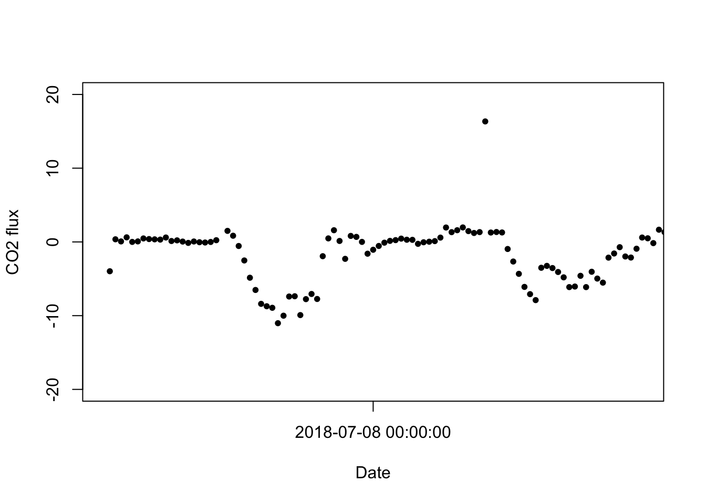
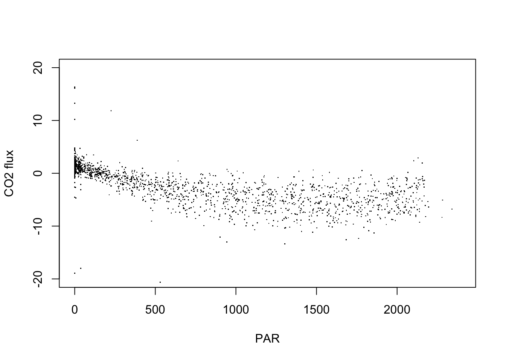
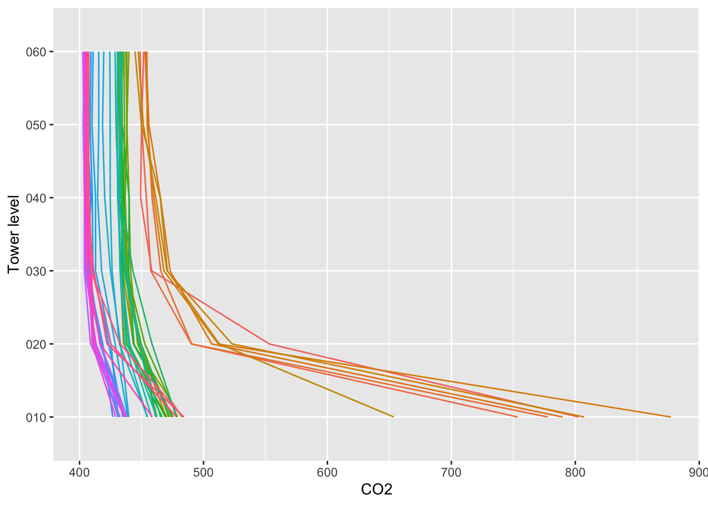

# Flux Measurements & Inter-Operability


>Estimated Time: 3 hours


<div id="ds-challenge" markdown="1">


<div id="ds-challenge" markdown="1">
**Course participants**: As you review this information, please
consider the final course project
that you will work on at the over this semester. At the end of this section, you will
document an initial research question or idea and associated data needed to
address that question, that you may want to explore while pursuing this course.


## Learning Objectives

At the end of this activity, you will be able to:

*These should align with the labs and written questions that we ask*

## Eddy Co_variance Data: What does it actually measure?
 
<iframe width="560" height="315" src="https://www.youtube.com/embed/CR4Anc8Mkas" frameborder="0" allow="accelerometer; autoplay; encrypted-media; gyroscope; picture-in-picture" allowfullscreen></iframe>

### Example Eddy Site

<iframe width="560" height="315" src="https://www.youtube.com/embed/XrxZy7Dp4ko" frameborder="0" allow="accelerometer; autoplay; encrypted-media; gyroscope; picture-in-picture" allowfullscreen></iframe>

## QA/QC Flags


## Examples of Other Flux Networks: AMERIFLUX & FLUXNET

AmeriFlux is a [network of PI-managed sites]() measuring ecosystem CO2, water, and energy fluxes in [North, Central and South America](https://ameriflux.lbl.gov/sites/site-search/#filter-type=all&has-data=All&site_id=). It was established to connect research on field sites representing major climate and ecological biomes, including tundra, grasslands, savanna, crops, and conifer, deciduous, and tropical forests. As a grassroots, investigator-driven network, the AmeriFlux community has tailored instrumentation to suit each unique ecosystem. This “coalition of the willing” is diverse in its interests, use of technologies and collaborative approaches. As a result, the AmeriFlux Network continually pioneers new ground.

The network was launched in 1996, after an international workshop on flux measurements in La Thuile, Italy, in 1995, where some of the first year-long flux measurements were presented. Early support for the network came from many sources, including the U.S. Department of Energy’s Terrestrial Carbon Program, the DOE’s National Institute of Global Environmental Change (NIGEC), NASA, NOAA and the US Forest Service. The network grew from about 15 sites in 1997 to more than 110 active sites registered today. Sixty-one other sites, now inactive, have flux data stored in the network’s database. In 2012, the U.S. DOE established the AmeriFlux Management Project (AMP) at Lawrence Berkeley National Laboratory (LBNL) to support the broad AmeriFlux community and the AmeriFlux sites.

[View the AMERIFLUX Network-at-a-Glance](https://ameriflux.lbl.gov/about/network-at-a-glance/)

AmeriFlux is now one of the DOE Office of Biological and Environmental Research’s (BER) best-known and most highly regarded brands in climate and ecological research. AmeriFlux datasets, and the understanding derived from them, provide crucial linkages between terrestrial ecosystem processes and climate-relevant responses at landscape, regional, and continental scales.

## The Power of Networked Ecology: Bridging to AMERIFLUX and Beyond

Given that [AmeriFlux](https://ameriflux.lbl.gov/) has been collecting and coordinating eddy covariance data across the Americas since 1996. The network provides a common platform for data sharing and collaboration for organizations and individual private investigators collecting flux tower data. There are now >470 registered flux tower sites in North, Central, and South America in the AmeriFlux network, many operated by individual researchers or universities. The towers collect eddy covariance data across a broad range of climate zones and ecosystem types, from Chile to Alaska and everywhere in between.

Now, data from the NEON project is available through the AmeriFlux data portal. The NEON team has formatted data from the NEON flux towers to make it fully compatible with AmeriFlux data. This allows researchers to view, download and analyze data from the NEON flux towers alongside data from all of the other flux towers in the AmeriFlux network.

With 47 flux towers at terrestrial field sites across the U.S., the NEON program is now the largest single contributor of flux tower data to the AmeriFlux network. NEON field sites are located in 20 ecoclimatic zones across the U.S., representing many distinct ecosystems. Eddy covariance data will be served using the same methods at each site for the entire 30-year life of the Observatory, allowing for unprecedented comparability across both time and space.

## Hands On: Introduction to working with NEON eddy flux data

### Setup

Start by installing and loading packages and setting options. 
To work with the NEON flux data, we need the `rhdf5` package, 
which is hosted on Bioconductor, and requires a different 
installation process than CRAN packages:


```
install.packages('BiocManager')
BiocManager::install('rhdf5')
```


```r
options(stringsAsFactors=F)

library(neonUtilities)
```

Use the `zipsByProduct()` function from the `neonUtilities` package to 
download flux data from two sites and two months. The transformations 
and functions below will work on any time range and site(s), but two 
sites and two months allows us to see all the available functionality 
while minimizing download size.

Inputs to the `zipsByProduct()` function:

* `dpID`: DP4.00200.001, the bundled eddy covariance product
* `package`: basic (the expanded package is not covered in this tutorial)
* `site`: NIWO = Niwot Ridge and HARV = Harvard Forest
* `startdate`: 2018-06 (both dates are inclusive)
* `enddate`: 2018-07 (both dates are inclusive)
* `savepath`: modify this to something logical on your machine
* `check.size`: T if you want to see file size before downloading, otherwise F

The download may take a while, especially if you're on a slow network.


```r
zipsByProduct(dpID="DP4.00200.001", package="basic", 
              site=c("NIWO", "HARV"), 
              startdate="2018-06", enddate="2018-07",
              savepath="./data", 
              check.size=F)
```

```
## Finding available files
## 
  |                                                                            
  |                                                                      |   0%
  |                                                                            
  |==================                                                    |  25%
  |                                                                            
  |===================================                                   |  50%
  |                                                                            
  |====================================================                  |  75%
  |                                                                            
  |======================================================================| 100%
## 
## Downloading files totaling approximately 298.8 MiB
```

```
## Warning in dir.create(filepath): './data/filesToStack00200' already exists
```

```
## Downloading 4 files
## 
  |                                                                            
  |                                                                      |   0%
  |                                                                            
  |=======================                                               |  33%
  |                                                                            
  |===============================================                       |  67%
  |                                                                            
  |======================================================================| 100%
## 4 files successfully downloaded to ./data/filesToStack00200
```


### Data Levels

There are five levels of data contained in the eddy flux bundle. For full 
details, refer to the <a href="http://data.neonscience.org/api/v0/documents/NEON.DOC.004571vA" target="_blank">NEON algorithm document</a>.

Briefly, the data levels are:

* Level 0' (dp0p): Calibrated raw observations
* Level 1 (dp01): Time-aggregated observations, e.g. 30-minute mean gas concentrations
* Level 2 (dp02): Time-interpolated data, e.g. rate of change of a gas concentration
* Level 3 (dp03): Spatially interpolated data, i.e. vertical profiles
* Level 4 (dp04): Fluxes

The dp0p data are available in the expanded data package and are beyond 
the scope of this tutorial.

The dp02 and dp03 data are used in storage calculations, and the dp04 data 
include both the storage and turbulent components. Since many users will 
want to focus on the net flux data, we'll start there.

### Extract Level 4 data (Fluxes!)

To extract the Level 4 data from the HDF5 files and merge them into a 
single table, we'll use the `stackEddy()` function from the `neonUtilities` 
package.

`stackEddy()` requires two inputs:

* `filepath`: Path to a file or folder, which can be any one of:
    1. A zip file of eddy flux data downloaded from the NEON data portal
    2. A folder of eddy flux data downloaded by the `zipsByProduct()` function
    3. The folder of files resulting from unzipping either of 1 or 2
    4. A single HDF5 file of NEON eddy flux data
* `level`: dp01-4

Input the filepath you downloaded to using `zipsByProduct()` earlier, 
including the `filestoStack00200` folder created by the function, and 
`dp04`:


```r
flux <- stackEddy(filepath="./data/filesToStack00200",
                 level="dp04")
```

```
## Extracting data
## 
  |                                                                            
  |                                                                      |   0%
  |                                                                            
  |==================                                                    |  25%
  |                                                                            
  |===================================                                   |  50%
  |                                                                            
  |====================================================                  |  75%
  |                                                                            
  |======================================================================| 100%
## Stacking data tables by month
## 
  |                                                                            
  |                                                                      |   0%
  |                                                                            
  |==                                                                    |   4%
  |                                                                            
  |=====                                                                 |   7%
  |                                                                            
  |========                                                              |  11%
  |                                                                            
  |==========                                                            |  14%
  |                                                                            
  |============                                                          |  18%
  |                                                                            
  |===============                                                       |  21%
  |                                                                            
  |==================                                                    |  25%
  |                                                                            
  |====================                                                  |  29%
  |                                                                            
  |======================                                                |  32%
  |                                                                            
  |=========================                                             |  36%
  |                                                                            
  |============================                                          |  39%
  |                                                                            
  |==============================                                        |  43%
  |                                                                            
  |================================                                      |  46%
  |                                                                            
  |===================================                                   |  50%
  |                                                                            
  |======================================                                |  54%
  |                                                                            
  |========================================                              |  57%
  |                                                                            
  |==========================================                            |  61%
  |                                                                            
  |=============================================                         |  64%
  |                                                                            
  |================================================                      |  68%
  |                                                                            
  |==================================================                    |  71%
  |                                                                            
  |====================================================                  |  75%
  |                                                                            
  |=======================================================               |  79%
  |                                                                            
  |==========================================================            |  82%
  |                                                                            
  |============================================================          |  86%
  |                                                                            
  |==============================================================        |  89%
  |                                                                            
  |=================================================================     |  93%
  |                                                                            
  |====================================================================  |  96%
  |                                                                            
  |======================================================================| 100%
## Joining data variables
## 
  |                                                                            
  |                                                                      |   0%
  |                                                                            
  |==                                                                    |   4%
  |                                                                            
  |=====                                                                 |   7%
  |                                                                            
  |========                                                              |  11%
  |                                                                            
  |==========                                                            |  14%
  |                                                                            
  |============                                                          |  18%
  |                                                                            
  |===============                                                       |  21%
  |                                                                            
  |==================                                                    |  25%
  |                                                                            
  |====================                                                  |  29%
  |                                                                            
  |======================                                                |  32%
  |                                                                            
  |=========================                                             |  36%
  |                                                                            
  |============================                                          |  39%
  |                                                                            
  |==============================                                        |  43%
  |                                                                            
  |================================                                      |  46%
  |                                                                            
  |===================================                                   |  50%
  |                                                                            
  |======================================                                |  54%
  |                                                                            
  |========================================                              |  57%
  |                                                                            
  |==========================================                            |  61%
  |                                                                            
  |=============================================                         |  64%
  |                                                                            
  |================================================                      |  68%
  |                                                                            
  |==================================================                    |  71%
  |                                                                            
  |====================================================                  |  75%
  |                                                                            
  |=======================================================               |  79%
  |                                                                            
  |==========================================================            |  82%
  |                                                                            
  |============================================================          |  86%
  |                                                                            
  |==============================================================        |  89%
  |                                                                            
  |=================================================================     |  93%
  |                                                                            
  |====================================================================  |  96%
  |                                                                            
  |======================================================================| 100%
```


We now have an object called `flux`. It's a named list containing four 
tables: one table for each site's data, and `variables` and `objDesc` 
tables.


```r
names(flux)
```

```
## [1] "HARV"      "NIWO"      "variables" "objDesc"
```


Let's look at the contents of one of the site data files:


```r
knitr::kable(head(flux$NIWO))
```

<table>
 <thead>
  <tr>
   <th style="text-align:left;"> timeBgn </th>
   <th style="text-align:left;"> timeEnd </th>
   <th style="text-align:right;"> data.fluxCo2.nsae.flux </th>
   <th style="text-align:right;"> data.fluxCo2.stor.flux </th>
   <th style="text-align:right;"> data.fluxCo2.turb.flux </th>
   <th style="text-align:right;"> data.fluxH2o.nsae.flux </th>
   <th style="text-align:right;"> data.fluxH2o.stor.flux </th>
   <th style="text-align:right;"> data.fluxH2o.turb.flux </th>
   <th style="text-align:right;"> data.fluxMome.turb.veloFric </th>
   <th style="text-align:right;"> data.fluxTemp.nsae.flux </th>
   <th style="text-align:right;"> data.fluxTemp.stor.flux </th>
   <th style="text-align:right;"> data.fluxTemp.turb.flux </th>
   <th style="text-align:right;"> data.foot.stat.angZaxsErth </th>
   <th style="text-align:right;"> data.foot.stat.distReso </th>
   <th style="text-align:right;"> data.foot.stat.veloYaxsHorSd </th>
   <th style="text-align:right;"> data.foot.stat.veloZaxsHorSd </th>
   <th style="text-align:right;"> data.foot.stat.veloFric </th>
   <th style="text-align:right;"> data.foot.stat.distZaxsMeasDisp </th>
   <th style="text-align:right;"> data.foot.stat.distZaxsRgh </th>
   <th style="text-align:right;"> data.foot.stat.distZaxsAbl </th>
   <th style="text-align:right;"> data.foot.stat.distXaxs90 </th>
   <th style="text-align:right;"> data.foot.stat.distXaxsMax </th>
   <th style="text-align:right;"> data.foot.stat.distYaxs90 </th>
   <th style="text-align:right;"> qfqm.fluxCo2.stor.qfFinl </th>
   <th style="text-align:right;"> qfqm.fluxH2o.stor.qfFinl </th>
   <th style="text-align:right;"> qfqm.fluxTemp.stor.qfFinl </th>
  </tr>
 </thead>
<tbody>
  <tr>
   <td style="text-align:left;"> 2018-06-01T00:00:00.000Z </td>
   <td style="text-align:left;"> 2018-06-01T00:29:59.000Z </td>
   <td style="text-align:right;"> 0.1111935 </td>
   <td style="text-align:right;"> -0.0619119 </td>
   <td style="text-align:right;"> 0.1731053 </td>
   <td style="text-align:right;"> 19.401823 </td>
   <td style="text-align:right;"> 3.2511265 </td>
   <td style="text-align:right;"> 16.150697 </td>
   <td style="text-align:right;"> 0.1970704 </td>
   <td style="text-align:right;"> 4.1712006 </td>
   <td style="text-align:right;"> -1.4227119 </td>
   <td style="text-align:right;"> 5.593913 </td>
   <td style="text-align:right;"> 94.90147 </td>
   <td style="text-align:right;"> 8.34 </td>
   <td style="text-align:right;"> 0.7734536 </td>
   <td style="text-align:right;"> 0.2708072 </td>
   <td style="text-align:right;"> 0.2 </td>
   <td style="text-align:right;"> 8.34 </td>
   <td style="text-align:right;"> 0.0322148 </td>
   <td style="text-align:right;"> 1000 </td>
   <td style="text-align:right;"> 333.60 </td>
   <td style="text-align:right;"> 133.44 </td>
   <td style="text-align:right;"> 25.02 </td>
   <td style="text-align:right;"> 1 </td>
   <td style="text-align:right;"> 1 </td>
   <td style="text-align:right;"> 0 </td>
  </tr>
  <tr>
   <td style="text-align:left;"> 2018-06-01T00:30:00.000Z </td>
   <td style="text-align:left;"> 2018-06-01T00:59:59.000Z </td>
   <td style="text-align:right;"> 0.9328922 </td>
   <td style="text-align:right;"> 0.0853412 </td>
   <td style="text-align:right;"> 0.8475510 </td>
   <td style="text-align:right;"> 10.444936 </td>
   <td style="text-align:right;"> -1.1768333 </td>
   <td style="text-align:right;"> 11.621770 </td>
   <td style="text-align:right;"> 0.1969972 </td>
   <td style="text-align:right;"> -0.9163691 </td>
   <td style="text-align:right;"> 0.3331562 </td>
   <td style="text-align:right;"> -1.249525 </td>
   <td style="text-align:right;"> 354.70503 </td>
   <td style="text-align:right;"> 8.34 </td>
   <td style="text-align:right;"> 0.8450318 </td>
   <td style="text-align:right;"> 0.2300000 </td>
   <td style="text-align:right;"> 0.2 </td>
   <td style="text-align:right;"> 8.34 </td>
   <td style="text-align:right;"> 0.3300708 </td>
   <td style="text-align:right;"> 1000 </td>
   <td style="text-align:right;"> 258.54 </td>
   <td style="text-align:right;"> 108.42 </td>
   <td style="text-align:right;"> 50.04 </td>
   <td style="text-align:right;"> 1 </td>
   <td style="text-align:right;"> 1 </td>
   <td style="text-align:right;"> 0 </td>
  </tr>
  <tr>
   <td style="text-align:left;"> 2018-06-01T01:00:00.000Z </td>
   <td style="text-align:left;"> 2018-06-01T01:29:59.000Z </td>
   <td style="text-align:right;"> 0.4673682 </td>
   <td style="text-align:right;"> 0.0217722 </td>
   <td style="text-align:right;"> 0.4455960 </td>
   <td style="text-align:right;"> 5.140617 </td>
   <td style="text-align:right;"> -4.3112673 </td>
   <td style="text-align:right;"> 9.451884 </td>
   <td style="text-align:right;"> 0.0651821 </td>
   <td style="text-align:right;"> -2.9814957 </td>
   <td style="text-align:right;"> 0.1825849 </td>
   <td style="text-align:right;"> -3.164081 </td>
   <td style="text-align:right;"> 358.86732 </td>
   <td style="text-align:right;"> 8.34 </td>
   <td style="text-align:right;"> 1.2219162 </td>
   <td style="text-align:right;"> 0.2300000 </td>
   <td style="text-align:right;"> 0.2 </td>
   <td style="text-align:right;"> 8.34 </td>
   <td style="text-align:right;"> 0.1287607 </td>
   <td style="text-align:right;"> 1000 </td>
   <td style="text-align:right;"> 308.58 </td>
   <td style="text-align:right;"> 125.10 </td>
   <td style="text-align:right;"> 58.38 </td>
   <td style="text-align:right;"> 1 </td>
   <td style="text-align:right;"> 1 </td>
   <td style="text-align:right;"> 0 </td>
  </tr>
  <tr>
   <td style="text-align:left;"> 2018-06-01T01:30:00.000Z </td>
   <td style="text-align:left;"> 2018-06-01T01:59:59.000Z </td>
   <td style="text-align:right;"> 0.7263614 </td>
   <td style="text-align:right;"> 0.2494437 </td>
   <td style="text-align:right;"> 0.4769178 </td>
   <td style="text-align:right;"> 9.017467 </td>
   <td style="text-align:right;"> 0.1980776 </td>
   <td style="text-align:right;"> 8.819389 </td>
   <td style="text-align:right;"> 0.1296400 </td>
   <td style="text-align:right;"> -13.3556222 </td>
   <td style="text-align:right;"> -2.4317615 </td>
   <td style="text-align:right;"> -10.923861 </td>
   <td style="text-align:right;"> 137.68858 </td>
   <td style="text-align:right;"> 8.34 </td>
   <td style="text-align:right;"> 0.7325131 </td>
   <td style="text-align:right;"> 0.2300000 </td>
   <td style="text-align:right;"> 0.2 </td>
   <td style="text-align:right;"> 8.34 </td>
   <td style="text-align:right;"> 0.8340000 </td>
   <td style="text-align:right;"> 1000 </td>
   <td style="text-align:right;"> 208.50 </td>
   <td style="text-align:right;"> 83.40 </td>
   <td style="text-align:right;"> 75.06 </td>
   <td style="text-align:right;"> 1 </td>
   <td style="text-align:right;"> 1 </td>
   <td style="text-align:right;"> 0 </td>
  </tr>
  <tr>
   <td style="text-align:left;"> 2018-06-01T02:00:00.000Z </td>
   <td style="text-align:left;"> 2018-06-01T02:29:59.000Z </td>
   <td style="text-align:right;"> 0.4740572 </td>
   <td style="text-align:right;"> 0.2252436 </td>
   <td style="text-align:right;"> 0.2488136 </td>
   <td style="text-align:right;"> 3.180385 </td>
   <td style="text-align:right;"> 0.1316297 </td>
   <td style="text-align:right;"> 3.048756 </td>
   <td style="text-align:right;"> 0.1746071 </td>
   <td style="text-align:right;"> -5.3406503 </td>
   <td style="text-align:right;"> -0.7324937 </td>
   <td style="text-align:right;"> -4.608157 </td>
   <td style="text-align:right;"> 188.33767 </td>
   <td style="text-align:right;"> 8.34 </td>
   <td style="text-align:right;"> 0.7093743 </td>
   <td style="text-align:right;"> 0.2300000 </td>
   <td style="text-align:right;"> 0.2 </td>
   <td style="text-align:right;"> 8.34 </td>
   <td style="text-align:right;"> 0.8340000 </td>
   <td style="text-align:right;"> 1000 </td>
   <td style="text-align:right;"> 208.50 </td>
   <td style="text-align:right;"> 83.40 </td>
   <td style="text-align:right;"> 66.72 </td>
   <td style="text-align:right;"> 1 </td>
   <td style="text-align:right;"> 1 </td>
   <td style="text-align:right;"> 0 </td>
  </tr>
  <tr>
   <td style="text-align:left;"> 2018-06-01T02:30:00.000Z </td>
   <td style="text-align:left;"> 2018-06-01T02:59:59.000Z </td>
   <td style="text-align:right;"> 0.8807022 </td>
   <td style="text-align:right;"> 0.0707801 </td>
   <td style="text-align:right;"> 0.8099221 </td>
   <td style="text-align:right;"> 4.398761 </td>
   <td style="text-align:right;"> -0.2989443 </td>
   <td style="text-align:right;"> 4.697706 </td>
   <td style="text-align:right;"> 0.1047797 </td>
   <td style="text-align:right;"> -7.2739206 </td>
   <td style="text-align:right;"> -1.8616349 </td>
   <td style="text-align:right;"> -5.412286 </td>
   <td style="text-align:right;"> 183.15582 </td>
   <td style="text-align:right;"> 8.34 </td>
   <td style="text-align:right;"> 0.3791676 </td>
   <td style="text-align:right;"> 0.2300000 </td>
   <td style="text-align:right;"> 0.2 </td>
   <td style="text-align:right;"> 8.34 </td>
   <td style="text-align:right;"> 0.8340000 </td>
   <td style="text-align:right;"> 1000 </td>
   <td style="text-align:right;"> 208.50 </td>
   <td style="text-align:right;"> 83.40 </td>
   <td style="text-align:right;"> 41.70 </td>
   <td style="text-align:right;"> 1 </td>
   <td style="text-align:right;"> 1 </td>
   <td style="text-align:right;"> 0 </td>
  </tr>
</tbody>
</table>


The `variables` and `objDesc` tables can help you interpret the column 
headers in the data table. The `objDesc` table contains definitions for 
many of the terms used in the eddy flux data product, but it isn't 
complete. To get the terms of interest, we'll break up the column headers 
into individual terms and look for them in the `objDesc` table:


```r
term <- unlist(strsplit(names(flux$NIWO), split=".", fixed=T))
flux$objDesc[which(flux$objDesc$Object %in% term),]
```

```
##          Object
## 138 angZaxsErth
## 171        data
## 343      qfFinl
## 420        qfqm
## 604     timeBgn
## 605     timeEnd
##                                                                                                         Description
## 138                                                                                                 Wind direction 
## 171                                                                                          Represents data fields
## 343       The final quality flag indicating if the data are valid for the given aggregation period (1=fail, 0=pass)
## 420 Quality flag and quality metrics, represents quality flags and quality metrics that accompany the provided data
## 604                                                                    The beginning time of the aggregation period
## 605                                                                          The end time of the aggregation period
```

```r
knitr::kable(term)
```

<table>
 <thead>
  <tr>
   <th style="text-align:left;"> x </th>
  </tr>
 </thead>
<tbody>
  <tr>
   <td style="text-align:left;"> timeBgn </td>
  </tr>
  <tr>
   <td style="text-align:left;"> timeEnd </td>
  </tr>
  <tr>
   <td style="text-align:left;"> data </td>
  </tr>
  <tr>
   <td style="text-align:left;"> fluxCo2 </td>
  </tr>
  <tr>
   <td style="text-align:left;"> nsae </td>
  </tr>
  <tr>
   <td style="text-align:left;"> flux </td>
  </tr>
  <tr>
   <td style="text-align:left;"> data </td>
  </tr>
  <tr>
   <td style="text-align:left;"> fluxCo2 </td>
  </tr>
  <tr>
   <td style="text-align:left;"> stor </td>
  </tr>
  <tr>
   <td style="text-align:left;"> flux </td>
  </tr>
  <tr>
   <td style="text-align:left;"> data </td>
  </tr>
  <tr>
   <td style="text-align:left;"> fluxCo2 </td>
  </tr>
  <tr>
   <td style="text-align:left;"> turb </td>
  </tr>
  <tr>
   <td style="text-align:left;"> flux </td>
  </tr>
  <tr>
   <td style="text-align:left;"> data </td>
  </tr>
  <tr>
   <td style="text-align:left;"> fluxH2o </td>
  </tr>
  <tr>
   <td style="text-align:left;"> nsae </td>
  </tr>
  <tr>
   <td style="text-align:left;"> flux </td>
  </tr>
  <tr>
   <td style="text-align:left;"> data </td>
  </tr>
  <tr>
   <td style="text-align:left;"> fluxH2o </td>
  </tr>
  <tr>
   <td style="text-align:left;"> stor </td>
  </tr>
  <tr>
   <td style="text-align:left;"> flux </td>
  </tr>
  <tr>
   <td style="text-align:left;"> data </td>
  </tr>
  <tr>
   <td style="text-align:left;"> fluxH2o </td>
  </tr>
  <tr>
   <td style="text-align:left;"> turb </td>
  </tr>
  <tr>
   <td style="text-align:left;"> flux </td>
  </tr>
  <tr>
   <td style="text-align:left;"> data </td>
  </tr>
  <tr>
   <td style="text-align:left;"> fluxMome </td>
  </tr>
  <tr>
   <td style="text-align:left;"> turb </td>
  </tr>
  <tr>
   <td style="text-align:left;"> veloFric </td>
  </tr>
  <tr>
   <td style="text-align:left;"> data </td>
  </tr>
  <tr>
   <td style="text-align:left;"> fluxTemp </td>
  </tr>
  <tr>
   <td style="text-align:left;"> nsae </td>
  </tr>
  <tr>
   <td style="text-align:left;"> flux </td>
  </tr>
  <tr>
   <td style="text-align:left;"> data </td>
  </tr>
  <tr>
   <td style="text-align:left;"> fluxTemp </td>
  </tr>
  <tr>
   <td style="text-align:left;"> stor </td>
  </tr>
  <tr>
   <td style="text-align:left;"> flux </td>
  </tr>
  <tr>
   <td style="text-align:left;"> data </td>
  </tr>
  <tr>
   <td style="text-align:left;"> fluxTemp </td>
  </tr>
  <tr>
   <td style="text-align:left;"> turb </td>
  </tr>
  <tr>
   <td style="text-align:left;"> flux </td>
  </tr>
  <tr>
   <td style="text-align:left;"> data </td>
  </tr>
  <tr>
   <td style="text-align:left;"> foot </td>
  </tr>
  <tr>
   <td style="text-align:left;"> stat </td>
  </tr>
  <tr>
   <td style="text-align:left;"> angZaxsErth </td>
  </tr>
  <tr>
   <td style="text-align:left;"> data </td>
  </tr>
  <tr>
   <td style="text-align:left;"> foot </td>
  </tr>
  <tr>
   <td style="text-align:left;"> stat </td>
  </tr>
  <tr>
   <td style="text-align:left;"> distReso </td>
  </tr>
  <tr>
   <td style="text-align:left;"> data </td>
  </tr>
  <tr>
   <td style="text-align:left;"> foot </td>
  </tr>
  <tr>
   <td style="text-align:left;"> stat </td>
  </tr>
  <tr>
   <td style="text-align:left;"> veloYaxsHorSd </td>
  </tr>
  <tr>
   <td style="text-align:left;"> data </td>
  </tr>
  <tr>
   <td style="text-align:left;"> foot </td>
  </tr>
  <tr>
   <td style="text-align:left;"> stat </td>
  </tr>
  <tr>
   <td style="text-align:left;"> veloZaxsHorSd </td>
  </tr>
  <tr>
   <td style="text-align:left;"> data </td>
  </tr>
  <tr>
   <td style="text-align:left;"> foot </td>
  </tr>
  <tr>
   <td style="text-align:left;"> stat </td>
  </tr>
  <tr>
   <td style="text-align:left;"> veloFric </td>
  </tr>
  <tr>
   <td style="text-align:left;"> data </td>
  </tr>
  <tr>
   <td style="text-align:left;"> foot </td>
  </tr>
  <tr>
   <td style="text-align:left;"> stat </td>
  </tr>
  <tr>
   <td style="text-align:left;"> distZaxsMeasDisp </td>
  </tr>
  <tr>
   <td style="text-align:left;"> data </td>
  </tr>
  <tr>
   <td style="text-align:left;"> foot </td>
  </tr>
  <tr>
   <td style="text-align:left;"> stat </td>
  </tr>
  <tr>
   <td style="text-align:left;"> distZaxsRgh </td>
  </tr>
  <tr>
   <td style="text-align:left;"> data </td>
  </tr>
  <tr>
   <td style="text-align:left;"> foot </td>
  </tr>
  <tr>
   <td style="text-align:left;"> stat </td>
  </tr>
  <tr>
   <td style="text-align:left;"> distZaxsAbl </td>
  </tr>
  <tr>
   <td style="text-align:left;"> data </td>
  </tr>
  <tr>
   <td style="text-align:left;"> foot </td>
  </tr>
  <tr>
   <td style="text-align:left;"> stat </td>
  </tr>
  <tr>
   <td style="text-align:left;"> distXaxs90 </td>
  </tr>
  <tr>
   <td style="text-align:left;"> data </td>
  </tr>
  <tr>
   <td style="text-align:left;"> foot </td>
  </tr>
  <tr>
   <td style="text-align:left;"> stat </td>
  </tr>
  <tr>
   <td style="text-align:left;"> distXaxsMax </td>
  </tr>
  <tr>
   <td style="text-align:left;"> data </td>
  </tr>
  <tr>
   <td style="text-align:left;"> foot </td>
  </tr>
  <tr>
   <td style="text-align:left;"> stat </td>
  </tr>
  <tr>
   <td style="text-align:left;"> distYaxs90 </td>
  </tr>
  <tr>
   <td style="text-align:left;"> qfqm </td>
  </tr>
  <tr>
   <td style="text-align:left;"> fluxCo2 </td>
  </tr>
  <tr>
   <td style="text-align:left;"> stor </td>
  </tr>
  <tr>
   <td style="text-align:left;"> qfFinl </td>
  </tr>
  <tr>
   <td style="text-align:left;"> qfqm </td>
  </tr>
  <tr>
   <td style="text-align:left;"> fluxH2o </td>
  </tr>
  <tr>
   <td style="text-align:left;"> stor </td>
  </tr>
  <tr>
   <td style="text-align:left;"> qfFinl </td>
  </tr>
  <tr>
   <td style="text-align:left;"> qfqm </td>
  </tr>
  <tr>
   <td style="text-align:left;"> fluxTemp </td>
  </tr>
  <tr>
   <td style="text-align:left;"> stor </td>
  </tr>
  <tr>
   <td style="text-align:left;"> qfFinl </td>
  </tr>
</tbody>
</table>


For the terms that aren't captured here, `fluxCo2`, `fluxH2o`, and `fluxTemp` 
are self-explanatory. The flux components are

* `turb`: Turbulent flux
* `stor`: Storage
* `nsae`: Net surface-atmosphere exchange

The `variables` table contains the units for each field:


```r
knitr::kable(flux$variables)
```

<table>
 <thead>
  <tr>
   <th style="text-align:left;"> category </th>
   <th style="text-align:left;"> system </th>
   <th style="text-align:left;"> variable </th>
   <th style="text-align:left;"> stat </th>
   <th style="text-align:left;"> units </th>
  </tr>
 </thead>
<tbody>
  <tr>
   <td style="text-align:left;"> data </td>
   <td style="text-align:left;"> fluxCo2 </td>
   <td style="text-align:left;"> nsae </td>
   <td style="text-align:left;">  </td>
   <td style="text-align:left;"> umolCo2 m-2 s-1 </td>
  </tr>
  <tr>
   <td style="text-align:left;"> data </td>
   <td style="text-align:left;"> fluxCo2 </td>
   <td style="text-align:left;"> stor </td>
   <td style="text-align:left;">  </td>
   <td style="text-align:left;"> umolCo2 m-2 s-1 </td>
  </tr>
  <tr>
   <td style="text-align:left;"> data </td>
   <td style="text-align:left;"> fluxCo2 </td>
   <td style="text-align:left;"> turb </td>
   <td style="text-align:left;">  </td>
   <td style="text-align:left;"> umolCo2 m-2 s-1 </td>
  </tr>
  <tr>
   <td style="text-align:left;"> data </td>
   <td style="text-align:left;"> fluxH2o </td>
   <td style="text-align:left;"> nsae </td>
   <td style="text-align:left;">  </td>
   <td style="text-align:left;"> W m-2 </td>
  </tr>
  <tr>
   <td style="text-align:left;"> data </td>
   <td style="text-align:left;"> fluxH2o </td>
   <td style="text-align:left;"> stor </td>
   <td style="text-align:left;">  </td>
   <td style="text-align:left;"> W m-2 </td>
  </tr>
  <tr>
   <td style="text-align:left;"> data </td>
   <td style="text-align:left;"> fluxH2o </td>
   <td style="text-align:left;"> turb </td>
   <td style="text-align:left;">  </td>
   <td style="text-align:left;"> W m-2 </td>
  </tr>
  <tr>
   <td style="text-align:left;"> data </td>
   <td style="text-align:left;"> fluxMome </td>
   <td style="text-align:left;"> turb </td>
   <td style="text-align:left;">  </td>
   <td style="text-align:left;"> m s-1 </td>
  </tr>
  <tr>
   <td style="text-align:left;"> data </td>
   <td style="text-align:left;"> fluxTemp </td>
   <td style="text-align:left;"> nsae </td>
   <td style="text-align:left;">  </td>
   <td style="text-align:left;"> W m-2 </td>
  </tr>
  <tr>
   <td style="text-align:left;"> data </td>
   <td style="text-align:left;"> fluxTemp </td>
   <td style="text-align:left;"> stor </td>
   <td style="text-align:left;">  </td>
   <td style="text-align:left;"> W m-2 </td>
  </tr>
  <tr>
   <td style="text-align:left;"> data </td>
   <td style="text-align:left;"> fluxTemp </td>
   <td style="text-align:left;"> turb </td>
   <td style="text-align:left;">  </td>
   <td style="text-align:left;"> W m-2 </td>
  </tr>
  <tr>
   <td style="text-align:left;"> data </td>
   <td style="text-align:left;"> foot </td>
   <td style="text-align:left;"> stat </td>
   <td style="text-align:left;"> angZaxsErth </td>
   <td style="text-align:left;"> deg </td>
  </tr>
  <tr>
   <td style="text-align:left;"> data </td>
   <td style="text-align:left;"> foot </td>
   <td style="text-align:left;"> stat </td>
   <td style="text-align:left;"> distReso </td>
   <td style="text-align:left;"> m </td>
  </tr>
  <tr>
   <td style="text-align:left;"> data </td>
   <td style="text-align:left;"> foot </td>
   <td style="text-align:left;"> stat </td>
   <td style="text-align:left;"> veloYaxsHorSd </td>
   <td style="text-align:left;"> m s-1 </td>
  </tr>
  <tr>
   <td style="text-align:left;"> data </td>
   <td style="text-align:left;"> foot </td>
   <td style="text-align:left;"> stat </td>
   <td style="text-align:left;"> veloZaxsHorSd </td>
   <td style="text-align:left;"> m s-1 </td>
  </tr>
  <tr>
   <td style="text-align:left;"> data </td>
   <td style="text-align:left;"> foot </td>
   <td style="text-align:left;"> stat </td>
   <td style="text-align:left;"> veloFric </td>
   <td style="text-align:left;"> m s-1 </td>
  </tr>
  <tr>
   <td style="text-align:left;"> data </td>
   <td style="text-align:left;"> foot </td>
   <td style="text-align:left;"> stat </td>
   <td style="text-align:left;"> distZaxsMeasDisp </td>
   <td style="text-align:left;"> m </td>
  </tr>
  <tr>
   <td style="text-align:left;"> data </td>
   <td style="text-align:left;"> foot </td>
   <td style="text-align:left;"> stat </td>
   <td style="text-align:left;"> distZaxsRgh </td>
   <td style="text-align:left;"> m </td>
  </tr>
  <tr>
   <td style="text-align:left;"> data </td>
   <td style="text-align:left;"> foot </td>
   <td style="text-align:left;"> stat </td>
   <td style="text-align:left;"> distZaxsAbl </td>
   <td style="text-align:left;"> m </td>
  </tr>
  <tr>
   <td style="text-align:left;"> data </td>
   <td style="text-align:left;"> foot </td>
   <td style="text-align:left;"> stat </td>
   <td style="text-align:left;"> distXaxs90 </td>
   <td style="text-align:left;"> m </td>
  </tr>
  <tr>
   <td style="text-align:left;"> data </td>
   <td style="text-align:left;"> foot </td>
   <td style="text-align:left;"> stat </td>
   <td style="text-align:left;"> distXaxsMax </td>
   <td style="text-align:left;"> m </td>
  </tr>
  <tr>
   <td style="text-align:left;"> data </td>
   <td style="text-align:left;"> foot </td>
   <td style="text-align:left;"> stat </td>
   <td style="text-align:left;"> distYaxs90 </td>
   <td style="text-align:left;"> m </td>
  </tr>
  <tr>
   <td style="text-align:left;"> qfqm </td>
   <td style="text-align:left;"> fluxCo2 </td>
   <td style="text-align:left;"> stor </td>
   <td style="text-align:left;">  </td>
   <td style="text-align:left;"> NA </td>
  </tr>
  <tr>
   <td style="text-align:left;"> qfqm </td>
   <td style="text-align:left;"> fluxH2o </td>
   <td style="text-align:left;"> stor </td>
   <td style="text-align:left;">  </td>
   <td style="text-align:left;"> NA </td>
  </tr>
  <tr>
   <td style="text-align:left;"> qfqm </td>
   <td style="text-align:left;"> fluxTemp </td>
   <td style="text-align:left;"> stor </td>
   <td style="text-align:left;">  </td>
   <td style="text-align:left;"> NA </td>
  </tr>
</tbody>
</table>


Let's plot some data! First, we'll need to convert the time stamps 
to an R date-time format (right now they're just character fields).

### Time stamps

NEON sensor data come with time stamps for both the start and end of 
the averaging period. Depending on the analysis you're doing, you may 
want to use one or the other; for general plotting, re-formatting, and 
transformations, I prefer to use the start time, because there 
are some small inconsistencies between data products in a few of the 
end time stamps.

Note that **all** NEON data use UTC time, noted as 
`tz="GMT"` in the code below. This is true across NEON's instrumented, 
observational, and airborne measurements. When working with NEON data, 
it's best to keep everything in UTC as much as possible, otherwise it's 
very easy to end up with data in mismatched times, which can cause 
insidious and hard-to-detect problems. Be sure to include the `tz` 
argument in all the lines of code below - if there is no time zone 
specified, R will default to the local time zone it detects on your 
operating system.


```r
timeB <- as.POSIXct(flux$NIWO$timeBgn, 
                    format="%Y-%m-%dT%H:%M:%S", 
                    tz="GMT")
flux$NIWO <- cbind(timeB, flux$NIWO)
```


```r
plot(flux$NIWO$data.fluxCo2.nsae.flux~timeB, 
     pch=".", xlab="Date", ylab="CO2 flux",
     xaxt="n")
axis.POSIXct(1, x=timeB, format="%Y-%m-%d")
```


Like a lot of flux data, these data have some stray spikes, but there 
is a clear diurnal pattern going into the growing season.

Let's trim down to just two days of data to see a few other details.


```r
plot(flux$NIWO$data.fluxCo2.nsae.flux~timeB, 
     pch=20, xlab="Date", ylab="CO2 flux",
     xlim=c(as.POSIXct("2018-07-07", tz="GMT"),
            as.POSIXct("2018-07-09", tz="GMT")),
    ylim=c(-20,20), xaxt="n")
axis.POSIXct(1, x=timeB, format="%Y-%m-%d %H:%M:%S")
```




Note the timing of C uptake; the UTC time zone is clear here, where 
uptake occurs at times that appear to be during the night.

### Merge flux data with other sensor data

Many of the data sets we would use to interpret and model flux data are 
measured as part of the NEON project, but are not present in the eddy flux 
data product bundle. In this section, we'll download PAR data and merge 
them with the flux data; the steps taken here can be applied to any of the 
NEON instrumented (IS) data products.

#### Download PAR data

To get NEON PAR data, use the `loadByProduct()` function from the 
`neonUtilities` package. `loadByProduct()` takes the same inputs as 
`zipsByProduct()`, but it loads the downloaded data directly into the 
current R environment.

Let's download PAR data matching the Niwot Ridge flux data. The inputs 
needed are:

* `dpID`: DP1.00024.001
* `site`: NIWO
* `startdate`: 2018-06
* `enddate`: 2018-07
* `package`: basic
* `avg`: 30

The new input here is `avg=30`, which downloads only the 30-minute data. 
Since the flux data are at a 30-minute resolution, we can save on 
download time by disregarding the 1-minute data files (which are of course 
30 times larger). The `avg` input can be left off if you want to download 
all available averaging intervals.


```r
pr <- loadByProduct("DP1.00024.001", site="NIWO", avg=30,
                    startdate="2018-06", enddate="2018-07",
                    package="basic", check.size=F)
```

```
## Finding available files
## 
  |                                                                            
  |                                                                      |   0%
  |                                                                            
  |===================================                                   |  50%
  |                                                                            
  |======================================================================| 100%
## 
## Downloading files totaling approximately 1.2 MiB
## Downloading 11 files
## 
  |                                                                            
  |                                                                      |   0%
  |                                                                            
  |=======                                                               |  10%
  |                                                                            
  |==============                                                        |  20%
  |                                                                            
  |=====================                                                 |  30%
  |                                                                            
  |============================                                          |  40%
  |                                                                            
  |===================================                                   |  50%
  |                                                                            
  |==========================================                            |  60%
  |                                                                            
  |=================================================                     |  70%
  |                                                                            
  |========================================================              |  80%
  |                                                                            
  |===============================================================       |  90%
  |                                                                            
  |======================================================================| 100%
## 
## Stacking operation across a single core.
## Stacking table PARPAR_30min
## Merged the most recent publication of sensor position files for each site and saved to /stackedFiles
## Copied the most recent publication of variable definition file to /stackedFiles
## Finished: Stacked 1 data tables and 2 metadata tables!
## Stacking took 0.200515 secs
## All unzipped monthly data folders have been removed.
```


`pr` is another named list, and again, metadata and units can be found in 
the `variables` table. The `PARPAR_30min` table contains a `verticalPosition` 
field. This field indicates the position on the tower, with 10 being the 
first tower level, and 20, 30, etc going up the tower.

#### Join PAR to flux data

We'll connect PAR data from the tower top to the flux data.


```r
pr.top <- pr$PARPAR_30min[which(pr$PARPAR_30min$verticalPosition==
                                max(pr$PARPAR_30min$verticalPosition)),]
```

`loadByProduct()` automatically converts time stamps when it reads the 
data, so here we just need to indicate which time field to use to 
merge the flux and PAR data.


```r
timeB <- pr.top$startDateTime
pr.top <- cbind(timeB, pr.top)
```

And merge the two datasets:


```r
fx.pr <- merge(pr.top, flux$NIWO, by="timeB")
```


```r
plot(fx.pr$data.fluxCo2.nsae.flux~fx.pr$PARMean,
     pch=".", ylim=c(-20,20),
     xlab="PAR", ylab="CO2 flux")
```




If you're interested in data in the eddy covariance bundle besides the 
net flux data, the rest of this tutorial will guide you through how to 
get those data out of the bundle.

### Vertical profile data (Level 3)

The Level 3 (`dp03`) data are the spatially interpolated profiles of 
the rates of change of CO<sub>2</sub>, H<sub>2</sub>O, and temperature.
Extract the Level 3 data from the HDF5 file using `stackEddy()` with 
the same syntax as for the Level 4 data.


```r
prof <- stackEddy(filepath="./data/filesToStack00200/",
                 level="dp03")
```

```
## Extracting data
## 
  |                                                                            
  |                                                                      |   0%
  |                                                                            
  |==================                                                    |  25%
  |                                                                            
  |===================================                                   |  50%
  |                                                                            
  |====================================================                  |  75%
  |                                                                            
  |======================================================================| 100%
## Stacking data tables by month
## 
  |                                                                            
  |                                                                      |   0%
  |                                                                            
  |======                                                                |   8%
  |                                                                            
  |============                                                          |  17%
  |                                                                            
  |==================                                                    |  25%
  |                                                                            
  |=======================                                               |  33%
  |                                                                            
  |=============================                                         |  42%
  |                                                                            
  |===================================                                   |  50%
  |                                                                            
  |=========================================                             |  58%
  |                                                                            
  |===============================================                       |  67%
  |                                                                            
  |====================================================                  |  75%
  |                                                                            
  |==========================================================            |  83%
  |                                                                            
  |================================================================      |  92%
  |                                                                            
  |======================================================================| 100%
## Joining data variables
## 
  |                                                                            
  |                                                                      |   0%
  |                                                                            
  |======                                                                |   8%
  |                                                                            
  |============                                                          |  17%
  |                                                                            
  |==================                                                    |  25%
  |                                                                            
  |=======================                                               |  33%
  |                                                                            
  |=============================                                         |  42%
  |                                                                            
  |===================================                                   |  50%
  |                                                                            
  |=========================================                             |  58%
  |                                                                            
  |===============================================                       |  67%
  |                                                                            
  |====================================================                  |  75%
  |                                                                            
  |==========================================================            |  83%
  |                                                                            
  |================================================================      |  92%
  |                                                                            
  |======================================================================| 100%
```


```r
knitr::kable(head(prof$NIWO))
```

<table>
 <thead>
  <tr>
   <th style="text-align:left;"> timeBgn </th>
   <th style="text-align:left;"> timeEnd </th>
   <th style="text-align:right;"> data.co2Stor.rateRtioMoleDryCo2.X0.1.m </th>
   <th style="text-align:right;"> data.co2Stor.rateRtioMoleDryCo2.X0.2.m </th>
   <th style="text-align:right;"> data.co2Stor.rateRtioMoleDryCo2.X0.3.m </th>
   <th style="text-align:right;"> data.co2Stor.rateRtioMoleDryCo2.X0.4.m </th>
   <th style="text-align:right;"> data.co2Stor.rateRtioMoleDryCo2.X0.5.m </th>
   <th style="text-align:right;"> data.co2Stor.rateRtioMoleDryCo2.X0.6.m </th>
   <th style="text-align:right;"> data.co2Stor.rateRtioMoleDryCo2.X0.7.m </th>
   <th style="text-align:right;"> data.co2Stor.rateRtioMoleDryCo2.X0.8.m </th>
   <th style="text-align:right;"> data.co2Stor.rateRtioMoleDryCo2.X0.9.m </th>
   <th style="text-align:right;"> data.co2Stor.rateRtioMoleDryCo2.X1.m </th>
   <th style="text-align:right;"> data.co2Stor.rateRtioMoleDryCo2.X1.1.m </th>
   <th style="text-align:right;"> data.co2Stor.rateRtioMoleDryCo2.X1.2.m </th>
   <th style="text-align:right;"> data.co2Stor.rateRtioMoleDryCo2.X1.3.m </th>
   <th style="text-align:right;"> data.co2Stor.rateRtioMoleDryCo2.X1.4.m </th>
   <th style="text-align:right;"> data.co2Stor.rateRtioMoleDryCo2.X1.5.m </th>
   <th style="text-align:right;"> data.co2Stor.rateRtioMoleDryCo2.X1.6.m </th>
   <th style="text-align:right;"> data.co2Stor.rateRtioMoleDryCo2.X1.7.m </th>
   <th style="text-align:right;"> data.co2Stor.rateRtioMoleDryCo2.X1.8.m </th>
   <th style="text-align:right;"> data.co2Stor.rateRtioMoleDryCo2.X1.9.m </th>
   <th style="text-align:right;"> data.co2Stor.rateRtioMoleDryCo2.X2.m </th>
   <th style="text-align:right;"> data.co2Stor.rateRtioMoleDryCo2.X2.1.m </th>
   <th style="text-align:right;"> data.co2Stor.rateRtioMoleDryCo2.X2.2.m </th>
   <th style="text-align:right;"> data.co2Stor.rateRtioMoleDryCo2.X2.3.m </th>
   <th style="text-align:right;"> data.co2Stor.rateRtioMoleDryCo2.X2.4.m </th>
   <th style="text-align:right;"> data.co2Stor.rateRtioMoleDryCo2.X2.5.m </th>
   <th style="text-align:right;"> data.co2Stor.rateRtioMoleDryCo2.X2.6.m </th>
   <th style="text-align:right;"> data.co2Stor.rateRtioMoleDryCo2.X2.7.m </th>
   <th style="text-align:right;"> data.co2Stor.rateRtioMoleDryCo2.X2.8.m </th>
   <th style="text-align:right;"> data.co2Stor.rateRtioMoleDryCo2.X2.9.m </th>
   <th style="text-align:right;"> data.co2Stor.rateRtioMoleDryCo2.X3.m </th>
   <th style="text-align:right;"> data.co2Stor.rateRtioMoleDryCo2.X3.1.m </th>
   <th style="text-align:right;"> data.co2Stor.rateRtioMoleDryCo2.X3.2.m </th>
   <th style="text-align:right;"> data.co2Stor.rateRtioMoleDryCo2.X3.3.m </th>
   <th style="text-align:right;"> data.co2Stor.rateRtioMoleDryCo2.X3.4.m </th>
   <th style="text-align:right;"> data.co2Stor.rateRtioMoleDryCo2.X3.5.m </th>
   <th style="text-align:right;"> data.co2Stor.rateRtioMoleDryCo2.X3.6.m </th>
   <th style="text-align:right;"> data.co2Stor.rateRtioMoleDryCo2.X3.7.m </th>
   <th style="text-align:right;"> data.co2Stor.rateRtioMoleDryCo2.X3.8.m </th>
   <th style="text-align:right;"> data.co2Stor.rateRtioMoleDryCo2.X3.9.m </th>
   <th style="text-align:right;"> data.co2Stor.rateRtioMoleDryCo2.X4.m </th>
   <th style="text-align:right;"> data.co2Stor.rateRtioMoleDryCo2.X4.1.m </th>
   <th style="text-align:right;"> data.co2Stor.rateRtioMoleDryCo2.X4.2.m </th>
   <th style="text-align:right;"> data.co2Stor.rateRtioMoleDryCo2.X4.3.m </th>
   <th style="text-align:right;"> data.co2Stor.rateRtioMoleDryCo2.X4.4.m </th>
   <th style="text-align:right;"> data.co2Stor.rateRtioMoleDryCo2.X4.5.m </th>
   <th style="text-align:right;"> data.co2Stor.rateRtioMoleDryCo2.X4.6.m </th>
   <th style="text-align:right;"> data.co2Stor.rateRtioMoleDryCo2.X4.7.m </th>
   <th style="text-align:right;"> data.co2Stor.rateRtioMoleDryCo2.X4.8.m </th>
   <th style="text-align:right;"> data.co2Stor.rateRtioMoleDryCo2.X4.9.m </th>
   <th style="text-align:right;"> data.co2Stor.rateRtioMoleDryCo2.X5.m </th>
   <th style="text-align:right;"> data.co2Stor.rateRtioMoleDryCo2.X5.1.m </th>
   <th style="text-align:right;"> data.co2Stor.rateRtioMoleDryCo2.X5.2.m </th>
   <th style="text-align:right;"> data.co2Stor.rateRtioMoleDryCo2.X5.3.m </th>
   <th style="text-align:right;"> data.co2Stor.rateRtioMoleDryCo2.X5.4.m </th>
   <th style="text-align:right;"> data.co2Stor.rateRtioMoleDryCo2.X5.5.m </th>
   <th style="text-align:right;"> data.co2Stor.rateRtioMoleDryCo2.X5.6.m </th>
   <th style="text-align:right;"> data.co2Stor.rateRtioMoleDryCo2.X5.7.m </th>
   <th style="text-align:right;"> data.co2Stor.rateRtioMoleDryCo2.X5.8.m </th>
   <th style="text-align:right;"> data.co2Stor.rateRtioMoleDryCo2.X5.9.m </th>
   <th style="text-align:right;"> data.co2Stor.rateRtioMoleDryCo2.X6.m </th>
   <th style="text-align:right;"> data.co2Stor.rateRtioMoleDryCo2.X6.1.m </th>
   <th style="text-align:right;"> data.co2Stor.rateRtioMoleDryCo2.X6.2.m </th>
   <th style="text-align:right;"> data.co2Stor.rateRtioMoleDryCo2.X6.3.m </th>
   <th style="text-align:right;"> data.co2Stor.rateRtioMoleDryCo2.X6.4.m </th>
   <th style="text-align:right;"> data.co2Stor.rateRtioMoleDryCo2.X6.5.m </th>
   <th style="text-align:right;"> data.co2Stor.rateRtioMoleDryCo2.X6.6.m </th>
   <th style="text-align:right;"> data.co2Stor.rateRtioMoleDryCo2.X6.7.m </th>
   <th style="text-align:right;"> data.co2Stor.rateRtioMoleDryCo2.X6.8.m </th>
   <th style="text-align:right;"> data.co2Stor.rateRtioMoleDryCo2.X6.9.m </th>
   <th style="text-align:right;"> data.co2Stor.rateRtioMoleDryCo2.X7.m </th>
   <th style="text-align:right;"> data.co2Stor.rateRtioMoleDryCo2.X7.1.m </th>
   <th style="text-align:right;"> data.co2Stor.rateRtioMoleDryCo2.X7.2.m </th>
   <th style="text-align:right;"> data.co2Stor.rateRtioMoleDryCo2.X7.3.m </th>
   <th style="text-align:right;"> data.co2Stor.rateRtioMoleDryCo2.X7.4.m </th>
   <th style="text-align:right;"> data.co2Stor.rateRtioMoleDryCo2.X7.5.m </th>
   <th style="text-align:right;"> data.co2Stor.rateRtioMoleDryCo2.X7.6.m </th>
   <th style="text-align:right;"> data.co2Stor.rateRtioMoleDryCo2.X7.7.m </th>
   <th style="text-align:right;"> data.co2Stor.rateRtioMoleDryCo2.X7.8.m </th>
   <th style="text-align:right;"> data.co2Stor.rateRtioMoleDryCo2.X7.9.m </th>
   <th style="text-align:right;"> data.co2Stor.rateRtioMoleDryCo2.X8.m </th>
   <th style="text-align:right;"> data.co2Stor.rateRtioMoleDryCo2.X8.1.m </th>
   <th style="text-align:right;"> data.co2Stor.rateRtioMoleDryCo2.X8.2.m </th>
   <th style="text-align:right;"> data.co2Stor.rateRtioMoleDryCo2.X8.3.m </th>
   <th style="text-align:right;"> data.co2Stor.rateRtioMoleDryCo2.X8.4.m </th>
   <th style="text-align:right;"> data.h2oStor.rateRtioMoleDryH2o.X0.1.m </th>
   <th style="text-align:right;"> data.h2oStor.rateRtioMoleDryH2o.X0.2.m </th>
   <th style="text-align:right;"> data.h2oStor.rateRtioMoleDryH2o.X0.3.m </th>
   <th style="text-align:right;"> data.h2oStor.rateRtioMoleDryH2o.X0.4.m </th>
   <th style="text-align:right;"> data.h2oStor.rateRtioMoleDryH2o.X0.5.m </th>
   <th style="text-align:right;"> data.h2oStor.rateRtioMoleDryH2o.X0.6.m </th>
   <th style="text-align:right;"> data.h2oStor.rateRtioMoleDryH2o.X0.7.m </th>
   <th style="text-align:right;"> data.h2oStor.rateRtioMoleDryH2o.X0.8.m </th>
   <th style="text-align:right;"> data.h2oStor.rateRtioMoleDryH2o.X0.9.m </th>
   <th style="text-align:right;"> data.h2oStor.rateRtioMoleDryH2o.X1.m </th>
   <th style="text-align:right;"> data.h2oStor.rateRtioMoleDryH2o.X1.1.m </th>
   <th style="text-align:right;"> data.h2oStor.rateRtioMoleDryH2o.X1.2.m </th>
   <th style="text-align:right;"> data.h2oStor.rateRtioMoleDryH2o.X1.3.m </th>
   <th style="text-align:right;"> data.h2oStor.rateRtioMoleDryH2o.X1.4.m </th>
   <th style="text-align:right;"> data.h2oStor.rateRtioMoleDryH2o.X1.5.m </th>
   <th style="text-align:right;"> data.h2oStor.rateRtioMoleDryH2o.X1.6.m </th>
   <th style="text-align:right;"> data.h2oStor.rateRtioMoleDryH2o.X1.7.m </th>
   <th style="text-align:right;"> data.h2oStor.rateRtioMoleDryH2o.X1.8.m </th>
   <th style="text-align:right;"> data.h2oStor.rateRtioMoleDryH2o.X1.9.m </th>
   <th style="text-align:right;"> data.h2oStor.rateRtioMoleDryH2o.X2.m </th>
   <th style="text-align:right;"> data.h2oStor.rateRtioMoleDryH2o.X2.1.m </th>
   <th style="text-align:right;"> data.h2oStor.rateRtioMoleDryH2o.X2.2.m </th>
   <th style="text-align:right;"> data.h2oStor.rateRtioMoleDryH2o.X2.3.m </th>
   <th style="text-align:right;"> data.h2oStor.rateRtioMoleDryH2o.X2.4.m </th>
   <th style="text-align:right;"> data.h2oStor.rateRtioMoleDryH2o.X2.5.m </th>
   <th style="text-align:right;"> data.h2oStor.rateRtioMoleDryH2o.X2.6.m </th>
   <th style="text-align:right;"> data.h2oStor.rateRtioMoleDryH2o.X2.7.m </th>
   <th style="text-align:right;"> data.h2oStor.rateRtioMoleDryH2o.X2.8.m </th>
   <th style="text-align:right;"> data.h2oStor.rateRtioMoleDryH2o.X2.9.m </th>
   <th style="text-align:right;"> data.h2oStor.rateRtioMoleDryH2o.X3.m </th>
   <th style="text-align:right;"> data.h2oStor.rateRtioMoleDryH2o.X3.1.m </th>
   <th style="text-align:right;"> data.h2oStor.rateRtioMoleDryH2o.X3.2.m </th>
   <th style="text-align:right;"> data.h2oStor.rateRtioMoleDryH2o.X3.3.m </th>
   <th style="text-align:right;"> data.h2oStor.rateRtioMoleDryH2o.X3.4.m </th>
   <th style="text-align:right;"> data.h2oStor.rateRtioMoleDryH2o.X3.5.m </th>
   <th style="text-align:right;"> data.h2oStor.rateRtioMoleDryH2o.X3.6.m </th>
   <th style="text-align:right;"> data.h2oStor.rateRtioMoleDryH2o.X3.7.m </th>
   <th style="text-align:right;"> data.h2oStor.rateRtioMoleDryH2o.X3.8.m </th>
   <th style="text-align:right;"> data.h2oStor.rateRtioMoleDryH2o.X3.9.m </th>
   <th style="text-align:right;"> data.h2oStor.rateRtioMoleDryH2o.X4.m </th>
   <th style="text-align:right;"> data.h2oStor.rateRtioMoleDryH2o.X4.1.m </th>
   <th style="text-align:right;"> data.h2oStor.rateRtioMoleDryH2o.X4.2.m </th>
   <th style="text-align:right;"> data.h2oStor.rateRtioMoleDryH2o.X4.3.m </th>
   <th style="text-align:right;"> data.h2oStor.rateRtioMoleDryH2o.X4.4.m </th>
   <th style="text-align:right;"> data.h2oStor.rateRtioMoleDryH2o.X4.5.m </th>
   <th style="text-align:right;"> data.h2oStor.rateRtioMoleDryH2o.X4.6.m </th>
   <th style="text-align:right;"> data.h2oStor.rateRtioMoleDryH2o.X4.7.m </th>
   <th style="text-align:right;"> data.h2oStor.rateRtioMoleDryH2o.X4.8.m </th>
   <th style="text-align:right;"> data.h2oStor.rateRtioMoleDryH2o.X4.9.m </th>
   <th style="text-align:right;"> data.h2oStor.rateRtioMoleDryH2o.X5.m </th>
   <th style="text-align:right;"> data.h2oStor.rateRtioMoleDryH2o.X5.1.m </th>
   <th style="text-align:right;"> data.h2oStor.rateRtioMoleDryH2o.X5.2.m </th>
   <th style="text-align:right;"> data.h2oStor.rateRtioMoleDryH2o.X5.3.m </th>
   <th style="text-align:right;"> data.h2oStor.rateRtioMoleDryH2o.X5.4.m </th>
   <th style="text-align:right;"> data.h2oStor.rateRtioMoleDryH2o.X5.5.m </th>
   <th style="text-align:right;"> data.h2oStor.rateRtioMoleDryH2o.X5.6.m </th>
   <th style="text-align:right;"> data.h2oStor.rateRtioMoleDryH2o.X5.7.m </th>
   <th style="text-align:right;"> data.h2oStor.rateRtioMoleDryH2o.X5.8.m </th>
   <th style="text-align:right;"> data.h2oStor.rateRtioMoleDryH2o.X5.9.m </th>
   <th style="text-align:right;"> data.h2oStor.rateRtioMoleDryH2o.X6.m </th>
   <th style="text-align:right;"> data.h2oStor.rateRtioMoleDryH2o.X6.1.m </th>
   <th style="text-align:right;"> data.h2oStor.rateRtioMoleDryH2o.X6.2.m </th>
   <th style="text-align:right;"> data.h2oStor.rateRtioMoleDryH2o.X6.3.m </th>
   <th style="text-align:right;"> data.h2oStor.rateRtioMoleDryH2o.X6.4.m </th>
   <th style="text-align:right;"> data.h2oStor.rateRtioMoleDryH2o.X6.5.m </th>
   <th style="text-align:right;"> data.h2oStor.rateRtioMoleDryH2o.X6.6.m </th>
   <th style="text-align:right;"> data.h2oStor.rateRtioMoleDryH2o.X6.7.m </th>
   <th style="text-align:right;"> data.h2oStor.rateRtioMoleDryH2o.X6.8.m </th>
   <th style="text-align:right;"> data.h2oStor.rateRtioMoleDryH2o.X6.9.m </th>
   <th style="text-align:right;"> data.h2oStor.rateRtioMoleDryH2o.X7.m </th>
   <th style="text-align:right;"> data.h2oStor.rateRtioMoleDryH2o.X7.1.m </th>
   <th style="text-align:right;"> data.h2oStor.rateRtioMoleDryH2o.X7.2.m </th>
   <th style="text-align:right;"> data.h2oStor.rateRtioMoleDryH2o.X7.3.m </th>
   <th style="text-align:right;"> data.h2oStor.rateRtioMoleDryH2o.X7.4.m </th>
   <th style="text-align:right;"> data.h2oStor.rateRtioMoleDryH2o.X7.5.m </th>
   <th style="text-align:right;"> data.h2oStor.rateRtioMoleDryH2o.X7.6.m </th>
   <th style="text-align:right;"> data.h2oStor.rateRtioMoleDryH2o.X7.7.m </th>
   <th style="text-align:right;"> data.h2oStor.rateRtioMoleDryH2o.X7.8.m </th>
   <th style="text-align:right;"> data.h2oStor.rateRtioMoleDryH2o.X7.9.m </th>
   <th style="text-align:right;"> data.h2oStor.rateRtioMoleDryH2o.X8.m </th>
   <th style="text-align:right;"> data.h2oStor.rateRtioMoleDryH2o.X8.1.m </th>
   <th style="text-align:right;"> data.h2oStor.rateRtioMoleDryH2o.X8.2.m </th>
   <th style="text-align:right;"> data.h2oStor.rateRtioMoleDryH2o.X8.3.m </th>
   <th style="text-align:right;"> data.h2oStor.rateRtioMoleDryH2o.X8.4.m </th>
   <th style="text-align:right;"> data.tempStor.rateTemp.X0.1.m </th>
   <th style="text-align:right;"> data.tempStor.rateTemp.X0.2.m </th>
   <th style="text-align:right;"> data.tempStor.rateTemp.X0.3.m </th>
   <th style="text-align:right;"> data.tempStor.rateTemp.X0.4.m </th>
   <th style="text-align:right;"> data.tempStor.rateTemp.X0.5.m </th>
   <th style="text-align:right;"> data.tempStor.rateTemp.X0.6.m </th>
   <th style="text-align:right;"> data.tempStor.rateTemp.X0.7.m </th>
   <th style="text-align:right;"> data.tempStor.rateTemp.X0.8.m </th>
   <th style="text-align:right;"> data.tempStor.rateTemp.X0.9.m </th>
   <th style="text-align:right;"> data.tempStor.rateTemp.X1.m </th>
   <th style="text-align:right;"> data.tempStor.rateTemp.X1.1.m </th>
   <th style="text-align:right;"> data.tempStor.rateTemp.X1.2.m </th>
   <th style="text-align:right;"> data.tempStor.rateTemp.X1.3.m </th>
   <th style="text-align:right;"> data.tempStor.rateTemp.X1.4.m </th>
   <th style="text-align:right;"> data.tempStor.rateTemp.X1.5.m </th>
   <th style="text-align:right;"> data.tempStor.rateTemp.X1.6.m </th>
   <th style="text-align:right;"> data.tempStor.rateTemp.X1.7.m </th>
   <th style="text-align:right;"> data.tempStor.rateTemp.X1.8.m </th>
   <th style="text-align:right;"> data.tempStor.rateTemp.X1.9.m </th>
   <th style="text-align:right;"> data.tempStor.rateTemp.X2.m </th>
   <th style="text-align:right;"> data.tempStor.rateTemp.X2.1.m </th>
   <th style="text-align:right;"> data.tempStor.rateTemp.X2.2.m </th>
   <th style="text-align:right;"> data.tempStor.rateTemp.X2.3.m </th>
   <th style="text-align:right;"> data.tempStor.rateTemp.X2.4.m </th>
   <th style="text-align:right;"> data.tempStor.rateTemp.X2.5.m </th>
   <th style="text-align:right;"> data.tempStor.rateTemp.X2.6.m </th>
   <th style="text-align:right;"> data.tempStor.rateTemp.X2.7.m </th>
   <th style="text-align:right;"> data.tempStor.rateTemp.X2.8.m </th>
   <th style="text-align:right;"> data.tempStor.rateTemp.X2.9.m </th>
   <th style="text-align:right;"> data.tempStor.rateTemp.X3.m </th>
   <th style="text-align:right;"> data.tempStor.rateTemp.X3.1.m </th>
   <th style="text-align:right;"> data.tempStor.rateTemp.X3.2.m </th>
   <th style="text-align:right;"> data.tempStor.rateTemp.X3.3.m </th>
   <th style="text-align:right;"> data.tempStor.rateTemp.X3.4.m </th>
   <th style="text-align:right;"> data.tempStor.rateTemp.X3.5.m </th>
   <th style="text-align:right;"> data.tempStor.rateTemp.X3.6.m </th>
   <th style="text-align:right;"> data.tempStor.rateTemp.X3.7.m </th>
   <th style="text-align:right;"> data.tempStor.rateTemp.X3.8.m </th>
   <th style="text-align:right;"> data.tempStor.rateTemp.X3.9.m </th>
   <th style="text-align:right;"> data.tempStor.rateTemp.X4.m </th>
   <th style="text-align:right;"> data.tempStor.rateTemp.X4.1.m </th>
   <th style="text-align:right;"> data.tempStor.rateTemp.X4.2.m </th>
   <th style="text-align:right;"> data.tempStor.rateTemp.X4.3.m </th>
   <th style="text-align:right;"> data.tempStor.rateTemp.X4.4.m </th>
   <th style="text-align:right;"> data.tempStor.rateTemp.X4.5.m </th>
   <th style="text-align:right;"> data.tempStor.rateTemp.X4.6.m </th>
   <th style="text-align:right;"> data.tempStor.rateTemp.X4.7.m </th>
   <th style="text-align:right;"> data.tempStor.rateTemp.X4.8.m </th>
   <th style="text-align:right;"> data.tempStor.rateTemp.X4.9.m </th>
   <th style="text-align:right;"> data.tempStor.rateTemp.X5.m </th>
   <th style="text-align:right;"> data.tempStor.rateTemp.X5.1.m </th>
   <th style="text-align:right;"> data.tempStor.rateTemp.X5.2.m </th>
   <th style="text-align:right;"> data.tempStor.rateTemp.X5.3.m </th>
   <th style="text-align:right;"> data.tempStor.rateTemp.X5.4.m </th>
   <th style="text-align:right;"> data.tempStor.rateTemp.X5.5.m </th>
   <th style="text-align:right;"> data.tempStor.rateTemp.X5.6.m </th>
   <th style="text-align:right;"> data.tempStor.rateTemp.X5.7.m </th>
   <th style="text-align:right;"> data.tempStor.rateTemp.X5.8.m </th>
   <th style="text-align:right;"> data.tempStor.rateTemp.X5.9.m </th>
   <th style="text-align:right;"> data.tempStor.rateTemp.X6.m </th>
   <th style="text-align:right;"> data.tempStor.rateTemp.X6.1.m </th>
   <th style="text-align:right;"> data.tempStor.rateTemp.X6.2.m </th>
   <th style="text-align:right;"> data.tempStor.rateTemp.X6.3.m </th>
   <th style="text-align:right;"> data.tempStor.rateTemp.X6.4.m </th>
   <th style="text-align:right;"> data.tempStor.rateTemp.X6.5.m </th>
   <th style="text-align:right;"> data.tempStor.rateTemp.X6.6.m </th>
   <th style="text-align:right;"> data.tempStor.rateTemp.X6.7.m </th>
   <th style="text-align:right;"> data.tempStor.rateTemp.X6.8.m </th>
   <th style="text-align:right;"> data.tempStor.rateTemp.X6.9.m </th>
   <th style="text-align:right;"> data.tempStor.rateTemp.X7.m </th>
   <th style="text-align:right;"> data.tempStor.rateTemp.X7.1.m </th>
   <th style="text-align:right;"> data.tempStor.rateTemp.X7.2.m </th>
   <th style="text-align:right;"> data.tempStor.rateTemp.X7.3.m </th>
   <th style="text-align:right;"> data.tempStor.rateTemp.X7.4.m </th>
   <th style="text-align:right;"> data.tempStor.rateTemp.X7.5.m </th>
   <th style="text-align:right;"> data.tempStor.rateTemp.X7.6.m </th>
   <th style="text-align:right;"> data.tempStor.rateTemp.X7.7.m </th>
   <th style="text-align:right;"> data.tempStor.rateTemp.X7.8.m </th>
   <th style="text-align:right;"> data.tempStor.rateTemp.X7.9.m </th>
   <th style="text-align:right;"> data.tempStor.rateTemp.X8.m </th>
   <th style="text-align:right;"> data.tempStor.rateTemp.X8.1.m </th>
   <th style="text-align:right;"> data.tempStor.rateTemp.X8.2.m </th>
   <th style="text-align:right;"> data.tempStor.rateTemp.X8.3.m </th>
   <th style="text-align:right;"> data.tempStor.rateTemp.X8.4.m </th>
   <th style="text-align:right;"> qfqm.co2Stor.rateRtioMoleDryCo2.X0.1.m </th>
   <th style="text-align:right;"> qfqm.co2Stor.rateRtioMoleDryCo2.X0.2.m </th>
   <th style="text-align:right;"> qfqm.co2Stor.rateRtioMoleDryCo2.X0.3.m </th>
   <th style="text-align:right;"> qfqm.co2Stor.rateRtioMoleDryCo2.X0.4.m </th>
   <th style="text-align:right;"> qfqm.co2Stor.rateRtioMoleDryCo2.X0.5.m </th>
   <th style="text-align:right;"> qfqm.co2Stor.rateRtioMoleDryCo2.X0.6.m </th>
   <th style="text-align:right;"> qfqm.co2Stor.rateRtioMoleDryCo2.X0.7.m </th>
   <th style="text-align:right;"> qfqm.co2Stor.rateRtioMoleDryCo2.X0.8.m </th>
   <th style="text-align:right;"> qfqm.co2Stor.rateRtioMoleDryCo2.X0.9.m </th>
   <th style="text-align:right;"> qfqm.co2Stor.rateRtioMoleDryCo2.X1.m </th>
   <th style="text-align:right;"> qfqm.co2Stor.rateRtioMoleDryCo2.X1.1.m </th>
   <th style="text-align:right;"> qfqm.co2Stor.rateRtioMoleDryCo2.X1.2.m </th>
   <th style="text-align:right;"> qfqm.co2Stor.rateRtioMoleDryCo2.X1.3.m </th>
   <th style="text-align:right;"> qfqm.co2Stor.rateRtioMoleDryCo2.X1.4.m </th>
   <th style="text-align:right;"> qfqm.co2Stor.rateRtioMoleDryCo2.X1.5.m </th>
   <th style="text-align:right;"> qfqm.co2Stor.rateRtioMoleDryCo2.X1.6.m </th>
   <th style="text-align:right;"> qfqm.co2Stor.rateRtioMoleDryCo2.X1.7.m </th>
   <th style="text-align:right;"> qfqm.co2Stor.rateRtioMoleDryCo2.X1.8.m </th>
   <th style="text-align:right;"> qfqm.co2Stor.rateRtioMoleDryCo2.X1.9.m </th>
   <th style="text-align:right;"> qfqm.co2Stor.rateRtioMoleDryCo2.X2.m </th>
   <th style="text-align:right;"> qfqm.co2Stor.rateRtioMoleDryCo2.X2.1.m </th>
   <th style="text-align:right;"> qfqm.co2Stor.rateRtioMoleDryCo2.X2.2.m </th>
   <th style="text-align:right;"> qfqm.co2Stor.rateRtioMoleDryCo2.X2.3.m </th>
   <th style="text-align:right;"> qfqm.co2Stor.rateRtioMoleDryCo2.X2.4.m </th>
   <th style="text-align:right;"> qfqm.co2Stor.rateRtioMoleDryCo2.X2.5.m </th>
   <th style="text-align:right;"> qfqm.co2Stor.rateRtioMoleDryCo2.X2.6.m </th>
   <th style="text-align:right;"> qfqm.co2Stor.rateRtioMoleDryCo2.X2.7.m </th>
   <th style="text-align:right;"> qfqm.co2Stor.rateRtioMoleDryCo2.X2.8.m </th>
   <th style="text-align:right;"> qfqm.co2Stor.rateRtioMoleDryCo2.X2.9.m </th>
   <th style="text-align:right;"> qfqm.co2Stor.rateRtioMoleDryCo2.X3.m </th>
   <th style="text-align:right;"> qfqm.co2Stor.rateRtioMoleDryCo2.X3.1.m </th>
   <th style="text-align:right;"> qfqm.co2Stor.rateRtioMoleDryCo2.X3.2.m </th>
   <th style="text-align:right;"> qfqm.co2Stor.rateRtioMoleDryCo2.X3.3.m </th>
   <th style="text-align:right;"> qfqm.co2Stor.rateRtioMoleDryCo2.X3.4.m </th>
   <th style="text-align:right;"> qfqm.co2Stor.rateRtioMoleDryCo2.X3.5.m </th>
   <th style="text-align:right;"> qfqm.co2Stor.rateRtioMoleDryCo2.X3.6.m </th>
   <th style="text-align:right;"> qfqm.co2Stor.rateRtioMoleDryCo2.X3.7.m </th>
   <th style="text-align:right;"> qfqm.co2Stor.rateRtioMoleDryCo2.X3.8.m </th>
   <th style="text-align:right;"> qfqm.co2Stor.rateRtioMoleDryCo2.X3.9.m </th>
   <th style="text-align:right;"> qfqm.co2Stor.rateRtioMoleDryCo2.X4.m </th>
   <th style="text-align:right;"> qfqm.co2Stor.rateRtioMoleDryCo2.X4.1.m </th>
   <th style="text-align:right;"> qfqm.co2Stor.rateRtioMoleDryCo2.X4.2.m </th>
   <th style="text-align:right;"> qfqm.co2Stor.rateRtioMoleDryCo2.X4.3.m </th>
   <th style="text-align:right;"> qfqm.co2Stor.rateRtioMoleDryCo2.X4.4.m </th>
   <th style="text-align:right;"> qfqm.co2Stor.rateRtioMoleDryCo2.X4.5.m </th>
   <th style="text-align:right;"> qfqm.co2Stor.rateRtioMoleDryCo2.X4.6.m </th>
   <th style="text-align:right;"> qfqm.co2Stor.rateRtioMoleDryCo2.X4.7.m </th>
   <th style="text-align:right;"> qfqm.co2Stor.rateRtioMoleDryCo2.X4.8.m </th>
   <th style="text-align:right;"> qfqm.co2Stor.rateRtioMoleDryCo2.X4.9.m </th>
   <th style="text-align:right;"> qfqm.co2Stor.rateRtioMoleDryCo2.X5.m </th>
   <th style="text-align:right;"> qfqm.co2Stor.rateRtioMoleDryCo2.X5.1.m </th>
   <th style="text-align:right;"> qfqm.co2Stor.rateRtioMoleDryCo2.X5.2.m </th>
   <th style="text-align:right;"> qfqm.co2Stor.rateRtioMoleDryCo2.X5.3.m </th>
   <th style="text-align:right;"> qfqm.co2Stor.rateRtioMoleDryCo2.X5.4.m </th>
   <th style="text-align:right;"> qfqm.co2Stor.rateRtioMoleDryCo2.X5.5.m </th>
   <th style="text-align:right;"> qfqm.co2Stor.rateRtioMoleDryCo2.X5.6.m </th>
   <th style="text-align:right;"> qfqm.co2Stor.rateRtioMoleDryCo2.X5.7.m </th>
   <th style="text-align:right;"> qfqm.co2Stor.rateRtioMoleDryCo2.X5.8.m </th>
   <th style="text-align:right;"> qfqm.co2Stor.rateRtioMoleDryCo2.X5.9.m </th>
   <th style="text-align:right;"> qfqm.co2Stor.rateRtioMoleDryCo2.X6.m </th>
   <th style="text-align:right;"> qfqm.co2Stor.rateRtioMoleDryCo2.X6.1.m </th>
   <th style="text-align:right;"> qfqm.co2Stor.rateRtioMoleDryCo2.X6.2.m </th>
   <th style="text-align:right;"> qfqm.co2Stor.rateRtioMoleDryCo2.X6.3.m </th>
   <th style="text-align:right;"> qfqm.co2Stor.rateRtioMoleDryCo2.X6.4.m </th>
   <th style="text-align:right;"> qfqm.co2Stor.rateRtioMoleDryCo2.X6.5.m </th>
   <th style="text-align:right;"> qfqm.co2Stor.rateRtioMoleDryCo2.X6.6.m </th>
   <th style="text-align:right;"> qfqm.co2Stor.rateRtioMoleDryCo2.X6.7.m </th>
   <th style="text-align:right;"> qfqm.co2Stor.rateRtioMoleDryCo2.X6.8.m </th>
   <th style="text-align:right;"> qfqm.co2Stor.rateRtioMoleDryCo2.X6.9.m </th>
   <th style="text-align:right;"> qfqm.co2Stor.rateRtioMoleDryCo2.X7.m </th>
   <th style="text-align:right;"> qfqm.co2Stor.rateRtioMoleDryCo2.X7.1.m </th>
   <th style="text-align:right;"> qfqm.co2Stor.rateRtioMoleDryCo2.X7.2.m </th>
   <th style="text-align:right;"> qfqm.co2Stor.rateRtioMoleDryCo2.X7.3.m </th>
   <th style="text-align:right;"> qfqm.co2Stor.rateRtioMoleDryCo2.X7.4.m </th>
   <th style="text-align:right;"> qfqm.co2Stor.rateRtioMoleDryCo2.X7.5.m </th>
   <th style="text-align:right;"> qfqm.co2Stor.rateRtioMoleDryCo2.X7.6.m </th>
   <th style="text-align:right;"> qfqm.co2Stor.rateRtioMoleDryCo2.X7.7.m </th>
   <th style="text-align:right;"> qfqm.co2Stor.rateRtioMoleDryCo2.X7.8.m </th>
   <th style="text-align:right;"> qfqm.co2Stor.rateRtioMoleDryCo2.X7.9.m </th>
   <th style="text-align:right;"> qfqm.co2Stor.rateRtioMoleDryCo2.X8.m </th>
   <th style="text-align:right;"> qfqm.co2Stor.rateRtioMoleDryCo2.X8.1.m </th>
   <th style="text-align:right;"> qfqm.co2Stor.rateRtioMoleDryCo2.X8.2.m </th>
   <th style="text-align:right;"> qfqm.co2Stor.rateRtioMoleDryCo2.X8.3.m </th>
   <th style="text-align:right;"> qfqm.co2Stor.rateRtioMoleDryCo2.X8.4.m </th>
   <th style="text-align:right;"> qfqm.h2oStor.rateRtioMoleDryH2o.X0.1.m </th>
   <th style="text-align:right;"> qfqm.h2oStor.rateRtioMoleDryH2o.X0.2.m </th>
   <th style="text-align:right;"> qfqm.h2oStor.rateRtioMoleDryH2o.X0.3.m </th>
   <th style="text-align:right;"> qfqm.h2oStor.rateRtioMoleDryH2o.X0.4.m </th>
   <th style="text-align:right;"> qfqm.h2oStor.rateRtioMoleDryH2o.X0.5.m </th>
   <th style="text-align:right;"> qfqm.h2oStor.rateRtioMoleDryH2o.X0.6.m </th>
   <th style="text-align:right;"> qfqm.h2oStor.rateRtioMoleDryH2o.X0.7.m </th>
   <th style="text-align:right;"> qfqm.h2oStor.rateRtioMoleDryH2o.X0.8.m </th>
   <th style="text-align:right;"> qfqm.h2oStor.rateRtioMoleDryH2o.X0.9.m </th>
   <th style="text-align:right;"> qfqm.h2oStor.rateRtioMoleDryH2o.X1.m </th>
   <th style="text-align:right;"> qfqm.h2oStor.rateRtioMoleDryH2o.X1.1.m </th>
   <th style="text-align:right;"> qfqm.h2oStor.rateRtioMoleDryH2o.X1.2.m </th>
   <th style="text-align:right;"> qfqm.h2oStor.rateRtioMoleDryH2o.X1.3.m </th>
   <th style="text-align:right;"> qfqm.h2oStor.rateRtioMoleDryH2o.X1.4.m </th>
   <th style="text-align:right;"> qfqm.h2oStor.rateRtioMoleDryH2o.X1.5.m </th>
   <th style="text-align:right;"> qfqm.h2oStor.rateRtioMoleDryH2o.X1.6.m </th>
   <th style="text-align:right;"> qfqm.h2oStor.rateRtioMoleDryH2o.X1.7.m </th>
   <th style="text-align:right;"> qfqm.h2oStor.rateRtioMoleDryH2o.X1.8.m </th>
   <th style="text-align:right;"> qfqm.h2oStor.rateRtioMoleDryH2o.X1.9.m </th>
   <th style="text-align:right;"> qfqm.h2oStor.rateRtioMoleDryH2o.X2.m </th>
   <th style="text-align:right;"> qfqm.h2oStor.rateRtioMoleDryH2o.X2.1.m </th>
   <th style="text-align:right;"> qfqm.h2oStor.rateRtioMoleDryH2o.X2.2.m </th>
   <th style="text-align:right;"> qfqm.h2oStor.rateRtioMoleDryH2o.X2.3.m </th>
   <th style="text-align:right;"> qfqm.h2oStor.rateRtioMoleDryH2o.X2.4.m </th>
   <th style="text-align:right;"> qfqm.h2oStor.rateRtioMoleDryH2o.X2.5.m </th>
   <th style="text-align:right;"> qfqm.h2oStor.rateRtioMoleDryH2o.X2.6.m </th>
   <th style="text-align:right;"> qfqm.h2oStor.rateRtioMoleDryH2o.X2.7.m </th>
   <th style="text-align:right;"> qfqm.h2oStor.rateRtioMoleDryH2o.X2.8.m </th>
   <th style="text-align:right;"> qfqm.h2oStor.rateRtioMoleDryH2o.X2.9.m </th>
   <th style="text-align:right;"> qfqm.h2oStor.rateRtioMoleDryH2o.X3.m </th>
   <th style="text-align:right;"> qfqm.h2oStor.rateRtioMoleDryH2o.X3.1.m </th>
   <th style="text-align:right;"> qfqm.h2oStor.rateRtioMoleDryH2o.X3.2.m </th>
   <th style="text-align:right;"> qfqm.h2oStor.rateRtioMoleDryH2o.X3.3.m </th>
   <th style="text-align:right;"> qfqm.h2oStor.rateRtioMoleDryH2o.X3.4.m </th>
   <th style="text-align:right;"> qfqm.h2oStor.rateRtioMoleDryH2o.X3.5.m </th>
   <th style="text-align:right;"> qfqm.h2oStor.rateRtioMoleDryH2o.X3.6.m </th>
   <th style="text-align:right;"> qfqm.h2oStor.rateRtioMoleDryH2o.X3.7.m </th>
   <th style="text-align:right;"> qfqm.h2oStor.rateRtioMoleDryH2o.X3.8.m </th>
   <th style="text-align:right;"> qfqm.h2oStor.rateRtioMoleDryH2o.X3.9.m </th>
   <th style="text-align:right;"> qfqm.h2oStor.rateRtioMoleDryH2o.X4.m </th>
   <th style="text-align:right;"> qfqm.h2oStor.rateRtioMoleDryH2o.X4.1.m </th>
   <th style="text-align:right;"> qfqm.h2oStor.rateRtioMoleDryH2o.X4.2.m </th>
   <th style="text-align:right;"> qfqm.h2oStor.rateRtioMoleDryH2o.X4.3.m </th>
   <th style="text-align:right;"> qfqm.h2oStor.rateRtioMoleDryH2o.X4.4.m </th>
   <th style="text-align:right;"> qfqm.h2oStor.rateRtioMoleDryH2o.X4.5.m </th>
   <th style="text-align:right;"> qfqm.h2oStor.rateRtioMoleDryH2o.X4.6.m </th>
   <th style="text-align:right;"> qfqm.h2oStor.rateRtioMoleDryH2o.X4.7.m </th>
   <th style="text-align:right;"> qfqm.h2oStor.rateRtioMoleDryH2o.X4.8.m </th>
   <th style="text-align:right;"> qfqm.h2oStor.rateRtioMoleDryH2o.X4.9.m </th>
   <th style="text-align:right;"> qfqm.h2oStor.rateRtioMoleDryH2o.X5.m </th>
   <th style="text-align:right;"> qfqm.h2oStor.rateRtioMoleDryH2o.X5.1.m </th>
   <th style="text-align:right;"> qfqm.h2oStor.rateRtioMoleDryH2o.X5.2.m </th>
   <th style="text-align:right;"> qfqm.h2oStor.rateRtioMoleDryH2o.X5.3.m </th>
   <th style="text-align:right;"> qfqm.h2oStor.rateRtioMoleDryH2o.X5.4.m </th>
   <th style="text-align:right;"> qfqm.h2oStor.rateRtioMoleDryH2o.X5.5.m </th>
   <th style="text-align:right;"> qfqm.h2oStor.rateRtioMoleDryH2o.X5.6.m </th>
   <th style="text-align:right;"> qfqm.h2oStor.rateRtioMoleDryH2o.X5.7.m </th>
   <th style="text-align:right;"> qfqm.h2oStor.rateRtioMoleDryH2o.X5.8.m </th>
   <th style="text-align:right;"> qfqm.h2oStor.rateRtioMoleDryH2o.X5.9.m </th>
   <th style="text-align:right;"> qfqm.h2oStor.rateRtioMoleDryH2o.X6.m </th>
   <th style="text-align:right;"> qfqm.h2oStor.rateRtioMoleDryH2o.X6.1.m </th>
   <th style="text-align:right;"> qfqm.h2oStor.rateRtioMoleDryH2o.X6.2.m </th>
   <th style="text-align:right;"> qfqm.h2oStor.rateRtioMoleDryH2o.X6.3.m </th>
   <th style="text-align:right;"> qfqm.h2oStor.rateRtioMoleDryH2o.X6.4.m </th>
   <th style="text-align:right;"> qfqm.h2oStor.rateRtioMoleDryH2o.X6.5.m </th>
   <th style="text-align:right;"> qfqm.h2oStor.rateRtioMoleDryH2o.X6.6.m </th>
   <th style="text-align:right;"> qfqm.h2oStor.rateRtioMoleDryH2o.X6.7.m </th>
   <th style="text-align:right;"> qfqm.h2oStor.rateRtioMoleDryH2o.X6.8.m </th>
   <th style="text-align:right;"> qfqm.h2oStor.rateRtioMoleDryH2o.X6.9.m </th>
   <th style="text-align:right;"> qfqm.h2oStor.rateRtioMoleDryH2o.X7.m </th>
   <th style="text-align:right;"> qfqm.h2oStor.rateRtioMoleDryH2o.X7.1.m </th>
   <th style="text-align:right;"> qfqm.h2oStor.rateRtioMoleDryH2o.X7.2.m </th>
   <th style="text-align:right;"> qfqm.h2oStor.rateRtioMoleDryH2o.X7.3.m </th>
   <th style="text-align:right;"> qfqm.h2oStor.rateRtioMoleDryH2o.X7.4.m </th>
   <th style="text-align:right;"> qfqm.h2oStor.rateRtioMoleDryH2o.X7.5.m </th>
   <th style="text-align:right;"> qfqm.h2oStor.rateRtioMoleDryH2o.X7.6.m </th>
   <th style="text-align:right;"> qfqm.h2oStor.rateRtioMoleDryH2o.X7.7.m </th>
   <th style="text-align:right;"> qfqm.h2oStor.rateRtioMoleDryH2o.X7.8.m </th>
   <th style="text-align:right;"> qfqm.h2oStor.rateRtioMoleDryH2o.X7.9.m </th>
   <th style="text-align:right;"> qfqm.h2oStor.rateRtioMoleDryH2o.X8.m </th>
   <th style="text-align:right;"> qfqm.h2oStor.rateRtioMoleDryH2o.X8.1.m </th>
   <th style="text-align:right;"> qfqm.h2oStor.rateRtioMoleDryH2o.X8.2.m </th>
   <th style="text-align:right;"> qfqm.h2oStor.rateRtioMoleDryH2o.X8.3.m </th>
   <th style="text-align:right;"> qfqm.h2oStor.rateRtioMoleDryH2o.X8.4.m </th>
   <th style="text-align:right;"> qfqm.tempStor.rateTemp.X0.1.m </th>
   <th style="text-align:right;"> qfqm.tempStor.rateTemp.X0.2.m </th>
   <th style="text-align:right;"> qfqm.tempStor.rateTemp.X0.3.m </th>
   <th style="text-align:right;"> qfqm.tempStor.rateTemp.X0.4.m </th>
   <th style="text-align:right;"> qfqm.tempStor.rateTemp.X0.5.m </th>
   <th style="text-align:right;"> qfqm.tempStor.rateTemp.X0.6.m </th>
   <th style="text-align:right;"> qfqm.tempStor.rateTemp.X0.7.m </th>
   <th style="text-align:right;"> qfqm.tempStor.rateTemp.X0.8.m </th>
   <th style="text-align:right;"> qfqm.tempStor.rateTemp.X0.9.m </th>
   <th style="text-align:right;"> qfqm.tempStor.rateTemp.X1.m </th>
   <th style="text-align:right;"> qfqm.tempStor.rateTemp.X1.1.m </th>
   <th style="text-align:right;"> qfqm.tempStor.rateTemp.X1.2.m </th>
   <th style="text-align:right;"> qfqm.tempStor.rateTemp.X1.3.m </th>
   <th style="text-align:right;"> qfqm.tempStor.rateTemp.X1.4.m </th>
   <th style="text-align:right;"> qfqm.tempStor.rateTemp.X1.5.m </th>
   <th style="text-align:right;"> qfqm.tempStor.rateTemp.X1.6.m </th>
   <th style="text-align:right;"> qfqm.tempStor.rateTemp.X1.7.m </th>
   <th style="text-align:right;"> qfqm.tempStor.rateTemp.X1.8.m </th>
   <th style="text-align:right;"> qfqm.tempStor.rateTemp.X1.9.m </th>
   <th style="text-align:right;"> qfqm.tempStor.rateTemp.X2.m </th>
   <th style="text-align:right;"> qfqm.tempStor.rateTemp.X2.1.m </th>
   <th style="text-align:right;"> qfqm.tempStor.rateTemp.X2.2.m </th>
   <th style="text-align:right;"> qfqm.tempStor.rateTemp.X2.3.m </th>
   <th style="text-align:right;"> qfqm.tempStor.rateTemp.X2.4.m </th>
   <th style="text-align:right;"> qfqm.tempStor.rateTemp.X2.5.m </th>
   <th style="text-align:right;"> qfqm.tempStor.rateTemp.X2.6.m </th>
   <th style="text-align:right;"> qfqm.tempStor.rateTemp.X2.7.m </th>
   <th style="text-align:right;"> qfqm.tempStor.rateTemp.X2.8.m </th>
   <th style="text-align:right;"> qfqm.tempStor.rateTemp.X2.9.m </th>
   <th style="text-align:right;"> qfqm.tempStor.rateTemp.X3.m </th>
   <th style="text-align:right;"> qfqm.tempStor.rateTemp.X3.1.m </th>
   <th style="text-align:right;"> qfqm.tempStor.rateTemp.X3.2.m </th>
   <th style="text-align:right;"> qfqm.tempStor.rateTemp.X3.3.m </th>
   <th style="text-align:right;"> qfqm.tempStor.rateTemp.X3.4.m </th>
   <th style="text-align:right;"> qfqm.tempStor.rateTemp.X3.5.m </th>
   <th style="text-align:right;"> qfqm.tempStor.rateTemp.X3.6.m </th>
   <th style="text-align:right;"> qfqm.tempStor.rateTemp.X3.7.m </th>
   <th style="text-align:right;"> qfqm.tempStor.rateTemp.X3.8.m </th>
   <th style="text-align:right;"> qfqm.tempStor.rateTemp.X3.9.m </th>
   <th style="text-align:right;"> qfqm.tempStor.rateTemp.X4.m </th>
   <th style="text-align:right;"> qfqm.tempStor.rateTemp.X4.1.m </th>
   <th style="text-align:right;"> qfqm.tempStor.rateTemp.X4.2.m </th>
   <th style="text-align:right;"> qfqm.tempStor.rateTemp.X4.3.m </th>
   <th style="text-align:right;"> qfqm.tempStor.rateTemp.X4.4.m </th>
   <th style="text-align:right;"> qfqm.tempStor.rateTemp.X4.5.m </th>
   <th style="text-align:right;"> qfqm.tempStor.rateTemp.X4.6.m </th>
   <th style="text-align:right;"> qfqm.tempStor.rateTemp.X4.7.m </th>
   <th style="text-align:right;"> qfqm.tempStor.rateTemp.X4.8.m </th>
   <th style="text-align:right;"> qfqm.tempStor.rateTemp.X4.9.m </th>
   <th style="text-align:right;"> qfqm.tempStor.rateTemp.X5.m </th>
   <th style="text-align:right;"> qfqm.tempStor.rateTemp.X5.1.m </th>
   <th style="text-align:right;"> qfqm.tempStor.rateTemp.X5.2.m </th>
   <th style="text-align:right;"> qfqm.tempStor.rateTemp.X5.3.m </th>
   <th style="text-align:right;"> qfqm.tempStor.rateTemp.X5.4.m </th>
   <th style="text-align:right;"> qfqm.tempStor.rateTemp.X5.5.m </th>
   <th style="text-align:right;"> qfqm.tempStor.rateTemp.X5.6.m </th>
   <th style="text-align:right;"> qfqm.tempStor.rateTemp.X5.7.m </th>
   <th style="text-align:right;"> qfqm.tempStor.rateTemp.X5.8.m </th>
   <th style="text-align:right;"> qfqm.tempStor.rateTemp.X5.9.m </th>
   <th style="text-align:right;"> qfqm.tempStor.rateTemp.X6.m </th>
   <th style="text-align:right;"> qfqm.tempStor.rateTemp.X6.1.m </th>
   <th style="text-align:right;"> qfqm.tempStor.rateTemp.X6.2.m </th>
   <th style="text-align:right;"> qfqm.tempStor.rateTemp.X6.3.m </th>
   <th style="text-align:right;"> qfqm.tempStor.rateTemp.X6.4.m </th>
   <th style="text-align:right;"> qfqm.tempStor.rateTemp.X6.5.m </th>
   <th style="text-align:right;"> qfqm.tempStor.rateTemp.X6.6.m </th>
   <th style="text-align:right;"> qfqm.tempStor.rateTemp.X6.7.m </th>
   <th style="text-align:right;"> qfqm.tempStor.rateTemp.X6.8.m </th>
   <th style="text-align:right;"> qfqm.tempStor.rateTemp.X6.9.m </th>
   <th style="text-align:right;"> qfqm.tempStor.rateTemp.X7.m </th>
   <th style="text-align:right;"> qfqm.tempStor.rateTemp.X7.1.m </th>
   <th style="text-align:right;"> qfqm.tempStor.rateTemp.X7.2.m </th>
   <th style="text-align:right;"> qfqm.tempStor.rateTemp.X7.3.m </th>
   <th style="text-align:right;"> qfqm.tempStor.rateTemp.X7.4.m </th>
   <th style="text-align:right;"> qfqm.tempStor.rateTemp.X7.5.m </th>
   <th style="text-align:right;"> qfqm.tempStor.rateTemp.X7.6.m </th>
   <th style="text-align:right;"> qfqm.tempStor.rateTemp.X7.7.m </th>
   <th style="text-align:right;"> qfqm.tempStor.rateTemp.X7.8.m </th>
   <th style="text-align:right;"> qfqm.tempStor.rateTemp.X7.9.m </th>
   <th style="text-align:right;"> qfqm.tempStor.rateTemp.X8.m </th>
   <th style="text-align:right;"> qfqm.tempStor.rateTemp.X8.1.m </th>
   <th style="text-align:right;"> qfqm.tempStor.rateTemp.X8.2.m </th>
   <th style="text-align:right;"> qfqm.tempStor.rateTemp.X8.3.m </th>
   <th style="text-align:right;"> qfqm.tempStor.rateTemp.X8.4.m </th>
  </tr>
 </thead>
<tbody>
  <tr>
   <td style="text-align:left;"> 2018-06-01T00:00:00.000Z </td>
   <td style="text-align:left;"> 2018-06-01T00:29:59.000Z </td>
   <td style="text-align:right;"> -0.0002682 </td>
   <td style="text-align:right;"> -0.0002682 </td>
   <td style="text-align:right;"> -0.0002682 </td>
   <td style="text-align:right;"> -0.0002682 </td>
   <td style="text-align:right;"> -0.0002682 </td>
   <td style="text-align:right;"> -0.0002682 </td>
   <td style="text-align:right;"> -0.0002682 </td>
   <td style="text-align:right;"> -0.0002682 </td>
   <td style="text-align:right;"> -0.0002682 </td>
   <td style="text-align:right;"> -0.0002682 </td>
   <td style="text-align:right;"> -0.0002682 </td>
   <td style="text-align:right;"> -0.0002682 </td>
   <td style="text-align:right;"> -0.0002682 </td>
   <td style="text-align:right;"> -0.0002682 </td>
   <td style="text-align:right;"> -0.0002682 </td>
   <td style="text-align:right;"> -0.0002682 </td>
   <td style="text-align:right;"> -0.0002682 </td>
   <td style="text-align:right;"> -0.0002682 </td>
   <td style="text-align:right;"> -0.0002682 </td>
   <td style="text-align:right;"> -0.0002682 </td>
   <td style="text-align:right;"> -0.0002682 </td>
   <td style="text-align:right;"> -0.0002682 </td>
   <td style="text-align:right;"> -0.0002682 </td>
   <td style="text-align:right;"> -0.0002682 </td>
   <td style="text-align:right;"> -0.0002682 </td>
   <td style="text-align:right;"> -0.0002682 </td>
   <td style="text-align:right;"> -0.0002682 </td>
   <td style="text-align:right;"> -0.0002682 </td>
   <td style="text-align:right;"> -0.0002682 </td>
   <td style="text-align:right;"> -0.0002682 </td>
   <td style="text-align:right;"> -0.0002682 </td>
   <td style="text-align:right;"> -0.0002682 </td>
   <td style="text-align:right;"> -0.0002682 </td>
   <td style="text-align:right;"> -0.0002682 </td>
   <td style="text-align:right;"> -0.0002682 </td>
   <td style="text-align:right;"> -0.0002682 </td>
   <td style="text-align:right;"> -0.0002682 </td>
   <td style="text-align:right;"> -0.0002682 </td>
   <td style="text-align:right;"> -0.0002682 </td>
   <td style="text-align:right;"> -0.0002682 </td>
   <td style="text-align:right;"> -0.0002682 </td>
   <td style="text-align:right;"> -0.0002682 </td>
   <td style="text-align:right;"> -0.0002682 </td>
   <td style="text-align:right;"> -0.0002682 </td>
   <td style="text-align:right;"> -0.0002682 </td>
   <td style="text-align:right;"> -0.0002682 </td>
   <td style="text-align:right;"> -0.0002682 </td>
   <td style="text-align:right;"> -0.0002682 </td>
   <td style="text-align:right;"> -0.0002682 </td>
   <td style="text-align:right;"> -0.0002682 </td>
   <td style="text-align:right;"> -0.0002682 </td>
   <td style="text-align:right;"> -0.0002682 </td>
   <td style="text-align:right;"> -0.0002682 </td>
   <td style="text-align:right;"> -0.0002682 </td>
   <td style="text-align:right;"> -0.0002682 </td>
   <td style="text-align:right;"> -0.0002682 </td>
   <td style="text-align:right;"> -0.0002682 </td>
   <td style="text-align:right;"> -0.0002682 </td>
   <td style="text-align:right;"> -0.0002682 </td>
   <td style="text-align:right;"> -0.0002682 </td>
   <td style="text-align:right;"> -0.0002682 </td>
   <td style="text-align:right;"> -0.0002682 </td>
   <td style="text-align:right;"> -0.0002682 </td>
   <td style="text-align:right;"> -0.0002682 </td>
   <td style="text-align:right;"> -0.0002682 </td>
   <td style="text-align:right;"> -0.0002682 </td>
   <td style="text-align:right;"> -0.0002682 </td>
   <td style="text-align:right;"> -0.0002682 </td>
   <td style="text-align:right;"> -0.0002682 </td>
   <td style="text-align:right;"> -0.0002682 </td>
   <td style="text-align:right;"> -0.0002682 </td>
   <td style="text-align:right;"> -0.0002682 </td>
   <td style="text-align:right;"> -0.0002682 </td>
   <td style="text-align:right;"> -0.0002682 </td>
   <td style="text-align:right;"> -0.0002682 </td>
   <td style="text-align:right;"> -0.0002682 </td>
   <td style="text-align:right;"> -0.0002682 </td>
   <td style="text-align:right;"> -0.0002682 </td>
   <td style="text-align:right;"> -0.0002682 </td>
   <td style="text-align:right;"> -0.0002682 </td>
   <td style="text-align:right;"> -0.0002682 </td>
   <td style="text-align:right;"> -0.0002682 </td>
   <td style="text-align:right;"> -0.0002682 </td>
   <td style="text-align:right;"> -0.0002682 </td>
   <td style="text-align:right;"> 0.0003159 </td>
   <td style="text-align:right;"> 0.0003159 </td>
   <td style="text-align:right;"> 0.0003159 </td>
   <td style="text-align:right;"> 0.0003159 </td>
   <td style="text-align:right;"> 0.0003159 </td>
   <td style="text-align:right;"> 0.0003159 </td>
   <td style="text-align:right;"> 0.0003159 </td>
   <td style="text-align:right;"> 0.0003159 </td>
   <td style="text-align:right;"> 0.0003159 </td>
   <td style="text-align:right;"> 0.0003159 </td>
   <td style="text-align:right;"> 0.0003159 </td>
   <td style="text-align:right;"> 0.0003159 </td>
   <td style="text-align:right;"> 0.0003159 </td>
   <td style="text-align:right;"> 0.0003159 </td>
   <td style="text-align:right;"> 0.0003159 </td>
   <td style="text-align:right;"> 0.0003159 </td>
   <td style="text-align:right;"> 0.0003159 </td>
   <td style="text-align:right;"> 0.0003159 </td>
   <td style="text-align:right;"> 0.0003159 </td>
   <td style="text-align:right;"> 0.0003159 </td>
   <td style="text-align:right;"> 0.0003159 </td>
   <td style="text-align:right;"> 0.0003159 </td>
   <td style="text-align:right;"> 0.0003159 </td>
   <td style="text-align:right;"> 0.0003159 </td>
   <td style="text-align:right;"> 0.0003159 </td>
   <td style="text-align:right;"> 0.0003159 </td>
   <td style="text-align:right;"> 0.0003159 </td>
   <td style="text-align:right;"> 0.0003159 </td>
   <td style="text-align:right;"> 0.0003159 </td>
   <td style="text-align:right;"> 0.0003159 </td>
   <td style="text-align:right;"> 0.0003159 </td>
   <td style="text-align:right;"> 0.0003159 </td>
   <td style="text-align:right;"> 0.0003159 </td>
   <td style="text-align:right;"> 0.0003159 </td>
   <td style="text-align:right;"> 0.0003159 </td>
   <td style="text-align:right;"> 0.0003159 </td>
   <td style="text-align:right;"> 0.0003159 </td>
   <td style="text-align:right;"> 0.0003159 </td>
   <td style="text-align:right;"> 0.0003159 </td>
   <td style="text-align:right;"> 0.0003159 </td>
   <td style="text-align:right;"> 0.0003159 </td>
   <td style="text-align:right;"> 0.0003159 </td>
   <td style="text-align:right;"> 0.0003159 </td>
   <td style="text-align:right;"> 0.0003159 </td>
   <td style="text-align:right;"> 0.0003159 </td>
   <td style="text-align:right;"> 0.0003159 </td>
   <td style="text-align:right;"> 0.0003159 </td>
   <td style="text-align:right;"> 0.0003159 </td>
   <td style="text-align:right;"> 0.0003159 </td>
   <td style="text-align:right;"> 0.0003159 </td>
   <td style="text-align:right;"> 0.0003159 </td>
   <td style="text-align:right;"> 0.0003159 </td>
   <td style="text-align:right;"> 0.0003159 </td>
   <td style="text-align:right;"> 0.0003159 </td>
   <td style="text-align:right;"> 0.0003159 </td>
   <td style="text-align:right;"> 0.0003159 </td>
   <td style="text-align:right;"> 0.0003159 </td>
   <td style="text-align:right;"> 0.0003159 </td>
   <td style="text-align:right;"> 0.0003159 </td>
   <td style="text-align:right;"> 0.0003159 </td>
   <td style="text-align:right;"> 0.0003159 </td>
   <td style="text-align:right;"> 0.0003159 </td>
   <td style="text-align:right;"> 0.0003159 </td>
   <td style="text-align:right;"> 0.0003159 </td>
   <td style="text-align:right;"> 0.0003159 </td>
   <td style="text-align:right;"> 0.0003159 </td>
   <td style="text-align:right;"> 0.0003159 </td>
   <td style="text-align:right;"> 0.0003159 </td>
   <td style="text-align:right;"> 0.0003159 </td>
   <td style="text-align:right;"> 0.0003159 </td>
   <td style="text-align:right;"> 0.0003159 </td>
   <td style="text-align:right;"> 0.0003159 </td>
   <td style="text-align:right;"> 0.0003159 </td>
   <td style="text-align:right;"> 0.0003159 </td>
   <td style="text-align:right;"> 0.0003159 </td>
   <td style="text-align:right;"> 0.0003159 </td>
   <td style="text-align:right;"> 0.0003159 </td>
   <td style="text-align:right;"> 0.0003159 </td>
   <td style="text-align:right;"> 0.0003159 </td>
   <td style="text-align:right;"> 0.0003159 </td>
   <td style="text-align:right;"> 0.0003159 </td>
   <td style="text-align:right;"> 0.0003159 </td>
   <td style="text-align:right;"> 0.0003159 </td>
   <td style="text-align:right;"> 0.0003159 </td>
   <td style="text-align:right;"> -0.0001014 </td>
   <td style="text-align:right;"> -0.0001014 </td>
   <td style="text-align:right;"> -0.0001014 </td>
   <td style="text-align:right;"> -0.0001014 </td>
   <td style="text-align:right;"> -0.0001014 </td>
   <td style="text-align:right;"> -0.0001051 </td>
   <td style="text-align:right;"> -0.0001112 </td>
   <td style="text-align:right;"> -0.0001172 </td>
   <td style="text-align:right;"> -0.0001233 </td>
   <td style="text-align:right;"> -0.0001294 </td>
   <td style="text-align:right;"> -0.0001354 </td>
   <td style="text-align:right;"> -0.0001415 </td>
   <td style="text-align:right;"> -0.0001476 </td>
   <td style="text-align:right;"> -0.0001537 </td>
   <td style="text-align:right;"> -0.0001597 </td>
   <td style="text-align:right;"> -0.0001658 </td>
   <td style="text-align:right;"> -0.0001719 </td>
   <td style="text-align:right;"> -0.0001779 </td>
   <td style="text-align:right;"> -0.0001840 </td>
   <td style="text-align:right;"> -0.0001857 </td>
   <td style="text-align:right;"> -0.0001870 </td>
   <td style="text-align:right;"> -0.0001882 </td>
   <td style="text-align:right;"> -0.0001895 </td>
   <td style="text-align:right;"> -0.0001907 </td>
   <td style="text-align:right;"> -0.0001919 </td>
   <td style="text-align:right;"> -0.0001932 </td>
   <td style="text-align:right;"> -0.0001944 </td>
   <td style="text-align:right;"> -0.0001956 </td>
   <td style="text-align:right;"> -0.0001969 </td>
   <td style="text-align:right;"> -0.0001981 </td>
   <td style="text-align:right;"> -0.0001994 </td>
   <td style="text-align:right;"> -0.0002006 </td>
   <td style="text-align:right;"> -0.0002018 </td>
   <td style="text-align:right;"> -0.0002031 </td>
   <td style="text-align:right;"> -0.0002043 </td>
   <td style="text-align:right;"> -0.0002055 </td>
   <td style="text-align:right;"> -0.0002068 </td>
   <td style="text-align:right;"> -0.0002080 </td>
   <td style="text-align:right;"> -0.0002093 </td>
   <td style="text-align:right;"> -0.0002105 </td>
   <td style="text-align:right;"> -0.0002117 </td>
   <td style="text-align:right;"> -0.0002130 </td>
   <td style="text-align:right;"> -0.0002142 </td>
   <td style="text-align:right;"> -0.0002154 </td>
   <td style="text-align:right;"> -0.0002172 </td>
   <td style="text-align:right;"> -0.0002190 </td>
   <td style="text-align:right;"> -0.0002208 </td>
   <td style="text-align:right;"> -0.0002226 </td>
   <td style="text-align:right;"> -0.0002244 </td>
   <td style="text-align:right;"> -0.0002262 </td>
   <td style="text-align:right;"> -0.0002279 </td>
   <td style="text-align:right;"> -0.0002297 </td>
   <td style="text-align:right;"> -0.0002315 </td>
   <td style="text-align:right;"> -0.0002333 </td>
   <td style="text-align:right;"> -0.0002351 </td>
   <td style="text-align:right;"> -0.0002369 </td>
   <td style="text-align:right;"> -0.0002387 </td>
   <td style="text-align:right;"> -0.0002404 </td>
   <td style="text-align:right;"> -0.0002422 </td>
   <td style="text-align:right;"> -0.0002440 </td>
   <td style="text-align:right;"> -0.0002458 </td>
   <td style="text-align:right;"> -0.0002476 </td>
   <td style="text-align:right;"> -0.0002494 </td>
   <td style="text-align:right;"> -0.0002512 </td>
   <td style="text-align:right;"> -0.0002529 </td>
   <td style="text-align:right;"> -0.0002547 </td>
   <td style="text-align:right;"> -0.0002565 </td>
   <td style="text-align:right;"> -0.0002583 </td>
   <td style="text-align:right;"> -0.0002601 </td>
   <td style="text-align:right;"> -0.0002619 </td>
   <td style="text-align:right;"> -0.0002637 </td>
   <td style="text-align:right;"> -0.0002654 </td>
   <td style="text-align:right;"> -0.0002672 </td>
   <td style="text-align:right;"> -0.0002690 </td>
   <td style="text-align:right;"> -0.0002708 </td>
   <td style="text-align:right;"> -0.0002726 </td>
   <td style="text-align:right;"> -0.0002744 </td>
   <td style="text-align:right;"> -0.0002762 </td>
   <td style="text-align:right;"> -0.0002779 </td>
   <td style="text-align:right;"> -0.0002797 </td>
   <td style="text-align:right;"> -0.0002815 </td>
   <td style="text-align:right;"> -0.0002833 </td>
   <td style="text-align:right;"> -0.0002851 </td>
   <td style="text-align:right;"> -0.0002869 </td>
   <td style="text-align:right;"> 1 </td>
   <td style="text-align:right;"> 1 </td>
   <td style="text-align:right;"> 1 </td>
   <td style="text-align:right;"> 1 </td>
   <td style="text-align:right;"> 1 </td>
   <td style="text-align:right;"> 1 </td>
   <td style="text-align:right;"> 1 </td>
   <td style="text-align:right;"> 1 </td>
   <td style="text-align:right;"> 1 </td>
   <td style="text-align:right;"> 1 </td>
   <td style="text-align:right;"> 1 </td>
   <td style="text-align:right;"> 1 </td>
   <td style="text-align:right;"> 1 </td>
   <td style="text-align:right;"> 1 </td>
   <td style="text-align:right;"> 1 </td>
   <td style="text-align:right;"> 1 </td>
   <td style="text-align:right;"> 1 </td>
   <td style="text-align:right;"> 1 </td>
   <td style="text-align:right;"> 1 </td>
   <td style="text-align:right;"> 1 </td>
   <td style="text-align:right;"> 1 </td>
   <td style="text-align:right;"> 1 </td>
   <td style="text-align:right;"> 1 </td>
   <td style="text-align:right;"> 1 </td>
   <td style="text-align:right;"> 1 </td>
   <td style="text-align:right;"> 1 </td>
   <td style="text-align:right;"> 1 </td>
   <td style="text-align:right;"> 1 </td>
   <td style="text-align:right;"> 1 </td>
   <td style="text-align:right;"> 1 </td>
   <td style="text-align:right;"> 1 </td>
   <td style="text-align:right;"> 1 </td>
   <td style="text-align:right;"> 1 </td>
   <td style="text-align:right;"> 1 </td>
   <td style="text-align:right;"> 1 </td>
   <td style="text-align:right;"> 1 </td>
   <td style="text-align:right;"> 1 </td>
   <td style="text-align:right;"> 1 </td>
   <td style="text-align:right;"> 1 </td>
   <td style="text-align:right;"> 1 </td>
   <td style="text-align:right;"> 1 </td>
   <td style="text-align:right;"> 1 </td>
   <td style="text-align:right;"> 1 </td>
   <td style="text-align:right;"> 1 </td>
   <td style="text-align:right;"> 1 </td>
   <td style="text-align:right;"> 1 </td>
   <td style="text-align:right;"> 1 </td>
   <td style="text-align:right;"> 1 </td>
   <td style="text-align:right;"> 1 </td>
   <td style="text-align:right;"> 1 </td>
   <td style="text-align:right;"> 1 </td>
   <td style="text-align:right;"> 1 </td>
   <td style="text-align:right;"> 1 </td>
   <td style="text-align:right;"> 1 </td>
   <td style="text-align:right;"> 1 </td>
   <td style="text-align:right;"> 1 </td>
   <td style="text-align:right;"> 1 </td>
   <td style="text-align:right;"> 1 </td>
   <td style="text-align:right;"> 1 </td>
   <td style="text-align:right;"> 1 </td>
   <td style="text-align:right;"> 1 </td>
   <td style="text-align:right;"> 1 </td>
   <td style="text-align:right;"> 1 </td>
   <td style="text-align:right;"> 1 </td>
   <td style="text-align:right;"> 1 </td>
   <td style="text-align:right;"> 1 </td>
   <td style="text-align:right;"> 1 </td>
   <td style="text-align:right;"> 1 </td>
   <td style="text-align:right;"> 1 </td>
   <td style="text-align:right;"> 1 </td>
   <td style="text-align:right;"> 1 </td>
   <td style="text-align:right;"> 1 </td>
   <td style="text-align:right;"> 1 </td>
   <td style="text-align:right;"> 1 </td>
   <td style="text-align:right;"> 1 </td>
   <td style="text-align:right;"> 1 </td>
   <td style="text-align:right;"> 1 </td>
   <td style="text-align:right;"> 1 </td>
   <td style="text-align:right;"> 1 </td>
   <td style="text-align:right;"> 1 </td>
   <td style="text-align:right;"> 1 </td>
   <td style="text-align:right;"> 1 </td>
   <td style="text-align:right;"> 1 </td>
   <td style="text-align:right;"> 1 </td>
   <td style="text-align:right;"> 1 </td>
   <td style="text-align:right;"> 1 </td>
   <td style="text-align:right;"> 1 </td>
   <td style="text-align:right;"> 1 </td>
   <td style="text-align:right;"> 1 </td>
   <td style="text-align:right;"> 1 </td>
   <td style="text-align:right;"> 1 </td>
   <td style="text-align:right;"> 1 </td>
   <td style="text-align:right;"> 1 </td>
   <td style="text-align:right;"> 1 </td>
   <td style="text-align:right;"> 1 </td>
   <td style="text-align:right;"> 1 </td>
   <td style="text-align:right;"> 1 </td>
   <td style="text-align:right;"> 1 </td>
   <td style="text-align:right;"> 1 </td>
   <td style="text-align:right;"> 1 </td>
   <td style="text-align:right;"> 1 </td>
   <td style="text-align:right;"> 1 </td>
   <td style="text-align:right;"> 1 </td>
   <td style="text-align:right;"> 1 </td>
   <td style="text-align:right;"> 1 </td>
   <td style="text-align:right;"> 1 </td>
   <td style="text-align:right;"> 1 </td>
   <td style="text-align:right;"> 1 </td>
   <td style="text-align:right;"> 1 </td>
   <td style="text-align:right;"> 1 </td>
   <td style="text-align:right;"> 1 </td>
   <td style="text-align:right;"> 1 </td>
   <td style="text-align:right;"> 1 </td>
   <td style="text-align:right;"> 1 </td>
   <td style="text-align:right;"> 1 </td>
   <td style="text-align:right;"> 1 </td>
   <td style="text-align:right;"> 1 </td>
   <td style="text-align:right;"> 1 </td>
   <td style="text-align:right;"> 1 </td>
   <td style="text-align:right;"> 1 </td>
   <td style="text-align:right;"> 1 </td>
   <td style="text-align:right;"> 1 </td>
   <td style="text-align:right;"> 1 </td>
   <td style="text-align:right;"> 1 </td>
   <td style="text-align:right;"> 1 </td>
   <td style="text-align:right;"> 1 </td>
   <td style="text-align:right;"> 1 </td>
   <td style="text-align:right;"> 1 </td>
   <td style="text-align:right;"> 1 </td>
   <td style="text-align:right;"> 1 </td>
   <td style="text-align:right;"> 1 </td>
   <td style="text-align:right;"> 1 </td>
   <td style="text-align:right;"> 1 </td>
   <td style="text-align:right;"> 1 </td>
   <td style="text-align:right;"> 1 </td>
   <td style="text-align:right;"> 1 </td>
   <td style="text-align:right;"> 1 </td>
   <td style="text-align:right;"> 1 </td>
   <td style="text-align:right;"> 1 </td>
   <td style="text-align:right;"> 1 </td>
   <td style="text-align:right;"> 1 </td>
   <td style="text-align:right;"> 1 </td>
   <td style="text-align:right;"> 1 </td>
   <td style="text-align:right;"> 1 </td>
   <td style="text-align:right;"> 1 </td>
   <td style="text-align:right;"> 1 </td>
   <td style="text-align:right;"> 1 </td>
   <td style="text-align:right;"> 1 </td>
   <td style="text-align:right;"> 1 </td>
   <td style="text-align:right;"> 1 </td>
   <td style="text-align:right;"> 1 </td>
   <td style="text-align:right;"> 1 </td>
   <td style="text-align:right;"> 1 </td>
   <td style="text-align:right;"> 1 </td>
   <td style="text-align:right;"> 1 </td>
   <td style="text-align:right;"> 1 </td>
   <td style="text-align:right;"> 1 </td>
   <td style="text-align:right;"> 1 </td>
   <td style="text-align:right;"> 1 </td>
   <td style="text-align:right;"> 1 </td>
   <td style="text-align:right;"> 1 </td>
   <td style="text-align:right;"> 1 </td>
   <td style="text-align:right;"> 1 </td>
   <td style="text-align:right;"> 1 </td>
   <td style="text-align:right;"> 1 </td>
   <td style="text-align:right;"> 1 </td>
   <td style="text-align:right;"> 1 </td>
   <td style="text-align:right;"> 1 </td>
   <td style="text-align:right;"> 0 </td>
   <td style="text-align:right;"> 0 </td>
   <td style="text-align:right;"> 0 </td>
   <td style="text-align:right;"> 0 </td>
   <td style="text-align:right;"> 0 </td>
   <td style="text-align:right;"> 0 </td>
   <td style="text-align:right;"> 0 </td>
   <td style="text-align:right;"> 0 </td>
   <td style="text-align:right;"> 0 </td>
   <td style="text-align:right;"> 0 </td>
   <td style="text-align:right;"> 0 </td>
   <td style="text-align:right;"> 0 </td>
   <td style="text-align:right;"> 0 </td>
   <td style="text-align:right;"> 0 </td>
   <td style="text-align:right;"> 0 </td>
   <td style="text-align:right;"> 0 </td>
   <td style="text-align:right;"> 0 </td>
   <td style="text-align:right;"> 0 </td>
   <td style="text-align:right;"> 0 </td>
   <td style="text-align:right;"> 0 </td>
   <td style="text-align:right;"> 0 </td>
   <td style="text-align:right;"> 0 </td>
   <td style="text-align:right;"> 0 </td>
   <td style="text-align:right;"> 0 </td>
   <td style="text-align:right;"> 0 </td>
   <td style="text-align:right;"> 0 </td>
   <td style="text-align:right;"> 0 </td>
   <td style="text-align:right;"> 0 </td>
   <td style="text-align:right;"> 0 </td>
   <td style="text-align:right;"> 0 </td>
   <td style="text-align:right;"> 0 </td>
   <td style="text-align:right;"> 0 </td>
   <td style="text-align:right;"> 0 </td>
   <td style="text-align:right;"> 0 </td>
   <td style="text-align:right;"> 0 </td>
   <td style="text-align:right;"> 0 </td>
   <td style="text-align:right;"> 0 </td>
   <td style="text-align:right;"> 0 </td>
   <td style="text-align:right;"> 0 </td>
   <td style="text-align:right;"> 0 </td>
   <td style="text-align:right;"> 0 </td>
   <td style="text-align:right;"> 0 </td>
   <td style="text-align:right;"> 0 </td>
   <td style="text-align:right;"> 0 </td>
   <td style="text-align:right;"> 0 </td>
   <td style="text-align:right;"> 0 </td>
   <td style="text-align:right;"> 0 </td>
   <td style="text-align:right;"> 0 </td>
   <td style="text-align:right;"> 0 </td>
   <td style="text-align:right;"> 0 </td>
   <td style="text-align:right;"> 0 </td>
   <td style="text-align:right;"> 0 </td>
   <td style="text-align:right;"> 0 </td>
   <td style="text-align:right;"> 0 </td>
   <td style="text-align:right;"> 0 </td>
   <td style="text-align:right;"> 0 </td>
   <td style="text-align:right;"> 0 </td>
   <td style="text-align:right;"> 0 </td>
   <td style="text-align:right;"> 0 </td>
   <td style="text-align:right;"> 0 </td>
   <td style="text-align:right;"> 0 </td>
   <td style="text-align:right;"> 0 </td>
   <td style="text-align:right;"> 0 </td>
   <td style="text-align:right;"> 0 </td>
   <td style="text-align:right;"> 0 </td>
   <td style="text-align:right;"> 0 </td>
   <td style="text-align:right;"> 0 </td>
   <td style="text-align:right;"> 0 </td>
   <td style="text-align:right;"> 0 </td>
   <td style="text-align:right;"> 0 </td>
   <td style="text-align:right;"> 0 </td>
   <td style="text-align:right;"> 0 </td>
   <td style="text-align:right;"> 0 </td>
   <td style="text-align:right;"> 0 </td>
   <td style="text-align:right;"> 0 </td>
   <td style="text-align:right;"> 0 </td>
   <td style="text-align:right;"> 0 </td>
   <td style="text-align:right;"> 0 </td>
   <td style="text-align:right;"> 0 </td>
   <td style="text-align:right;"> 0 </td>
   <td style="text-align:right;"> 0 </td>
   <td style="text-align:right;"> 0 </td>
   <td style="text-align:right;"> 0 </td>
   <td style="text-align:right;"> 0 </td>
  </tr>
  <tr>
   <td style="text-align:left;"> 2018-06-01T00:30:00.000Z </td>
   <td style="text-align:left;"> 2018-06-01T00:59:59.000Z </td>
   <td style="text-align:right;"> 0.0004879 </td>
   <td style="text-align:right;"> 0.0004879 </td>
   <td style="text-align:right;"> 0.0004879 </td>
   <td style="text-align:right;"> 0.0004879 </td>
   <td style="text-align:right;"> 0.0004879 </td>
   <td style="text-align:right;"> 0.0004674 </td>
   <td style="text-align:right;"> 0.0004331 </td>
   <td style="text-align:right;"> 0.0003989 </td>
   <td style="text-align:right;"> 0.0003647 </td>
   <td style="text-align:right;"> 0.0003305 </td>
   <td style="text-align:right;"> 0.0002963 </td>
   <td style="text-align:right;"> 0.0002621 </td>
   <td style="text-align:right;"> 0.0002278 </td>
   <td style="text-align:right;"> 0.0001936 </td>
   <td style="text-align:right;"> 0.0001594 </td>
   <td style="text-align:right;"> 0.0001252 </td>
   <td style="text-align:right;"> 0.0000910 </td>
   <td style="text-align:right;"> 0.0000568 </td>
   <td style="text-align:right;"> 0.0000225 </td>
   <td style="text-align:right;"> 0.0000381 </td>
   <td style="text-align:right;"> 0.0000592 </td>
   <td style="text-align:right;"> 0.0000803 </td>
   <td style="text-align:right;"> 0.0001013 </td>
   <td style="text-align:right;"> 0.0001224 </td>
   <td style="text-align:right;"> 0.0001435 </td>
   <td style="text-align:right;"> 0.0001646 </td>
   <td style="text-align:right;"> 0.0001857 </td>
   <td style="text-align:right;"> 0.0002068 </td>
   <td style="text-align:right;"> 0.0002278 </td>
   <td style="text-align:right;"> 0.0002489 </td>
   <td style="text-align:right;"> 0.0002700 </td>
   <td style="text-align:right;"> 0.0002911 </td>
   <td style="text-align:right;"> 0.0003122 </td>
   <td style="text-align:right;"> 0.0003333 </td>
   <td style="text-align:right;"> 0.0003543 </td>
   <td style="text-align:right;"> 0.0003754 </td>
   <td style="text-align:right;"> 0.0003965 </td>
   <td style="text-align:right;"> 0.0004176 </td>
   <td style="text-align:right;"> 0.0004387 </td>
   <td style="text-align:right;"> 0.0004598 </td>
   <td style="text-align:right;"> 0.0004808 </td>
   <td style="text-align:right;"> 0.0005019 </td>
   <td style="text-align:right;"> 0.0005230 </td>
   <td style="text-align:right;"> 0.0005441 </td>
   <td style="text-align:right;"> 0.0005393 </td>
   <td style="text-align:right;"> 0.0005346 </td>
   <td style="text-align:right;"> 0.0005298 </td>
   <td style="text-align:right;"> 0.0005251 </td>
   <td style="text-align:right;"> 0.0005203 </td>
   <td style="text-align:right;"> 0.0005156 </td>
   <td style="text-align:right;"> 0.0005108 </td>
   <td style="text-align:right;"> 0.0005061 </td>
   <td style="text-align:right;"> 0.0005013 </td>
   <td style="text-align:right;"> 0.0004966 </td>
   <td style="text-align:right;"> 0.0004918 </td>
   <td style="text-align:right;"> 0.0004871 </td>
   <td style="text-align:right;"> 0.0004823 </td>
   <td style="text-align:right;"> 0.0004776 </td>
   <td style="text-align:right;"> 0.0004728 </td>
   <td style="text-align:right;"> 0.0004681 </td>
   <td style="text-align:right;"> 0.0004633 </td>
   <td style="text-align:right;"> 0.0004586 </td>
   <td style="text-align:right;"> 0.0004538 </td>
   <td style="text-align:right;"> 0.0004491 </td>
   <td style="text-align:right;"> 0.0004443 </td>
   <td style="text-align:right;"> 0.0004396 </td>
   <td style="text-align:right;"> 0.0004348 </td>
   <td style="text-align:right;"> 0.0004301 </td>
   <td style="text-align:right;"> 0.0004253 </td>
   <td style="text-align:right;"> 0.0004206 </td>
   <td style="text-align:right;"> 0.0004158 </td>
   <td style="text-align:right;"> 0.0004111 </td>
   <td style="text-align:right;"> 0.0004063 </td>
   <td style="text-align:right;"> 0.0004016 </td>
   <td style="text-align:right;"> 0.0003968 </td>
   <td style="text-align:right;"> 0.0003921 </td>
   <td style="text-align:right;"> 0.0003873 </td>
   <td style="text-align:right;"> 0.0003826 </td>
   <td style="text-align:right;"> 0.0003778 </td>
   <td style="text-align:right;"> 0.0003731 </td>
   <td style="text-align:right;"> 0.0003683 </td>
   <td style="text-align:right;"> 0.0003636 </td>
   <td style="text-align:right;"> 0.0003588 </td>
   <td style="text-align:right;"> 0.0003541 </td>
   <td style="text-align:right;"> -0.0003565 </td>
   <td style="text-align:right;"> -0.0003565 </td>
   <td style="text-align:right;"> -0.0003565 </td>
   <td style="text-align:right;"> -0.0003565 </td>
   <td style="text-align:right;"> -0.0003565 </td>
   <td style="text-align:right;"> -0.0003426 </td>
   <td style="text-align:right;"> -0.0003192 </td>
   <td style="text-align:right;"> -0.0002959 </td>
   <td style="text-align:right;"> -0.0002726 </td>
   <td style="text-align:right;"> -0.0002493 </td>
   <td style="text-align:right;"> -0.0002260 </td>
   <td style="text-align:right;"> -0.0002027 </td>
   <td style="text-align:right;"> -0.0001793 </td>
   <td style="text-align:right;"> -0.0001560 </td>
   <td style="text-align:right;"> -0.0001327 </td>
   <td style="text-align:right;"> -0.0001094 </td>
   <td style="text-align:right;"> -0.0000861 </td>
   <td style="text-align:right;"> -0.0000628 </td>
   <td style="text-align:right;"> -0.0000394 </td>
   <td style="text-align:right;"> -0.0000366 </td>
   <td style="text-align:right;"> -0.0000361 </td>
   <td style="text-align:right;"> -0.0000356 </td>
   <td style="text-align:right;"> -0.0000350 </td>
   <td style="text-align:right;"> -0.0000345 </td>
   <td style="text-align:right;"> -0.0000339 </td>
   <td style="text-align:right;"> -0.0000334 </td>
   <td style="text-align:right;"> -0.0000329 </td>
   <td style="text-align:right;"> -0.0000323 </td>
   <td style="text-align:right;"> -0.0000318 </td>
   <td style="text-align:right;"> -0.0000313 </td>
   <td style="text-align:right;"> -0.0000307 </td>
   <td style="text-align:right;"> -0.0000302 </td>
   <td style="text-align:right;"> -0.0000296 </td>
   <td style="text-align:right;"> -0.0000291 </td>
   <td style="text-align:right;"> -0.0000286 </td>
   <td style="text-align:right;"> -0.0000280 </td>
   <td style="text-align:right;"> -0.0000275 </td>
   <td style="text-align:right;"> -0.0000270 </td>
   <td style="text-align:right;"> -0.0000264 </td>
   <td style="text-align:right;"> -0.0000259 </td>
   <td style="text-align:right;"> -0.0000253 </td>
   <td style="text-align:right;"> -0.0000248 </td>
   <td style="text-align:right;"> -0.0000243 </td>
   <td style="text-align:right;"> -0.0000237 </td>
   <td style="text-align:right;"> -0.0000279 </td>
   <td style="text-align:right;"> -0.0000321 </td>
   <td style="text-align:right;"> -0.0000363 </td>
   <td style="text-align:right;"> -0.0000405 </td>
   <td style="text-align:right;"> -0.0000446 </td>
   <td style="text-align:right;"> -0.0000488 </td>
   <td style="text-align:right;"> -0.0000530 </td>
   <td style="text-align:right;"> -0.0000572 </td>
   <td style="text-align:right;"> -0.0000614 </td>
   <td style="text-align:right;"> -0.0000656 </td>
   <td style="text-align:right;"> -0.0000697 </td>
   <td style="text-align:right;"> -0.0000739 </td>
   <td style="text-align:right;"> -0.0000781 </td>
   <td style="text-align:right;"> -0.0000823 </td>
   <td style="text-align:right;"> -0.0000865 </td>
   <td style="text-align:right;"> -0.0000906 </td>
   <td style="text-align:right;"> -0.0000948 </td>
   <td style="text-align:right;"> -0.0000990 </td>
   <td style="text-align:right;"> -0.0001032 </td>
   <td style="text-align:right;"> -0.0001074 </td>
   <td style="text-align:right;"> -0.0001116 </td>
   <td style="text-align:right;"> -0.0001157 </td>
   <td style="text-align:right;"> -0.0001199 </td>
   <td style="text-align:right;"> -0.0001241 </td>
   <td style="text-align:right;"> -0.0001283 </td>
   <td style="text-align:right;"> -0.0001325 </td>
   <td style="text-align:right;"> -0.0001366 </td>
   <td style="text-align:right;"> -0.0001408 </td>
   <td style="text-align:right;"> -0.0001450 </td>
   <td style="text-align:right;"> -0.0001492 </td>
   <td style="text-align:right;"> -0.0001534 </td>
   <td style="text-align:right;"> -0.0001576 </td>
   <td style="text-align:right;"> -0.0001617 </td>
   <td style="text-align:right;"> -0.0001659 </td>
   <td style="text-align:right;"> -0.0001701 </td>
   <td style="text-align:right;"> -0.0001743 </td>
   <td style="text-align:right;"> -0.0001785 </td>
   <td style="text-align:right;"> -0.0001827 </td>
   <td style="text-align:right;"> -0.0001868 </td>
   <td style="text-align:right;"> -0.0001910 </td>
   <td style="text-align:right;"> -0.0001814 </td>
   <td style="text-align:right;"> -0.0001814 </td>
   <td style="text-align:right;"> -0.0001814 </td>
   <td style="text-align:right;"> -0.0001814 </td>
   <td style="text-align:right;"> -0.0001814 </td>
   <td style="text-align:right;"> -0.0001725 </td>
   <td style="text-align:right;"> -0.0001576 </td>
   <td style="text-align:right;"> -0.0001427 </td>
   <td style="text-align:right;"> -0.0001278 </td>
   <td style="text-align:right;"> -0.0001129 </td>
   <td style="text-align:right;"> -0.0000980 </td>
   <td style="text-align:right;"> -0.0000831 </td>
   <td style="text-align:right;"> -0.0000683 </td>
   <td style="text-align:right;"> -0.0000534 </td>
   <td style="text-align:right;"> -0.0000385 </td>
   <td style="text-align:right;"> -0.0000236 </td>
   <td style="text-align:right;"> -0.0000087 </td>
   <td style="text-align:right;"> 0.0000062 </td>
   <td style="text-align:right;"> 0.0000211 </td>
   <td style="text-align:right;"> 0.0000247 </td>
   <td style="text-align:right;"> 0.0000271 </td>
   <td style="text-align:right;"> 0.0000295 </td>
   <td style="text-align:right;"> 0.0000318 </td>
   <td style="text-align:right;"> 0.0000342 </td>
   <td style="text-align:right;"> 0.0000366 </td>
   <td style="text-align:right;"> 0.0000390 </td>
   <td style="text-align:right;"> 0.0000414 </td>
   <td style="text-align:right;"> 0.0000437 </td>
   <td style="text-align:right;"> 0.0000461 </td>
   <td style="text-align:right;"> 0.0000485 </td>
   <td style="text-align:right;"> 0.0000509 </td>
   <td style="text-align:right;"> 0.0000533 </td>
   <td style="text-align:right;"> 0.0000556 </td>
   <td style="text-align:right;"> 0.0000580 </td>
   <td style="text-align:right;"> 0.0000604 </td>
   <td style="text-align:right;"> 0.0000628 </td>
   <td style="text-align:right;"> 0.0000652 </td>
   <td style="text-align:right;"> 0.0000675 </td>
   <td style="text-align:right;"> 0.0000699 </td>
   <td style="text-align:right;"> 0.0000723 </td>
   <td style="text-align:right;"> 0.0000747 </td>
   <td style="text-align:right;"> 0.0000771 </td>
   <td style="text-align:right;"> 0.0000794 </td>
   <td style="text-align:right;"> 0.0000818 </td>
   <td style="text-align:right;"> 0.0000836 </td>
   <td style="text-align:right;"> 0.0000854 </td>
   <td style="text-align:right;"> 0.0000872 </td>
   <td style="text-align:right;"> 0.0000891 </td>
   <td style="text-align:right;"> 0.0000909 </td>
   <td style="text-align:right;"> 0.0000927 </td>
   <td style="text-align:right;"> 0.0000945 </td>
   <td style="text-align:right;"> 0.0000963 </td>
   <td style="text-align:right;"> 0.0000981 </td>
   <td style="text-align:right;"> 0.0000999 </td>
   <td style="text-align:right;"> 0.0001017 </td>
   <td style="text-align:right;"> 0.0001035 </td>
   <td style="text-align:right;"> 0.0001053 </td>
   <td style="text-align:right;"> 0.0001071 </td>
   <td style="text-align:right;"> 0.0001090 </td>
   <td style="text-align:right;"> 0.0001108 </td>
   <td style="text-align:right;"> 0.0001126 </td>
   <td style="text-align:right;"> 0.0001144 </td>
   <td style="text-align:right;"> 0.0001162 </td>
   <td style="text-align:right;"> 0.0001180 </td>
   <td style="text-align:right;"> 0.0001198 </td>
   <td style="text-align:right;"> 0.0001216 </td>
   <td style="text-align:right;"> 0.0001234 </td>
   <td style="text-align:right;"> 0.0001252 </td>
   <td style="text-align:right;"> 0.0001271 </td>
   <td style="text-align:right;"> 0.0001289 </td>
   <td style="text-align:right;"> 0.0001307 </td>
   <td style="text-align:right;"> 0.0001325 </td>
   <td style="text-align:right;"> 0.0001343 </td>
   <td style="text-align:right;"> 0.0001361 </td>
   <td style="text-align:right;"> 0.0001379 </td>
   <td style="text-align:right;"> 0.0001397 </td>
   <td style="text-align:right;"> 0.0001415 </td>
   <td style="text-align:right;"> 0.0001433 </td>
   <td style="text-align:right;"> 0.0001451 </td>
   <td style="text-align:right;"> 0.0001470 </td>
   <td style="text-align:right;"> 0.0001488 </td>
   <td style="text-align:right;"> 0.0001506 </td>
   <td style="text-align:right;"> 0.0001524 </td>
   <td style="text-align:right;"> 0.0001542 </td>
   <td style="text-align:right;"> 1 </td>
   <td style="text-align:right;"> 1 </td>
   <td style="text-align:right;"> 1 </td>
   <td style="text-align:right;"> 1 </td>
   <td style="text-align:right;"> 1 </td>
   <td style="text-align:right;"> 1 </td>
   <td style="text-align:right;"> 1 </td>
   <td style="text-align:right;"> 1 </td>
   <td style="text-align:right;"> 1 </td>
   <td style="text-align:right;"> 1 </td>
   <td style="text-align:right;"> 1 </td>
   <td style="text-align:right;"> 1 </td>
   <td style="text-align:right;"> 1 </td>
   <td style="text-align:right;"> 1 </td>
   <td style="text-align:right;"> 1 </td>
   <td style="text-align:right;"> 1 </td>
   <td style="text-align:right;"> 1 </td>
   <td style="text-align:right;"> 1 </td>
   <td style="text-align:right;"> 1 </td>
   <td style="text-align:right;"> 1 </td>
   <td style="text-align:right;"> 1 </td>
   <td style="text-align:right;"> 1 </td>
   <td style="text-align:right;"> 1 </td>
   <td style="text-align:right;"> 1 </td>
   <td style="text-align:right;"> 1 </td>
   <td style="text-align:right;"> 1 </td>
   <td style="text-align:right;"> 1 </td>
   <td style="text-align:right;"> 1 </td>
   <td style="text-align:right;"> 1 </td>
   <td style="text-align:right;"> 1 </td>
   <td style="text-align:right;"> 1 </td>
   <td style="text-align:right;"> 1 </td>
   <td style="text-align:right;"> 1 </td>
   <td style="text-align:right;"> 1 </td>
   <td style="text-align:right;"> 1 </td>
   <td style="text-align:right;"> 1 </td>
   <td style="text-align:right;"> 1 </td>
   <td style="text-align:right;"> 1 </td>
   <td style="text-align:right;"> 1 </td>
   <td style="text-align:right;"> 1 </td>
   <td style="text-align:right;"> 1 </td>
   <td style="text-align:right;"> 1 </td>
   <td style="text-align:right;"> 1 </td>
   <td style="text-align:right;"> 1 </td>
   <td style="text-align:right;"> 1 </td>
   <td style="text-align:right;"> 1 </td>
   <td style="text-align:right;"> 1 </td>
   <td style="text-align:right;"> 1 </td>
   <td style="text-align:right;"> 1 </td>
   <td style="text-align:right;"> 1 </td>
   <td style="text-align:right;"> 1 </td>
   <td style="text-align:right;"> 1 </td>
   <td style="text-align:right;"> 1 </td>
   <td style="text-align:right;"> 1 </td>
   <td style="text-align:right;"> 1 </td>
   <td style="text-align:right;"> 1 </td>
   <td style="text-align:right;"> 1 </td>
   <td style="text-align:right;"> 1 </td>
   <td style="text-align:right;"> 1 </td>
   <td style="text-align:right;"> 1 </td>
   <td style="text-align:right;"> 1 </td>
   <td style="text-align:right;"> 1 </td>
   <td style="text-align:right;"> 1 </td>
   <td style="text-align:right;"> 1 </td>
   <td style="text-align:right;"> 1 </td>
   <td style="text-align:right;"> 1 </td>
   <td style="text-align:right;"> 1 </td>
   <td style="text-align:right;"> 1 </td>
   <td style="text-align:right;"> 1 </td>
   <td style="text-align:right;"> 1 </td>
   <td style="text-align:right;"> 1 </td>
   <td style="text-align:right;"> 1 </td>
   <td style="text-align:right;"> 1 </td>
   <td style="text-align:right;"> 1 </td>
   <td style="text-align:right;"> 1 </td>
   <td style="text-align:right;"> 1 </td>
   <td style="text-align:right;"> 1 </td>
   <td style="text-align:right;"> 1 </td>
   <td style="text-align:right;"> 1 </td>
   <td style="text-align:right;"> 1 </td>
   <td style="text-align:right;"> 1 </td>
   <td style="text-align:right;"> 1 </td>
   <td style="text-align:right;"> 1 </td>
   <td style="text-align:right;"> 1 </td>
   <td style="text-align:right;"> 1 </td>
   <td style="text-align:right;"> 1 </td>
   <td style="text-align:right;"> 1 </td>
   <td style="text-align:right;"> 1 </td>
   <td style="text-align:right;"> 1 </td>
   <td style="text-align:right;"> 1 </td>
   <td style="text-align:right;"> 1 </td>
   <td style="text-align:right;"> 1 </td>
   <td style="text-align:right;"> 1 </td>
   <td style="text-align:right;"> 1 </td>
   <td style="text-align:right;"> 1 </td>
   <td style="text-align:right;"> 1 </td>
   <td style="text-align:right;"> 1 </td>
   <td style="text-align:right;"> 1 </td>
   <td style="text-align:right;"> 1 </td>
   <td style="text-align:right;"> 1 </td>
   <td style="text-align:right;"> 1 </td>
   <td style="text-align:right;"> 1 </td>
   <td style="text-align:right;"> 1 </td>
   <td style="text-align:right;"> 1 </td>
   <td style="text-align:right;"> 1 </td>
   <td style="text-align:right;"> 1 </td>
   <td style="text-align:right;"> 1 </td>
   <td style="text-align:right;"> 1 </td>
   <td style="text-align:right;"> 1 </td>
   <td style="text-align:right;"> 1 </td>
   <td style="text-align:right;"> 1 </td>
   <td style="text-align:right;"> 1 </td>
   <td style="text-align:right;"> 1 </td>
   <td style="text-align:right;"> 1 </td>
   <td style="text-align:right;"> 1 </td>
   <td style="text-align:right;"> 1 </td>
   <td style="text-align:right;"> 1 </td>
   <td style="text-align:right;"> 1 </td>
   <td style="text-align:right;"> 1 </td>
   <td style="text-align:right;"> 1 </td>
   <td style="text-align:right;"> 1 </td>
   <td style="text-align:right;"> 1 </td>
   <td style="text-align:right;"> 1 </td>
   <td style="text-align:right;"> 1 </td>
   <td style="text-align:right;"> 1 </td>
   <td style="text-align:right;"> 1 </td>
   <td style="text-align:right;"> 1 </td>
   <td style="text-align:right;"> 1 </td>
   <td style="text-align:right;"> 1 </td>
   <td style="text-align:right;"> 1 </td>
   <td style="text-align:right;"> 1 </td>
   <td style="text-align:right;"> 1 </td>
   <td style="text-align:right;"> 1 </td>
   <td style="text-align:right;"> 1 </td>
   <td style="text-align:right;"> 1 </td>
   <td style="text-align:right;"> 1 </td>
   <td style="text-align:right;"> 1 </td>
   <td style="text-align:right;"> 1 </td>
   <td style="text-align:right;"> 1 </td>
   <td style="text-align:right;"> 1 </td>
   <td style="text-align:right;"> 1 </td>
   <td style="text-align:right;"> 1 </td>
   <td style="text-align:right;"> 1 </td>
   <td style="text-align:right;"> 1 </td>
   <td style="text-align:right;"> 1 </td>
   <td style="text-align:right;"> 1 </td>
   <td style="text-align:right;"> 1 </td>
   <td style="text-align:right;"> 1 </td>
   <td style="text-align:right;"> 1 </td>
   <td style="text-align:right;"> 1 </td>
   <td style="text-align:right;"> 1 </td>
   <td style="text-align:right;"> 1 </td>
   <td style="text-align:right;"> 1 </td>
   <td style="text-align:right;"> 1 </td>
   <td style="text-align:right;"> 1 </td>
   <td style="text-align:right;"> 1 </td>
   <td style="text-align:right;"> 1 </td>
   <td style="text-align:right;"> 1 </td>
   <td style="text-align:right;"> 1 </td>
   <td style="text-align:right;"> 1 </td>
   <td style="text-align:right;"> 1 </td>
   <td style="text-align:right;"> 1 </td>
   <td style="text-align:right;"> 1 </td>
   <td style="text-align:right;"> 1 </td>
   <td style="text-align:right;"> 1 </td>
   <td style="text-align:right;"> 1 </td>
   <td style="text-align:right;"> 1 </td>
   <td style="text-align:right;"> 1 </td>
   <td style="text-align:right;"> 0 </td>
   <td style="text-align:right;"> 0 </td>
   <td style="text-align:right;"> 0 </td>
   <td style="text-align:right;"> 0 </td>
   <td style="text-align:right;"> 0 </td>
   <td style="text-align:right;"> 0 </td>
   <td style="text-align:right;"> 0 </td>
   <td style="text-align:right;"> 0 </td>
   <td style="text-align:right;"> 0 </td>
   <td style="text-align:right;"> 0 </td>
   <td style="text-align:right;"> 0 </td>
   <td style="text-align:right;"> 0 </td>
   <td style="text-align:right;"> 0 </td>
   <td style="text-align:right;"> 0 </td>
   <td style="text-align:right;"> 0 </td>
   <td style="text-align:right;"> 0 </td>
   <td style="text-align:right;"> 0 </td>
   <td style="text-align:right;"> 0 </td>
   <td style="text-align:right;"> 0 </td>
   <td style="text-align:right;"> 0 </td>
   <td style="text-align:right;"> 0 </td>
   <td style="text-align:right;"> 0 </td>
   <td style="text-align:right;"> 0 </td>
   <td style="text-align:right;"> 0 </td>
   <td style="text-align:right;"> 0 </td>
   <td style="text-align:right;"> 0 </td>
   <td style="text-align:right;"> 0 </td>
   <td style="text-align:right;"> 0 </td>
   <td style="text-align:right;"> 0 </td>
   <td style="text-align:right;"> 0 </td>
   <td style="text-align:right;"> 0 </td>
   <td style="text-align:right;"> 0 </td>
   <td style="text-align:right;"> 0 </td>
   <td style="text-align:right;"> 0 </td>
   <td style="text-align:right;"> 0 </td>
   <td style="text-align:right;"> 0 </td>
   <td style="text-align:right;"> 0 </td>
   <td style="text-align:right;"> 0 </td>
   <td style="text-align:right;"> 0 </td>
   <td style="text-align:right;"> 0 </td>
   <td style="text-align:right;"> 0 </td>
   <td style="text-align:right;"> 0 </td>
   <td style="text-align:right;"> 0 </td>
   <td style="text-align:right;"> 0 </td>
   <td style="text-align:right;"> 0 </td>
   <td style="text-align:right;"> 0 </td>
   <td style="text-align:right;"> 0 </td>
   <td style="text-align:right;"> 0 </td>
   <td style="text-align:right;"> 0 </td>
   <td style="text-align:right;"> 0 </td>
   <td style="text-align:right;"> 0 </td>
   <td style="text-align:right;"> 0 </td>
   <td style="text-align:right;"> 0 </td>
   <td style="text-align:right;"> 0 </td>
   <td style="text-align:right;"> 0 </td>
   <td style="text-align:right;"> 0 </td>
   <td style="text-align:right;"> 0 </td>
   <td style="text-align:right;"> 0 </td>
   <td style="text-align:right;"> 0 </td>
   <td style="text-align:right;"> 0 </td>
   <td style="text-align:right;"> 0 </td>
   <td style="text-align:right;"> 0 </td>
   <td style="text-align:right;"> 0 </td>
   <td style="text-align:right;"> 0 </td>
   <td style="text-align:right;"> 0 </td>
   <td style="text-align:right;"> 0 </td>
   <td style="text-align:right;"> 0 </td>
   <td style="text-align:right;"> 0 </td>
   <td style="text-align:right;"> 0 </td>
   <td style="text-align:right;"> 0 </td>
   <td style="text-align:right;"> 0 </td>
   <td style="text-align:right;"> 0 </td>
   <td style="text-align:right;"> 0 </td>
   <td style="text-align:right;"> 0 </td>
   <td style="text-align:right;"> 0 </td>
   <td style="text-align:right;"> 0 </td>
   <td style="text-align:right;"> 0 </td>
   <td style="text-align:right;"> 0 </td>
   <td style="text-align:right;"> 0 </td>
   <td style="text-align:right;"> 0 </td>
   <td style="text-align:right;"> 0 </td>
   <td style="text-align:right;"> 0 </td>
   <td style="text-align:right;"> 0 </td>
   <td style="text-align:right;"> 0 </td>
  </tr>
  <tr>
   <td style="text-align:left;"> 2018-06-01T01:00:00.000Z </td>
   <td style="text-align:left;"> 2018-06-01T01:29:59.000Z </td>
   <td style="text-align:right;"> 0.0005086 </td>
   <td style="text-align:right;"> 0.0005086 </td>
   <td style="text-align:right;"> 0.0005086 </td>
   <td style="text-align:right;"> 0.0005086 </td>
   <td style="text-align:right;"> 0.0005086 </td>
   <td style="text-align:right;"> 0.0005025 </td>
   <td style="text-align:right;"> 0.0004925 </td>
   <td style="text-align:right;"> 0.0004825 </td>
   <td style="text-align:right;"> 0.0004724 </td>
   <td style="text-align:right;"> 0.0004624 </td>
   <td style="text-align:right;"> 0.0004523 </td>
   <td style="text-align:right;"> 0.0004423 </td>
   <td style="text-align:right;"> 0.0004323 </td>
   <td style="text-align:right;"> 0.0004222 </td>
   <td style="text-align:right;"> 0.0004122 </td>
   <td style="text-align:right;"> 0.0004021 </td>
   <td style="text-align:right;"> 0.0003921 </td>
   <td style="text-align:right;"> 0.0003820 </td>
   <td style="text-align:right;"> 0.0003720 </td>
   <td style="text-align:right;"> 0.0003480 </td>
   <td style="text-align:right;"> 0.0003224 </td>
   <td style="text-align:right;"> 0.0002968 </td>
   <td style="text-align:right;"> 0.0002712 </td>
   <td style="text-align:right;"> 0.0002457 </td>
   <td style="text-align:right;"> 0.0002201 </td>
   <td style="text-align:right;"> 0.0001945 </td>
   <td style="text-align:right;"> 0.0001689 </td>
   <td style="text-align:right;"> 0.0001434 </td>
   <td style="text-align:right;"> 0.0001178 </td>
   <td style="text-align:right;"> 0.0000922 </td>
   <td style="text-align:right;"> 0.0000666 </td>
   <td style="text-align:right;"> 0.0000410 </td>
   <td style="text-align:right;"> 0.0000155 </td>
   <td style="text-align:right;"> -0.0000101 </td>
   <td style="text-align:right;"> -0.0000357 </td>
   <td style="text-align:right;"> -0.0000613 </td>
   <td style="text-align:right;"> -0.0000869 </td>
   <td style="text-align:right;"> -0.0001124 </td>
   <td style="text-align:right;"> -0.0001380 </td>
   <td style="text-align:right;"> -0.0001636 </td>
   <td style="text-align:right;"> -0.0001892 </td>
   <td style="text-align:right;"> -0.0002147 </td>
   <td style="text-align:right;"> -0.0002403 </td>
   <td style="text-align:right;"> -0.0002659 </td>
   <td style="text-align:right;"> -0.0002551 </td>
   <td style="text-align:right;"> -0.0002443 </td>
   <td style="text-align:right;"> -0.0002335 </td>
   <td style="text-align:right;"> -0.0002227 </td>
   <td style="text-align:right;"> -0.0002119 </td>
   <td style="text-align:right;"> -0.0002011 </td>
   <td style="text-align:right;"> -0.0001904 </td>
   <td style="text-align:right;"> -0.0001796 </td>
   <td style="text-align:right;"> -0.0001688 </td>
   <td style="text-align:right;"> -0.0001580 </td>
   <td style="text-align:right;"> -0.0001472 </td>
   <td style="text-align:right;"> -0.0001364 </td>
   <td style="text-align:right;"> -0.0001256 </td>
   <td style="text-align:right;"> -0.0001148 </td>
   <td style="text-align:right;"> -0.0001040 </td>
   <td style="text-align:right;"> -0.0000932 </td>
   <td style="text-align:right;"> -0.0000824 </td>
   <td style="text-align:right;"> -0.0000716 </td>
   <td style="text-align:right;"> -0.0000609 </td>
   <td style="text-align:right;"> -0.0000501 </td>
   <td style="text-align:right;"> -0.0000393 </td>
   <td style="text-align:right;"> -0.0000285 </td>
   <td style="text-align:right;"> -0.0000177 </td>
   <td style="text-align:right;"> -0.0000069 </td>
   <td style="text-align:right;"> 0.0000039 </td>
   <td style="text-align:right;"> 0.0000147 </td>
   <td style="text-align:right;"> 0.0000255 </td>
   <td style="text-align:right;"> 0.0000363 </td>
   <td style="text-align:right;"> 0.0000471 </td>
   <td style="text-align:right;"> 0.0000579 </td>
   <td style="text-align:right;"> 0.0000686 </td>
   <td style="text-align:right;"> 0.0000794 </td>
   <td style="text-align:right;"> 0.0000902 </td>
   <td style="text-align:right;"> 0.0001010 </td>
   <td style="text-align:right;"> 0.0001118 </td>
   <td style="text-align:right;"> 0.0001226 </td>
   <td style="text-align:right;"> 0.0001334 </td>
   <td style="text-align:right;"> 0.0001442 </td>
   <td style="text-align:right;"> 0.0001550 </td>
   <td style="text-align:right;"> 0.0001658 </td>
   <td style="text-align:right;"> -0.0002073 </td>
   <td style="text-align:right;"> -0.0002073 </td>
   <td style="text-align:right;"> -0.0002073 </td>
   <td style="text-align:right;"> -0.0002073 </td>
   <td style="text-align:right;"> -0.0002073 </td>
   <td style="text-align:right;"> -0.0002152 </td>
   <td style="text-align:right;"> -0.0002283 </td>
   <td style="text-align:right;"> -0.0002414 </td>
   <td style="text-align:right;"> -0.0002545 </td>
   <td style="text-align:right;"> -0.0002676 </td>
   <td style="text-align:right;"> -0.0002807 </td>
   <td style="text-align:right;"> -0.0002938 </td>
   <td style="text-align:right;"> -0.0003069 </td>
   <td style="text-align:right;"> -0.0003200 </td>
   <td style="text-align:right;"> -0.0003331 </td>
   <td style="text-align:right;"> -0.0003462 </td>
   <td style="text-align:right;"> -0.0003593 </td>
   <td style="text-align:right;"> -0.0003724 </td>
   <td style="text-align:right;"> -0.0003855 </td>
   <td style="text-align:right;"> -0.0003947 </td>
   <td style="text-align:right;"> -0.0004034 </td>
   <td style="text-align:right;"> -0.0004122 </td>
   <td style="text-align:right;"> -0.0004209 </td>
   <td style="text-align:right;"> -0.0004297 </td>
   <td style="text-align:right;"> -0.0004384 </td>
   <td style="text-align:right;"> -0.0004472 </td>
   <td style="text-align:right;"> -0.0004559 </td>
   <td style="text-align:right;"> -0.0004647 </td>
   <td style="text-align:right;"> -0.0004735 </td>
   <td style="text-align:right;"> -0.0004822 </td>
   <td style="text-align:right;"> -0.0004910 </td>
   <td style="text-align:right;"> -0.0004997 </td>
   <td style="text-align:right;"> -0.0005085 </td>
   <td style="text-align:right;"> -0.0005172 </td>
   <td style="text-align:right;"> -0.0005260 </td>
   <td style="text-align:right;"> -0.0005347 </td>
   <td style="text-align:right;"> -0.0005435 </td>
   <td style="text-align:right;"> -0.0005523 </td>
   <td style="text-align:right;"> -0.0005610 </td>
   <td style="text-align:right;"> -0.0005698 </td>
   <td style="text-align:right;"> -0.0005785 </td>
   <td style="text-align:right;"> -0.0005873 </td>
   <td style="text-align:right;"> -0.0005960 </td>
   <td style="text-align:right;"> -0.0006048 </td>
   <td style="text-align:right;"> -0.0005965 </td>
   <td style="text-align:right;"> -0.0005881 </td>
   <td style="text-align:right;"> -0.0005798 </td>
   <td style="text-align:right;"> -0.0005714 </td>
   <td style="text-align:right;"> -0.0005631 </td>
   <td style="text-align:right;"> -0.0005548 </td>
   <td style="text-align:right;"> -0.0005464 </td>
   <td style="text-align:right;"> -0.0005381 </td>
   <td style="text-align:right;"> -0.0005297 </td>
   <td style="text-align:right;"> -0.0005214 </td>
   <td style="text-align:right;"> -0.0005131 </td>
   <td style="text-align:right;"> -0.0005047 </td>
   <td style="text-align:right;"> -0.0004964 </td>
   <td style="text-align:right;"> -0.0004880 </td>
   <td style="text-align:right;"> -0.0004797 </td>
   <td style="text-align:right;"> -0.0004713 </td>
   <td style="text-align:right;"> -0.0004630 </td>
   <td style="text-align:right;"> -0.0004547 </td>
   <td style="text-align:right;"> -0.0004463 </td>
   <td style="text-align:right;"> -0.0004380 </td>
   <td style="text-align:right;"> -0.0004296 </td>
   <td style="text-align:right;"> -0.0004213 </td>
   <td style="text-align:right;"> -0.0004130 </td>
   <td style="text-align:right;"> -0.0004046 </td>
   <td style="text-align:right;"> -0.0003963 </td>
   <td style="text-align:right;"> -0.0003879 </td>
   <td style="text-align:right;"> -0.0003796 </td>
   <td style="text-align:right;"> -0.0003713 </td>
   <td style="text-align:right;"> -0.0003629 </td>
   <td style="text-align:right;"> -0.0003546 </td>
   <td style="text-align:right;"> -0.0003462 </td>
   <td style="text-align:right;"> -0.0003379 </td>
   <td style="text-align:right;"> -0.0003296 </td>
   <td style="text-align:right;"> -0.0003212 </td>
   <td style="text-align:right;"> -0.0003129 </td>
   <td style="text-align:right;"> -0.0003045 </td>
   <td style="text-align:right;"> -0.0002962 </td>
   <td style="text-align:right;"> -0.0002879 </td>
   <td style="text-align:right;"> -0.0002795 </td>
   <td style="text-align:right;"> -0.0002712 </td>
   <td style="text-align:right;"> -0.0002556 </td>
   <td style="text-align:right;"> -0.0002556 </td>
   <td style="text-align:right;"> -0.0002556 </td>
   <td style="text-align:right;"> -0.0002556 </td>
   <td style="text-align:right;"> -0.0002556 </td>
   <td style="text-align:right;"> -0.0002458 </td>
   <td style="text-align:right;"> -0.0002293 </td>
   <td style="text-align:right;"> -0.0002129 </td>
   <td style="text-align:right;"> -0.0001965 </td>
   <td style="text-align:right;"> -0.0001801 </td>
   <td style="text-align:right;"> -0.0001637 </td>
   <td style="text-align:right;"> -0.0001473 </td>
   <td style="text-align:right;"> -0.0001308 </td>
   <td style="text-align:right;"> -0.0001144 </td>
   <td style="text-align:right;"> -0.0000980 </td>
   <td style="text-align:right;"> -0.0000816 </td>
   <td style="text-align:right;"> -0.0000652 </td>
   <td style="text-align:right;"> -0.0000487 </td>
   <td style="text-align:right;"> -0.0000323 </td>
   <td style="text-align:right;"> -0.0000270 </td>
   <td style="text-align:right;"> -0.0000229 </td>
   <td style="text-align:right;"> -0.0000188 </td>
   <td style="text-align:right;"> -0.0000147 </td>
   <td style="text-align:right;"> -0.0000106 </td>
   <td style="text-align:right;"> -0.0000065 </td>
   <td style="text-align:right;"> -0.0000024 </td>
   <td style="text-align:right;"> 0.0000017 </td>
   <td style="text-align:right;"> 0.0000058 </td>
   <td style="text-align:right;"> 0.0000099 </td>
   <td style="text-align:right;"> 0.0000140 </td>
   <td style="text-align:right;"> 0.0000181 </td>
   <td style="text-align:right;"> 0.0000222 </td>
   <td style="text-align:right;"> 0.0000263 </td>
   <td style="text-align:right;"> 0.0000304 </td>
   <td style="text-align:right;"> 0.0000345 </td>
   <td style="text-align:right;"> 0.0000386 </td>
   <td style="text-align:right;"> 0.0000427 </td>
   <td style="text-align:right;"> 0.0000468 </td>
   <td style="text-align:right;"> 0.0000509 </td>
   <td style="text-align:right;"> 0.0000550 </td>
   <td style="text-align:right;"> 0.0000591 </td>
   <td style="text-align:right;"> 0.0000632 </td>
   <td style="text-align:right;"> 0.0000673 </td>
   <td style="text-align:right;"> 0.0000714 </td>
   <td style="text-align:right;"> 0.0000739 </td>
   <td style="text-align:right;"> 0.0000765 </td>
   <td style="text-align:right;"> 0.0000790 </td>
   <td style="text-align:right;"> 0.0000815 </td>
   <td style="text-align:right;"> 0.0000840 </td>
   <td style="text-align:right;"> 0.0000866 </td>
   <td style="text-align:right;"> 0.0000891 </td>
   <td style="text-align:right;"> 0.0000916 </td>
   <td style="text-align:right;"> 0.0000941 </td>
   <td style="text-align:right;"> 0.0000967 </td>
   <td style="text-align:right;"> 0.0000992 </td>
   <td style="text-align:right;"> 0.0001017 </td>
   <td style="text-align:right;"> 0.0001042 </td>
   <td style="text-align:right;"> 0.0001068 </td>
   <td style="text-align:right;"> 0.0001093 </td>
   <td style="text-align:right;"> 0.0001118 </td>
   <td style="text-align:right;"> 0.0001143 </td>
   <td style="text-align:right;"> 0.0001169 </td>
   <td style="text-align:right;"> 0.0001194 </td>
   <td style="text-align:right;"> 0.0001219 </td>
   <td style="text-align:right;"> 0.0001244 </td>
   <td style="text-align:right;"> 0.0001270 </td>
   <td style="text-align:right;"> 0.0001295 </td>
   <td style="text-align:right;"> 0.0001320 </td>
   <td style="text-align:right;"> 0.0001345 </td>
   <td style="text-align:right;"> 0.0001371 </td>
   <td style="text-align:right;"> 0.0001396 </td>
   <td style="text-align:right;"> 0.0001421 </td>
   <td style="text-align:right;"> 0.0001446 </td>
   <td style="text-align:right;"> 0.0001472 </td>
   <td style="text-align:right;"> 0.0001497 </td>
   <td style="text-align:right;"> 0.0001522 </td>
   <td style="text-align:right;"> 0.0001547 </td>
   <td style="text-align:right;"> 0.0001573 </td>
   <td style="text-align:right;"> 0.0001598 </td>
   <td style="text-align:right;"> 0.0001623 </td>
   <td style="text-align:right;"> 0.0001649 </td>
   <td style="text-align:right;"> 0.0001674 </td>
   <td style="text-align:right;"> 0.0001699 </td>
   <td style="text-align:right;"> 0.0001724 </td>
   <td style="text-align:right;"> 1 </td>
   <td style="text-align:right;"> 1 </td>
   <td style="text-align:right;"> 1 </td>
   <td style="text-align:right;"> 1 </td>
   <td style="text-align:right;"> 1 </td>
   <td style="text-align:right;"> 1 </td>
   <td style="text-align:right;"> 1 </td>
   <td style="text-align:right;"> 1 </td>
   <td style="text-align:right;"> 1 </td>
   <td style="text-align:right;"> 1 </td>
   <td style="text-align:right;"> 1 </td>
   <td style="text-align:right;"> 1 </td>
   <td style="text-align:right;"> 1 </td>
   <td style="text-align:right;"> 1 </td>
   <td style="text-align:right;"> 1 </td>
   <td style="text-align:right;"> 1 </td>
   <td style="text-align:right;"> 1 </td>
   <td style="text-align:right;"> 1 </td>
   <td style="text-align:right;"> 1 </td>
   <td style="text-align:right;"> 1 </td>
   <td style="text-align:right;"> 1 </td>
   <td style="text-align:right;"> 1 </td>
   <td style="text-align:right;"> 1 </td>
   <td style="text-align:right;"> 1 </td>
   <td style="text-align:right;"> 1 </td>
   <td style="text-align:right;"> 1 </td>
   <td style="text-align:right;"> 1 </td>
   <td style="text-align:right;"> 1 </td>
   <td style="text-align:right;"> 1 </td>
   <td style="text-align:right;"> 1 </td>
   <td style="text-align:right;"> 1 </td>
   <td style="text-align:right;"> 1 </td>
   <td style="text-align:right;"> 1 </td>
   <td style="text-align:right;"> 1 </td>
   <td style="text-align:right;"> 1 </td>
   <td style="text-align:right;"> 1 </td>
   <td style="text-align:right;"> 1 </td>
   <td style="text-align:right;"> 1 </td>
   <td style="text-align:right;"> 1 </td>
   <td style="text-align:right;"> 1 </td>
   <td style="text-align:right;"> 1 </td>
   <td style="text-align:right;"> 1 </td>
   <td style="text-align:right;"> 1 </td>
   <td style="text-align:right;"> 1 </td>
   <td style="text-align:right;"> 1 </td>
   <td style="text-align:right;"> 1 </td>
   <td style="text-align:right;"> 1 </td>
   <td style="text-align:right;"> 1 </td>
   <td style="text-align:right;"> 1 </td>
   <td style="text-align:right;"> 1 </td>
   <td style="text-align:right;"> 1 </td>
   <td style="text-align:right;"> 1 </td>
   <td style="text-align:right;"> 1 </td>
   <td style="text-align:right;"> 1 </td>
   <td style="text-align:right;"> 1 </td>
   <td style="text-align:right;"> 1 </td>
   <td style="text-align:right;"> 1 </td>
   <td style="text-align:right;"> 1 </td>
   <td style="text-align:right;"> 1 </td>
   <td style="text-align:right;"> 1 </td>
   <td style="text-align:right;"> 1 </td>
   <td style="text-align:right;"> 1 </td>
   <td style="text-align:right;"> 1 </td>
   <td style="text-align:right;"> 1 </td>
   <td style="text-align:right;"> 1 </td>
   <td style="text-align:right;"> 1 </td>
   <td style="text-align:right;"> 1 </td>
   <td style="text-align:right;"> 1 </td>
   <td style="text-align:right;"> 1 </td>
   <td style="text-align:right;"> 1 </td>
   <td style="text-align:right;"> 1 </td>
   <td style="text-align:right;"> 1 </td>
   <td style="text-align:right;"> 1 </td>
   <td style="text-align:right;"> 1 </td>
   <td style="text-align:right;"> 1 </td>
   <td style="text-align:right;"> 1 </td>
   <td style="text-align:right;"> 1 </td>
   <td style="text-align:right;"> 1 </td>
   <td style="text-align:right;"> 1 </td>
   <td style="text-align:right;"> 1 </td>
   <td style="text-align:right;"> 1 </td>
   <td style="text-align:right;"> 1 </td>
   <td style="text-align:right;"> 1 </td>
   <td style="text-align:right;"> 1 </td>
   <td style="text-align:right;"> 1 </td>
   <td style="text-align:right;"> 1 </td>
   <td style="text-align:right;"> 1 </td>
   <td style="text-align:right;"> 1 </td>
   <td style="text-align:right;"> 1 </td>
   <td style="text-align:right;"> 1 </td>
   <td style="text-align:right;"> 1 </td>
   <td style="text-align:right;"> 1 </td>
   <td style="text-align:right;"> 1 </td>
   <td style="text-align:right;"> 1 </td>
   <td style="text-align:right;"> 1 </td>
   <td style="text-align:right;"> 1 </td>
   <td style="text-align:right;"> 1 </td>
   <td style="text-align:right;"> 1 </td>
   <td style="text-align:right;"> 1 </td>
   <td style="text-align:right;"> 1 </td>
   <td style="text-align:right;"> 1 </td>
   <td style="text-align:right;"> 1 </td>
   <td style="text-align:right;"> 1 </td>
   <td style="text-align:right;"> 1 </td>
   <td style="text-align:right;"> 1 </td>
   <td style="text-align:right;"> 1 </td>
   <td style="text-align:right;"> 1 </td>
   <td style="text-align:right;"> 1 </td>
   <td style="text-align:right;"> 1 </td>
   <td style="text-align:right;"> 1 </td>
   <td style="text-align:right;"> 1 </td>
   <td style="text-align:right;"> 1 </td>
   <td style="text-align:right;"> 1 </td>
   <td style="text-align:right;"> 1 </td>
   <td style="text-align:right;"> 1 </td>
   <td style="text-align:right;"> 1 </td>
   <td style="text-align:right;"> 1 </td>
   <td style="text-align:right;"> 1 </td>
   <td style="text-align:right;"> 1 </td>
   <td style="text-align:right;"> 1 </td>
   <td style="text-align:right;"> 1 </td>
   <td style="text-align:right;"> 1 </td>
   <td style="text-align:right;"> 1 </td>
   <td style="text-align:right;"> 1 </td>
   <td style="text-align:right;"> 1 </td>
   <td style="text-align:right;"> 1 </td>
   <td style="text-align:right;"> 1 </td>
   <td style="text-align:right;"> 1 </td>
   <td style="text-align:right;"> 1 </td>
   <td style="text-align:right;"> 1 </td>
   <td style="text-align:right;"> 1 </td>
   <td style="text-align:right;"> 1 </td>
   <td style="text-align:right;"> 1 </td>
   <td style="text-align:right;"> 1 </td>
   <td style="text-align:right;"> 1 </td>
   <td style="text-align:right;"> 1 </td>
   <td style="text-align:right;"> 1 </td>
   <td style="text-align:right;"> 1 </td>
   <td style="text-align:right;"> 1 </td>
   <td style="text-align:right;"> 1 </td>
   <td style="text-align:right;"> 1 </td>
   <td style="text-align:right;"> 1 </td>
   <td style="text-align:right;"> 1 </td>
   <td style="text-align:right;"> 1 </td>
   <td style="text-align:right;"> 1 </td>
   <td style="text-align:right;"> 1 </td>
   <td style="text-align:right;"> 1 </td>
   <td style="text-align:right;"> 1 </td>
   <td style="text-align:right;"> 1 </td>
   <td style="text-align:right;"> 1 </td>
   <td style="text-align:right;"> 1 </td>
   <td style="text-align:right;"> 1 </td>
   <td style="text-align:right;"> 1 </td>
   <td style="text-align:right;"> 1 </td>
   <td style="text-align:right;"> 1 </td>
   <td style="text-align:right;"> 1 </td>
   <td style="text-align:right;"> 1 </td>
   <td style="text-align:right;"> 1 </td>
   <td style="text-align:right;"> 1 </td>
   <td style="text-align:right;"> 1 </td>
   <td style="text-align:right;"> 1 </td>
   <td style="text-align:right;"> 1 </td>
   <td style="text-align:right;"> 1 </td>
   <td style="text-align:right;"> 1 </td>
   <td style="text-align:right;"> 1 </td>
   <td style="text-align:right;"> 1 </td>
   <td style="text-align:right;"> 1 </td>
   <td style="text-align:right;"> 1 </td>
   <td style="text-align:right;"> 0 </td>
   <td style="text-align:right;"> 0 </td>
   <td style="text-align:right;"> 0 </td>
   <td style="text-align:right;"> 0 </td>
   <td style="text-align:right;"> 0 </td>
   <td style="text-align:right;"> 0 </td>
   <td style="text-align:right;"> 0 </td>
   <td style="text-align:right;"> 0 </td>
   <td style="text-align:right;"> 0 </td>
   <td style="text-align:right;"> 0 </td>
   <td style="text-align:right;"> 0 </td>
   <td style="text-align:right;"> 0 </td>
   <td style="text-align:right;"> 0 </td>
   <td style="text-align:right;"> 0 </td>
   <td style="text-align:right;"> 0 </td>
   <td style="text-align:right;"> 0 </td>
   <td style="text-align:right;"> 0 </td>
   <td style="text-align:right;"> 0 </td>
   <td style="text-align:right;"> 0 </td>
   <td style="text-align:right;"> 0 </td>
   <td style="text-align:right;"> 0 </td>
   <td style="text-align:right;"> 0 </td>
   <td style="text-align:right;"> 0 </td>
   <td style="text-align:right;"> 0 </td>
   <td style="text-align:right;"> 0 </td>
   <td style="text-align:right;"> 0 </td>
   <td style="text-align:right;"> 0 </td>
   <td style="text-align:right;"> 0 </td>
   <td style="text-align:right;"> 0 </td>
   <td style="text-align:right;"> 0 </td>
   <td style="text-align:right;"> 0 </td>
   <td style="text-align:right;"> 0 </td>
   <td style="text-align:right;"> 0 </td>
   <td style="text-align:right;"> 0 </td>
   <td style="text-align:right;"> 0 </td>
   <td style="text-align:right;"> 0 </td>
   <td style="text-align:right;"> 0 </td>
   <td style="text-align:right;"> 0 </td>
   <td style="text-align:right;"> 0 </td>
   <td style="text-align:right;"> 0 </td>
   <td style="text-align:right;"> 0 </td>
   <td style="text-align:right;"> 0 </td>
   <td style="text-align:right;"> 0 </td>
   <td style="text-align:right;"> 0 </td>
   <td style="text-align:right;"> 0 </td>
   <td style="text-align:right;"> 0 </td>
   <td style="text-align:right;"> 0 </td>
   <td style="text-align:right;"> 0 </td>
   <td style="text-align:right;"> 0 </td>
   <td style="text-align:right;"> 0 </td>
   <td style="text-align:right;"> 0 </td>
   <td style="text-align:right;"> 0 </td>
   <td style="text-align:right;"> 0 </td>
   <td style="text-align:right;"> 0 </td>
   <td style="text-align:right;"> 0 </td>
   <td style="text-align:right;"> 0 </td>
   <td style="text-align:right;"> 0 </td>
   <td style="text-align:right;"> 0 </td>
   <td style="text-align:right;"> 0 </td>
   <td style="text-align:right;"> 0 </td>
   <td style="text-align:right;"> 0 </td>
   <td style="text-align:right;"> 0 </td>
   <td style="text-align:right;"> 0 </td>
   <td style="text-align:right;"> 0 </td>
   <td style="text-align:right;"> 0 </td>
   <td style="text-align:right;"> 0 </td>
   <td style="text-align:right;"> 0 </td>
   <td style="text-align:right;"> 0 </td>
   <td style="text-align:right;"> 0 </td>
   <td style="text-align:right;"> 0 </td>
   <td style="text-align:right;"> 0 </td>
   <td style="text-align:right;"> 0 </td>
   <td style="text-align:right;"> 0 </td>
   <td style="text-align:right;"> 0 </td>
   <td style="text-align:right;"> 0 </td>
   <td style="text-align:right;"> 0 </td>
   <td style="text-align:right;"> 0 </td>
   <td style="text-align:right;"> 0 </td>
   <td style="text-align:right;"> 0 </td>
   <td style="text-align:right;"> 0 </td>
   <td style="text-align:right;"> 0 </td>
   <td style="text-align:right;"> 0 </td>
   <td style="text-align:right;"> 0 </td>
   <td style="text-align:right;"> 0 </td>
  </tr>
  <tr>
   <td style="text-align:left;"> 2018-06-01T01:30:00.000Z </td>
   <td style="text-align:left;"> 2018-06-01T01:59:59.000Z </td>
   <td style="text-align:right;"> 0.0013277 </td>
   <td style="text-align:right;"> 0.0013277 </td>
   <td style="text-align:right;"> 0.0013277 </td>
   <td style="text-align:right;"> 0.0013277 </td>
   <td style="text-align:right;"> 0.0013277 </td>
   <td style="text-align:right;"> 0.0013735 </td>
   <td style="text-align:right;"> 0.0014499 </td>
   <td style="text-align:right;"> 0.0015263 </td>
   <td style="text-align:right;"> 0.0016027 </td>
   <td style="text-align:right;"> 0.0016790 </td>
   <td style="text-align:right;"> 0.0017554 </td>
   <td style="text-align:right;"> 0.0018318 </td>
   <td style="text-align:right;"> 0.0019082 </td>
   <td style="text-align:right;"> 0.0019845 </td>
   <td style="text-align:right;"> 0.0020609 </td>
   <td style="text-align:right;"> 0.0021373 </td>
   <td style="text-align:right;"> 0.0022137 </td>
   <td style="text-align:right;"> 0.0022900 </td>
   <td style="text-align:right;"> 0.0023664 </td>
   <td style="text-align:right;"> 0.0023013 </td>
   <td style="text-align:right;"> 0.0022204 </td>
   <td style="text-align:right;"> 0.0021396 </td>
   <td style="text-align:right;"> 0.0020587 </td>
   <td style="text-align:right;"> 0.0019778 </td>
   <td style="text-align:right;"> 0.0018970 </td>
   <td style="text-align:right;"> 0.0018161 </td>
   <td style="text-align:right;"> 0.0017353 </td>
   <td style="text-align:right;"> 0.0016544 </td>
   <td style="text-align:right;"> 0.0015735 </td>
   <td style="text-align:right;"> 0.0014927 </td>
   <td style="text-align:right;"> 0.0014118 </td>
   <td style="text-align:right;"> 0.0013310 </td>
   <td style="text-align:right;"> 0.0012501 </td>
   <td style="text-align:right;"> 0.0011692 </td>
   <td style="text-align:right;"> 0.0010884 </td>
   <td style="text-align:right;"> 0.0010075 </td>
   <td style="text-align:right;"> 0.0009267 </td>
   <td style="text-align:right;"> 0.0008458 </td>
   <td style="text-align:right;"> 0.0007649 </td>
   <td style="text-align:right;"> 0.0006841 </td>
   <td style="text-align:right;"> 0.0006032 </td>
   <td style="text-align:right;"> 0.0005224 </td>
   <td style="text-align:right;"> 0.0004415 </td>
   <td style="text-align:right;"> 0.0003606 </td>
   <td style="text-align:right;"> 0.0003730 </td>
   <td style="text-align:right;"> 0.0003853 </td>
   <td style="text-align:right;"> 0.0003976 </td>
   <td style="text-align:right;"> 0.0004099 </td>
   <td style="text-align:right;"> 0.0004222 </td>
   <td style="text-align:right;"> 0.0004345 </td>
   <td style="text-align:right;"> 0.0004468 </td>
   <td style="text-align:right;"> 0.0004591 </td>
   <td style="text-align:right;"> 0.0004714 </td>
   <td style="text-align:right;"> 0.0004837 </td>
   <td style="text-align:right;"> 0.0004960 </td>
   <td style="text-align:right;"> 0.0005083 </td>
   <td style="text-align:right;"> 0.0005206 </td>
   <td style="text-align:right;"> 0.0005329 </td>
   <td style="text-align:right;"> 0.0005452 </td>
   <td style="text-align:right;"> 0.0005575 </td>
   <td style="text-align:right;"> 0.0005698 </td>
   <td style="text-align:right;"> 0.0005821 </td>
   <td style="text-align:right;"> 0.0005944 </td>
   <td style="text-align:right;"> 0.0006067 </td>
   <td style="text-align:right;"> 0.0006190 </td>
   <td style="text-align:right;"> 0.0006313 </td>
   <td style="text-align:right;"> 0.0006436 </td>
   <td style="text-align:right;"> 0.0006559 </td>
   <td style="text-align:right;"> 0.0006682 </td>
   <td style="text-align:right;"> 0.0006805 </td>
   <td style="text-align:right;"> 0.0006928 </td>
   <td style="text-align:right;"> 0.0007051 </td>
   <td style="text-align:right;"> 0.0007174 </td>
   <td style="text-align:right;"> 0.0007297 </td>
   <td style="text-align:right;"> 0.0007420 </td>
   <td style="text-align:right;"> 0.0007543 </td>
   <td style="text-align:right;"> 0.0007666 </td>
   <td style="text-align:right;"> 0.0007789 </td>
   <td style="text-align:right;"> 0.0007912 </td>
   <td style="text-align:right;"> 0.0008035 </td>
   <td style="text-align:right;"> 0.0008158 </td>
   <td style="text-align:right;"> 0.0008281 </td>
   <td style="text-align:right;"> 0.0008404 </td>
   <td style="text-align:right;"> 0.0008527 </td>
   <td style="text-align:right;"> 0.0000313 </td>
   <td style="text-align:right;"> 0.0000313 </td>
   <td style="text-align:right;"> 0.0000313 </td>
   <td style="text-align:right;"> 0.0000313 </td>
   <td style="text-align:right;"> 0.0000313 </td>
   <td style="text-align:right;"> 0.0000337 </td>
   <td style="text-align:right;"> 0.0000378 </td>
   <td style="text-align:right;"> 0.0000418 </td>
   <td style="text-align:right;"> 0.0000459 </td>
   <td style="text-align:right;"> 0.0000499 </td>
   <td style="text-align:right;"> 0.0000540 </td>
   <td style="text-align:right;"> 0.0000580 </td>
   <td style="text-align:right;"> 0.0000620 </td>
   <td style="text-align:right;"> 0.0000661 </td>
   <td style="text-align:right;"> 0.0000701 </td>
   <td style="text-align:right;"> 0.0000742 </td>
   <td style="text-align:right;"> 0.0000782 </td>
   <td style="text-align:right;"> 0.0000823 </td>
   <td style="text-align:right;"> 0.0000863 </td>
   <td style="text-align:right;"> 0.0000849 </td>
   <td style="text-align:right;"> 0.0000830 </td>
   <td style="text-align:right;"> 0.0000810 </td>
   <td style="text-align:right;"> 0.0000791 </td>
   <td style="text-align:right;"> 0.0000771 </td>
   <td style="text-align:right;"> 0.0000751 </td>
   <td style="text-align:right;"> 0.0000732 </td>
   <td style="text-align:right;"> 0.0000712 </td>
   <td style="text-align:right;"> 0.0000692 </td>
   <td style="text-align:right;"> 0.0000673 </td>
   <td style="text-align:right;"> 0.0000653 </td>
   <td style="text-align:right;"> 0.0000634 </td>
   <td style="text-align:right;"> 0.0000614 </td>
   <td style="text-align:right;"> 0.0000594 </td>
   <td style="text-align:right;"> 0.0000575 </td>
   <td style="text-align:right;"> 0.0000555 </td>
   <td style="text-align:right;"> 0.0000536 </td>
   <td style="text-align:right;"> 0.0000516 </td>
   <td style="text-align:right;"> 0.0000496 </td>
   <td style="text-align:right;"> 0.0000477 </td>
   <td style="text-align:right;"> 0.0000457 </td>
   <td style="text-align:right;"> 0.0000437 </td>
   <td style="text-align:right;"> 0.0000418 </td>
   <td style="text-align:right;"> 0.0000398 </td>
   <td style="text-align:right;"> 0.0000379 </td>
   <td style="text-align:right;"> 0.0000349 </td>
   <td style="text-align:right;"> 0.0000319 </td>
   <td style="text-align:right;"> 0.0000290 </td>
   <td style="text-align:right;"> 0.0000260 </td>
   <td style="text-align:right;"> 0.0000230 </td>
   <td style="text-align:right;"> 0.0000201 </td>
   <td style="text-align:right;"> 0.0000171 </td>
   <td style="text-align:right;"> 0.0000141 </td>
   <td style="text-align:right;"> 0.0000112 </td>
   <td style="text-align:right;"> 0.0000082 </td>
   <td style="text-align:right;"> 0.0000052 </td>
   <td style="text-align:right;"> 0.0000023 </td>
   <td style="text-align:right;"> -0.0000007 </td>
   <td style="text-align:right;"> -0.0000037 </td>
   <td style="text-align:right;"> -0.0000066 </td>
   <td style="text-align:right;"> -0.0000096 </td>
   <td style="text-align:right;"> -0.0000126 </td>
   <td style="text-align:right;"> -0.0000155 </td>
   <td style="text-align:right;"> -0.0000185 </td>
   <td style="text-align:right;"> -0.0000215 </td>
   <td style="text-align:right;"> -0.0000244 </td>
   <td style="text-align:right;"> -0.0000274 </td>
   <td style="text-align:right;"> -0.0000304 </td>
   <td style="text-align:right;"> -0.0000333 </td>
   <td style="text-align:right;"> -0.0000363 </td>
   <td style="text-align:right;"> -0.0000393 </td>
   <td style="text-align:right;"> -0.0000422 </td>
   <td style="text-align:right;"> -0.0000452 </td>
   <td style="text-align:right;"> -0.0000482 </td>
   <td style="text-align:right;"> -0.0000511 </td>
   <td style="text-align:right;"> -0.0000541 </td>
   <td style="text-align:right;"> -0.0000571 </td>
   <td style="text-align:right;"> -0.0000600 </td>
   <td style="text-align:right;"> -0.0000630 </td>
   <td style="text-align:right;"> -0.0000660 </td>
   <td style="text-align:right;"> -0.0000689 </td>
   <td style="text-align:right;"> -0.0000719 </td>
   <td style="text-align:right;"> -0.0000749 </td>
   <td style="text-align:right;"> -0.0000778 </td>
   <td style="text-align:right;"> -0.0000808 </td>
   <td style="text-align:right;"> -0.0010983 </td>
   <td style="text-align:right;"> -0.0010983 </td>
   <td style="text-align:right;"> -0.0010983 </td>
   <td style="text-align:right;"> -0.0010983 </td>
   <td style="text-align:right;"> -0.0010983 </td>
   <td style="text-align:right;"> -0.0010630 </td>
   <td style="text-align:right;"> -0.0010043 </td>
   <td style="text-align:right;"> -0.0009456 </td>
   <td style="text-align:right;"> -0.0008868 </td>
   <td style="text-align:right;"> -0.0008281 </td>
   <td style="text-align:right;"> -0.0007693 </td>
   <td style="text-align:right;"> -0.0007106 </td>
   <td style="text-align:right;"> -0.0006519 </td>
   <td style="text-align:right;"> -0.0005931 </td>
   <td style="text-align:right;"> -0.0005344 </td>
   <td style="text-align:right;"> -0.0004756 </td>
   <td style="text-align:right;"> -0.0004169 </td>
   <td style="text-align:right;"> -0.0003582 </td>
   <td style="text-align:right;"> -0.0002994 </td>
   <td style="text-align:right;"> -0.0002907 </td>
   <td style="text-align:right;"> -0.0002876 </td>
   <td style="text-align:right;"> -0.0002845 </td>
   <td style="text-align:right;"> -0.0002814 </td>
   <td style="text-align:right;"> -0.0002783 </td>
   <td style="text-align:right;"> -0.0002751 </td>
   <td style="text-align:right;"> -0.0002720 </td>
   <td style="text-align:right;"> -0.0002689 </td>
   <td style="text-align:right;"> -0.0002658 </td>
   <td style="text-align:right;"> -0.0002627 </td>
   <td style="text-align:right;"> -0.0002595 </td>
   <td style="text-align:right;"> -0.0002564 </td>
   <td style="text-align:right;"> -0.0002533 </td>
   <td style="text-align:right;"> -0.0002502 </td>
   <td style="text-align:right;"> -0.0002471 </td>
   <td style="text-align:right;"> -0.0002439 </td>
   <td style="text-align:right;"> -0.0002408 </td>
   <td style="text-align:right;"> -0.0002377 </td>
   <td style="text-align:right;"> -0.0002346 </td>
   <td style="text-align:right;"> -0.0002315 </td>
   <td style="text-align:right;"> -0.0002283 </td>
   <td style="text-align:right;"> -0.0002252 </td>
   <td style="text-align:right;"> -0.0002221 </td>
   <td style="text-align:right;"> -0.0002190 </td>
   <td style="text-align:right;"> -0.0002159 </td>
   <td style="text-align:right;"> -0.0002160 </td>
   <td style="text-align:right;"> -0.0002161 </td>
   <td style="text-align:right;"> -0.0002163 </td>
   <td style="text-align:right;"> -0.0002164 </td>
   <td style="text-align:right;"> -0.0002165 </td>
   <td style="text-align:right;"> -0.0002167 </td>
   <td style="text-align:right;"> -0.0002168 </td>
   <td style="text-align:right;"> -0.0002169 </td>
   <td style="text-align:right;"> -0.0002171 </td>
   <td style="text-align:right;"> -0.0002172 </td>
   <td style="text-align:right;"> -0.0002173 </td>
   <td style="text-align:right;"> -0.0002175 </td>
   <td style="text-align:right;"> -0.0002176 </td>
   <td style="text-align:right;"> -0.0002177 </td>
   <td style="text-align:right;"> -0.0002179 </td>
   <td style="text-align:right;"> -0.0002180 </td>
   <td style="text-align:right;"> -0.0002181 </td>
   <td style="text-align:right;"> -0.0002183 </td>
   <td style="text-align:right;"> -0.0002184 </td>
   <td style="text-align:right;"> -0.0002185 </td>
   <td style="text-align:right;"> -0.0002187 </td>
   <td style="text-align:right;"> -0.0002188 </td>
   <td style="text-align:right;"> -0.0002189 </td>
   <td style="text-align:right;"> -0.0002191 </td>
   <td style="text-align:right;"> -0.0002192 </td>
   <td style="text-align:right;"> -0.0002193 </td>
   <td style="text-align:right;"> -0.0002195 </td>
   <td style="text-align:right;"> -0.0002196 </td>
   <td style="text-align:right;"> -0.0002197 </td>
   <td style="text-align:right;"> -0.0002199 </td>
   <td style="text-align:right;"> -0.0002200 </td>
   <td style="text-align:right;"> -0.0002201 </td>
   <td style="text-align:right;"> -0.0002203 </td>
   <td style="text-align:right;"> -0.0002204 </td>
   <td style="text-align:right;"> -0.0002205 </td>
   <td style="text-align:right;"> -0.0002207 </td>
   <td style="text-align:right;"> -0.0002208 </td>
   <td style="text-align:right;"> -0.0002209 </td>
   <td style="text-align:right;"> -0.0002211 </td>
   <td style="text-align:right;"> -0.0002212 </td>
   <td style="text-align:right;"> 1 </td>
   <td style="text-align:right;"> 1 </td>
   <td style="text-align:right;"> 1 </td>
   <td style="text-align:right;"> 1 </td>
   <td style="text-align:right;"> 1 </td>
   <td style="text-align:right;"> 1 </td>
   <td style="text-align:right;"> 1 </td>
   <td style="text-align:right;"> 1 </td>
   <td style="text-align:right;"> 1 </td>
   <td style="text-align:right;"> 1 </td>
   <td style="text-align:right;"> 1 </td>
   <td style="text-align:right;"> 1 </td>
   <td style="text-align:right;"> 1 </td>
   <td style="text-align:right;"> 1 </td>
   <td style="text-align:right;"> 1 </td>
   <td style="text-align:right;"> 1 </td>
   <td style="text-align:right;"> 1 </td>
   <td style="text-align:right;"> 1 </td>
   <td style="text-align:right;"> 1 </td>
   <td style="text-align:right;"> 1 </td>
   <td style="text-align:right;"> 1 </td>
   <td style="text-align:right;"> 1 </td>
   <td style="text-align:right;"> 1 </td>
   <td style="text-align:right;"> 1 </td>
   <td style="text-align:right;"> 1 </td>
   <td style="text-align:right;"> 1 </td>
   <td style="text-align:right;"> 1 </td>
   <td style="text-align:right;"> 1 </td>
   <td style="text-align:right;"> 1 </td>
   <td style="text-align:right;"> 1 </td>
   <td style="text-align:right;"> 1 </td>
   <td style="text-align:right;"> 1 </td>
   <td style="text-align:right;"> 1 </td>
   <td style="text-align:right;"> 1 </td>
   <td style="text-align:right;"> 1 </td>
   <td style="text-align:right;"> 1 </td>
   <td style="text-align:right;"> 1 </td>
   <td style="text-align:right;"> 1 </td>
   <td style="text-align:right;"> 1 </td>
   <td style="text-align:right;"> 1 </td>
   <td style="text-align:right;"> 1 </td>
   <td style="text-align:right;"> 1 </td>
   <td style="text-align:right;"> 1 </td>
   <td style="text-align:right;"> 1 </td>
   <td style="text-align:right;"> 1 </td>
   <td style="text-align:right;"> 1 </td>
   <td style="text-align:right;"> 1 </td>
   <td style="text-align:right;"> 1 </td>
   <td style="text-align:right;"> 1 </td>
   <td style="text-align:right;"> 1 </td>
   <td style="text-align:right;"> 1 </td>
   <td style="text-align:right;"> 1 </td>
   <td style="text-align:right;"> 1 </td>
   <td style="text-align:right;"> 1 </td>
   <td style="text-align:right;"> 1 </td>
   <td style="text-align:right;"> 1 </td>
   <td style="text-align:right;"> 1 </td>
   <td style="text-align:right;"> 1 </td>
   <td style="text-align:right;"> 1 </td>
   <td style="text-align:right;"> 1 </td>
   <td style="text-align:right;"> 1 </td>
   <td style="text-align:right;"> 1 </td>
   <td style="text-align:right;"> 1 </td>
   <td style="text-align:right;"> 1 </td>
   <td style="text-align:right;"> 1 </td>
   <td style="text-align:right;"> 1 </td>
   <td style="text-align:right;"> 1 </td>
   <td style="text-align:right;"> 1 </td>
   <td style="text-align:right;"> 1 </td>
   <td style="text-align:right;"> 1 </td>
   <td style="text-align:right;"> 1 </td>
   <td style="text-align:right;"> 1 </td>
   <td style="text-align:right;"> 1 </td>
   <td style="text-align:right;"> 1 </td>
   <td style="text-align:right;"> 1 </td>
   <td style="text-align:right;"> 1 </td>
   <td style="text-align:right;"> 1 </td>
   <td style="text-align:right;"> 1 </td>
   <td style="text-align:right;"> 1 </td>
   <td style="text-align:right;"> 1 </td>
   <td style="text-align:right;"> 1 </td>
   <td style="text-align:right;"> 1 </td>
   <td style="text-align:right;"> 1 </td>
   <td style="text-align:right;"> 1 </td>
   <td style="text-align:right;"> 1 </td>
   <td style="text-align:right;"> 1 </td>
   <td style="text-align:right;"> 1 </td>
   <td style="text-align:right;"> 1 </td>
   <td style="text-align:right;"> 1 </td>
   <td style="text-align:right;"> 1 </td>
   <td style="text-align:right;"> 1 </td>
   <td style="text-align:right;"> 1 </td>
   <td style="text-align:right;"> 1 </td>
   <td style="text-align:right;"> 1 </td>
   <td style="text-align:right;"> 1 </td>
   <td style="text-align:right;"> 1 </td>
   <td style="text-align:right;"> 1 </td>
   <td style="text-align:right;"> 1 </td>
   <td style="text-align:right;"> 1 </td>
   <td style="text-align:right;"> 1 </td>
   <td style="text-align:right;"> 1 </td>
   <td style="text-align:right;"> 1 </td>
   <td style="text-align:right;"> 1 </td>
   <td style="text-align:right;"> 1 </td>
   <td style="text-align:right;"> 1 </td>
   <td style="text-align:right;"> 1 </td>
   <td style="text-align:right;"> 1 </td>
   <td style="text-align:right;"> 1 </td>
   <td style="text-align:right;"> 1 </td>
   <td style="text-align:right;"> 1 </td>
   <td style="text-align:right;"> 1 </td>
   <td style="text-align:right;"> 1 </td>
   <td style="text-align:right;"> 1 </td>
   <td style="text-align:right;"> 1 </td>
   <td style="text-align:right;"> 1 </td>
   <td style="text-align:right;"> 1 </td>
   <td style="text-align:right;"> 1 </td>
   <td style="text-align:right;"> 1 </td>
   <td style="text-align:right;"> 1 </td>
   <td style="text-align:right;"> 1 </td>
   <td style="text-align:right;"> 1 </td>
   <td style="text-align:right;"> 1 </td>
   <td style="text-align:right;"> 1 </td>
   <td style="text-align:right;"> 1 </td>
   <td style="text-align:right;"> 1 </td>
   <td style="text-align:right;"> 1 </td>
   <td style="text-align:right;"> 1 </td>
   <td style="text-align:right;"> 1 </td>
   <td style="text-align:right;"> 1 </td>
   <td style="text-align:right;"> 1 </td>
   <td style="text-align:right;"> 1 </td>
   <td style="text-align:right;"> 1 </td>
   <td style="text-align:right;"> 1 </td>
   <td style="text-align:right;"> 1 </td>
   <td style="text-align:right;"> 1 </td>
   <td style="text-align:right;"> 1 </td>
   <td style="text-align:right;"> 1 </td>
   <td style="text-align:right;"> 1 </td>
   <td style="text-align:right;"> 1 </td>
   <td style="text-align:right;"> 1 </td>
   <td style="text-align:right;"> 1 </td>
   <td style="text-align:right;"> 1 </td>
   <td style="text-align:right;"> 1 </td>
   <td style="text-align:right;"> 1 </td>
   <td style="text-align:right;"> 1 </td>
   <td style="text-align:right;"> 1 </td>
   <td style="text-align:right;"> 1 </td>
   <td style="text-align:right;"> 1 </td>
   <td style="text-align:right;"> 1 </td>
   <td style="text-align:right;"> 1 </td>
   <td style="text-align:right;"> 1 </td>
   <td style="text-align:right;"> 1 </td>
   <td style="text-align:right;"> 1 </td>
   <td style="text-align:right;"> 1 </td>
   <td style="text-align:right;"> 1 </td>
   <td style="text-align:right;"> 1 </td>
   <td style="text-align:right;"> 1 </td>
   <td style="text-align:right;"> 1 </td>
   <td style="text-align:right;"> 1 </td>
   <td style="text-align:right;"> 1 </td>
   <td style="text-align:right;"> 1 </td>
   <td style="text-align:right;"> 1 </td>
   <td style="text-align:right;"> 1 </td>
   <td style="text-align:right;"> 1 </td>
   <td style="text-align:right;"> 1 </td>
   <td style="text-align:right;"> 1 </td>
   <td style="text-align:right;"> 1 </td>
   <td style="text-align:right;"> 1 </td>
   <td style="text-align:right;"> 0 </td>
   <td style="text-align:right;"> 0 </td>
   <td style="text-align:right;"> 0 </td>
   <td style="text-align:right;"> 0 </td>
   <td style="text-align:right;"> 0 </td>
   <td style="text-align:right;"> 0 </td>
   <td style="text-align:right;"> 0 </td>
   <td style="text-align:right;"> 0 </td>
   <td style="text-align:right;"> 0 </td>
   <td style="text-align:right;"> 0 </td>
   <td style="text-align:right;"> 0 </td>
   <td style="text-align:right;"> 0 </td>
   <td style="text-align:right;"> 0 </td>
   <td style="text-align:right;"> 0 </td>
   <td style="text-align:right;"> 0 </td>
   <td style="text-align:right;"> 0 </td>
   <td style="text-align:right;"> 0 </td>
   <td style="text-align:right;"> 0 </td>
   <td style="text-align:right;"> 0 </td>
   <td style="text-align:right;"> 0 </td>
   <td style="text-align:right;"> 0 </td>
   <td style="text-align:right;"> 0 </td>
   <td style="text-align:right;"> 0 </td>
   <td style="text-align:right;"> 0 </td>
   <td style="text-align:right;"> 0 </td>
   <td style="text-align:right;"> 0 </td>
   <td style="text-align:right;"> 0 </td>
   <td style="text-align:right;"> 0 </td>
   <td style="text-align:right;"> 0 </td>
   <td style="text-align:right;"> 0 </td>
   <td style="text-align:right;"> 0 </td>
   <td style="text-align:right;"> 0 </td>
   <td style="text-align:right;"> 0 </td>
   <td style="text-align:right;"> 0 </td>
   <td style="text-align:right;"> 0 </td>
   <td style="text-align:right;"> 0 </td>
   <td style="text-align:right;"> 0 </td>
   <td style="text-align:right;"> 0 </td>
   <td style="text-align:right;"> 0 </td>
   <td style="text-align:right;"> 0 </td>
   <td style="text-align:right;"> 0 </td>
   <td style="text-align:right;"> 0 </td>
   <td style="text-align:right;"> 0 </td>
   <td style="text-align:right;"> 0 </td>
   <td style="text-align:right;"> 0 </td>
   <td style="text-align:right;"> 0 </td>
   <td style="text-align:right;"> 0 </td>
   <td style="text-align:right;"> 0 </td>
   <td style="text-align:right;"> 0 </td>
   <td style="text-align:right;"> 0 </td>
   <td style="text-align:right;"> 0 </td>
   <td style="text-align:right;"> 0 </td>
   <td style="text-align:right;"> 0 </td>
   <td style="text-align:right;"> 0 </td>
   <td style="text-align:right;"> 0 </td>
   <td style="text-align:right;"> 0 </td>
   <td style="text-align:right;"> 0 </td>
   <td style="text-align:right;"> 0 </td>
   <td style="text-align:right;"> 0 </td>
   <td style="text-align:right;"> 0 </td>
   <td style="text-align:right;"> 0 </td>
   <td style="text-align:right;"> 0 </td>
   <td style="text-align:right;"> 0 </td>
   <td style="text-align:right;"> 0 </td>
   <td style="text-align:right;"> 0 </td>
   <td style="text-align:right;"> 0 </td>
   <td style="text-align:right;"> 0 </td>
   <td style="text-align:right;"> 0 </td>
   <td style="text-align:right;"> 0 </td>
   <td style="text-align:right;"> 0 </td>
   <td style="text-align:right;"> 0 </td>
   <td style="text-align:right;"> 0 </td>
   <td style="text-align:right;"> 0 </td>
   <td style="text-align:right;"> 0 </td>
   <td style="text-align:right;"> 0 </td>
   <td style="text-align:right;"> 0 </td>
   <td style="text-align:right;"> 0 </td>
   <td style="text-align:right;"> 0 </td>
   <td style="text-align:right;"> 0 </td>
   <td style="text-align:right;"> 0 </td>
   <td style="text-align:right;"> 0 </td>
   <td style="text-align:right;"> 0 </td>
   <td style="text-align:right;"> 0 </td>
   <td style="text-align:right;"> 0 </td>
  </tr>
  <tr>
   <td style="text-align:left;"> 2018-06-01T02:00:00.000Z </td>
   <td style="text-align:left;"> 2018-06-01T02:29:59.000Z </td>
   <td style="text-align:right;"> 0.0007344 </td>
   <td style="text-align:right;"> 0.0007344 </td>
   <td style="text-align:right;"> 0.0007344 </td>
   <td style="text-align:right;"> 0.0007344 </td>
   <td style="text-align:right;"> 0.0007344 </td>
   <td style="text-align:right;"> 0.0008510 </td>
   <td style="text-align:right;"> 0.0010454 </td>
   <td style="text-align:right;"> 0.0012397 </td>
   <td style="text-align:right;"> 0.0014341 </td>
   <td style="text-align:right;"> 0.0016284 </td>
   <td style="text-align:right;"> 0.0018228 </td>
   <td style="text-align:right;"> 0.0020171 </td>
   <td style="text-align:right;"> 0.0022115 </td>
   <td style="text-align:right;"> 0.0024058 </td>
   <td style="text-align:right;"> 0.0026002 </td>
   <td style="text-align:right;"> 0.0027946 </td>
   <td style="text-align:right;"> 0.0029889 </td>
   <td style="text-align:right;"> 0.0031833 </td>
   <td style="text-align:right;"> 0.0033776 </td>
   <td style="text-align:right;"> 0.0032919 </td>
   <td style="text-align:right;"> 0.0031751 </td>
   <td style="text-align:right;"> 0.0030583 </td>
   <td style="text-align:right;"> 0.0029415 </td>
   <td style="text-align:right;"> 0.0028247 </td>
   <td style="text-align:right;"> 0.0027079 </td>
   <td style="text-align:right;"> 0.0025911 </td>
   <td style="text-align:right;"> 0.0024743 </td>
   <td style="text-align:right;"> 0.0023575 </td>
   <td style="text-align:right;"> 0.0022407 </td>
   <td style="text-align:right;"> 0.0021239 </td>
   <td style="text-align:right;"> 0.0020071 </td>
   <td style="text-align:right;"> 0.0018903 </td>
   <td style="text-align:right;"> 0.0017735 </td>
   <td style="text-align:right;"> 0.0016567 </td>
   <td style="text-align:right;"> 0.0015399 </td>
   <td style="text-align:right;"> 0.0014231 </td>
   <td style="text-align:right;"> 0.0013063 </td>
   <td style="text-align:right;"> 0.0011895 </td>
   <td style="text-align:right;"> 0.0010727 </td>
   <td style="text-align:right;"> 0.0009558 </td>
   <td style="text-align:right;"> 0.0008390 </td>
   <td style="text-align:right;"> 0.0007222 </td>
   <td style="text-align:right;"> 0.0006054 </td>
   <td style="text-align:right;"> 0.0004886 </td>
   <td style="text-align:right;"> 0.0004664 </td>
   <td style="text-align:right;"> 0.0004442 </td>
   <td style="text-align:right;"> 0.0004219 </td>
   <td style="text-align:right;"> 0.0003997 </td>
   <td style="text-align:right;"> 0.0003775 </td>
   <td style="text-align:right;"> 0.0003553 </td>
   <td style="text-align:right;"> 0.0003330 </td>
   <td style="text-align:right;"> 0.0003108 </td>
   <td style="text-align:right;"> 0.0002886 </td>
   <td style="text-align:right;"> 0.0002664 </td>
   <td style="text-align:right;"> 0.0002441 </td>
   <td style="text-align:right;"> 0.0002219 </td>
   <td style="text-align:right;"> 0.0001997 </td>
   <td style="text-align:right;"> 0.0001774 </td>
   <td style="text-align:right;"> 0.0001552 </td>
   <td style="text-align:right;"> 0.0001330 </td>
   <td style="text-align:right;"> 0.0001108 </td>
   <td style="text-align:right;"> 0.0000885 </td>
   <td style="text-align:right;"> 0.0000663 </td>
   <td style="text-align:right;"> 0.0000441 </td>
   <td style="text-align:right;"> 0.0000218 </td>
   <td style="text-align:right;"> -0.0000004 </td>
   <td style="text-align:right;"> -0.0000226 </td>
   <td style="text-align:right;"> -0.0000448 </td>
   <td style="text-align:right;"> -0.0000671 </td>
   <td style="text-align:right;"> -0.0000893 </td>
   <td style="text-align:right;"> -0.0001115 </td>
   <td style="text-align:right;"> -0.0001338 </td>
   <td style="text-align:right;"> -0.0001560 </td>
   <td style="text-align:right;"> -0.0001782 </td>
   <td style="text-align:right;"> -0.0002004 </td>
   <td style="text-align:right;"> -0.0002227 </td>
   <td style="text-align:right;"> -0.0002449 </td>
   <td style="text-align:right;"> -0.0002671 </td>
   <td style="text-align:right;"> -0.0002894 </td>
   <td style="text-align:right;"> -0.0003116 </td>
   <td style="text-align:right;"> -0.0003338 </td>
   <td style="text-align:right;"> -0.0003560 </td>
   <td style="text-align:right;"> -0.0003783 </td>
   <td style="text-align:right;"> -0.0004005 </td>
   <td style="text-align:right;"> -0.0000316 </td>
   <td style="text-align:right;"> -0.0000316 </td>
   <td style="text-align:right;"> -0.0000316 </td>
   <td style="text-align:right;"> -0.0000316 </td>
   <td style="text-align:right;"> -0.0000316 </td>
   <td style="text-align:right;"> -0.0000246 </td>
   <td style="text-align:right;"> -0.0000130 </td>
   <td style="text-align:right;"> -0.0000013 </td>
   <td style="text-align:right;"> 0.0000103 </td>
   <td style="text-align:right;"> 0.0000219 </td>
   <td style="text-align:right;"> 0.0000336 </td>
   <td style="text-align:right;"> 0.0000452 </td>
   <td style="text-align:right;"> 0.0000568 </td>
   <td style="text-align:right;"> 0.0000685 </td>
   <td style="text-align:right;"> 0.0000801 </td>
   <td style="text-align:right;"> 0.0000917 </td>
   <td style="text-align:right;"> 0.0001034 </td>
   <td style="text-align:right;"> 0.0001150 </td>
   <td style="text-align:right;"> 0.0001266 </td>
   <td style="text-align:right;"> 0.0001239 </td>
   <td style="text-align:right;"> 0.0001195 </td>
   <td style="text-align:right;"> 0.0001152 </td>
   <td style="text-align:right;"> 0.0001109 </td>
   <td style="text-align:right;"> 0.0001065 </td>
   <td style="text-align:right;"> 0.0001022 </td>
   <td style="text-align:right;"> 0.0000978 </td>
   <td style="text-align:right;"> 0.0000935 </td>
   <td style="text-align:right;"> 0.0000891 </td>
   <td style="text-align:right;"> 0.0000848 </td>
   <td style="text-align:right;"> 0.0000804 </td>
   <td style="text-align:right;"> 0.0000761 </td>
   <td style="text-align:right;"> 0.0000717 </td>
   <td style="text-align:right;"> 0.0000674 </td>
   <td style="text-align:right;"> 0.0000630 </td>
   <td style="text-align:right;"> 0.0000587 </td>
   <td style="text-align:right;"> 0.0000543 </td>
   <td style="text-align:right;"> 0.0000500 </td>
   <td style="text-align:right;"> 0.0000456 </td>
   <td style="text-align:right;"> 0.0000413 </td>
   <td style="text-align:right;"> 0.0000369 </td>
   <td style="text-align:right;"> 0.0000326 </td>
   <td style="text-align:right;"> 0.0000283 </td>
   <td style="text-align:right;"> 0.0000239 </td>
   <td style="text-align:right;"> 0.0000196 </td>
   <td style="text-align:right;"> 0.0000170 </td>
   <td style="text-align:right;"> 0.0000145 </td>
   <td style="text-align:right;"> 0.0000120 </td>
   <td style="text-align:right;"> 0.0000095 </td>
   <td style="text-align:right;"> 0.0000070 </td>
   <td style="text-align:right;"> 0.0000045 </td>
   <td style="text-align:right;"> 0.0000020 </td>
   <td style="text-align:right;"> -0.0000005 </td>
   <td style="text-align:right;"> -0.0000030 </td>
   <td style="text-align:right;"> -0.0000056 </td>
   <td style="text-align:right;"> -0.0000081 </td>
   <td style="text-align:right;"> -0.0000106 </td>
   <td style="text-align:right;"> -0.0000131 </td>
   <td style="text-align:right;"> -0.0000156 </td>
   <td style="text-align:right;"> -0.0000181 </td>
   <td style="text-align:right;"> -0.0000206 </td>
   <td style="text-align:right;"> -0.0000231 </td>
   <td style="text-align:right;"> -0.0000256 </td>
   <td style="text-align:right;"> -0.0000282 </td>
   <td style="text-align:right;"> -0.0000307 </td>
   <td style="text-align:right;"> -0.0000332 </td>
   <td style="text-align:right;"> -0.0000357 </td>
   <td style="text-align:right;"> -0.0000382 </td>
   <td style="text-align:right;"> -0.0000407 </td>
   <td style="text-align:right;"> -0.0000432 </td>
   <td style="text-align:right;"> -0.0000457 </td>
   <td style="text-align:right;"> -0.0000482 </td>
   <td style="text-align:right;"> -0.0000508 </td>
   <td style="text-align:right;"> -0.0000533 </td>
   <td style="text-align:right;"> -0.0000558 </td>
   <td style="text-align:right;"> -0.0000583 </td>
   <td style="text-align:right;"> -0.0000608 </td>
   <td style="text-align:right;"> -0.0000633 </td>
   <td style="text-align:right;"> -0.0000658 </td>
   <td style="text-align:right;"> -0.0000683 </td>
   <td style="text-align:right;"> -0.0000708 </td>
   <td style="text-align:right;"> -0.0000733 </td>
   <td style="text-align:right;"> -0.0000759 </td>
   <td style="text-align:right;"> -0.0000784 </td>
   <td style="text-align:right;"> -0.0000809 </td>
   <td style="text-align:right;"> -0.0006432 </td>
   <td style="text-align:right;"> -0.0006432 </td>
   <td style="text-align:right;"> -0.0006432 </td>
   <td style="text-align:right;"> -0.0006432 </td>
   <td style="text-align:right;"> -0.0006432 </td>
   <td style="text-align:right;"> -0.0006189 </td>
   <td style="text-align:right;"> -0.0005784 </td>
   <td style="text-align:right;"> -0.0005379 </td>
   <td style="text-align:right;"> -0.0004973 </td>
   <td style="text-align:right;"> -0.0004568 </td>
   <td style="text-align:right;"> -0.0004163 </td>
   <td style="text-align:right;"> -0.0003758 </td>
   <td style="text-align:right;"> -0.0003353 </td>
   <td style="text-align:right;"> -0.0002947 </td>
   <td style="text-align:right;"> -0.0002542 </td>
   <td style="text-align:right;"> -0.0002137 </td>
   <td style="text-align:right;"> -0.0001732 </td>
   <td style="text-align:right;"> -0.0001326 </td>
   <td style="text-align:right;"> -0.0000921 </td>
   <td style="text-align:right;"> -0.0000846 </td>
   <td style="text-align:right;"> -0.0000808 </td>
   <td style="text-align:right;"> -0.0000770 </td>
   <td style="text-align:right;"> -0.0000732 </td>
   <td style="text-align:right;"> -0.0000694 </td>
   <td style="text-align:right;"> -0.0000656 </td>
   <td style="text-align:right;"> -0.0000618 </td>
   <td style="text-align:right;"> -0.0000580 </td>
   <td style="text-align:right;"> -0.0000541 </td>
   <td style="text-align:right;"> -0.0000503 </td>
   <td style="text-align:right;"> -0.0000465 </td>
   <td style="text-align:right;"> -0.0000427 </td>
   <td style="text-align:right;"> -0.0000389 </td>
   <td style="text-align:right;"> -0.0000351 </td>
   <td style="text-align:right;"> -0.0000313 </td>
   <td style="text-align:right;"> -0.0000275 </td>
   <td style="text-align:right;"> -0.0000236 </td>
   <td style="text-align:right;"> -0.0000198 </td>
   <td style="text-align:right;"> -0.0000160 </td>
   <td style="text-align:right;"> -0.0000122 </td>
   <td style="text-align:right;"> -0.0000084 </td>
   <td style="text-align:right;"> -0.0000046 </td>
   <td style="text-align:right;"> -0.0000008 </td>
   <td style="text-align:right;"> 0.0000030 </td>
   <td style="text-align:right;"> 0.0000069 </td>
   <td style="text-align:right;"> 0.0000066 </td>
   <td style="text-align:right;"> 0.0000064 </td>
   <td style="text-align:right;"> 0.0000062 </td>
   <td style="text-align:right;"> 0.0000060 </td>
   <td style="text-align:right;"> 0.0000058 </td>
   <td style="text-align:right;"> 0.0000055 </td>
   <td style="text-align:right;"> 0.0000053 </td>
   <td style="text-align:right;"> 0.0000051 </td>
   <td style="text-align:right;"> 0.0000049 </td>
   <td style="text-align:right;"> 0.0000047 </td>
   <td style="text-align:right;"> 0.0000044 </td>
   <td style="text-align:right;"> 0.0000042 </td>
   <td style="text-align:right;"> 0.0000040 </td>
   <td style="text-align:right;"> 0.0000038 </td>
   <td style="text-align:right;"> 0.0000035 </td>
   <td style="text-align:right;"> 0.0000033 </td>
   <td style="text-align:right;"> 0.0000031 </td>
   <td style="text-align:right;"> 0.0000029 </td>
   <td style="text-align:right;"> 0.0000027 </td>
   <td style="text-align:right;"> 0.0000024 </td>
   <td style="text-align:right;"> 0.0000022 </td>
   <td style="text-align:right;"> 0.0000020 </td>
   <td style="text-align:right;"> 0.0000018 </td>
   <td style="text-align:right;"> 0.0000016 </td>
   <td style="text-align:right;"> 0.0000013 </td>
   <td style="text-align:right;"> 0.0000011 </td>
   <td style="text-align:right;"> 0.0000009 </td>
   <td style="text-align:right;"> 0.0000007 </td>
   <td style="text-align:right;"> 0.0000005 </td>
   <td style="text-align:right;"> 0.0000002 </td>
   <td style="text-align:right;"> 0.0000000 </td>
   <td style="text-align:right;"> -0.0000002 </td>
   <td style="text-align:right;"> -0.0000004 </td>
   <td style="text-align:right;"> -0.0000007 </td>
   <td style="text-align:right;"> -0.0000009 </td>
   <td style="text-align:right;"> -0.0000011 </td>
   <td style="text-align:right;"> -0.0000013 </td>
   <td style="text-align:right;"> -0.0000015 </td>
   <td style="text-align:right;"> -0.0000018 </td>
   <td style="text-align:right;"> -0.0000020 </td>
   <td style="text-align:right;"> 1 </td>
   <td style="text-align:right;"> 1 </td>
   <td style="text-align:right;"> 1 </td>
   <td style="text-align:right;"> 1 </td>
   <td style="text-align:right;"> 1 </td>
   <td style="text-align:right;"> 1 </td>
   <td style="text-align:right;"> 1 </td>
   <td style="text-align:right;"> 1 </td>
   <td style="text-align:right;"> 1 </td>
   <td style="text-align:right;"> 1 </td>
   <td style="text-align:right;"> 1 </td>
   <td style="text-align:right;"> 1 </td>
   <td style="text-align:right;"> 1 </td>
   <td style="text-align:right;"> 1 </td>
   <td style="text-align:right;"> 1 </td>
   <td style="text-align:right;"> 1 </td>
   <td style="text-align:right;"> 1 </td>
   <td style="text-align:right;"> 1 </td>
   <td style="text-align:right;"> 1 </td>
   <td style="text-align:right;"> 1 </td>
   <td style="text-align:right;"> 1 </td>
   <td style="text-align:right;"> 1 </td>
   <td style="text-align:right;"> 1 </td>
   <td style="text-align:right;"> 1 </td>
   <td style="text-align:right;"> 1 </td>
   <td style="text-align:right;"> 1 </td>
   <td style="text-align:right;"> 1 </td>
   <td style="text-align:right;"> 1 </td>
   <td style="text-align:right;"> 1 </td>
   <td style="text-align:right;"> 1 </td>
   <td style="text-align:right;"> 1 </td>
   <td style="text-align:right;"> 1 </td>
   <td style="text-align:right;"> 1 </td>
   <td style="text-align:right;"> 1 </td>
   <td style="text-align:right;"> 1 </td>
   <td style="text-align:right;"> 1 </td>
   <td style="text-align:right;"> 1 </td>
   <td style="text-align:right;"> 1 </td>
   <td style="text-align:right;"> 1 </td>
   <td style="text-align:right;"> 1 </td>
   <td style="text-align:right;"> 1 </td>
   <td style="text-align:right;"> 1 </td>
   <td style="text-align:right;"> 1 </td>
   <td style="text-align:right;"> 1 </td>
   <td style="text-align:right;"> 1 </td>
   <td style="text-align:right;"> 1 </td>
   <td style="text-align:right;"> 1 </td>
   <td style="text-align:right;"> 1 </td>
   <td style="text-align:right;"> 1 </td>
   <td style="text-align:right;"> 1 </td>
   <td style="text-align:right;"> 1 </td>
   <td style="text-align:right;"> 1 </td>
   <td style="text-align:right;"> 1 </td>
   <td style="text-align:right;"> 1 </td>
   <td style="text-align:right;"> 1 </td>
   <td style="text-align:right;"> 1 </td>
   <td style="text-align:right;"> 1 </td>
   <td style="text-align:right;"> 1 </td>
   <td style="text-align:right;"> 1 </td>
   <td style="text-align:right;"> 1 </td>
   <td style="text-align:right;"> 1 </td>
   <td style="text-align:right;"> 1 </td>
   <td style="text-align:right;"> 1 </td>
   <td style="text-align:right;"> 1 </td>
   <td style="text-align:right;"> 1 </td>
   <td style="text-align:right;"> 1 </td>
   <td style="text-align:right;"> 1 </td>
   <td style="text-align:right;"> 1 </td>
   <td style="text-align:right;"> 1 </td>
   <td style="text-align:right;"> 1 </td>
   <td style="text-align:right;"> 1 </td>
   <td style="text-align:right;"> 1 </td>
   <td style="text-align:right;"> 1 </td>
   <td style="text-align:right;"> 1 </td>
   <td style="text-align:right;"> 1 </td>
   <td style="text-align:right;"> 1 </td>
   <td style="text-align:right;"> 1 </td>
   <td style="text-align:right;"> 1 </td>
   <td style="text-align:right;"> 1 </td>
   <td style="text-align:right;"> 1 </td>
   <td style="text-align:right;"> 1 </td>
   <td style="text-align:right;"> 1 </td>
   <td style="text-align:right;"> 1 </td>
   <td style="text-align:right;"> 1 </td>
   <td style="text-align:right;"> 1 </td>
   <td style="text-align:right;"> 1 </td>
   <td style="text-align:right;"> 1 </td>
   <td style="text-align:right;"> 1 </td>
   <td style="text-align:right;"> 1 </td>
   <td style="text-align:right;"> 1 </td>
   <td style="text-align:right;"> 1 </td>
   <td style="text-align:right;"> 1 </td>
   <td style="text-align:right;"> 1 </td>
   <td style="text-align:right;"> 1 </td>
   <td style="text-align:right;"> 1 </td>
   <td style="text-align:right;"> 1 </td>
   <td style="text-align:right;"> 1 </td>
   <td style="text-align:right;"> 1 </td>
   <td style="text-align:right;"> 1 </td>
   <td style="text-align:right;"> 1 </td>
   <td style="text-align:right;"> 1 </td>
   <td style="text-align:right;"> 1 </td>
   <td style="text-align:right;"> 1 </td>
   <td style="text-align:right;"> 1 </td>
   <td style="text-align:right;"> 1 </td>
   <td style="text-align:right;"> 1 </td>
   <td style="text-align:right;"> 1 </td>
   <td style="text-align:right;"> 1 </td>
   <td style="text-align:right;"> 1 </td>
   <td style="text-align:right;"> 1 </td>
   <td style="text-align:right;"> 1 </td>
   <td style="text-align:right;"> 1 </td>
   <td style="text-align:right;"> 1 </td>
   <td style="text-align:right;"> 1 </td>
   <td style="text-align:right;"> 1 </td>
   <td style="text-align:right;"> 1 </td>
   <td style="text-align:right;"> 1 </td>
   <td style="text-align:right;"> 1 </td>
   <td style="text-align:right;"> 1 </td>
   <td style="text-align:right;"> 1 </td>
   <td style="text-align:right;"> 1 </td>
   <td style="text-align:right;"> 1 </td>
   <td style="text-align:right;"> 1 </td>
   <td style="text-align:right;"> 1 </td>
   <td style="text-align:right;"> 1 </td>
   <td style="text-align:right;"> 1 </td>
   <td style="text-align:right;"> 1 </td>
   <td style="text-align:right;"> 1 </td>
   <td style="text-align:right;"> 1 </td>
   <td style="text-align:right;"> 1 </td>
   <td style="text-align:right;"> 1 </td>
   <td style="text-align:right;"> 1 </td>
   <td style="text-align:right;"> 1 </td>
   <td style="text-align:right;"> 1 </td>
   <td style="text-align:right;"> 1 </td>
   <td style="text-align:right;"> 1 </td>
   <td style="text-align:right;"> 1 </td>
   <td style="text-align:right;"> 1 </td>
   <td style="text-align:right;"> 1 </td>
   <td style="text-align:right;"> 1 </td>
   <td style="text-align:right;"> 1 </td>
   <td style="text-align:right;"> 1 </td>
   <td style="text-align:right;"> 1 </td>
   <td style="text-align:right;"> 1 </td>
   <td style="text-align:right;"> 1 </td>
   <td style="text-align:right;"> 1 </td>
   <td style="text-align:right;"> 1 </td>
   <td style="text-align:right;"> 1 </td>
   <td style="text-align:right;"> 1 </td>
   <td style="text-align:right;"> 1 </td>
   <td style="text-align:right;"> 1 </td>
   <td style="text-align:right;"> 1 </td>
   <td style="text-align:right;"> 1 </td>
   <td style="text-align:right;"> 1 </td>
   <td style="text-align:right;"> 1 </td>
   <td style="text-align:right;"> 1 </td>
   <td style="text-align:right;"> 1 </td>
   <td style="text-align:right;"> 1 </td>
   <td style="text-align:right;"> 1 </td>
   <td style="text-align:right;"> 1 </td>
   <td style="text-align:right;"> 1 </td>
   <td style="text-align:right;"> 1 </td>
   <td style="text-align:right;"> 1 </td>
   <td style="text-align:right;"> 1 </td>
   <td style="text-align:right;"> 1 </td>
   <td style="text-align:right;"> 1 </td>
   <td style="text-align:right;"> 1 </td>
   <td style="text-align:right;"> 1 </td>
   <td style="text-align:right;"> 0 </td>
   <td style="text-align:right;"> 0 </td>
   <td style="text-align:right;"> 0 </td>
   <td style="text-align:right;"> 0 </td>
   <td style="text-align:right;"> 0 </td>
   <td style="text-align:right;"> 0 </td>
   <td style="text-align:right;"> 0 </td>
   <td style="text-align:right;"> 0 </td>
   <td style="text-align:right;"> 0 </td>
   <td style="text-align:right;"> 0 </td>
   <td style="text-align:right;"> 0 </td>
   <td style="text-align:right;"> 0 </td>
   <td style="text-align:right;"> 0 </td>
   <td style="text-align:right;"> 0 </td>
   <td style="text-align:right;"> 0 </td>
   <td style="text-align:right;"> 0 </td>
   <td style="text-align:right;"> 0 </td>
   <td style="text-align:right;"> 0 </td>
   <td style="text-align:right;"> 0 </td>
   <td style="text-align:right;"> 0 </td>
   <td style="text-align:right;"> 0 </td>
   <td style="text-align:right;"> 0 </td>
   <td style="text-align:right;"> 0 </td>
   <td style="text-align:right;"> 0 </td>
   <td style="text-align:right;"> 0 </td>
   <td style="text-align:right;"> 0 </td>
   <td style="text-align:right;"> 0 </td>
   <td style="text-align:right;"> 0 </td>
   <td style="text-align:right;"> 0 </td>
   <td style="text-align:right;"> 0 </td>
   <td style="text-align:right;"> 0 </td>
   <td style="text-align:right;"> 0 </td>
   <td style="text-align:right;"> 0 </td>
   <td style="text-align:right;"> 0 </td>
   <td style="text-align:right;"> 0 </td>
   <td style="text-align:right;"> 0 </td>
   <td style="text-align:right;"> 0 </td>
   <td style="text-align:right;"> 0 </td>
   <td style="text-align:right;"> 0 </td>
   <td style="text-align:right;"> 0 </td>
   <td style="text-align:right;"> 0 </td>
   <td style="text-align:right;"> 0 </td>
   <td style="text-align:right;"> 0 </td>
   <td style="text-align:right;"> 0 </td>
   <td style="text-align:right;"> 0 </td>
   <td style="text-align:right;"> 0 </td>
   <td style="text-align:right;"> 0 </td>
   <td style="text-align:right;"> 0 </td>
   <td style="text-align:right;"> 0 </td>
   <td style="text-align:right;"> 0 </td>
   <td style="text-align:right;"> 0 </td>
   <td style="text-align:right;"> 0 </td>
   <td style="text-align:right;"> 0 </td>
   <td style="text-align:right;"> 0 </td>
   <td style="text-align:right;"> 0 </td>
   <td style="text-align:right;"> 0 </td>
   <td style="text-align:right;"> 0 </td>
   <td style="text-align:right;"> 0 </td>
   <td style="text-align:right;"> 0 </td>
   <td style="text-align:right;"> 0 </td>
   <td style="text-align:right;"> 0 </td>
   <td style="text-align:right;"> 0 </td>
   <td style="text-align:right;"> 0 </td>
   <td style="text-align:right;"> 0 </td>
   <td style="text-align:right;"> 0 </td>
   <td style="text-align:right;"> 0 </td>
   <td style="text-align:right;"> 0 </td>
   <td style="text-align:right;"> 0 </td>
   <td style="text-align:right;"> 0 </td>
   <td style="text-align:right;"> 0 </td>
   <td style="text-align:right;"> 0 </td>
   <td style="text-align:right;"> 0 </td>
   <td style="text-align:right;"> 0 </td>
   <td style="text-align:right;"> 0 </td>
   <td style="text-align:right;"> 0 </td>
   <td style="text-align:right;"> 0 </td>
   <td style="text-align:right;"> 0 </td>
   <td style="text-align:right;"> 0 </td>
   <td style="text-align:right;"> 0 </td>
   <td style="text-align:right;"> 0 </td>
   <td style="text-align:right;"> 0 </td>
   <td style="text-align:right;"> 0 </td>
   <td style="text-align:right;"> 0 </td>
   <td style="text-align:right;"> 0 </td>
  </tr>
  <tr>
   <td style="text-align:left;"> 2018-06-01T02:30:00.000Z </td>
   <td style="text-align:left;"> 2018-06-01T02:59:59.000Z </td>
   <td style="text-align:right;"> -0.0009450 </td>
   <td style="text-align:right;"> -0.0009450 </td>
   <td style="text-align:right;"> -0.0009450 </td>
   <td style="text-align:right;"> -0.0009450 </td>
   <td style="text-align:right;"> -0.0009450 </td>
   <td style="text-align:right;"> -0.0007653 </td>
   <td style="text-align:right;"> -0.0004659 </td>
   <td style="text-align:right;"> -0.0001665 </td>
   <td style="text-align:right;"> 0.0001329 </td>
   <td style="text-align:right;"> 0.0004323 </td>
   <td style="text-align:right;"> 0.0007317 </td>
   <td style="text-align:right;"> 0.0010311 </td>
   <td style="text-align:right;"> 0.0013305 </td>
   <td style="text-align:right;"> 0.0016300 </td>
   <td style="text-align:right;"> 0.0019294 </td>
   <td style="text-align:right;"> 0.0022288 </td>
   <td style="text-align:right;"> 0.0025282 </td>
   <td style="text-align:right;"> 0.0028276 </td>
   <td style="text-align:right;"> 0.0031270 </td>
   <td style="text-align:right;"> 0.0030239 </td>
   <td style="text-align:right;"> 0.0028760 </td>
   <td style="text-align:right;"> 0.0027282 </td>
   <td style="text-align:right;"> 0.0025803 </td>
   <td style="text-align:right;"> 0.0024325 </td>
   <td style="text-align:right;"> 0.0022846 </td>
   <td style="text-align:right;"> 0.0021368 </td>
   <td style="text-align:right;"> 0.0019889 </td>
   <td style="text-align:right;"> 0.0018411 </td>
   <td style="text-align:right;"> 0.0016932 </td>
   <td style="text-align:right;"> 0.0015454 </td>
   <td style="text-align:right;"> 0.0013975 </td>
   <td style="text-align:right;"> 0.0012497 </td>
   <td style="text-align:right;"> 0.0011018 </td>
   <td style="text-align:right;"> 0.0009540 </td>
   <td style="text-align:right;"> 0.0008061 </td>
   <td style="text-align:right;"> 0.0006583 </td>
   <td style="text-align:right;"> 0.0005104 </td>
   <td style="text-align:right;"> 0.0003626 </td>
   <td style="text-align:right;"> 0.0002147 </td>
   <td style="text-align:right;"> 0.0000669 </td>
   <td style="text-align:right;"> -0.0000810 </td>
   <td style="text-align:right;"> -0.0002288 </td>
   <td style="text-align:right;"> -0.0003767 </td>
   <td style="text-align:right;"> -0.0005245 </td>
   <td style="text-align:right;"> -0.0005201 </td>
   <td style="text-align:right;"> -0.0005157 </td>
   <td style="text-align:right;"> -0.0005112 </td>
   <td style="text-align:right;"> -0.0005068 </td>
   <td style="text-align:right;"> -0.0005024 </td>
   <td style="text-align:right;"> -0.0004979 </td>
   <td style="text-align:right;"> -0.0004935 </td>
   <td style="text-align:right;"> -0.0004891 </td>
   <td style="text-align:right;"> -0.0004846 </td>
   <td style="text-align:right;"> -0.0004802 </td>
   <td style="text-align:right;"> -0.0004757 </td>
   <td style="text-align:right;"> -0.0004713 </td>
   <td style="text-align:right;"> -0.0004669 </td>
   <td style="text-align:right;"> -0.0004624 </td>
   <td style="text-align:right;"> -0.0004580 </td>
   <td style="text-align:right;"> -0.0004536 </td>
   <td style="text-align:right;"> -0.0004491 </td>
   <td style="text-align:right;"> -0.0004447 </td>
   <td style="text-align:right;"> -0.0004403 </td>
   <td style="text-align:right;"> -0.0004358 </td>
   <td style="text-align:right;"> -0.0004314 </td>
   <td style="text-align:right;"> -0.0004269 </td>
   <td style="text-align:right;"> -0.0004225 </td>
   <td style="text-align:right;"> -0.0004181 </td>
   <td style="text-align:right;"> -0.0004136 </td>
   <td style="text-align:right;"> -0.0004092 </td>
   <td style="text-align:right;"> -0.0004048 </td>
   <td style="text-align:right;"> -0.0004003 </td>
   <td style="text-align:right;"> -0.0003959 </td>
   <td style="text-align:right;"> -0.0003915 </td>
   <td style="text-align:right;"> -0.0003870 </td>
   <td style="text-align:right;"> -0.0003826 </td>
   <td style="text-align:right;"> -0.0003782 </td>
   <td style="text-align:right;"> -0.0003737 </td>
   <td style="text-align:right;"> -0.0003693 </td>
   <td style="text-align:right;"> -0.0003648 </td>
   <td style="text-align:right;"> -0.0003604 </td>
   <td style="text-align:right;"> -0.0003560 </td>
   <td style="text-align:right;"> -0.0003515 </td>
   <td style="text-align:right;"> -0.0003471 </td>
   <td style="text-align:right;"> -0.0001513 </td>
   <td style="text-align:right;"> -0.0001513 </td>
   <td style="text-align:right;"> -0.0001513 </td>
   <td style="text-align:right;"> -0.0001513 </td>
   <td style="text-align:right;"> -0.0001513 </td>
   <td style="text-align:right;"> -0.0001414 </td>
   <td style="text-align:right;"> -0.0001250 </td>
   <td style="text-align:right;"> -0.0001085 </td>
   <td style="text-align:right;"> -0.0000921 </td>
   <td style="text-align:right;"> -0.0000756 </td>
   <td style="text-align:right;"> -0.0000591 </td>
   <td style="text-align:right;"> -0.0000427 </td>
   <td style="text-align:right;"> -0.0000262 </td>
   <td style="text-align:right;"> -0.0000098 </td>
   <td style="text-align:right;"> 0.0000067 </td>
   <td style="text-align:right;"> 0.0000232 </td>
   <td style="text-align:right;"> 0.0000396 </td>
   <td style="text-align:right;"> 0.0000561 </td>
   <td style="text-align:right;"> 0.0000725 </td>
   <td style="text-align:right;"> 0.0000696 </td>
   <td style="text-align:right;"> 0.0000645 </td>
   <td style="text-align:right;"> 0.0000594 </td>
   <td style="text-align:right;"> 0.0000544 </td>
   <td style="text-align:right;"> 0.0000493 </td>
   <td style="text-align:right;"> 0.0000442 </td>
   <td style="text-align:right;"> 0.0000391 </td>
   <td style="text-align:right;"> 0.0000340 </td>
   <td style="text-align:right;"> 0.0000289 </td>
   <td style="text-align:right;"> 0.0000238 </td>
   <td style="text-align:right;"> 0.0000188 </td>
   <td style="text-align:right;"> 0.0000137 </td>
   <td style="text-align:right;"> 0.0000086 </td>
   <td style="text-align:right;"> 0.0000035 </td>
   <td style="text-align:right;"> -0.0000016 </td>
   <td style="text-align:right;"> -0.0000067 </td>
   <td style="text-align:right;"> -0.0000118 </td>
   <td style="text-align:right;"> -0.0000168 </td>
   <td style="text-align:right;"> -0.0000219 </td>
   <td style="text-align:right;"> -0.0000270 </td>
   <td style="text-align:right;"> -0.0000321 </td>
   <td style="text-align:right;"> -0.0000372 </td>
   <td style="text-align:right;"> -0.0000423 </td>
   <td style="text-align:right;"> -0.0000474 </td>
   <td style="text-align:right;"> -0.0000524 </td>
   <td style="text-align:right;"> -0.0000516 </td>
   <td style="text-align:right;"> -0.0000508 </td>
   <td style="text-align:right;"> -0.0000499 </td>
   <td style="text-align:right;"> -0.0000491 </td>
   <td style="text-align:right;"> -0.0000482 </td>
   <td style="text-align:right;"> -0.0000474 </td>
   <td style="text-align:right;"> -0.0000466 </td>
   <td style="text-align:right;"> -0.0000457 </td>
   <td style="text-align:right;"> -0.0000449 </td>
   <td style="text-align:right;"> -0.0000441 </td>
   <td style="text-align:right;"> -0.0000432 </td>
   <td style="text-align:right;"> -0.0000424 </td>
   <td style="text-align:right;"> -0.0000415 </td>
   <td style="text-align:right;"> -0.0000407 </td>
   <td style="text-align:right;"> -0.0000399 </td>
   <td style="text-align:right;"> -0.0000390 </td>
   <td style="text-align:right;"> -0.0000382 </td>
   <td style="text-align:right;"> -0.0000373 </td>
   <td style="text-align:right;"> -0.0000365 </td>
   <td style="text-align:right;"> -0.0000357 </td>
   <td style="text-align:right;"> -0.0000348 </td>
   <td style="text-align:right;"> -0.0000340 </td>
   <td style="text-align:right;"> -0.0000332 </td>
   <td style="text-align:right;"> -0.0000323 </td>
   <td style="text-align:right;"> -0.0000315 </td>
   <td style="text-align:right;"> -0.0000306 </td>
   <td style="text-align:right;"> -0.0000298 </td>
   <td style="text-align:right;"> -0.0000290 </td>
   <td style="text-align:right;"> -0.0000281 </td>
   <td style="text-align:right;"> -0.0000273 </td>
   <td style="text-align:right;"> -0.0000265 </td>
   <td style="text-align:right;"> -0.0000256 </td>
   <td style="text-align:right;"> -0.0000248 </td>
   <td style="text-align:right;"> -0.0000239 </td>
   <td style="text-align:right;"> -0.0000231 </td>
   <td style="text-align:right;"> -0.0000223 </td>
   <td style="text-align:right;"> -0.0000214 </td>
   <td style="text-align:right;"> -0.0000206 </td>
   <td style="text-align:right;"> -0.0000197 </td>
   <td style="text-align:right;"> -0.0000189 </td>
   <td style="text-align:right;"> -0.0010168 </td>
   <td style="text-align:right;"> -0.0010168 </td>
   <td style="text-align:right;"> -0.0010168 </td>
   <td style="text-align:right;"> -0.0010168 </td>
   <td style="text-align:right;"> -0.0010168 </td>
   <td style="text-align:right;"> -0.0009788 </td>
   <td style="text-align:right;"> -0.0009156 </td>
   <td style="text-align:right;"> -0.0008524 </td>
   <td style="text-align:right;"> -0.0007891 </td>
   <td style="text-align:right;"> -0.0007259 </td>
   <td style="text-align:right;"> -0.0006627 </td>
   <td style="text-align:right;"> -0.0005994 </td>
   <td style="text-align:right;"> -0.0005362 </td>
   <td style="text-align:right;"> -0.0004729 </td>
   <td style="text-align:right;"> -0.0004097 </td>
   <td style="text-align:right;"> -0.0003465 </td>
   <td style="text-align:right;"> -0.0002832 </td>
   <td style="text-align:right;"> -0.0002200 </td>
   <td style="text-align:right;"> -0.0001568 </td>
   <td style="text-align:right;"> -0.0001510 </td>
   <td style="text-align:right;"> -0.0001516 </td>
   <td style="text-align:right;"> -0.0001523 </td>
   <td style="text-align:right;"> -0.0001529 </td>
   <td style="text-align:right;"> -0.0001535 </td>
   <td style="text-align:right;"> -0.0001542 </td>
   <td style="text-align:right;"> -0.0001548 </td>
   <td style="text-align:right;"> -0.0001554 </td>
   <td style="text-align:right;"> -0.0001561 </td>
   <td style="text-align:right;"> -0.0001567 </td>
   <td style="text-align:right;"> -0.0001574 </td>
   <td style="text-align:right;"> -0.0001580 </td>
   <td style="text-align:right;"> -0.0001586 </td>
   <td style="text-align:right;"> -0.0001593 </td>
   <td style="text-align:right;"> -0.0001599 </td>
   <td style="text-align:right;"> -0.0001605 </td>
   <td style="text-align:right;"> -0.0001612 </td>
   <td style="text-align:right;"> -0.0001618 </td>
   <td style="text-align:right;"> -0.0001624 </td>
   <td style="text-align:right;"> -0.0001631 </td>
   <td style="text-align:right;"> -0.0001637 </td>
   <td style="text-align:right;"> -0.0001643 </td>
   <td style="text-align:right;"> -0.0001650 </td>
   <td style="text-align:right;"> -0.0001656 </td>
   <td style="text-align:right;"> -0.0001662 </td>
   <td style="text-align:right;"> -0.0001655 </td>
   <td style="text-align:right;"> -0.0001648 </td>
   <td style="text-align:right;"> -0.0001640 </td>
   <td style="text-align:right;"> -0.0001633 </td>
   <td style="text-align:right;"> -0.0001626 </td>
   <td style="text-align:right;"> -0.0001618 </td>
   <td style="text-align:right;"> -0.0001611 </td>
   <td style="text-align:right;"> -0.0001603 </td>
   <td style="text-align:right;"> -0.0001596 </td>
   <td style="text-align:right;"> -0.0001589 </td>
   <td style="text-align:right;"> -0.0001581 </td>
   <td style="text-align:right;"> -0.0001574 </td>
   <td style="text-align:right;"> -0.0001566 </td>
   <td style="text-align:right;"> -0.0001559 </td>
   <td style="text-align:right;"> -0.0001552 </td>
   <td style="text-align:right;"> -0.0001544 </td>
   <td style="text-align:right;"> -0.0001537 </td>
   <td style="text-align:right;"> -0.0001530 </td>
   <td style="text-align:right;"> -0.0001522 </td>
   <td style="text-align:right;"> -0.0001515 </td>
   <td style="text-align:right;"> -0.0001507 </td>
   <td style="text-align:right;"> -0.0001500 </td>
   <td style="text-align:right;"> -0.0001493 </td>
   <td style="text-align:right;"> -0.0001485 </td>
   <td style="text-align:right;"> -0.0001478 </td>
   <td style="text-align:right;"> -0.0001470 </td>
   <td style="text-align:right;"> -0.0001463 </td>
   <td style="text-align:right;"> -0.0001456 </td>
   <td style="text-align:right;"> -0.0001448 </td>
   <td style="text-align:right;"> -0.0001441 </td>
   <td style="text-align:right;"> -0.0001434 </td>
   <td style="text-align:right;"> -0.0001426 </td>
   <td style="text-align:right;"> -0.0001419 </td>
   <td style="text-align:right;"> -0.0001411 </td>
   <td style="text-align:right;"> -0.0001404 </td>
   <td style="text-align:right;"> -0.0001397 </td>
   <td style="text-align:right;"> -0.0001389 </td>
   <td style="text-align:right;"> -0.0001382 </td>
   <td style="text-align:right;"> -0.0001374 </td>
   <td style="text-align:right;"> -0.0001367 </td>
   <td style="text-align:right;"> 1 </td>
   <td style="text-align:right;"> 1 </td>
   <td style="text-align:right;"> 1 </td>
   <td style="text-align:right;"> 1 </td>
   <td style="text-align:right;"> 1 </td>
   <td style="text-align:right;"> 1 </td>
   <td style="text-align:right;"> 1 </td>
   <td style="text-align:right;"> 1 </td>
   <td style="text-align:right;"> 1 </td>
   <td style="text-align:right;"> 1 </td>
   <td style="text-align:right;"> 1 </td>
   <td style="text-align:right;"> 1 </td>
   <td style="text-align:right;"> 1 </td>
   <td style="text-align:right;"> 1 </td>
   <td style="text-align:right;"> 1 </td>
   <td style="text-align:right;"> 1 </td>
   <td style="text-align:right;"> 1 </td>
   <td style="text-align:right;"> 1 </td>
   <td style="text-align:right;"> 1 </td>
   <td style="text-align:right;"> 1 </td>
   <td style="text-align:right;"> 1 </td>
   <td style="text-align:right;"> 1 </td>
   <td style="text-align:right;"> 1 </td>
   <td style="text-align:right;"> 1 </td>
   <td style="text-align:right;"> 1 </td>
   <td style="text-align:right;"> 1 </td>
   <td style="text-align:right;"> 1 </td>
   <td style="text-align:right;"> 1 </td>
   <td style="text-align:right;"> 1 </td>
   <td style="text-align:right;"> 1 </td>
   <td style="text-align:right;"> 1 </td>
   <td style="text-align:right;"> 1 </td>
   <td style="text-align:right;"> 1 </td>
   <td style="text-align:right;"> 1 </td>
   <td style="text-align:right;"> 1 </td>
   <td style="text-align:right;"> 1 </td>
   <td style="text-align:right;"> 1 </td>
   <td style="text-align:right;"> 1 </td>
   <td style="text-align:right;"> 1 </td>
   <td style="text-align:right;"> 1 </td>
   <td style="text-align:right;"> 1 </td>
   <td style="text-align:right;"> 1 </td>
   <td style="text-align:right;"> 1 </td>
   <td style="text-align:right;"> 1 </td>
   <td style="text-align:right;"> 1 </td>
   <td style="text-align:right;"> 1 </td>
   <td style="text-align:right;"> 1 </td>
   <td style="text-align:right;"> 1 </td>
   <td style="text-align:right;"> 1 </td>
   <td style="text-align:right;"> 1 </td>
   <td style="text-align:right;"> 1 </td>
   <td style="text-align:right;"> 1 </td>
   <td style="text-align:right;"> 1 </td>
   <td style="text-align:right;"> 1 </td>
   <td style="text-align:right;"> 1 </td>
   <td style="text-align:right;"> 1 </td>
   <td style="text-align:right;"> 1 </td>
   <td style="text-align:right;"> 1 </td>
   <td style="text-align:right;"> 1 </td>
   <td style="text-align:right;"> 1 </td>
   <td style="text-align:right;"> 1 </td>
   <td style="text-align:right;"> 1 </td>
   <td style="text-align:right;"> 1 </td>
   <td style="text-align:right;"> 1 </td>
   <td style="text-align:right;"> 1 </td>
   <td style="text-align:right;"> 1 </td>
   <td style="text-align:right;"> 1 </td>
   <td style="text-align:right;"> 1 </td>
   <td style="text-align:right;"> 1 </td>
   <td style="text-align:right;"> 1 </td>
   <td style="text-align:right;"> 1 </td>
   <td style="text-align:right;"> 1 </td>
   <td style="text-align:right;"> 1 </td>
   <td style="text-align:right;"> 1 </td>
   <td style="text-align:right;"> 1 </td>
   <td style="text-align:right;"> 1 </td>
   <td style="text-align:right;"> 1 </td>
   <td style="text-align:right;"> 1 </td>
   <td style="text-align:right;"> 1 </td>
   <td style="text-align:right;"> 1 </td>
   <td style="text-align:right;"> 1 </td>
   <td style="text-align:right;"> 1 </td>
   <td style="text-align:right;"> 1 </td>
   <td style="text-align:right;"> 1 </td>
   <td style="text-align:right;"> 1 </td>
   <td style="text-align:right;"> 1 </td>
   <td style="text-align:right;"> 1 </td>
   <td style="text-align:right;"> 1 </td>
   <td style="text-align:right;"> 1 </td>
   <td style="text-align:right;"> 1 </td>
   <td style="text-align:right;"> 1 </td>
   <td style="text-align:right;"> 1 </td>
   <td style="text-align:right;"> 1 </td>
   <td style="text-align:right;"> 1 </td>
   <td style="text-align:right;"> 1 </td>
   <td style="text-align:right;"> 1 </td>
   <td style="text-align:right;"> 1 </td>
   <td style="text-align:right;"> 1 </td>
   <td style="text-align:right;"> 1 </td>
   <td style="text-align:right;"> 1 </td>
   <td style="text-align:right;"> 1 </td>
   <td style="text-align:right;"> 1 </td>
   <td style="text-align:right;"> 1 </td>
   <td style="text-align:right;"> 1 </td>
   <td style="text-align:right;"> 1 </td>
   <td style="text-align:right;"> 1 </td>
   <td style="text-align:right;"> 1 </td>
   <td style="text-align:right;"> 1 </td>
   <td style="text-align:right;"> 1 </td>
   <td style="text-align:right;"> 1 </td>
   <td style="text-align:right;"> 1 </td>
   <td style="text-align:right;"> 1 </td>
   <td style="text-align:right;"> 1 </td>
   <td style="text-align:right;"> 1 </td>
   <td style="text-align:right;"> 1 </td>
   <td style="text-align:right;"> 1 </td>
   <td style="text-align:right;"> 1 </td>
   <td style="text-align:right;"> 1 </td>
   <td style="text-align:right;"> 1 </td>
   <td style="text-align:right;"> 1 </td>
   <td style="text-align:right;"> 1 </td>
   <td style="text-align:right;"> 1 </td>
   <td style="text-align:right;"> 1 </td>
   <td style="text-align:right;"> 1 </td>
   <td style="text-align:right;"> 1 </td>
   <td style="text-align:right;"> 1 </td>
   <td style="text-align:right;"> 1 </td>
   <td style="text-align:right;"> 1 </td>
   <td style="text-align:right;"> 1 </td>
   <td style="text-align:right;"> 1 </td>
   <td style="text-align:right;"> 1 </td>
   <td style="text-align:right;"> 1 </td>
   <td style="text-align:right;"> 1 </td>
   <td style="text-align:right;"> 1 </td>
   <td style="text-align:right;"> 1 </td>
   <td style="text-align:right;"> 1 </td>
   <td style="text-align:right;"> 1 </td>
   <td style="text-align:right;"> 1 </td>
   <td style="text-align:right;"> 1 </td>
   <td style="text-align:right;"> 1 </td>
   <td style="text-align:right;"> 1 </td>
   <td style="text-align:right;"> 1 </td>
   <td style="text-align:right;"> 1 </td>
   <td style="text-align:right;"> 1 </td>
   <td style="text-align:right;"> 1 </td>
   <td style="text-align:right;"> 1 </td>
   <td style="text-align:right;"> 1 </td>
   <td style="text-align:right;"> 1 </td>
   <td style="text-align:right;"> 1 </td>
   <td style="text-align:right;"> 1 </td>
   <td style="text-align:right;"> 1 </td>
   <td style="text-align:right;"> 1 </td>
   <td style="text-align:right;"> 1 </td>
   <td style="text-align:right;"> 1 </td>
   <td style="text-align:right;"> 1 </td>
   <td style="text-align:right;"> 1 </td>
   <td style="text-align:right;"> 1 </td>
   <td style="text-align:right;"> 1 </td>
   <td style="text-align:right;"> 1 </td>
   <td style="text-align:right;"> 1 </td>
   <td style="text-align:right;"> 1 </td>
   <td style="text-align:right;"> 1 </td>
   <td style="text-align:right;"> 1 </td>
   <td style="text-align:right;"> 1 </td>
   <td style="text-align:right;"> 1 </td>
   <td style="text-align:right;"> 1 </td>
   <td style="text-align:right;"> 1 </td>
   <td style="text-align:right;"> 1 </td>
   <td style="text-align:right;"> 0 </td>
   <td style="text-align:right;"> 0 </td>
   <td style="text-align:right;"> 0 </td>
   <td style="text-align:right;"> 0 </td>
   <td style="text-align:right;"> 0 </td>
   <td style="text-align:right;"> 0 </td>
   <td style="text-align:right;"> 0 </td>
   <td style="text-align:right;"> 0 </td>
   <td style="text-align:right;"> 0 </td>
   <td style="text-align:right;"> 0 </td>
   <td style="text-align:right;"> 0 </td>
   <td style="text-align:right;"> 0 </td>
   <td style="text-align:right;"> 0 </td>
   <td style="text-align:right;"> 0 </td>
   <td style="text-align:right;"> 0 </td>
   <td style="text-align:right;"> 0 </td>
   <td style="text-align:right;"> 0 </td>
   <td style="text-align:right;"> 0 </td>
   <td style="text-align:right;"> 0 </td>
   <td style="text-align:right;"> 0 </td>
   <td style="text-align:right;"> 0 </td>
   <td style="text-align:right;"> 0 </td>
   <td style="text-align:right;"> 0 </td>
   <td style="text-align:right;"> 0 </td>
   <td style="text-align:right;"> 0 </td>
   <td style="text-align:right;"> 0 </td>
   <td style="text-align:right;"> 0 </td>
   <td style="text-align:right;"> 0 </td>
   <td style="text-align:right;"> 0 </td>
   <td style="text-align:right;"> 0 </td>
   <td style="text-align:right;"> 0 </td>
   <td style="text-align:right;"> 0 </td>
   <td style="text-align:right;"> 0 </td>
   <td style="text-align:right;"> 0 </td>
   <td style="text-align:right;"> 0 </td>
   <td style="text-align:right;"> 0 </td>
   <td style="text-align:right;"> 0 </td>
   <td style="text-align:right;"> 0 </td>
   <td style="text-align:right;"> 0 </td>
   <td style="text-align:right;"> 0 </td>
   <td style="text-align:right;"> 0 </td>
   <td style="text-align:right;"> 0 </td>
   <td style="text-align:right;"> 0 </td>
   <td style="text-align:right;"> 0 </td>
   <td style="text-align:right;"> 0 </td>
   <td style="text-align:right;"> 0 </td>
   <td style="text-align:right;"> 0 </td>
   <td style="text-align:right;"> 0 </td>
   <td style="text-align:right;"> 0 </td>
   <td style="text-align:right;"> 0 </td>
   <td style="text-align:right;"> 0 </td>
   <td style="text-align:right;"> 0 </td>
   <td style="text-align:right;"> 0 </td>
   <td style="text-align:right;"> 0 </td>
   <td style="text-align:right;"> 0 </td>
   <td style="text-align:right;"> 0 </td>
   <td style="text-align:right;"> 0 </td>
   <td style="text-align:right;"> 0 </td>
   <td style="text-align:right;"> 0 </td>
   <td style="text-align:right;"> 0 </td>
   <td style="text-align:right;"> 0 </td>
   <td style="text-align:right;"> 0 </td>
   <td style="text-align:right;"> 0 </td>
   <td style="text-align:right;"> 0 </td>
   <td style="text-align:right;"> 0 </td>
   <td style="text-align:right;"> 0 </td>
   <td style="text-align:right;"> 0 </td>
   <td style="text-align:right;"> 0 </td>
   <td style="text-align:right;"> 0 </td>
   <td style="text-align:right;"> 0 </td>
   <td style="text-align:right;"> 0 </td>
   <td style="text-align:right;"> 0 </td>
   <td style="text-align:right;"> 0 </td>
   <td style="text-align:right;"> 0 </td>
   <td style="text-align:right;"> 0 </td>
   <td style="text-align:right;"> 0 </td>
   <td style="text-align:right;"> 0 </td>
   <td style="text-align:right;"> 0 </td>
   <td style="text-align:right;"> 0 </td>
   <td style="text-align:right;"> 0 </td>
   <td style="text-align:right;"> 0 </td>
   <td style="text-align:right;"> 0 </td>
   <td style="text-align:right;"> 0 </td>
   <td style="text-align:right;"> 0 </td>
  </tr>
</tbody>
</table>


### Un-interpolated vertical profile data (Level 2)

The Level 2 data are interpolated in time but not in space. They 
contain the rates of change at the measurement heights.

Again, they can be extracted from the HDF5 files using `stackEddy()` 
with the same syntax:


```r
prof.l2 <- stackEddy(filepath="./data/filesToStack00200/",
                 level="dp02")
```

```
## Extracting data
## 
  |                                                                            
  |                                                                      |   0%
  |                                                                            
  |==================                                                    |  25%
  |                                                                            
  |===================================                                   |  50%
  |                                                                            
  |====================================================                  |  75%
  |                                                                            
  |======================================================================| 100%
## Stacking data tables by month
## 
  |                                                                            
  |                                                                      |   0%
  |                                                                            
  |=                                                                     |   2%
  |                                                                            
  |==                                                                    |   3%
  |                                                                            
  |====                                                                  |   5%
  |                                                                            
  |=====                                                                 |   7%
  |                                                                            
  |======                                                                |   8%
  |                                                                            
  |=======                                                               |  10%
  |                                                                            
  |========                                                              |  12%
  |                                                                            
  |=========                                                             |  13%
  |                                                                            
  |==========                                                            |  15%
  |                                                                            
  |============                                                          |  17%
  |                                                                            
  |=============                                                         |  18%
  |                                                                            
  |==============                                                        |  20%
  |                                                                            
  |===============                                                       |  22%
  |                                                                            
  |================                                                      |  23%
  |                                                                            
  |==================                                                    |  25%
  |                                                                            
  |===================                                                   |  27%
  |                                                                            
  |====================                                                  |  28%
  |                                                                            
  |=====================                                                 |  30%
  |                                                                            
  |======================                                                |  32%
  |                                                                            
  |=======================                                               |  33%
  |                                                                            
  |========================                                              |  35%
  |                                                                            
  |==========================                                            |  37%
  |                                                                            
  |===========================                                           |  38%
  |                                                                            
  |============================                                          |  40%
  |                                                                            
  |=============================                                         |  42%
  |                                                                            
  |==============================                                        |  43%
  |                                                                            
  |================================                                      |  45%
  |                                                                            
  |=================================                                     |  47%
  |                                                                            
  |==================================                                    |  48%
  |                                                                            
  |===================================                                   |  50%
  |                                                                            
  |====================================                                  |  52%
  |                                                                            
  |=====================================                                 |  53%
  |                                                                            
  |======================================                                |  55%
  |                                                                            
  |========================================                              |  57%
  |                                                                            
  |=========================================                             |  58%
  |                                                                            
  |==========================================                            |  60%
  |                                                                            
  |===========================================                           |  62%
  |                                                                            
  |============================================                          |  63%
  |                                                                            
  |==============================================                        |  65%
  |                                                                            
  |===============================================                       |  67%
  |                                                                            
  |================================================                      |  68%
  |                                                                            
  |=================================================                     |  70%
  |                                                                            
  |==================================================                    |  72%
  |                                                                            
  |===================================================                   |  73%
  |                                                                            
  |====================================================                  |  75%
  |                                                                            
  |======================================================                |  77%
  |                                                                            
  |=======================================================               |  78%
  |                                                                            
  |========================================================              |  80%
  |                                                                            
  |=========================================================             |  82%
  |                                                                            
  |==========================================================            |  83%
  |                                                                            
  |============================================================          |  85%
  |                                                                            
  |=============================================================         |  87%
  |                                                                            
  |==============================================================        |  88%
  |                                                                            
  |===============================================================       |  90%
  |                                                                            
  |================================================================      |  92%
  |                                                                            
  |=================================================================     |  93%
  |                                                                            
  |==================================================================    |  95%
  |                                                                            
  |====================================================================  |  97%
  |                                                                            
  |===================================================================== |  98%
  |                                                                            
  |======================================================================| 100%
## Joining data variables
## 
  |                                                                            
  |                                                                      |   0%
  |                                                                            
  |======                                                                |   8%
  |                                                                            
  |============                                                          |  17%
  |                                                                            
  |==================                                                    |  25%
  |                                                                            
  |=======================                                               |  33%
  |                                                                            
  |=============================                                         |  42%
  |                                                                            
  |===================================                                   |  50%
  |                                                                            
  |=========================================                             |  58%
  |                                                                            
  |===============================================                       |  67%
  |                                                                            
  |====================================================                  |  75%
  |                                                                            
  |==========================================================            |  83%
  |                                                                            
  |================================================================      |  92%
  |                                                                            
  |======================================================================| 100%
```


```r
knitr::kable(head(prof.l2$HARV))
```


Note that here, as in the PAR data, there is a `verticalPosition` field. 
It has the same meaning as in the PAR data, indicating the tower level of 
the measurement.

### Calibrated raw data (Level 1)

Level 1 (`dp01`) data are calibrated, and aggregated in time, but 
otherwise untransformed. Use Level 1 data for raw gas 
concentrations and atmospheric stable isotopes.

Using `stackEddy()` to extract Level 1 data requires additional 
inputs. The Level 1 files are too large to simply pull out all the 
variables by default, and they include mutiple averaging intervals, 
which can't be merged. So two additional inputs are needed:

* `avg`: The averaging interval to extract
* `var`: One or more variables to extract

What variables are available, at what averaging intervals? Another 
function in the `neonUtilities` package, `getVarsEddy()`, returns 
a list of HDF5 file contents. It requires only one input, a filepath 
to a single NEON HDF5 file:


```r
vars <- getVarsEddy("./data/filesToStack00200/NEON.D01.HARV.DP4.00200.001.nsae.2018-07.basic.h5")
knitr::kable(head(vars))
```

<table>
 <thead>
  <tr>
   <th style="text-align:left;">   </th>
   <th style="text-align:left;"> site </th>
   <th style="text-align:left;"> level </th>
   <th style="text-align:left;"> category </th>
   <th style="text-align:left;"> system </th>
   <th style="text-align:left;"> hor </th>
   <th style="text-align:left;"> ver </th>
   <th style="text-align:left;"> tmi </th>
   <th style="text-align:left;"> name </th>
   <th style="text-align:left;"> otype </th>
   <th style="text-align:left;"> dclass </th>
   <th style="text-align:left;"> dim </th>
   <th style="text-align:left;"> oth </th>
  </tr>
 </thead>
<tbody>
  <tr>
   <td style="text-align:left;"> 5 </td>
   <td style="text-align:left;"> HARV </td>
   <td style="text-align:left;"> dp01 </td>
   <td style="text-align:left;"> data </td>
   <td style="text-align:left;"> amrs </td>
   <td style="text-align:left;"> 000 </td>
   <td style="text-align:left;"> 060 </td>
   <td style="text-align:left;"> 01m </td>
   <td style="text-align:left;"> angNedXaxs </td>
   <td style="text-align:left;"> H5I_DATASET </td>
   <td style="text-align:left;"> COMPOUND </td>
   <td style="text-align:left;"> 44640 </td>
   <td style="text-align:left;"> NA </td>
  </tr>
  <tr>
   <td style="text-align:left;"> 6 </td>
   <td style="text-align:left;"> HARV </td>
   <td style="text-align:left;"> dp01 </td>
   <td style="text-align:left;"> data </td>
   <td style="text-align:left;"> amrs </td>
   <td style="text-align:left;"> 000 </td>
   <td style="text-align:left;"> 060 </td>
   <td style="text-align:left;"> 01m </td>
   <td style="text-align:left;"> angNedYaxs </td>
   <td style="text-align:left;"> H5I_DATASET </td>
   <td style="text-align:left;"> COMPOUND </td>
   <td style="text-align:left;"> 44640 </td>
   <td style="text-align:left;"> NA </td>
  </tr>
  <tr>
   <td style="text-align:left;"> 7 </td>
   <td style="text-align:left;"> HARV </td>
   <td style="text-align:left;"> dp01 </td>
   <td style="text-align:left;"> data </td>
   <td style="text-align:left;"> amrs </td>
   <td style="text-align:left;"> 000 </td>
   <td style="text-align:left;"> 060 </td>
   <td style="text-align:left;"> 01m </td>
   <td style="text-align:left;"> angNedZaxs </td>
   <td style="text-align:left;"> H5I_DATASET </td>
   <td style="text-align:left;"> COMPOUND </td>
   <td style="text-align:left;"> 44640 </td>
   <td style="text-align:left;"> NA </td>
  </tr>
  <tr>
   <td style="text-align:left;"> 9 </td>
   <td style="text-align:left;"> HARV </td>
   <td style="text-align:left;"> dp01 </td>
   <td style="text-align:left;"> data </td>
   <td style="text-align:left;"> amrs </td>
   <td style="text-align:left;"> 000 </td>
   <td style="text-align:left;"> 060 </td>
   <td style="text-align:left;"> 30m </td>
   <td style="text-align:left;"> angNedXaxs </td>
   <td style="text-align:left;"> H5I_DATASET </td>
   <td style="text-align:left;"> COMPOUND </td>
   <td style="text-align:left;"> 1488 </td>
   <td style="text-align:left;"> NA </td>
  </tr>
  <tr>
   <td style="text-align:left;"> 10 </td>
   <td style="text-align:left;"> HARV </td>
   <td style="text-align:left;"> dp01 </td>
   <td style="text-align:left;"> data </td>
   <td style="text-align:left;"> amrs </td>
   <td style="text-align:left;"> 000 </td>
   <td style="text-align:left;"> 060 </td>
   <td style="text-align:left;"> 30m </td>
   <td style="text-align:left;"> angNedYaxs </td>
   <td style="text-align:left;"> H5I_DATASET </td>
   <td style="text-align:left;"> COMPOUND </td>
   <td style="text-align:left;"> 1488 </td>
   <td style="text-align:left;"> NA </td>
  </tr>
  <tr>
   <td style="text-align:left;"> 11 </td>
   <td style="text-align:left;"> HARV </td>
   <td style="text-align:left;"> dp01 </td>
   <td style="text-align:left;"> data </td>
   <td style="text-align:left;"> amrs </td>
   <td style="text-align:left;"> 000 </td>
   <td style="text-align:left;"> 060 </td>
   <td style="text-align:left;"> 30m </td>
   <td style="text-align:left;"> angNedZaxs </td>
   <td style="text-align:left;"> H5I_DATASET </td>
   <td style="text-align:left;"> COMPOUND </td>
   <td style="text-align:left;"> 1488 </td>
   <td style="text-align:left;"> NA </td>
  </tr>
</tbody>
</table>


Inputs to `var` can be any values from the `name` field in the table 
returned by `getVarsEddy()`. Let's take a look at CO<sub>2</sub> and 
H<sub>2</sub>O, <sup>13</sup>C in CO<sub>2</sub> and <sup>18</sup>O in 
H<sub>2</sub>O, at 30-minute aggregation. Let's look at Harvard Forest 
for these data, since deeper canopies generally have more interesting 
profiles:


```r
iso <- stackEddy(filepath="./data/filesToStack00200/",
               level="dp01", var=c("rtioMoleDryCo2","rtioMoleDryH2o",
                                   "dlta13CCo2","dlta18OH2o"), avg=30)
```

```
## Extracting data
## 
  |                                                                            
  |                                                                      |   0%
  |                                                                            
  |==================                                                    |  25%
  |                                                                            
  |===================================                                   |  50%
  |                                                                            
  |====================================================                  |  75%
  |                                                                            
  |======================================================================| 100%
## Stacking data tables by month
## 
  |                                                                            
  |                                                                      |   0%
  |                                                                            
  |                                                                      |   1%
  |                                                                            
  |=                                                                     |   1%
  |                                                                            
  |=                                                                     |   2%
  |                                                                            
  |==                                                                    |   2%
  |                                                                            
  |==                                                                    |   3%
  |                                                                            
  |===                                                                   |   4%
  |                                                                            
  |===                                                                   |   5%
  |                                                                            
  |====                                                                  |   5%
  |                                                                            
  |====                                                                  |   6%
  |                                                                            
  |=====                                                                 |   7%
  |                                                                            
  |=====                                                                 |   8%
  |                                                                            
  |======                                                                |   8%
  |                                                                            
  |======                                                                |   9%
  |                                                                            
  |=======                                                               |   9%
  |                                                                            
  |=======                                                               |  10%
  |                                                                            
  |=======                                                               |  11%
  |                                                                            
  |========                                                              |  11%
  |                                                                            
  |========                                                              |  12%
  |                                                                            
  |=========                                                             |  12%
  |                                                                            
  |=========                                                             |  13%
  |                                                                            
  |==========                                                            |  14%
  |                                                                            
  |==========                                                            |  15%
  |                                                                            
  |===========                                                           |  15%
  |                                                                            
  |===========                                                           |  16%
  |                                                                            
  |============                                                          |  17%
  |                                                                            
  |============                                                          |  18%
  |                                                                            
  |=============                                                         |  18%
  |                                                                            
  |=============                                                         |  19%
  |                                                                            
  |==============                                                        |  19%
  |                                                                            
  |==============                                                        |  20%
  |                                                                            
  |==============                                                        |  21%
  |                                                                            
  |===============                                                       |  21%
  |                                                                            
  |===============                                                       |  22%
  |                                                                            
  |================                                                      |  22%
  |                                                                            
  |================                                                      |  23%
  |                                                                            
  |=================                                                     |  24%
  |                                                                            
  |=================                                                     |  25%
  |                                                                            
  |==================                                                    |  25%
  |                                                                            
  |==================                                                    |  26%
  |                                                                            
  |===================                                                   |  27%
  |                                                                            
  |===================                                                   |  28%
  |                                                                            
  |====================                                                  |  28%
  |                                                                            
  |====================                                                  |  29%
  |                                                                            
  |=====================                                                 |  29%
  |                                                                            
  |=====================                                                 |  30%
  |                                                                            
  |=====================                                                 |  31%
  |                                                                            
  |======================                                                |  31%
  |                                                                            
  |======================                                                |  32%
  |                                                                            
  |=======================                                               |  32%
  |                                                                            
  |=======================                                               |  33%
  |                                                                            
  |========================                                              |  34%
  |                                                                            
  |========================                                              |  35%
  |                                                                            
  |=========================                                             |  35%
  |                                                                            
  |=========================                                             |  36%
  |                                                                            
  |==========================                                            |  37%
  |                                                                            
  |==========================                                            |  38%
  |                                                                            
  |===========================                                           |  38%
  |                                                                            
  |===========================                                           |  39%
  |                                                                            
  |============================                                          |  39%
  |                                                                            
  |============================                                          |  40%
  |                                                                            
  |============================                                          |  41%
  |                                                                            
  |=============================                                         |  41%
  |                                                                            
  |=============================                                         |  42%
  |                                                                            
  |==============================                                        |  42%
  |                                                                            
  |==============================                                        |  43%
  |                                                                            
  |===============================                                       |  44%
  |                                                                            
  |===============================                                       |  45%
  |                                                                            
  |================================                                      |  45%
  |                                                                            
  |================================                                      |  46%
  |                                                                            
  |=================================                                     |  47%
  |                                                                            
  |=================================                                     |  48%
  |                                                                            
  |==================================                                    |  48%
  |                                                                            
  |==================================                                    |  49%
  |                                                                            
  |===================================                                   |  49%
  |                                                                            
  |===================================                                   |  50%
  |                                                                            
  |===================================                                   |  51%
  |                                                                            
  |====================================                                  |  51%
  |                                                                            
  |====================================                                  |  52%
  |                                                                            
  |=====================================                                 |  52%
  |                                                                            
  |=====================================                                 |  53%
  |                                                                            
  |======================================                                |  54%
  |                                                                            
  |======================================                                |  55%
  |                                                                            
  |=======================================                               |  55%
  |                                                                            
  |=======================================                               |  56%
  |                                                                            
  |========================================                              |  57%
  |                                                                            
  |========================================                              |  58%
  |                                                                            
  |=========================================                             |  58%
  |                                                                            
  |=========================================                             |  59%
  |                                                                            
  |==========================================                            |  59%
  |                                                                            
  |==========================================                            |  60%
  |                                                                            
  |==========================================                            |  61%
  |                                                                            
  |===========================================                           |  61%
  |                                                                            
  |===========================================                           |  62%
  |                                                                            
  |============================================                          |  62%
  |                                                                            
  |============================================                          |  63%
  |                                                                            
  |=============================================                         |  64%
  |                                                                            
  |=============================================                         |  65%
  |                                                                            
  |==============================================                        |  65%
  |                                                                            
  |==============================================                        |  66%
  |                                                                            
  |===============================================                       |  67%
  |                                                                            
  |===============================================                       |  68%
  |                                                                            
  |================================================                      |  68%
  |                                                                            
  |================================================                      |  69%
  |                                                                            
  |=================================================                     |  69%
  |                                                                            
  |=================================================                     |  70%
  |                                                                            
  |=================================================                     |  71%
  |                                                                            
  |==================================================                    |  71%
  |                                                                            
  |==================================================                    |  72%
  |                                                                            
  |===================================================                   |  72%
  |                                                                            
  |===================================================                   |  73%
  |                                                                            
  |====================================================                  |  74%
  |                                                                            
  |====================================================                  |  75%
  |                                                                            
  |=====================================================                 |  75%
  |                                                                            
  |=====================================================                 |  76%
  |                                                                            
  |======================================================                |  77%
  |                                                                            
  |======================================================                |  78%
  |                                                                            
  |=======================================================               |  78%
  |                                                                            
  |=======================================================               |  79%
  |                                                                            
  |========================================================              |  79%
  |                                                                            
  |========================================================              |  80%
  |                                                                            
  |========================================================              |  81%
  |                                                                            
  |=========================================================             |  81%
  |                                                                            
  |=========================================================             |  82%
  |                                                                            
  |==========================================================            |  82%
  |                                                                            
  |==========================================================            |  83%
  |                                                                            
  |===========================================================           |  84%
  |                                                                            
  |===========================================================           |  85%
  |                                                                            
  |============================================================          |  85%
  |                                                                            
  |============================================================          |  86%
  |                                                                            
  |=============================================================         |  87%
  |                                                                            
  |=============================================================         |  88%
  |                                                                            
  |==============================================================        |  88%
  |                                                                            
  |==============================================================        |  89%
  |                                                                            
  |===============================================================       |  89%
  |                                                                            
  |===============================================================       |  90%
  |                                                                            
  |===============================================================       |  91%
  |                                                                            
  |================================================================      |  91%
  |                                                                            
  |================================================================      |  92%
  |                                                                            
  |=================================================================     |  92%
  |                                                                            
  |=================================================================     |  93%
  |                                                                            
  |==================================================================    |  94%
  |                                                                            
  |==================================================================    |  95%
  |                                                                            
  |===================================================================   |  95%
  |                                                                            
  |===================================================================   |  96%
  |                                                                            
  |====================================================================  |  97%
  |                                                                            
  |====================================================================  |  98%
  |                                                                            
  |===================================================================== |  98%
  |                                                                            
  |===================================================================== |  99%
  |                                                                            
  |======================================================================|  99%
  |                                                                            
  |======================================================================| 100%
## Joining data variables
## 
  |                                                                            
  |                                                                      |   0%
  |                                                                            
  |=                                                                     |   2%
  |                                                                            
  |===                                                                   |   4%
  |                                                                            
  |====                                                                  |   6%
  |                                                                            
  |=====                                                                 |   7%
  |                                                                            
  |======                                                                |   9%
  |                                                                            
  |========                                                              |  11%
  |                                                                            
  |=========                                                             |  13%
  |                                                                            
  |==========                                                            |  15%
  |                                                                            
  |============                                                          |  17%
  |                                                                            
  |=============                                                         |  19%
  |                                                                            
  |==============                                                        |  20%
  |                                                                            
  |================                                                      |  22%
  |                                                                            
  |=================                                                     |  24%
  |                                                                            
  |==================                                                    |  26%
  |                                                                            
  |===================                                                   |  28%
  |                                                                            
  |=====================                                                 |  30%
  |                                                                            
  |======================                                                |  31%
  |                                                                            
  |=======================                                               |  33%
  |                                                                            
  |=========================                                             |  35%
  |                                                                            
  |==========================                                            |  37%
  |                                                                            
  |===========================                                           |  39%
  |                                                                            
  |=============================                                         |  41%
  |                                                                            
  |==============================                                        |  43%
  |                                                                            
  |===============================                                       |  44%
  |                                                                            
  |================================                                      |  46%
  |                                                                            
  |==================================                                    |  48%
  |                                                                            
  |===================================                                   |  50%
  |                                                                            
  |====================================                                  |  52%
  |                                                                            
  |======================================                                |  54%
  |                                                                            
  |=======================================                               |  56%
  |                                                                            
  |========================================                              |  57%
  |                                                                            
  |=========================================                             |  59%
  |                                                                            
  |===========================================                           |  61%
  |                                                                            
  |============================================                          |  63%
  |                                                                            
  |=============================================                         |  65%
  |                                                                            
  |===============================================                       |  67%
  |                                                                            
  |================================================                      |  69%
  |                                                                            
  |=================================================                     |  70%
  |                                                                            
  |===================================================                   |  72%
  |                                                                            
  |====================================================                  |  74%
  |                                                                            
  |=====================================================                 |  76%
  |                                                                            
  |======================================================                |  78%
  |                                                                            
  |========================================================              |  80%
  |                                                                            
  |=========================================================             |  81%
  |                                                                            
  |==========================================================            |  83%
  |                                                                            
  |============================================================          |  85%
  |                                                                            
  |=============================================================         |  87%
  |                                                                            
  |==============================================================        |  89%
  |                                                                            
  |================================================================      |  91%
  |                                                                            
  |=================================================================     |  93%
  |                                                                            
  |==================================================================    |  94%
  |                                                                            
  |===================================================================   |  96%
  |                                                                            
  |===================================================================== |  98%
  |                                                                            
  |======================================================================| 100%
```


```r
knitr::kable(head(iso$HARV))
```


Let's plot vertical profiles of CO<sub>2</sub> and <sup>13</sup>C in CO<sub>2</sub> 
on a single day. 

Here, for convenience, instead of converting the time stamps 
to a time format, it's easy to use the character format to extract the ones 
we want using `grep()`. And discard the `verticalPosition` values that are 
string values - those are the calibration gases.


```r
iso.d <- iso$HARV[grep("2018-06-25", iso$HARV$timeBgn, fixed=T),]
iso.d <- iso.d[-which(is.na(as.numeric(iso.d$verticalPosition))),]
```

```
## Warning in which(is.na(as.numeric(iso.d$verticalPosition))): NAs introduced by
## coercion
```


`ggplot` is well suited to these types of data, let's use it to plot 
the profiles.


```r
library(ggplot2)
```

```
## Warning: package 'ggplot2' was built under R version 3.6.2
```


```r
g <- ggplot(iso.d, aes(y=verticalPosition)) + 
  geom_path(aes(x=data.co2Stor.rtioMoleDryCo2.mean, 
                group=timeBgn, col=timeBgn)) + 
  theme(legend.position="none") + 
  xlab("CO2") + ylab("Tower level")
g
```

```
## Warning: Removed 2 row(s) containing missing values (geom_path).
```




```r
g <- ggplot(iso.d, aes(y=verticalPosition)) + 
  geom_path(aes(x=data.isoCo2.dlta13CCo2.mean, 
                group=timeBgn, col=timeBgn)) + 
  theme(legend.position="none") + 
  xlab("d13C") + ylab("Tower level")
g
```

    Warning message:
    “Removed 55 rows containing missing values (geom_path).”
    


The legends are omitted for space, see if you can work out the times 
of day the different colors represent.


### Convert NEON flux data variables to AmeriFlux FP standard

Install and load packages


```r
#Install NEONprocIS.base from GitHub, this package is a dependency of eddy4R.base

devtools::install_github(repo="NEONScience/NEON-IS-data-processing",
                         ref="master",
                         subdir="pack/NEONprocIS.base",
                         dependencies=c(NA, TRUE)[2],
                         repos=c(BiocManager::repositories(),   # for dependencies on Bioconductor packages
                                 "https://cran.rstudio.com/")       # for CRAN
)


#Install eddy4R.base from GitHub

devtools::install_github(repo="NEONScience/eddy4R",
                         ref="master",
                         subdir="pack/eddy4R.base",
                         dependencies=c(NA, TRUE)[2],
                         repos=c(BiocManager::repositories(),   # for dependencies on Bioconductor packages
                                 "https://cran.rstudio.com/")       # for CRAN
)

packReq <- c("rhdf5", "eddy4R.base", "jsonlite", "lubridate")

lapply(packReq, function(x) {
  print(x)
  if(require(x, character.only = TRUE) == FALSE) {
    install.packages(x)
    library(x, character.only = TRUE)
  }})
```


Select your site of interest from the list of NEON sites below.  


```r
site <- "KONZ"
  
  #"BARR","CLBJ","MLBS","DSNY","NIWO","ORNL","OSBS",
  #"SCBI","LENO","TALL","CPER","BART","HARV","BLAN",
  #"SERC","JERC","GUAN","LAJA","STEI","TREE","UNDE",
  #"KONA","KONZ","UKFS","GRSM","DELA","DCFS","NOGP",
  #"WOOD","RMNP","OAES","YELL","MOAB","STER","JORN",
  #"SRER","ONAQ","ABBY","WREF","SJER","SOAP","TEAK",
  #"TOOL","BONA","DEJU","HEAL","PUUM"
}
```

If you would like to download a set range of dates, define the following paramemters. If these are not defined, it will default to the entire record at the site


```r
#define start and end dates, optional, defaults to entire period of site operation. Use %Y-%m-%d format.
dateBgn <- "2020-03-01"
dateEnd <- "2020-05-31"

# Data package from the portal
Pack <- c('basic','expanded')[1]
#The version data for the FP standard conversion processing
ver = paste0("v",format(Sys.time(), "%Y%m%dT%H%m"))
```


Specify Download directory for HDF5 files from the NEON data portal and output directory to save the resulting csv files. Change save paths to where you want the files on your computer. 


```r
#download directory
DirDnld=tempdir()

#Output directory, change this to where you want to save the output csv
DirOutBase <-paste0("~/eddy/data/Ameriflux/",ver)
```

Specify Data Product number, for the Bundled Eddy-Covariance files, this is DP4.00200.001 


```r
#DP number
dpID <- 'DP4.00200.001'
```


Get metadata from Ameriflux Site Info BADM sheets for the site of interest
  

```r
  #Grab a list of all Ameriflux sites, containing site ID and site description
  sites_web <- jsonlite::fromJSON("http://ameriflux-data.lbl.gov/AmeriFlux/SiteSearch.svc/SiteList/AmeriFlux")
  
  #Grab only NEON sites
  sitesNeon <- sites_web[grep(pattern = paste0("NEON.*",site), x = sites_web$SITE_NAME),] #For all NEON sites
  siteNeon <- sites_web[grep(pattern = paste0("NEON.*",site), x = sites_web$SITE_NAME),]
  
  metaSite <- lapply(siteNeon$SITE_ID, function(x) {
    pathSite <- paste0("http://ameriflux-data.lbl.gov/BADM/Anc/SiteInfo/",x)
    tmp <- fromJSON(pathSite)
    return(tmp)
    }) 
```
  
  
Use Ameriflux site IDs to name metadata lists

```r
#use NEON ID as list name
  names(metaSite) <- site 
#Use Ameriflux site ID as list name  
  #names(metaSite) <- sitesNeon$SITE_ID 
```

Check if dateBgn is defined, if not make it the initial operations date "IOCR" of the site


```r
  if(!exists("dateBgn") || is.na(dateBgn) || is.null(dateBgn)){
    dateBgn <- as.Date(metaSite[[site]]$values$GRP_FLUX_MEASUREMENTS[[1]]$FLUX_MEASUREMENTS_DATE_START, "%Y%m%d")
  } else {
    dateBgn <- dateBgn
  }#End of checks for missing dateBgn
  
  #Check if dateEnd is defined, if not make it the system date
  if(!exists("dateEnd") || is.na(dateEnd) || is.null(dateEnd)){
    dateEnd <- as.Date(Sys.Date())
  } else {
    dateEnd <- dateEnd
  }#End of checks for missing dateEnd
```

Grab the UTC time offset from the Ameriflux API

```r
  timeOfstUtc <- as.integer(metaSite[[site]]$values$GRP_UTC_OFFSET[[1]]$UTC_OFFSET)
```

Create the date sequence

```r
  setDate <- seq(from = as.Date(dateBgn), to = as.Date(dateEnd), by = "month")
```
  

Start processing the site time range specified, verify that the site and date range are specified as intended

```r
  msg <- paste0("Starting Ameriflux FP standard conversion processing workflow for ", site, " for ", dateBgn, " to ", dateEnd)
  print(msg)
```

Create output directory by checking if the download directory exists and create it if not

```r
  if(dir.exists(DirDnld) == FALSE) dir.create(DirDnld, recursive = TRUE)
  #Append the site to the base output directory
  DirOut <- paste0(DirOutBase, "/", siteNeon$SITE_ID)
  #Check if directory exists and create if not
  if(!dir.exists(DirOut)) dir.create(DirOut, recursive = TRUE)
```

Download and extract data

```r
  #Initialize data List
  dataList <- list()
  
  #Read data from the API
  dataList <- lapply(setDate, function(x) {
    # year <- lubridate::year(x)
    # mnth <- lubridate::month(x)
    date <- stringr::str_extract(x, pattern = paste0("[0-9]{4}", "-", "[0-9]{2}"))
    tryCatch(neonUtilities::zipsByProduct(dpID = dpID, site = site, startdate = date, enddate = date, package = "basic", savepath = DirDnld, check.size = FALSE), error=function(e) NULL)
    files <- list.files(paste0(DirDnld, "/filesToStack00200"))
    utils::unzip(paste0(DirDnld, "/filesToStack00200/", files[grep(pattern = paste0(site,".*.", date, ".*.zip"), x = files)]), exdir = paste0(DirDnld, "/filesToStack00200"))
    files <- list.files(paste0(DirDnld, "/filesToStack00200"))
    dataIdx <- rhdf5::h5read(file = paste0(DirDnld, "/filesToStack00200/", max(files[grep(pattern = paste0(site,".*.", date,".*.h5"), x = files)])), name = paste0(site, "/"))
                      
    if(!is.null(dataIdx)){ 
       dataIdx$dp0p <- NULL 
       dataIdx$dp02 <- NULL 
       dataIdx$dp03 <- NULL
       dataIdx$dp01$ucrt <- NULL 
       dataIdx$dp04$ucrt <- NULL 
       dataIdx$dp01$data <- lapply(dataIdx$dp01$data,FUN=function(var){ 
         nameTmi <- names(var) 
         var <- var[grepl('_30m',nameTmi)] 
         return(var)})
       dataIdx$dp01$qfqm <- lapply(dataIdx$dp01$qfqm,FUN=function(var){ 
         nameTmi <- names(var)
         var <- var[grepl('_30m',nameTmi)]
         return(var)})
    }
    return(dataIdx)
  })
```

  
Add names to list for year/month combinations
  

```r
names(dataList) <- paste0(lubridate::year(setDate),sprintf("%02d",lubridate::month(setDate)))
```
  
  
Remove NULL elements from list

```r
dataList <- dataList[vapply(dataList, Negate(is.null), NA)]
```

Determine tower horizontal & vertical indices

```r
    #Find the tower top level by looking at the vertical index of the turbulent CO2 concentration measurements 
    LvlTowr <- grep(pattern = "_30m", names(dataList[[1]]$dp01$data$co2Turb), value = TRUE)
    LvlTowr <- gsub(x = LvlTowr, pattern = "_30m", replacement = "")
    
    #get tower top level
    LvlTop <- strsplit(LvlTowr,"")
    LvlTop <- base::as.numeric(LvlTop[[1]][6])
    
    #Ameriflux vertical levels based off of https://ameriflux.lbl.gov/data/aboutdata/data-variables/ section 3.3.1 "Indices must be in order, starting with the highest."
    idxVerAmfx <- base::seq(from = 1, to = LvlTop, by = 1)
    #get the sequence from top to first level
    LvlMeas <- base::seq(from = LvlTop, to = 1, by = -1)
    #Recreate NEON naming conventions
    LvlMeas <- paste0("000_0",LvlMeas,"0",sep="")
    #Give NEON naming conventions to Ameriflux vertical levels
    names(idxVerAmfx) <- LvlMeas
    
    #Ameriflux horizontal index
    idxHorAmfx <- 1
```
    
Subset to the Ameriflux variables to convert

```r
    dataListFlux <- lapply(names(dataList), function(x) {
      data.frame(
        "TIMESTAMP_START" = as.POSIXlt(dataList[[x]]$dp04$data$fluxCo2$turb$timeBgn, format="%Y-%m-%dT%H:%M:%OSZ", tz = "GMT"),
        "TIMESTAMP_END" = as.POSIXlt(dataList[[x]]$dp04$data$fluxCo2$turb$timeEnd, format="%Y-%m-%dT%H:%M:%OSZ", tz = "GMT"),
        # "TIMESTAMP_START" = strftime(as.POSIXlt(dataList[[x]][[idxSite]]$dp04$data$fluxCo2$turb$timeBgn, format="%Y-%m-%dT%H:%M:%OSZ"), format = "%Y%m%d%H%M"),
        # "TIMESTAMP_END" = strftime(as.POSIXlt(dataList[[x]][[idxSite]]$dp04$data$fluxCo2$turb$timeEnd, format="%Y-%m-%dT%H:%M:%OSZ") + 60, format = "%Y%m%d%H%M"),
        "FC"= dataList[[x]]$dp04$data$fluxCo2$turb$flux,
        "SC"= dataList[[x]]$dp04$data$fluxCo2$stor$flux,
        "NEE"= dataList[[x]]$dp04$data$fluxCo2$nsae$flux,
        "LE" = dataList[[x]]$dp04$data$fluxH2o$turb$flux,
        "SLE" = dataList[[x]]$dp04$data$fluxH2o$stor$flux,
        "USTAR" = dataList[[x]]$dp04$data$fluxMome$turb$veloFric,
        
        "H" = dataList[[x]]$dp04$data$fluxTemp$turb$flux,
        "SH" = dataList[[x]]$dp04$data$fluxTemp$stor$flux,
        "FETCH_90" = dataList[[x]]$dp04$data$foot$stat$distXaxs90,
        "FETCH_MAX" = dataList[[x]]$dp04$data$foot$stat$distXaxsMax,
        "V_SIGMA" = dataList[[x]]$dp04$data$foot$stat$veloYaxsHorSd,
        #"W_SIGMA" = dataList[[x]]$dp04$data$foot$stat$veloZaxsHorSd,
        "CO2_1_1_1" = dataList[[x]]$dp01$data$co2Turb[[paste0(LvlTowr,"_30m")]]$rtioMoleDryCo2$mean,
        "H2O_1_1_1" = dataList[[x]]$dp01$data$h2oTurb[[paste0(LvlTowr,"_30m")]]$rtioMoleDryH2o$mean,
        "qfFinlH2oTurbFrt00Samp" = dataList[[x]]$dp01$qfqm$h2oTurb[[paste0(LvlTowr,"_30m")]]$frt00Samp$qfFinl,
        "qfH2O_1_1_1" = dataList[[x]]$dp01$qfqm$h2oTurb[[paste0(LvlTowr,"_30m")]]$rtioMoleDryH2o$qfFinl,
        "qfCO2_1_1_1" = dataList[[x]]$dp01$qfqm$co2Turb[[paste0(LvlTowr,"_30m")]]$rtioMoleDryCo2$qfFinl,
        "qfSC" = dataList[[x]]$dp04$qfqm$fluxCo2$stor$qfFinl,
        "qfSLE" = dataList[[x]]$dp04$qfqm$fluxH2o$stor$qfFinl,
        "qfSH" = dataList[[x]]$dp04$qfqm$fluxTemp$stor$qfFinl,
        "qfT_SONIC" = dataList[[x]]$dp01$qfqm$soni[[paste0(LvlTowr,"_30m")]]$tempSoni$qfFinl,
        "qfWS_1_1_1" = dataList[[x]]$dp01$qfqm$soni[[paste0(LvlTowr,"_30m")]]$veloXaxsYaxsErth$qfFinl,
        rbind.data.frame(lapply(names(idxVerAmfx), function(y) {
          tryCatch({rlog$debug(y)}, error=function(cond){print(y)})
          rpt <- list()
          rpt[[paste0("CO2_1_",idxVerAmfx[y],"_2")]] <- dataList[[x]]$dp01$data$co2Stor[[paste0(y,"_30m")]]$rtioMoleDryCo2$mean
          
          
          rpt[[paste0("H2O_1_",idxVerAmfx[y],"_2")]] <- dataList[[x]]$dp01$data$h2oStor[[paste0(y,"_30m")]]$rtioMoleDryH2o$mean
          rpt[[paste0("CO2_1_",idxVerAmfx[y],"_3")]] <- dataList[[x]]$dp01$data$isoCo2[[paste0(y,"_30m")]]$rtioMoleDryCo2$mean
          
          rpt[[paste0("H2O_1_",idxVerAmfx[y],"_3")]] <- dataList[[x]]$dp01$data$isoCo2[[paste0(y,"_30m")]]$rtioMoleDryH2o$mean
          rpt[[paste0("qfCO2_1_",idxVerAmfx[y],"_2")]] <- dataList[[x]]$dp01$qfqm$co2Stor[[paste0(LvlTowr,"_30m")]]$rtioMoleDryCo2$qfFinl
          rpt[[paste0("qfH2O_1_",idxVerAmfx[y],"_2")]] <- dataList[[x]]$dp01$qfqm$h2oStor[[paste0(LvlTowr,"_30m")]]$rtioMoleDryH2o$qfFinl
          rpt[[paste0("qfCO2_1_",idxVerAmfx[y],"_3")]] <- dataList[[x]]$dp01$qfqm$isoCo2[[paste0(LvlTowr,"_30m")]]$rtioMoleDryCo2$qfFinl
          rpt[[paste0("qfH2O_1_",idxVerAmfx[y],"_3")]] <- dataList[[x]]$dp01$qfqm$isoH2o[[paste0(LvlTowr,"_30m")]]$rtioMoleDryH2o$qfFinl
          
          rpt <- rbind.data.frame(rpt)
          return(rpt)
        }
        )),
        
        
        "WS_1_1_1" = dataList[[x]]$dp01$data$soni[[paste0(LvlTowr,"_30m")]]$veloXaxsYaxsErth$mean,
        "WS_MAX_1_1_1" = dataList[[x]]$dp01$data$soni[[paste0(LvlTowr,"_30m")]]$veloXaxsYaxsErth$max,
        "WD_1_1_1" = dataList[[x]]$dp01$data$soni[[paste0(LvlTowr,"_30m")]]$angZaxsErth$mean,
        "T_SONIC" = dataList[[x]]$dp01$data$soni[[paste0(LvlTowr,"_30m")]]$tempSoni$mean,
        "T_SONIC_SIGMA" = base::sqrt(dataList[[x]]$dp01$data$soni[[paste0(LvlTowr,"_30m")]]$tempSoni$mean)
        , stringsAsFactors = FALSE)
    })
    
    names(dataListFlux) <- names(dataList)
```

Combine the monthly data into a single dataframe, remove lists and clean memory

```r
    dataDfFlux <- do.call(rbind.data.frame,dataListFlux)
    rm(list=c("dataListFlux","dataList"))
    gc()
```

Regularize timeseries to 30 minutes in case timestamps are missing from NEON files due to processing errors

```r
    timeRglr <- eddy4R.base::def.rglr(timeMeas = as.POSIXlt(dataDfFlux$TIMESTAMP_START), dataMeas = dataDfFlux, BgnRglr = as.POSIXlt(dataDfFlux$TIMESTAMP_START[1]), EndRglr = as.POSIXlt(dataDfFlux$TIMESTAMP_END[length(dataDfFlux$TIMESTAMP_END)]), TzRglr = "UTC", FreqRglr = 1/(60*30))
    
    #Reassign data to data.frame
    dataDfFlux <- timeRglr$dataRglr
    #Format timestamps
    dataDfFlux$TIMESTAMP_START <- strftime(timeRglr$timeRglr + lubridate::hours(timeOfstUtc), format = "%Y%m%d%H%M")
    dataDfFlux$TIMESTAMP_END <- strftime(timeRglr$timeRglr + lubridate::hours(timeOfstUtc) + lubridate::minutes(30), format = "%Y%m%d%H%M")
```

Define validation times, and remove this data from the dataset. At NEON sites, validations with a series of gasses of known concentration are run every 23.5 hours. These values are used to correct for measurment drift and are run every 23.5 hours to achive daily resolution while also spreading the impact of lost measurements throughout the day. 


```r
    #Remove co2Turb and h2oTurb data based off of qfFlow (qfFinl frt00)
    dataDfFlux$FC[(which(dataDfFlux$qfCO2_1_1_1 == 1))] <- NaN
    dataDfFlux$LE[(which(dataDfFlux$qfH2O_1_1_1 == 1))] <- NaN
    dataDfFlux$USTAR[(which(dataDfFlux$qfWS_1_1_1 == 1))] <- NaN
    dataDfFlux$H[(which(dataDfFlux$qfT_SONIC_1_1_1 == 1))] <- NaN
    dataDfFlux$SC[(which(dataDfFlux$qfSC == 1))] <- NaN
    dataDfFlux$SLE[(which(dataDfFlux$qfSLE == 1))] <- NaN
    dataDfFlux$SH[(which(dataDfFlux$qfSH == 1))] <- NaN
    dataDfFlux$T_SONIC[(which(dataDfFlux$qfT_SONIC_1_1_1 == 1))] <- NaN
    dataDfFlux$T_SONIC_SIGMA[(which(dataDfFlux$qfT_SONIC_1_1_1 == 1))] <- NaN
    dataDfFlux$WS_1_1_1[(which(dataDfFlux$qfWS_1_1_1 == 1))] <- NaN
    dataDfFlux$WS_MAX_1_1_1[(which(dataDfFlux$qfWS_1_1_1 == 1))] <- NaN
    dataDfFlux$WD_1_1_1[(which(dataDfFlux$qfWS_1_1_1 == 1))] <- NaN
    
    dataDfFlux$H2O_1_1_1[(which(dataDfFlux$qfH2O_1_1_1 == 1))] <- NaN
    dataDfFlux$CO2_1_1_1[(which(dataDfFlux$qfCO2_1_1_1 == 1))] <- NaN
    
    lapply(idxVerAmfx, function(x){
      #x <- 1
      dataDfFlux[[paste0("H2O_1_",x,"_2")]][(which(dataDfFlux[[paste0("qfH2O_1_",x,"_2")]] == 1))] <<- NaN
      dataDfFlux[[paste0("H2O_1_",x,"_3")]][(which(dataDfFlux[[paste0("qfH2O_1_",x,"_3")]] == 1))] <<- NaN
      dataDfFlux[[paste0("CO2_1_",x,"_2")]][(which(dataDfFlux[[paste0("qfCO2_1_",x,"_2")]] == 1))] <<- NaN
      dataDfFlux[[paste0("CO2_1_",x,"_3")]][(which(dataDfFlux[[paste0("qfCO2_1_",x,"_3")]] == 1))] <<- NaN
    })
```

Remove quality flagging variables from output

```r
    setIdxQf <- grep("qf", names(dataDfFlux))
    dataDfFlux[,setIdxQf] <- NULL
```

Set range thresholds

```r
    #assign list
    Rng <- list()
    
    Rng$Min <- data.frame(
      "FC" = -100,            #[umol m-2 s-1]
      "SC" = -100,            #[umol m-2 s-1]
      "NEE" = -100,            #[umol m-2 s-1]
      "LE" = -500,            #[W m-2]
      "H" = -500,             #[W m-2]
      "USTAR" = 0,            #[m s-1]
      "CO2" = 200,            #[umol mol-1]
      "H2O" = 0,              #[mmol mol-1]
      "WS_1_1_1" = 0,         #[m s-1]
      "WS_MAX_1_1_1" = 0,     #[m s-1]
      "WD_1_1_1" = -0.1,      #[deg]
      "T_SONIC" = -55.0       #[C]
    )
```

    
Set Max thresholds

```r
    Rng$Max <- data.frame(
      "FC" = 100,            #[umol m-2 s-1]
      "SC" = 100,            #[umol m-2 s-1]
      "NEE" = 100,            #[umol m-2 s-1]
      "LE" = 1000,            #[W m-2]
      "H" = 1000,             #[W m-2]
      "USTAR" = 5,            #[m s-1]
      "CO2" = 800,            #[umol mol-1]
      "H2O" = 100,              #[mmol mol-1]
      "WS_1_1_1" = 50,         #[m s-1]
      "WS_MAX_1_1_1" = 50,     #[m s-1]
      "WD_1_1_1" = 360,      #[deg]
      "T_SONIC" = 45.0       #[C]
    )
```

Grab all CO2/H2O columns to apply same thresholds, replace missing values with -9999

```r
    nameCO2 <- grep("CO2",names(dataDfFlux),value = TRUE)
    nameH2O <- grep("H2O",names(dataDfFlux),value = TRUE)
    #Apply the CO2/H2O threshold to all variables in HOR_VER_REP
    Rng$Min[nameCO2] <- Rng$Min$CO2
    Rng$Min[nameH2O] <- Rng$Min$H2O
    Rng$Max[nameCO2] <- Rng$Max$CO2
    Rng$Max[nameH2O] <- Rng$Max$H2O
    
    #Apply the range test to the output, and replace values with NaN
    lapply(names(dataDfFlux), function(x) {
      dataDfFlux[which(dataDfFlux[,x]<Rng$Min[[x]] | dataDfFlux[,x]>Rng$Max[[x]]),x] <<- NaN})
    
    # Delete any NEE that have either FC or SC removed
    dataDfFlux[is.na(dataDfFlux$FC) | is.na(dataDfFlux$SC),"NEE"] <- NaN
    
    #Change NA to -9999
    dataDfFlux[is.na(dataDfFlux)] <- -9999
```

Write output data to csv

```r
    #Create output filename based off of Ameriflux file naming convention
    nameFileOut <- base::paste0(DirOut,"/",siteNeon$SITE_ID,'_HH_',dataDfFlux$TIMESTAMP_START[1],'_',utils::tail(dataDfFlux$TIMESTAMP_END,n=1),'_flux.csv')
    
    #Write output to .csv
    write.csv(x = dataDfFlux, file = nameFileOut, row.names = FALSE)
```

Clean up environment

```r
  rm(list="dataDfFlux")
  gc()
```


## Exercises

### Computational


1) NEON data are submitted to AmeriFlux quarterly after one year of non-quality flagged or otherwise missing data are available. Use the workflow above to extend the data coverage of an already submitted NEON site by downloading existing data from the AmeriFlux site and recently published HDF5 files from the NEON data portal OR pick a site that is not yet on AmeriFlux and convert from NEON to AmeriFlux format.  

2) Using metScanR package, find co-located NEON and AmeriFlux sites. Download data for an overlapping time period, and compare FC and H values by making a scatter plot and seeing how far off the data are from a 1:1 line. 


<div id="ds-challenge" markdown="1">

### Written

**Question 1:** How might or does NEON flux data
intersect with your current research or future career goals? *(1 paragraph)*
</div>


<div id="ds-challenge" markdown="1">
**Question 2:**

</div>

<div id="ds-challenge" markdown="1">
**Question 3:**


<div id="ds-challenge" markdown="1">
**Question 4:**


